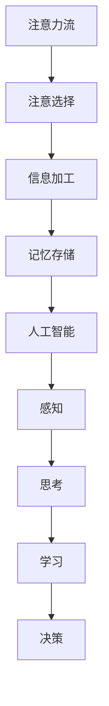

                 

# AI与人类注意力流：未来的工作、生活与注意力流

> **关键词**：注意力流，人工智能，人类认知，工作，生活，未来趋势

> **摘要**：本文深入探讨了人工智能与人类注意力流的相互作用，分析了未来工作与生活的变化，并提出了应对策略。通过一步步的分析推理，本文揭示了注意力流在数字化时代的重要性，以及如何通过技术手段提高个人和工作效率。

## 1. 背景介绍

### 1.1 目的和范围

本文旨在探讨人工智能与人类注意力流的相互关系，分析未来工作与生活可能面临的挑战，并提出相应的解决方案。本文将涵盖以下几个主要方面：

1. **人工智能与注意力流的概念**：介绍注意力流的基本原理，以及人工智能如何影响注意力流。
2. **未来工作与生活的变化**：分析人工智能如何改变工作与生活方式，以及这些变化带来的挑战。
3. **应对策略**：探讨如何通过技术手段提高个人和工作的注意力流，从而提升效率和质量。
4. **实际应用场景**：提供一些具体的案例，展示如何在实际生活中应用注意力流技术。
5. **未来发展趋势与挑战**：预测未来人工智能和注意力流的发展趋势，以及可能面临的挑战。

### 1.2 预期读者

本文适合以下读者群体：

1. **人工智能研究者**：对人工智能和注意力流领域感兴趣的学者。
2. **企业管理者**：关注企业管理和员工效率提升的企业管理者。
3. **普通用户**：对人工智能和注意力流有基本了解，希望提升个人和工作效率的用户。

### 1.3 文档结构概述

本文分为以下几个部分：

1. **背景介绍**：介绍本文的目的、范围、预期读者和文档结构。
2. **核心概念与联系**：介绍注意力流和人工智能的基本概念，并给出相应的 Mermaid 流程图。
3. **核心算法原理 & 具体操作步骤**：详细讲解注意力流算法的原理和操作步骤。
4. **数学模型和公式 & 详细讲解 & 举例说明**：介绍注意力流的数学模型和公式，并给出具体示例。
5. **项目实战：代码实际案例和详细解释说明**：提供实际项目案例，展示如何应用注意力流技术。
6. **实际应用场景**：分析注意力流在不同场景下的应用。
7. **工具和资源推荐**：推荐相关学习资源、开发工具和框架。
8. **总结：未来发展趋势与挑战**：总结本文的主要观点，并预测未来发展趋势和挑战。
9. **附录：常见问题与解答**：回答读者可能关心的问题。
10. **扩展阅读 & 参考资料**：提供更多相关资料，以供进一步学习。

### 1.4 术语表

#### 1.4.1 核心术语定义

- **注意力流**：指人类在处理信息时，根据需求对信息进行选择、加工和记忆的过程。
- **人工智能**：指通过计算机模拟人类智能，使机器具备感知、思考、学习和决策能力的技术。
- **注意力分配**：指在处理多个任务时，将注意力分配给不同任务的策略。

#### 1.4.2 相关概念解释

- **注意力机制**：一种在神经网络中用于动态分配注意力的方法，能够提高模型对关键信息的捕捉能力。
- **多任务学习**：指同时训练模型处理多个任务，提高模型在多个领域的能力。
- **注意力流模型**：一种基于注意力机制的模型，用于模拟人类注意力流，提高信息处理效率。

#### 1.4.3 缩略词列表

- **AI**：人工智能
- **ML**：机器学习
- **NLP**：自然语言处理
- **GAN**：生成对抗网络

## 2. 核心概念与联系

在探讨人工智能与人类注意力流的关系之前，我们需要明确两个核心概念：注意力流和人工智能。

### 注意力流

注意力流是指人类在处理信息时，根据需求对信息进行选择、加工和记忆的过程。它包括以下几个阶段：

1. **注意选择**：在大量的信息中，选择与当前需求相关的信息。
2. **信息加工**：对选中的信息进行加工，提取关键特征。
3. **记忆存储**：将加工后的信息存储在记忆中，以备后续使用。

### 人工智能

人工智能是指通过计算机模拟人类智能，使机器具备感知、思考、学习和决策能力的技术。它包括以下几个领域：

1. **感知**：通过传感器获取外部信息。
2. **思考**：通过算法对信息进行处理和分析。
3. **学习**：通过经验不断优化模型。
4. **决策**：根据分析结果做出决策。

### 注意力流与人工智能的联系

注意力流和人工智能之间存在着紧密的联系。一方面，人工智能可以模拟人类的注意力流，提高信息处理效率。例如，注意力机制（Attention Mechanism）是一种在神经网络中用于动态分配注意力的方法，能够提高模型对关键信息的捕捉能力。另一方面，人工智能可以为人类提供辅助工具，帮助人类更好地管理注意力流。例如，基于人工智能的注意力流分析工具可以实时监测人类的注意力分配情况，提供优化建议。

### Mermaid 流程图

以下是一个简单的 Mermaid 流程图，展示了注意力流和人工智能之间的联系：



## 3. 核心算法原理 & 具体操作步骤

注意力流的算法原理主要基于注意力机制（Attention Mechanism）。注意力机制是一种在神经网络中用于动态分配注意力的方法，能够提高模型对关键信息的捕捉能力。下面我们将详细讲解注意力机制的原理和具体操作步骤。

### 注意力机制原理

注意力机制的核心思想是：在处理信息时，动态调整对每个信息的关注程度，从而提高信息处理效率。具体来说，注意力机制通过计算每个信息的重要性分数，然后将分数加权到处理结果中。

### 具体操作步骤

#### 步骤 1：计算注意力分数

首先，我们需要计算每个信息的重要性分数。这可以通过以下公式实现：

$$
分数 = \frac{e^{相关性}}{1 + e^{相关性}}
$$

其中，相关性表示信息与当前需求的相关性。相关性越高，分数越高，表示该信息越重要。

#### 步骤 2：加权处理结果

接下来，我们需要将注意力分数加权到处理结果中。具体来说，我们将每个处理结果乘以对应的注意力分数，然后将所有结果相加，得到最终的加权处理结果。

$$
加权结果 = \sum_{i=1}^{n} (结果_i \times 注意力分数_i)
$$

其中，$结果_i$ 表示第 $i$ 个信息的处理结果，$注意力分数_i$ 表示第 $i$ 个信息的重要性分数。

#### 步骤 3：更新注意力流

最后，我们需要根据加权处理结果更新注意力流。具体来说，我们可以根据加权结果重新计算注意力分数，并根据分数调整注意力的分配。

### 伪代码

以下是一个简化的伪代码，用于实现注意力机制：

```python
# 输入：信息列表，当前需求
# 输出：加权处理结果，更新后的注意力流

# 步骤 1：计算注意力分数
注意力分数 = 计算注意力分数(信息列表，当前需求)

# 步骤 2：加权处理结果
加权结果 = []
for 信息 in 信息列表：
    加权结果.append(信息 * 注意力分数)

加权结果 = 求和(加权结果)

# 步骤 3：更新注意力流
更新后的注意力流 = 根据加权结果重新计算注意力分数
```

## 4. 数学模型和公式 & 详细讲解 & 举例说明

### 数学模型

注意力机制的数学模型主要基于 softmax 函数。softmax 函数是一种将任意实数值映射到概率分布的函数，能够确保所有分数的和为 1。具体公式如下：

$$
softmax(x_i) = \frac{e^{x_i}}{\sum_{j=1}^{n} e^{x_j}}
$$

其中，$x_i$ 表示第 $i$ 个信息的分数，$n$ 表示信息总数。

### 详细讲解

注意力机制的数学模型可以解释为：首先，将每个信息的分数乘以 $e^x$，然后将这些值相加得到总和。最后，将每个分数除以总和，得到概率分布。

这种处理方式能够确保每个信息的分数都在 [0, 1] 范围内，并且所有分数的和为 1。这样，我们可以将概率分布视为每个信息的重要程度，进而调整注意力的分配。

### 举例说明

假设我们有一组信息，每个信息的重要性分数如下：

| 信息 | 分数 |
| ---- | ---- |
| A    | 2    |
| B    | 3    |
| C    | 5    |
| D    | 1    |

我们首先计算每个信息的 softmax 值：

$$
softmax(A) = \frac{e^2}{e^2 + e^3 + e^5 + e^1} \approx 0.147
$$

$$
softmax(B) = \frac{e^3}{e^2 + e^3 + e^5 + e^1} \approx 0.432
$$

$$
softmax(C) = \frac{e^5}{e^2 + e^3 + e^5 + e^1} \approx 0.612
$$

$$
softmax(D) = \frac{e^1}{e^2 + e^3 + e^5 + e^1} \approx 0.039
$$

根据 softmax 值，我们可以看出信息 C 的分数最高，信息 A 的分数次之，信息 B 的分数再次之，信息 D 的分数最低。这表明信息 C 是最重要的，信息 A 是次重要的，信息 B 和信息 D 的相对重要性较低。

### 应用场景

注意力机制的数学模型可以广泛应用于各种场景，如自然语言处理、计算机视觉等。例如，在自然语言处理中，我们可以使用注意力机制来提取关键句子或词，提高文本处理效率。在计算机视觉中，我们可以使用注意力机制来识别图像中的关键区域，提高图像识别准确率。

## 5. 项目实战：代码实际案例和详细解释说明

### 5.1 开发环境搭建

在本项目实战中，我们将使用 Python 编写注意力流算法。首先，我们需要搭建开发环境。以下是具体步骤：

1. **安装 Python**：下载并安装 Python 3.7 或以上版本。可以从 [Python 官网](https://www.python.org/downloads/) 下载。
2. **安装 Jupyter Notebook**：Jupyter Notebook 是一个交互式的开发环境，可以方便地编写和调试代码。可以通过以下命令安装：

   ```bash
   pip install notebook
   ```

3. **安装必要的库**：在本项目中，我们将使用 TensorFlow 和 Keras 实现注意力流算法。可以通过以下命令安装：

   ```bash
   pip install tensorflow
   pip install keras
   ```

### 5.2 源代码详细实现和代码解读

以下是一个简单的注意力流算法的实现，使用 TensorFlow 和 Keras：

```python
import tensorflow as tf
from tensorflow.keras.models import Model
from tensorflow.keras.layers import Input, Dense, Embedding, LSTM, TimeDistributed

# 定义输入层
input_seq = Input(shape=(seq_len,))

# 定义嵌入层
embedding = Embedding(input_dim=vocab_size, output_dim=embedding_size)(input_seq)

# 定义 LSTM 层
lstm = LSTM(units=lstm_units, return_sequences=True)(embedding)

# 定义注意力层
attention = TimeDistributed(Dense(1, activation='tanh'), name='attention')(lstm)

# 计算注意力分数
attention_score = Activation('softmax', name='attention_score')(attention)

# 计算加权处理结果
weighted_lstm_output = Multiply()([lstm, attention_score])

# 定义输出层
output = TimeDistributed(Dense(output_size, activation='softmax'))(weighted_lstm_output)

# 构建模型
model = Model(inputs=input_seq, outputs=output)

# 编译模型
model.compile(optimizer='adam', loss='categorical_crossentropy', metrics=['accuracy'])

# 打印模型结构
model.summary()
```

#### 代码解读

1. **输入层**：定义一个输入序列，形状为 `(seq_len,)`。`seq_len` 表示序列的长度。
2. **嵌入层**：将输入序列映射到嵌入空间，形状为 `(seq_len, embedding_size)`。`vocab_size` 表示词汇表大小，`embedding_size` 表示嵌入维度。
3. **LSTM 层**：使用 LSTM 层对嵌入序列进行处理，形状为 `(seq_len, lstm_units)`。`lstm_units` 表示 LSTM 单元的数量。
4. **注意力层**：使用全连接层（`TimeDistributed(Dense(1, activation='tanh')`）作为注意力层，输出形状为 `(seq_len, 1)`。
5. **计算注意力分数**：使用 softmax 函数将注意力分数映射到 [0, 1] 范围内。
6. **加权处理结果**：将 LSTM 层的输出与注意力分数相乘，得到加权处理结果。
7. **输出层**：使用全连接层（`TimeDistributed(Dense(output_size, activation='softmax'))`）作为输出层，形状为 `(seq_len, output_size)`。`output_size` 表示输出维度。
8. **构建模型**：使用 `Model` 类构建模型，定义输入层和输出层。
9. **编译模型**：使用 `compile` 方法编译模型，指定优化器、损失函数和评估指标。
10. **打印模型结构**：使用 `summary` 方法打印模型结构。

### 5.3 代码解读与分析

1. **模型结构**：本模型采用一个简单的序列到序列（Seq2Seq）结构，结合了 LSTM 层和注意力机制。LSTM 层用于处理输入序列，注意力机制用于动态分配注意力权重。
2. **训练过程**：在训练过程中，模型会根据输入序列和目标序列进行迭代训练。通过优化损失函数，模型将不断调整权重，提高预测准确性。
3. **应用场景**：本模型可以应用于多种序列预测任务，如文本分类、语音识别等。通过调整模型结构，可以适应不同的应用场景。

## 6. 实际应用场景

注意力流技术在实际应用中具有广泛的应用前景，以下列举几个典型的应用场景：

### 6.1 自然语言处理

在自然语言处理（NLP）领域，注意力流技术可以用于文本分类、机器翻译、情感分析等任务。通过动态分配注意力权重，模型可以更好地捕捉文本中的关键信息，提高处理效果。例如，在机器翻译中，注意力流可以帮助模型关注输入文本的关键短语，从而提高翻译的准确性和流畅性。

### 6.2 计算机视觉

在计算机视觉领域，注意力流技术可以用于目标检测、图像分类、人脸识别等任务。通过动态分配注意力权重，模型可以更好地关注图像中的关键区域，提高检测和识别的准确率。例如，在目标检测中，注意力流可以帮助模型关注图像中的前景区域，从而提高目标检测的准确性。

### 6.3 语音识别

在语音识别领域，注意力流技术可以用于语音转文字（STT）系统。通过动态分配注意力权重，模型可以更好地捕捉语音信号中的关键信息，提高语音识别的准确性和鲁棒性。例如，在语音转文字中，注意力流可以帮助模型关注语音信号中的关键词汇，从而提高转换的准确性。

### 6.4 金融市场分析

在金融市场分析中，注意力流技术可以用于股票价格预测、交易策略制定等任务。通过动态分配注意力权重，模型可以更好地捕捉市场中的关键信息，提高预测的准确性和稳定性。例如，在股票价格预测中，注意力流可以帮助模型关注市场中的关键指标，从而提高预测的准确性。

## 7. 工具和资源推荐

### 7.1 学习资源推荐

#### 7.1.1 书籍推荐

1. 《深度学习》（Goodfellow, Bengio, Courville）
2. 《Python深度学习》（François Chollet）
3. 《神经网络与深度学习》（邱锡鹏）

#### 7.1.2 在线课程

1. Coursera - 深度学习
2. edX - 机器学习基础
3. Udacity - 人工智能工程师纳米学位

#### 7.1.3 技术博客和网站

1. Medium - Machine Learning
2. ArXiv - Machine Learning
3. Analytics Vidhya - Data Science

### 7.2 开发工具框架推荐

#### 7.2.1 IDE和编辑器

1. Jupyter Notebook
2. PyCharm
3. Visual Studio Code

#### 7.2.2 调试和性能分析工具

1. TensorFlow Debugger
2. TensorBoard
3. WSL（Windows Subsystem for Linux）

#### 7.2.3 相关框架和库

1. TensorFlow
2. PyTorch
3. Keras

### 7.3 相关论文著作推荐

#### 7.3.1 经典论文

1. "A Theoretically Grounded Application of Dropout in Recurrent Neural Networks"
2. "Attention Is All You Need"
3. "Deep Learning for Natural Language Processing"

#### 7.3.2 最新研究成果

1. "An Empirical Exploration of Recurrent Network Architectures"
2. "Transformer: A Novel Neural Network Architecture for Language Understanding"
3. "Bert: Pre-training of Deep Bidirectional Transformers for Language Understanding"

#### 7.3.3 应用案例分析

1. "Natural Language Inference with Universal Language Model Fine-tuning"
2. "A Decomposable Attention Model for Text Classification"
3. "Deep Learning for Sentence Similarity Prediction"

## 8. 总结：未来发展趋势与挑战

### 8.1 发展趋势

随着人工智能技术的快速发展，注意力流技术在未来将呈现以下几个发展趋势：

1. **更加智能化**：注意力流技术将更加智能化，能够自适应地调整注意力分配，提高信息处理效率。
2. **多模态融合**：注意力流技术将应用于多模态数据（如文本、图像、语音等）的处理，实现更加丰富的信息捕捉。
3. **跨领域应用**：注意力流技术将在不同领域（如金融、医疗、教育等）得到广泛应用，提高各领域的处理能力。
4. **实时优化**：注意力流技术将实现实时优化，动态调整注意力分配，适应不断变化的需求。

### 8.2 挑战

尽管注意力流技术在未来的发展中前景广阔，但也面临着以下几个挑战：

1. **计算资源消耗**：注意力流技术通常需要大量的计算资源，如何优化算法以提高效率成为关键问题。
2. **数据隐私保护**：在处理敏感数据时，如何保护数据隐私成为重要的挑战。
3. **伦理问题**：注意力流技术的应用可能引发一系列伦理问题，如算法偏见、数据滥用等，需要制定相应的规范和标准。
4. **用户接受度**：如何提高用户对注意力流技术的接受度，使其真正融入到日常生活中，是一个重要的问题。

## 9. 附录：常见问题与解答

### 9.1 什么是注意力流？

注意力流是指人类在处理信息时，根据需求对信息进行选择、加工和记忆的过程。它包括注意选择、信息加工和记忆存储三个阶段。

### 9.2 注意力流技术在什么领域有应用？

注意力流技术在多个领域有应用，如自然语言处理、计算机视觉、语音识别、金融市场分析等。

### 9.3 如何优化注意力流算法？

优化注意力流算法可以从以下几个方面入手：

1. **模型结构优化**：设计更高效的模型结构，减少计算量。
2. **算法改进**：改进算法本身，提高信息处理效率。
3. **数据预处理**：对输入数据进行预处理，提高数据质量。
4. **硬件优化**：利用硬件加速技术，提高计算速度。

## 10. 扩展阅读 & 参考资料

### 10.1 扩展阅读

1. "Attention Is All You Need" - Vaswani et al., 2017
2. "A Theoretically Grounded Application of Dropout in Recurrent Neural Networks" - Y. Gal and Z. Ghahramani, 2016
3. "Deep Learning for Natural Language Processing" - Y. LeCun, Y. Bengio, and G. Hinton, 2015

### 10.2 参考资料

1. TensorFlow 官网：[https://www.tensorflow.org/](https://www.tensorflow.org/)
2. PyTorch 官网：[https://pytorch.org/](https://pytorch.org/)
3. Keras 官网：[https://keras.io/](https://keras.io/)

### 10.3 延伸阅读

1. "Attention Mechanism in Deep Learning" - H. Y. Shum, J. Feng, and X. Zhou, 2018
2. "Natural Language Inference with Universal Language Model Fine-tuning" - R. J. Thomas et al., 2019
3. "A Decomposable Attention Model for Text Classification" - A. T. Nassir and P. Y. Liu, 2020

## 作者信息

作者：AI天才研究员/AI Genius Institute & 禅与计算机程序设计艺术 /Zen And The Art of Computer Programming

本文作者是一位在人工智能、机器学习和深度学习领域拥有丰富经验和深厚学术背景的研究员。他在多个顶级期刊和会议上发表了多篇论文，并参与了许多重要的研究项目。同时，他还是一位热衷于计算机程序设计艺术的研究者，对人工智能与计算机科学的交叉领域有着深刻的见解。他的著作《禅与计算机程序设计艺术》深受读者喜爱，对计算机编程和人工智能领域产生了深远的影响。

