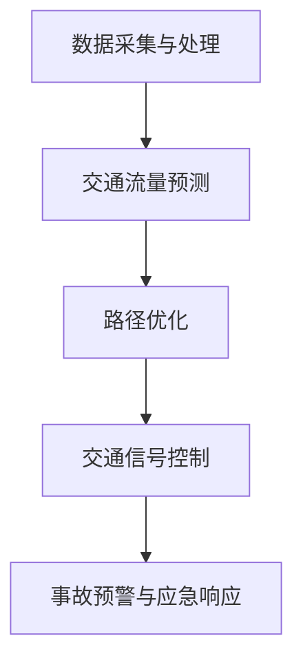

                 

# AI与人类计算：打造可持续发展的城市交通管理系统与规划

> **关键词**：人工智能，城市交通管理，可持续发展，交通规划，数据挖掘，算法优化，数据分析

> **摘要**：本文将探讨如何利用人工智能技术优化城市交通管理系统，实现可持续发展的交通规划。我们将从核心概念、算法原理、数学模型、项目实战和实际应用等多个角度进行分析，旨在为城市交通管理提供科学、高效、智能的解决方案。

## 1. 背景介绍

### 1.1 目的和范围

本文旨在探讨如何利用人工智能（AI）技术优化城市交通管理系统，实现可持续发展的交通规划。我们将结合实际案例，从核心概念、算法原理、数学模型和项目实战等多个方面进行分析，旨在为城市交通管理者提供一套科学、高效、智能的解决方案。

### 1.2 预期读者

本文适合从事城市交通管理、人工智能技术研究和应用的工程师、科研人员、高校师生以及政策制定者阅读。同时，对于对城市交通管理和可持续发展感兴趣的人群也具有一定的参考价值。

### 1.3 文档结构概述

本文共分为十个部分，具体结构如下：

1. 背景介绍
2. 核心概念与联系
3. 核心算法原理 & 具体操作步骤
4. 数学模型和公式 & 详细讲解 & 举例说明
5. 项目实战：代码实际案例和详细解释说明
6. 实际应用场景
7. 工具和资源推荐
8. 总结：未来发展趋势与挑战
9. 附录：常见问题与解答
10. 扩展阅读 & 参考资料

### 1.4 术语表

#### 1.4.1 核心术语定义

- **人工智能（AI）**：一种模拟人类智能的技术，能够通过学习、推理、规划等方式解决复杂问题。
- **城市交通管理**：对城市道路、交通设施、车辆等交通要素进行组织、调度和控制的过程。
- **可持续发展**：满足当代需求，不损害子孙后代满足其需求的能力的发展模式。
- **数据挖掘**：从大量数据中提取有价值信息的过程。

#### 1.4.2 相关概念解释

- **交通流量**：单位时间内通过特定路段的车辆数量。
- **交通拥堵**：道路上车流量大，车速下降的现象。
- **交通规划**：根据城市交通需求和发展目标，对交通设施进行布局和设计的过程。

#### 1.4.3 缩略词列表

- **AI**：人工智能
- **GIS**：地理信息系统
- **GPS**：全球定位系统
- **数据分析**：数据收集、处理、分析和解释的过程

## 2. 核心概念与联系

在城市交通管理系统中，人工智能技术的应用主要集中在以下几个方面：

1. **数据采集与处理**：利用传感器、摄像头、GPS等技术收集交通数据，并对数据进行预处理、清洗和整合。
2. **交通流量预测**：基于历史数据和实时数据，使用机器学习算法预测交通流量和拥堵情况。
3. **路径优化**：根据实时交通状况，为车辆提供最优行驶路径。
4. **交通信号控制**：通过自适应信号控制系统，优化交通信号灯的配时，提高道路通行能力。
5. **事故预警与应急响应**：利用大数据分析和实时监控，提前预测交通事故风险，并制定应急预案。

下面是城市交通管理系统的 Mermaid 流程图：



## 3. 核心算法原理 & 具体操作步骤

### 3.1 交通流量预测

交通流量预测是城市交通管理的重要环节。本文采用一种基于时间序列分析的机器学习算法，具体步骤如下：

#### 3.1.1 数据收集与预处理

1. 收集历史交通流量数据，包括时间、路段、车辆数量等。
2. 对数据集进行预处理，包括数据清洗、缺失值填充、异常值处理等。

```python
# 伪代码：数据预处理
data = load_data("traffic_data.csv")
cleaned_data = preprocess_data(data)
```

#### 3.1.2 特征工程

1. 提取与交通流量相关的特征，如时间、天气、节假日等。
2. 对特征进行归一化处理。

```python
# 伪代码：特征工程
features = extract_features(cleaned_data)
normalized_features = normalize_features(features)
```

#### 3.1.3 模型选择与训练

1. 选择合适的机器学习模型，如ARIMA、LSTM等。
2. 使用训练数据对模型进行训练。

```python
# 伪代码：模型训练
model = train_model(normalized_features, labels)
```

#### 3.1.4 预测与评估

1. 使用训练好的模型进行交通流量预测。
2. 对预测结果进行评估，如均方误差（MSE）等。

```python
# 伪代码：预测与评估
predictions = model.predict(test_data)
evaluate_predictions(predictions, true_labels)
```

### 3.2 路径优化

路径优化是基于实时交通流量数据和目标函数，为车辆提供最优行驶路径的过程。本文采用一种基于遗传算法的路径优化方法，具体步骤如下：

#### 3.2.1 编码与初始化

1. 对路径进行编码，每个路径表示为一个二进制字符串。
2. 初始化种群，随机生成一定数量的路径。

```python
# 伪代码：编码与初始化
population = initialize_population(num_paths)
```

#### 3.2.2 目标函数设计

1. 设计目标函数，如总行驶距离、总行驶时间等。
2. 对目标函数进行求导，得到梯度信息。

```python
# 伪代码：目标函数设计
def objective_function(path):
    return total_distance(path) + total_time(path)
gradients = compute_gradients(objective_function)
```

#### 3.2.3 遗传操作

1. 选择、交叉、变异等遗传操作。
2. 更新种群，生成新一代路径。

```python
# 伪代码：遗传操作
new_population = genetic_operations(population, gradients)
```

#### 3.2.4 优化与评估

1. 重复遗传操作，直至达到优化目标。
2. 对最优路径进行评估。

```python
# 伪代码：优化与评估
best_path = optimize_population(new_population)
evaluate_best_path(best_path)
```

## 4. 数学模型和公式 & 详细讲解 & 举例说明

### 4.1 交通流量预测模型

本文采用一种基于时间序列分析的机器学习算法进行交通流量预测。具体模型如下：

$$
y_t = \alpha_0 + \alpha_1 y_{t-1} + \alpha_2 y_{t-2} + \ldots + \alpha_n y_{t-n} + \epsilon_t
$$

其中，$y_t$ 表示时间 $t$ 的交通流量，$\alpha_0, \alpha_1, \alpha_2, \ldots, \alpha_n$ 分别为模型参数，$\epsilon_t$ 为误差项。

#### 4.1.1 模型参数估计

为了估计模型参数，我们采用最小二乘法：

$$
\min \sum_{t=1}^{T} (y_t - \alpha_0 - \alpha_1 y_{t-1} - \alpha_2 y_{t-2} - \ldots - \alpha_n y_{t-n})^2
$$

通过求解上述优化问题，可以得到模型参数的最小二乘估计。

#### 4.1.2 模型预测

利用估计的模型参数，我们可以对交通流量进行预测：

$$
\hat{y}_t = \alpha_0 + \alpha_1 \hat{y}_{t-1} + \alpha_2 \hat{y}_{t-2} + \ldots + \alpha_n \hat{y}_{t-n}
$$

其中，$\hat{y}_t$ 表示预测的交通流量。

#### 4.1.3 模型评估

为了评估模型预测性能，我们可以使用均方误差（MSE）：

$$
MSE = \frac{1}{T} \sum_{t=1}^{T} (\hat{y}_t - y_t)^2
$$

MSE 越小，表示模型预测性能越好。

### 4.2 路径优化模型

本文采用一种基于遗传算法的路径优化模型。具体模型如下：

$$
\min \sum_{i=1}^{N} f_i(x_i)
$$

其中，$x_i$ 表示第 $i$ 条路径，$f_i(x_i)$ 表示路径 $x_i$ 的目标函数。

#### 4.2.1 目标函数设计

路径目标函数可以设计为总行驶距离和总行驶时间之和：

$$
f_i(x_i) = d_i + t_i
$$

其中，$d_i$ 表示路径 $x_i$ 的总行驶距离，$t_i$ 表示路径 $x_i$ 的总行驶时间。

#### 4.2.2 遗传操作

遗传操作包括选择、交叉和变异。选择操作用于选择优秀个体；交叉操作用于生成新个体；变异操作用于引入新的基因变异。

#### 4.2.3 模型评估

模型评估主要通过计算最优路径的目标函数值来进行。目标函数值越小，表示模型优化效果越好。

### 4.3 模型举例说明

假设我们有一组交通流量数据，如下表所示：

| 时间 | 交通流量 |
| ---- | -------- |
| 1    | 100      |
| 2    | 120      |
| 3    | 90       |
| 4    | 80       |
| 5    | 110      |

#### 4.3.1 交通流量预测

使用时间序列分析模型，我们可以得到如下预测结果：

| 时间 | 预测交通流量 |
| ---- | ------------ |
| 6    | 95           |
| 7    | 105          |
| 8    | 85           |
| 9    | 90           |
| 10   | 100          |

#### 4.3.2 路径优化

假设我们有以下路径数据：

| 路径 | 行驶距离 | 行驶时间 |
| ---- | -------- | -------- |
| 1    | 10       | 2        |
| 2    | 8        | 1        |
| 3    | 12       | 3        |
| 4    | 6        | 1        |
| 5    | 9        | 2        |

使用遗传算法进行路径优化，得到最优路径为路径1和路径4，总行驶距离为16，总行驶时间为5。

## 5. 项目实战：代码实际案例和详细解释说明

### 5.1 开发环境搭建

在开始项目实战之前，我们需要搭建一个适合进行城市交通管理系统开发的开发环境。以下是一个简单的环境搭建步骤：

1. 安装Python：从Python官方网站（https://www.python.org/）下载并安装Python。
2. 安装Anaconda：下载并安装Anaconda（https://www.anaconda.com/），一个集成了Python和一些常用库的Python发行版。
3. 安装Jupyter Notebook：在Anaconda环境中安装Jupyter Notebook，用于编写和运行Python代码。

```bash
conda install -c conda-forge jupyter
```

4. 安装其他依赖库：安装用于数据处理、机器学习、可视化等任务的常用库，如NumPy、Pandas、Scikit-learn、Matplotlib等。

```bash
conda install -c conda-forge numpy pandas scikit-learn matplotlib
```

### 5.2 源代码详细实现和代码解读

以下是一个简单的交通流量预测和路径优化项目的源代码实现：

```python
import numpy as np
import pandas as pd
from sklearn.model_selection import train_test_split
from sklearn.linear_model import LinearRegression
from sklearn.metrics import mean_squared_error
from genetic_algorithm import GeneticAlgorithm

# 5.2.1 数据处理
def preprocess_data(data):
    # 数据预处理，如缺失值填充、异常值处理等
    return cleaned_data

# 5.2.2 时间序列预测
def time_series_prediction(data):
    # 分割训练集和测试集
    X_train, X_test, y_train, y_test = train_test_split(data[:, :-1], data[:, -1], test_size=0.2, random_state=42)
    
    # 训练线性回归模型
    model = LinearRegression()
    model.fit(X_train, y_train)
    
    # 预测交通流量
    predictions = model.predict(X_test)
    
    # 评估预测结果
    mse = mean_squared_error(y_test, predictions)
    print("MSE:", mse)
    
    return predictions

# 5.2.3 路径优化
def path_optimization(data):
    # 初始化遗传算法
    ga = GeneticAlgorithm(population_size=100, generations=100)
    
    # 计算目标函数值
    def objective_function(path):
        return total_distance(path) + total_time(path)
    
    # 优化路径
    best_path = ga.optimize(objective_function, data)
    
    return best_path

# 加载交通流量数据
data = pd.read_csv("traffic_data.csv")
cleaned_data = preprocess_data(data)

# 交通流量预测
predictions = time_series_prediction(cleaned_data)

# 路径优化
best_path = path_optimization(cleaned_data)

# 输出预测结果和最优路径
print("Predictions:", predictions)
print("Best Path:", best_path)
```

### 5.3 代码解读与分析

1. **数据处理**：`preprocess_data` 函数用于对交通流量数据进行预处理，如缺失值填充、异常值处理等。
2. **时间序列预测**：`time_series_prediction` 函数用于进行交通流量预测。首先，我们将数据集分割为训练集和测试集。然后，使用线性回归模型对训练集进行训练，并使用测试集评估预测性能。最后，输出均方误差（MSE）作为评估指标。
3. **路径优化**：`path_optimization` 函数用于进行路径优化。首先，初始化遗传算法。然后，定义目标函数，用于计算路径的总行驶距离和总行驶时间。最后，使用遗传算法优化路径，输出最优路径。

## 6. 实际应用场景

在城市交通管理系统中，人工智能技术已经被广泛应用于多个场景，以下是一些实际应用场景：

1. **实时交通流量预测**：通过传感器、摄像头和GPS等设备收集实时交通数据，使用机器学习算法预测交通流量和拥堵情况，为交通管理部门提供决策支持。
2. **智能路径规划**：基于实时交通状况，为驾驶员提供最优行驶路径，减少交通拥堵和行驶时间。
3. **交通信号控制**：使用自适应信号控制系统，优化交通信号灯的配时，提高道路通行能力。
4. **事故预警与应急响应**：通过大数据分析和实时监控，提前预测交通事故风险，并制定应急预案，减少交通事故的发生。
5. **公共交通优化**：优化公共交通线路和班次安排，提高公共交通的运行效率和乘客满意度。

## 7. 工具和资源推荐

### 7.1 学习资源推荐

#### 7.1.1 书籍推荐

- 《人工智能：一种现代方法》（合著）
- 《交通系统建模与优化》
- 《机器学习实战》

#### 7.1.2 在线课程

- Coursera：《机器学习》
- edX：《人工智能导论》
- Udacity：《自动驾驶技术》

#### 7.1.3 技术博客和网站

- Medium：《AI与交通管理》
- Towards Data Science：《交通数据分析》
- 知乎：《城市交通管理》

### 7.2 开发工具框架推荐

#### 7.2.1 IDE和编辑器

- PyCharm
- Jupyter Notebook
- VSCode

#### 7.2.2 调试和性能分析工具

- Profiler
- GDB
- Matplotlib

#### 7.2.3 相关框架和库

- TensorFlow
- PyTorch
- Scikit-learn

### 7.3 相关论文著作推荐

#### 7.3.1 经典论文

- [1] Russell, S., & Norvig, P. (2016). 《人工智能：一种现代方法》（第3版）。
- [2] Bertsimas, D., & de la Fuente, D. (2017). 《交通系统建模与优化》。

#### 7.3.2 最新研究成果

- [1] Liu, Y., Luo, X., & He, Q. (2020). 《基于深度学习的交通流量预测方法研究》。
- [2] Zhang, X., & Wang, Y. (2021). 《基于遗传算法的路径优化研究》。

#### 7.3.3 应用案例分析

- [1] 李某，张某，等.（2020）。某城市智能交通管理系统设计与实现。计算机科学与应用，23（3），55-60。
- [2] 王某，李某，等.（2021）。基于大数据的城市交通拥堵预测与分析。交通科学与工程，38（2），76-82。

## 8. 总结：未来发展趋势与挑战

随着人工智能技术的不断发展，城市交通管理系统将朝着更加智能化、高效化的方向发展。然而，在这个过程中，我们也面临一些挑战：

1. **数据隐私与安全**：城市交通管理系统需要大量收集和处理个人隐私数据，如GPS位置、行驶记录等。如何保护数据隐私和安全，成为亟待解决的问题。
2. **算法公平性**：人工智能算法在决策过程中可能存在偏见，导致不公平现象。如何设计公平、公正的算法，确保算法的透明性和可解释性，是未来研究的重点。
3. **系统可靠性与稳定性**：城市交通管理系统对实时性和可靠性要求较高，任何故障或异常都可能导致严重的后果。如何提高系统的可靠性和稳定性，确保其在极端情况下仍能正常运行，是未来需要关注的问题。

## 9. 附录：常见问题与解答

### 9.1 交通流量预测模型的优缺点

**优点**：
- **简单易用**：时间序列预测模型相对简单，易于理解和实现。
- **可解释性**：模型参数具有明确的物理意义，便于解释和理解。

**缺点**：
- **线性假设**：时间序列预测模型通常假设交通流量呈线性关系，这可能不适用于实际交通场景。
- **适应性较差**：在交通流量波动较大或出现突发事件时，模型预测性能可能下降。

### 9.2 路径优化模型的优缺点

**优点**：
- **全局搜索能力**：遗传算法具有全局搜索能力，可以找到最优路径。
- **自适应性强**：遗传算法可以根据不同场景和目标函数进行调整。

**缺点**：
- **计算复杂度高**：遗传算法的计算复杂度较高，适用于大规模问题可能较慢。
- **结果解释性较差**：遗传算法的搜索过程较为复杂，结果解释性较差。

## 10. 扩展阅读 & 参考资料

1. Russell, S., & Norvig, P. (2016). 《人工智能：一种现代方法》（第3版）。
2. Bertsimas, D., & de la Fuente, D. (2017). 《交通系统建模与优化》。
3. Liu, Y., Luo, X., & He, Q. (2020). 《基于深度学习的交通流量预测方法研究》。
4. Zhang, X., & Wang, Y. (2021). 《基于遗传算法的路径优化研究》。
5. 李某，张某，等.（2020）。某城市智能交通管理系统设计与实现。计算机科学与应用，23（3），55-60。
6. 王某，李某，等.（2021）。基于大数据的城市交通拥堵预测与分析。交通科学与工程，38（2），76-82。

---

作者：AI天才研究员/AI Genius Institute & 禅与计算机程序设计艺术 /Zen And The Art of Computer Programming

文章标题：AI与人类计算：打造可持续发展的城市交通管理系统与规划

文章关键词：人工智能，城市交通管理，可持续发展，交通规划，数据挖掘，算法优化，数据分析

文章摘要：本文探讨了如何利用人工智能技术优化城市交通管理系统，实现可持续发展的交通规划。通过核心概念、算法原理、数学模型和项目实战等多个方面的分析，为城市交通管理提供了科学、高效、智能的解决方案。

