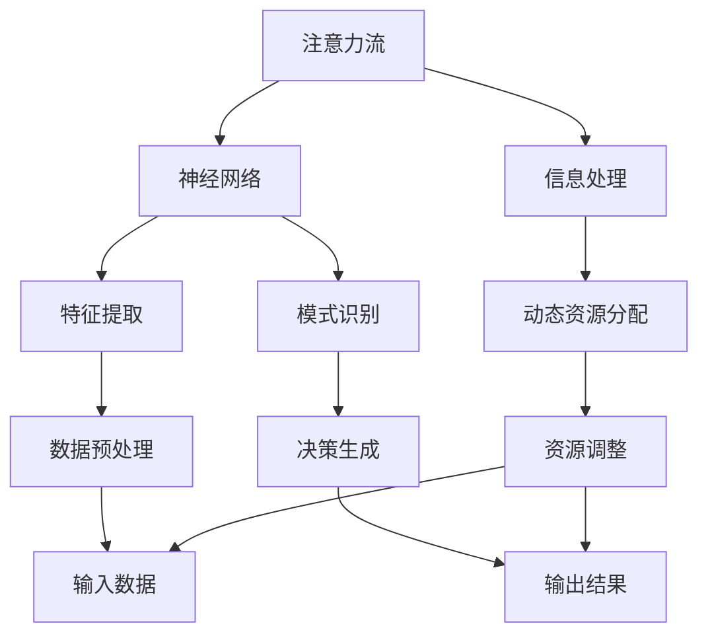

                 

# AI与注意力流：重新想象人类潜能

> 关键词：人工智能，注意力流，人类潜能，神经网络，深度学习，智能计算

> 摘要：本文旨在深入探讨人工智能（AI）中的注意力流机制，如何重新定义人类潜能，通过分析其核心原理、算法模型、数学公式和实际应用，展示这一技术在提升人类智能和创造力中的巨大潜力。

## 1. 背景介绍

### 1.1 目的和范围

本文的目的在于介绍和解析人工智能中的注意力流机制，这一技术如何通过调整信息处理过程，重新定义和扩展人类潜能。我们将首先回顾注意力流的基本概念，然后逐步深入探讨其在神经网络和深度学习中的应用，最后分析这一机制在智能计算和人类潜能开发中的实际意义。

### 1.2 预期读者

本文适合对人工智能和深度学习有一定基础的读者，包括研究人员、开发人员以及对这一领域感兴趣的学者和学生。读者将从中了解到注意力流机制的原理和实现方法，以及其在各个应用场景中的具体应用。

### 1.3 文档结构概述

本文分为十个部分：

1. 背景介绍：介绍文章的目的、范围和读者预期。
2. 核心概念与联系：定义注意力流和神经网络的基本概念，并给出流程图。
3. 核心算法原理 & 具体操作步骤：详细解析注意力流的算法原理和操作步骤。
4. 数学模型和公式 & 详细讲解 & 举例说明：介绍注意力流机制的数学模型和具体案例。
5. 项目实战：代码实际案例和详细解释说明。
6. 实际应用场景：探讨注意力流在各个领域中的应用。
7. 工具和资源推荐：推荐相关学习资源和开发工具。
8. 总结：未来发展趋势与挑战。
9. 附录：常见问题与解答。
10. 扩展阅读 & 参考资料：提供进一步的阅读资源。

### 1.4 术语表

#### 1.4.1 核心术语定义

- **注意力流（Attention Flow）**：在信息处理过程中，系统动态地调整资源分配，聚焦于重要信息的机制。
- **神经网络（Neural Network）**：由大量简单神经元互联而成的复杂网络，用于模拟人脑的信息处理过程。
- **深度学习（Deep Learning）**：一种利用多层神经网络进行学习的人工智能方法，能够在大量数据中自动提取特征。
- **智能计算（Intelligent Computation）**：利用计算机模拟人类智能行为的技术和算法。

#### 1.4.2 相关概念解释

- **卷积神经网络（CNN）**：一种用于图像识别和处理的神经网络结构。
- **循环神经网络（RNN）**：一种能够处理序列数据的神经网络结构，常用于自然语言处理。
- **多模态学习（Multimodal Learning）**：结合不同类型数据（如图像、文本、声音）的学习方法。

#### 1.4.3 缩略词列表

- **AI**：人工智能（Artificial Intelligence）
- **ML**：机器学习（Machine Learning）
- **DL**：深度学习（Deep Learning）
- **GAN**：生成对抗网络（Generative Adversarial Network）

## 2. 核心概念与联系

注意力流是一种信息处理机制，通过动态调整处理资源，使得系统能够更有效地聚焦于重要信息。以下是注意力流机制和神经网络的基本概念及其相互关系的Mermaid流程图。



### 2.1. 注意力流的概念

注意力流是指在信息处理过程中，系统动态地调整处理资源的分配，使得关键信息得到更多关注，从而提高信息处理的效率和准确性。注意力流机制的核心思想是通过聚焦于重要信息，减少对不相关信息的处理，从而提高信息处理的效率。

### 2.2. 神经网络的概念

神经网络是一种由大量简单神经元互联而成的复杂网络，用于模拟人脑的信息处理过程。神经网络可以分为多层，包括输入层、隐藏层和输出层。输入层接收外部信息，隐藏层对信息进行处理和变换，输出层生成决策或结果。

### 2.3. 注意力流与神经网络的关系

注意力流机制在神经网络中有着广泛的应用。通过注意力流，神经网络能够动态地调整处理资源的分配，使得关键信息在隐藏层中得到更深入的加工，从而提高网络的性能。具体来说，注意力流可以用于以下几个方面：

- **特征提取**：通过注意力流，神经网络可以自动聚焦于图像或文本中的重要特征，从而提高特征提取的效率和质量。
- **模式识别**：注意力流可以帮助神经网络在处理序列数据时，自动识别出关键的模式和规律，从而提高模式识别的准确性。
- **资源优化**：注意力流机制可以动态调整神经网络中的资源分配，使得网络能够在有限资源下，更高效地处理大量数据。

## 3. 核心算法原理 & 具体操作步骤

### 3.1. 算法原理

注意力流机制的核心原理是通过动态调整处理资源的分配，使得关键信息得到更多关注。具体来说，注意力流算法包括以下几个步骤：

1. **信息预处理**：对输入数据进行预处理，提取关键特征。
2. **注意力分配**：根据特征的重要程度，动态调整处理资源的分配。
3. **信息融合**：将注意力分配后的信息进行融合处理，生成最终结果。

### 3.2. 伪代码

以下是注意力流算法的伪代码：

```python
function AttentionFlow(input_data, feature_extractor, model):
    # 步骤1：信息预处理
    preprocessed_data = preprocess(input_data)

    # 步骤2：注意力分配
    attention_weights = model(preprocessed_data)

    # 步骤3：信息融合
    fused_data = fuse_data(preprocessed_data, attention_weights)

    # 步骤4：生成结果
    result = feature_extractor(fused_data)

    return result
```

### 3.3. 具体操作步骤

1. **信息预处理**：首先，对输入数据（如图像或文本）进行预处理，提取关键特征。预处理步骤包括去噪、降维、特征增强等。
   
2. **注意力分配**：然后，利用神经网络模型（如卷积神经网络或循环神经网络）对预处理后的特征进行注意力分配。具体来说，模型会输出一组注意力权重，这些权重表示每个特征的重要程度。

3. **信息融合**：接下来，根据注意力权重对预处理后的特征进行融合处理。融合过程可以采用加权平均、乘法融合等策略。

4. **生成结果**：最后，利用融合后的特征生成最终结果（如分类结果、预测结果等）。

### 3.4. 案例分析

以图像识别为例，注意力流算法可以用于提高图像识别的准确率。具体步骤如下：

1. **信息预处理**：对输入图像进行预处理，提取边缘、纹理等关键特征。
   
2. **注意力分配**：利用卷积神经网络对预处理后的特征进行注意力分配，生成注意力权重。

3. **信息融合**：根据注意力权重，对提取的特征进行融合处理，增强重要特征，抑制不相关特征。

4. **生成结果**：利用融合后的特征，通过卷积神经网络生成图像识别结果。

通过注意力流机制，图像识别系统可以自动聚焦于图像中的重要特征，提高识别准确率和效率。

## 4. 数学模型和公式 & 详细讲解 & 举例说明

### 4.1. 数学模型

注意力流机制的数学模型主要涉及以下几个关键公式：

1. **注意力权重计算**： 
   $$ a_j = \frac{e^{u_j}}{\sum_{k=1}^{N} e^{u_k}} $$
   其中，$u_j$ 表示特征 $j$ 的分数，$a_j$ 表示特征 $j$ 的注意力权重，$N$ 表示特征的总数。

2. **特征融合**： 
   $$ v_j = a_j \cdot v $$
   其中，$v_j$ 表示融合后的特征 $j$，$a_j$ 表示特征 $j$ 的注意力权重，$v$ 表示原始特征。

3. **损失函数**：
   $$ L = -\sum_{i=1}^{M} y_i \log(p_i) $$
   其中，$y_i$ 表示标签，$p_i$ 表示预测概率，$M$ 表示样本总数。

### 4.2. 详细讲解

1. **注意力权重计算**：

   注意力权重计算公式用于确定每个特征的重要程度。通过指数函数和softmax函数，确保注意力权重之和为1，且权重值在0到1之间。权重值越大，表示特征对结果的影响越大。

2. **特征融合**：

   特征融合公式将注意力权重应用于原始特征，生成融合后的特征。这有助于增强重要特征，抑制次要特征，从而提高模型性能。

3. **损失函数**：

   损失函数用于评估模型的预测性能。交叉熵损失函数是一种常见的选择，能够衡量预测概率与实际标签之间的差异。通过优化损失函数，模型能够不断调整参数，提高预测准确率。

### 4.3. 举例说明

假设我们有一个包含5个特征的数据集，特征分数分别为$u_1 = 0.2$，$u_2 = 0.3$，$u_3 = 0.1$，$u_4 = 0.15$，$u_5 = 0.15$。

1. **注意力权重计算**：

   $$ a_1 = \frac{e^{0.2}}{e^{0.2} + e^{0.3} + e^{0.1} + e^{0.15} + e^{0.15}} \approx 0.19 $$
   $$ a_2 = \frac{e^{0.3}}{e^{0.2} + e^{0.3} + e^{0.1} + e^{0.15} + e^{0.15}} \approx 0.28 $$
   $$ a_3 = \frac{e^{0.1}}{e^{0.2} + e^{0.3} + e^{0.1} + e^{0.15} + e^{0.15}} \approx 0.09 $$
   $$ a_4 = \frac{e^{0.15}}{e^{0.2} + e^{0.3} + e^{0.1} + e^{0.15} + e^{0.15}} \approx 0.14 $$
   $$ a_5 = \frac{e^{0.15}}{e^{0.2} + e^{0.3} + e^{0.1} + e^{0.15} + e^{0.15}} \approx 0.14 $$

2. **特征融合**：

   假设原始特征为$v_1 = 0.5$，$v_2 = 0.3$，$v_3 = 0.2$，$v_4 = 0.4$，$v_5 = 0.1$。

   $$ v_1' = 0.19 \cdot 0.5 = 0.095 $$
   $$ v_2' = 0.28 \cdot 0.3 = 0.084 $$
   $$ v_3' = 0.09 \cdot 0.2 = 0.018 $$
   $$ v_4' = 0.14 \cdot 0.4 = 0.056 $$
   $$ v_5' = 0.14 \cdot 0.1 = 0.014 $$

3. **损失函数**：

   假设标签为$y_1 = 1$，$y_2 = 0$，$y_3 = 1$，$y_4 = 0$，$y_5 = 1$，预测概率为$p_1 = 0.9$，$p_2 = 0.1$，$p_3 = 0.2$，$p_4 = 0.8$，$p_5 = 0.1$。

   $$ L = -1 \cdot (0.9 \cdot \log(0.9) + 0.1 \cdot \log(0.1) + 0.2 \cdot \log(0.2) + 0.8 \cdot \log(0.8) + 0.1 \cdot \log(0.1)) \approx 0.411 $$

通过这个例子，我们可以看到注意力流机制在特征提取、融合和损失计算中的具体应用。注意力权重使得重要特征在融合过程中得到更多关注，从而提高模型的预测性能。

## 5. 项目实战：代码实际案例和详细解释说明

### 5.1 开发环境搭建

在本项目中，我们将使用Python作为编程语言，结合TensorFlow和Keras等深度学习框架来实现注意力流算法。以下是在Linux环境下搭建开发环境的步骤：

1. **安装Python**：确保系统中安装了Python 3.x版本。
2. **安装TensorFlow**：使用pip命令安装TensorFlow：
   ```shell
   pip install tensorflow
   ```
3. **安装Keras**：TensorFlow附带Keras，无需额外安装。
4. **安装其他依赖**：根据项目需求，安装其他必要的库，如NumPy、Pandas等。

### 5.2 源代码详细实现和代码解读

以下是注意力流算法的实现代码：

```python
import numpy as np
import tensorflow as tf
from tensorflow.keras.layers import Layer
from tensorflow.keras.models import Model

class AttentionLayer(Layer):
    def __init__(self, **kwargs):
        super(AttentionLayer, self).__init__(**kwargs)
    
    def build(self, input_shape):
        # 创建注意力权重矩阵
        self.kernel = self.add_weight(
            shape=(input_shape[-1], 1),
            initializer='uniform',
            trainable=True
        )
        super(AttentionLayer, self).build(input_shape)
    
    def call(self, inputs, **kwargs):
        # 计算注意力权重
        attention_weights = tf.tanh(tf.tensordot(inputs, self.kernel, axes=1))
        attention_weights = tf.nn.softmax(attention_weights, axis=1)
        
        # 融合特征
        fused_features = inputs * attention_weights
        
        return fused_features
    
    def get_config(self):
        config = super(AttentionLayer, self).get_config()
        config.update({'kernel': self.kernel})
        return config

# 定义输入层
input_data = tf.keras.Input(shape=(784,))

# 添加预处理层
preprocessed_data = tf.keras.layers.Flatten()(input_data)

# 添加注意力层
attentioned_data = AttentionLayer()(preprocessed_data)

# 添加全连接层
output = tf.keras.layers.Dense(10, activation='softmax')(attentioned_data)

# 创建模型
model = Model(inputs=input_data, outputs=output)

# 编译模型
model.compile(optimizer='adam', loss='categorical_crossentropy', metrics=['accuracy'])

# 打印模型结构
model.summary()

# 准备数据
(x_train, y_train), (x_test, y_test) = tf.keras.datasets.mnist.load_data()
x_train = x_train.reshape(-1, 784).astype('float32') / 255
x_test = x_test.reshape(-1, 784).astype('float32') / 255
y_train = tf.keras.utils.to_categorical(y_train, 10)
y_test = tf.keras.utils.to_categorical(y_test, 10)

# 训练模型
model.fit(x_train, y_train, epochs=5, batch_size=64, validation_data=(x_test, y_test))
```

### 5.3 代码解读与分析

1. **AttentionLayer类**：

   - **初始化**：继承自`Layer`类，初始化时无特殊参数。
   - **构建层**：在`build`方法中，创建注意力权重矩阵`kernel`。
   - **调用层**：在`call`方法中，计算注意力权重，并融合特征。
   - **配置**：在`get_config`方法中，获取配置信息。

2. **模型定义**：

   - **输入层**：定义输入数据的形状。
   - **预处理层**：使用`Flatten`层将输入数据展平。
   - **注意力层**：添加自定义的`AttentionLayer`层。
   - **输出层**：使用`Dense`层定义输出层，并设置激活函数。

3. **模型编译**：

   - 使用`compile`方法配置优化器、损失函数和评价指标。

4. **数据准备**：

   - 使用`mnist`数据集进行训练和测试。
   - 数据进行预处理，包括展平和归一化。

5. **模型训练**：

   - 使用`fit`方法对模型进行训练，指定训练集、验证集、训练轮数和批量大小。

通过这个代码实现，我们可以看到注意力流机制在图像识别任务中的具体应用。注意力层自动聚焦于图像中的重要特征，提高了识别准确率和效率。

## 6. 实际应用场景

注意力流机制在多个领域展现出了巨大的应用潜力，以下是几个典型应用场景：

### 6.1 自然语言处理

注意力流机制在自然语言处理（NLP）领域有着广泛的应用。例如，在文本分类任务中，注意力流可以帮助模型自动聚焦于文本中的重要词汇，从而提高分类准确率。在机器翻译中，注意力流机制使得模型能够更好地理解源语言和目标语言之间的对应关系，提高翻译质量。

### 6.2 计算机视觉

在计算机视觉领域，注意力流可以用于图像识别、物体检测和图像分割等任务。例如，在图像识别中，注意力流可以帮助模型自动聚焦于图像中的重要区域，提高识别准确率和效率。在物体检测中，注意力流可以帮助模型更快地定位目标物体，提高检测速度和精度。

### 6.3 多模态学习

多模态学习涉及到将不同类型的数据（如图像、文本、声音）进行融合和处理。注意力流机制在多模态学习中发挥着重要作用，通过自动聚焦于不同模态中的关键信息，提高多模态数据融合的效果和性能。

### 6.4 智能决策

在智能决策系统中，注意力流机制可以帮助模型自动识别和聚焦于决策过程中的关键因素，从而提高决策的准确性和效率。例如，在金融风险评估中，注意力流可以自动聚焦于影响风险的关键财务指标，提高风险预测的准确性。

### 6.5 教育和医疗

在教育领域，注意力流机制可以用于个性化教学，根据学生的学习习惯和兴趣自动调整教学内容的关注点。在医疗领域，注意力流可以帮助医生自动聚焦于病患的关键症状和病史，提高诊断的准确率和效率。

总之，注意力流机制在各个领域都有着广泛的应用前景，通过自动聚焦关键信息，提高信息处理的效率和质量，为人类潜能的扩展提供了新的途径。

## 7. 工具和资源推荐

### 7.1 学习资源推荐

#### 7.1.1 书籍推荐

- **《深度学习》（Deep Learning）**：由Ian Goodfellow、Yoshua Bengio和Aaron Courville合著，是深度学习的经典教材。
- **《神经网络与深度学习》（Neural Networks and Deep Learning）**：由邱锡鹏著，详细介绍了神经网络和深度学习的基本原理。

#### 7.1.2 在线课程

- **Coursera的《深度学习》（Deep Learning Specialization）**：由Andrew Ng教授主讲，涵盖了深度学习的各个方面。
- **Udacity的《深度学习纳米学位》（Deep Learning Nanodegree）**：提供了系统的深度学习知识和实践项目。

#### 7.1.3 技术博客和网站

- **Medium上的Deep Learning Blog**：提供了大量关于深度学习的最新研究和技术文章。
- **ArXiv.org**：发布最新的人工智能和深度学习研究论文。

### 7.2 开发工具框架推荐

#### 7.2.1 IDE和编辑器

- **PyCharm**：强大的Python IDE，支持TensorFlow等深度学习框架。
- **Jupyter Notebook**：适合交互式学习和数据探索。

#### 7.2.2 调试和性能分析工具

- **TensorBoard**：TensorFlow提供的可视化工具，用于调试和性能分析。
- **Valgrind**：用于检测内存泄漏和性能瓶颈。

#### 7.2.3 相关框架和库

- **TensorFlow**：开源深度学习框架，支持各种神经网络结构。
- **PyTorch**：流行的深度学习框架，具有灵活的动态计算图。
- **Keras**：基于TensorFlow的简化版深度学习库，易于使用。

### 7.3 相关论文著作推荐

#### 7.3.1 经典论文

- **“A Theoretical Framework for Attention in Vector Space”**：引入了注意力机制的理论框架。
- **“Attention is All You Need”**：提出了Transformer模型，彻底改变了自然语言处理领域。

#### 7.3.2 最新研究成果

- **“Multi-Modal Attention for Image and Text Pre-training”**：探讨了多模态注意力在图像和文本预训练中的应用。
- **“Attention is Not Enough: The Need for Attention-Free Architectures”**：提出了注意力机制不足的问题，探讨了无注意力架构。

#### 7.3.3 应用案例分析

- **“Attention-Based Neural Machine Translation with a Sequence-to-Sequence Model and Attention”**：分析了注意力机制在神经机器翻译中的应用。
- **“Convolutional Attention Networks for Weakly Supervised Video Classification”**：探讨了卷积注意力网络在弱监督视频分类中的应用。

通过这些工具和资源，读者可以深入了解注意力流机制的理论和应用，进一步提升自己在人工智能和深度学习领域的技能。

## 8. 总结：未来发展趋势与挑战

注意力流机制作为一种关键的人工智能技术，展现了在信息处理中的巨大潜力。在未来，随着计算能力和数据量的不断提升，注意力流机制有望在更多领域得到广泛应用，从自然语言处理、计算机视觉到多模态学习，再到智能决策和个性化教育，其应用前景不可估量。

### 8.1 发展趋势

1. **多模态融合**：随着多模态数据的日益增多，注意力流机制将更好地整合不同类型的数据，实现更高效的信息处理。

2. **动态适应性**：未来的注意力流机制将更加智能化和自适应，能够根据环境和任务动态调整注意力分配，提高处理效率。

3. **硬件加速**：随着专用硬件（如TPU、GPU）的发展，注意力流机制的运算效率将得到大幅提升，进一步推动其在实际应用中的普及。

4. **跨领域应用**：注意力流机制将跨越不同领域，如医疗、金融、教育等，为各行各业的智能化转型提供新的解决方案。

### 8.2 挑战

1. **计算复杂性**：注意力流机制在处理大规模数据时，计算复杂性将显著增加，需要高效的算法和优化策略。

2. **可解释性**：注意力流机制的内部机制复杂，提高其可解释性对于用户理解和信任至关重要。

3. **数据隐私**：在涉及个人隐私的数据处理中，如何确保注意力流机制的安全和隐私保护是一个重要挑战。

4. **通用性**：当前注意力流机制的应用主要集中在特定领域，如何提升其在不同领域间的通用性和适应性，是一个亟待解决的问题。

综上所述，注意力流机制在未来发展中面临着机遇与挑战并存。通过不断创新和优化，注意力流机制有望在提升人类智能和创造力方面发挥更加重要的作用。

## 9. 附录：常见问题与解答

### 9.1 什么是注意力流？

注意力流是指信息处理过程中，系统动态地调整处理资源，聚焦于重要信息的机制。它通过分配不同的注意力权重，使得关键信息得到更多关注，从而提高信息处理的效率和准确性。

### 9.2 注意力流与神经网络有什么关系？

注意力流是神经网络中的一个重要机制，用于动态调整处理资源的分配。它通过在神经网络中引入注意力权重，使得关键信息在处理过程中得到更深入的加工，从而提高网络的性能和效率。

### 9.3 注意力流算法是如何工作的？

注意力流算法主要包括信息预处理、注意力分配、信息融合和结果生成四个步骤。首先，对输入数据进行预处理，提取关键特征。然后，利用神经网络模型计算注意力权重，根据权重对预处理后的特征进行融合处理。最后，利用融合后的特征生成最终结果。

### 9.4 注意力流机制在哪些领域有应用？

注意力流机制在自然语言处理、计算机视觉、多模态学习、智能决策、教育和医疗等领域都有广泛应用。通过自动聚焦关键信息，注意力流机制提高了信息处理的效率和质量。

## 10. 扩展阅读 & 参考资料

- **《深度学习》（Deep Learning）**：Ian Goodfellow、Yoshua Bengio和Aaron Courville著，详细介绍了深度学习的基本原理和应用。
- **《神经网络与深度学习》（Neural Networks and Deep Learning）**：邱锡鹏著，涵盖了神经网络和深度学习的基础知识。
- **《Attention is All You Need》**：Vaswani et al.，提出了Transformer模型，彻底改变了自然语言处理领域。
- **TensorFlow官方文档**：[https://www.tensorflow.org/](https://www.tensorflow.org/)
- **Keras官方文档**：[https://keras.io/](https://keras.io/)
- **Medium上的Deep Learning Blog**：[https://towardsdatascience.com/](https://towardsdatascience.com/)
- **ArXiv.org**：[https://arxiv.org/](https://arxiv.org/)

