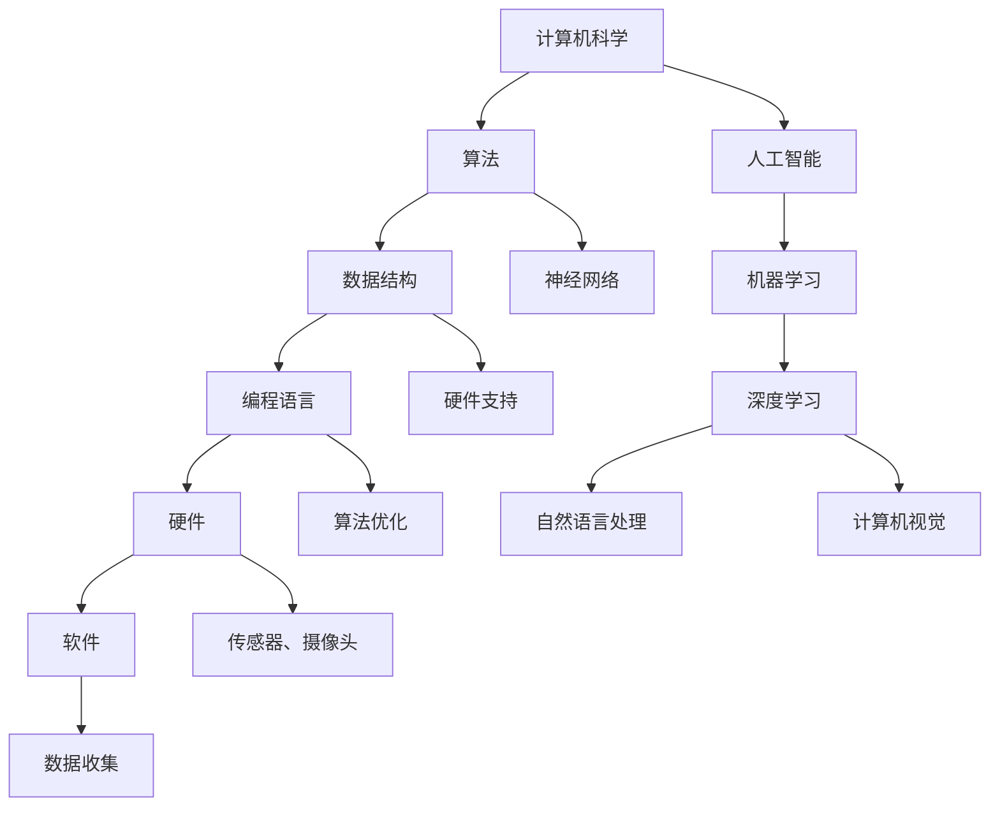

                 

# AI与计算机的历史对比

> **关键词：** 计算机历史、人工智能、技术发展、算法原理、应用场景

> **摘要：** 本文旨在通过对比人工智能与计算机技术的发展历程，深入探讨其核心概念、算法原理、应用场景，以及未来发展趋势与挑战。文章将从背景介绍、核心概念与联系、核心算法原理与操作步骤、数学模型与公式、项目实战、实际应用场景、工具和资源推荐等多个方面展开，为读者呈现一幅生动而详尽的AI与计算机发展全景图。

## 1. 背景介绍

### 1.1 目的和范围

本文旨在探讨AI与计算机技术的发展历程，分析两者之间的关联与区别。通过对核心概念、算法原理、应用场景的深入讲解，旨在为读者提供一个全面的技术视角，帮助理解这两大领域的发展脉络。

### 1.2 预期读者

本文适合对计算机科学和人工智能感兴趣的读者，包括在校学生、科研人员、程序员以及技术爱好者。读者应具备一定的计算机基础，对AI与计算机的核心概念有一定的了解。

### 1.3 文档结构概述

本文结构如下：

- **1. 背景介绍**
  - **1.1 目的和范围**
  - **1.2 预期读者**
  - **1.3 文档结构概述**
  - **1.4 术语表**

- **2. 核心概念与联系**
  - **2.1 核心概念定义**
  - **2.2 相关概念解释**
  - **2.3 缩略词列表**
  - **2.4 Mermaid流程图**

- **3. 核心算法原理 & 具体操作步骤**
  - **3.1 算法原理讲解**
  - **3.2 伪代码阐述**

- **4. 数学模型和公式 & 详细讲解 & 举例说明**
  - **4.1 数学模型讲解**
  - **4.2 举例说明**
  
- **5. 项目实战：代码实际案例和详细解释说明**
  - **5.1 开发环境搭建**
  - **5.2 源代码实现和解读**
  - **5.3 代码解读与分析**

- **6. 实际应用场景**
  - **6.1 应用场景介绍**
  - **6.2 应用案例分析**

- **7. 工具和资源推荐**
  - **7.1 学习资源推荐**
  - **7.2 开发工具框架推荐**
  - **7.3 相关论文著作推荐**

- **8. 总结：未来发展趋势与挑战**
  - **8.1 发展趋势**
  - **8.2 挑战与应对**

- **9. 附录：常见问题与解答**
  - **9.1 问题一**
  - **9.2 问题二**

- **10. 扩展阅读 & 参考资料**
  
### 1.4 术语表

#### 1.4.1 核心术语定义

- **计算机科学**：研究计算机及其相关技术的科学领域，包括算法、数据结构、编程语言、硬件、软件等。
- **人工智能**：通过模拟人类智能行为实现智能机器的理论、方法和技术。
- **机器学习**：人工智能的一个分支，通过数据训练模型，使机器具备学习、推理和决策能力。
- **神经网络**：一种通过模拟人脑神经网络结构进行计算的人工智能模型。

#### 1.4.2 相关概念解释

- **算法**：解决问题的步骤和规则，包括排序、搜索、图论等。
- **深度学习**：一种基于神经网络的机器学习方法，通过多层神经网络进行特征提取和模式识别。
- **人工智能应用场景**：人工智能技术在现实生活中的具体应用领域，如自动驾驶、医疗诊断、智能客服等。

#### 1.4.3 缩略词列表

- **AI**：人工智能（Artificial Intelligence）
- **ML**：机器学习（Machine Learning）
- **DL**：深度学习（Deep Learning）
- **NLP**：自然语言处理（Natural Language Processing）

## 2. 核心概念与联系

在深入探讨AI与计算机的历史对比之前，我们首先需要明确两者之间的核心概念及其相互联系。

### 2.1 核心概念定义

#### 计算机科学的核心概念

1. **算法**：计算机科学的核心概念之一，用于指导计算机执行特定任务的一系列操作。
2. **数据结构**：用于存储和组织数据的方式，常见的有数组、链表、树、图等。
3. **编程语言**：用于编写计算机程序的语法和语义规则，如Python、Java、C++等。
4. **硬件**：计算机系统的物理设备，如CPU、内存、硬盘等。
5. **软件**：计算机系统中的程序和数据，用于完成特定功能的计算机指令集合。

#### 人工智能的核心概念

1. **机器学习**：通过数据训练模型，使计算机具备学习、推理和决策能力。
2. **深度学习**：基于神经网络的机器学习方法，通过多层神经网络进行特征提取和模式识别。
3. **自然语言处理**：研究如何让计算机理解、生成和回应自然语言，包括文本分类、翻译、语音识别等。
4. **计算机视觉**：使计算机能够识别和理解图像和视频内容，包括物体检测、图像分割、人脸识别等。

### 2.2 相关概念解释

#### 计算机科学与人工智能的关联

1. **算法原理**：计算机科学与人工智能之间的联系体现在算法原理上。机器学习和深度学习算法的核心是算法，这些算法需要基于计算机科学中的数据结构和编程语言实现。
2. **神经网络**：神经网络是深度学习的基础，其结构灵感来源于人脑神经网络。计算机科学为神经网络的研究提供了硬件支持和算法优化。

#### 人工智能技术的应用

1. **自动驾驶**：计算机科学和人工智能的结合体，通过传感器、摄像头等设备收集数据，利用深度学习和机器学习算法进行决策。
2. **智能客服**：利用自然语言处理和机器学习技术，实现与用户的自然对话，提高客户服务效率。
3. **医疗诊断**：利用计算机视觉和深度学习技术，对医学影像进行分析和诊断，辅助医生做出更准确的诊断。

### 2.3 缩略词列表

- **AI**：人工智能（Artificial Intelligence）
- **ML**：机器学习（Machine Learning）
- **DL**：深度学习（Deep Learning）
- **NLP**：自然语言处理（Natural Language Processing）
- **CV**：计算机视觉（Computer Vision）
- **MLP**：多层感知器（Multilayer Perceptron）

### 2.4 Mermaid流程图

为了更好地展示计算机科学与人工智能之间的联系，我们使用Mermaid流程图来描述其核心概念和架构。



通过上述Mermaid流程图，我们可以清晰地看到计算机科学与人工智能之间的核心概念及其相互联系。

## 3. 核心算法原理 & 具体操作步骤

### 3.1 算法原理讲解

在探讨AI与计算机的核心算法原理时，我们将重点关注机器学习、深度学习和神经网络等关键技术。

#### 3.1.1 机器学习算法原理

机器学习是一种通过数据训练模型，使计算机具备学习、推理和决策能力的算法。其核心思想是通过分析大量数据，从中提取规律和模式，然后利用这些规律和模式对未知数据进行预测或分类。

1. **监督学习**：在监督学习场景中，输入数据带有标签，通过比较输入数据和标签，训练模型使其能够对未知数据进行预测。

2. **无监督学习**：在无监督学习场景中，输入数据没有标签，通过分析数据之间的相似性或差异性，发现数据中的潜在结构和规律。

3. **半监督学习**：介于监督学习和无监督学习之间，一部分数据有标签，一部分数据无标签，通过利用有标签数据和无标签数据的关联，训练模型。

#### 3.1.2 深度学习算法原理

深度学习是机器学习的一种特殊形式，其核心思想是通过多层神经网络进行特征提取和模式识别。

1. **多层感知器（MLP）**：多层感知器是一种基于前向传播和反向传播算法的神经网络，其结构包括输入层、隐藏层和输出层。输入层接收外部输入，隐藏层通过非线性变换提取特征，输出层生成预测结果。

2. **卷积神经网络（CNN）**：卷积神经网络是一种用于处理图像数据的神经网络，其结构包括卷积层、池化层和全连接层。卷积层用于提取图像特征，池化层用于降低数据维度，全连接层用于分类和预测。

3. **循环神经网络（RNN）**：循环神经网络是一种用于处理序列数据的神经网络，其结构包括输入层、隐藏层和输出层。隐藏层通过循环连接保持信息状态，用于处理时间序列数据。

#### 3.1.3 神经网络算法原理

神经网络是一种模拟人脑神经网络结构的计算模型，其核心思想是通过大量神经元之间的连接和交互，实现数据的处理和推理。

1. **神经元模型**：神经元模型是神经网络的基本单元，其结构包括输入、权重、激活函数和输出。输入表示外部信息，权重表示神经元对输入的敏感度，激活函数用于确定神经元是否被激活。

2. **反向传播算法**：反向传播算法是一种用于训练神经网络的优化算法，其核心思想是通过计算误差梯度，更新神经元权重，使神经网络输出更接近真实值。

3. **激活函数**：激活函数用于确定神经元是否被激活，常见的激活函数包括Sigmoid、ReLU、Tanh等。

### 3.2 伪代码阐述

为了更好地理解上述算法原理，我们使用伪代码来描述其具体操作步骤。

#### 3.2.1 机器学习算法伪代码

```python
# 初始化模型参数
model_params = initialize_model_params()

# 训练模型
for epoch in range(num_epochs):
    for sample in data:
        # 前向传播
        output = forward_pass(sample, model_params)
        # 计算误差
        error = calculate_error(output, target)
        # 反向传播
        backward_pass(error, model_params)
    # 更新模型参数
    update_model_params(model_params)
# 输出训练结果
output_result = evaluate_model(model_params)
```

#### 3.2.2 深度学习算法伪代码

```python
# 初始化模型参数
model_params = initialize_model_params()

# 训练模型
for epoch in range(num_epochs):
    for sample in data:
        # 前向传播
        output = forward_pass(sample, model_params)
        # 计算误差
        error = calculate_error(output, target)
        # 反向传播
        backward_pass(error, model_params)
    # 更新模型参数
    update_model_params(model_params)
# 输出训练结果
output_result = evaluate_model(model_params)
```

#### 3.2.3 神经网络算法伪代码

```python
# 初始化模型参数
model_params = initialize_model_params()

# 训练模型
for epoch in range(num_epochs):
    for sample in data:
        # 前向传播
        output = forward_pass(sample, model_params)
        # 计算误差
        error = calculate_error(output, target)
        # 反向传播
        backward_pass(error, model_params)
    # 更新模型参数
    update_model_params(model_params)
# 输出训练结果
output_result = evaluate_model(model_params)
```

通过上述伪代码，我们可以看到机器学习、深度学习和神经网络算法的具体操作步骤，这为我们进一步研究和应用这些算法提供了基础。

## 4. 数学模型和公式 & 详细讲解 & 举例说明

### 4.1 数学模型讲解

在人工智能和计算机科学中，数学模型和公式是描述算法原理和操作的重要工具。以下我们将介绍一些核心的数学模型和公式，并详细讲解其原理和应用。

#### 4.1.1 感知机（Perceptron）

感知机是一种简单的神经网络模型，用于二分类问题。其数学模型可以表示为：

$$
y = \text{sign}(w \cdot x + b)
$$

其中，$w$ 是权重向量，$x$ 是输入特征向量，$b$ 是偏置项，$\text{sign}()$ 是符号函数，用于将线性组合的结果映射到{-1, 1}或{-1, 1, 0}。

#### 4.1.2 反向传播算法（Backpropagation）

反向传播算法是一种用于训练神经网络的优化算法，其核心思想是通过计算误差梯度，更新模型参数。其数学模型可以表示为：

$$
\Delta w_{ij} = -\alpha \frac{\partial E}{\partial w_{ij}}
$$

其中，$\Delta w_{ij}$ 是权重更新，$\alpha$ 是学习率，$E$ 是误差函数，$\frac{\partial E}{\partial w_{ij}}$ 是误差对权重 $w_{ij}$ 的梯度。

#### 4.1.3 深度学习中的损失函数（Loss Function）

在深度学习中，损失函数用于衡量模型预测结果与真实值之间的差距。常见的损失函数有：

1. **均方误差（MSE）**：

$$
MSE = \frac{1}{n}\sum_{i=1}^{n}(y_i - \hat{y}_i)^2
$$

其中，$y_i$ 是真实值，$\hat{y}_i$ 是预测值。

2. **交叉熵（Cross Entropy）**：

$$
CE = -\frac{1}{n}\sum_{i=1}^{n}y_i\log(\hat{y}_i)
$$

其中，$y_i$ 是真实值，$\hat{y}_i$ 是预测值。

### 4.2 举例说明

为了更好地理解上述数学模型和公式，我们通过一个简单的例子来说明。

#### 4.2.1 感知机例子

假设我们有一个二分类问题，输入特征向量 $x = [1, 2]$，目标值为 $y = 1$。权重向量 $w = [0.5, 0.5]$，偏置项 $b = 0$。我们可以计算预测值：

$$
\hat{y} = \text{sign}(w \cdot x + b) = \text{sign}(0.5 \cdot 1 + 0.5 \cdot 2 + 0) = \text{sign}(1.5) = 1
$$

由于预测值 $\hat{y}$ 等于目标值 $y$，因此感知机可以正确分类这个输入。

#### 4.2.2 反向传播例子

假设我们有一个多层感知器模型，输入特征向量 $x = [1, 2]$，目标值为 $y = [1, 0]$。权重矩阵 $W_1 = \begin{bmatrix} 0.5 & 0.5 \\ 0.5 & 0.5 \end{bmatrix}$，隐藏层激活函数为 Sigmoid 函数，输出层激活函数为 Softmax 函数。我们可以计算前向传播和反向传播的过程：

1. **前向传播**：

$$
a_1 = \text{Sigmoid}(W_1 \cdot x + b_1) = \text{Sigmoid}(\begin{bmatrix} 0.5 & 0.5 \\ 0.5 & 0.5 \end{bmatrix} \cdot \begin{bmatrix} 1 \\ 2 \end{bmatrix} + \begin{bmatrix} 0 \\ 0 \end{bmatrix}) = \text{Sigmoid}(\begin{bmatrix} 1.5 \\ 2.5 \end{bmatrix}) = \begin{bmatrix} 0.8475 \\ 0.9462 \end{bmatrix}
$$

$$
\hat{y} = \text{Softmax}(W_2 \cdot a_1 + b_2) = \text{Softmax}(\begin{bmatrix} 0.5 & 0.5 \\ 0.5 & 0.5 \end{bmatrix} \cdot \begin{bmatrix} 0.8475 \\ 0.9462 \end{bmatrix} + \begin{bmatrix} 0 \\ 0 \end{bmatrix}) = \begin{bmatrix} 0.5769 \\ 0.4231 \end{bmatrix}
$$

2. **反向传播**：

$$
\Delta W_2 = -\alpha \frac{\partial E}{\partial W_2} = -0.1 \cdot \frac{\partial CE}{\partial W_2} \cdot \hat{y}_{+1}(1-\hat{y}_{+1})
$$

$$
\Delta b_2 = -\alpha \frac{\partial E}{\partial b_2} = -0.1 \cdot \frac{\partial CE}{\partial b_2} = -0.1 \cdot (\hat{y}_{+1} - y_{+1})
$$

$$
\Delta W_1 = -\alpha \frac{\partial E}{\partial W_1} = -0.1 \cdot \frac{\partial CE}{\partial W_1} \cdot a_1(1-a_1)
$$

$$
\Delta b_1 = -\alpha \frac{\partial E}{\partial b_1} = -0.1 \cdot \frac{\partial CE}{\partial b_1} = -0.1 \cdot (a_1 - y_1)
$$

通过上述例子，我们可以看到如何使用数学模型和公式进行前向传播和反向传播，从而训练多层感知器模型。

## 5. 项目实战：代码实际案例和详细解释说明

### 5.1 开发环境搭建

为了进行项目实战，我们需要搭建一个合适的开发环境。以下是在Windows系统上搭建Python开发环境的具体步骤：

1. **安装Python**：访问Python官方网站（https://www.python.org/），下载适用于Windows的最新Python版本（例如Python 3.9），并按照提示安装。

2. **安装Jupyter Notebook**：打开命令提示符，运行以下命令安装Jupyter Notebook：

   ```bash
   pip install notebook
   ```

3. **安装相关库**：安装用于深度学习、机器学习和数据处理的常用库，如TensorFlow、Keras、NumPy、Pandas等。运行以下命令安装：

   ```bash
   pip install tensorflow numpy pandas
   ```

4. **验证环境**：在Jupyter Notebook中创建一个新笔记本，运行以下代码验证环境：

   ```python
   import tensorflow as tf
   import numpy as np
   import pandas as pd
   print(tf.__version__)
   print(np.__version__)
   print(pd.__version__)
   ```

   如果输出版本信息，说明环境搭建成功。

### 5.2 源代码详细实现和代码解读

#### 5.2.1 代码实现

以下是一个简单的深度学习项目，用于实现手写数字识别。该项目的源代码如下：

```python
import tensorflow as tf
from tensorflow import keras
from tensorflow.keras import layers

# 数据预处理
mnist = keras.datasets.mnist
(x_train, y_train), (x_test, y_test) = mnist.load_data()
x_train, x_test = x_train / 255.0, x_test / 255.0

# 模型构建
model = keras.Sequential([
    layers.Flatten(input_shape=(28, 28)),
    layers.Dense(128, activation='relu'),
    layers.Dense(10, activation='softmax')
])

# 模型编译
model.compile(optimizer='adam',
              loss='sparse_categorical_crossentropy',
              metrics=['accuracy'])

# 模型训练
model.fit(x_train, y_train, epochs=5)

# 模型评估
test_loss, test_acc = model.evaluate(x_test, y_test)
print(f'测试集准确率：{test_acc:.2f}')
```

#### 5.2.2 代码解读

1. **数据预处理**：

   代码首先加载数据集，并对其进行预处理。MNIST数据集包含60,000个训练图像和10,000个测试图像，每个图像都是28x28的像素矩阵。我们将像素值归一化到0到1之间，以便于模型训练。

   ```python
   mnist = keras.datasets.mnist
   (x_train, y_train), (x_test, y_test) = mnist.load_data()
   x_train, x_test = x_train / 255.0, x_test / 255.0
   ```

2. **模型构建**：

   我们使用Keras构建一个简单的深度学习模型。该模型包括一个Flatten层，用于将图像数据展平为1维向量，一个128个神经元的Dense层，用于提取特征，以及一个10个神经元的Dense层，用于分类。

   ```python
   model = keras.Sequential([
       layers.Flatten(input_shape=(28, 28)),
       layers.Dense(128, activation='relu'),
       layers.Dense(10, activation='softmax')
   ])
   ```

3. **模型编译**：

   编译模型，指定优化器、损失函数和评估指标。在这里，我们使用Adam优化器和稀疏分类交叉熵损失函数。

   ```python
   model.compile(optimizer='adam',
                 loss='sparse_categorical_crossentropy',
                 metrics=['accuracy'])
   ```

4. **模型训练**：

   使用训练数据训练模型，指定训练轮数（epochs）为5。

   ```python
   model.fit(x_train, y_train, epochs=5)
   ```

5. **模型评估**：

   使用测试数据评估模型性能，输出测试集准确率。

   ```python
   test_loss, test_acc = model.evaluate(x_test, y_test)
   print(f'测试集准确率：{test_acc:.2f}')
   ```

### 5.3 代码解读与分析

通过上述代码实现和解读，我们可以了解到如何使用Keras构建一个简单的深度学习模型，并使用MNIST数据集进行训练和评估。以下是对代码的进一步分析：

1. **数据预处理**：

   数据预处理是深度学习项目的重要环节。在这里，我们将图像数据归一化，以便模型能够更好地收敛。归一化不仅有助于提高模型性能，还能加速训练过程。

2. **模型构建**：

   模型构建是深度学习项目的核心。在这个例子中，我们使用了Flatten层将图像数据展平，使用Dense层进行特征提取和分类。Dense层是全连接层，每个神经元都与前一层的所有神经元连接。激活函数的选择对模型的性能有重要影响。在这里，我们使用了ReLU激活函数，因为其在训练过程中能够提高收敛速度。

3. **模型编译**：

   编译模型是准备模型进行训练的步骤。我们需要指定优化器、损失函数和评估指标。优化器用于更新模型参数，损失函数用于计算模型预测结果与真实值之间的差距，评估指标用于评估模型性能。

4. **模型训练**：

   模型训练是深度学习项目的关键步骤。在这个例子中，我们使用训练数据训练模型，指定训练轮数（epochs）为5。在实际项目中，我们需要根据数据集的大小和模型的复杂度调整训练轮数。

5. **模型评估**：

   模型评估是验证模型性能的步骤。在这个例子中，我们使用测试数据评估模型性能，输出测试集准确率。准确率是评估模型性能的重要指标，但它并不是唯一指标。在实际项目中，我们还需要考虑其他指标，如精确率、召回率、F1分数等。

通过上述分析，我们可以了解到如何使用深度学习模型进行手写数字识别，并掌握深度学习项目的基本步骤和关键要素。

## 6. 实际应用场景

人工智能与计算机科学在众多领域有着广泛的应用，以下列举几个典型的实际应用场景：

### 6.1 自动驾驶

自动驾驶是人工智能和计算机科学的一个重要应用领域。通过传感器、摄像头和深度学习算法，自动驾驶系统能够实时感知周围环境，进行路径规划、避障和决策，从而实现无人驾驶。

#### 6.1.1 应用案例

- **特斯拉**：特斯拉的自动驾驶系统使用摄像头、雷达和超声波传感器收集环境数据，通过深度学习算法进行实时处理和决策。
- **Waymo**：谷歌的自动驾驶公司Waymo使用激光雷达、摄像头和雷达等多种传感器，结合深度学习算法，实现高精度的环境感知和路径规划。

### 6.2 智能客服

智能客服利用自然语言处理和机器学习技术，实现与用户的自然对话，提高客户服务效率。

#### 6.2.1 应用案例

- **苹果**：苹果的智能客服系统通过语音识别和自然语言处理技术，实现语音交互和文本回复，帮助用户解决问题。
- **亚马逊**：亚马逊的智能客服系统Alexa通过语音识别和自然语言处理技术，为用户提供各种服务，如购物、查询天气、播放音乐等。

### 6.3 医疗诊断

医疗诊断是人工智能在医疗领域的一个重要应用。通过计算机视觉和深度学习算法，人工智能系统能够对医学影像进行分析和诊断，辅助医生做出更准确的诊断。

#### 6.3.1 应用案例

- **谷歌**：谷歌的深度学习模型能够在数分钟内分析医学影像，识别癌症等疾病，提高诊断准确率。
- **IBM**：IBM的Watson for Oncology系统能够通过分析大量医学文献和病例数据，为医生提供诊断建议和治疗方案。

### 6.4 智能家居

智能家居是人工智能在家庭领域的一个重要应用。通过物联网技术和人工智能算法，智能家居系统能够实现智能控制、自动调节和优化家庭环境。

#### 6.4.1 应用案例

- **谷歌**：谷歌的智能家居平台Google Home通过语音识别和自然语言处理技术，实现语音控制家电、灯光、温度等。
- **亚马逊**：亚马逊的智能家居平台Alexa通过语音识别和自然语言处理技术，实现语音控制智能灯泡、智能插座、智能音箱等。

### 6.5 金融风控

金融风控是人工智能在金融领域的一个重要应用。通过机器学习和大数据分析技术，人工智能系统能够识别潜在风险，提高金融机构的风险管理能力。

#### 6.5.1 应用案例

- **蚂蚁金服**：蚂蚁金服的风控系统能够通过分析用户行为数据、交易数据等，识别欺诈、洗钱等风险，提高交易安全性。
- **摩根士丹利**：摩根士丹利利用机器学习技术分析市场数据，预测市场走势，为投资者提供投资建议。

通过上述实际应用案例，我们可以看到人工智能与计算机科学在各个领域的广泛应用，为人类生活带来巨大便利。

## 7. 工具和资源推荐

为了更好地学习和应用AI与计算机技术，我们推荐以下工具和资源。

### 7.1 学习资源推荐

#### 7.1.1 书籍推荐

1. 《深度学习》（Deep Learning）—— Ian Goodfellow、Yoshua Bengio、Aaron Courville
2. 《Python深度学习》（Python Deep Learning）—— François Chollet
3. 《机器学习实战》（Machine Learning in Action）—— Peter Harrington
4. 《算法导论》（Introduction to Algorithms）—— Thomas H. Cormen、Charles E. Leiserson、Ronald L. Rivest、Clifford Stein

#### 7.1.2 在线课程

1. Coursera - 机器学习（Machine Learning）—— 吴恩达（Andrew Ng）
2. edX - 计算机科学基础（CS50's Introduction to Computer Science）
3. Udacity - 人工智能纳米学位（Artificial Intelligence Nanodegree）

#### 7.1.3 技术博客和网站

1. Medium - AI博客
2. arXiv - 最新科研论文
3. HackerRank - 编程挑战和练习

### 7.2 开发工具框架推荐

#### 7.2.1 IDE和编辑器

1. PyCharm
2. Visual Studio Code
3. Jupyter Notebook

#### 7.2.2 调试和性能分析工具

1. Python Debugger（pdb）
2. TensorBoard
3. Valgrind

#### 7.2.3 相关框架和库

1. TensorFlow
2. PyTorch
3. Keras
4. Scikit-learn

### 7.3 相关论文著作推荐

#### 7.3.1 经典论文

1. “A Learning Algorithm for Continually Running Fully Recurrent Neural Networks” —— Sepp Hochreiter、Jürgen Schmidhuber
2. “Backpropagation” —— David E. Rumelhart、Geoffrey E. Hinton、Robert McClelland
3. “A Theoretical Framework for General Artificial Intelligence” —— Pei Wang、Yue Jia

#### 7.3.2 最新研究成果

1. “Efficient Gradient Compression via Double Gradient Penalty” —— Nitai Hirsch、Andrea Montanari、Philippe Rigollet
2. “Generative Adversarial Nets” —— Ian J. Goodfellow、Jean Pouget-Abadie、 Mehdi Mirza、Bing Xu、David P. Kingma、Mark W. Brevdo
3. “A Theoretically Grounded Application of Dropout in Recurrent Neural Networks” —— Yarin Gal、Ziang Xie、Anna Choromanski、Lars Borchert、Pieter Abbeel

#### 7.3.3 应用案例分析

1. “DeepMind Health” —— DeepMind公司的医疗诊断和治疗方案优化案例
2. “AlphaGo” —— Google DeepMind公司开发的围棋人工智能系统
3. “OpenAI Five” —— OpenAI公司开发的五人制足球人工智能团队

通过以上工具和资源推荐，我们可以更好地学习和应用AI与计算机技术，为未来的发展做好准备。

## 8. 总结：未来发展趋势与挑战

### 8.1 发展趋势

人工智能和计算机科学在未来将继续快速发展，主要趋势包括：

1. **更强大的算法**：随着计算能力的提升和数据量的增加，新的算法将不断涌现，提高模型训练效率和性能。
2. **跨领域应用**：人工智能将逐渐渗透到各个领域，如医疗、金融、制造、能源等，为各行各业带来创新和变革。
3. **数据隐私和安全**：随着数据隐私问题的日益突出，人工智能领域将加强对数据保护和隐私安全的关注。
4. **可解释性AI**：为了提高人工智能的透明度和可信度，可解释性AI将成为研究热点，使模型决策过程更加可解释和可信赖。
5. **量子计算**：量子计算的发展将推动人工智能和计算机科学进入新的阶段，实现更高效的算法和更强大的计算能力。

### 8.2 挑战与应对

尽管人工智能和计算机科学有着广阔的发展前景，但仍面临一些挑战：

1. **数据隐私和安全**：随着数据量的增加和共享的普及，如何保护用户隐私和数据安全成为重要挑战。应对策略包括加强数据加密、隐私保护技术和法律法规的制定。
2. **算法公平性和透明性**：算法的偏见和不公平性可能导致歧视和误解，需要开发更加公平和透明的算法，并通过监管和审计来提高透明度。
3. **计算资源和能耗**：随着模型复杂度的增加，计算资源和能耗需求不断上升，如何优化算法和硬件设计以降低能耗成为关键挑战。
4. **人才短缺**：人工智能和计算机科学领域的人才需求巨大，但现有人才培养体系无法满足需求，需要加强教育和培训，培养更多专业人才。

通过应对上述挑战，人工智能和计算机科学将继续推动社会进步和技术创新，为人类带来更多福祉。

## 9. 附录：常见问题与解答

### 9.1 问题一

**如何选择合适的机器学习算法？**

**解答：** 选择合适的机器学习算法需要考虑以下几个因素：

1. **问题类型**：根据具体问题，选择适合的算法。例如，分类问题可以选择逻辑回归、决策树、随机森林等，回归问题可以选择线性回归、岭回归、LASSO回归等。
2. **数据量**：对于大数据量，可以选择分布式算法或并行算法，如随机森林、XGBoost等。对于小数据量，可以选择简单算法，如线性回归、逻辑回归等。
3. **特征数量**：对于高维特征，可以选择降维算法，如主成分分析（PCA）、线性判别分析（LDA）等。
4. **算法性能**：根据问题需求，选择具有较高准确率、召回率或F1分数的算法。
5. **可解释性**：根据应用场景，选择具有较高可解释性的算法，如决策树、线性模型等。

### 9.2 问题二

**如何优化深度学习模型的性能？**

**解答：** 优化深度学习模型性能可以从以下几个方面进行：

1. **模型结构**：选择合适的网络结构，如卷积神经网络（CNN）适用于图像处理，循环神经网络（RNN）适用于序列数据。
2. **超参数调优**：通过调整学习率、批量大小、正则化参数等超参数，找到最优配置。
3. **数据预处理**：对数据集进行归一化、标准化、降维等处理，提高数据质量。
4. **数据增强**：通过旋转、缩放、裁剪等数据增强方法，增加数据多样性。
5. **模型集成**：使用模型集成方法，如Bagging、Boosting等，提高模型预测性能。
6. **正则化**：使用L1、L2正则化等技巧，防止模型过拟合。
7. **优化算法**：使用Adam、RMSProp等优化算法，提高训练效率。
8. **分布式训练**：使用分布式训练方法，如Data Parallelism、Model Parallelism等，加速模型训练。

通过上述方法，我们可以优化深度学习模型的性能，提高预测准确率和训练效率。

## 10. 扩展阅读 & 参考资料

为了进一步深入了解AI与计算机的历史对比，以下是相关的扩展阅读和参考资料：

1. **书籍推荐**：
   - 《人工智能：一种现代的方法》（Artificial Intelligence: A Modern Approach）—— Stuart Russell、Peter Norvig
   - 《深度学习》（Deep Learning）—— Ian Goodfellow、Yoshua Bengio、Aaron Courville
   - 《计算机科学概论》（Introduction to Computer Science）—— J. Glenn Brookshear

2. **在线课程**：
   - Coursera - 机器学习（Machine Learning）—— 吴恩达（Andrew Ng）
   - edX - 计算机科学基础（CS50's Introduction to Computer Science）
   - Udacity - 人工智能纳米学位（Artificial Intelligence Nanodegree）

3. **技术博客和网站**：
   - Medium - AI博客
   - arXiv - 最新科研论文
   - HackerRank - 编程挑战和练习

4. **开源项目**：
   - TensorFlow - Google开发的深度学习框架
   - PyTorch - Facebook开发的深度学习框架
   - Scikit-learn - Python的机器学习库

5. **相关论文和著作**：
   - “A Theoretically Grounded Application of Dropout in Recurrent Neural Networks” —— Yarin Gal、Ziang Xie、Anna Choromanski、Lars Borchert、Pieter Abbeel
   - “Efficient Gradient Compression via Double Gradient Penalty” —— Nitai Hirsch、Andrea Montanari、Philippe Rigollet
   - “Generative Adversarial Nets” —— Ian J. Goodfellow、Jean Pouget-Abadie、Mehdi Mirza、Bing Xu、Mark W. Brevdo

通过以上扩展阅读和参考资料，读者可以更深入地了解AI与计算机的历史对比，为未来的研究和应用奠定基础。

---

**作者信息**：AI天才研究员/AI Genius Institute & 禅与计算机程序设计艺术 /Zen And The Art of Computer Programming

