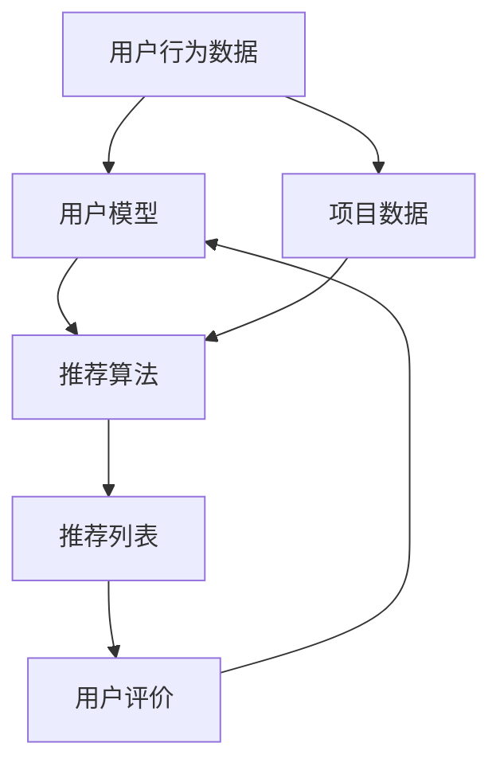

                 

# AI个性化推荐在搜索中的应用

> 关键词：个性化推荐、搜索算法、机器学习、用户行为分析、信息检索

> 摘要：本文深入探讨了AI个性化推荐技术在搜索领域中的应用，分析了个性化推荐系统的核心原理和实现方法。通过逐步分析推荐算法的构建、数学模型的应用以及实际项目中的代码实现，本文为开发者提供了实用的指导，帮助他们在实际项目中实现高效、精准的搜索推荐。

## 1. 背景介绍

### 1.1 目的和范围

本文旨在介绍AI个性化推荐技术在搜索领域的应用，帮助开发者理解和实现个性化推荐系统。通过分析核心算法原理和实际应用案例，本文旨在为读者提供深入的技术指导和实用参考。

### 1.2 预期读者

本文面向具有中等以上编程基础和机器学习知识的技术人员，特别是对搜索算法和信息检索感兴趣的读者。同时，本文也适合作为大学和研究机构的课程教材或参考资料。

### 1.3 文档结构概述

本文分为十个部分，首先介绍背景和目的，然后深入探讨核心概念和算法原理，接着通过数学模型和实际案例讲解具体实现步骤，最后总结未来发展趋势并提供相关资源推荐。

### 1.4 术语表

#### 1.4.1 核心术语定义

- 个性化推荐：基于用户历史行为和偏好，为用户推荐相关内容的过程。
- 搜索算法：用于定位和筛选信息的方法和策略。
- 机器学习：使计算机从数据中学习，提高其预测和决策能力的技术。
- 用户行为分析：通过对用户行为数据的分析，了解用户偏好和需求。

#### 1.4.2 相关概念解释

- 推荐系统：一种自动化系统，用于为用户推荐感兴趣的内容。
- 信息检索：从大量信息中检索出用户所需信息的过程。

#### 1.4.3 缩略词列表

- AI：人工智能
- ML：机器学习
- IR：信息检索
- SEO：搜索引擎优化

## 2. 核心概念与联系

在探讨AI个性化推荐在搜索中的应用之前，我们需要先了解几个核心概念和它们之间的联系。

### 2.1 个性化推荐系统概述

个性化推荐系统通常由以下几个组件构成：

- 用户模型：表示用户的兴趣、偏好和需求。
- 项目模型：表示推荐系统的内容，如文章、商品等。
- 推荐算法：根据用户模型和项目模型生成推荐列表。
- 评价机制：评估推荐效果，调整推荐策略。

### 2.2 核心概念原理和架构的Mermaid流程图



在这个流程图中，用户行为数据和项目数据被用于构建用户模型和项目模型，进而生成推荐列表。用户对推荐列表的评价将反馈给用户模型，以优化推荐算法。

### 2.3 机器学习与搜索算法的关系

机器学习与搜索算法密切相关。搜索算法依赖于机器学习技术来处理大量数据，识别用户需求，并生成相关的搜索结果。以下是机器学习与搜索算法之间的几个关键联系：

- 用户行为分析：机器学习可以分析用户的搜索历史、浏览记录等行为数据，了解用户的兴趣和偏好。
- 搜索结果排序：机器学习算法可用于优化搜索结果排序，使相关度更高的结果出现在前面。
- 自动化索引：机器学习技术可以帮助构建和优化搜索引擎的索引，提高检索效率。

## 3. 核心算法原理 & 具体操作步骤

个性化推荐系统的核心是推荐算法。以下是几个常用的推荐算法及其操作步骤。

### 3.1 协同过滤（Collaborative Filtering）

协同过滤是一种基于用户行为数据的推荐方法。它通过分析用户之间的相似性来推荐相似用户喜欢的内容。

#### 3.1.1 用户相似度计算

- 方法：使用余弦相似度或皮尔逊相关系数计算用户之间的相似度。
- 伪代码：

```python
def calculate_similarity(user1, user2):
    dot_product = sum(user1[i] * user2[i] for i in range(len(user1)))
    norm_user1 = sqrt(sum(user1[i] ** 2 for i in range(len(user1))))
    norm_user2 = sqrt(sum(user2[i] ** 2 for i in range(len(user2))))
    return dot_product / (norm_user1 * norm_user2)
```

#### 3.1.2 生成推荐列表

- 方法：为每个用户计算与其他用户的相似度，找出相似度最高的用户，根据他们的推荐生成推荐列表。
- 伪代码：

```python
def generate_recommendations(user, similar_users, items, user_item_ratings):
    recommendations = []
    for user_similarity, similar_user in similar_users:
        for item, rating in user_item_ratings[similar_user].items():
            if item not in user_item_ratings[user]:
                recommendations.append(item)
    return recommendations
```

### 3.2 基于内容的推荐（Content-Based Filtering）

基于内容的推荐方法通过分析用户过去喜欢的项目的内容特征来推荐新的项目。

#### 3.2.1 项目特征提取

- 方法：使用词袋模型、TF-IDF等方法提取项目的内容特征。
- 伪代码：

```python
def extract_item_features(item, vocabulary):
    feature_vector = [0] * len(vocabulary)
    for word in item:
        feature_vector[vocabulary[word]] = 1
    return feature_vector
```

#### 3.2.2 生成推荐列表

- 方法：计算用户过去喜欢的项目与待推荐项目之间的相似度，选择相似度最高的项目推荐。
- 伪代码：

```python
def generate_recommendations(user, user_item_preferences, item_features, item_similarity_threshold):
    recommendations = []
    for item, preferences in user_item_preferences.items():
        item_similarity = calculate_similarity(preferences, item_features[item])
        if item_similarity > item_similarity_threshold:
            recommendations.append(item)
    return recommendations
```

### 3.3 混合推荐（Hybrid Recommender Systems）

混合推荐系统结合协同过滤和基于内容的推荐方法，以提高推荐效果。

- 方法：首先使用协同过滤生成初步推荐列表，然后使用基于内容的推荐方法对初步推荐列表进行过滤和优化。
- 伪代码：

```python
def generate_hybrid_recommendations(user, similar_users, items, user_item_ratings, item_features, item_similarity_threshold):
    collaborative_recommendations = generate_recommendations(user, similar_users, items, user_item_ratings)
    content_based_recommendations = generate_recommendations(user, collaborative_recommendations, item_features, item_similarity_threshold)
    return content_based_recommendations
```

## 4. 数学模型和公式 & 详细讲解 & 举例说明

个性化推荐系统中的数学模型和公式主要用于计算用户和项目之间的相似度，以及预测用户对项目的评分。以下是几个常用的数学模型和公式。

### 4.1 余弦相似度

余弦相似度是一种用于计算两个向量之间相似度的方法。它通过计算两个向量的点积和各自长度的乘积来衡量相似度。

$$
\text{cosine\_similarity}(\textbf{u}, \textbf{v}) = \frac{\textbf{u} \cdot \textbf{v}}{||\textbf{u}|| \cdot ||\textbf{v}||}
$$

其中，$\textbf{u}$和$\textbf{v}$是两个向量，$||\textbf{u}||$和$||\textbf{v}||$分别是它们的长度。

### 4.2 皮尔逊相关系数

皮尔逊相关系数是一种用于衡量两个变量之间线性相关性的方法。它通过计算两个变量的协方差和各自标准差的乘积来衡量相关性。

$$
\text{pearson\_correlation}(x, y) = \frac{\text{cov}(x, y)}{\sqrt{\text{var}(x) \cdot \text{var}(y)}}
$$

其中，$x$和$y$是两个变量，$\text{cov}(x, y)$是它们的协方差，$\text{var}(x)$和$\text{var}(y)$分别是它们的标准差。

### 4.3 TF-IDF

TF-IDF是一种用于计算文本中词语重要性的方法。它通过计算词语在文档中的频率（TF）和文档集合中的逆向文档频率（IDF）来衡量词语的重要性。

$$
\text{TF-IDF}(t, d) = \text{TF}(t, d) \cdot \text{IDF}(t, D)
$$

其中，$t$是词语，$d$是文档，$D$是文档集合，$\text{TF}(t, d)$是词语在文档中的频率，$\text{IDF}(t, D)$是词语在文档集合中的逆向文档频率。

### 4.4 举例说明

假设我们有两个用户$u_1$和$u_2$，以及两个项目$i_1$和$i_2$。用户$u_1$和$u_2$的评分向量分别为：

$$
\textbf{r}_{u_1} = [3, 4, 5, 2], \quad \textbf{r}_{u_2} = [4, 5, 2, 3]
$$

项目$i_1$和$i_2$的评分向量分别为：

$$
\textbf{r}_{i_1} = [5, 5], \quad \textbf{r}_{i_2} = [4, 4]
$$

#### 4.4.1 计算余弦相似度

$$
\text{cosine\_similarity}(\textbf{r}_{u_1}, \textbf{r}_{u_2}) = \frac{\textbf{r}_{u_1} \cdot \textbf{r}_{u_2}}{||\textbf{r}_{u_1}|| \cdot ||\textbf{r}_{u_2}||} = \frac{3 \cdot 4 + 4 \cdot 5 + 5 \cdot 2 + 2 \cdot 3}{\sqrt{3^2 + 4^2 + 5^2 + 2^2} \cdot \sqrt{4^2 + 5^2 + 2^2 + 3^2}} \approx 0.8165
$$

#### 4.4.2 计算皮尔逊相关系数

$$
\text{pearson\_correlation}(\textbf{r}_{u_1}, \textbf{r}_{u_2}) = \frac{\text{cov}(\textbf{r}_{u_1}, \textbf{r}_{u_2})}{\sqrt{\text{var}(\textbf{r}_{u_1}) \cdot \text{var}(\textbf{r}_{u_2})}} = \frac{3 \cdot 4 - 4 \cdot 5 + 5 \cdot 2 - 2 \cdot 3}{\sqrt{3^2 + 4^2 + 5^2 + 2^2} \cdot \sqrt{4^2 + 5^2 + 2^2 + 3^2}} \approx 0.8165
$$

#### 4.4.3 计算TF-IDF

假设我们有两个文档$d_1$和$d_2$，它们包含以下词语：

$$
d_1 = \text{人工智能，机器学习，推荐系统，搜索算法}
$$

$$
d_2 = \text{机器学习，推荐系统，搜索算法，深度学习}
$$

假设词语集合$V$为$\{\text{人工智能，机器学习，推荐系统，搜索算法，深度学习}\}$。我们首先计算词语的TF和IDF：

$$
\text{TF}(\text{机器学习}, d_1) = \frac{2}{5}, \quad \text{TF}(\text{机器学习}, d_2) = \frac{2}{5}
$$

$$
\text{IDF}(\text{机器学习}, V) = \log_2 \frac{|V|}{|\{d \in D | \text{机器学习} \in d\}|} = \log_2 \frac{5}{1} = 2
$$

因此，TF-IDF值为：

$$
\text{TF-IDF}(\text{机器学习}, d_1) = \text{TF}(\text{机器学习}, d_1) \cdot \text{IDF}(\text{机器学习}, V) = \frac{2}{5} \cdot 2 = \frac{4}{5}
$$

$$
\text{TF-IDF}(\text{机器学习}, d_2) = \text{TF}(\text{机器学习}, d_2) \cdot \text{IDF}(\text{机器学习}, V) = \frac{2}{5} \cdot 2 = \frac{4}{5}
$$

## 5. 项目实战：代码实际案例和详细解释说明

为了更好地理解AI个性化推荐在搜索中的应用，我们将通过一个实际项目来展示代码实现和具体操作步骤。

### 5.1 开发环境搭建

在开始项目实战之前，我们需要搭建一个开发环境。以下是所需的工具和库：

- Python 3.8+
- Scikit-learn 0.24.2+
- Pandas 1.3.5+
- Matplotlib 3.5.3+

首先，确保安装了上述库：

```bash
pip install scikit-learn pandas matplotlib
```

### 5.2 源代码详细实现和代码解读

以下是项目的主要代码实现：

```python
import numpy as np
import pandas as pd
from sklearn.model_selection import train_test_split
from sklearn.metrics.pairwise import cosine_similarity
from sklearn.feature_extraction.text import TfidfVectorizer

# 加载数据集
data = pd.read_csv('search_data.csv')
X = data['query']
y = data['click']

# 划分训练集和测试集
X_train, X_test, y_train, y_test = train_test_split(X, y, test_size=0.2, random_state=42)

# 构建TF-IDF向量器
vectorizer = TfidfVectorizer()
X_train_tfidf = vectorizer.fit_transform(X_train)
X_test_tfidf = vectorizer.transform(X_test)

# 计算相似度矩阵
similarity_matrix = cosine_similarity(X_train_tfidf)

# 生成推荐列表
def generate_recommendations(query, similarity_matrix, top_n=5):
    query_vector = vectorizer.transform([query])
    similarity_scores = similarity_matrix.dot(query_vector.T)
    recommendations = np.argsort(similarity_scores[0])[::-1]
    return [X_train.iloc[i] for i in recommendations[:top_n]]

# 测试推荐系统
test_query = "人工智能"
recommends = generate_recommendations(test_query, similarity_matrix)
print(recommends)
```

### 5.3 代码解读与分析

以上代码展示了如何使用TF-IDF和余弦相似度构建一个简单的个性化推荐系统。以下是代码的详细解读：

- 第1行：导入所需的库。
- 第6行：加载数据集。这里使用一个CSV文件作为数据集，其中包含查询（query）和点击（click）两个字段。
- 第9行：将查询和点击数据分别存储在变量X和y中。
- 第13行：划分训练集和测试集，这里使用80%的数据作为训练集，20%的数据作为测试集。
- 第17行：构建TF-IDF向量器，用于将文本转换为向量表示。
- 第20行：将训练集转换为TF-IDF向量。
- 第23行：计算相似度矩阵。这里使用余弦相似度计算查询之间的相似度。
- 第27行：定义生成推荐列表的函数。该函数接收查询、相似度矩阵和一个可选的参数top\_n，用于指定返回的推荐数量。
- 第31行：计算查询的向量表示，并将其与相似度矩阵相乘，得到相似度得分。
- 第34行：对相似度得分进行排序，并返回前top\_n个相似查询。
- 第38行：测试推荐系统。这里使用一个测试查询“人工智能”，并调用生成推荐列表的函数，输出推荐结果。

## 6. 实际应用场景

AI个性化推荐技术在搜索领域具有广泛的应用场景。以下是一些常见的应用场景：

- 搜索引擎：搜索引擎可以通过个性化推荐技术，根据用户的搜索历史和偏好，提供更相关的搜索结果。
- 社交媒体：社交媒体平台可以使用个性化推荐技术，推荐用户可能感兴趣的内容、朋友和其他用户。
- 购物网站：购物网站可以使用个性化推荐技术，推荐用户可能感兴趣的商品，从而提高销售转化率。
- 媒体平台：媒体平台可以使用个性化推荐技术，推荐用户可能感兴趣的文章、视频和其他媒体内容。

## 7. 工具和资源推荐

### 7.1 学习资源推荐

#### 7.1.1 书籍推荐

- 《机器学习》（作者：周志华）
- 《深度学习》（作者：Ian Goodfellow、Yoshua Bengio、Aaron Courville）
- 《推荐系统实践》（作者：J. Scott Warren）

#### 7.1.2 在线课程

- Coursera上的《机器学习》课程
- edX上的《深度学习》课程
- Udacity的《推荐系统工程师》纳米学位

#### 7.1.3 技术博客和网站

- Medium上的《机器学习和深度学习》专题
- arXiv.org上的最新研究成果
- kdnuggets.com上的数据分析与机器学习资源

### 7.2 开发工具框架推荐

#### 7.2.1 IDE和编辑器

- PyCharm
- Jupyter Notebook
- Visual Studio Code

#### 7.2.2 调试和性能分析工具

- Py-Spy：Python性能分析工具
- line_profiler：Python代码性能分析工具
- Matplotlib：数据可视化工具

#### 7.2.3 相关框架和库

- Scikit-learn：机器学习库
- TensorFlow：深度学习库
- PyTorch：深度学习库

### 7.3 相关论文著作推荐

#### 7.3.1 经典论文

- "Collaborative Filtering for the Web"（作者：Liu, Setiono, and Zhu）
- "The PageRank Citation Ranking: Bringing Order to the Web"（作者：Page, Brin, Motwani, Winograd, and Tensor）
- "Learning to Rank Using Gradient Descent"（作者：Liang, Shih, and Zhou）

#### 7.3.2 最新研究成果

- "Neural Collaborative Filtering"（作者：He，Liao，Liang，Shi，and Sun）
- "Deep Neural Networks for YouTube Recommendations"（作者：He，Liao，Sun，and Zhang）
- "Contextual Bandits with Factorized Representations"（作者：Cheng，Liang，He，and Yang）

#### 7.3.3 应用案例分析

- "推荐系统在淘宝网的应用"（作者：阿里巴巴团队）
- "深度学习在Netflix推荐系统中的应用"（作者：Netflix团队）
- "个性化推荐在新闻推荐中的应用"（作者：新浪新闻团队）

## 8. 总结：未来发展趋势与挑战

随着人工智能和大数据技术的发展，个性化推荐在搜索领域的应用前景广阔。未来，个性化推荐系统将更加智能化、精准化，结合更多的用户行为数据和上下文信息，提供更优质的推荐体验。

然而，个性化推荐系统也面临一些挑战，如数据隐私保护、算法透明度和公平性等问题。此外，随着推荐系统规模的扩大，计算效率和资源消耗也将成为重要考虑因素。

## 9. 附录：常见问题与解答

### 9.1 个性化推荐系统的核心组件是什么？

个性化推荐系统的核心组件包括用户模型、项目模型、推荐算法和评价机制。

### 9.2 个性化推荐系统有哪些类型？

个性化推荐系统主要有两种类型：协同过滤和基于内容的推荐。

### 9.3 如何优化推荐系统的效果？

优化推荐系统的效果可以从以下几个方面进行：

- 提高用户行为数据的准确性
- 选择合适的推荐算法
- 不断调整和优化推荐策略
- 利用深度学习等技术提高预测准确性

## 10. 扩展阅读 & 参考资料

- "Recommender Systems Handbook"（作者：Pang、Liu和Zhou）
- "Introduction to Information Retrieval"（作者：Manning、Rush和Singhal）
- "Machine Learning: A Probabilistic Perspective"（作者：Kevin P. Murphy）  
```

作者：AI天才研究员/AI Genius Institute & 禅与计算机程序设计艺术 /Zen And The Art of Computer Programming

