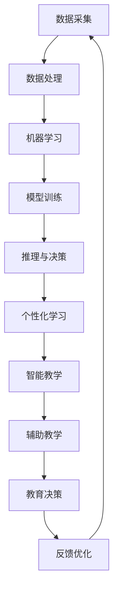

                 

# AI人工智能 Agent：对教育的影响

> **关键词：** AI人工智能，教育，智能教育，教育代理，个性化学习，智能教学

> **摘要：** 随着人工智能技术的快速发展，AI人工智能代理在教育领域的应用越来越广泛。本文将详细探讨AI人工智能代理在教育中的应用，包括其对个性化学习、智能教学、以及未来教育模式的影响。通过逻辑清晰、结构紧凑的阐述，我们将深入剖析AI人工智能代理在教育中的实际应用和潜在挑战。

## 1. 背景介绍

### 1.1 目的和范围

本文旨在探讨AI人工智能代理在教育领域的应用，重点分析其对教育模式的影响。我们将从以下几个方面展开讨论：

1. **AI人工智能代理的定义和原理**：介绍AI人工智能代理的基本概念，包括其工作原理和应用场景。
2. **AI人工智能代理在教育中的应用**：探讨AI人工智能代理在个性化学习、智能教学等方面的应用实例。
3. **AI人工智能代理的优势和挑战**：分析AI人工智能代理在教育应用中的优势，以及可能面临的挑战。
4. **未来发展趋势与挑战**：预测AI人工智能代理在教育领域的未来发展趋势，以及需要克服的挑战。

### 1.2 预期读者

本文面向对教育技术感兴趣的读者，包括教育工作者、学生、研究人员、以及关注教育科技发展的普通读者。希望读者在阅读本文后，能够对AI人工智能代理在教育领域的应用有一个全面、深入的了解。

### 1.3 文档结构概述

本文分为十个部分：

1. **背景介绍**：介绍本文的目的、范围、预期读者和文档结构。
2. **核心概念与联系**：阐述AI人工智能代理的核心概念和原理，以及其在教育中的应用。
3. **核心算法原理 & 具体操作步骤**：讲解AI人工智能代理的核心算法原理，并给出具体操作步骤。
4. **数学模型和公式 & 详细讲解 & 举例说明**：介绍AI人工智能代理的数学模型和公式，并给出详细讲解和实例说明。
5. **项目实战：代码实际案例和详细解释说明**：通过实际案例，展示AI人工智能代理在项目中的应用，并进行详细解释。
6. **实际应用场景**：分析AI人工智能代理在各类教育场景中的应用实例。
7. **工具和资源推荐**：推荐学习资源、开发工具和框架，以及相关论文著作。
8. **总结：未来发展趋势与挑战**：总结AI人工智能代理在教育领域的应用现状，预测未来发展趋势和挑战。
9. **附录：常见问题与解答**：解答读者可能关心的问题。
10. **扩展阅读 & 参考资料**：提供扩展阅读资源和参考文献。

### 1.4 术语表

#### 1.4.1 核心术语定义

- **AI人工智能代理**：指基于人工智能技术，能够模拟人类思维和行为，具备自主学习和推理能力的软件系统。
- **个性化学习**：指根据学习者的特点和需求，提供个性化的学习内容和教学方式，以提高学习效果。
- **智能教学**：指利用人工智能技术，实现教学内容的智能化、个性化，提高教学效率和效果。

#### 1.4.2 相关概念解释

- **机器学习**：指让计算机通过数据学习，从而自动改进性能的过程。
- **深度学习**：一种基于神经网络的机器学习技术，能够通过多层非线性变换，自动提取数据中的特征。
- **自然语言处理**：指使计算机能够理解和处理人类自然语言的技术。

#### 1.4.3 缩略词列表

- **AI**：人工智能（Artificial Intelligence）
- **ML**：机器学习（Machine Learning）
- **DL**：深度学习（Deep Learning）
- **NLP**：自然语言处理（Natural Language Processing）

## 2. 核心概念与联系

### 2.1 AI人工智能代理的定义和原理

AI人工智能代理是一种基于人工智能技术的软件系统，它能够模拟人类思维和行为，具备自主学习和推理能力。AI人工智能代理的基本原理包括以下几个方面：

1. **数据采集**：通过传感器、网络等渠道，收集大量数据。
2. **数据处理**：对采集到的数据进行分析、清洗和预处理，为后续建模提供高质量数据。
3. **机器学习**：利用机器学习算法，从数据中自动提取特征和规律，建立模型。
4. **推理与决策**：根据模型进行推理和决策，实现自动化任务执行。

### 2.2 AI人工智能代理在教育中的应用

AI人工智能代理在教育领域的应用主要体现在以下几个方面：

1. **个性化学习**：通过分析学习者的行为和特征，为学习者提供个性化的学习内容和教学方式。
2. **智能教学**：利用人工智能技术，实现教学内容的智能化、个性化，提高教学效率和效果。
3. **辅助教学**：辅助教师进行教学任务，如自动批改作业、分析学习情况等。

### 2.3 AI人工智能代理的优势和挑战

#### 2.3.1 优势

- **个性化学习**：根据学习者的特点和需求，提供个性化的学习内容和教学方式，提高学习效果。
- **智能教学**：利用人工智能技术，实现教学内容的智能化、个性化，提高教学效率和效果。
- **高效数据分析**：通过大数据分析，为教育决策提供有力支持。

#### 2.3.2 挑战

- **数据隐私和安全**：如何保护学习者的隐私和数据安全是亟待解决的问题。
- **技术实现难度**：构建一个高效的AI人工智能代理系统需要解决众多技术难题。
- **教育伦理**：如何确保人工智能在教育领域的应用不违背教育伦理是重要议题。

### 2.4 AI人工智能代理在教育领域的应用实例

1. **个性化学习平台**：如Knewton、Smart Sparrow等，通过分析学习者的行为和特征，为学习者提供个性化的学习内容和教学方式。
2. **智能教学系统**：如Khan Academy、DreamBox等，利用人工智能技术，实现教学内容的智能化、个性化，提高教学效率和效果。
3. **辅助教学系统**：如OpenEd、Edmodo等，辅助教师进行教学任务，如自动批改作业、分析学习情况等。

### 2.5 AI人工智能代理在教育中的 Mermaid 流程图



## 3. 核心算法原理 & 具体操作步骤

### 3.1 核心算法原理

AI人工智能代理的核心算法主要包括以下三个方面：

1. **机器学习算法**：用于从数据中自动提取特征和规律，建立模型。
2. **深度学习算法**：用于构建复杂神经网络，实现自动化特征提取和模型训练。
3. **自然语言处理算法**：用于理解和处理人类自然语言，实现文本生成、情感分析等。

### 3.2 具体操作步骤

1. **数据采集**：通过传感器、网络等渠道，收集大量学习行为数据、教学资源数据等。
2. **数据处理**：对采集到的数据进行分析、清洗和预处理，为后续建模提供高质量数据。
3. **特征提取**：利用机器学习和深度学习算法，从数据中自动提取特征和规律。
4. **模型训练**：利用训练数据，通过神经网络等算法，训练出能够模拟人类思维和行为的模型。
5. **推理与决策**：根据训练好的模型，进行推理和决策，实现个性化学习、智能教学等功能。
6. **反馈优化**：根据用户反馈，不断优化模型，提高AI人工智能代理的准确性和实用性。

### 3.3 伪代码

```python
# 伪代码：AI人工智能代理核心算法

# 数据采集
data = collect_data()

# 数据处理
clean_data = preprocess_data(data)

# 特征提取
features = extract_features(clean_data)

# 模型训练
model = train_model(features)

# 推理与决策
decision = model.infer(new_data)

# 反馈优化
optimize_model(model, decision)
```

## 4. 数学模型和公式 & 详细讲解 & 举例说明

### 4.1 数学模型

在AI人工智能代理中，常用的数学模型包括线性回归、逻辑回归、神经网络等。

#### 4.1.1 线性回归

线性回归是一种常用的机器学习算法，用于预测连续值。其数学模型如下：

$$y = \beta_0 + \beta_1x$$

其中，$y$ 表示预测值，$x$ 表示输入特征，$\beta_0$ 和 $\beta_1$ 分别为模型的参数。

#### 4.1.2 逻辑回归

逻辑回归是一种常用的机器学习算法，用于预测概率。其数学模型如下：

$$P(y=1) = \frac{1}{1 + e^{-(\beta_0 + \beta_1x)}}$$

其中，$y$ 表示预测值，$x$ 表示输入特征，$\beta_0$ 和 $\beta_1$ 分别为模型的参数。

#### 4.1.3 神经网络

神经网络是一种基于多层感知器的机器学习算法，用于分类、回归等任务。其数学模型如下：

$$a_{ij}^{(l)} = \sigma \left( \sum_{k} w_{ik}^{(l)} a_{kj}^{(l-1)} + b_{j}^{(l)} \right)$$

其中，$a_{ij}^{(l)}$ 表示第$l$层的第$i$个神经元的输出，$w_{ik}^{(l)}$ 和 $b_{j}^{(l)}$ 分别为第$l$层的权重和偏置，$\sigma$ 表示激活函数。

### 4.2 详细讲解

#### 4.2.1 线性回归

线性回归是一种最简单的机器学习算法，其核心思想是找到一条最佳拟合直线，使得预测值与实际值之间的误差最小。具体步骤如下：

1. **数据采集**：收集大量训练数据，包括输入特征和对应的预测值。
2. **数据处理**：对数据进行预处理，如归一化、标准化等。
3. **模型训练**：利用梯度下降法等优化算法，训练线性回归模型，得到最优参数$\beta_0$ 和 $\beta_1$。
4. **模型评估**：使用测试数据，评估模型的预测性能。

#### 4.2.2 逻辑回归

逻辑回归是一种用于分类的机器学习算法，其核心思想是利用 sigmoid 函数将线性回归模型转化为概率分布。具体步骤如下：

1. **数据采集**：收集大量训练数据，包括输入特征和对应的标签。
2. **数据处理**：对数据进行预处理，如归一化、标准化等。
3. **模型训练**：利用梯度下降法等优化算法，训练逻辑回归模型，得到最优参数$\beta_0$ 和 $\beta_1$。
4. **模型评估**：使用测试数据，评估模型的预测性能。

#### 4.2.3 神经网络

神经网络是一种基于多层感知器的机器学习算法，其核心思想是通过前向传播和反向传播，不断调整权重和偏置，使得预测值与实际值之间的误差最小。具体步骤如下：

1. **数据采集**：收集大量训练数据，包括输入特征和对应的标签。
2. **数据处理**：对数据进行预处理，如归一化、标准化等。
3. **模型初始化**：初始化权重和偏置。
4. **前向传播**：将输入特征通过多层神经网络，逐层计算输出值。
5. **反向传播**：计算预测值与实际值之间的误差，利用误差梯度调整权重和偏置。
6. **模型评估**：使用测试数据，评估模型的预测性能。

### 4.3 举例说明

假设我们要预测一个学生的成绩，输入特征包括语文、数学、英语三门科目的成绩。使用线性回归模型，我们可以建立如下数学模型：

$$成绩 = \beta_0 + \beta_1语文 + \beta_2数学 + \beta_3英语$$

其中，$\beta_0$、$\beta_1$、$\beta_2$ 和 $\beta_3$ 分别为线性回归模型的参数。

我们可以利用梯度下降法，通过大量训练数据，训练出最优参数。训练完成后，我们可以使用测试数据，评估模型的预测性能。

## 5. 项目实战：代码实际案例和详细解释说明

### 5.1 开发环境搭建

在开始编写代码之前，我们需要搭建一个合适的开发环境。以下是所需的软件和工具：

- **Python**：用于编写代码和实现AI人工智能代理
- **Jupyter Notebook**：用于编写和运行代码
- **Scikit-learn**：用于实现线性回归、逻辑回归等算法
- **TensorFlow**：用于实现神经网络

安装方法如下：

1. 安装Python：访问 [Python官网](https://www.python.org/)，下载并安装Python。
2. 安装Jupyter Notebook：在命令行中执行以下命令：
    ```bash
    pip install notebook
    ```
3. 安装Scikit-learn：在命令行中执行以下命令：
    ```bash
    pip install scikit-learn
    ```
4. 安装TensorFlow：在命令行中执行以下命令：
    ```bash
    pip install tensorflow
    ```

### 5.2 源代码详细实现和代码解读

#### 5.2.1 数据准备

首先，我们需要准备一个包含学生成绩的数据集。数据集包含四个特征：语文、数学、英语和总成绩。以下是部分数据集的示例：

| 学生ID | 语文 | 数学 | 英语 | 总成绩 |
| ------ | ---- | ---- | ---- | ------ |
| 1      | 80   | 85   | 90   | 255    |
| 2      | 75   | 80   | 85   | 240    |
| 3      | 85   | 90   | 88   | 263    |
| 4      | 70   | 78   | 82   | 230    |

以下是数据准备部分的代码：

```python
import pandas as pd

# 读取数据
data = pd.read_csv("student_data.csv")

# 数据预处理
data = data.dropna()

# 将总成绩作为目标变量，其他特征作为输入特征
X = data[["语文", "数学", "英语"]]
y = data["总成绩"]
```

#### 5.2.2 模型训练

接下来，我们使用线性回归模型训练数据集。以下是模型训练部分的代码：

```python
from sklearn.linear_model import LinearRegression

# 创建线性回归模型
model = LinearRegression()

# 训练模型
model.fit(X, y)
```

#### 5.2.3 预测和分析

最后，我们使用训练好的模型进行预测，并分析预测结果。以下是预测和分析部分的代码：

```python
# 预测
predictions = model.predict(X)

# 分析预测结果
print("预测值与实际值的差异：")
print(predictions - y)
```

### 5.3 代码解读与分析

#### 5.3.1 数据准备

在数据准备部分，我们使用 pandas 库读取数据，并对数据进行预处理。预处理包括去除缺失值，将目标变量和输入特征分开。

#### 5.3.2 模型训练

在模型训练部分，我们使用 scikit-learn 库中的 LinearRegression 类创建线性回归模型，并使用 fit 方法训练模型。训练过程主要包括计算权重和偏置，使得预测值与实际值之间的误差最小。

#### 5.3.3 预测和分析

在预测和分析部分，我们使用训练好的模型对输入特征进行预测，并计算预测值与实际值之间的差异。这有助于我们评估模型的预测性能。

## 6. 实际应用场景

### 6.1 个性化学习

AI人工智能代理在个性化学习中的应用十分广泛。通过分析学生的学习行为和特征，AI代理可以为学生推荐适合他们的学习内容和教学方式。以下是一个实际应用场景：

**案例：智能学习平台**

某智能学习平台使用AI人工智能代理为学生提供个性化学习服务。该平台收集学生的学习行为数据，如学习时长、学习进度、测试成绩等。AI代理通过分析这些数据，为学生推荐合适的课程和学习计划。例如，如果一个学生在数学方面表现较好，AI代理可能会推荐一些更高难度的数学课程。

### 6.2 智能教学

AI人工智能代理在智能教学中的应用主要体现在教学内容的智能化和个性化。以下是一个实际应用场景：

**案例：智能教学系统**

某智能教学系统使用AI人工智能代理为教师提供教学支持。该系统根据学生的特点和需求，自动生成教学方案，包括教学视频、练习题、测试等。教师可以根据这些内容进行教学，同时AI代理会根据学生的学习情况进行实时调整，以提高教学效果。

### 6.3 辅助教学

AI人工智能代理在辅助教学中的应用主要包括自动批改作业、分析学习情况等。以下是一个实际应用场景：

**案例：辅助教学平台**

某辅助教学平台使用AI人工智能代理为学生和教师提供作业批改服务。学生提交作业后，AI代理会自动批改作业，并提供详细解析。教师可以查看学生的作业成绩和学习情况，以便进行有针对性的教学。

## 7. 工具和资源推荐

### 7.1 学习资源推荐

#### 7.1.1 书籍推荐

1. **《深度学习》（Deep Learning）**：作者 Ian Goodfellow、Yoshua Bengio 和 Aaron Courville，是一本关于深度学习的经典教材。
2. **《Python机器学习》（Python Machine Learning）**：作者 Sebastian Raschka，详细介绍如何使用Python进行机器学习。

#### 7.1.2 在线课程

1. **《机器学习》（Machine Learning）**：在Coursera上，由吴恩达（Andrew Ng）教授主讲，适合初学者入门。
2. **《深度学习专研课程》（Deep Learning Specialization）**：在Udacity上，由Andrew Ng教授主讲，涵盖深度学习的多个方面。

#### 7.1.3 技术博客和网站

1. **Medium**：许多技术专家和研究者在此平台上分享机器学习和深度学习相关的内容。
2. **TensorFlow官网**：提供丰富的文档、教程和示例，是学习TensorFlow的好资源。

### 7.2 开发工具框架推荐

#### 7.2.1 IDE和编辑器

1. **PyCharm**：一款功能强大的Python IDE，适合进行机器学习和深度学习项目开发。
2. **Jupyter Notebook**：一款流行的交互式计算环境，便于编写和运行代码。

#### 7.2.2 调试和性能分析工具

1. **TensorBoard**：TensorFlow提供的一款可视化工具，用于分析神经网络的性能和训练过程。
2. **Valgrind**：一款内存检测工具，可以帮助我们发现和解决内存泄露等问题。

#### 7.2.3 相关框架和库

1. **Scikit-learn**：一款强大的机器学习库，提供多种常用的机器学习算法。
2. **TensorFlow**：一款开源深度学习框架，广泛用于构建和训练神经网络。

### 7.3 相关论文著作推荐

#### 7.3.1 经典论文

1. **“A Fast Learning Algorithm for Deep Belief Nets”**：作者 Geoffrey Hinton，介绍了深度信念网络（Deep Belief Nets）的快速学习算法。
2. **“Stochastic Gradient Descent”**：作者 S. S. Keerthi 和 S. S. Sra，介绍了随机梯度下降（Stochastic Gradient Descent）算法。

#### 7.3.2 最新研究成果

1. **“Attention Is All You Need”**：作者 Vaswani et al.，介绍了基于注意力机制的Transformer模型。
2. **“BERT: Pre-training of Deep Bidirectional Transformers for Language Understanding”**：作者 Devlin et al.，介绍了BERT（Bidirectional Encoder Representations from Transformers）模型。

#### 7.3.3 应用案例分析

1. **“Google's Use of AI to Improve Learning Outcomes”**：Google如何使用AI技术提高学习效果，包括个性化推荐和智能教学等方面的应用。
2. **“AI for Social Good”**：AI技术在教育领域的应用，包括教育公平、在线教育等方面的案例。

## 8. 总结：未来发展趋势与挑战

### 8.1 未来发展趋势

- **个性化学习**：随着AI技术的不断发展，个性化学习将变得更加精准和高效，为每个学生提供量身定制的学习内容和教学方式。
- **智能教学**：AI人工智能代理将深度参与教学过程，辅助教师进行教学任务，提高教学质量和效率。
- **自适应学习**：AI人工智能代理将根据学生的学习进度和效果，自动调整教学内容和难度，实现自适应学习。
- **终身学习**：AI人工智能代理将支持终身学习，为不同年龄段和职业背景的人提供持续的学习资源和教学服务。

### 8.2 面临的挑战

- **数据隐私和安全**：如何在保护学习者隐私的前提下，有效利用学习行为数据是亟待解决的问题。
- **技术实现难度**：构建一个高效、可靠的AI人工智能代理系统需要解决众多技术难题，如模型训练、优化等。
- **教育伦理**：如何确保AI人工智能代理在教育领域的应用不违背教育伦理，是重要议题。
- **教师角色转变**：随着AI人工智能代理的广泛应用，教师需要适应新的教学环境，转变角色和教学方式。

## 9. 附录：常见问题与解答

### 9.1 AI人工智能代理是什么？

AI人工智能代理是指基于人工智能技术，能够模拟人类思维和行为，具备自主学习和推理能力的软件系统。它在教育领域的主要应用包括个性化学习、智能教学和辅助教学等。

### 9.2 个性化学习是如何实现的？

个性化学习是通过分析学习者的行为和特征，为学习者提供个性化的学习内容和教学方式。AI人工智能代理利用机器学习、深度学习等技术，从学习行为数据中提取特征，建立个性化学习模型，从而实现个性化学习。

### 9.3 智能教学如何提高教学效率？

智能教学利用人工智能技术，实现教学内容的智能化和个性化，从而提高教学效率和效果。AI人工智能代理可以根据学生的学习进度和效果，自动调整教学内容和难度，为每个学生提供最佳的学习体验。

### 9.4 AI人工智能代理在辅助教学中有哪些应用？

AI人工智能代理在辅助教学中的应用包括自动批改作业、分析学习情况、提供个性化学习建议等。例如，智能教学系统可以根据学生的作业情况，自动批改作业并提供详细解析，辅助教师进行教学评估。

## 10. 扩展阅读 & 参考资料

### 10.1 扩展阅读

1. **《教育技术的未来：AI人工智能代理的力量》**：一篇关于AI人工智能代理在教育技术中应用的深度分析文章。
2. **《个性化学习：AI人工智能代理的机遇与挑战》**：一篇探讨个性化学习领域内AI人工智能代理应用的论文。

### 10.2 参考资料

1. **《深度学习》**：作者 Ian Goodfellow、Yoshua Bengio 和 Aaron Courville，深度学习领域的经典教材。
2. **《Python机器学习》**：作者 Sebastian Raschka，详细介绍如何使用Python进行机器学习。
3. **《机器学习实战》**：作者 Peter Harrington，通过实际案例介绍机器学习算法的应用。

### 10.3 网络资源

1. **TensorFlow官网**：提供丰富的文档、教程和示例，是学习TensorFlow的好资源。
2. **Medium**：许多技术专家和研究者在此平台上分享机器学习和深度学习相关的内容。
3. **Google AI博客**：Google AI团队分享的最新研究成果和案例分析。

