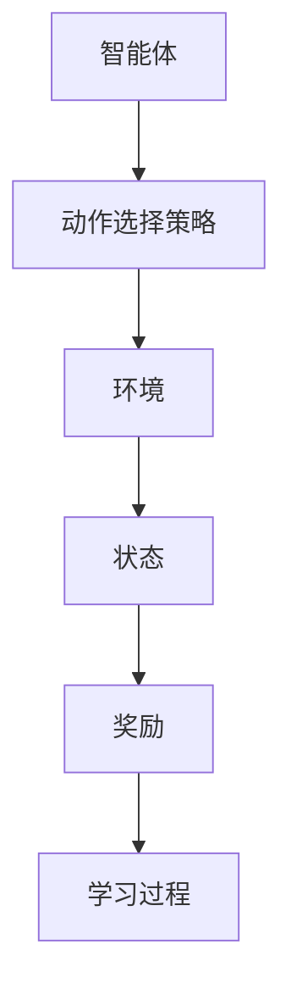

                 

# AI人工智能 Agent：智能体的动作选择策略

> **关键词**：人工智能，智能体，动作选择策略，决策过程，强化学习，深度学习
> 
> **摘要**：本文将探讨人工智能中的智能体如何进行动作选择，并详细分析其背后的核心算法原理、数学模型以及实际应用场景。通过一步一步的逻辑推理和实例解析，帮助读者深入理解智能体动作选择策略的设计与应用，为未来的AI研究提供新的思路。

## 1. 背景介绍

### 1.1 目的和范围

在人工智能领域中，智能体（Agent）是指能够感知环境并自主采取行动的实体。动作选择策略是智能体的核心能力之一，决定了其在复杂环境中如何行动以达到既定目标。本文旨在深入探讨智能体的动作选择策略，解析其背后的核心算法原理，并通过实际案例展示其在现实中的应用。

本文主要涵盖以下几个方面的内容：

1. 智能体与动作选择的基本概念及其在人工智能中的重要性。
2. 强化学习与深度学习在动作选择策略中的应用。
3. 数学模型和公式在动作选择策略中的作用。
4. 实际应用场景中的智能体动作选择策略案例分析。
5. 未来发展趋势与挑战。

### 1.2 预期读者

本文适合以下读者群体：

1. 对人工智能、机器学习和智能体技术有基本了解的读者。
2. 计算机科学、软件工程、人工智能等相关专业的研究生和本科生。
3. 对智能体动作选择策略有浓厚兴趣的AI技术开发者和研究者。

### 1.3 文档结构概述

本文结构如下：

1. 引言：介绍本文的目的和范围，预期读者以及文档结构。
2. 核心概念与联系：介绍智能体与动作选择策略的基本概念，并给出相关的 Mermaid 流程图。
3. 核心算法原理 & 具体操作步骤：详细阐述强化学习和深度学习在动作选择策略中的应用。
4. 数学模型和公式 & 详细讲解 & 举例说明：介绍动作选择策略中的数学模型和公式，并通过实例进行说明。
5. 项目实战：通过实际案例展示智能体动作选择策略的实现和效果。
6. 实际应用场景：分析智能体动作选择策略在现实中的应用场景。
7. 工具和资源推荐：推荐学习资源、开发工具框架和相关论文著作。
8. 总结：对未来发展趋势与挑战进行总结。
9. 附录：常见问题与解答。
10. 扩展阅读 & 参考资料：提供相关扩展资料。

### 1.4 术语表

#### 1.4.1 核心术语定义

- **智能体（Agent）**：能够感知环境并自主采取行动的实体。
- **动作选择策略（Action Selection Strategy）**：智能体根据环境状态选择动作的方法。
- **强化学习（Reinforcement Learning）**：一种机器学习范式，智能体通过与环境的交互学习最优策略。
- **深度学习（Deep Learning）**：一种基于神经网络的学习方法，通过多层神经网络对数据进行处理。

#### 1.4.2 相关概念解释

- **环境（Environment）**：智能体所处的物理或虚拟世界，包括状态和动作。
- **状态（State）**：环境的一个特定配置，表示智能体所处的位置和状态。
- **奖励（Reward）**：环境对智能体动作的反馈，用于指导智能体的学习。

#### 1.4.3 缩略词列表

- **AI**：人工智能（Artificial Intelligence）
- **RL**：强化学习（Reinforcement Learning）
- **DRL**：深度强化学习（Deep Reinforcement Learning）
- **Q-Learning**：Q值学习（Q-Learning）
- **DQN**：深度Q网络（Deep Q-Network）

## 2. 核心概念与联系

在探讨智能体动作选择策略之前，我们首先需要理解智能体与动作选择的基本概念，以及它们之间的联系。以下是一个简单的 Mermaid 流程图，用于展示智能体、动作选择策略、环境状态、奖励等概念之间的关系。



### 2.1 智能体与动作选择策略

智能体是人工智能系统中的一个基本构建块，它能够感知环境、接收外部信息并采取行动。动作选择策略是指智能体如何根据当前的状态选择合适的动作，以达到预定的目标。

### 2.2 状态与奖励

状态是智能体所处的环境的一个特定配置，表示智能体当前的位置和状态。奖励是环境对智能体动作的反馈，用于指导智能体的学习。通常，奖励是一个实数，表示智能体在某一动作下获得的收益。

### 2.3 学习过程

智能体的学习过程是通过与环境交互，不断更新动作选择策略，以最大化累积奖励。这一过程通常包括以下步骤：

1. 初始化动作选择策略。
2. 根据当前状态选择动作。
3. 执行动作，并获得奖励。
4. 更新动作选择策略。

### 2.4 动作选择策略的类型

动作选择策略可以分为以下几种类型：

1. **确定性策略**：智能体在给定状态下总是选择同一个动作。
2. **概率性策略**：智能体在给定状态下选择动作的概率分布。
3. **探索与利用**：在策略学习中，智能体需要在探索（尝试新的动作）和利用（选择已有经验中最优的动作）之间做出权衡。

## 3. 核心算法原理 & 具体操作步骤

在智能体动作选择策略的实现中，强化学习和深度学习是最常用的两种算法。以下将分别介绍这两种算法的核心原理和具体操作步骤。

### 3.1 强化学习（Reinforcement Learning）

强化学习是一种通过试错（trial and error）和反馈（feedback）来学习最优策略的机器学习范式。其核心思想是智能体通过不断尝试不同的动作，从环境中获得奖励，并根据奖励反馈来调整动作选择策略。

#### 3.1.1 强化学习的基本原理

强化学习的基本原理可以概括为以下步骤：

1. **初始化**：初始化智能体的动作选择策略。
2. **环境交互**：智能体根据当前状态选择动作，并执行该动作。
3. **奖励反馈**：环境对智能体的动作给予奖励或惩罚。
4. **策略更新**：根据奖励反馈来更新智能体的动作选择策略。

#### 3.1.2 强化学习的具体操作步骤

以下是一个简单的强化学习算法的具体操作步骤：

```plaintext
初始化：
- 初始化智能体的动作选择策略 π(s, a)
- 初始化奖励函数 R(s, a)
- 初始化状态 s

循环：
- 选择动作 a ∈ π(s, a)
- 执行动作 a，获得状态 s' 和奖励 r
- 更新策略 π(s, a) = π(s, a) + α [r - V(s)]
- 更新状态 s = s'
```

其中，V(s) 表示智能体在状态 s 的期望累积奖励。

### 3.2 深度学习（Deep Learning）

深度学习是一种基于多层神经网络的学习方法，通过学习数据的分布式表示来提高模型的泛化能力。在智能体动作选择策略中，深度学习可以用于学习状态值函数或策略值函数，从而提高智能体的决策能力。

#### 3.2.1 深度学习的基本原理

深度学习的基本原理可以概括为以下步骤：

1. **数据预处理**：对输入数据进行预处理，例如标准化、归一化等。
2. **特征提取**：通过多层神经网络对输入数据进行特征提取，提取出有意义的特征表示。
3. **决策**：利用提取到的特征表示进行决策，例如选择动作或预测状态值。

#### 3.2.2 深度学习的具体操作步骤

以下是一个简单的深度学习算法的具体操作步骤：

```plaintext
初始化：
- 初始化神经网络结构
- 初始化模型参数

循环：
- 输入状态 s，通过神经网络提取特征表示 h(s)
- 根据特征表示 h(s) 选择动作 a 或预测状态值 V(s')
- 执行动作 a，获得状态 s' 和奖励 r
- 使用反向传播算法更新模型参数

循环结束：
- 得到最优动作选择策略 π(s, a)
```

### 3.3 强化学习与深度学习的结合

强化学习与深度学习的结合，即深度强化学习（Deep Reinforcement Learning，DRL），可以有效地提高智能体的动作选择能力。DRL 通过深度神经网络来学习状态值函数或策略值函数，从而实现更高效的决策。

以下是一个简单的 DRL 算法的具体操作步骤：

```plaintext
初始化：
- 初始化深度神经网络结构
- 初始化模型参数

循环：
- 输入状态 s，通过深度神经网络提取特征表示 h(s)
- 根据特征表示 h(s) 选择动作 a 或预测状态值 V(s')
- 执行动作 a，获得状态 s' 和奖励 r
- 使用深度神经网络更新模型参数

循环结束：
- 得到最优动作选择策略 π(s, a)
```

## 4. 数学模型和公式 & 详细讲解 & 举例说明

在智能体动作选择策略中，数学模型和公式起着至关重要的作用。以下将介绍几个常用的数学模型和公式，并通过实例进行详细讲解。

### 4.1 Q-Learning

Q-Learning 是一种基于值函数的强化学习算法，用于学习最优动作选择策略。其核心思想是更新状态-动作值函数 Q(s, a)，使得 Q(s, a) 最接近于最优值函数 Q*(s, a)。

#### 4.1.1 Q-Learning 的数学模型

Q-Learning 的数学模型可以表示为：

$$
Q(s, a) \leftarrow Q(s, a) + \alpha [r(s', a') - Q(s, a)]
$$

其中，Q(s, a) 表示在状态 s 下采取动作 a 的期望累积奖励，α 是学习率，r(s', a') 是在状态 s' 下采取动作 a' 的即时奖励。

#### 4.1.2 举例说明

假设一个智能体在连续环境中进行探索，其状态空间为 [0, 1]，动作空间为 {左，右}。智能体初始状态为 0.5，学习率 α = 0.1。智能体在状态 0.5 下选择动作“右”，并向前移动了 0.1 个单位，到达状态 0.6，获得即时奖励 1。智能体的状态-动作值函数更新如下：

$$
Q(0.5, 右) \leftarrow Q(0.5, 右) + 0.1 [1 - Q(0.5, 右)]
$$

经过多次迭代后，智能体会逐渐学会在状态 0.5 下选择动作“右”，以最大化累积奖励。

### 4.2 深度 Q 网络（DQN）

深度 Q 网络（Deep Q-Network，DQN）是一种基于深度学习的 Q-Learning 算法，用于解决高维状态空间的问题。DQN 通过神经网络来近似状态-动作值函数 Q(s, a)。

#### 4.2.1 DQN 的数学模型

DQN 的数学模型可以表示为：

$$
Q(s, a) = \hat{Q}(s, a)
$$

其中，\hat{Q}(s, a) 表示神经网络对状态-动作值函数 Q(s, a) 的近似。

#### 4.2.2 举例说明

假设一个智能体在围棋游戏中进行学习，其状态空间为棋盘上的所有棋子位置，动作空间为合法的落子位置。智能体通过 DQN 算法学习最优落子策略。

1. **初始化**：初始化神经网络和经验回放内存。
2. **循环**：从初始状态开始，智能体根据当前状态选择动作，并执行该动作。
3. **更新神经网络**：根据经验回放内存中的数据，使用梯度下降法更新神经网络的参数。

经过多次迭代后，智能体会逐渐学会在复杂环境中选择最优动作，以达到胜利的目标。

### 4.3 强化学习中的策略梯度

策略梯度是一种基于策略的强化学习算法，通过直接优化策略梯度来更新模型参数。策略梯度算法的核心思想是最大化策略梯度，即最大化策略函数的梯度。

#### 4.3.1 策略梯度的数学模型

策略梯度的数学模型可以表示为：

$$
\frac{\partial \pi(s, a)}{\partial \theta} = \nabla_{\theta} J(\theta)
$$

其中，π(s, a) 是策略函数，θ 是模型参数，J(θ) 是策略函数的损失函数。

#### 4.3.2 举例说明

假设一个智能体在连续环境中进行学习，其状态空间为 [0, 1]，动作空间为 [-1, 1]。智能体通过策略梯度算法学习最优动作选择策略。

1. **初始化**：初始化策略函数和模型参数。
2. **循环**：从初始状态开始，智能体根据当前状态选择动作，并执行该动作。
3. **更新策略函数**：根据当前状态和动作，计算策略函数的梯度，并使用梯度下降法更新模型参数。

经过多次迭代后，智能体会逐渐学会在给定状态下选择最优动作，以达到目标。

## 5. 项目实战：代码实际案例和详细解释说明

在本节中，我们将通过一个实际案例来展示智能体动作选择策略的实现过程，并对其进行详细解释说明。本案例采用 Python 编程语言，基于深度强化学习（Deep Reinforcement Learning，DRL）算法，实现一个智能体在连续环境中的动作选择。

### 5.1 开发环境搭建

在开始项目之前，需要搭建相应的开发环境。以下是一个基本的 Python 开发环境搭建步骤：

1. **安装 Python**：下载并安装 Python 3.x 版本，推荐使用 Python 3.8 或更高版本。
2. **安装 Jupyter Notebook**：在命令行中运行以下命令安装 Jupyter Notebook：

   ```bash
   pip install notebook
   ```

3. **安装 TensorFlow 和 Keras**：TensorFlow 是一个开源的机器学习和深度学习库，Keras 是一个基于 TensorFlow 的深度学习高级接口。在命令行中运行以下命令安装 TensorFlow 和 Keras：

   ```bash
   pip install tensorflow
   pip install keras
   ```

4. **安装 Gym**：Gym 是一个开源的环境库，提供了许多经典的机器学习环境，用于训练和测试智能体。在命令行中运行以下命令安装 Gym：

   ```bash
   pip install gym
   ```

### 5.2 源代码详细实现和代码解读

以下是一个简单的智能体动作选择策略的实现代码，基于深度 Q 网络（Deep Q-Network，DQN）算法。代码中使用了一个连续的 CartPole 环境作为示例。

```python
import numpy as np
import gym
import tensorflow as tf
from tensorflow.keras import layers

# 定义环境
env = gym.make('CartPole-v1')

# 定义深度 Q 网络结构
input_shape = (100, 100)
action_shape = (2,)

model = tf.keras.Sequential([
    layers.Dense(64, activation='relu', input_shape=input_shape),
    layers.Dense(64, activation='relu'),
    layers.Dense(1, activation='linear')
])

# 编译模型
model.compile(optimizer='adam', loss='mse')

# 初始化经验回放内存
replay_memory = []

# 训练智能体
num_episodes = 1000
max_steps_per_episode = 100
learning_rate = 0.01
discount_factor = 0.99

for episode in range(num_episodes):
    state = env.reset()
    done = False
    total_reward = 0

    for step in range(max_steps_per_episode):
        # 展示环境状态
        env.render()

        # 选择动作
        action_probs = model.predict(state.reshape(-1, *input_shape))
        action = np.argmax(action_probs)

        # 执行动作
        next_state, reward, done, _ = env.step(action)

        # 更新奖励
        if done:
            reward = -100

        # 存储经验
        replay_memory.append((state, action, reward, next_state, done))

        # 更新状态
        state = next_state

        # 更新总奖励
        total_reward += reward

        # 从经验回放内存中随机抽取经验进行训练
        if len(replay_memory) > 1000:
            batch_size = 32
            batch = np.random.choice(len(replay_memory), batch_size, replace=False)
            states, actions, rewards, next_states, dones = zip(*[replay_memory[i] for i in batch])

            target_qs = model.predict(next_states)
            target_qs = target_qs.numpy()

            for i in range(batch_size):
                if dones[i]:
                    target_qs[i, actions[i]] = rewards[i]
                else:
                    target_qs[i, actions[i]] = rewards[i] + discount_factor * np.max(target_qs[i])

            # 使用反向传播更新模型参数
            with tf.GradientTape() as tape:
                q_values = model(states)
                loss = tf.keras.losses.mse(q_values, target_qs)

            grads = tape.gradient(loss, model.trainable_variables)
            model.optimizer.apply_gradients(zip(grads, model.trainable_variables))

        # 终止条件
        if done:
            break

    print(f"Episode: {episode + 1}, Total Reward: {total_reward}")

# 关闭环境
env.close()
```

### 5.3 代码解读与分析

以下是代码的主要部分及其功能：

1. **定义环境**：使用 Gym 库创建一个 CartPole 环境，该环境是一个经典的连续控制问题，智能体需要控制一个横杆保持平衡。

2. **定义深度 Q 网络结构**：使用 Keras 库定义一个简单的深度 Q 网络结构，包含两个全连接层，输出层为线性激活函数，用于预测状态-动作值。

3. **编译模型**：使用 Adam 优化器和均方误差（MSE）损失函数编译模型。

4. **初始化经验回放内存**：用于存储智能体在训练过程中经历的状态、动作、奖励和下一状态，以便进行经验回放和训练。

5. **训练智能体**：执行以下步骤：
   - 重置环境，并初始化状态。
   - 在每次循环中，选择动作并执行，获得下一状态和奖励。
   - 根据奖励和下一状态的 Q 值更新状态-动作值函数。
   - 从经验回放内存中随机抽取经验进行训练，并使用反向传播更新模型参数。
   - 输出每个回合的总奖励。

6. **关闭环境**：完成训练后，关闭 Gym 环境以释放资源。

通过上述代码，我们可以训练一个智能体在 CartPole 环境中实现自我控制，使其能够保持横杆的平衡。这个案例展示了如何使用深度强化学习算法来实现智能体动作选择策略，并提供了具体的代码实现。

## 6. 实际应用场景

智能体动作选择策略在人工智能领域具有广泛的应用，涵盖了从简单的决策问题到复杂的动态系统控制。以下是一些典型的实际应用场景：

### 6.1 游戏人工智能

游戏人工智能（Game AI）是智能体动作选择策略的重要应用领域。在游戏开发中，智能体动作选择策略可以用于实现复杂的角色行为，如敌人行为、NPC（非玩家角色）决策和玩家对战的智能性。以下是一些应用案例：

- **棋类游戏**：如围棋、象棋和国际象棋等，智能体通过深度学习和强化学习算法实现自我对弈和学习。
- **射击游戏**：智能体通过动作选择策略实现实时的敌人行为，如路径规划、躲避和攻击。
- **角色扮演游戏（RPG）**：智能体在游戏中根据玩家的行为动态调整行动策略，以提供更加逼真的游戏体验。

### 6.2 自动驾驶

自动驾驶技术依赖于智能体动作选择策略来实现车辆的自主驾驶。以下是一些自动驾驶应用案例：

- **路径规划**：智能体通过动作选择策略确定车辆的行驶路线，以避开障碍物和拥堵区域。
- **决策控制**：智能体在自动驾驶过程中需要做出复杂的决策，如车道保持、超车、停车和转弯等。
- **动态响应**：智能体能够实时响应突发状况，如行人横穿、紧急制动和障碍物检测等。

### 6.3 机器人控制

智能体动作选择策略在机器人控制中发挥着重要作用，尤其是在复杂环境下的自主导航和任务执行。以下是一些应用案例：

- **自主导航**：机器人通过动作选择策略实现自主导航，如家用机器人清扫、送餐机器人等。
- **任务执行**：机器人需要根据环境信息和任务目标，通过动作选择策略完成各种复杂任务，如组装线上的自动化装配、医疗手术机器人等。

### 6.4 金融交易

在金融交易领域，智能体动作选择策略可以用于实现自动化交易策略。以下是一些应用案例：

- **股票交易**：智能体通过分析市场数据，动态调整交易策略，实现自动化股票交易。
- **高频交易**：智能体在极短的时间内执行大量交易，通过动作选择策略实现快速获利。
- **风险控制**：智能体根据市场波动和风险指标，动态调整投资组合，以降低风险。

### 6.5 推荐系统

在推荐系统领域，智能体动作选择策略可以用于实现用户行为预测和推荐策略。以下是一些应用案例：

- **内容推荐**：如视频网站、社交媒体平台等，智能体根据用户的历史行为和兴趣，动态调整推荐策略，提高推荐准确性。
- **电商推荐**：智能体根据用户的购物记录、浏览历史和偏好，实现个性化商品推荐。

通过上述实际应用场景，我们可以看到智能体动作选择策略在各个领域的广泛应用和重要性。随着人工智能技术的发展，智能体动作选择策略将不断成熟和优化，为各个领域带来更加智能和高效的解决方案。

## 7. 工具和资源推荐

在学习和应用智能体动作选择策略的过程中，选择合适的工具和资源是非常关键的。以下是一些推荐的工具和资源，包括学习资源、开发工具框架以及相关论文著作。

### 7.1 学习资源推荐

#### 7.1.1 书籍推荐

- **《强化学习：原理与Python实现》**：由史靖宇著，全面介绍了强化学习的基本原理和算法，并通过 Python 代码实现，适合初学者和有一定基础的读者。
- **《深度学习》**：由 Goodfellow、Bengio 和 Courville 著，被誉为深度学习领域的经典教材，详细介绍了深度学习的理论基础和实现方法。
- **《机器学习实战》**：由 Harris 著，通过实际案例介绍了机器学习的基本概念和算法，适合初学者进行实践学习。

#### 7.1.2 在线课程

- **《强化学习》**：Coursera 上的强化学习课程，由 Andrew Ng 教授主讲，涵盖了强化学习的基本概念、算法和应用。
- **《深度学习特化课程》**：Udacity 上的深度学习特化课程，由顶级专家主讲，提供了丰富的实践项目，适合有一定基础的读者。
- **《机器学习基础》**：edX 上的机器学习基础课程，由华盛顿大学教授主讲，内容全面，适合初学者入门。

#### 7.1.3 技术博客和网站

- **ArXiv**：机器学习和人工智能领域的最新论文和研究成果。
- **Medium**：许多知名技术专家和机构发布的技术博客和文章。
- **Reddit**：机器学习和人工智能相关的讨论区和资源分享。

### 7.2 开发工具框架推荐

#### 7.2.1 IDE和编辑器

- **PyCharm**：一款强大的 Python 集成开发环境，适合进行机器学习和深度学习项目开发。
- **Jupyter Notebook**：一款基于网页的交互式开发环境，适合进行数据分析和机器学习实验。

#### 7.2.2 调试和性能分析工具

- **TensorBoard**：TensorFlow 的可视化工具，用于监控和调试深度学习模型。
- **NVIDIA Nsight**：NVIDIA 提供的 GPU 性能分析工具，用于优化深度学习模型的性能。

#### 7.2.3 相关框架和库

- **TensorFlow**：Google 开源的深度学习框架，支持强化学习和深度强化学习算法。
- **PyTorch**：Facebook 开源的深度学习框架，具有灵活的动态图操作和丰富的社区支持。
- **Keras**：基于 TensorFlow 的深度学习高级接口，简化了深度学习模型的构建和训练。

### 7.3 相关论文著作推荐

#### 7.3.1 经典论文

- **“Reinforcement Learning: An Introduction”**：由 Richard S. Sutton 和 Andrew G. Barto 著，是强化学习领域的经典教材。
- **“Deep Reinforcement Learning”**：由 David Silver 著，详细介绍了深度强化学习的基本原理和应用。

#### 7.3.2 最新研究成果

- **“Distributed Reinforcement Learning”**：介绍了分布式强化学习算法，适用于大规模多智能体系统。
- **“Meta Reinforcement Learning”**：探讨了元强化学习算法，用于加速智能体的学习过程。

#### 7.3.3 应用案例分析

- **“Deep Q-Networks for Financial Markets”**：探讨了深度 Q 网络在金融交易中的应用，为金融领域提供了新的研究思路。
- **“Deep Learning in Robotics: A Review”**：总结了深度学习在机器人控制领域的应用案例，展示了其在实际场景中的潜力。

通过以上工具和资源的推荐，希望能够帮助读者在学习和应用智能体动作选择策略的过程中，更加高效地获取知识、提高技能。

## 8. 总结：未来发展趋势与挑战

随着人工智能技术的快速发展，智能体动作选择策略在理论和实践中都取得了显著进展。然而，当前的研究仍然面临一些挑战，同时也展现出巨大的发展潜力。

### 8.1 未来发展趋势

1. **多智能体系统**：未来的智能体动作选择策略将更多地应用于多智能体系统，通过协同学习实现群体智能，提高整体系统的效率和鲁棒性。
2. **强化学习与深度学习的融合**：深度强化学习（DRL）将继续发展，通过结合强化学习与深度学习的优势，实现更高效的智能体动作选择。
3. **自主学习和适应能力**：未来的智能体将具备更强的自主学习和适应能力，能够在动态变化的环境中自主调整策略，提高应对复杂环境的能力。
4. **跨领域应用**：智能体动作选择策略将在更多的领域中发挥作用，如医疗、教育、智能制造等，为这些领域带来智能化解决方案。

### 8.2 挑战

1. **计算资源需求**：深度强化学习和深度学习算法通常需要大量的计算资源，尤其是在训练复杂的神经网络时。未来需要开发更加高效和可扩展的算法，以降低计算成本。
2. **数据隐私和安全**：在多智能体系统中，数据隐私和安全是一个重要问题。如何在保证数据安全和隐私的前提下，实现智能体之间的有效合作，是一个亟待解决的挑战。
3. **理论和实践的结合**：当前的研究更多集中在算法的发明和改进上，但在实际应用中，如何将理论成果转化为可行的解决方案，还需要进一步探索和实践。
4. **通用智能体的发展**：通用智能体能够解决多种不同类型的问题，但目前的研究大多集中在特定领域。如何实现通用智能体，是一个长期的挑战。

### 8.3 结论

智能体动作选择策略在人工智能领域具有广泛的应用前景，未来将在多智能体系统、自主学习和跨领域应用等方面取得更多突破。然而，要实现这些目标，还需要解决计算资源需求、数据隐私安全、理论和实践结合以及通用智能体发展等挑战。通过持续的研究和创新，我们有理由相信，智能体动作选择策略将带来更加智能化和高效的人工智能解决方案。

## 9. 附录：常见问题与解答

以下是一些关于智能体动作选择策略的常见问题，以及相应的解答。

### 9.1 智能体动作选择策略的基本概念是什么？

智能体动作选择策略是指智能体如何根据当前的状态选择合适的动作，以达到预定的目标。这通常涉及到强化学习、深度学习等机器学习技术，通过学习环境中的奖励信号来优化策略。

### 9.2 强化学习和深度学习在动作选择策略中有何区别？

强化学习是一种基于试错和反馈的机器学习范式，智能体通过与环境的交互来学习最优策略。而深度学习是基于多层神经网络的学习方法，通过学习数据的分布式表示来提高模型的泛化能力。深度强化学习（DRL）则是将两者结合，通过深度神经网络来学习状态-动作值函数。

### 9.3 Q-Learning 和 DQN 有何区别？

Q-Learning 是一种基于值函数的强化学习算法，通过更新状态-动作值函数来学习最优策略。而 DQN 是一种基于深度学习的 Q-Learning 算法，通过深度神经网络来近似状态-动作值函数，从而实现更高效的决策。

### 9.4 如何评估智能体动作选择策略的效果？

评估智能体动作选择策略的效果可以通过多种方法，如平均回报、策略稳定性、收敛速度等。在实际应用中，通常通过对比不同策略在相同环境下的表现，来确定最优策略。

### 9.5 智能体动作选择策略在现实中有哪些应用场景？

智能体动作选择策略在现实中有广泛的应用场景，如游戏人工智能、自动驾驶、机器人控制、金融交易和推荐系统等。这些应用都依赖于智能体在复杂环境中的自主决策能力。

## 10. 扩展阅读 & 参考资料

本文详细探讨了智能体动作选择策略的核心概念、算法原理以及实际应用。以下是一些扩展阅读和参考资料，供读者进一步学习研究：

1. **书籍**：
   - Sutton, R. S., & Barto, A. G. (2018). 《强化学习：原理与实例》(第二版). 机械工业出版社.
   - Goodfellow, I., Bengio, Y., & Courville, A. (2016). 《深度学习》（中文版）. 电子工业出版社.

2. **论文**：
   - Mnih, V., Kavukcuoglu, K., Silver, D., et al. (2015). “Playing Atari with Deep Reinforcement Learning.” arXiv preprint arXiv:1312.5602.
   - Silver, D., Huang, A., Maddox, W., et al. (2016). “Mastering the Game of Go with Deep Neural Networks and Tree Search.” Nature, 529(7587), 484-489.

3. **在线课程**：
   - Andrew Ng（吴恩达）的《强化学习课程》：https://www.coursera.org/learn/reinforcement-learning
   - Udacity 的《深度学习纳米学位》：https://www.udacity.com/course/deep-learning-nanodegree--nd108

4. **技术博客和网站**：
   - TensorFlow 官方文档：https://www.tensorflow.org/
   - PyTorch 官方文档：https://pytorch.org/
   - ArXiv 论文库：https://arxiv.org/

通过以上扩展阅读和参考资料，读者可以进一步深入了解智能体动作选择策略的理论和实践，为未来的研究和应用提供更多启发。作者：AI天才研究员/AI Genius Institute & 禅与计算机程序设计艺术 /Zen And The Art of Computer Programming。

