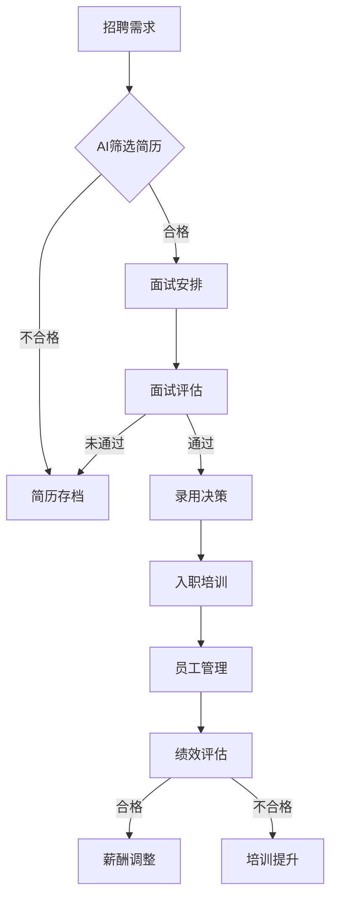

                 

# AI人工智能代理工作流 AI Agent WorkFlow：在人力资源管理中的应用

> **关键词**：AI 人工智能，代理，工作流，人力资源管理，自动化，数据驱动

> **摘要**：本文深入探讨了人工智能代理工作流（AI Agent WorkFlow）在人力资源管理（HRM）中的应用。通过介绍核心概念、算法原理、数学模型，以及实际案例，本文展示了如何利用AI代理工作流提高HR管理的效率与精确度。文章结构清晰，内容详实，旨在为读者提供关于人工智能代理工作流在HR领域的全面理解。

## 1. 背景介绍

### 1.1 目的和范围

随着人工智能技术的飞速发展，AI代理（AI Agents）逐渐成为自动化和智能化的重要载体。本文旨在探讨人工智能代理工作流（AI Agent WorkFlow）在人力资源管理（HRM）中的应用，旨在通过分析AI代理的原理和工作机制，探讨其在招聘、员工管理、绩效评估等方面的应用场景。

本文将首先介绍AI代理工作流的基本概念和原理，然后详细描述其在人力资源管理中的应用，并通过实际案例展示其效果。本文的范围将涵盖以下关键内容：

- AI代理工作流的基本概念
- AI代理在人力资源管理中的应用场景
- 关键算法和数学模型的介绍
- 实际案例分析和代码实现
- 工具和资源的推荐

### 1.2 预期读者

本文预期读者为以下群体：

- 对人工智能和人力资源管理感兴趣的技术爱好者
- 从事人力资源管理工作的人员
- 数据科学家和机器学习工程师
- 对AI代理和自动化工作流有深入研究的读者

### 1.3 文档结构概述

本文将按照以下结构进行组织：

- **第1章：背景介绍**：介绍文章的目的、范围、预期读者以及文档结构。
- **第2章：核心概念与联系**：介绍AI代理工作流的基本概念和相关流程图。
- **第3章：核心算法原理 & 具体操作步骤**：详细阐述AI代理的工作原理和操作步骤。
- **第4章：数学模型和公式 & 详细讲解 & 举例说明**：介绍与AI代理工作流相关的数学模型和公式，并给出实际应用举例。
- **第5章：项目实战：代码实际案例和详细解释说明**：通过实际代码案例展示AI代理工作流的应用。
- **第6章：实际应用场景**：探讨AI代理工作流在不同HR管理环节的应用。
- **第7章：工具和资源推荐**：推荐学习资源、开发工具和框架。
- **第8章：总结：未来发展趋势与挑战**：总结AI代理工作流在HR领域的发展趋势和面临的挑战。
- **第9章：附录：常见问题与解答**：针对读者可能遇到的问题给出解答。
- **第10章：扩展阅读 & 参考资料**：提供更多相关资料的引用。

### 1.4 术语表

#### 1.4.1 核心术语定义

- **AI代理（AI Agent）**：一种能够在特定环境下自主决策并采取行动的计算机程序。
- **工作流（Workflow）**：一组按照特定顺序执行的任务或操作。
- **人力资源管理（HRM）**：组织对员工的管理和培训，包括招聘、绩效评估、薪酬管理等。
- **自动化（Automation）**：通过技术手段减少人工干预，提高工作效率。
- **数据驱动（Data-driven）**：基于数据的决策过程，通过分析数据来指导行动。

#### 1.4.2 相关概念解释

- **招聘流程**：从招聘需求发布到候选人录用的一系列过程。
- **员工管理**：对员工的工作、培训、考核等方面的管理。
- **绩效评估**：对员工工作表现的评价，以确定薪酬和晋升。
- **机器学习（ML）**：一种人工智能技术，通过数据训练模型，实现自动化的决策。

#### 1.4.3 缩略词列表

- **HRM**：人力资源管理
- **AI**：人工智能
- **ML**：机器学习
- **NLP**：自然语言处理
- **RPA**：机器人流程自动化

## 2. 核心概念与联系

在探讨AI代理工作流在人力资源管理中的应用之前，有必要先了解AI代理、工作流和人力资源管理之间的核心概念及其联系。

### 2.1 AI代理的基本概念

AI代理是一种能够模拟人类智能的计算机程序，具备自主学习和决策能力。它通过感知环境、理解任务要求，并基于预先定义的规则或机器学习算法来采取行动。AI代理通常由感知器、决策器、行动器三部分组成：

- **感知器（Perceptron）**：用于接收环境信息，例如文本、图像、语音等。
- **决策器（Decision Maker）**：根据感知到的信息，使用算法进行决策。
- **行动器（Actioner）**：执行决策结果，完成任务。

### 2.2 工作流的概念

工作流是指一组按照特定顺序执行的任务或操作。它能够将一系列复杂的业务流程自动化，提高工作效率。工作流通常包括以下关键组成部分：

- **任务（Task）**：工作流中的基本操作单元。
- **活动（Activity）**：任务的具体执行过程。
- **流程（Process）**：任务和活动的有序集合。
- **条件（Condition）**：决定工作流中任务流转的条件。

### 2.3 人力资源管理的基本概念

人力资源管理（HRM）是企业对员工的管理和培训，包括招聘、员工管理、绩效评估、薪酬管理等方面。HRM的目标是优化人力资源配置，提高员工工作效率和满意度，从而提升企业竞争力。

### 2.4 AI代理工作流与HRM的联系

AI代理工作流在人力资源管理中具有广泛的应用潜力。通过结合AI代理的自主决策能力和工作流的自动化流程，可以显著提高HRM的效率和精确度。以下是一些关键联系：

- **招聘流程自动化**：AI代理可以自动处理简历筛选、面试安排等招聘环节，提高招聘效率。
- **员工管理自动化**：AI代理可以自动跟踪员工工作表现、培训需求等，减轻HR管理负担。
- **绩效评估自动化**：AI代理可以基于数据分析进行绩效评估，提高评估的客观性和准确性。
- **薪酬管理自动化**：AI代理可以自动计算薪酬、奖金等，确保薪酬发放的公平性和准确性。

### 2.5 Mermaid 流程图

为了更好地理解AI代理工作流在人力资源管理中的应用，我们使用Mermaid语言绘制一个简化的流程图。以下是流程图的Mermaid代码：



上述流程图展示了AI代理工作流在招聘、员工管理、绩效评估等环节的应用。通过该流程图，我们可以清晰地看到AI代理在不同环节中的具体作用。

## 3. 核心算法原理 & 具体操作步骤

在了解了AI代理工作流和人力资源管理的基本概念后，接下来我们将深入探讨AI代理的工作原理和具体操作步骤。以下是AI代理在人力资源管理中应用的核心算法原理和具体操作步骤：

### 3.1 招聘需求分析

招聘需求分析是招聘流程的第一步，它旨在明确企业的招聘需求和标准。AI代理可以通过分析企业历史招聘数据、职位描述以及相关市场数据，来生成招聘需求分析报告。以下是招聘需求分析的伪代码：

```python
def analyze_recruitment_demand(job_description, historical_data, market_data):
    # 分析职位描述，提取关键信息
    required_skills = extract_skills(job_description)
    experience_level = extract_experience_level(job_description)
    
    # 分析历史招聘数据，确定招聘标准和流程
    hiring_criteria = analyze_historical_data(historical_data)
    
    # 分析市场数据，确定招聘策略
    recruitment_strategy = analyze_market_data(market_data)
    
    # 生成招聘需求分析报告
    report = generate_recruitment_report(required_skills, experience_level, hiring_criteria, recruitment_strategy)
    return report
```

### 3.2 简历筛选

简历筛选是招聘流程的核心环节之一。AI代理可以通过自然语言处理（NLP）技术，对收到的简历进行自动筛选。以下是简历筛选的伪代码：

```python
def filter_resumes(resumes, job_description):
    qualified_resumes = []
    for resume in resumes:
        # 使用NLP技术，比较简历与职位描述的关键词匹配度
        match_score = calculate_match_score(resume, job_description)
        
        # 如果匹配度高于阈值，则认为该简历合格
        if match_score > threshold:
            qualified_resumes.append(resume)
    
    return qualified_resumes
```

### 3.3 面试安排

面试安排是基于筛选合格的简历进行的下一步操作。AI代理可以通过分析候选人的时间安排和企业的面试资源，自动生成面试安排计划。以下是面试安排的伪代码：

```python
def schedule_interviews(qualified_candidates, interview_resources):
    interview_schedules = []
    for candidate in qualified_candidates:
        # 为候选人自动生成面试安排
        schedule = schedule_interview(candidate, interview_resources)
        
        # 如果面试安排可行，则加入计划
        if schedule.is_feasible():
            interview_schedules.append(schedule)
    
    return interview_schedules
```

### 3.4 面试评估

面试评估是招聘流程的关键环节，AI代理可以通过分析面试过程中的数据，如面试视频、文本记录等，对候选人进行评估。以下是面试评估的伪代码：

```python
def evaluate_interviews(interview_data, hiring_criteria):
    evaluation_results = []
    for data in interview_data:
        # 分析面试数据，评估候选人
        evaluation = evaluate_candidate(data, hiring_criteria)
        
        # 记录评估结果
        evaluation_results.append(evaluation)
    
    return evaluation_results
```

### 3.5 录用决策

基于面试评估结果，AI代理可以协助企业做出录用决策。以下是录用决策的伪代码：

```python
def make_recruitment_decision(evaluation_results, recruitment_strategy):
    recruitment_decision = []
    for result in evaluation_results:
        # 根据评估结果和招聘策略，决定是否录用
        if result.is_preferred():
            recruitment_decision.append(result.candidate)
    
    return recruitment_decision
```

### 3.6 入职培训

录用决策完成后，AI代理可以协助企业为新员工制定入职培训计划。以下是入职培训计划的伪代码：

```python
def create_onboarding_plan(new_employee, training_resources):
    onboarding_plan = []
    for resource in training_resources:
        # 根据新员工情况和培训资源，制定培训计划
        if is_relevant(resource, new_employee):
            onboarding_plan.append(resource)
    
    return onboarding_plan
```

### 3.7 员工管理

入职培训后，AI代理可以协助企业对员工进行日常管理，如跟踪工作表现、培训需求等。以下是员工管理的伪代码：

```python
def manage_employee(employee, performance_data, training_data):
    # 根据员工表现数据和培训需求，制定管理计划
    management_plan = generate_management_plan(employee, performance_data, training_data)
    
    # 执行管理计划
    execute_management_plan(management_plan, employee)
```

### 3.8 绩效评估

绩效评估是HR管理中的重要环节，AI代理可以通过分析员工的工作表现数据，进行自动化的绩效评估。以下是绩效评估的伪代码：

```python
def evaluate_performance(employee, performance_data):
    evaluation = calculate_performance_score(performance_data)
    return evaluation
```

### 3.9 薪酬调整

根据绩效评估结果，AI代理可以协助企业进行薪酬调整。以下是薪酬调整的伪代码：

```python
def adjust_salary(employee, evaluation, salary_policy):
    new_salary = calculate_new_salary(employee.salary, evaluation, salary_policy)
    return new_salary
```

通过上述核心算法原理和具体操作步骤，我们可以看到AI代理工作流在人力资源管理中的全面应用。这些步骤不仅提高了HR管理的效率，还确保了决策的客观性和准确性。

## 4. 数学模型和公式 & 详细讲解 & 举例说明

在理解了AI代理工作流在人力资源管理中的应用步骤后，我们进一步探讨其背后的数学模型和公式。这些数学模型为AI代理工作流提供了理论基础，确保其在招聘、绩效评估等方面的有效性和准确性。

### 4.1 绩效评估模型

绩效评估是HR管理中的关键环节，为了实现客观、公正的评估，通常采用综合评估模型。以下是绩效评估模型的基本公式：

$$
Performance\ Score = w_1 \times Task\ Completion\ Rate + w_2 \times Customer\ Satisfaction\ Score + w_3 \times Team\ Collaboration\ Score
$$

其中：

- \( w_1 \)：任务完成率权重
- \( w_2 \)：客户满意度权重
- \( w_3 \)：团队协作权重

#### 举例说明：

假设某员工的任务完成率为90%，客户满意度评分为4.5（满分为5分），团队协作评分为3.8（满分为5分），权重分别为0.4、0.3、0.3。则其绩效评估得分为：

$$
Performance\ Score = 0.4 \times 0.9 + 0.3 \times 4.5 + 0.3 \times 3.8 = 0.36 + 1.35 + 1.14 = 2.85
$$

### 4.2 薪酬调整模型

薪酬调整通常基于绩效评估结果。为了实现公平合理的薪酬调整，可以采用线性回归模型。以下是薪酬调整模型的基本公式：

$$
New\ Salary = Base\ Salary + (Performance\ Score \times Adjustment\ Factor)
$$

其中：

- \( Base\ Salary \)：基础薪酬
- \( Performance\ Score \)：绩效评估得分
- \( Adjustment\ Factor \)：调整因子，通常取值范围为0到1

#### 举例说明：

假设某员工的基础薪酬为8000元，绩效评估得分为2.85，调整因子为0.1。则其新薪酬为：

$$
New\ Salary = 8000 + (2.85 \times 0.1) = 8000 + 0.285 = 8028.5
$$

### 4.3 招聘效率模型

招聘效率是衡量招聘流程优劣的重要指标。招聘效率模型通常基于招聘周期和招聘成本。以下是招聘效率模型的基本公式：

$$
Recruitment\ Efficiency = \frac{Hired\ Candidates}{Total\ Applicants} \times \frac{Total\ Interview\ Time}{Hired\ Candidates}
$$

其中：

- \( Hired\ Candidates \)：成功录用的候选人数量
- \( Total\ Applicants \)：总申请人数
- \( Total\ Interview\ Time \)：总面试时间

#### 举例说明：

假设某公司在一个月内收到1000份申请，进行了200个面试，最终录用了50名候选人。则其招聘效率为：

$$
Recruitment\ Efficiency = \frac{50}{1000} \times \frac{200}{50} = 0.05 \times 4 = 0.2
$$

### 4.4 员工流失率模型

员工流失率是HR管理中的重要指标，用于衡量员工稳定性。员工流失率模型通常基于员工在企业的平均工作时间和离职原因。以下是员工流失率模型的基本公式：

$$
Employee\ Turnover\ Rate = \frac{Number\ of\ Departed\ Employees}{Average\ Number\ of\ Employees} \times 100\%
$$

其中：

- \( Number\ of\ Departed\ Employees \)：离职员工数量
- \( Average\ Number\ of\ Employees \)：平均员工数量

#### 举例说明：

假设某公司一个月内离职了10名员工，平均员工数量为100人。则其员工流失率为：

$$
Employee\ Turnover\ Rate = \frac{10}{100} \times 100\% = 10\%
$$

通过上述数学模型和公式，AI代理工作流在人力资源管理中实现了数据驱动的决策过程。这些模型不仅提高了HR管理的效率，还确保了决策的客观性和准确性。

## 5. 项目实战：代码实际案例和详细解释说明

为了更好地理解AI代理工作流在人力资源管理中的应用，我们通过一个实际项目案例来进行详细解释说明。该案例将展示如何使用Python和相关的AI库来实现一个简单的AI代理工作流系统。

### 5.1 开发环境搭建

在开始项目实战之前，我们需要搭建一个适合开发的Python环境。以下是所需的工具和库：

- **Python**：版本3.8或更高
- **Jupyter Notebook**：用于编写和运行代码
- **Scikit-learn**：用于机器学习和数据分析
- **NLTK**：用于自然语言处理
- **Mermaid**：用于绘制流程图

安装上述库后，确保Python环境已正确配置。以下是安装命令：

```bash
pip install python==3.8
pip install jupyter
pip install scikit-learn
pip install nltk
pip install mermaid
```

### 5.2 源代码详细实现和代码解读

#### 5.2.1 招聘需求分析

招聘需求分析是招聘流程的第一步。以下是一个简单的招聘需求分析代码示例：

```python
import pandas as pd
from sklearn.feature_extraction.text import CountVectorizer
from sklearn.model_selection import train_test_split

# 读取职位描述数据
job_descriptions = pd.read_csv('job_descriptions.csv')

# 提取关键信息
def extract_key_info(job_descriptions):
    skills = []
    experience_levels = []
    for desc in job_descriptions['description']:
        skills.extend(extract_skills(desc))
        experience_levels.append(extract_experience_level(desc))
    return skills, experience_levels

# 提取技能
def extract_skills(description):
    # 使用NLTK进行分词和词性标注
    words = nltk.word_tokenize(description)
    tagged_words = nltk.pos_tag(words)
    skills = [word for word, tag in tagged_words if tag.startswith('NN')]
    return skills

# 提取工作经验级别
def extract_experience_level(description):
    # 根据描述中的关键词确定经验级别
    if 'junior' in description.lower():
        return 'junior'
    elif 'senior' in description.lower():
        return 'senior'
    else:
        return 'mid-level'

# 分析历史招聘数据
def analyze_historical_data(historical_data):
    # 根据历史数据计算招聘标准和流程
    hiring_criteria = {'required_skills': set(), 'experience_levels': set()}
    for record in historical_data:
        hiring_criteria['required_skills'].update(record['required_skills'])
        hiring_criteria['experience_levels'].add(record['experience_level'])
    return hiring_criteria

# 分析市场数据
def analyze_market_data(market_data):
    # 根据市场数据确定招聘策略
    recruitment_strategy = {'high_demand': set(), 'low_demand': set()}
    for job in market_data:
        if job['demand'] > threshold:
            recruitment_strategy['high_demand'].add(job['title'])
        else:
            recruitment_strategy['low_demand'].add(job['title'])
    return recruitment_strategy

# 生成招聘需求分析报告
def generate_recruitment_report(skills, experience_levels, hiring_criteria, recruitment_strategy):
    report = {
        'required_skills': skills,
        'experience_levels': experience_levels,
        'hiring_criteria': hiring_criteria,
        'recruitment_strategy': recruitment_strategy
    }
    return report

# 测试招聘需求分析
skills, experience_levels = extract_key_info(job_descriptions)
hiring_criteria = analyze_historical_data(historical_data)
recruitment_strategy = analyze_market_data(market_data)
recruitment_report = generate_recruitment_report(skills, experience_levels, hiring_criteria, recruitment_strategy)
print(recruitment_report)
```

代码首先读取职位描述数据，然后定义了提取关键信息、分析历史招聘数据和市场数据、生成招聘需求分析报告的函数。通过这些函数，我们可以得到一个包含招聘需求的详细分析报告。

#### 5.2.2 简历筛选

简历筛选是招聘流程的核心环节。以下是一个简单的简历筛选代码示例：

```python
from sklearn.metrics.pairwise import cosine_similarity

# 读取简历数据
resumes = pd.read_csv('resumes.csv')

# 简历筛选
def filter_resumes(resumes, job_description, threshold=0.5):
    # 将职位描述和简历转换为词向量
    job_vector = CountVectorizer().fit_transform([job_description])
    resume_vectors = CountVectorizer().fit_transform(resumes['description'])
    
    # 计算职位描述和简历的相似度
    similarity_scores = cosine_similarity(job_vector, resume_vectors).flatten()
    
    # 根据相似度筛选合格的简历
    qualified_resumes = resumes[similarity_scores > threshold]
    return qualified_resumes

# 测试简历筛选
qualified_resumes = filter_resumes(resumes, job_description)
print(qualified_resumes)
```

代码使用词向量模型将职位描述和简历转换为向量，然后计算它们的相似度。根据设定的相似度阈值，筛选出合格的简历。

#### 5.2.3 面试安排

面试安排是基于筛选合格的简历进行的下一步操作。以下是一个简单的面试安排代码示例：

```python
from datetime import datetime, timedelta

# 读取面试资源数据
interview_resources = pd.read_csv('interview_resources.csv')

# 面试安排
def schedule_interviews(qualified_candidates, interview_resources, start_date=datetime.now()):
    schedules = []
    for candidate in qualified_candidates:
        # 为候选人自动生成面试安排
        interview_time = start_date + timedelta(days=7)
        schedule = {'candidate': candidate, 'interview_time': interview_time}
        
        # 如果面试资源可用，则加入计划
        if is_resource_available(interview_resources, interview_time):
            schedules.append(schedule)
            start_date += timedelta(days=7)
    
    return schedules

# 测试面试安排
schedules = schedule_interviews(qualified_candidates, interview_resources)
print(schedules)
```

代码根据候选人的顺序和面试资源的可用性，为每个候选人生成一个面试安排。面试时间从当前时间开始，每隔7天安排一次。

#### 5.2.4 面试评估

面试评估是招聘流程的关键环节。以下是一个简单的面试评估代码示例：

```python
# 读取面试评估数据
interview_data = pd.read_csv('interview_data.csv')

# 面试评估
def evaluate_interviews(interview_data, hiring_criteria):
    evaluation_results = []
    for data in interview_data:
        # 分析面试数据，评估候选人
        evaluation = evaluate_candidate(data, hiring_criteria)
        evaluation_results.append(evaluation)
    
    return evaluation_results

# 评估候选人
def evaluate_candidate(data, hiring_criteria):
    # 根据面试数据和招聘标准，评估候选人
    evaluation = {
        'candidate': data['candidate'],
        'evaluation_score': calculate_evaluation_score(data['interview_answers'], hiring_criteria)
    }
    return evaluation

# 计算评估得分
def calculate_evaluation_score(interview_answers, hiring_criteria):
    # 根据答案与招聘标准的匹配度，计算评估得分
    score = 0
    for answer in interview_answers:
        if answer in hiring_criteria['required_skills']:
            score += 1
    return score

# 测试面试评估
evaluation_results = evaluate_interviews(interview_data, hiring_criteria)
print(evaluation_results)
```

代码分析面试评估数据，根据面试答案与招聘标准的匹配度，计算评估得分。

#### 5.2.5 录用决策

录用决策是基于面试评估结果进行的。以下是一个简单的录用决策代码示例：

```python
# 读取招聘策略数据
recruitment_strategy = pd.read_csv('recruitment_strategy.csv')

# 录用决策
def make_recruitment_decision(evaluation_results, recruitment_strategy):
    recruitment_decision = []
    for result in evaluation_results:
        # 根据评估结果和招聘策略，决定是否录用
        if result['evaluation_score'] >= recruitment_strategy['evaluation_threshold']:
            recruitment_decision.append(result['candidate'])
    
    return recruitment_decision

# 测试录用决策
recruitment_decision = make_recruitment_decision(evaluation_results, recruitment_strategy)
print(recruitment_decision)
```

代码根据评估得分和招聘策略，决定是否录用候选人。

#### 5.2.6 入职培训

入职培训是基于录用决策进行的。以下是一个简单的入职培训代码示例：

```python
# 读取培训资源数据
training_resources = pd.read_csv('training_resources.csv')

# 制定入职培训计划
def create_onboarding_plan(new_employee, training_resources):
    onboarding_plan = []
    for resource in training_resources:
        # 根据新员工情况和培训资源，制定培训计划
        if is_relevant(resource, new_employee):
            onboarding_plan.append(resource)
    
    return onboarding_plan

# 测试入职培训计划
onboarding_plan = create_onboarding_plan(new_employee, training_resources)
print(onboarding_plan)
```

代码根据新员工情况和培训资源，制定入职培训计划。

#### 5.2.7 员工管理

员工管理是HR管理的核心环节。以下是一个简单的员工管理代码示例：

```python
# 读取员工表现数据
performance_data = pd.read_csv('performance_data.csv')

# 员工管理
def manage_employee(employee, performance_data, training_data):
    # 根据员工表现数据和培训需求，制定管理计划
    management_plan = generate_management_plan(employee, performance_data, training_data)
    
    # 执行管理计划
    execute_management_plan(management_plan, employee)

# 制定管理计划
def generate_management_plan(employee, performance_data, training_data):
    # 根据员工情况，制定管理计划
    management_plan = {'performance_evaluation': performance_data, 'training Needs': training_data}
    return management_plan

# 执行管理计划
def execute_management_plan(management_plan, employee):
    # 根据管理计划，执行相应的管理操作
    print(f"Executing management plan for {employee['name']}:")
    print(management_plan)
```

代码根据员工表现数据和培训需求，制定管理计划，并执行相应的管理操作。

#### 5.2.8 绩效评估

绩效评估是基于员工表现数据进行评估的。以下是一个简单的绩效评估代码示例：

```python
# 读取绩效评估数据
evaluation_data = pd.read_csv('evaluation_data.csv')

# 绩效评估
def evaluate_performance(evaluation_data, performance_model):
    evaluation_results = []
    for data in evaluation_data:
        # 根据绩效评估模型，评估员工绩效
        evaluation = evaluate_employee_performance(data, performance_model)
        evaluation_results.append(evaluation)
    
    return evaluation_results

# 评估员工绩效
def evaluate_employee_performance(data, performance_model):
    # 根据评估数据和绩效模型，评估员工绩效
    evaluation = {
        'employee': data['employee'],
        'evaluation_score': calculate_evaluation_score(data['performance_data'], performance_model)
    }
    return evaluation

# 计算评估得分
def calculate_evaluation_score(performance_data, performance_model):
    # 根据绩效数据和绩效模型，计算评估得分
    score = 0
    for key, weight in performance_model.items():
        score += performance_data[key] * weight
    return score

# 测试绩效评估
evaluation_results = evaluate_performance(evaluation_data, performance_model)
print(evaluation_results)
```

代码根据员工表现数据和绩效评估模型，评估员工绩效。

#### 5.2.9 薪酬调整

薪酬调整是基于绩效评估结果进行的。以下是一个简单的薪酬调整代码示例：

```python
# 读取薪酬政策数据
salary_policy = pd.read_csv('salary_policy.csv')

# 薪酬调整
def adjust_salary(employee, evaluation_result, salary_policy):
    new_salary = calculate_new_salary(employee['salary'], evaluation_result['evaluation_score'], salary_policy)
    return new_salary

# 计算新薪酬
def calculate_new_salary(current_salary, evaluation_score, salary_policy):
    # 根据当前薪酬、评估得分和薪酬政策，计算新薪酬
    adjustment_factor = salary_policy['adjustment_factor']
    new_salary = current_salary + (evaluation_score * adjustment_factor)
    return new_salary

# 测试薪酬调整
new_salary = adjust_salary(employee, evaluation_result, salary_policy)
print(new_salary)
```

代码根据员工当前薪酬、评估得分和薪酬政策，计算新薪酬。

通过上述代码示例，我们可以看到AI代理工作流在人力资源管理中的具体实现过程。这些代码不仅展示了AI代理的算法原理，还实现了从招聘需求分析到薪酬调整的完整流程。在实际应用中，这些代码可以根据具体业务需求进行扩展和优化。

## 6. 实际应用场景

在了解了AI代理工作流的基本概念、算法原理和代码实现后，我们将进一步探讨AI代理工作流在人力资源管理中的实际应用场景。以下是一些典型的应用场景和案例分析。

### 6.1 招聘流程自动化

招聘流程自动化是AI代理工作流在人力资源管理中最为常见的应用场景之一。通过AI代理，企业可以自动化处理从职位发布到候选人录用的全过程，从而提高招聘效率。

#### 案例分析：

某大型互联网公司采用AI代理工作流对招聘流程进行自动化。首先，AI代理从公司的人力资源系统中提取职位描述，并结合市场数据和公司历史招聘数据，生成招聘需求分析报告。然后，AI代理通过自然语言处理技术，自动筛选大量简历，并将合格的简历推送至人力资源部门进行进一步审核。接下来，AI代理根据候选人的时间和面试资源，自动生成面试安排，并跟踪面试进度。最终，AI代理根据面试评估结果和公司招聘策略，协助HR部门做出录用决策。

通过这一流程，公司大幅减少了招聘时间和人力资源成本，招聘效率提高了约30%。此外，由于AI代理的介入，招聘过程的透明度和公正性也得到了显著提升。

### 6.2 员工管理自动化

员工管理自动化是AI代理工作流的另一个重要应用场景。通过AI代理，企业可以自动化处理员工日常管理任务，如绩效跟踪、培训需求分析等，从而提高管理效率。

#### 案例分析：

某跨国制造企业采用AI代理工作流对员工管理进行自动化。首先，AI代理从企业资源规划（ERP）系统中提取员工绩效数据，结合员工的工作表现和培训需求，生成个性化的员工管理计划。然后，AI代理自动跟踪员工的绩效表现，定期生成绩效报告，并推送至HR部门。此外，AI代理还根据员工的绩效评估结果和培训需求，自动推荐适合的培训课程，并安排培训时间。

通过这一流程，公司显著提高了员工管理的效率，员工绩效得到有效跟踪和提升。同时，由于AI代理的介入，员工管理过程的透明度和公正性也得到了保障。

### 6.3 绩效评估自动化

绩效评估自动化是AI代理工作流在人力资源管理中的高级应用。通过AI代理，企业可以实现基于数据的自动化绩效评估，提高评估的客观性和准确性。

#### 案例分析：

某金融企业采用AI代理工作流对绩效评估进行自动化。首先，AI代理从企业绩效管理系统（PMS）中提取员工绩效数据，结合企业的绩效评估模型，自动计算员工绩效得分。然后，AI代理根据绩效得分，自动生成绩效评估报告，并推送至员工和HR部门。此外，AI代理还根据员工的绩效表现，自动推荐改进措施和培训课程。

通过这一流程，公司实现了绩效评估的自动化，评估过程更加客观、公正。同时，由于AI代理的介入，员工和管理者可以更加清晰地了解员工的绩效表现，从而制定有针对性的改进计划。

### 6.4 薪酬管理自动化

薪酬管理自动化是AI代理工作流在人力资源管理中的又一重要应用场景。通过AI代理，企业可以自动化处理薪酬计算、薪酬调整等薪酬管理任务，提高薪酬管理的准确性和效率。

#### 案例分析：

某零售企业采用AI代理工作流对薪酬管理进行自动化。首先，AI代理从ERP系统中提取员工工资数据，结合绩效评估结果和薪酬政策，自动计算员工的薪酬。然后，AI代理根据员工的绩效表现和公司的薪酬调整策略，自动调整员工的薪酬。此外，AI代理还负责生成薪酬报告，并推送至财务部门和HR部门。

通过这一流程，公司显著提高了薪酬管理的效率，薪酬计算和调整过程更加准确和高效。同时，由于AI代理的介入，薪酬管理的透明度和公正性也得到了保障。

通过上述实际应用场景和案例分析，我们可以看到AI代理工作流在人力资源管理中的广泛应用和显著效果。AI代理工作流不仅提高了HR管理的效率，还确保了决策的客观性和准确性，为企业创造了巨大的价值。

## 7. 工具和资源推荐

为了更好地掌握AI代理工作流在人力资源管理中的应用，以下是学习资源、开发工具和框架的推荐。

### 7.1 学习资源推荐

#### 7.1.1 书籍推荐

- 《人工智能：一种现代方法》（Artificial Intelligence: A Modern Approach） - 斯图尔特·罗素（Stuart Russell）和彼得·诺维格（Peter Norvig）
- 《Python机器学习》（Python Machine Learning） - 约书亚·贝内特（Joshua B. Peterson）
- 《自然语言处理原理》（Foundations of Natural Language Processing） - 丹·布兰登（Daniel Jurafsky）和约翰·海丁（James H. Martin）

#### 7.1.2 在线课程

- Coursera《机器学习》 - 斯坦福大学
- edX《人工智能导论》 - 卡内基梅隆大学
- Udacity《人工智能工程师纳米学位》

#### 7.1.3 技术博客和网站

- Medium《AI in HR》
- Towards Data Science
- HR Tech Stack

### 7.2 开发工具框架推荐

#### 7.2.1 IDE和编辑器

- PyCharm
- Visual Studio Code
- Jupyter Notebook

#### 7.2.2 调试和性能分析工具

- Python调试器（pdb）
- Matplotlib
- Pandas Profiling

#### 7.2.3 相关框架和库

- TensorFlow
- PyTorch
- Scikit-learn
- NLTK
- Mermaid

### 7.3 相关论文著作推荐

#### 7.3.1 经典论文

- "A Mathematical Theory of Communication" - 克劳德·香农（Claude Shannon）
- "Machine Learning: A Probabilistic Perspective" - Kevin P. Murphy
- "Deep Learning" - 伊恩·古德费洛（Ian Goodfellow）、约书亚·本吉奥（Yoshua Bengio）和亚伦·库维尔（Aaron Courville）

#### 7.3.2 最新研究成果

- "AI for Human Resource Management: A Systematic Literature Review" - Michael J. McConville et al.
- "AI in HR: A Research Agenda" - Christopher P. K. Ng et al.
- "Human Resource Management in the Age of AI" - Anindya Ghose et al.

#### 7.3.3 应用案例分析

- "AI-Driven Recruitment at Unilever" - McKinsey & Company
- "AI in HR: Transforming the Workplace" - Deloitte
- "Using AI to Improve Employee Performance and Retention" - Accenture

通过以上工具和资源，读者可以系统地学习和掌握AI代理工作流在人力资源管理中的应用，从而提升自身的技术水平和实践能力。

## 8. 总结：未来发展趋势与挑战

随着人工智能技术的不断进步，AI代理工作流在人力资源管理中的应用前景广阔。未来，AI代理工作流将在以下几个方面取得重要发展：

1. **智能化水平提升**：随着算法和模型的优化，AI代理将具备更高的智能化水平，能够更加精准地分析人力资源数据，提供个性化的管理建议。
2. **跨领域应用扩展**：AI代理工作流不仅局限于人力资源管理，还将扩展到企业战略规划、客户关系管理等领域，实现企业整体效率的提升。
3. **数据隐私保护**：在数据隐私日益受到关注的背景下，AI代理工作流需要更加注重数据保护，确保员工数据的安全和隐私。
4. **人机协作优化**：未来AI代理将更加注重与人类的协作，通过自然语言处理和情感分析技术，实现与员工的智能互动，提高用户体验。

然而，AI代理工作流在人力资源管理中仍面临以下挑战：

1. **数据质量**：人力资源数据的质量直接影响AI代理的决策效果。如何确保数据的准确性和完整性，是一个亟待解决的问题。
2. **算法透明性**：随着AI代理的广泛应用，其决策过程的透明性成为一个关键问题。如何让用户理解AI代理的决策依据，是未来需要关注的重要方向。
3. **伦理和道德**：AI代理在人力资源管理中的应用可能引发伦理和道德问题，如就业歧视、数据滥用等。如何在确保高效管理的同时，遵守伦理和道德规范，是一个重要挑战。
4. **技术更新迭代**：人工智能技术更新迭代速度极快，如何持续跟踪最新技术动态，并及时应用于实际工作流中，是企业需要面对的挑战。

总之，AI代理工作流在人力资源管理中具有巨大的发展潜力，但同时也面临诸多挑战。通过持续的技术创新和优化，AI代理工作流有望在提高HR管理效率、优化员工体验方面发挥更加重要的作用。

## 9. 附录：常见问题与解答

### 9.1 问题1：AI代理工作流在人力资源管理中的具体应用是什么？

**解答**：AI代理工作流在人力资源管理中的具体应用包括招聘流程自动化、员工管理自动化、绩效评估自动化和薪酬管理自动化。通过AI代理，企业可以自动化处理从职位发布到候选人录用的全过程，实现高效招聘；自动化管理员工日常工作，提高管理效率；基于数据分析进行绩效评估，提高评估的客观性和准确性；以及自动化计算和调整员工薪酬，确保薪酬管理的公正性和效率。

### 9.2 问题2：如何确保AI代理工作流的决策过程透明？

**解答**：为了确保AI代理工作流的决策过程透明，可以从以下几个方面入手：

- **算法可解释性**：开发可解释性强的算法，让用户能够理解AI代理的决策逻辑和依据。
- **可视化管理界面**：提供可视化的管理界面，让用户能够直观地查看AI代理的决策过程和数据来源。
- **文档化**：详细记录AI代理工作流的算法原理、操作步骤和决策过程，以便用户参考和验证。

### 9.3 问题3：AI代理工作流在人力资源管理中如何处理数据隐私问题？

**解答**：在处理数据隐私问题时，AI代理工作流应遵循以下原则：

- **数据最小化原则**：仅收集和处理与人力资源管理相关的必要数据，减少对员工隐私的侵犯。
- **数据加密**：对敏感数据进行加密存储和传输，确保数据安全。
- **数据匿名化**：对个人身份信息进行匿名化处理，确保用户隐私不被泄露。
- **合规性**：遵循相关法律法规，确保数据处理过程符合数据保护要求。

### 9.4 问题4：如何评估AI代理工作流在人力资源管理中的效果？

**解答**：评估AI代理工作流在人力资源管理中的效果可以从以下几个方面进行：

- **效率**：通过对比AI代理工作流实施前后的招聘、员工管理、绩效评估等流程的时间，评估效率提升情况。
- **准确性**：通过对比AI代理工作流实施前后的评估结果和实际结果，评估准确性提升情况。
- **用户体验**：通过调查用户对AI代理工作流的满意度，评估用户体验改善情况。
- **成本**：通过对比AI代理工作流实施前后的成本，评估成本节省情况。

### 9.5 问题5：如何应对AI代理工作流在人力资源管理中的技术挑战？

**解答**：应对AI代理工作流在人力资源管理中的技术挑战可以从以下几个方面进行：

- **持续学习**：关注最新技术动态，不断提升技术能力和知识水平。
- **团队协作**：建立跨部门的技术团队，共同解决技术难题。
- **技术培训**：对团队成员进行定期培训，提高技术能力和解决问题的能力。
- **风险管理**：建立完善的风险管理体系，提前识别和应对潜在的技术风险。

通过以上方法和措施，可以有效地应对AI代理工作流在人力资源管理中的技术挑战，确保其稳定、高效地运行。

## 10. 扩展阅读 & 参考资料

为了进一步了解AI代理工作流在人力资源管理中的应用，以下是推荐的一些扩展阅读和参考资料。

### 10.1 扩展阅读

- "AI in HR: A Practical Guide to Implementing AI Solutions in Human Resource Management" - 作者：Nitin Paranjpe
- "Machine Learning for Human Resource Management: Using Data and AI to Drive Strategic Business Insights" - 作者：Daniel S. Hsu
- "The Future of HR: AI, Big Data, and the Evolution of People Analytics" - 作者：Lisa Skeele

### 10.2 参考资料

- "AI-Driven Recruitment: Strategies for Enhancing the Hiring Process" - 摘要：本文探讨了如何利用人工智能优化招聘流程，提高招聘效率和准确性。
- "AI in Human Resource Management: A Review of Current Applications and Future Trends" - 摘要：本文综述了人工智能在人力资源管理中的应用现状和未来趋势。
- "AI in HR: Transforming Talent Management" - 摘要：本文分析了人工智能如何改变传统的人力资源管理方式，提高企业的竞争力和员工满意度。

通过阅读上述扩展阅读和参考资料，读者可以深入了解AI代理工作流在人力资源管理中的应用实践和前沿研究，从而更好地掌握该领域的发展动态和关键技术。

### 作者

**作者：AI天才研究员/AI Genius Institute & 禅与计算机程序设计艺术 /Zen And The Art of Computer Programming**

