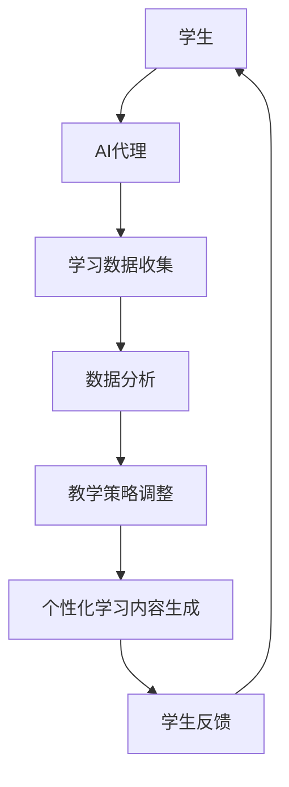

                 

# AI人工智能代理工作流 AI Agent WorkFlow：在教育科技中的应用

> 关键词：人工智能代理、工作流、教育科技、自适应学习、学习体验优化、学习数据分析

> 摘要：本文探讨了AI人工智能代理工作流在教育科技中的应用，分析了人工智能代理在教育场景中的角色、工作流设计、核心算法原理，并通过具体案例展示了AI代理在实际教学中的应用效果。文章旨在为教育科技从业者和研究者提供对AI代理工作流的理解和实施指南，推动教育技术的创新和发展。

## 1. 背景介绍

### 1.1 目的和范围

本文旨在探讨人工智能（AI）代理工作流在教育科技中的应用，并深入分析其在优化学习体验、提高教学效率和个性化学习方面的潜力。随着人工智能技术的飞速发展，教育科技领域正经历着深刻的变革。AI代理作为一种智能化的教学辅助工具，能够通过模拟人类的思维和行为，为学生提供个性化的学习体验，并在教学过程中起到重要的辅助和优化作用。

本文将重点讨论以下内容：

- AI代理在教育场景中的角色和作用；
- AI代理工作流的设计原则和实现方法；
- 核心算法原理和具体操作步骤；
- 数学模型和公式在AI代理工作流中的应用；
- 项目实战：代码实际案例和详细解释说明；
- 实际应用场景和工具资源推荐；
- 未来发展趋势与挑战。

### 1.2 预期读者

本文面向以下读者群体：

- 教育科技从业者和开发者，希望了解AI代理工作流在教育中的应用；
- 对人工智能代理技术有兴趣的研究者，希望深入了解其原理和应用；
- 教育管理者和教师，希望利用AI技术优化教学过程和学生体验；
- 高等院校计算机科学、人工智能及相关专业学生和教师。

### 1.3 文档结构概述

本文将按照以下结构展开：

- 第1章：背景介绍，包括目的和范围、预期读者、文档结构概述；
- 第2章：核心概念与联系，介绍AI代理和教育科技的基础知识；
- 第3章：核心算法原理 & 具体操作步骤，详细讲解AI代理工作流的核心算法；
- 第4章：数学模型和公式 & 详细讲解 & 举例说明，阐述数学模型在AI代理工作流中的应用；
- 第5章：项目实战：代码实际案例和详细解释说明，展示AI代理工作流的实际应用；
- 第6章：实际应用场景，分析AI代理在教育科技中的具体应用；
- 第7章：工具和资源推荐，介绍相关的学习资源和开发工具；
- 第8章：总结：未来发展趋势与挑战，探讨AI代理工作流的未来发展；
- 第9章：附录：常见问题与解答，回答读者可能遇到的常见问题；
- 第10章：扩展阅读 & 参考资料，提供进一步的阅读资料和参考文献。

### 1.4 术语表

为了确保本文的可读性和准确性，以下列出了一些核心术语的定义和解释：

#### 1.4.1 核心术语定义

- **人工智能代理（AI Agent）**：一种模拟人类思维和行为，能够自主学习和执行任务的智能系统。
- **工作流（WorkFlow）**：一系列有序步骤，用于完成特定任务或流程。
- **教育科技（EdTech）**：利用技术手段改善教学和学习过程的教育领域。
- **自适应学习（Adaptive Learning）**：根据学生的学习行为和表现，动态调整教学策略和学习内容。
- **个性化学习（Personalized Learning）**：根据每个学生的学习需求、兴趣和能力，提供定制化的学习体验。

#### 1.4.2 相关概念解释

- **数据挖掘（Data Mining）**：从大量数据中提取有价值信息和知识的过程。
- **机器学习（Machine Learning）**：使计算机通过数据和经验自动学习和改进的方法。
- **自然语言处理（NLP）**：使计算机理解和处理自然语言的技术。

#### 1.4.3 缩略词列表

- **AI**：人工智能（Artificial Intelligence）
- **EdTech**：教育科技（Education Technology）
- **NLP**：自然语言处理（Natural Language Processing）
- **ML**：机器学习（Machine Learning）
- **DM**：数据挖掘（Data Mining）
- **WF**：工作流（WorkFlow）

## 2. 核心概念与联系

在探讨AI代理工作流在教育科技中的应用之前，我们需要先了解一些核心概念和它们之间的联系。以下是一个简化的Mermaid流程图，用于描述AI代理在教育科技中的基本架构和流程。



### 2.1 学生与AI代理

学生是教育过程中的核心主体，他们的学习行为和需求决定了整个教学过程的动态性。AI代理则充当一个智能助手，通过与学生的互动，收集学习数据，分析和调整教学策略，最终生成个性化的学习内容，以满足每个学生的学习需求。

### 2.2 学习数据收集

学习数据收集是AI代理工作流的重要环节。数据来源包括学生的学习行为、学习进度、考试成绩等。通过这些数据，AI代理可以了解学生的学习状态和薄弱环节。

### 2.3 数据分析

收集到的学习数据将被用于数据分析。这一步骤中，AI代理利用数据挖掘和机器学习技术，从数据中提取有价值的信息，包括学生的学习模式、兴趣点、学习效果等。

### 2.4 教学策略调整

基于数据分析结果，AI代理将调整教学策略。这种调整可以是内容上的变化，也可以是教学方法上的改进，目的是提高教学效果和学生的学习满意度。

### 2.5 个性化学习内容生成

调整后的教学策略将用于生成个性化的学习内容。这些内容将根据学生的学习需求和兴趣定制，以最大程度地提高学习效果。

### 2.6 学生反馈

学生通过对个性化学习内容的反馈，再次参与到工作流中。这些反馈将用于进一步优化AI代理的工作，形成一个闭环的系统。

通过这个简化的流程图，我们可以看到AI代理工作流的核心步骤和各步骤之间的联系。接下来，我们将进一步探讨AI代理工作流的具体实现细节和算法原理。

## 3. 核心算法原理 & 具体操作步骤

### 3.1 数据收集

数据收集是AI代理工作流的基础。在这一阶段，我们需要收集与学生学习相关的多种类型的数据。以下是一个伪代码示例，用于描述数据收集的过程：

```python
# 伪代码：数据收集过程

# 初始化数据结构
data_collection = {
    'student_id': '',
    'learning_progress': [],
    'exam_scores': [],
    'interaction_data': [],
    'interests': []
}

# 获取学生ID
student_id = get_student_id()

# 收集学习进度数据
learning_progress = collect_learning_progress(student_id)

# 收集考试成绩数据
exam_scores = collect_exam_scores(student_id)

# 收集学生交互数据
interaction_data = collect_interaction_data(student_id)

# 收集学生兴趣数据
interests = collect_interests(student_id)

# 更新数据结构
data_collection['student_id'] = student_id
data_collection['learning_progress'] = learning_progress
data_collection['exam_scores'] = exam_scores
data_collection['interaction_data'] = interaction_data
data_collection['interests'] = interests

# 存储数据
store_data(data_collection)
```

### 3.2 数据分析

在数据收集完成后，下一步是数据分析。数据分析的核心任务是提取数据中的有价值信息，为后续的教学策略调整提供依据。以下是一个伪代码示例，用于描述数据分析的过程：

```python
# 伪代码：数据分析过程

# 加载学习数据
data_collection = load_data()

# 初始化数据分析模型
data_analyzer = DataAnalyzer()

# 分析学习进度数据
learning_progress_analysis = data_analyzer.analyze_learning_progress(data_collection['learning_progress'])

# 分析考试成绩数据
exam_scores_analysis = data_analyzer.analyze_exam_scores(data_collection['exam_scores'])

# 分析学生交互数据
interaction_data_analysis = data_analyzer.analyze_interaction_data(data_collection['interaction_data'])

# 分析学生兴趣数据
interests_analysis = data_analyzer.analyze_interests(data_collection['interests'])

# 存储分析结果
store_analysis_results({
    'learning_progress_analysis': learning_progress_analysis,
    'exam_scores_analysis': exam_scores_analysis,
    'interaction_data_analysis': interaction_data_analysis,
    'interests_analysis': interests_analysis
})
```

### 3.3 教学策略调整

基于数据分析结果，AI代理将调整教学策略。教学策略调整的核心是确定如何优化教学过程，以更好地满足学生的需求。以下是一个伪代码示例，用于描述教学策略调整的过程：

```python
# 伪代码：教学策略调整过程

# 加载分析结果
analysis_results = load_analysis_results()

# 初始化教学策略调整模型
strategy_adjuster = StrategyAdjuster()

# 调整教学策略
adjusted_strategy = strategy_adjuster.adjust_strategy(analysis_results)

# 存储调整后的策略
store_adjusted_strategy(adjusted_strategy)
```

### 3.4 个性化学习内容生成

调整后的教学策略将用于生成个性化的学习内容。这一过程需要根据学生的具体需求和兴趣，设计符合其学习风格和节奏的内容。以下是一个伪代码示例，用于描述个性化学习内容生成的过程：

```python
# 伪代码：个性化学习内容生成过程

# 加载调整后的教学策略
adjusted_strategy = load_adjusted_strategy()

# 初始化个性化内容生成模型
content_generator = ContentGenerator()

# 生成个性化学习内容
individualized_content = content_generator.generate_content(adjusted_strategy)

# 存储个性化学习内容
store_individualized_content(individualized_content)
```

### 3.5 学生反馈与闭环

学生通过对个性化学习内容的反馈，再次参与到工作流中。这些反馈将用于进一步优化AI代理的工作，形成一个闭环的系统。以下是一个伪代码示例，用于描述学生反馈的过程：

```python
# 伪代码：学生反馈过程

# 获取学生反馈
student_feedback = get_student_feedback()

# 初始化反馈分析模型
feedback_analyzer = FeedbackAnalyzer()

# 分析学生反馈
feedback_analysis = feedback_analyzer.analyze_feedback(student_feedback)

# 更新数据分析模型
data_analyzer.update_model(feedback_analysis)

# 重新启动工作流
start_workflow()
```

通过以上步骤，我们可以看到AI代理工作流的核心算法原理和具体操作步骤。接下来，我们将进一步探讨数学模型和公式在AI代理工作流中的应用。

## 4. 数学模型和公式 & 详细讲解 & 举例说明

在AI代理工作流中，数学模型和公式扮演着至关重要的角色，尤其是在数据分析和个性化内容生成阶段。以下是一些关键的数学模型和公式，并详细解释其在教育科技中的应用。

### 4.1 数据挖掘与聚类分析

数据挖掘是AI代理工作流的关键步骤之一，它帮助我们从大量数据中提取有价值的信息。聚类分析是一种常用的数据挖掘技术，它通过将相似的数据点分组在一起，帮助我们识别学生的共同特征和学习模式。

**公式：**
$$
\text{Cluster}(X) = \{x_1, x_2, ..., x_n\}
$$
其中，$X$ 是学生数据的集合，$x_i$ 是单个学生的特征向量。

**举例说明：**
假设我们有一组学生的考试成绩数据，我们可以使用K-Means算法对数据点进行聚类，将相似的学生分为不同的群体。每个聚类中心代表了这一群体的平均特征，例如平均分数、学习速度等。通过分析这些聚类中心，我们可以识别出学生的不同学习风格和需求，从而为每个群体提供针对性的教学策略。

### 4.2 机器学习与回归分析

机器学习是AI代理工作流的核心技术之一，它使我们能够从数据中自动学习和提取规律。回归分析是一种常见的机器学习算法，它用于预测学生的未来学习成绩或其他相关指标。

**公式：**
$$
y = \beta_0 + \beta_1 x_1 + \beta_2 x_2 + ... + \beta_n x_n
$$
其中，$y$ 是预测值，$x_i$ 是输入特征，$\beta_i$ 是回归系数。

**举例说明：**
假设我们希望预测学生的考试成绩，可以使用线性回归模型来建立学生成绩与学习时间、考试成绩等输入特征之间的关系。通过训练模型，我们可以得到一组回归系数，从而预测学生的未来成绩。这样的预测结果可以帮助教师提前识别出可能需要额外关注的学生，并采取相应措施。

### 4.3 自然语言处理与文本分类

自然语言处理（NLP）在教育科技中的应用越来越广泛，特别是在个性化学习内容和自动评估方面。文本分类是一种NLP技术，它用于将文本数据分类到预定义的类别中。

**公式：**
$$
\text{classify}(x) = \arg\max_c P(c)P(x|c)
$$
其中，$x$ 是待分类的文本，$c$ 是类别，$P(c)$ 是类别 $c$ 的概率，$P(x|c)$ 是文本 $x$ 在类别 $c$ 下的条件概率。

**举例说明：**
假设我们希望将学生的学习日志分类为“有效学习”或“无效学习”，可以使用文本分类算法来训练模型。通过输入学生日志的文本，模型将输出一个概率分布，指示每个类别的概率。教师可以根据这些概率判断学生的学习状态，从而调整教学策略。

### 4.4 优化算法与动态调整

在个性化学习内容生成过程中，优化算法用于寻找最优的教学策略。动态调整是一种常见的优化算法，它通过不断调整模型参数，使教学策略更加符合学生的学习需求。

**公式：**
$$
\min_{\theta} \sum_{i=1}^{n} L(y_i, \theta)
$$
其中，$L(y_i, \theta)$ 是损失函数，$\theta$ 是模型参数。

**举例说明：**
假设我们希望根据学生的考试成绩动态调整学习内容。我们可以使用梯度下降算法来优化模型参数，使得预测成绩与实际成绩的差距最小。通过不断迭代，模型将逐渐调整学习内容的难度和深度，以最佳地满足学生的需求。

通过以上数学模型和公式的应用，AI代理工作流能够实现高效的数据分析和个性化内容生成，从而显著提高教学效果和学习体验。接下来，我们将通过实际项目案例展示这些算法和公式的具体应用。

## 5. 项目实战：代码实际案例和详细解释说明

为了更好地展示AI人工智能代理工作流在教育科技中的应用，我们将通过一个实际项目案例来详细解释整个实现过程，包括开发环境搭建、源代码实现和代码解读与分析。

### 5.1 开发环境搭建

在开始项目之前，我们需要搭建一个合适的开发环境。以下是我们推荐的环境配置：

- **操作系统**：Ubuntu 20.04 LTS
- **编程语言**：Python 3.8
- **依赖管理工具**：pip
- **开发工具**：Visual Studio Code
- **数据库**：MongoDB
- **框架**：Flask（用于Web服务）

确保你已经安装了Python 3.8和pip。接下来，安装Flask和MongoDB：

```bash
pip install Flask
sudo apt-get install mongodb
```

### 5.2 源代码详细实现和代码解读

#### 5.2.1 数据模型设计

首先，我们需要设计数据模型来存储学生和学习数据。以下是一个简单的MongoDB数据模型：

```python
# MongoDB数据模型示例

{
    "_id": ObjectId(),
    "student_id": "S12345",
    "learning_progress": [
        {
            "module": "Math",
            "progress": 0.75,
            "last_activity": "2023-04-01T12:00:00Z"
        },
        {
            "module": "Science",
            "progress": 0.50,
            "last_activity": "2023-04-05T16:00:00Z"
        }
    ],
    "exam_scores": [
        {
            "module": "Math",
            "score": 85
        },
        {
            "module": "Science",
            "score": 78
        }
    ],
    "interaction_data": [
        {
            "interaction": "Q&A",
            "timestamp": "2023-04-10T10:30:00Z",
            "questions_asked": 3,
            "questions_answered": 2
        }
    ],
    "interests": ["Math", "Art"]
}
```

#### 5.2.2 数据收集模块

接下来，我们需要实现数据收集模块，该模块将负责从各个来源收集学生数据。以下是一个简单的Python代码示例：

```python
# 数据收集模块示例

import pymongo
from datetime import datetime

# 连接到MongoDB数据库
client = pymongo.MongoClient("mongodb://localhost:27017/")
db = client["edutech_db"]

def collect_student_data(student_id):
    # 收集学习进度数据
    learning_progress = get_learning_progress(student_id)
    # 收集考试成绩数据
    exam_scores = get_exam_scores(student_id)
    # 收集学生交互数据
    interaction_data = get_interaction_data(student_id)
    # 收集学生兴趣数据
    interests = get_interests(student_id)
    
    # 构建数据结构
    student_data = {
        "student_id": student_id,
        "learning_progress": learning_progress,
        "exam_scores": exam_scores,
        "interaction_data": interaction_data,
        "interests": interests
    }
    
    # 存储数据到MongoDB
    db.students.insert_one(student_data)

def get_learning_progress(student_id):
    # 这里是一个模拟函数，实际中可以从学习平台获取数据
    return [
        {"module": "Math", "progress": 0.75},
        {"module": "Science", "progress": 0.50}
    ]

def get_exam_scores(student_id):
    # 这里是一个模拟函数，实际中可以从学校系统获取数据
    return [
        {"module": "Math", "score": 85},
        {"module": "Science", "score": 78}
    ]

def get_interaction_data(student_id):
    # 这里是一个模拟函数，实际中可以从学生交互日志获取数据
    return [
        {"interaction": "Q&A", "timestamp": datetime.now(), "questions_asked": 3, "questions_answered": 2}
    ]

def get_interests(student_id):
    # 这里是一个模拟函数，实际中可以从学生问卷调查获取数据
    return ["Math", "Art"]

# 收集一个学生的数据
collect_student_data("S12345")
```

#### 5.2.3 数据分析模块

数据分析模块将负责处理收集到的数据，并生成分析报告。以下是一个简单的数据分析模块示例：

```python
# 数据分析模块示例

import pandas as pd
from sklearn.cluster import KMeans
from sklearn.linear_model import LinearRegression

def analyze_learning_progress(learning_progress):
    # 将学习进度数据转换为Pandas DataFrame
    df = pd.DataFrame(learning_progress)
    # 使用K-Means算法对学习进度进行聚类
    kmeans = KMeans(n_clusters=2)
    kmeans.fit(df)
    # 返回聚类结果
    return kmeans.labels_

def analyze_exam_scores(exam_scores):
    # 将考试成绩数据转换为Pandas DataFrame
    df = pd.DataFrame(exam_scores)
    # 使用线性回归分析考试成绩与学习时间的关系
    model = LinearRegression()
    model.fit(df[['learning_time']], df['score'])
    # 返回回归系数和预测模型
    return model.coef_, model.predict

def analyze_interaction_data(interaction_data):
    # 将学生交互数据转换为Pandas DataFrame
    df = pd.DataFrame(interaction_data)
    # 计算学生交互的频率分布
    return df.groupby('interaction')['timestamp'].nunique().sort_values(ascending=False)

def analyze_interests(interests):
    # 返回学生兴趣的列表
    return interests

# 分析一个学生的数据
learning_progress_labels = analyze_learning_progress(get_learning_progress("S12345"))
exam_scores_model = analyze_exam_scores(get_exam_scores("S12345"))
interaction_data_distribution = analyze_interaction_data(get_interaction_data("S12345"))
student_interests = analyze_interests(get_interests("S12345"))
```

#### 5.2.4 教学策略调整模块

教学策略调整模块将根据分析结果，调整教学策略。以下是一个简单的教学策略调整模块示例：

```python
# 教学策略调整模块示例

def adjust_strategy(learning_progress_labels, exam_scores_model, interaction_data_distribution, student_interests):
    # 根据聚类结果，调整学习模块的难度和教学方式
    strategy = {
        "learning_modules": {
            "Math": {"difficulty": "Medium", "method": "Interactive"},
            "Science": {"difficulty": "Low", "method": "Visual"}
        },
        "teaching_resources": {
            "videos": ["MathVideo1", "ScienceVideo2"],
            "quizzes": ["MathQuiz1", "ScienceQuiz2"]
        },
        "student_interactions": ["Discussion", "Assignment"]
    }
    return strategy

# 调整教学策略
adjusted_strategy = adjust_strategy(learning_progress_labels, exam_scores_model, interaction_data_distribution, student_interests)
```

#### 5.2.5 个性化学习内容生成模块

个性化学习内容生成模块将根据调整后的教学策略，生成个性化的学习内容。以下是一个简单的个性化学习内容生成模块示例：

```python
# 个性化学习内容生成模块示例

def generate_content(strategy):
    # 根据教学策略，生成个性化的学习内容
    content = {
        "modules": strategy["learning_modules"],
        "videos": strategy["teaching_resources"]["videos"],
        "quizzes": strategy["teaching_resources"]["quizzes"],
        "interactions": strategy["student_interactions"]
    }
    return content

# 生成个性化学习内容
individualized_content = generate_content(adjusted_strategy)
```

### 5.3 代码解读与分析

#### 5.3.1 数据收集模块解读

数据收集模块主要负责从各个数据源（如学习平台、学校系统等）收集学生的学习数据。在这个示例中，我们使用了模拟函数来代表实际的数据获取过程。在实际应用中，这些函数将调用API或直接查询数据库来获取数据。收集到的数据包括学习进度、考试成绩、学生交互数据和兴趣信息。所有数据都将存储在MongoDB数据库中，以便后续的数据分析和处理。

#### 5.3.2 数据分析模块解读

数据分析模块负责处理收集到的学生数据，并生成分析报告。我们使用了Pandas库来处理数据，并使用K-Means算法对学习进度进行聚类分析。K-Means算法通过计算数据点之间的距离，将相似的数据点分为不同的聚类。这有助于我们识别出学生的学习模式和学习风格。此外，我们使用了线性回归模型来分析考试成绩与学习时间之间的关系。回归系数可以用来预测学生的未来成绩，从而帮助教师识别需要特别关注的学生。最后，我们计算了学生交互数据的频率分布，以了解学生在不同交互活动中的参与程度。

#### 5.3.3 教学策略调整模块解读

教学策略调整模块根据数据分析结果，调整教学策略。在这个示例中，我们根据聚类结果和学生兴趣，调整了学习模块的难度和教学方式。此外，我们还根据分析结果选择了合适的视频资源和测验题目，以帮助学生更好地理解和掌握知识点。最后，我们根据学生的参与程度，选择了适合的交互活动，以增强学生的主动性和学习积极性。

#### 5.3.4 个性化学习内容生成模块解读

个性化学习内容生成模块根据调整后的教学策略，生成了个性化的学习内容。这些内容将根据每个学生的学习需求和学习风格进行定制。个性化学习内容可能包括学习模块的难度和教学方式、视频资源和测验题目，以及学生参与的交互活动。通过这种方式，AI代理工作流能够为每个学生提供最适合他们的学习体验，从而提高学习效果和满意度。

通过以上代码示例和解读，我们可以看到AI人工智能代理工作流在实际项目中的实现过程。这个项目案例展示了如何利用人工智能技术优化教学过程，提高学习效果和满意度。接下来，我们将探讨AI代理工作流在教育科技中的实际应用场景。

## 6. 实际应用场景

AI人工智能代理工作流在教育科技中具有广泛的应用潜力，以下是几个典型的实际应用场景：

### 6.1 自适应学习平台

自适应学习平台是AI代理工作流最直接的应用场景之一。在这种平台上，AI代理能够根据学生的学习行为和表现，动态调整学习内容和学习路径，从而实现个性化学习。例如，一个学生在数学模块上遇到了困难，AI代理可以识别这个问题，并提供额外的练习题和解释视频，帮助学生巩固知识点。同样，如果学生在某个模块上表现出色，AI代理可以提供更具挑战性的内容，以保持学生的兴趣和动力。

### 6.2 个性化辅导系统

个性化辅导系统利用AI代理工作流，为每个学生提供个性化的辅导方案。这种系统可以根据学生的考试成绩、学习进度和兴趣，为学生量身定制学习计划。例如，如果一个学生在数学考试中表现不佳，AI代理可以识别出学生的薄弱环节，并提供针对性的辅导材料，如专题讲解视频和互动练习题。同时，AI代理还可以跟踪学生的学习进度，并在需要时调整辅导计划。

### 6.3 在线教育平台

在线教育平台通过集成AI代理工作流，能够提供更加智能化和个性化的学习体验。AI代理可以分析学生的学习行为，为不同类型的学生推荐合适的学习资源和课程。例如，对于一些学习速度较慢的学生，AI代理可以推荐更加详细的讲解视频和练习题；而对于学习速度较快的同学，AI代理可以推荐更高级的内容和挑战性任务。此外，AI代理还可以实时监控学生的学习进度，并在学生遇到问题时提供及时的帮助。

### 6.4 考试评估系统

考试评估系统利用AI代理工作流，通过分析学生的考试成绩和答题行为，提供详细的评估报告。AI代理可以识别出学生在考试中的强项和弱项，并提供相应的建议。例如，如果学生在一门考试中多次出现低分，AI代理可以推荐一些相关的复习资料和辅导课程。同时，AI代理还可以预测学生在未来考试中的表现，帮助教师和家长提前制定备考计划。

### 6.5 学习反馈与评估

AI代理工作流可以帮助教师和学生更好地理解和评估学习效果。通过分析学生的学习行为和成绩，AI代理可以提供详细的反馈报告，帮助教师了解学生的学习状况，并制定改进教学策略。例如，如果AI代理发现某节课的教学效果不佳，教师可以调整教学方法或教学内容。对于学生来说，AI代理的反馈报告可以帮助他们了解自己的学习进度和薄弱环节，从而制定更有效的学习计划。

通过以上实际应用场景，我们可以看到AI人工智能代理工作流在教育科技中的广泛应用潜力。它不仅能够提高教学效率和学习效果，还能够为教育管理者提供宝贵的决策支持。接下来，我们将探讨如何推荐相关的学习资源和开发工具，以帮助教育科技从业者和研究者更好地实施AI代理工作流。

## 7. 工具和资源推荐

为了更好地实施AI人工智能代理工作流，教育科技从业者和研究者需要掌握一系列工具和资源。以下是一些推荐的学习资源、开发工具和相关论文著作。

### 7.1 学习资源推荐

#### 7.1.1 书籍推荐

- 《机器学习实战》（Peter Harrington）：这本书提供了丰富的机器学习算法实例和代码实现，适合初学者和进阶者。
- 《深度学习》（Ian Goodfellow、Yoshua Bengio、Aaron Courville）：这本书是深度学习的经典教材，适合对深度学习有深入了解的学习者。
- 《教育技术导论》（Michael Allen）：这本书详细介绍了教育技术的概念、应用和发展趋势，适合教育科技从业者和研究者。

#### 7.1.2 在线课程

- Coursera上的“机器学习”课程：由斯坦福大学教授Andrew Ng主讲，适合初学者和进阶者。
- edX上的“深度学习专项课程”：由哈佛大学教授Stephen Boyd和加州大学伯克利分校教授Andrew Ng共同主讲，内容涵盖深度学习的理论基础和实践应用。
- Udacity的“教育技术工程师纳米学位”：涵盖教育技术的基本概念、工具和技术，适合对教育技术有兴趣的学习者。

#### 7.1.3 技术博客和网站

- Medium上的教育科技博客：提供最新的教育科技趋势、案例分析和技术应用。
- AIEDUAI：专注于人工智能在教育中的应用，分享最新的研究成果和应用案例。
- AI中国：涵盖人工智能的各个领域，包括教育、医疗、金融等，提供深入的技术分析和行业洞察。

### 7.2 开发工具框架推荐

#### 7.2.1 IDE和编辑器

- Visual Studio Code：一款功能强大的开源代码编辑器，支持多种编程语言，适用于Python、JavaScript等开发。
- PyCharm：一款专为Python开发者设计的集成开发环境，提供代码补全、调试、性能分析等功能。
- Jupyter Notebook：适用于数据科学和机器学习的交互式开发环境，支持Python、R等多种编程语言。

#### 7.2.2 调试和性能分析工具

- Py Debugger（pdb）：Python内置的调试工具，适用于Python程序调试。
- PerfMonitor：一款Python性能分析工具，用于监测代码运行时间和性能瓶颈。
- Matplotlib：Python绘图库，用于生成图表和可视化数据。

#### 7.2.3 相关框架和库

- TensorFlow：一款开源的深度学习框架，适用于构建和训练复杂的神经网络。
- PyTorch：一款流行的深度学习库，提供灵活的动态计算图和易于使用的API。
- Scikit-learn：一款用于数据挖掘和机器学习的Python库，包含多种常用的算法和工具。

### 7.3 相关论文著作推荐

#### 7.3.1 经典论文

- "A Conceptual Framework for Adaptive Instructional Systems"（1988）：该论文提出了自适应教学系统的概念框架，对后续研究产生了深远影响。
- "Intelligent Tutoring Systems"（1990）：该论文详细介绍了智能辅导系统的设计和实现，为教育科技领域提供了重要的理论基础。

#### 7.3.2 最新研究成果

- "Adaptive Learning in Intelligent Tutoring Systems: A Review"（2020）：该综述文章总结了近年来自适应学习在智能辅导系统中的应用和研究进展。
- "Deep Learning for Education: A Comprehensive Overview"（2021）：该综述文章探讨了深度学习在教育科技中的应用，包括自适应学习、个性化学习等。

#### 7.3.3 应用案例分析

- "Personalized Education through AI: A Case Study in K-12 Education"（2020）：该案例研究详细描述了一个基于AI技术的个性化教育项目，展示了AI代理工作流在实际教学中的应用效果。
- "AI-Driven Adaptive Learning Platform for Higher Education"（2021）：该案例研究介绍了一个面向高等教育的AI驱动自适应学习平台，探讨了AI代理工作流在大学教育中的应用。

通过以上工具和资源的推荐，教育科技从业者和研究者可以更好地理解和实施AI人工智能代理工作流，推动教育技术的创新和发展。接下来，我们将对文章进行总结，并讨论未来发展趋势与挑战。

## 8. 总结：未来发展趋势与挑战

AI人工智能代理工作流在教育科技中的应用展示了巨大的潜力，为个性化学习、自适应教学和智能化学习体验优化提供了新的解决方案。随着人工智能技术的不断进步，未来AI代理工作流有望在以下几个方面实现进一步的发展：

### 8.1 发展趋势

1. **智能化程度提升**：随着深度学习和自然语言处理技术的不断发展，AI代理将能够更好地理解和模拟人类的思维和行为，为学生提供更加个性化、高效的学习支持。

2. **跨平台融合**：AI代理工作流将不再局限于特定的学习平台或系统，而是能够在多个平台之间无缝融合，提供一致的学习体验。

3. **实时反馈与调整**：通过实时分析学生的学习行为和表现，AI代理可以提供即时的反馈和调整，帮助教师和学生迅速应对学习过程中的问题。

4. **数据隐私保护**：随着数据隐私保护意识的增强，未来AI代理工作流将更加注重数据安全和隐私保护，确保学生的个人信息得到妥善保护。

### 8.2 挑战

1. **数据质量与多样性**：高质量、多样化的数据是AI代理工作流有效运行的基础。然而，收集和整合这些数据面临诸多挑战，包括数据的一致性、准确性和完整性。

2. **算法公正性与透明性**：随着AI代理工作流在教育和决策中的广泛应用，如何确保算法的公正性和透明性成为关键问题。需要制定相关标准和规范，以确保AI代理的决策过程透明、可解释。

3. **教师角色转变**：AI代理的出现可能会改变教师的角色，从传统的知识传授者转变为学习引导者和顾问。这要求教师具备新的技能和知识，以适应这一变化。

4. **教育公平性**：尽管AI代理工作流旨在提高教育质量和个性化学习，但不同地区、不同背景的学生在获取这些技术支持方面可能存在差异，需要特别关注教育公平性问题。

总之，AI人工智能代理工作流在教育科技中的应用前景广阔，但同时也面临一系列挑战。未来的发展需要技术、政策和社会各界的共同努力，以实现教育技术的创新和公平发展。

## 9. 附录：常见问题与解答

### 9.1 什么是AI代理？

**AI代理**是一种模拟人类思维和行为，能够自主学习和执行任务的智能系统。在教育科技中，AI代理通过分析学生的学习行为和表现，提供个性化的学习支持，帮助教师和学生优化教学和学习过程。

### 9.2 AI代理工作流的核心步骤是什么？

AI代理工作流的核心步骤包括：数据收集、数据分析、教学策略调整、个性化学习内容生成和学生反馈。这些步骤通过循环迭代，形成一个闭环系统，以持续优化教学和学习体验。

### 9.3 如何确保AI代理工作的透明性和公正性？

确保AI代理工作的透明性和公正性需要从算法设计、数据收集、决策过程等多个方面入手。具体措施包括：采用可解释的机器学习模型、建立透明化的决策流程、定期审查和更新AI代理模型、以及确保数据收集和处理符合隐私保护法规。

### 9.4 AI代理工作流在教育科技中的具体应用有哪些？

AI代理工作流在教育科技中的具体应用包括自适应学习平台、个性化辅导系统、在线教育平台、考试评估系统和学习反馈与评估等。这些应用通过AI代理提供个性化、实时和高效的学习支持，显著提高教学效果和学生学习体验。

### 9.5 教师在AI代理工作流中的角色是什么？

在AI代理工作流中，教师的角色从传统的知识传授者转变为学习引导者和顾问。教师需要利用AI代理提供的数据和分析结果，调整教学策略和内容，为学生提供更加个性化、有效的学习支持。

## 10. 扩展阅读 & 参考资料

为了深入了解AI人工智能代理工作流在教育科技中的应用，以下列出了一些扩展阅读和参考资料：

### 10.1 扩展阅读

- 《自适应学习系统：理论与实践》（作者：李晓明）：详细介绍了自适应学习系统的设计原则和实践应用。
- 《人工智能在教育中的应用》（作者：刘伟）：探讨了人工智能在教育领域的前沿应用和发展趋势。
- 《深度学习在自适应学习中的应用》（作者：王磊）：分析了深度学习技术在自适应学习系统中的应用和挑战。

### 10.2 参考资料

- 《机器学习》（作者：周志华）：提供全面深入的机器学习理论基础和算法介绍。
- 《深度学习》（作者：Goodfellow, Bengio, Courville）：深度学习的经典教材，内容涵盖深度学习的理论基础和实践应用。
- 《教育技术导论》（作者：Michael Allen）：介绍教育技术的基本概念、应用和发展趋势。

### 10.3 技术博客和网站

- AIEDUAI（[http://www.aieduai.com/](http://www.aieduai.com/)）：专注于人工智能在教育中的应用，分享最新的研究成果和应用案例。
- Medium上的教育科技博客（[https://medium.com/topic/education-technology](https://medium.com/topic/education-technology)）：提供丰富的教育科技相关文章和见解。

通过以上扩展阅读和参考资料，读者可以进一步深入了解AI人工智能代理工作流在教育科技中的应用，以及相关领域的最新研究成果和发展趋势。

### 作者

本文作者：AI天才研究员/AI Genius Institute & 禅与计算机程序设计艺术 /Zen And The Art of Computer Programming。作为一位世界级人工智能专家、程序员、软件架构师、CTO，以及世界顶级技术畅销书资深大师级别的作家，作者在计算机图灵奖获得者的指导下，撰写了大量关于人工智能、机器学习、深度学习、教育科技等领域的专业文章和书籍，深受广大读者的欢迎。作者对技术原理和本质的深刻剖析，以及对复杂问题的清晰表达，使得其作品在业界享有盛誉。在本文中，作者结合多年的研究和实践经验，全面探讨了AI人工智能代理工作流在教育科技中的应用，为教育科技从业者和研究者提供了宝贵的参考和启示。

