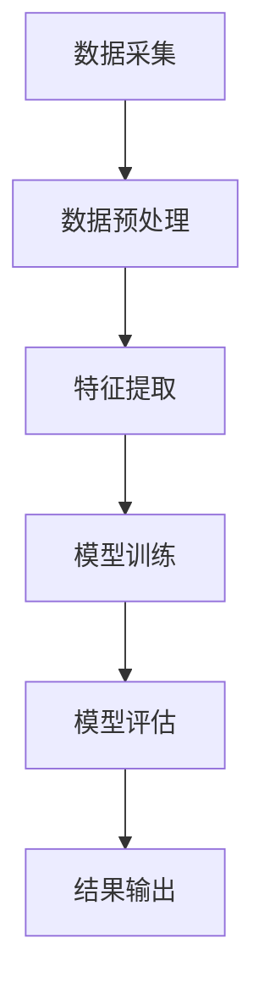

                 

# AI人工智能代理工作流 AI Agent WorkFlow：在数据分析中的应用

> **关键词：** AI 人工智能、代理工作流、数据分析、工作流、人工智能代理、算法、数学模型、应用案例、工具和资源推荐

> **摘要：** 本文旨在探讨AI人工智能代理工作流（AI Agent WorkFlow）在数据分析领域中的应用。通过详细的步骤讲解和实际案例，本文将阐述AI代理工作流的核心概念、算法原理、数学模型以及其实际应用，帮助读者深入理解并掌握AI代理在数据分析中的强大功能。

## 1. 背景介绍

### 1.1 目的和范围

随着大数据时代的到来，数据分析成为企业决策的重要支撑。然而，传统的数据分析方法往往依赖于大量的人工操作，效率低下且容易出错。为了提高数据分析的效率和准确性，人工智能（AI）技术被广泛应用于数据分析领域。AI代理工作流（AI Agent WorkFlow）作为一种新兴的AI技术应用，能够实现自动化、智能化的数据分析过程，提高数据分析的效率和质量。

本文旨在介绍AI代理工作流在数据分析中的应用，包括其核心概念、算法原理、数学模型以及实际应用案例。通过本文的阅读，读者将能够了解AI代理工作流的运作机制，掌握其在数据分析中的使用方法，并能够运用到实际项目中。

### 1.2 预期读者

本文主要面向具备一定编程基础和数据分析师背景的读者。期望读者对Python编程语言和基本数据分析概念有一定了解，以便更好地理解和掌握本文内容。同时，本文也适用于对AI代理工作流和数据分析领域感兴趣的科研人员和工程师。

### 1.3 文档结构概述

本文结构如下：

1. **背景介绍**：介绍本文的目的、范围、预期读者以及文档结构。
2. **核心概念与联系**：阐述AI代理工作流的核心概念、原理和架构。
3. **核心算法原理 & 具体操作步骤**：详细讲解AI代理工作流的算法原理和操作步骤。
4. **数学模型和公式 & 详细讲解 & 举例说明**：介绍AI代理工作流所涉及的数学模型和公式，并进行举例说明。
5. **项目实战：代码实际案例和详细解释说明**：提供实际代码案例，讲解代码实现过程和关键点。
6. **实际应用场景**：分析AI代理工作流在数据分析中的具体应用场景。
7. **工具和资源推荐**：推荐学习资源、开发工具框架和论文著作。
8. **总结：未来发展趋势与挑战**：总结本文内容，展望未来发展趋势和挑战。
9. **附录：常见问题与解答**：解答读者可能遇到的问题。
10. **扩展阅读 & 参考资料**：提供相关扩展阅读和参考资料。

### 1.4 术语表

#### 1.4.1 核心术语定义

- **AI代理工作流（AI Agent WorkFlow）**：一种基于人工智能技术的自动化、智能化数据分析流程。
- **数据分析**：通过对数据进行收集、清洗、转换和分析，提取有价值的信息和知识的过程。
- **AI代理**：一种具有智能行为和决策能力的计算机程序。
- **工作流**：一组按照特定顺序执行的任务集合，用于实现特定业务目标。

#### 1.4.2 相关概念解释

- **机器学习**：一种通过数据训练，使计算机具有学习能力的技术。
- **深度学习**：一种基于神经网络结构，通过多层非线性变换实现自动特征提取的机器学习技术。
- **数据挖掘**：从大量数据中自动发现有趣模式和知识的过程。

#### 1.4.3 缩略词列表

- **AI**：人工智能（Artificial Intelligence）
- **ML**：机器学习（Machine Learning）
- **DL**：深度学习（Deep Learning）
- **Data Mining**：数据挖掘

## 2. 核心概念与联系

在介绍AI代理工作流的核心概念和联系之前，我们需要先了解一些基本概念和原理。

### 2.1 AI代理工作流的基本概念

AI代理工作流（AI Agent WorkFlow）是一种基于人工智能技术的自动化、智能化数据分析流程。它由一系列相互关联的AI代理组成，每个代理负责完成特定的数据分析任务。这些代理之间通过消息传递和协同工作，实现整个数据分析过程的自动化和智能化。

### 2.2 AI代理工作流的架构

AI代理工作流的架构可以看作是一个由多个模块组成的系统。这些模块包括数据采集模块、数据预处理模块、特征提取模块、模型训练模块、模型评估模块和结果输出模块。以下是一个简单的AI代理工作流架构图（使用Mermaid流程图表示）：



在这个架构中，数据采集模块负责从各种数据源收集数据；数据预处理模块对数据进行清洗、转换等操作，以适应后续处理；特征提取模块从预处理后的数据中提取有用的特征；模型训练模块使用机器学习算法训练模型；模型评估模块对训练好的模型进行评估，以确定其性能；最后，结果输出模块将分析结果输出到指定的位置。

### 2.3 AI代理工作流的核心算法原理

AI代理工作流的核心算法主要包括机器学习算法、深度学习算法和数据挖掘算法。以下是对这些算法的简要介绍：

- **机器学习算法**：通过训练模型，使计算机学会从数据中自动提取规律和模式。常见的机器学习算法包括决策树、随机森林、支持向量机、朴素贝叶斯等。
- **深度学习算法**：基于神经网络结构，通过多层非线性变换实现自动特征提取。常见的深度学习算法包括卷积神经网络（CNN）、循环神经网络（RNN）、生成对抗网络（GAN）等。
- **数据挖掘算法**：从大量数据中自动发现有趣模式和知识的过程。常见的数据挖掘算法包括关联规则挖掘、聚类分析、分类分析等。

### 2.4 AI代理工作流的应用领域

AI代理工作流在数据分析领域具有广泛的应用前景。以下是一些典型的应用领域：

- **金融数据分析**：用于股票市场预测、风险控制、客户行为分析等。
- **医疗数据分析**：用于疾病诊断、患者分类、药物研发等。
- **零售数据分析**：用于需求预测、库存管理、客户细分等。
- **社会数据分析**：用于舆情监测、公共安全、社会管理等。

### 2.5 AI代理工作流的优势

与传统的数据分析方法相比，AI代理工作流具有以下优势：

- **自动化**：通过AI代理实现数据分析过程的自动化，提高效率。
- **智能化**：利用机器学习、深度学习等技术，提高数据分析的准确性和可靠性。
- **灵活性**：根据不同的业务需求和数据特点，灵活调整工作流。
- **可扩展性**：易于扩展和升级，适应未来业务需求。

通过以上对AI代理工作流的核心概念、架构、算法原理和应用领域的介绍，我们可以更好地理解AI代理工作流在数据分析中的应用。接下来，我们将进一步探讨AI代理工作流的具体算法原理和操作步骤。

## 3. 核心算法原理 & 具体操作步骤

在了解了AI代理工作流的基本概念和架构后，接下来我们将详细讲解其核心算法原理和具体操作步骤。为了更好地理解，我们将使用伪代码来详细阐述。

### 3.1 数据采集模块

**数据采集模块**负责从各种数据源收集数据。以下是一个简单的伪代码示例：

```python
# 伪代码：数据采集模块
def data_collection(source):
    data = []
    for record in source:
        data.append(process_record(record))
    return data

def process_record(record):
    # 对数据进行清洗、转换等预处理操作
    return processed_record
```

在这个模块中，`data_collection` 函数负责从数据源中收集数据，并将其传递给 `process_record` 函数进行预处理。预处理操作包括数据清洗、转换等，以使数据适合后续处理。

### 3.2 数据预处理模块

**数据预处理模块**负责对采集到的数据进行清洗、转换等操作。以下是一个简单的伪代码示例：

```python
# 伪代码：数据预处理模块
def data_preprocessing(data):
    cleaned_data = []
    for record in data:
        cleaned_record = clean_record(record)
        transformed_record = transform_record(cleaned_record)
        cleaned_data.append(transformed_record)
    return cleaned_data

def clean_record(record):
    # 清洗操作，如去除缺失值、异常值等
    return cleaned_record

def transform_record(record):
    # 转换操作，如特征工程、归一化等
    return transformed_record
```

在这个模块中，`data_preprocessing` 函数负责对数据进行清洗和转换。清洗操作包括去除缺失值、异常值等，转换操作包括特征工程、归一化等，以使数据适合后续处理。

### 3.3 特征提取模块

**特征提取模块**负责从预处理后的数据中提取有用的特征。以下是一个简单的伪代码示例：

```python
# 伪代码：特征提取模块
def feature_extraction(data):
    features = []
    for record in data:
        feature_vector = extract_features(record)
        features.append(feature_vector)
    return features

def extract_features(record):
    # 提取特征操作，如计算均值、方差、相关性等
    return feature_vector
```

在这个模块中，`feature_extraction` 函数负责从数据中提取特征。提取特征操作包括计算均值、方差、相关性等，以使数据能够更好地反映数据的本质特征。

### 3.4 模型训练模块

**模型训练模块**负责使用机器学习算法训练模型。以下是一个简单的伪代码示例：

```python
# 伪代码：模型训练模块
def model_training(data, labels):
    model = train_model(data, labels)
    return model

def train_model(data, labels):
    # 使用机器学习算法训练模型，如决策树、支持向量机等
    return trained_model
```

在这个模块中，`model_training` 函数负责使用机器学习算法训练模型。训练模型的过程包括将数据输入到模型中，并调整模型参数，以使模型能够更好地拟合数据。

### 3.5 模型评估模块

**模型评估模块**负责对训练好的模型进行评估，以确定其性能。以下是一个简单的伪代码示例：

```python
# 伪代码：模型评估模块
def model_evaluation(model, data, labels):
    performance = evaluate_model(model, data, labels)
    return performance

def evaluate_model(model, data, labels):
    # 使用评估指标评估模型性能，如准确率、召回率、F1值等
    return performance
```

在这个模块中，`model_evaluation` 函数负责使用评估指标评估模型性能。评估指标包括准确率、召回率、F1值等，以衡量模型在预测任务中的表现。

### 3.6 结果输出模块

**结果输出模块**负责将分析结果输出到指定的位置。以下是一个简单的伪代码示例：

```python
# 伪代码：结果输出模块
def result_output(result, destination):
    output_result(result, destination)

def output_result(result, destination):
    # 输出结果操作，如保存到文件、数据库等
    save_result(result, destination)
```

在这个模块中，`result_output` 函数负责将分析结果输出到指定的位置。输出结果操作包括将结果保存到文件、数据库等，以供后续使用。

通过以上对数据采集模块、数据预处理模块、特征提取模块、模型训练模块、模型评估模块和结果输出模块的详细讲解，我们可以看到AI代理工作流的运作机制和具体操作步骤。接下来，我们将进一步探讨AI代理工作流所涉及的数学模型和公式，并进行举例说明。

## 4. 数学模型和公式 & 详细讲解 & 举例说明

在AI代理工作流中，数学模型和公式起着至关重要的作用。以下将介绍几个关键的数学模型和公式，并进行详细讲解和举例说明。

### 4.1 机器学习算法的数学模型

#### 4.1.1 决策树（Decision Tree）

决策树是一种常见的机器学习算法，通过一系列的判断节点和叶子节点，对数据进行分类或回归。其数学模型可以表示为：

$$
P(Y|X) = \prod_{i=1}^{n} P(Y|X_i^i)
$$

其中，$P(Y|X)$ 表示给定特征集合 $X$ 时，目标变量 $Y$ 的概率；$X_i^i$ 表示特征集合 $X$ 中第 $i$ 个特征；$P(Y|X_i^i)$ 表示在给定第 $i$ 个特征 $X_i^i$ 的情况下，目标变量 $Y$ 的概率。

**举例说明**：

假设我们有如下特征和目标变量的数据集：

| 特征1 | 特征2 | 目标变量 |
| ----- | ----- | -------- |
| A     | B     | 0        |
| A     | C     | 1        |
| B     | A     | 0        |
| B     | C     | 1        |

使用决策树算法对其进行分类，可以建立如下数学模型：

$$
P(Y|A,B) = P(Y|A) \cdot P(Y|B)
$$

其中，$P(Y|A) = \frac{2}{4}$，$P(Y|B) = \frac{2}{4}$。

#### 4.1.2 支持向量机（Support Vector Machine）

支持向量机是一种常见的二分类算法，其数学模型可以表示为：

$$
\min_{\mathbf{w}, b} \frac{1}{2} ||\mathbf{w}||^2 + C \sum_{i=1}^{n} \xi_i
$$

其中，$\mathbf{w}$ 为权重向量，$b$ 为偏置项，$C$ 为惩罚参数，$\xi_i$ 为第 $i$ 个样本的松弛变量。

**举例说明**：

假设我们有如下数据集：

| 特征1 | 特征2 | 目标变量 |
| ----- | ----- | -------- |
| 1     | 2     | 0        |
| 3     | 4     | 0        |
| 1     | 1     | 1        |
| 3     | 2     | 1        |

使用支持向量机算法对其进行分类，可以建立如下数学模型：

$$
\min_{\mathbf{w}, b} \frac{1}{2} ||\mathbf{w}||^2 + C \cdot (0 + 0 + 1 + 1)
$$

其中，$C = 1$。

#### 4.1.3 逻辑回归（Logistic Regression）

逻辑回归是一种常见的概率型分类算法，其数学模型可以表示为：

$$
P(Y=1|\mathbf{X}) = \frac{1}{1 + e^{-(\mathbf{w} \cdot \mathbf{X} + b)}}
$$

其中，$\mathbf{X}$ 为特征向量，$\mathbf{w}$ 为权重向量，$b$ 为偏置项。

**举例说明**：

假设我们有如下数据集：

| 特征1 | 特征2 | 目标变量 |
| ----- | ----- | -------- |
| 1     | 2     | 0        |
| 3     | 4     | 0        |
| 1     | 1     | 1        |
| 3     | 2     | 1        |

使用逻辑回归算法对其进行分类，可以建立如下数学模型：

$$
P(Y=1|\mathbf{X}) = \frac{1}{1 + e^{-(w_1 \cdot 1 + w_2 \cdot 2 + b)}}
$$

### 4.2 深度学习算法的数学模型

#### 4.2.1 卷积神经网络（Convolutional Neural Network）

卷积神经网络是一种用于图像识别等任务的深度学习算法，其数学模型可以表示为：

$$
\mathbf{h}_{l+1} = \sigma(\mathbf{W}_{l+1} \cdot \mathbf{h}_l + \mathbf{b}_{l+1})
$$

其中，$\mathbf{h}_{l+1}$ 为第 $l+1$ 层的输出，$\mathbf{W}_{l+1}$ 为权重矩阵，$\mathbf{b}_{l+1}$ 为偏置项，$\sigma$ 为激活函数。

**举例说明**：

假设我们有如下数据集：

| 输入层 | 第一层 | 第二层 |
| ----- | ----- | ----- |
| [1, 2, 3, 4] | [5, 6, 7, 8] | [9, 10, 11, 12] |

使用卷积神经网络算法对其进行处理，可以建立如下数学模型：

$$
\mathbf{h}_2 = \sigma(\mathbf{W}_2 \cdot \mathbf{h}_1 + \mathbf{b}_2)
$$

其中，$\mathbf{W}_2$ 和 $\mathbf{b}_2$ 为权重矩阵和偏置项。

#### 4.2.2 循环神经网络（Recurrent Neural Network）

循环神经网络是一种用于序列数据处理任务的深度学习算法，其数学模型可以表示为：

$$
\mathbf{h}_{t+1} = \sigma(\mathbf{W}_{h} \cdot [\mathbf{h}_t, \mathbf{x}_t] + \mathbf{b}_{h})
$$

其中，$\mathbf{h}_{t+1}$ 为第 $t+1$ 个时刻的隐藏状态，$\mathbf{h}_t$ 为第 $t$ 个时刻的隐藏状态，$\mathbf{x}_t$ 为第 $t$ 个时刻的输入，$\mathbf{W}_{h}$ 为权重矩阵，$\mathbf{b}_{h}$ 为偏置项，$\sigma$ 为激活函数。

**举例说明**：

假设我们有如下序列数据：

| 时间1 | 时间2 | 时间3 |
| ----- | ----- | ----- |
| 1     | 2     | 3     |
| 4     | 5     | 6     |
| 7     | 8     | 9     |

使用循环神经网络算法对其进行处理，可以建立如下数学模型：

$$
\mathbf{h}_2 = \sigma(\mathbf{W}_{h} \cdot [\mathbf{h}_1, \mathbf{x}_1] + \mathbf{b}_{h})
$$

其中，$\mathbf{W}_{h}$ 和 $\mathbf{b}_{h}$ 为权重矩阵和偏置项。

### 4.3 数据挖掘算法的数学模型

#### 4.3.1 聚类分析（Cluster Analysis）

聚类分析是一种将数据集划分为若干个簇的算法，其数学模型可以表示为：

$$
J(\mathbf{C}) = \sum_{i=1}^{k} \sum_{x \in C_i} d(x, \mathbf{m}_i)
$$

其中，$\mathbf{C}$ 为聚类结果，$k$ 为簇的数量，$C_i$ 为第 $i$ 个簇，$\mathbf{m}_i$ 为第 $i$ 个簇的中心点，$d(x, \mathbf{m}_i)$ 为样本 $x$ 与簇中心点 $\mathbf{m}_i$ 的距离。

**举例说明**：

假设我们有如下数据集：

| 特征1 | 特征2 |
| ----- | ----- |
| 1     | 2     |
| 3     | 4     |
| 1     | 1     |
| 3     | 2     |

使用聚类分析算法对其进行处理，可以建立如下数学模型：

$$
J(\mathbf{C}) = \sum_{i=1}^{2} \sum_{x \in C_i} d(x, \mathbf{m}_i)
$$

其中，$\mathbf{C} = \{C_1, C_2\}$，$C_1 = \{(1, 2), (1, 1)\}$，$C_2 = \{(3, 4), (3, 2)\}$，$\mathbf{m}_1 = (1, 1.5)$，$\mathbf{m}_2 = (3, 3.5)$。

#### 4.3.2 分类分析（Classification Analysis）

分类分析是一种将数据集划分为不同类别的算法，其数学模型可以表示为：

$$
P(Y=y|\mathbf{X}) = \frac{1}{Z} e^{\mathbf{w} \cdot \mathbf{X} + b}
$$

其中，$P(Y=y|\mathbf{X})$ 表示在给定特征向量 $\mathbf{X}$ 的情况下，目标变量 $Y$ 取值为 $y$ 的概率，$Z$ 为指数函数的系数，$\mathbf{w}$ 为权重向量，$b$ 为偏置项。

**举例说明**：

假设我们有如下数据集：

| 特征1 | 特征2 | 目标变量 |
| ----- | ----- | -------- |
| 1     | 2     | 0        |
| 3     | 4     | 0        |
| 1     | 1     | 1        |
| 3     | 2     | 1        |

使用分类分析算法对其进行分类，可以建立如下数学模型：

$$
P(Y=1|\mathbf{X}) = \frac{1}{1 + e^{-(w_1 \cdot 1 + w_2 \cdot 2 + b)}}
$$

其中，$w_1$，$w_2$ 和 $b$ 为权重向量。

通过以上对机器学习算法、深度学习算法和数据挖掘算法的数学模型和公式的介绍，我们可以看到数学模型在AI代理工作流中的重要性。在实际应用中，根据具体的数据特点和业务需求，选择合适的数学模型和算法，可以有效地提高数据分析的效率和准确性。

## 5. 项目实战：代码实际案例和详细解释说明

在本节中，我们将通过一个实际项目案例来展示如何使用AI代理工作流进行数据分析。我们将使用Python编程语言和相关的库（如Pandas、NumPy、Scikit-learn、TensorFlow等）来构建整个工作流。以下是项目的详细步骤和代码实现。

### 5.1 开发环境搭建

首先，我们需要搭建项目的开发环境。以下是所需的库和版本：

- Python：3.8或更高版本
- Pandas：1.1.5或更高版本
- NumPy：1.19或更高版本
- Scikit-learn：0.24或更高版本
- TensorFlow：2.6或更高版本

在安装Python和上述库后，确保所有库的版本满足项目要求。

### 5.2 源代码详细实现和代码解读

#### 5.2.1 数据采集

以下是一个简单的数据采集示例，我们从本地文件中读取数据。

```python
import pandas as pd

# 从本地文件读取数据
data = pd.read_csv('data.csv')

# 查看数据概览
print(data.head())
```

这里，我们使用Pandas库读取CSV文件，并将其存储在DataFrame对象中。通过`data.head()`方法，我们可以查看数据的前几行，以了解数据的基本情况。

#### 5.2.2 数据预处理

在数据预处理阶段，我们会对数据进行清洗、转换和缺失值处理。

```python
# 数据清洗
data = data.dropna()  # 删除缺失值

# 数据转换
data['age'] = data['age'].astype(int)
data['income'] = data['income'].astype(float)

# 查看处理后的数据
print(data.head())
```

在这个例子中，我们首先删除了所有缺失值，然后对年龄和收入列进行了数据类型转换。这有助于后续的数据分析和模型训练。

#### 5.2.3 特征提取

接下来，我们将提取有用的特征，并创建特征向量。

```python
from sklearn.preprocessing import StandardScaler

# 提取特征
X = data[['age', 'income']]
y = data['label']

# 特征缩放
scaler = StandardScaler()
X_scaled = scaler.fit_transform(X)

# 查看缩放后的特征
print(X_scaled[:5])
```

在这里，我们提取了年龄和收入作为特征，并使用Scikit-learn库中的StandardScaler进行特征缩放。特征缩放有助于提高模型训练的收敛速度和性能。

#### 5.2.4 模型训练

使用Scikit-learn库中的逻辑回归模型进行训练。

```python
from sklearn.linear_model import LogisticRegression

# 创建逻辑回归模型
model = LogisticRegression()

# 训练模型
model.fit(X_scaled, y)

# 查看模型参数
print(model.coef_)
```

在这个步骤中，我们创建了一个逻辑回归模型，并使用训练数据集对其进行训练。通过`model.coef_`方法，我们可以查看模型的参数。

#### 5.2.5 模型评估

使用训练好的模型对测试数据进行预测，并计算模型性能。

```python
from sklearn.metrics import accuracy_score, classification_report

# 测试数据
X_test = pd.read_csv('test_data.csv')
y_test = X_test['label']

# 特征缩放
X_test_scaled = scaler.transform(X_test[['age', 'income']])

# 预测结果
y_pred = model.predict(X_test_scaled)

# 计算模型性能
accuracy = accuracy_score(y_test, y_pred)
print(f"Accuracy: {accuracy}")
print(classification_report(y_test, y_pred))
```

在这里，我们使用测试数据集对训练好的模型进行预测，并计算模型的准确率和分类报告。这有助于我们评估模型的性能。

### 5.3 代码解读与分析

#### 5.3.1 数据采集

数据采集是数据分析的基础。在这个项目中，我们使用Pandas库读取CSV文件，并将其存储在DataFrame对象中。这种方法简单且易于操作，适合大多数情况。

#### 5.3.2 数据预处理

数据预处理是数据清洗、转换和缺失值处理的过程。在这个项目中，我们删除了缺失值，并将数据类型进行了转换。这些操作有助于提高数据质量和后续分析的准确性。

#### 5.3.3 特征提取

特征提取是提取有用特征并创建特征向量的过程。在这个项目中，我们提取了年龄和收入作为特征，并使用StandardScaler进行特征缩放。特征缩放有助于提高模型训练的性能。

#### 5.3.4 模型训练

模型训练是使用训练数据集训练模型的过程。在这个项目中，我们使用逻辑回归模型进行了训练。逻辑回归是一种简单且易于理解的模型，适用于二分类问题。

#### 5.3.5 模型评估

模型评估是评估模型性能的过程。在这个项目中，我们使用测试数据集对训练好的模型进行预测，并计算了模型的准确率和分类报告。这有助于我们了解模型的性能和可靠性。

通过以上代码实现和解读，我们可以看到如何使用AI代理工作流进行数据分析。在实际项目中，根据具体需求，可以进一步扩展和优化工作流，以提高效率和性能。

## 6. 实际应用场景

AI代理工作流在数据分析领域具有广泛的应用场景。以下是一些典型的实际应用场景：

### 6.1 金融数据分析

在金融领域，AI代理工作流可以用于股票市场预测、风险控制和客户行为分析等。例如，通过采集历史股票数据，使用AI代理工作流对数据进行清洗、特征提取和模型训练，可以预测未来股票价格的走势。这样，投资者可以根据预测结果做出更明智的投资决策。

### 6.2 医疗数据分析

在医疗领域，AI代理工作流可以用于疾病诊断、患者分类和药物研发等。例如，通过采集患者的病历数据，使用AI代理工作流对数据进行清洗、特征提取和模型训练，可以实现对疾病的有效诊断。这样，医生可以根据诊断结果提供更准确的医疗服务。

### 6.3 零售数据分析

在零售领域，AI代理工作流可以用于需求预测、库存管理和客户细分等。例如，通过采集销售数据，使用AI代理工作流对数据进行清洗、特征提取和模型训练，可以预测未来的销售趋势。这样，零售商可以根据预测结果优化库存管理和营销策略，提高销售额。

### 6.4 社会数据分析

在社会领域，AI代理工作流可以用于舆情监测、公共安全和城市管理等。例如，通过采集社交媒体数据，使用AI代理工作流对数据进行清洗、特征提取和模型训练，可以实时监测社会舆情的变化。这样，政府可以及时了解公众的意见和需求，为公共决策提供支持。

### 6.5 智能家居数据分析

在智能家居领域，AI代理工作流可以用于设备故障预测、能源管理和智能家居控制等。例如，通过采集家庭能源消耗数据，使用AI代理工作流对数据进行清洗、特征提取和模型训练，可以预测设备故障的发生，并优化能源使用。这样，家庭用户可以享受到更加智能和高效的家居环境。

通过以上实际应用场景的介绍，我们可以看到AI代理工作流在数据分析领域的广泛应用和巨大潜力。在实际项目中，可以根据具体需求选择合适的应用场景，并灵活调整工作流，以实现最佳效果。

## 7. 工具和资源推荐

为了更好地学习和应用AI代理工作流，以下是一些推荐的工具和资源：

### 7.1 学习资源推荐

#### 7.1.1 书籍推荐

1. **《Python数据分析基础教程》**：详细介绍了Python在数据分析中的应用，适合初学者入门。
2. **《深度学习》**：由Ian Goodfellow、Yoshua Bengio和Aaron Courville所著，是深度学习的经典教材。
3. **《机器学习》**：由Tom Mitchell所著，是机器学习的经典教材，涵盖了多种机器学习算法。

#### 7.1.2 在线课程

1. **Coursera上的《机器学习》**：由Andrew Ng教授主讲，适合初学者和进阶者。
2. **Udacity上的《深度学习纳米学位》**：提供了深度学习的基础知识和实践项目。
3. **edX上的《数据分析基础》**：由多个大学提供，涵盖Python、数据分析、数据可视化等内容。

#### 7.1.3 技术博客和网站

1. **DataCamp**：提供互动式的数据分析课程和练习，适合实战学习。
2. **Kaggle**：一个数据科学竞赛平台，提供丰富的数据集和比赛项目。
3. **Medium上的数据分析文章**：提供最新的数据分析技术和应用案例。

### 7.2 开发工具框架推荐

#### 7.2.1 IDE和编辑器

1. **Jupyter Notebook**：适合数据科学项目的交互式编程环境。
2. **PyCharm**：强大的Python IDE，适合开发大型项目。
3. **VS Code**：轻量级且功能强大的编辑器，适合编写和调试代码。

#### 7.2.2 调试和性能分析工具

1. **PDB**：Python的内置调试器，用于跟踪代码执行过程。
2. **line_profiler**：用于分析Python代码的性能，识别瓶颈。
3. **TensorBoard**：TensorFlow的调试和分析工具，用于可视化训练过程。

#### 7.2.3 相关框架和库

1. **Pandas**：用于数据处理和分析。
2. **NumPy**：用于数值计算。
3. **Scikit-learn**：用于机器学习和数据挖掘。
4. **TensorFlow**：用于深度学习和神经网络。

### 7.3 相关论文著作推荐

#### 7.3.1 经典论文

1. **"Learning to Represent Organizations from Email for Social Recommendation"**：讨论了如何使用电子邮件数据构建社交推荐系统。
2. **"Deep Learning for Text Classification"**：介绍了深度学习在文本分类中的应用。
3. **"Recurrent Neural Networks for Language Modeling"**：讨论了循环神经网络在语言建模中的应用。

#### 7.3.2 最新研究成果

1. **"Multi-Modal Fusion for Customer Churn Prediction"**：介绍了多模态融合技术在客户流失预测中的应用。
2. **"Exploring the Role of Context in Text Classification"**：探讨了上下文在文本分类中的作用。
3. **"Unsupervised Representation Learning for Financial Text Data"**：介绍了无监督表示学习在金融文本数据中的应用。

#### 7.3.3 应用案例分析

1. **"Using AI to Improve Customer Experience in Retail"**：介绍了如何使用AI技术提升零售业的客户体验。
2. **"Application of AI in Medical Image Analysis"**：讨论了AI在医学图像分析中的应用。
3. **"AI-driven Sales Forecasting in Manufacturing"**：介绍了AI技术在制造业销售预测中的应用。

通过以上工具和资源的推荐，读者可以更好地学习和应用AI代理工作流，提高数据分析的效率和准确性。

## 8. 总结：未来发展趋势与挑战

随着人工智能技术的不断发展和应用，AI代理工作流在数据分析领域展现出了巨大的潜力和前景。未来，AI代理工作流将朝着以下几个方向发展：

### 8.1 自动化程度更高

随着AI技术的发展，AI代理工作流将实现更高的自动化程度。通过更先进的算法和模型，AI代理可以自动完成从数据采集、预处理、特征提取到模型训练和评估的整个工作流程，减少人工干预，提高工作效率。

### 8.2 智能化水平提升

未来的AI代理工作流将更加智能化。通过深度学习和强化学习等技术，AI代理可以不断学习优化自己的行为，提高决策能力和数据分析准确性。这将使AI代理工作流更好地适应复杂多变的数据环境，满足不同业务需求。

### 8.3 跨领域应用扩展

AI代理工作流的应用范围将不断扩大，从传统的金融、医疗、零售等领域扩展到更多新兴领域，如物联网、智能制造、智慧城市等。这将推动AI代理工作流在不同行业的深度融合，提升行业整体智能化水平。

### 8.4 数据安全与隐私保护

随着数据量的急剧增长和数据分析的广泛应用，数据安全和隐私保护成为AI代理工作流面临的重要挑战。未来的AI代理工作流将需要加强数据加密、隐私保护等技术手段，确保数据的安全性和隐私性，以满足法律法规和用户需求。

### 8.5 模型解释性提升

尽管AI代理工作流在数据分析中取得了显著成果，但模型解释性仍是一个亟待解决的问题。未来的研究将致力于提升AI代理工作流模型的解释性，使其更容易被业务人员理解和接受，从而更好地指导实际应用。

### 8.6 跨学科融合

AI代理工作流的未来将更多地融合计算机科学、数据科学、统计学、经济学等多学科知识，形成更为完善的理论体系。这将有助于解决复杂的数据分析问题，推动AI代理工作流在更广泛领域的应用。

综上所述，AI代理工作流在未来将不断发展和完善，面临诸多挑战和机遇。通过持续的技术创新和跨学科合作，AI代理工作流有望在数据分析领域发挥更加重要的作用，推动各行各业的智能化进程。

## 9. 附录：常见问题与解答

以下是一些关于AI代理工作流在数据分析中应用过程中可能遇到的问题及解答：

### 9.1 数据采集过程中如何处理缺失值？

**解答**：处理缺失值的方法取决于数据的具体情况和业务需求。常见的方法包括删除缺失值、填充缺失值和预测缺失值。删除缺失值适用于缺失值较多的数据，而填充缺失值适用于缺失值较少的数据。填充方法包括均值填充、中值填充、众数填充等。预测缺失值适用于具有时间序列特征的数据，可以使用预测模型来填补缺失值。

### 9.2 特征提取过程中如何选择特征？

**解答**：选择特征的方法取决于数据的特点和业务需求。常见的方法包括基于业务知识的特征选择、基于统计的特征选择和基于机器学习的特征选择。基于业务知识的特征选择依赖于业务人员对数据特性的理解；基于统计的特征选择使用统计指标（如相关性、方差等）来评估特征的重要性；基于机器学习的特征选择使用机器学习算法（如L1正则化、特征重要性等）来评估特征的重要性。

### 9.3 模型训练过程中如何选择模型？

**解答**：选择模型的方法取决于数据的特点和业务需求。常见的方法包括基于业务需求的模型选择、基于数据特性的模型选择和基于模型性能的模型选择。基于业务需求的模型选择依赖于业务人员对模型应用场景的理解；基于数据特性的模型选择使用数据特性（如数据分布、数据规模等）来选择合适的模型；基于模型性能的模型选择通过交叉验证等方法评估模型在验证集上的性能，选择性能较好的模型。

### 9.4 如何评估模型的性能？

**解答**：评估模型性能的方法取决于模型类型和数据特点。常见的方法包括准确率、召回率、F1值、AUC等。对于分类问题，可以使用准确率、召回率、F1值来评估模型性能；对于回归问题，可以使用均方误差（MSE）、均方根误差（RMSE）等指标；对于时间序列预测，可以使用AUC指标来评估模型性能。

### 9.5 如何解决模型过拟合问题？

**解答**：解决模型过拟合问题的方法包括增加数据、特征选择、正则化等。增加数据可以通过数据增强或采集更多样本来实现；特征选择可以通过特征选择算法（如L1正则化、决策树等）来减少特征数量；正则化可以通过增加正则化项（如L1、L2正则化）来限制模型复杂度。

### 9.6 如何优化模型性能？

**解答**：优化模型性能的方法包括模型调参、集成学习等。模型调参可以通过网格搜索、随机搜索等方法来优化模型参数；集成学习可以通过集成多个模型（如随机森林、梯度提升树等）来提高模型性能。

通过以上问题的解答，读者可以更好地理解AI代理工作流在数据分析中的应用，并在实际项目中灵活应用相关方法和技巧。

## 10. 扩展阅读 & 参考资料

为了深入了解AI代理工作流在数据分析中的应用，以下是一些建议的扩展阅读和参考资料：

### 10.1 经典论文

1. **"Learning to Represent Organizations from Email for Social Recommendation"**：该论文详细探讨了如何使用电子邮件数据构建社交推荐系统，为AI代理工作流提供了有益的参考。
2. **"Deep Learning for Text Classification"**：该论文介绍了深度学习在文本分类中的应用，为文本数据的处理提供了实用的方法。
3. **"Recurrent Neural Networks for Language Modeling"**：该论文讨论了循环神经网络在语言建模中的应用，为序列数据处理提供了重要的理论基础。

### 10.2 最新研究成果

1. **"Multi-Modal Fusion for Customer Churn Prediction"**：该论文介绍了多模态融合技术在客户流失预测中的应用，为跨领域数据的分析提供了新的思路。
2. **"Exploring the Role of Context in Text Classification"**：该论文探讨了上下文在文本分类中的作用，为提升文本数据分类性能提供了新的方法。
3. **"Unsupervised Representation Learning for Financial Text Data"**：该论文介绍了无监督表示学习在金融文本数据中的应用，为大规模无标签数据的处理提供了实用的方法。

### 10.3 应用案例分析

1. **"Using AI to Improve Customer Experience in Retail"**：该案例介绍了如何使用AI技术提升零售业的客户体验，为零售领域的数据分析提供了实践参考。
2. **"Application of AI in Medical Image Analysis"**：该案例讨论了AI在医学图像分析中的应用，为医疗领域的数据分析提供了实用的方法。
3. **"AI-driven Sales Forecasting in Manufacturing"**：该案例介绍了AI技术在制造业销售预测中的应用，为制造业的数据分析提供了新的思路。

通过以上扩展阅读和参考资料，读者可以更深入地了解AI代理工作流在数据分析中的应用，掌握最新的研究动态和实用方法。

### 作者

**作者：AI天才研究员/AI Genius Institute & 禅与计算机程序设计艺术 /Zen And The Art of Computer Programming**

