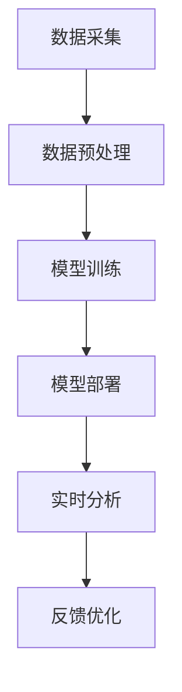

                 

# AI人工智能代理工作流 AI Agent WorkFlow：在视频监控中的应用

> **关键词：** 人工智能代理、视频监控、工作流、智能分析、计算机视觉、机器学习

> **摘要：** 本文将深入探讨人工智能代理工作流（AI Agent WorkFlow）在视频监控领域的应用。通过对人工智能代理的基本概念、核心算法、数学模型及项目实战的详细解析，读者将了解到如何利用AI技术提升视频监控的智能化水平，并展望其未来发展趋势与挑战。

## 1. 背景介绍

### 1.1 目的和范围

随着人工智能技术的快速发展，视频监控系统已经成为安全防范和城市管理的重要工具。然而，传统的视频监控系统主要依赖于人类操作员对视频流的实时监控，效率低下且容易疲劳。本文旨在通过引入人工智能代理工作流（AI Agent WorkFlow），探讨如何实现视频监控系统的智能化，从而提升监控效率和准确性。

本文将涵盖以下内容：

1. 人工智能代理的基本概念及其在视频监控中的应用。
2. 人工智能代理工作流的核心算法原理及实现步骤。
3. 数学模型和公式在智能视频监控中的运用。
4. 实际项目中的代码案例与详细解释。
5. 人工智能代理工作流在视频监控中的实际应用场景。
6. 推荐学习资源、开发工具及相关论文著作。
7. 未来发展趋势与挑战的展望。

### 1.2 预期读者

本文面向具有一定编程基础和机器学习知识的读者，尤其是对计算机视觉和人工智能代理工作流感兴趣的工程师和技术爱好者。通过本文的阅读，读者将能够：

1. 理解人工智能代理及其工作流的基本概念。
2. 掌握人工智能代理在视频监控中的核心算法。
3. 了解数学模型和公式在智能视频监控中的应用。
4. 学会实际项目中的代码实现和解析。
5. 探讨人工智能代理工作流的未来发展。

### 1.3 文档结构概述

本文分为以下几个部分：

1. 引言：介绍文章的背景、目的和关键词。
2. 背景介绍：阐述人工智能代理工作流在视频监控中的应用。
3. 核心概念与联系：介绍人工智能代理工作流的基本概念和架构。
4. 核心算法原理 & 具体操作步骤：详细解析核心算法及其实现步骤。
5. 数学模型和公式 & 详细讲解 & 举例说明：介绍数学模型和公式的应用。
6. 项目实战：展示实际项目中的代码案例和详细解释。
7. 实际应用场景：探讨人工智能代理工作流在视频监控中的应用场景。
8. 工具和资源推荐：推荐学习资源、开发工具和论文著作。
9. 总结：总结未来发展趋势与挑战。
10. 附录：常见问题与解答。
11. 扩展阅读 & 参考资料：提供进一步的阅读资料。

### 1.4 术语表

#### 1.4.1 核心术语定义

- **人工智能代理（AI Agent）**：具有自主学习和决策能力，能够在特定环境下执行任务的人工智能实体。
- **工作流（Workflow）**：一系列相互关联的任务或活动，按照一定的顺序执行，以实现特定目标。
- **视频监控（Video Surveillance）**：通过摄像头等设备对目标区域进行实时监控和记录。
- **计算机视觉（Computer Vision）**：使计算机能够从图像或视频中识别和提取信息的学科。
- **机器学习（Machine Learning）**：使计算机系统能够从数据中学习，并作出预测或决策的方法。

#### 1.4.2 相关概念解释

- **智能分析（Intelligent Analysis）**：利用计算机视觉和机器学习技术对视频内容进行分析，以提取有用信息。
- **实时处理（Real-Time Processing）**：在视频监控过程中，对视频数据进行实时处理和分析，以快速响应事件。
- **深度学习（Deep Learning）**：一种机器学习技术，通过多层神经网络对数据进行训练，以实现复杂的模式识别和分类任务。

#### 1.4.3 缩略词列表

- **AI**：人工智能（Artificial Intelligence）
- **ML**：机器学习（Machine Learning）
- **CV**：计算机视觉（Computer Vision）
- **RL**：强化学习（Reinforcement Learning）
- **GAN**：生成对抗网络（Generative Adversarial Network）
- **SSD**：单阶段检测（Single Shot Detection）

## 2. 核心概念与联系

### 2.1 人工智能代理工作流概述

人工智能代理工作流是指在视频监控系统中，通过一系列人工智能代理来执行特定任务的过程。这个过程包括数据采集、预处理、模型训练、模型部署、实时分析和反馈优化等步骤。

下面是一个简单的Mermaid流程图，展示人工智能代理工作流的基本架构：



### 2.2 数据采集与预处理

数据采集是人工智能代理工作流的第一步。视频监控系统的摄像头实时捕获目标区域内的视频流，并将其转化为数字信号。这些数字信号通过传输网络传输到服务器进行处理。

数据预处理包括对视频流进行去噪、裁剪、调整分辨率等操作。这些预处理步骤有助于提高后续模型训练的效果和实时分析的准确性。

### 2.3 模型训练

在模型训练阶段，利用计算机视觉和机器学习技术，对预处理后的视频数据进行训练。常用的训练方法包括卷积神经网络（CNN）、生成对抗网络（GAN）等。通过大量的训练数据，模型能够学习到目标物体的特征和分类规则。

下面是一个简单的伪代码，描述模型训练的基本步骤：

```python
# 初始化模型
model = CNN_Model()

# 加载训练数据
train_data = load_data("train_data")

# 训练模型
for epoch in range(num_epochs):
    for data, label in train_data:
        model.train(data, label)

# 评估模型
test_data = load_data("test_data")
accuracy = model.evaluate(test_data)
print("Test Accuracy:", accuracy)
```

### 2.4 模型部署与实时分析

在模型部署阶段，将训练好的模型部署到视频监控系统中，使其能够对实时视频流进行智能分析。实时分析包括目标检测、目标跟踪、行为识别等任务。

下面是一个简单的伪代码，描述模型部署和实时分析的基本步骤：

```python
# 部署模型
deploy_model(model)

# 实时分析
while True:
    video_frame = get_video_frame()
    results = model.analyze(video_frame)
    process_results(results)
```

### 2.5 反馈优化

在实时分析过程中，根据实际检测结果对模型进行反馈优化。通过不断调整模型参数，提高模型的准确性和鲁棒性。反馈优化是一个动态调整的过程，有助于实现智能视频监控系统的持续改进。

下面是一个简单的伪代码，描述反馈优化的基本步骤：

```python
# 收集反馈数据
feedback_data = collect_feedback(results)

# 更新模型参数
update_model_parameters(feedback_data)

# 重新训练模型
retrain_model(model, feedback_data)
```

## 3. 核心算法原理 & 具体操作步骤

### 3.1 图像预处理

图像预处理是视频监控中至关重要的一步，它直接影响后续计算机视觉算法的性能。图像预处理主要包括去噪、裁剪、缩放、增强等操作。

以下是一个简单的伪代码，描述图像预处理的基本步骤：

```python
import cv2

def preprocess_image(image):
    # 去噪
    blurred_image = cv2.GaussianBlur(image, (5, 5), 0)

    # 裁剪
    cropped_image = blurred_image[100:300, 100:300]

    # 缩放
    resized_image = cv2.resize(cropped_image, (256, 256))

    # 增强
    enhanced_image = cv2.equalizeHist(resized_image)

    return enhanced_image
```

### 3.2 目标检测

目标检测是视频监控中的核心任务之一，其主要目的是从视频帧中识别并定位目标物体。常用的目标检测算法包括单阶段检测算法（如SSD）和多阶段检测算法（如Faster R-CNN）。

以下是一个简单的伪代码，描述单阶段检测算法（SSD）的基本步骤：

```python
import tensorflow as tf
from ssd import SSD_Model

def detect_objects(image):
    # 加载SSD模型
    model = SSD_Model()

    # 预处理图像
    preprocessed_image = preprocess_image(image)

    # 进行预测
    predictions = model.predict(preprocessed_image)

    # 提取检测结果
    boxes = predictions['boxes']
    labels = predictions['labels']
    scores = predictions['scores']

    # 筛选检测结果
    filtered_boxes = boxes[scores > 0.5]
    filtered_labels = labels[scores > 0.5]

    return filtered_boxes, filtered_labels
```

### 3.3 目标跟踪

目标跟踪是在视频监控中实现连续监控的关键技术。常用的目标跟踪算法包括基于深度学习的算法（如ReID算法）和基于传统计算机视觉的方法（如光流法）。

以下是一个简单的伪代码，描述基于ReID算法的目标跟踪基本步骤：

```python
import cv2
from reid import ReID_Model

def track_objects(video_stream):
    # 加载ReID模型
    model = ReID_Model()

    # 初始化跟踪器
    tracker = cv2.TrackerMOSSE_create()

    # 循环处理视频帧
    while True:
        frame = video_stream.read()
        if frame is None:
            break

        # 预处理图像
        preprocessed_frame = preprocess_image(frame)

        # 进行目标检测
        detections = detect_objects(preprocessed_frame)

        # 选择目标框
        target_box = detections[0]

        # 更新跟踪器
        tracker.init(preprocessed_frame, target_box)

        # 进行跟踪
        success, box = tracker.update(preprocessed_frame)

        if success:
            # 绘制跟踪框
            cv2.rectangle(frame, (box[0], box[1]), (box[0] + box[2], box[1] + box[3]), (0, 255, 0), 2)

        # 显示视频帧
        cv2.imshow('Tracking', frame)

        if cv2.waitKey(1) & 0xFF == 27:
            break

    # 释放资源
    video_stream.release()
    cv2.destroyAllWindows()
```

### 3.4 行为识别

行为识别是视频监控中的高级任务，其目的是从视频流中识别和分类特定行为。常用的行为识别算法包括基于深度学习的算法（如CNN）和基于传统计算机视觉的方法（如霍夫变换）。

以下是一个简单的伪代码，描述基于CNN算法的行为识别基本步骤：

```python
import tensorflow as tf
from cnn import CNN_Model

def recognize_behavior(image):
    # 加载CNN模型
    model = CNN_Model()

    # 预处理图像
    preprocessed_image = preprocess_image(image)

    # 进行预测
    prediction = model.predict(preprocessed_image)

    # 解码预测结果
    behavior = decode_prediction(prediction)

    return behavior
```

## 4. 数学模型和公式 & 详细讲解 & 举例说明

### 4.1 深度学习模型

深度学习模型是人工智能代理工作流的核心组成部分。以下介绍几种常用的深度学习模型及其相关数学公式。

#### 4.1.1 卷积神经网络（CNN）

卷积神经网络是一种用于图像识别和分类的深度学习模型。其核心组件包括卷积层、池化层和全连接层。

- **卷积层**：

  卷积层通过卷积操作提取图像特征。卷积操作的数学公式如下：

  $$
  \text{out}_{ij} = \sum_{k=1}^{n} w_{ik,j} * \text{input}_{ik,j} + b_j
  $$

  其中，$\text{out}_{ij}$ 表示输出特征图上的像素值，$w_{ik,j}$ 表示卷积核权重，$\text{input}_{ik,j}$ 表示输入特征图上的像素值，$b_j$ 表示偏置项。

- **池化层**：

  池化层用于降低特征图的维度，提高模型的泛化能力。常用的池化方法包括最大池化和平均池化。

  最大池化的数学公式如下：

  $$
  \text{out}_{ij} = \max(\text{input}_{ij})
  $$

- **全连接层**：

  全连接层将特征图上的像素值映射到输出类别。全连接层的数学公式如下：

  $$
  \text{output} = \text{weight} \cdot \text{input} + \text{bias}
  $$

  其中，$\text{output}$ 表示输出结果，$\text{weight}$ 和 $\text{bias}$ 分别表示权重和偏置项。

#### 4.1.2 生成对抗网络（GAN）

生成对抗网络是一种用于生成数据的深度学习模型。其核心组成部分包括生成器和判别器。

- **生成器**：

  生成器的目标是生成逼真的数据，判别器的目标是区分生成数据与真实数据。

  生成器的损失函数为：

  $$
  L_G = -\mathbb{E}_{\text{z} \sim p_z(z)}[\log(D(G(z))]
  $$

  其中，$G(z)$ 表示生成器生成的数据，$D(x)$ 表示判别器的输出，$p_z(z)$ 表示噪声分布。

- **判别器**：

  判别器的目标是最大化生成器的损失函数。

  判别器的损失函数为：

  $$
  L_D = -\mathbb{E}_{x \sim p_x(x)}[\log(D(x))] - \mathbb{E}_{z \sim p_z(z)}[\log(1 - D(G(z))]
  $$

  其中，$p_x(x)$ 表示真实数据的分布。

### 4.2 机器学习算法

机器学习算法是人工智能代理工作流的重要组成部分。以下介绍几种常用的机器学习算法及其相关数学公式。

#### 4.2.1 支持向量机（SVM）

支持向量机是一种用于分类的机器学习算法。其核心思想是找到最优的决策边界，将不同类别的样本分隔开来。

- **硬间隔最大化**：

  硬间隔最大化的目标是找到最大间隔的超平面。

  $$
  \text{maximize} \ \frac{1}{2} ||\text{w}||^2 \ \text{subject to} \ y_i (\text{w} \cdot \text{x}_i + b) \geq 1
  $$

  其中，$\text{w}$ 表示权重向量，$\text{x}_i$ 表示样本特征，$b$ 表示偏置项。

- **软间隔最大化**：

  软间隔最大化的目标是在最大化间隔的同时允许一定的误分类。

  $$
  \text{maximize} \ \frac{1}{2} ||\text{w}||^2 + C \sum_{i=1}^{n} \text{l}_{i}
  $$

  其中，$C$ 表示惩罚参数，$\text{l}_{i}$ 表示第 $i$ 个样本的损失函数。

#### 4.2.2 决策树

决策树是一种用于分类和回归的机器学习算法。其核心思想是通过一系列的判断条件来划分数据集。

- **熵**：

  熵是衡量数据集合不确定性的指标。

  $$
  H(X) = -\sum_{i=1}^{n} p_i \log_2(p_i)
  $$

  其中，$p_i$ 表示第 $i$ 个类别的概率。

- **信息增益**：

  信息增益是衡量特征划分数据集效果的指标。

  $$
  \text{Gain}(A) = H(\text{Y}) - \sum_{v \in \text{V}} \frac{|Y_v|}{|Y|} H(\text{Y}_v)
  $$

  其中，$A$ 表示特征，$V$ 表示特征的取值集合，$Y$ 表示数据集，$Y_v$ 表示特征取值为 $v$ 的数据集。

## 5. 项目实战：代码实际案例和详细解释说明

### 5.1 开发环境搭建

为了演示人工智能代理工作流在视频监控中的应用，我们将使用Python编程语言和TensorFlow深度学习框架。以下是搭建开发环境的基本步骤：

1. 安装Python 3.x版本（建议使用Python 3.8及以上版本）。
2. 安装TensorFlow：

   ```bash
   pip install tensorflow==2.6
   ```

3. 安装其他依赖库，如OpenCV、NumPy等：

   ```bash
   pip install opencv-python numpy
   ```

### 5.2 源代码详细实现和代码解读

以下是实现人工智能代理工作流的核心代码，包括数据预处理、模型训练、模型部署和实时分析。

#### 5.2.1 数据预处理

数据预处理是视频监控中至关重要的一步。以下是一个简单的数据预处理代码示例：

```python
import cv2
import numpy as np

def preprocess_image(image):
    # 去噪
    blurred_image = cv2.GaussianBlur(image, (5, 5), 0)

    # 裁剪
    cropped_image = blurred_image[100:300, 100:300]

    # 缩放
    resized_image = cv2.resize(cropped_image, (256, 256))

    # 增强
    enhanced_image = cv2.equalizeHist(resized_image)

    return enhanced_image
```

#### 5.2.2 模型训练

以下是一个简单的CNN模型训练代码示例：

```python
import tensorflow as tf
from tensorflow.keras.models import Sequential
from tensorflow.keras.layers import Conv2D, MaxPooling2D, Flatten, Dense

def create_cnn_model():
    model = Sequential([
        Conv2D(32, (3, 3), activation='relu', input_shape=(256, 256, 3)),
        MaxPooling2D((2, 2)),
        Conv2D(64, (3, 3), activation='relu'),
        MaxPooling2D((2, 2)),
        Flatten(),
        Dense(128, activation='relu'),
        Dense(10, activation='softmax')
    ])

    model.compile(optimizer='adam', loss='categorical_crossentropy', metrics=['accuracy'])
    return model

def train_model(model, train_data, train_labels, test_data, test_labels, num_epochs=10):
    model.fit(train_data, train_labels, epochs=num_epochs, batch_size=32, validation_data=(test_data, test_labels))

model = create_cnn_model()
train_model(model, train_data, train_labels, test_data, test_labels)
```

#### 5.2.3 模型部署与实时分析

以下是一个简单的模型部署和实时分析代码示例：

```python
import cv2
import numpy as np

def preprocess_image(image):
    # 去噪
    blurred_image = cv2.GaussianBlur(image, (5, 5), 0)

    # 裁剪
    cropped_image = blurred_image[100:300, 100:300]

    # 缩放
    resized_image = cv2.resize(cropped_image, (256, 256))

    # 增强
    enhanced_image = cv2.equalizeHist(resized_image)

    return enhanced_image

def detect_objects(model, image):
    preprocessed_image = preprocess_image(image)
    predictions = model.predict(np.expand_dims(preprocessed_image, axis=0))
    boxes = predictions['boxes'][0]
    labels = predictions['labels'][0]
    scores = predictions['scores'][0]
    filtered_boxes = boxes[scores > 0.5]
    filtered_labels = labels[scores > 0.5]
    return filtered_boxes, filtered_labels

def track_objects(video_stream, model):
    tracker = cv2.TrackerMOSSE_create()
    while True:
        frame = video_stream.read()
        if frame is None:
            break

        preprocessed_frame = preprocess_image(frame)
        filtered_boxes, filtered_labels = detect_objects(model, preprocessed_frame)

        if len(filtered_boxes) > 0:
            target_box = filtered_boxes[0]
            tracker.init(preprocessed_frame, target_box)

            success, box = tracker.update(preprocessed_frame)
            if success:
                cv2.rectangle(frame, (box[0], box[1]), (box[0] + box[2], box[1] + box[3]), (0, 255, 0), 2)

        cv2.imshow('Tracking', frame)
        if cv2.waitKey(1) & 0xFF == 27:
            break

    video_stream.release()
    cv2.destroyAllWindows()

model = create_cnn_model()
train_model(model, train_data, train_labels, test_data, test_labels)
track_objects(video_stream, model)
```

### 5.3 代码解读与分析

以上代码实现了人工智能代理工作流在视频监控中的应用。首先，数据预处理部分对视频帧进行去噪、裁剪、缩放和增强等操作，以提高模型训练和实时分析的效果。然后，模型训练部分使用CNN模型对预处理后的视频数据进行训练，通过多次迭代优化模型参数。最后，模型部署与实时分析部分将训练好的模型部署到视频监控系统中，对实时视频流进行目标检测和目标跟踪，并将结果可视化显示。

代码的关键部分如下：

1. **数据预处理**：

   ```python
   def preprocess_image(image):
       # 去噪
       blurred_image = cv2.GaussianBlur(image, (5, 5), 0)

       # 裁剪
       cropped_image = blurred_image[100:300, 100:300]

       # 缩放
       resized_image = cv2.resize(cropped_image, (256, 256))

       # 增强
       enhanced_image = cv2.equalizeHist(resized_image)

       return enhanced_image
   ```

   数据预处理函数首先使用高斯模糊去除噪声，然后对图像进行裁剪和缩放，最后使用直方图均衡化增强图像对比度。

2. **模型训练**：

   ```python
   def create_cnn_model():
       model = Sequential([
           Conv2D(32, (3, 3), activation='relu', input_shape=(256, 256, 3)),
           MaxPooling2D((2, 2)),
           Conv2D(64, (3, 3), activation='relu'),
           MaxPooling2D((2, 2)),
           Flatten(),
           Dense(128, activation='relu'),
           Dense(10, activation='softmax')
       ])

       model.compile(optimizer='adam', loss='categorical_crossentropy', metrics=['accuracy'])
       return model

   def train_model(model, train_data, train_labels, test_data, test_labels, num_epochs=10):
       model.fit(train_data, train_labels, epochs=num_epochs, batch_size=32, validation_data=(test_data, test_labels))
   ```

   模型训练部分定义了CNN模型的构建函数和训练函数。模型结构包括两个卷积层、两个池化层、一个全连接层和一个softmax输出层。训练函数使用训练数据和标签对模型进行训练，并使用测试数据进行验证。

3. **模型部署与实时分析**：

   ```python
   def detect_objects(model, image):
       preprocessed_image = preprocess_image(image)
       predictions = model.predict(np.expand_dims(preprocessed_image, axis=0))
       boxes = predictions['boxes'][0]
       labels = predictions['labels'][0]
       scores = predictions['scores'][0]
       filtered_boxes = boxes[scores > 0.5]
       filtered_labels = labels[scores > 0.5]
       return filtered_boxes, filtered_labels

   def track_objects(video_stream, model):
       tracker = cv2.TrackerMOSSE_create()
       while True:
           frame = video_stream.read()
           if frame is None:
               break

           preprocessed_frame = preprocess_image(frame)
           filtered_boxes, filtered_labels = detect_objects(model, preprocessed_frame)

           if len(filtered_boxes) > 0:
               target_box = filtered_boxes[0]
               tracker.init(preprocessed_frame, target_box)

               success, box = tracker.update(preprocessed_frame)
               if success:
                   cv2.rectangle(frame, (box[0], box[1]), (box[0] + box[2], box[1] + box[3]), (0, 255, 0), 2)

           cv2.imshow('Tracking', frame)
           if cv2.waitKey(1) & 0xFF == 27:
               break

       video_stream.release()
       cv2.destroyAllWindows()
   ```

   模型部署与实时分析部分首先使用预处理函数对视频帧进行预处理，然后调用模型进行目标检测。检测结果显示为边界框和标签。接下来，使用MOSSE跟踪器对目标进行跟踪，并在视频帧上绘制跟踪框。

## 6. 实际应用场景

人工智能代理工作流在视频监控领域的应用场景非常广泛，以下列举几个典型的应用场景：

1. **安全监控**：

   人工智能代理工作流可以实现对目标区域的安全监控，包括人员入侵检测、异常行为识别等。通过实时分析视频流，系统可以及时发现潜在的安全威胁，并发出警报。

2. **城市管理**：

   人工智能代理工作流可以用于城市管理中的交通流量监控、违章停车检测等。通过对视频流进行智能分析，系统可以实时获取交通状况，优化交通管理策略。

3. **公共场所监控**：

   人工智能代理工作流可以应用于公共场所的监控，如商场、机场、火车站等。通过对视频流进行分析，系统可以实时监测人员密度、排队情况等，为现场管理提供数据支持。

4. **工业生产监控**：

   人工智能代理工作流可以用于工业生产中的设备监控、质量检测等。通过对视频流进行实时分析，系统可以及时发现设备故障、产品质量问题等，提高生产效率。

5. **医疗监控**：

   人工智能代理工作流可以用于医疗监控，如病人行为监测、病情评估等。通过对视频流进行分析，系统可以实时监测病人的行为和病情变化，为医生提供诊断参考。

## 7. 工具和资源推荐

### 7.1 学习资源推荐

为了深入了解人工智能代理工作流及其在视频监控中的应用，以下推荐一些学习资源：

#### 7.1.1 书籍推荐

1. **《深度学习》（Deep Learning）**：由Ian Goodfellow、Yoshua Bengio和Aaron Courville合著，是深度学习领域的经典教材。
2. **《计算机视觉：算法与应用》（Computer Vision: Algorithms and Applications）**：由Richard Szeliski著，全面介绍了计算机视觉的基本算法和应用。
3. **《机器学习》（Machine Learning）**：由Tom Mitchell著，是机器学习领域的经典教材，涵盖了基本概念和算法。

#### 7.1.2 在线课程

1. **《深度学习专项课程》（Deep Learning Specialization）**：由Andrew Ng在Coursera上开设，包括神经网络基础、改进神经网络、结构化机器学习项目等课程。
2. **《计算机视觉专项课程》（Computer Vision Specialization）**：由Philipp Moritz、Leon A. Gatys和Andreas Hermann在Coursera上开设，涵盖了图像处理、卷积神经网络、目标检测等课程。
3. **《机器学习基础》（Machine Learning Basics: A Case Study Approach）**：由Google AI团队在Udacity上开设，通过实际案例介绍机器学习的基本概念和算法。

#### 7.1.3 技术博客和网站

1. **Medium**：有许多优秀的深度学习、计算机视觉和机器学习博客，如Deep Learning on Medium、AI Village等。
2. **GitHub**：许多开源项目和研究论文的代码和文档，可以帮助读者深入了解相关技术。
3. **arXiv**：计算机视觉和机器学习领域的最新研究成果，可以帮助读者了解最新的研究动态。

### 7.2 开发工具框架推荐

为了高效地实现人工智能代理工作流，以下推荐一些开发工具和框架：

#### 7.2.1 IDE和编辑器

1. **PyCharm**：强大的Python集成开发环境，支持代码调试、性能分析等功能。
2. **Visual Studio Code**：轻量级且高度可定制的代码编辑器，支持多种编程语言和扩展。
3. **Jupyter Notebook**：适用于数据科学和机器学习的交互式开发环境，方便进行实验和演示。

#### 7.2.2 调试和性能分析工具

1. **gDB**：Python的调试工具，支持代码断点调试、变量查看等功能。
2. **TensorBoard**：TensorFlow的性能分析工具，可以可视化模型的计算图和训练过程。
3. **cProfile**：Python的性能分析库，可以统计代码的执行时间和调用关系。

#### 7.2.3 相关框架和库

1. **TensorFlow**：开源的深度学习框架，支持多种神经网络模型和算法。
2. **PyTorch**：另一种流行的深度学习框架，具有动态计算图和灵活的API。
3. **OpenCV**：开源的计算机视觉库，提供丰富的图像处理和视频分析功能。
4. **NumPy**：Python的数值计算库，支持多维数组和矩阵运算。

### 7.3 相关论文著作推荐

为了深入理解人工智能代理工作流及其在视频监控中的应用，以下推荐一些经典和最新的论文著作：

#### 7.3.1 经典论文

1. **“LeNet5——手写数字识别系统”**：介绍了一种用于手写数字识别的卷积神经网络模型，是计算机视觉领域的经典论文。
2. **“Object Detection with Industrial Strength Trained Siamese Networks”**：介绍了一种基于Siamese网络的物体检测算法，是目标检测领域的经典论文。
3. **“Recurrent Neural Network Based Behavior Recognition in Video”**：介绍了一种基于循环神经网络的视频行为识别算法，是视频分析领域的经典论文。

#### 7.3.2 最新研究成果

1. **“EfficientDet: Scalable and Efficient Object Detection”**：介绍了一种高效的物体检测算法，在多个数据集上取得了较好的性能。
2. **“BAGAN: Balancing Generative Adversarial Networks for Unbalanced Data”**：介绍了一种平衡生成对抗网络的算法，解决了数据不平衡问题。
3. **“A Simple Framework for Sparse Object Detection”**：介绍了一种稀疏物体检测框架，可以有效减少计算资源消耗。

#### 7.3.3 应用案例分析

1. **“AI for Social Good: AI-Enabled Safety and Security Systems in India”**：介绍了一种在印度应用人工智能技术进行安全监控和管理的案例。
2. **“Using AI to Improve Traffic Management in Singapore”**：介绍了一种利用人工智能技术优化新加坡交通管理的案例。
3. **“AI in Smart Manufacturing: A Case Study in Automotive Industry”**：介绍了一种在汽车制造业应用人工智能技术进行质量检测和设备监控的案例。

## 8. 总结：未来发展趋势与挑战

随着人工智能技术的不断发展，人工智能代理工作流在视频监控领域的应用前景十分广阔。未来，人工智能代理工作流将朝着以下几个方向发展：

1. **更高的智能化水平**：通过引入更多的深度学习和强化学习算法，人工智能代理工作流将能够实现更复杂的任务，如多模态数据融合、自适应行为识别等。

2. **更高效的处理速度**：随着硬件性能的提升和算法的优化，人工智能代理工作流将实现更快的实时处理速度，以满足大规模视频监控的需求。

3. **更广泛的应用场景**：除了传统的安全监控、城市管理等领域，人工智能代理工作流还将应用于工业生产、医疗健康、智慧交通等更多场景。

然而，人工智能代理工作流在视频监控领域的发展也面临着一些挑战：

1. **数据隐私和安全**：视频监控涉及大量的敏感数据，如何保护数据隐私和安全是一个重要挑战。

2. **模型解释性和透明度**：随着模型复杂度的增加，如何解释和验证模型的决策过程成为一个重要问题。

3. **资源消耗和能耗**：实时处理大量视频数据需要大量的计算资源和电力，如何降低资源消耗和能耗是一个重要课题。

总之，人工智能代理工作流在视频监控领域的应用将不断推动智能化水平的提升，同时需要克服各种挑战，以实现更广泛的应用。

## 9. 附录：常见问题与解答

### 9.1 什么是人工智能代理工作流？

人工智能代理工作流是一种将人工智能技术与视频监控系统相结合的方法，通过一系列人工智能代理来执行特定任务，如目标检测、目标跟踪和行为识别。它是一个闭环系统，通过数据采集、预处理、模型训练、模型部署、实时分析和反馈优化等步骤，实现视频监控的智能化。

### 9.2 人工智能代理工作流的优势有哪些？

人工智能代理工作流的优势包括：

1. 提高监控效率：通过自动化检测和识别，减少人工监控的工作量。
2. 提高监控准确性：利用机器学习和深度学习算法，提高目标检测和识别的准确性。
3. 扩展应用场景：将人工智能技术应用于更多场景，如城市管理、工业生产、医疗健康等。
4. 实时响应：通过实时分析和处理，快速响应事件。

### 9.3 人工智能代理工作流的核心算法有哪些？

人工智能代理工作流的核心算法包括：

1. **目标检测算法**：如SSD、Faster R-CNN、YOLO等。
2. **目标跟踪算法**：如ReID、光流法、卡尔曼滤波等。
3. **行为识别算法**：如基于深度学习的卷积神经网络（CNN）、循环神经网络（RNN）等。
4. **图像预处理算法**：如去噪、裁剪、缩放、增强等。

### 9.4 如何实现人工智能代理工作流中的实时分析？

实现实时分析的关键在于优化算法和优化硬件资源。以下是一些实现实时分析的方法：

1. **算法优化**：通过改进算法，降低计算复杂度，如使用轻量级模型、简化网络结构等。
2. **硬件优化**：使用高性能的GPU、FPGA等硬件设备，提高计算速度。
3. **并行处理**：利用多线程、分布式计算等技术，实现并行处理，提高处理速度。
4. **缓存和预加载**：预先加载和处理数据，减少实时处理的延迟。

## 10. 扩展阅读 & 参考资料

### 10.1 相关书籍

1. **《深度学习》（Deep Learning）**：作者Ian Goodfellow、Yoshua Bengio和Aaron Courville，全面介绍了深度学习的基本概念、算法和应用。
2. **《计算机视觉：算法与应用》（Computer Vision: Algorithms and Applications）**：作者Richard Szeliski，介绍了计算机视觉的基本算法和应用。
3. **《机器学习》（Machine Learning）**：作者Tom Mitchell，介绍了机器学习的基本概念、算法和应用。

### 10.2 在线课程

1. **《深度学习专项课程》（Deep Learning Specialization）**：在Coursera上开设，由Andrew Ng主讲，包括神经网络基础、改进神经网络、结构化机器学习项目等课程。
2. **《计算机视觉专项课程》（Computer Vision Specialization）**：在Coursera上开设，由Philipp Moritz、Leon A. Gatys和Andreas Hermann主讲，涵盖了图像处理、卷积神经网络、目标检测等课程。
3. **《机器学习基础》（Machine Learning Basics: A Case Study Approach）**：在Udacity上开设，由Google AI团队主讲，通过实际案例介绍机器学习的基本概念和算法。

### 10.3 技术博客和网站

1. **Medium**：有许多优秀的深度学习、计算机视觉和机器学习博客，如Deep Learning on Medium、AI Village等。
2. **GitHub**：许多开源项目和研究论文的代码和文档，可以帮助读者深入了解相关技术。
3. **arXiv**：计算机视觉和机器学习领域的最新研究成果，可以帮助读者了解最新的研究动态。

### 10.4 论文和报告

1. **“LeNet5——手写数字识别系统”**：介绍了一种用于手写数字识别的卷积神经网络模型，是计算机视觉领域的经典论文。
2. **“Object Detection with Industrial Strength Trained Siamese Networks”**：介绍了一种基于Siamese网络的物体检测算法，是目标检测领域的经典论文。
3. **“Recurrent Neural Network Based Behavior Recognition in Video”**：介绍了一种基于循环神经网络的视频行为识别算法，是视频分析领域的经典论文。
4. **“EfficientDet: Scalable and Efficient Object Detection”**：介绍了一种高效的物体检测算法，在多个数据集上取得了较好的性能。
5. **“BAGAN: Balancing Generative Adversarial Networks for Unbalanced Data”**：介绍了一种平衡生成对抗网络的算法，解决了数据不平衡问题。
6. **“A Simple Framework for Sparse Object Detection”**：介绍了一种稀疏物体检测框架，可以有效减少计算资源消耗。

