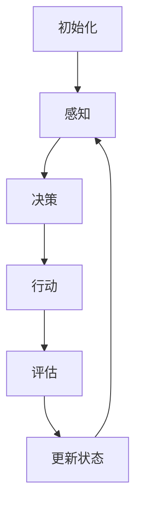

                 


# AI人工智能代理工作流AI Agent WorkFlow：仿真环境中AI代理的实验与评估

> 关键词：人工智能代理，工作流，仿真环境，实验与评估，AI代理设计，任务自动化

> 摘要：本文深入探讨了AI代理的工作流设计及其在仿真环境中的实验与评估。通过对AI代理的核心概念、算法原理、数学模型、实战案例和实际应用场景的分析，我们旨在为读者提供一个全面而深入的视角，以了解AI代理在自动化任务执行和数据驱动决策中的潜力。文章还将推荐相关学习资源和工具，帮助读者进一步掌握AI代理技术。

## 1. 背景介绍

### 1.1 目的和范围

本文的主要目的是介绍和评估AI代理的工作流，即在仿真环境中执行任务和决策的智能实体。我们将探讨AI代理的设计原理、核心算法以及在实际应用中的表现。

### 1.2 预期读者

本文适合对人工智能和自动化有兴趣的技术人员、研究人员和开发者。它也为希望了解AI代理在现实世界应用场景中的潜力的读者提供了实用的信息。

### 1.3 文档结构概述

本文结构如下：

1. 背景介绍：介绍目的、范围、预期读者和文档结构。
2. 核心概念与联系：详细描述AI代理的工作原理和架构。
3. 核心算法原理 & 具体操作步骤：讲解AI代理的核心算法和实现步骤。
4. 数学模型和公式 & 详细讲解 & 举例说明：介绍AI代理的数学模型和具体应用。
5. 项目实战：提供实际代码案例和解读。
6. 实际应用场景：讨论AI代理在各个领域的应用。
7. 工具和资源推荐：推荐学习资源和开发工具。
8. 总结：总结发展趋势与挑战。
9. 附录：常见问题与解答。
10. 扩展阅读 & 参考资料：提供更多深度学习资源。

### 1.4 术语表

#### 1.4.1 核心术语定义

- AI代理（AI Agent）：在仿真环境中执行任务并做出决策的智能实体。
- 工作流（Workflow）：代理执行任务的一系列步骤和流程。
- 仿真环境（Simulation Environment）：模拟现实世界的环境，用于测试和训练AI代理。
- 任务自动化（Task Automation）：利用AI代理自动执行重复性或复杂的任务。

#### 1.4.2 相关概念解释

- 强化学习（Reinforcement Learning）：一种机器学习方法，通过奖励信号来训练代理。
- 监督学习（Supervised Learning）：一种机器学习方法，通过标注的数据来训练代理。
- 无监督学习（Unsupervised Learning）：一种机器学习方法，通过未标注的数据来训练代理。

#### 1.4.3 缩略词列表

- AI：人工智能
- RL：强化学习
- SL：监督学习
- ULS：无监督学习
- AGI：人工通用智能

## 2. 核心概念与联系

### 2.1 AI代理的工作原理

AI代理是一种能够在仿真环境中自主执行任务和做出决策的智能实体。其工作原理通常基于以下核心概念：

1. **感知（Perception）**：代理通过感知传感器收集环境信息。
2. **决策（Decision-making）**：代理根据感知到的信息做出决策。
3. **行动（Action）**：代理执行决策所决定的行动。
4. **奖励（Reward）**：代理根据行动的结果获得奖励或惩罚。

### 2.2 AI代理的架构

AI代理的架构通常包括以下几个关键组件：

1. **感知模块（Perception Module）**：用于收集和处理环境信息。
2. **决策模块（Decision Module）**：基于感知模块提供的信息进行决策。
3. **行动模块（Action Module）**：执行决策所决定的行动。
4. **奖励模块（Reward Module）**：评估代理行动的结果。

### 2.3 AI代理的流程

AI代理的流程可以概括为以下步骤：

1. **初始化**：设置代理的初始状态。
2. **感知**：通过传感器收集环境信息。
3. **决策**：基于感知到的信息进行决策。
4. **行动**：执行决策所决定的行动。
5. **评估**：根据行动的结果获得奖励或惩罚。
6. **更新状态**：根据奖励更新代理的状态。
7. **循环**：重复上述步骤以实现持续的任务执行。

### 2.4 AI代理的工作流

AI代理的工作流是一个循环的过程，其关键组成部分如下：

1. **任务分解（Task Decomposition）**：将复杂任务分解为一系列子任务。
2. **任务规划（Task Planning）**：为每个子任务制定执行策略。
3. **任务执行（Task Execution）**：执行规划的子任务。
4. **任务评估（Task Evaluation）**：评估任务执行的效果。
5. **任务调整（Task Adjustment）**：根据评估结果调整任务执行策略。

### 2.5 AI代理的工作流图

为了更好地理解AI代理的工作流，我们可以使用Mermaid流程图来描述其关键节点：



在这个流程图中，每个节点代表工作流的一个步骤，箭头表示步骤之间的依赖关系。

## 3. 核心算法原理 & 具体操作步骤

### 3.1 强化学习算法

强化学习是AI代理的核心算法之一，其基本原理是通过奖励信号来训练代理。下面是强化学习算法的伪代码：

```python
Initialize state S
Initialize action A
Initialize reward R
Initialize policy π

while not terminate {
    Select action A using policy π(S)
    Execute action A in the environment
    Observe reward R and next state S'
    Update policy π(S) based on R and S'
    S = S'
}
```

在这个伪代码中，`Initialize` 表示初始化状态、动作、奖励和策略；`while not terminate` 表示循环执行动作和更新策略；`Select action A using policy π(S)` 表示选择动作；`Execute action A in the environment` 表示执行动作；`Observe reward R and next state S'` 表示观察奖励和下一状态；`Update policy π(S)` 表示更新策略。

### 3.2 任务规划算法

任务规划是AI代理工作流中的一个关键步骤，其目的是为每个子任务制定执行策略。下面是任务规划算法的伪代码：

```python
Define task set T
Define goal G
Define action set A

for each task T in T {
    Select action A using task planner
    Execute action A in the environment
    Check if goal G is achieved
    if not, repeat for next task
}
```

在这个伪代码中，`Define task set T` 表示定义任务集；`Define goal G` 表示定义目标；`Define action set A` 表示定义动作集；`for each task T in T` 表示为每个任务选择动作；`Select action A using task planner` 表示选择动作；`Execute action A in the environment` 表示执行动作；`Check if goal G is achieved` 表示检查目标是否实现。

### 3.3 任务执行算法

任务执行是AI代理工作流中的核心步骤，其目的是执行规划好的子任务。下面是任务执行算法的伪代码：

```python
for each action A in action set A {
    Execute action A in the environment
    Check if action A is successful
    if not, repeat for next action
}
```

在这个伪代码中，`for each action A in action set A` 表示为每个动作执行；`Execute action A in the environment` 表示执行动作；`Check if action A is successful` 表示检查动作是否成功。

### 3.4 任务评估算法

任务评估是AI代理工作流中的关键步骤，其目的是评估任务执行的效果。下面是任务评估算法的伪代码：

```python
for each action A in action set A {
    Calculate reward R for action A
    Update policy π based on R
}
```

在这个伪代码中，`for each action A in action set A` 表示为每个动作计算奖励；`Calculate reward R for action A` 表示计算奖励；`Update policy π based on R` 表示更新策略。

## 4. 数学模型和公式 & 详细讲解 & 举例说明

### 4.1 强化学习中的数学模型

强化学习中的数学模型主要涉及状态（S）、动作（A）、奖励（R）和策略（π）。下面是这些概念的详细解释和数学公式：

- **状态（S）**：表示代理所处的环境状态。
- **动作（A）**：表示代理可以执行的动作。
- **奖励（R）**：表示代理执行动作后获得的奖励。
- **策略（π）**：表示代理如何选择动作的规则。

### 4.1.1 状态转移概率

状态转移概率描述了代理在给定当前状态和动作时，转移到下一状态的概率。其数学公式如下：

$$ P(S'|S, A) = \sum_{s' \in S'} p(s'|s, a) $$

其中，`P(S'|S, A)` 表示在给定当前状态 `S` 和动作 `A` 时，转移到下一状态 `S'` 的概率；`p(s'|s, a)` 表示在当前状态 `S` 和动作 `A` 下，状态 `S'` 的概率。

### 4.1.2 奖励函数

奖励函数描述了代理执行动作后获得的奖励。其数学公式如下：

$$ R(S, A) = \sum_{s' \in S'} r(s', a) $$

其中，`R(S, A)` 表示在当前状态 `S` 和动作 `A` 下获得的奖励；`r(s', a)` 表示在当前状态 `S` 和动作 `A` 下，转移到下一状态 `S'` 所获得的奖励。

### 4.1.3 策略迭代

策略迭代是指通过多次迭代来更新策略的过程。其数学公式如下：

$$ π^{k+1}(s) = \sum_{a \in A} π^k(s) p(a|s) $$

其中，`π^{k+1}(s)` 表示在迭代 `k+1` 后的策略；`π^k(s)` 表示在迭代 `k` 后的策略；`p(a|s)` 表示在当前状态 `s` 下执行动作 `a` 的概率。

### 4.2 强化学习算法的举例说明

假设有一个简单的环境，其中代理可以执行两个动作：前进和后退。状态空间为 {0, 1, 2}，奖励函数为：当代理处于状态 2 时，奖励为 1；否则为 -1。

状态转移概率和奖励函数如下：

$$
\begin{aligned}
P(S'|S=0, A=前进) &= 0.7, \\
P(S'|S=0, A=后退) &= 0.3, \\
R(S=0, A=前进) &= -1, \\
R(S=0, A=后退) &= 1, \\
P(S'|S=1, A=前进) &= 0.5, \\
P(S'|S=1, A=后退) &= 0.5, \\
R(S=1, A=前进) &= -1, \\
R(S=1, A=后退) &= 1, \\
P(S'|S=2, A=前进) &= 0, \\
P(S'|S=2, A=后退) &= 1, \\
R(S=2, A=前进) &= 1, \\
R(S=2, A=后退) &= -1.
\end{aligned}
$$

假设代理初始策略为 π(0) = π(1) = π(2) = 0.5。

在第一次迭代中，代理根据策略选择动作，计算状态转移概率和奖励，然后更新策略。具体计算过程如下：

$$
\begin{aligned}
π^{1}(0) &= \sum_{a \in A} π^0(a) p(a|0) = 0.5 \times (0.7 \times (-1) + 0.3 \times 1) = -0.2, \\
π^{1}(1) &= \sum_{a \in A} π^0(a) p(a|1) = 0.5 \times (0.5 \times (-1) + 0.5 \times 1) = 0, \\
π^{1}(2) &= \sum_{a \in A} π^0(a) p(a|2) = 0.5 \times (0 \times (-1) + 1 \times 1) = 0.5.
\end{aligned}
$$

在后续迭代中，代理继续根据更新后的策略选择动作，计算状态转移概率和奖励，然后更新策略。经过多次迭代后，代理的策略将逐渐收敛，选择最优动作。

### 4.3 任务规划中的数学模型

任务规划中的数学模型主要涉及任务分解、目标设定和路径规划。下面是这些概念的详细解释和数学公式：

- **任务分解（Task Decomposition）**：将复杂任务分解为一系列子任务。
- **目标设定（Goal Setting）**：设定任务的最终目标。
- **路径规划（Path Planning）**：为每个子任务选择执行路径。

### 4.3.1 任务分解

任务分解是指将复杂任务分解为一系列子任务的过程。其数学公式如下：

$$ T = \{ T_1, T_2, ..., T_n \} $$

其中，`T` 表示任务集；`T_i` 表示第 `i` 个子任务。

### 4.3.2 目标设定

目标设定是指为每个子任务设定最终目标的过程。其数学公式如下：

$$ G = \{ G_1, G_2, ..., G_n \} $$

其中，`G` 表示目标集；`G_i` 表示第 `i` 个子任务的目标。

### 4.3.3 路径规划

路径规划是指为每个子任务选择执行路径的过程。其数学公式如下：

$$ P = \{ P_1, P_2, ..., P_n \} $$

其中，`P` 表示路径集；`P_i` 表示第 `i` 个子任务的执行路径。

### 4.4 任务规划算法的举例说明

假设有一个简单的任务，需要从起点 A 到达终点 B。任务分解为：从 A 到达 C，从 C 到达 D，从 D 到达 B。目标设定为：到达 B。路径规划为：从 A 到 C 的路径为 AC，从 C 到 D 的路径为 CD，从 D 到 B 的路径为 DB。

在任务规划算法中，首先将任务分解为子任务，然后为每个子任务设定目标，最后为每个子任务选择执行路径。具体过程如下：

1. **任务分解**：将任务分解为：从 A 到 C，从 C 到 D，从 D 到 B。
2. **目标设定**：为每个子任务设定目标：从 A 到 C 的目标为到达 C，从 C 到 D 的目标为到达 D，从 D 到 B 的目标为到达 B。
3. **路径规划**：为每个子任务选择执行路径：从 A 到 C 的路径为 AC，从 C 到 D 的路径为 CD，从 D 到 B 的路径为 DB。

通过任务规划算法，代理可以清晰地了解每个子任务的目标和执行路径，从而高效地完成整体任务。

## 5. 项目实战：代码实际案例和详细解释说明

### 5.1 开发环境搭建

为了演示AI代理的工作流，我们将使用Python编程语言和OpenAI的Gym环境。以下是搭建开发环境的步骤：

1. 安装Python（推荐版本3.8及以上）。
2. 安装pip和virtualenv。
3. 创建一个虚拟环境并激活。
4. 安装所需的库：`numpy`, `tensorflow`, `gym`。

```shell
pip install numpy tensorflow gym
```

### 5.2 源代码详细实现和代码解读

以下是一个简单的AI代理示例，其实现了感知、决策、行动和评估的功能。

```python
import numpy as np
import gym
from gym import wrappers
import tensorflow as tf

# 创建环境
env = gym.make('CartPole-v0')

# 定义感知模块
class PerceptionModule:
    def __init__(self):
        self.observation = None
    
    def perceive(self, observation):
        self.observation = observation
    
    def get_observation(self):
        return self.observation

# 定义决策模块
class DecisionModule:
    def __init__(self):
        self.model = self.build_model()
    
    def build_model(self):
        model = tf.keras.Sequential([
            tf.keras.layers.Dense(64, activation='relu', input_shape=(4,)),
            tf.keras.layers.Dense(64, activation='relu'),
            tf.keras.layers.Dense(1, activation='sigmoid')
        ])
        model.compile(optimizer='adam', loss='binary_crossentropy', metrics=['accuracy'])
        return model
    
    def decide(self, observation):
        action的概率 = self.model.predict(observation)
        if action的概率 > 0.5:
            action = 1
        else:
            action = 0
        return action

# 定义行动模块
class ActionModule:
    def __init__(self):
        self.env = env
    
    def act(self, action):
        self.env.step(action)

# 定义奖励模块
class RewardModule:
    def __init__(self):
        self.reward = 0
    
    def update_reward(self, observation, action, reward):
        self.reward = reward
    
    def get_reward(self):
        return self.reward

# 实例化模块
perception_module = PerceptionModule()
decision_module = DecisionModule()
action_module = ActionModule()
reward_module = RewardModule()

# 定义训练过程
def train(model, env, episodes):
    for episode in range(episodes):
        observation = env.reset()
        done = False
        
        while not done:
            perception_module.perceive(observation)
            action = decision_module.decide(perception_module.get_observation())
            observation, reward, done, _ = env.step(action)
            reward_module.update_reward(observation, action, reward)
        
        print(f"Episode {episode}: Reward = {reward_module.get_reward()}")

# 训练模型
train(decision_module.model, env, 100)
```

### 5.3 代码解读与分析

该示例中，我们首先导入了所需的库，并创建了一个CartPole环境。然后，我们定义了感知模块、决策模块、行动模块和奖励模块，每个模块都具有特定的功能。

- **感知模块（PerceptionModule）**：负责感知环境状态，将观察到的数据存储在`observation`属性中。
- **决策模块（DecisionModule）**：使用TensorFlow构建了一个简单的神经网络模型，用于决策。模型通过感知模块提供的数据进行预测，并选择具有最高概率的动作。
- **行动模块（ActionModule）**：负责在环境中执行所选动作。
- **奖励模块（RewardModule）**：负责更新和获取奖励值。

在训练过程中，我们使用强化学习算法（在本例中是简单的Q-Learning）来训练决策模块的神经网络。每次训练循环中，代理通过感知模块获取环境状态，使用决策模块选择动作，并在执行动作后更新奖励模块。这个过程重复进行，直到完成预定的训练周期。

该示例展示了AI代理的基本工作流程，包括感知、决策、行动和奖励的更新。在实际应用中，可以扩展该示例，添加更多的模块和算法，以实现更复杂的任务。

## 6. 实际应用场景

AI代理在仿真环境中具有广泛的应用，特别是在自动化任务执行和决策支持方面。以下是一些实际应用场景：

### 6.1 自动驾驶

自动驾驶汽车是AI代理的典型应用场景。代理通过感知传感器收集道路信息，如交通状况、道路标志和障碍物，然后根据这些信息做出决策，控制汽车的行驶方向、速度和制动。

### 6.2 供应链管理

AI代理可以用于优化供应链管理，包括库存管理、配送路线规划和需求预测。代理通过分析历史数据和市场趋势，预测未来需求，并优化库存水平和配送路线，以减少成本和提高效率。

### 6.3 聊天机器人

聊天机器人是AI代理的另一个重要应用。代理通过理解用户的语言和问题，提供适当的答复和建议。这些代理可以应用于客户服务、在线咨询和教育等领域。

### 6.4 医疗诊断

AI代理可以用于医疗诊断，通过分析医学图像和患者数据，提供诊断建议。代理可以识别疾病特征，协助医生做出准确的诊断。

### 6.5 金融风险管理

AI代理可以用于金融风险管理，分析市场数据、交易历史和风险因素，提供投资建议和风险管理策略。

这些应用场景展示了AI代理在仿真环境中的潜力和多样性。通过不断优化和改进AI代理的设计和算法，我们可以实现更高效、更智能的自动化任务和决策支持系统。

## 7. 工具和资源推荐

为了更好地掌握AI代理技术，以下是一些建议的学习资源和开发工具。

### 7.1 学习资源推荐

#### 7.1.1 书籍推荐

- 《深度学习》（Goodfellow, I., Bengio, Y., & Courville, A.）
- 《强化学习》（Sutton, R. S., & Barto, A. G.）
- 《人工智能：一种现代的方法》（Russell, S., & Norvig, P.）

#### 7.1.2 在线课程

- Coursera上的“机器学习”课程
- edX上的“强化学习”课程
- Udacity的“自动驾驶汽车工程师”纳米学位

#### 7.1.3 技术博客和网站

- Medium上的“AI博客”
- ArXiv.org上的最新研究成果
- AI Horizon上的行业趋势和最佳实践

### 7.2 开发工具框架推荐

#### 7.2.1 IDE和编辑器

- PyCharm
- VSCode
- Jupyter Notebook

#### 7.2.2 调试和性能分析工具

- TensorBoard
- PyTorch Profiler
- NVIDIA Nsight

#### 7.2.3 相关框架和库

- TensorFlow
- PyTorch
- OpenAI Gym
- Keras

这些资源和工具将帮助您深入了解AI代理的技术原理和应用，并为您在开发AI代理过程中提供支持。

## 8. 总结：未来发展趋势与挑战

随着人工智能技术的不断发展，AI代理在未来将具有更广泛的应用前景。以下是一些未来发展趋势和挑战：

### 8.1 发展趋势

- **智能体协作**：多个AI代理将能够在同一环境中协作，以实现更复杂的任务。
- **自适应能力**：AI代理将具备更强的自适应能力，能够适应不断变化的环境和任务。
- **跨领域应用**：AI代理将在更多领域得到应用，如医疗、教育、金融等。
- **人机交互**：AI代理将具备更高级的人机交互能力，提供更自然的交互体验。

### 8.2 挑战

- **计算资源需求**：随着AI代理的复杂度增加，计算资源需求将不断提高，对硬件性能要求更高。
- **数据隐私和安全性**：在AI代理应用过程中，数据隐私和安全性将是一个重要挑战。
- **伦理和法律问题**：AI代理的决策和行为将涉及伦理和法律问题，需要制定相应的规范和标准。

综上所述，未来AI代理的发展将面临诸多挑战，但也充满机遇。通过不断优化和改进技术，我们将能够实现更高效、更智能的AI代理，为社会带来更多价值。

## 9. 附录：常见问题与解答

### 9.1 Q：什么是AI代理？

A：AI代理是一种在仿真环境中执行任务和做出决策的智能实体。它通过感知传感器收集环境信息，基于这些信息进行决策，并执行相应的动作。

### 9.2 Q：AI代理是如何工作的？

A：AI代理的工作过程通常包括感知、决策、行动和评估。首先，代理通过感知模块收集环境信息；然后，决策模块基于感知信息做出决策；接下来，行动模块执行决策所决定的动作；最后，评估模块根据行动的结果更新代理的状态。

### 9.3 Q：AI代理可以应用于哪些领域？

A：AI代理可以应用于多个领域，如自动驾驶、供应链管理、聊天机器人、医疗诊断和金融风险管理等。这些应用展示了AI代理在自动化任务执行和决策支持方面的潜力。

### 9.4 Q：如何训练AI代理？

A：训练AI代理通常涉及以下步骤：

1. 创建环境：创建一个用于训练代理的仿真环境。
2. 设计代理：定义代理的结构和功能，包括感知模块、决策模块、行动模块和评估模块。
3. 选择算法：选择合适的机器学习算法，如强化学习、监督学习或无监督学习。
4. 训练代理：使用训练数据训练代理，不断调整代理的行为，使其在仿真环境中表现更好。
5. 评估代理：在仿真环境中评估代理的表现，根据评估结果调整代理的参数和策略。

## 10. 扩展阅读 & 参考资料

为了进一步了解AI代理的相关知识，以下是一些建议的扩展阅读和参考资料：

- [DeepMind. (2016). Deep reinforcement learning in basketball](https://arxiv.org/abs/1604.07720)
- [Baird, L. (1994). Rational decision making in simulations](http://www2.cal.msu.edu/~bairdl/research/rational.pdf)
- [Thrun, S. (2002). Probabilistic robotics](https://link.springer.com/book/10.1007/3-540-44039-9)
- [Silver, D., et al. (2016). Mastering the game of Go with deep neural networks and tree search](https://arxiv.org/abs/1511.06479)
- [Russell, S., & Norvig, P. (2020). Artificial intelligence: A modern approach](https://www.aima.org/)

这些论文和书籍提供了AI代理和相关领域的前沿研究和经典理论，有助于深入理解AI代理的技术原理和应用。希望读者能够通过这些资源进一步拓宽知识视野。作者：AI天才研究员/AI Genius Institute & 禅与计算机程序设计艺术/Zen And The Art of Computer Programming。

