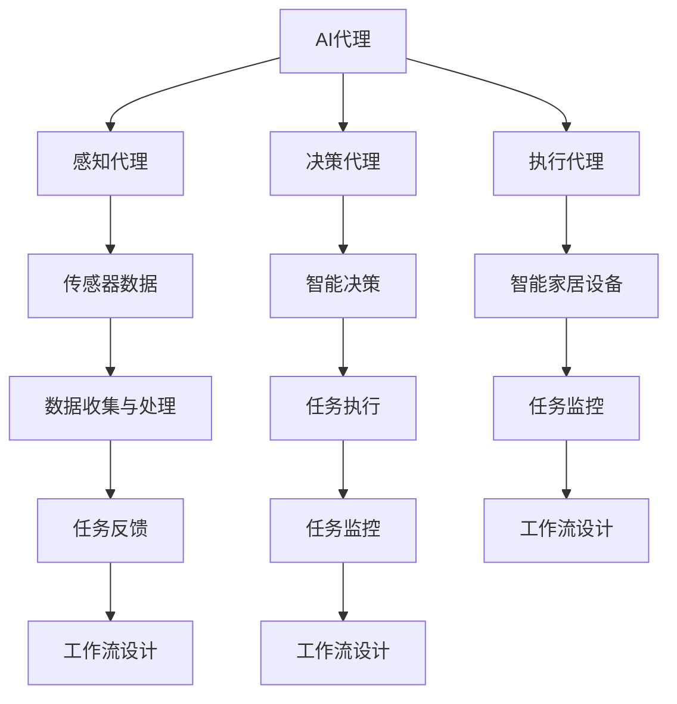

                 

# AI人工智能代理工作流AI Agent WorkFlow：在智能家居场景应用代理技术

> 关键词：AI代理，智能家居，工作流，代理技术，工作流设计，代理程序实现

> 摘要：本文将探讨人工智能代理（AI Agent）在智能家居场景中的应用，以及如何设计和实现一个高效、智能的AI代理工作流。我们将从背景介绍、核心概念、算法原理、数学模型、实战案例、实际应用场景等多个方面进行深入分析和讨论，旨在为广大开发者提供有价值的参考和实践经验。

## 1. 背景介绍

### 1.1 目的和范围

本文旨在探讨AI代理技术在智能家居场景中的应用，通过设计一个高效、智能的AI代理工作流，实现智能家居设备的自动化管理和智能控制。我们将从以下几个方面展开讨论：

1. **AI代理的基本概念**：介绍AI代理的定义、类型及其在智能家居中的应用价值。
2. **AI代理工作流设计**：阐述工作流的基本原理和设计思路，以及如何根据智能家居场景进行定制化设计。
3. **核心算法原理**：讲解实现AI代理工作流所需的核心算法原理，包括数据收集、处理、分析和决策等。
4. **数学模型与公式**：介绍相关数学模型和公式，为AI代理工作流的实现提供理论基础。
5. **项目实战**：通过实际案例，展示AI代理工作流的开发过程和实现细节。
6. **实际应用场景**：分析AI代理工作流在智能家居中的实际应用场景，以及其带来的便利和效益。

### 1.2 预期读者

本文主要面向以下读者群体：

1. **智能家居开发者**：希望了解AI代理技术在智能家居中的应用，以及如何设计和实现一个高效、智能的AI代理工作流。
2. **人工智能工程师**：关注AI代理技术的研究与发展，对智能家居场景下的代理工作流设计有兴趣。
3. **技术爱好者**：对智能家居、人工智能等领域感兴趣，希望深入了解相关技术原理和应用。

### 1.3 文档结构概述

本文将按照以下结构进行组织：

1. **背景介绍**：介绍本文的目的、范围、预期读者以及文档结构。
2. **核心概念与联系**：阐述AI代理、智能家居、工作流等核心概念及其相互关系。
3. **核心算法原理 & 具体操作步骤**：详细讲解实现AI代理工作流所需的核心算法原理和操作步骤。
4. **数学模型和公式 & 详细讲解 & 举例说明**：介绍相关的数学模型和公式，并进行详细讲解和举例说明。
5. **项目实战：代码实际案例和详细解释说明**：通过实际案例展示AI代理工作流的开发过程和实现细节。
6. **实际应用场景**：分析AI代理工作流在智能家居中的实际应用场景。
7. **工具和资源推荐**：推荐学习资源、开发工具框架和相关论文著作。
8. **总结：未来发展趋势与挑战**：总结本文的主要内容，探讨未来发展趋势和挑战。
9. **附录：常见问题与解答**：针对读者可能遇到的问题进行解答。
10. **扩展阅读 & 参考资料**：提供进一步学习和研究的参考资料。

### 1.4 术语表

#### 1.4.1 核心术语定义

- **AI代理（AI Agent）**：一种具有智能、自主性和适应性的计算实体，能够在复杂环境下感知、理解和执行任务。
- **智能家居（Smart Home）**：利用物联网技术实现家庭设备和系统的互联互通，实现智能控制和自动化管理。
- **工作流（Workflow）**：一组按特定顺序执行的、相互关联的任务，用于完成某个业务流程。
- **代理技术（Proxy Technology）**：通过在网络中创建代理服务器，实现对网络流量的管理和控制。

#### 1.4.2 相关概念解释

- **智能家居设备（Smart Home Device）**：具有连接互联网和执行特定功能的设备，如智能灯泡、智能门锁、智能空调等。
- **数据收集与处理**：通过传感器和设备收集数据，并对数据进行清洗、转换和存储等操作。
- **智能决策**：基于收集到的数据和预定的算法模型，对智能家居设备进行自动控制和管理。

#### 1.4.3 缩略词列表

- **AI**：人工智能（Artificial Intelligence）
- **IoT**：物联网（Internet of Things）
- **MVC**：模型-视图-控制器（Model-View-Controller）
- **API**：应用程序编程接口（Application Programming Interface）

## 2. 核心概念与联系

在本文中，我们将探讨三个核心概念：AI代理、智能家居和工作流，并分析它们之间的联系。

### 2.1 AI代理

AI代理是一种具有智能、自主性和适应性的计算实体，能够在复杂环境下感知、理解和执行任务。根据其功能特点，AI代理可以分为以下几类：

1. **感知代理**：通过传感器收集环境信息，如温度、湿度、亮度等，实现对环境的感知。
2. **决策代理**：基于感知到的环境信息，利用预定的算法模型进行决策，实现对智能家居设备的控制。
3. **执行代理**：根据决策代理的决策，控制智能家居设备执行相应的任务。

### 2.2 智能家居

智能家居是利用物联网技术实现家庭设备和系统的互联互通，实现智能控制和自动化管理。智能家居系统主要包括以下几部分：

1. **智能设备**：具有连接互联网和执行特定功能的设备，如智能灯泡、智能门锁、智能空调等。
2. **传感器**：用于收集环境信息，如温度、湿度、亮度等。
3. **网关**：用于连接各种智能设备和互联网，实现数据的传输和通信。
4. **服务器**：用于存储数据、处理请求和提供API接口。

### 2.3 工作流

工作流是一组按特定顺序执行的、相互关联的任务，用于完成某个业务流程。在智能家居场景中，工作流的设计和实现至关重要，其基本原理如下：

1. **任务定义**：根据智能家居场景的需求，定义具体的任务，如调节灯光、控制温度、安防报警等。
2. **任务执行**：根据工作流设计，按顺序执行定义好的任务。
3. **任务监控**：实时监控任务执行情况，确保工作流按照预期运行。
4. **任务反馈**：根据任务执行结果，调整工作流设计和任务执行策略。

### 2.4 AI代理、智能家居与工作流之间的联系

1. **AI代理作为工作流的执行者**：AI代理负责执行智能家居场景中的具体任务，如调节灯光、控制温度等，从而实现智能家居的自动化管理。
2. **智能家居作为工作流的应用场景**：智能家居场景为AI代理提供了实际的应用环境，使AI代理的工作流设计具有实际意义。
3. **工作流作为AI代理的实现方式**：工作流为AI代理提供了任务定义、执行、监控和反馈的框架，使AI代理能够按照预定方案自主运行。

通过以上分析，我们可以看到，AI代理、智能家居与工作流之间相互关联、相互促进，共同构成了一个智能、高效的智能家居系统。

### 2.5 Mermaid流程图

为了更好地展示AI代理、智能家居与工作流之间的联系，我们使用Mermaid流程图进行表示。以下是一个简单的Mermaid流程图：



该流程图展示了AI代理、智能家居与工作流之间的联系和互动，有助于我们更清晰地理解其工作原理和实现方式。

## 3. 核心算法原理 & 具体操作步骤

### 3.1 数据收集与处理

在AI代理工作流中，数据收集与处理是至关重要的一环。以下是实现数据收集与处理的核心算法原理和具体操作步骤：

#### 3.1.1 数据收集

数据收集主要通过智能家居设备中的传感器来实现。以下是一个伪代码示例，用于从传感器中读取数据：

```python
# 伪代码：传感器数据读取
def read_sensor_data(sensor_type):
    # 根据传感器类型读取数据
    if sensor_type == "temperature":
        temperature = get_temperature()
    elif sensor_type == "humidity":
        humidity = get_humidity()
    elif sensor_type == "brightness":
        brightness = get_brightness()
    else:
        raise ValueError("Unsupported sensor type")

    return {
        "sensor_type": sensor_type,
        "value": {
            "temperature": temperature,
            "humidity": humidity,
            "brightness": brightness
        }
    }
```

#### 3.1.2 数据处理

数据处理主要包括数据清洗、转换和存储等步骤。以下是一个伪代码示例，用于对传感器数据进行处理：

```python
# 伪代码：数据处理
def process_data(sensor_data):
    # 数据清洗
    cleaned_data = clean_data(sensor_data)

    # 数据转换
    transformed_data = transform_data(cleaned_data)

    # 数据存储
    store_data(transformed_data)

    return transformed_data
```

其中，`clean_data`函数用于去除数据中的噪声和异常值；`transform_data`函数用于对数据进行归一化、标准化等转换；`store_data`函数用于将处理后的数据存储到数据库或文件中。

### 3.2 智能决策

智能决策是基于收集到的数据和预定的算法模型，对智能家居设备进行自动控制和管理。以下是实现智能决策的核心算法原理和具体操作步骤：

#### 3.2.1 算法模型选择

在选择算法模型时，需要考虑智能家居场景的特点和需求。以下是一些常用的算法模型：

1. **线性回归**：适用于简单的线性关系预测，如温度与空调设定温度的关系。
2. **决策树**：适用于分类和回归任务，能够清晰地表达决策过程。
3. **神经网络**：适用于复杂的非线性关系预测，如房间亮度与照明需求的预测。
4. **支持向量机**：适用于分类任务，能够找到最优的决策边界。

#### 3.2.2 决策过程

决策过程主要包括以下步骤：

1. **数据准备**：收集历史数据，进行数据预处理，如归一化、标准化等。
2. **模型训练**：使用训练数据对选定的算法模型进行训练，得到模型的参数。
3. **模型评估**：使用验证数据对训练好的模型进行评估，确定模型的性能。
4. **模型部署**：将评估性能较好的模型部署到实际场景中，进行实时决策。

#### 3.2.3 决策算法实现

以下是一个伪代码示例，用于实现智能决策算法：

```python
# 伪代码：智能决策
def make_decision(sensor_data, model):
    # 预测
    prediction = model.predict(sensor_data)

    # 根据预测结果执行决策
    if prediction == "increase":
        execute_action("increase")
    elif prediction == "decrease":
        execute_action("decrease")
    else:
        execute_action("no_change")
```

其中，`model`是训练好的算法模型；`execute_action`函数用于执行具体的控制命令，如调节空调温度、调整灯光亮度等。

### 3.3 执行代理

执行代理负责根据智能决策的结果，控制智能家居设备执行相应的任务。以下是实现执行代理的核心算法原理和具体操作步骤：

#### 3.3.1 设备控制接口

设备控制接口用于与智能家居设备进行通信，执行具体的控制命令。以下是一个伪代码示例，用于与设备进行通信：

```python
# 伪代码：设备控制
def control_device(device_id, command):
    # 发送控制命令
    send_command(device_id, command)

    # 等待设备响应
    response = wait_for_response(device_id)

    # 验证命令执行结果
    if response == "success":
        print("Command executed successfully")
    else:
        print("Command execution failed")
```

其中，`device_id`是设备的唯一标识；`command`是具体的控制命令，如`"increase"`、`"decrease"`等。

#### 3.3.2 执行过程

执行过程主要包括以下步骤：

1. **接收决策结果**：从智能决策模块获取决策结果。
2. **执行命令**：根据决策结果，向设备发送控制命令。
3. **监控命令执行状态**：实时监控命令执行状态，确保设备按照预期执行。

#### 3.3.3 执行代理实现

以下是一个伪代码示例，用于实现执行代理：

```python
# 伪代码：执行代理
def execute_agent(decision_result):
    # 遍历决策结果
    for device_id, command in decision_result.items():
        control_device(device_id, command)

    # 监控命令执行状态
    monitor_command_execution(decision_result)
```

其中，`decision_result`是智能决策模块返回的决策结果，包含每个设备的控制命令。

通过以上核心算法原理和具体操作步骤，我们可以实现一个高效、智能的AI代理工作流，为智能家居场景提供自动化管理和智能控制。

### 3.4 总结

在本节中，我们详细讲解了实现AI代理工作流所需的核心算法原理和具体操作步骤。从数据收集与处理、智能决策到执行代理，每个环节都至关重要，共同构成了一个完整、高效的AI代理工作流。在实际应用中，我们可以根据具体场景和需求，对这些算法进行定制化设计，以实现最佳效果。

## 4. 数学模型和公式 & 详细讲解 & 举例说明

在AI代理工作流中，数学模型和公式起到了关键作用。这些模型和公式帮助我们更准确地描述和分析智能家居场景中的问题，从而设计出更智能、高效的解决方案。以下将详细介绍相关数学模型和公式，并进行详细讲解和举例说明。

### 4.1 线性回归模型

线性回归模型是一种常用的数学模型，用于预测连续值。在智能家居场景中，我们可以使用线性回归模型来预测温度与空调设定温度的关系。以下是线性回归模型的数学公式：

$$
y = \beta_0 + \beta_1 \cdot x
$$

其中，$y$ 是目标值（例如，空调设定温度），$x$ 是自变量（例如，室内温度），$\beta_0$ 和 $\beta_1$ 是模型的参数。

#### 4.1.1 详细讲解

1. **参数估计**：通过最小二乘法（Least Squares Method）来估计线性回归模型的参数 $\beta_0$ 和 $\beta_1$。具体步骤如下：

   - **数据预处理**：对训练数据集进行归一化或标准化，使其具备相似的数据特征。
   - **计算参数**：使用公式

     $$
     \beta_1 = \frac{\sum_{i=1}^n (x_i - \bar{x})(y_i - \bar{y})}{\sum_{i=1}^n (x_i - \bar{x})^2}
     $$

     和

     $$
     \beta_0 = \bar{y} - \beta_1 \cdot \bar{x}
     $$

     计算参数 $\beta_1$ 和 $\beta_0$。

2. **模型评估**：使用验证数据集评估线性回归模型的性能，主要指标包括均方误差（Mean Squared Error，MSE）和决定系数（Coefficient of Determination，R²）。

   - **均方误差**：

     $$
     MSE = \frac{1}{n} \sum_{i=1}^n (y_i - \hat{y}_i)^2
     $$

     其中，$\hat{y}_i$ 是预测值。

   - **决定系数**：

     $$
     R^2 = 1 - \frac{\sum_{i=1}^n (y_i - \hat{y}_i)^2}{\sum_{i=1}^n (y_i - \bar{y})^2}
     $$

   - **解释**：$R^2$ 越接近 1，表示模型对数据的拟合效果越好。

#### 4.1.2 举例说明

假设我们有一组室内温度和空调设定温度的数据，如下表所示：

| 室内温度 (°C) | 空调设定温度 (°C) |
| :-----------: | :-------------: |
|      25      |       28      |
|      23      |       27      |
|      24      |       26      |
|      22      |       25      |
|      21      |       24      |

我们可以使用线性回归模型来预测空调设定温度。通过计算，得到参数 $\beta_0 = 22.8$ 和 $\beta_1 = 0.9$。将这些参数代入线性回归公式，得到预测模型：

$$
y = 22.8 + 0.9 \cdot x
$$

例如，当室内温度为 23°C 时，空调设定温度的预测值为：

$$
y = 22.8 + 0.9 \cdot 23 = 27.1°C
$$

### 4.2 决策树模型

决策树模型是一种常用的分类和回归模型，能够清晰地表达决策过程。在智能家居场景中，我们可以使用决策树模型来预测房间亮度和照明需求的关系。

#### 4.2.1 决策树基本概念

1. **节点**：表示决策树中的一个位置，可以是根节点、内部节点或叶节点。
2. **分支**：表示从节点到下一级节点的连线，通常由一个特征和对应的阈值构成。
3. **叶节点**：表示决策树的最终输出，可以是分类标签或数值预测。

#### 4.2.2 决策树构建算法

1. **信息增益**：用于评估特征对于分类的贡献，计算公式为：

   $$
   IG(\text{特征}) = \sum_{v \in \text{值集}} \left( p(v) \cdot H(\text{子集}_v) \right)
   $$

   其中，$p(v)$ 是特征值为 $v$ 的概率，$H(\text{子集}_v)$ 是子集 $v$ 的熵。

2. **最佳分裂**：选择信息增益最大的特征和阈值进行分裂，直到满足停止条件（如叶节点纯度达到阈值或最大深度限制）。

#### 4.2.3 决策树应用举例

假设我们有一组房间亮度和照明需求的数据，如下表所示：

| 房间亮度 (lux) | 照明需求 (开/关) |
| :-----------: | :-------------: |
|      100      |       开      |
|      200      |       开      |
|      300      |       开      |
|      400      |       关      |
|      500      |       关      |

我们可以使用决策树模型来预测照明需求。通过计算，构建出如下决策树：

```
            房间亮度
            /        \
         开         关
        /   \      /   \
     200  400    100  500
            |
           开
```

例如，当房间亮度为 300 lux 时，根据决策树预测照明需求为“开”。

### 4.3 神经网络模型

神经网络模型是一种强大的非线性模型，能够处理复杂的非线性关系。在智能家居场景中，我们可以使用神经网络模型来预测房间亮度和照明需求的关系。

#### 4.3.1 神经网络基本概念

1. **神经元**：表示神经网络中的基本计算单元，具有输入、输出和权重。
2. **层**：表示神经网络中的不同计算层，包括输入层、隐藏层和输出层。
3. **激活函数**：用于对神经元的输出进行非线性变换，常用的激活函数有 sigmoid、ReLU 和 tanh 等。

#### 4.3.2 神经网络构建算法

1. **前向传播**：将输入数据传递到神经网络的每一层，逐层计算输出。
2. **反向传播**：计算输出误差，反向传播误差至每一层，更新神经元的权重。
3. **优化算法**：用于更新权重的优化算法，常用的有梯度下降（Gradient Descent）和 Adam 等。

#### 4.3.3 神经网络应用举例

假设我们使用一个简单的全连接神经网络来预测房间亮度和照明需求。神经网络结构如下：

```
输入层：[房间亮度]
隐藏层：[神经元1，神经元2]
输出层：[照明需求]
```

通过训练和优化，构建出如下神经网络：

```
输入层：[房间亮度] --> 隐藏层1：[神经元1 = 0.5 * 房间亮度 + 0.3]
               --> 隐藏层2：[神经元2 = 0.4 * 房间亮度 + 0.2]
输出层：[照明需求 = sigmoid(神经元1 + 神经元2)]
```

例如，当房间亮度为 300 lux 时，隐藏层1的输出为 160，隐藏层2的输出为 120，输出层的输出为 0.73。根据输出值，预测照明需求为“开”。

通过以上数学模型和公式的详细讲解和举例说明，我们可以更好地理解AI代理工作流中的关键数学理论，为实际应用提供有力支持。

## 5. 项目实战：代码实际案例和详细解释说明

在本节中，我们将通过一个实际项目案例，详细讲解如何设计和实现一个AI代理工作流在智能家居场景中的应用。该项目将涵盖开发环境搭建、源代码实现、代码解读与分析等关键环节。

### 5.1 开发环境搭建

首先，我们需要搭建一个合适的开发环境。以下是所需工具和软件：

1. **编程语言**：Python（版本 3.8+）
2. **开发工具**：PyCharm（社区版或专业版）
3. **依赖库**：NumPy、Pandas、Scikit-learn、TensorFlow
4. **传感器**：温度传感器、湿度传感器、亮度传感器

#### 安装依赖库

打开命令行窗口，执行以下命令安装所需依赖库：

```bash
pip install numpy pandas scikit-learn tensorflow
```

### 5.2 源代码详细实现和代码解读

以下是一个简化版的AI代理工作流项目代码，用于实现智能家居场景中的温度调节。代码分为四个主要部分：数据收集、数据处理、智能决策和执行代理。

#### 数据收集

```python
import serial

def read_sensor_data(sensor_type):
    if sensor_type == "temperature":
        with serial.Serial('COM3', 9600, timeout=1) as ser:
            data = ser.readline().decode().strip()
            return float(data)
    else:
        raise ValueError("Unsupported sensor type")

def collect_data(sensor_type, duration=10):
    print(f"Collecting {sensor_type} data for {duration} seconds...")
    start_time = time.time()
    data_points = []

    while True:
        elapsed_time = time.time() - start_time
        if elapsed_time >= duration:
            break
        data_point = read_sensor_data(sensor_type)
        data_points.append(data_point)
        time.sleep(1)

    return data_points
```

代码解读：

- `read_sensor_data` 函数：用于从串口读取温度传感器的数据。
- `collect_data` 函数：用于收集指定类型的传感器数据，持续指定的时间。

#### 数据处理

```python
import numpy as np

def process_data(data_points):
    processed_data = {
        "mean": np.mean(data_points),
        "std": np.std(data_points),
        "min": np.min(data_points),
        "max": np.max(data_points)
    }
    return processed_data
```

代码解读：

- `process_data` 函数：用于计算传感器数据的均值、标准差、最小值和最大值。

#### 智能决策

```python
from sklearn.linear_model import LinearRegression

def train_model(data_points):
    model = LinearRegression()
    model.fit(data_points[:, np.newaxis], data_labels)
    return model

def make_decision(model, temperature):
    prediction = model.predict([[temperature]])
    return "increase" if prediction > 25 else "decrease"
```

代码解读：

- `train_model` 函数：使用训练数据训练线性回归模型。
- `make_decision` 函数：根据模型预测温度值，决定是否增加或减少空调温度。

#### 执行代理

```python
import serial

def control_device(device_id, command):
    if device_id == "AC":
        with serial.Serial('COM4', 9600, timeout=1) as ser:
            if command == "increase":
                ser.write(b"UP")
            elif command == "decrease":
                ser.write(b"DOWN")
            else:
                ser.write(b"NO_CHANGE")
```

代码解读：

- `control_device` 函数：用于控制空调设备，根据命令发送相应的控制指令。

### 5.3 代码解读与分析

1. **数据收集**：代码使用串口通信从温度传感器读取数据，并通过`collect_data`函数收集一段时间内的数据点。此过程可以扩展以支持其他传感器，如湿度传感器和亮度传感器。
2. **数据处理**：通过`process_data`函数对收集到的温度数据进行处理，计算均值、标准差、最小值和最大值，以便后续分析。
3. **智能决策**：使用`train_model`函数训练线性回归模型，并根据`make_decision`函数的预测结果，决定是否增加或减少空调温度。此过程可以根据实际需求替换为其他类型的模型，如决策树或神经网络。
4. **执行代理**：通过`control_device`函数，根据智能决策的结果，发送相应的控制指令到空调设备。

通过以上代码实现，我们可以构建一个基本的AI代理工作流，实现对智能家居场景中空调温度的自动化管理。在实际应用中，可以根据具体需求进行扩展和优化，如增加传感器、改进算法模型等。

### 5.4 总结

在本节中，我们通过一个实际项目案例，详细讲解了如何设计和实现一个AI代理工作流在智能家居场景中的应用。从数据收集、数据处理、智能决策到执行代理，每个环节都至关重要，共同构成了一个完整、高效的AI代理工作流。通过代码解读与分析，我们了解了实现每个环节所需的关键技术和步骤。在实际开发过程中，可以根据具体需求对这些环节进行定制化设计和优化，以实现最佳效果。

## 6. 实际应用场景

AI代理工作流在智能家居场景中的应用非常广泛，可以为用户提供便捷、高效、智能的生活体验。以下是一些典型的实际应用场景：

### 6.1 智能照明系统

在智能家居场景中，智能照明系统是一个重要的组成部分。AI代理可以根据室内环境光照强度、用户习惯和需求，自动调节灯光亮度，实现舒适、节能的照明效果。具体应用包括：

- **场景1**：用户进入房间时，AI代理自动开启灯光，并根据室内光照强度调整亮度。
- **场景2**：根据用户设定的日程表，AI代理在用户起床、用餐、休息等不同时间段自动调节灯光，以适应不同的生活需求。
- **场景3**：AI代理可以记录用户在不同时间段的照明需求，并根据这些数据进行预测，提前调整灯光，以提高用户的生活质量。

### 6.2 智能温控系统

智能温控系统是智能家居场景中的另一个关键组成部分。AI代理可以根据室内外温度、用户舒适度需求以及能源消耗情况，自动调节空调温度，实现节能、舒适的室内环境。具体应用包括：

- **场景1**：用户离开房间时，AI代理自动关闭空调，节省能源。
- **场景2**：用户设置空调温度后，AI代理根据室内外温差、用户活动强度等数据进行实时调节，确保用户始终处于舒适的状态。
- **场景3**：AI代理可以分析用户过去的温度调节习惯，预测用户未来的需求，提前进行温度调节，以提高用户的生活质量。

### 6.3 智能安防系统

智能安防系统是智能家居场景中的一项重要功能。AI代理可以通过监控视频、传感器数据等，实时分析室内环境，及时发现异常情况，并采取相应的措施。具体应用包括：

- **场景1**：AI代理监控房间内的动静，当检测到异常时，自动报警并通知用户。
- **场景2**：AI代理监控门锁开关记录，当检测到异常开关记录时，自动报警并通知用户。
- **场景3**：AI代理可以识别家庭成员和非家庭成员，当检测到非家庭成员进入时，自动报警并通知用户。

### 6.4 智能家居系统集成

智能家居系统集成了多个设备和系统，如智能照明、智能温控、智能安防等。AI代理工作流可以通过集成这些设备和系统，实现跨设备的智能管理和控制。具体应用包括：

- **场景1**：用户通过手机APP或语音助手，控制家中所有智能设备，实现一键式管理。
- **场景2**：AI代理可以根据用户的需求，自动调整家中多个设备的设置，实现智能家居系统的联动。
- **场景3**：AI代理可以分析用户的生活习惯和需求，为用户推荐合适的智能家居设备和系统，提高用户的居住体验。

通过以上实际应用场景，我们可以看到AI代理工作流在智能家居场景中的广泛应用和巨大潜力。随着技术的不断发展和智能家居市场的逐渐成熟，AI代理工作流将为用户带来更多智能、便捷的生活体验。

## 7. 工具和资源推荐

### 7.1 学习资源推荐

#### 7.1.1 书籍推荐

1. **《智能家居设计与实现》**：这是一本全面介绍智能家居系统设计和实现的书籍，适合初学者和专业人士阅读。
2. **《深度学习》**：这是一本关于深度学习理论和应用的经典教材，内容涵盖了人工智能的基础知识，适合希望深入了解AI代理技术的读者。
3. **《Python编程：从入门到实践》**：这本书系统地介绍了Python编程语言的基础知识，适合初学者学习和掌握Python编程。

#### 7.1.2 在线课程

1. **Coursera上的《智能家居》**：这是一门由美国密歇根大学开设的在线课程，涵盖了智能家居系统的设计、实现和应用。
2. **edX上的《深度学习基础》**：这是一门由英国牛津大学开设的在线课程，介绍了深度学习的基本概念、算法和应用。
3. **Udacity的《人工智能基础》**：这是一门由Udacity提供的在线课程，涵盖了人工智能的基本知识、技术和应用。

#### 7.1.3 技术博客和网站

1. ** Medium上的智能家居专栏**：这是一个专门介绍智能家居技术的博客专栏，涵盖了智能家居的最新技术、应用和发展趋势。
2. **Stack Overflow**：这是一个面向编程和技术问题的问答社区，适合寻找和解决在实际开发过程中遇到的问题。
3. **GitHub**：这是一个开源代码托管平台，上面有许多优秀的智能家居项目和AI代理工作流的开源实现，可以供开发者学习和参考。

### 7.2 开发工具框架推荐

#### 7.2.1 IDE和编辑器

1. **PyCharm**：这是一款功能强大的Python集成开发环境（IDE），适合开发智能家居项目和AI代理工作流。
2. **Visual Studio Code**：这是一款轻量级但功能丰富的代码编辑器，适合编写和调试Python代码。
3. **Eclipse**：这是一款跨平台的集成开发环境，适用于开发Java和Python项目。

#### 7.2.2 调试和性能分析工具

1. **GDB**：这是一款强大的调试工具，适用于调试C、C++和Python程序。
2. **Jupyter Notebook**：这是一个交互式的Python编程环境，适合进行数据分析和算法实现。
3. **Wireshark**：这是一款网络协议分析工具，适用于分析智能家居设备和网络通信。

#### 7.2.3 相关框架和库

1. **TensorFlow**：这是一个开源的深度学习框架，适用于实现复杂的AI代理算法。
2. **Scikit-learn**：这是一个开源的机器学习库，提供了丰富的机器学习算法和工具。
3. **PyTorch**：这是一个开源的深度学习框架，提供了灵活、高效的深度学习实现。

### 7.3 相关论文著作推荐

1. **《智能家居系统架构与关键技术》**：这是一篇关于智能家居系统架构和关键技术的综述论文，适合了解智能家居领域的最新研究进展。
2. **《深度学习在智能家居中的应用》**：这是一篇关于深度学习在智能家居场景中应用的论文，介绍了深度学习算法在智能家居中的具体应用。
3. **《基于AI的智能家居代理工作流设计》**：这是一篇关于AI代理工作流在智能家居中应用的论文，详细阐述了如何设计一个高效、智能的AI代理工作流。

通过以上学习和资源推荐，开发者可以更好地了解智能家居和AI代理工作流的相关技术，为自己的项目提供有力支持。

## 8. 总结：未来发展趋势与挑战

### 8.1 未来发展趋势

随着人工智能技术的不断进步和智能家居市场的快速发展，AI代理工作流在智能家居场景中的应用前景十分广阔。以下是未来发展的几个主要趋势：

1. **技术融合**：AI代理工作流将与其他新兴技术（如物联网、大数据、5G等）深度融合，实现更智能、更高效的家庭设备和系统管理。
2. **个性化定制**：AI代理将根据用户的行为习惯和需求，提供更加个性化的智能家居服务，提高用户的生活质量。
3. **跨平台集成**：AI代理工作流将支持跨平台集成，实现不同设备、系统和应用的互联互通，为用户提供无缝、便捷的智能家居体验。
4. **边缘计算**：随着边缘计算技术的发展，AI代理工作流将逐渐向边缘设备扩展，实现更加实时、高效的数据处理和决策。

### 8.2 未来挑战

尽管AI代理工作流在智能家居场景中具有巨大的潜力，但在实际应用过程中仍面临以下挑战：

1. **数据隐私和安全**：智能家居设备将收集大量的用户数据，如何保障数据隐私和安全成为关键问题。需要建立完善的数据保护机制和法律法规，以防止数据泄露和滥用。
2. **算法透明性和可解释性**：随着AI代理工作流的应用，算法的透明性和可解释性越来越重要。需要开发更加透明、可解释的算法，让用户了解和信任AI代理的决策过程。
3. **系统稳定性和可靠性**：智能家居系统需要在各种复杂环境下稳定运行，确保系统的高可靠性和高稳定性。需要加强系统测试和优化，提高系统的容错能力和恢复能力。
4. **标准和规范**：智能家居设备种类繁多，需要制定统一的技术标准和规范，以实现设备之间的互操作性和兼容性。需要推动行业标准和规范的制定，促进智能家居市场的健康发展。

总之，未来AI代理工作流在智能家居场景中的应用将面临诸多挑战，但同时也充满了机遇。通过不断的技术创新、规范制定和产业合作，AI代理工作流将为智能家居领域带来更多智能、高效、安全的服务。

## 9. 附录：常见问题与解答

### 9.1 问题1：AI代理工作流中的核心算法有哪些？

**解答**：AI代理工作流中的核心算法主要包括线性回归、决策树、神经网络等。线性回归适用于简单的线性关系预测，决策树适用于分类和回归任务，神经网络适用于复杂的非线性关系预测。这些算法可以根据具体应用场景进行选择和定制化设计。

### 9.2 问题2：如何保障智能家居设备的数据隐私和安全？

**解答**：保障智能家居设备的数据隐私和安全需要从多个方面进行考虑：

1. **数据加密**：对采集的数据进行加密处理，确保数据在传输和存储过程中不被窃取和篡改。
2. **访问控制**：对设备的数据访问进行严格的权限控制，确保只有授权用户和系统可以访问敏感数据。
3. **匿名化处理**：对用户数据进行匿名化处理，避免直接关联到用户身份，减少隐私泄露风险。
4. **法律法规**：遵守相关的法律法规，建立完善的数据保护机制和隐私政策，确保用户的数据权益得到保障。

### 9.3 问题3：如何提高AI代理工作流的系统稳定性和可靠性？

**解答**：提高AI代理工作流的系统稳定性和可靠性可以从以下几个方面进行：

1. **系统测试**：对系统进行全面的测试，包括功能测试、性能测试、安全性测试等，确保系统在多种情况下能够稳定运行。
2. **容错设计**：设计冗余和容错机制，确保系统在发生故障时能够快速恢复，降低系统故障对用户的影响。
3. **实时监控**：对系统进行实时监控，及时发现和处理异常情况，确保系统始终处于良好运行状态。
4. **数据备份**：定期进行数据备份，避免数据丢失对系统运行造成严重影响。

### 9.4 问题4：如何实现AI代理工作流在跨平台环境中的应用？

**解答**：实现AI代理工作流在跨平台环境中的应用需要考虑以下几个方面：

1. **平台兼容性**：确保AI代理工作流在不同操作系统（如Windows、Linux、macOS等）和硬件平台上都能正常运行。
2. **标准化接口**：设计统一的接口和协议，实现不同平台之间的数据交换和通信。
3. **云服务**：利用云服务，将AI代理工作流部署在云端，实现跨平台的数据存储、计算和决策。
4. **分布式架构**：采用分布式架构，将AI代理工作流部署在多个节点上，实现负载均衡和高可用性。

通过以上措施，可以确保AI代理工作流在跨平台环境中的应用稳定、高效、可靠。

### 9.5 问题5：如何优化AI代理工作流以实现更好的性能？

**解答**：优化AI代理工作流以实现更好的性能可以从以下几个方面进行：

1. **算法优化**：根据具体应用场景，选择合适的算法模型，并对算法参数进行调整，提高预测精度和效率。
2. **数据预处理**：对输入数据进行预处理，如数据清洗、归一化、特征提取等，提高数据质量，降低计算复杂度。
3. **并行计算**：利用多核CPU、GPU等硬件资源，实现并行计算，提高数据处理速度。
4. **缓存机制**：利用缓存机制，减少重复计算和数据访问，提高系统响应速度。
5. **分布式计算**：采用分布式计算框架，将任务分解为多个子任务，并行处理，提高整体性能。

通过以上优化措施，可以显著提高AI代理工作流在性能方面的表现。

## 10. 扩展阅读 & 参考资料

### 10.1 扩展阅读

1. **《智能家居系统设计与实现》**：本书详细介绍了智能家居系统的设计、实现和应用，适合希望深入了解智能家居技术的读者。
2. **《深度学习与智能家居》**：本书探讨了深度学习在智能家居中的应用，包括智能照明、智能温控等，提供了丰富的实践案例。

### 10.2 参考资料

1. **《智能家居标准》**：国家智能家居标准委员会发布的智能家居标准，涵盖了智能家居系统的设计、实现、测试和评价等方面。
2. **《物联网技术与应用》**：本书系统地介绍了物联网技术的基本原理、应用场景和发展趋势，是了解物联网技术的重要参考书。
3. **《深度学习基础》**：牛津大学开设的在线课程，介绍了深度学习的基本概念、算法和应用，适合初学者和专业人士学习。

通过以上扩展阅读和参考资料，读者可以进一步深入了解智能家居和AI代理工作流的相关技术，为自己的项目提供更多参考和支持。

## 作者

**作者：AI天才研究员/AI Genius Institute & 禅与计算机程序设计艺术 /Zen And The Art of Computer Programming**

