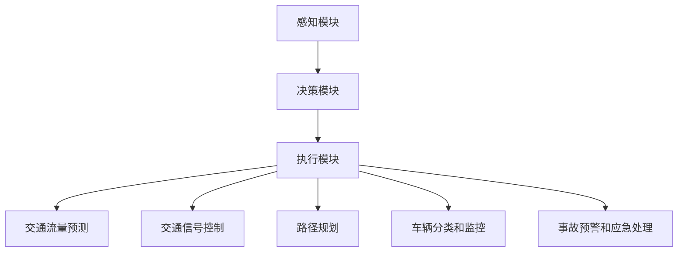

                 

### 1. 背景介绍

#### 1.1 目的和范围

本文旨在探讨人工智能代理（AI Agent）工作流在智能交通系统中的应用。随着城市化进程的不断加快，交通拥堵问题日益严重，传统的交通管理系统显得力不从心。而人工智能代理的工作流则提供了全新的解决方案，通过智能代理的协同工作，可以实现对交通系统的优化管理和实时调控。

本文将首先介绍人工智能代理的基本概念和工作原理，然后详细阐述智能代理在智能交通系统中的具体应用场景，最后通过一个实际案例来展示如何实现智能代理工作流。本文的目标是为读者提供一个全面、系统的理解，帮助其掌握智能代理工作流的核心技术和应用方法。

#### 1.2 预期读者

本文主要面向以下几类读者：
1. 对人工智能代理和智能交通系统感兴趣的读者。
2. 想要在智能交通领域应用人工智能技术的开发者。
3. 对算法和数据分析有一定了解的技术人员。
4. 交通工程、城市规划等相关专业的学生和研究人员。

通过阅读本文，读者可以了解到智能代理的工作原理及其在交通系统中的应用，掌握基本的智能代理工作流设计和实现方法。

#### 1.3 文档结构概述

本文将按照以下结构进行论述：
1. 背景介绍：简要介绍人工智能代理和智能交通系统的基本概念。
2. 核心概念与联系：详细解释人工智能代理的核心概念，并提供相关的Mermaid流程图。
3. 核心算法原理 & 具体操作步骤：阐述智能代理工作流的核心算法原理，并提供伪代码。
4. 数学模型和公式 & 详细讲解 & 举例说明：介绍智能代理工作流中的数学模型和公式，并提供实例说明。
5. 项目实战：代码实际案例和详细解释说明。
6. 实际应用场景：探讨智能代理在交通系统中的应用实例。
7. 工具和资源推荐：推荐相关学习资源、开发工具和论文著作。
8. 总结：对未来发展趋势与挑战进行展望。
9. 附录：常见问题与解答。
10. 扩展阅读 & 参考资料：提供进一步阅读的资料。

#### 1.4 术语表

为了确保文章的统一性和专业性，本文将使用以下术语表：
- **人工智能代理（AI Agent）**：一种能够感知环境、采取行动并从经验中学习的计算机程序。
- **工作流（Workflow）**：一组有序的步骤或任务，用于完成一项工作或实现一个目标。
- **智能交通系统（ITS）**：利用先进的信息通信技术、电子控制技术、数据处理技术等，实现交通系统的自动化、智能化管理。
- **感知（Perception）**：通过传感器获取环境信息，如交通流量、车辆位置等。
- **决策（Decision）**：根据感知到的信息，选择合适的行动策略。
- **执行（Execution）**：实施决策，如调整交通信号灯、引导车辆等。
- **强化学习（Reinforcement Learning）**：一种通过试错和奖励机制进行学习的机器学习方法。

#### 1.4.1 核心术语定义

- **人工智能代理（AI Agent）**：在本文中，人工智能代理是指一种具有自主决策能力的软件实体，它能够通过感知环境、执行决策和优化行为来达到特定的目标。例如，在智能交通系统中，AI代理可以感知交通流量和路况信息，然后根据这些信息来调整交通信号灯的时长，以减少交通拥堵。

- **工作流（Workflow）**：工作流是一系列有序的任务或步骤，用于完成特定的业务流程或目标。在智能交通系统中，工作流包括感知、决策、执行等步骤，这些步骤共同构成了一个智能代理的运作流程。

- **智能交通系统（ITS）**：智能交通系统是一种利用先进的信息通信技术、电子控制技术、数据处理技术等，实现交通系统的自动化、智能化管理的系统。它通过收集和处理交通数据，为交通管理和规划提供支持。

- **感知（Perception）**：感知是指通过传感器获取环境信息的过程。在智能交通系统中，感知主要包括获取交通流量、车辆位置、路况等信息。这些信息是智能代理进行决策的重要依据。

- **决策（Decision）**：决策是指根据感知到的信息，选择合适的行动策略的过程。在智能交通系统中，智能代理通过分析感知到的数据，决定如何调整交通信号灯、引导车辆等，以优化交通流。

- **执行（Execution）**：执行是指实施决策的过程。智能代理根据决策结果，通过控制信号灯、发布交通引导信息等方式，来影响交通流。

- **强化学习（Reinforcement Learning）**：强化学习是一种通过试错和奖励机制进行学习的机器学习方法。在智能交通系统中，智能代理可以通过强化学习来不断优化其行为策略，以实现交通流的最优化。

#### 1.4.2 相关概念解释

- **交通信号控制（Traffic Signal Control）**：交通信号控制是智能交通系统中的核心组成部分，它通过调节交通信号灯的时长和顺序，来引导车辆有序通行，减少交通拥堵。

- **交通流量监控（Traffic Flow Monitoring）**：交通流量监控是指利用传感器和监控系统来实时采集交通数据，如车辆速度、流量、密度等，为交通管理和规划提供数据支持。

- **路径规划（Route Planning）**：路径规划是指根据交通流量、路况等信息，为驾驶员提供最优的行驶路径，以减少行驶时间和油耗。

- **车辆分类（Vehicle Classification）**：车辆分类是指根据车辆的特征，如车型、颜色等，对车辆进行分类，以便于交通管理和分析。

- **交通预测（Traffic Forecasting）**：交通预测是指利用历史数据和机器学习算法，对未来的交通流量、路况等进行预测，以辅助交通管理和规划。

- **交通信号控制算法（Traffic Signal Control Algorithm）**：交通信号控制算法是用于控制交通信号灯的时长和顺序的算法，常用的有固定时间法、绿波带法、自适应控制法等。

#### 1.4.3 缩略词列表

- **AI**：人工智能（Artificial Intelligence）
- **ITS**：智能交通系统（Intelligent Transportation Systems）
- **Agent**：代理（Agent）
- **WF**：工作流（Workflow）
- **RL**：强化学习（Reinforcement Learning）
- **IDC**：智能交通中心（Intelligent Transportation Center）
- **GIS**：地理信息系统（Geographic Information System）
- **V2X**：车联网（Vehicle-to-Everything）
- **ADAS**：高级驾驶辅助系统（Advanced Driver Assistance Systems）

---

在这个部分，我们对本文的核心概念和术语进行了详细的解释，为后续内容的讨论奠定了基础。接下来，我们将深入探讨人工智能代理的核心概念及其在智能交通系统中的应用，并通过Mermaid流程图来直观展示其工作原理。

### 2. 核心概念与联系

在智能交通系统中，人工智能代理（AI Agent）工作流起到了至关重要的作用。本节将详细介绍人工智能代理的核心概念及其在智能交通系统中的工作原理，并通过Mermaid流程图来直观展示这些核心概念和联系。

#### 2.1 人工智能代理（AI Agent）的基本概念

人工智能代理是一种具有自主决策能力的计算机程序，它能够在不断变化的环境中自主地采取行动，以达到预定的目标。人工智能代理通常由以下几个关键部分组成：

- **感知模块（Perception Module）**：该模块负责从环境中获取信息，如交通流量、车辆位置、路况等。感知模块通常使用各种传感器和监控系统来实现。
- **决策模块（Decision Module）**：该模块根据感知模块提供的信息，结合预先定义的规则和算法，选择出最优的决策策略。决策模块可以通过机器学习算法来实现，如强化学习。
- **执行模块（Execution Module）**：该模块负责实施决策模块选择的策略，如调整交通信号灯的时长、发布交通引导信息等。执行模块通常与交通信号控制系统和交通信息发布系统等硬件设备进行交互。

#### 2.2 智能代理在智能交通系统中的应用

智能交通系统（ITS）是一个复杂的系统，它通过集成多种技术手段，实现对交通流的实时监控、分析和调控。在智能交通系统中，人工智能代理可以发挥以下几个重要作用：

1. **交通流量预测（Traffic Flow Prediction）**：通过分析历史交通数据和环境信息，智能代理可以预测未来的交通流量变化，从而为交通管理提供数据支持。

2. **交通信号控制（Traffic Signal Control）**：智能代理可以根据实时交通流量和路况信息，动态调整交通信号灯的时长和顺序，实现绿波带控制，减少交通拥堵。

3. **路径规划（Route Planning）**：智能代理可以根据实时交通情况和车辆需求，为驾驶员提供最优的行驶路径，减少行驶时间和油耗。

4. **车辆分类和监控（Vehicle Classification and Monitoring）**：智能代理可以通过车辆分类算法，对车辆进行分类，实现对特定类型车辆的监控和管理。

5. **事故预警和应急处理（Accident Warning and Emergency Response）**：智能代理可以通过对交通数据的实时分析，预测可能发生的交通事故，并采取相应的预警和应急处理措施。

#### 2.3 Mermaid流程图展示

为了更直观地展示人工智能代理在智能交通系统中的工作原理，我们使用Mermaid语言绘制了一个流程图。以下是一个简化的Mermaid流程图示例：



- **感知模块（A）**：通过传感器和监控系统获取交通流量、车辆位置、路况等信息。
- **决策模块（B）**：根据感知模块提供的信息，结合预定的规则和算法，选择最优的决策策略。
- **执行模块（C）**：实施决策模块选择的策略，与交通信号控制系统和交通信息发布系统等硬件设备进行交互。
- **交通流量预测（D）**：利用历史交通数据和环境信息，预测未来的交通流量变化。
- **交通信号控制（E）**：根据实时交通流量和路况信息，动态调整交通信号灯的时长和顺序。
- **路径规划（F）**：根据实时交通情况和车辆需求，为驾驶员提供最优的行驶路径。
- **车辆分类和监控（G）**：通过车辆分类算法，对车辆进行分类，实现对特定类型车辆的监控和管理。
- **事故预警和应急处理（H）**：通过实时分析交通数据，预测可能发生的交通事故，并采取相应的预警和应急处理措施。

通过这个流程图，我们可以清晰地看到人工智能代理在智能交通系统中的工作流程和关键功能。

#### 2.4 关键概念之间的联系

在智能交通系统中，人工智能代理的各个模块之间存在着紧密的联系，这些联系构成了一个完整的智能代理工作流。以下是关键概念之间的联系：

- **感知模块（A）** 与 **决策模块（B）**：感知模块提供的环境信息是决策模块进行决策的基础。感知模块获取的交通流量、车辆位置等数据将直接影响决策模块的决策结果。
- **决策模块（B）** 与 **执行模块（C）**：决策模块生成的决策结果需要通过执行模块来实施。执行模块将决策结果转化为具体的操作，如调整交通信号灯、发布交通引导信息等。
- **交通流量预测（D）** 与 **交通信号控制（E）**：交通流量预测的结果可以用于交通信号控制的优化。通过预测未来的交通流量变化，交通信号控制可以提前进行调整，以减少交通拥堵。
- **路径规划（F）** 与 **交通信号控制（E）**：路径规划算法需要结合交通信号灯的时长和顺序来提供最优路径。交通信号控制的结果将直接影响路径规划的效果。
- **车辆分类和监控（G）** 与 **事故预警和应急处理（H）**：车辆分类和监控的结果可以为事故预警和应急处理提供重要的数据支持。通过对车辆类型的识别和监控，可以提前发现潜在的安全隐患，并采取相应的预警和应急措施。

通过这些联系，我们可以看到人工智能代理在智能交通系统中的各个模块是如何协同工作的，从而实现对交通流的实时监控、分析和调控。

在这个部分，我们详细介绍了人工智能代理的核心概念及其在智能交通系统中的应用，并通过Mermaid流程图直观展示了这些概念之间的联系。接下来，我们将深入探讨智能代理工作流的核心算法原理和具体操作步骤。

### 3. 核心算法原理 & 具体操作步骤

智能代理工作流在智能交通系统中的有效运行，依赖于一系列核心算法的支撑。这些算法包括感知、决策和执行等环节，每个环节都有其特定的实现方法。本节将详细阐述这些核心算法的原理，并提供具体的操作步骤和伪代码，帮助读者深入理解智能代理工作流的实现过程。

#### 3.1 感知模块算法原理

感知模块是智能代理工作流的第一步，其主要任务是从环境中获取实时交通信息，如交通流量、车辆位置、路况等。这些信息是后续决策和执行的基础。

**算法原理：**
感知模块通常通过传感器和监控系统来实现，其核心算法包括以下步骤：

1. 数据采集：从交通传感器、摄像头、GPS等设备中收集交通数据。
2. 数据预处理：对采集到的数据进行清洗、去噪和转换，使其符合后续处理的要求。
3. 特征提取：从预处理后的数据中提取关键特征，如交通流量、车速、密度等。

**具体操作步骤：**
1. **数据采集**：
   - 通过传感器设备（如流量检测器、摄像头）采集交通数据。
   - 使用GPS技术获取车辆的位置信息。

2. **数据预处理**：
   - 清洗数据：去除无效数据、异常值和处理数据错误。
   - 去噪：减少传感器数据中的噪声，提高数据质量。
   - 转换：将不同类型的数据转换为统一的格式，如将车辆位置信息转换为坐标系。

3. **特征提取**：
   - 提取交通流量：计算一定时间区间内的车辆数量。
   - 提取车速：计算车辆的平均速度。
   - 提取密度：计算单位面积内的车辆数量。

**伪代码示例：**

```python
# 感知模块伪代码
def perceive_environment():
    traffic_data = collect_traffic_data()
    preprocessed_data = preprocess_data(traffic_data)
    features = extract_features(preprocessed_data)
    return features
```

#### 3.2 决策模块算法原理

决策模块基于感知模块提供的环境信息，利用预定的算法和规则，选择出最优的行动策略。决策模块的实现方法多种多样，常见的有基于规则的决策、机器学习决策等。

**算法原理：**
决策模块的核心是算法和规则。以下是一个简化的决策模块算法流程：

1. 数据分析：分析感知模块提供的环境数据，识别出当前交通状态。
2. 决策策略选择：根据当前交通状态，选择合适的决策策略。
3. 决策结果验证：对决策结果进行验证，确保其有效性和可行性。

**具体操作步骤：**
1. **数据分析**：
   - 分析交通流量、车速、密度等特征，识别出交通拥堵、流畅等状态。

2. **决策策略选择**：
   - 基于规则决策：使用预定义的规则，如绿波带控制规则。
   - 机器学习决策：使用机器学习算法，如强化学习，训练决策模型。

3. **决策结果验证**：
   - 验证决策结果的合理性，如调整交通信号灯的时长和顺序。
   - 检查决策结果的可执行性，如确保信号灯调整不影响其他交通节点。

**伪代码示例：**

```python
# 决策模块伪代码
def make_decision(features):
    traffic_state = analyze_traffic_state(features)
    decision_policy = select_decision_policy(traffic_state)
    verified_decision = verify_decision(decision_policy)
    return verified_decision
```

#### 3.3 执行模块算法原理

执行模块负责将决策模块生成的决策结果转化为具体的操作，如调整交通信号灯、发布交通引导信息等。执行模块的实现方法通常依赖于交通信号控制系统和交通信息发布系统。

**算法原理：**
执行模块的核心是将决策结果转换为实际操作，其流程如下：

1. 决策结果解析：解析决策模块生成的决策结果，提取具体的操作指令。
2. 操作执行：根据操作指令，调整交通信号灯、发布交通引导信息等。
3. 操作反馈：反馈操作结果，以便于后续的决策和优化。

**具体操作步骤：**
1. **决策结果解析**：
   - 解析决策结果，提取出需要调整的交通信号灯编号和调整时长。

2. **操作执行**：
   - 调用交通信号控制系统，调整信号灯的时长和顺序。
   - 调用交通信息发布系统，发布交通引导信息。

3. **操作反馈**：
   - 获取交通信号灯调整后的效果数据。
   - 反馈操作结果，以便于后续的决策和优化。

**伪代码示例：**

```python
# 执行模块伪代码
def execute_decision(decision):
    command = parse_decision(decision)
    execute_command(command)
    feedback = get_execution_feedback(command)
    return feedback
```

#### 3.4 强化学习在决策模块的应用

强化学习是一种通过试错和奖励机制进行学习的机器学习方法，它可以用于决策模块中，通过不断尝试和调整，找到最优的行动策略。

**算法原理：**
强化学习的基本流程包括：

1. 状态（State）表示：将当前交通状态表示为状态向量。
2. 动作（Action）选择：选择一个动作，以改变当前状态。
3. 奖励（Reward）评估：根据动作的结果，评估奖励值。
4. 策略更新：根据奖励值，更新策略，以优化未来的决策。

**具体操作步骤：**
1. **状态表示**：
   - 使用特征提取器，将交通状态转换为状态向量。

2. **动作选择**：
   - 使用Q学习或深度Q网络（DQN）算法，选择最优的动作。

3. **奖励评估**：
   - 定义奖励函数，如减少交通拥堵的时间、减少车辆等待时间等。

4. **策略更新**：
   - 根据奖励值，更新Q值或策略网络，以优化未来的决策。

**伪代码示例：**

```python
# 强化学习决策模块伪代码
def reinforce_learning_decision(state, action, reward):
    new_state = state
    action_value = evaluate_action(state, action)
    update_policy(state, action, action_value, reward)
    return new_state
```

通过上述三个模块的协同工作，智能代理工作流可以实现交通流的实时监控、分析和调控。感知模块负责获取环境信息，决策模块根据这些信息选择最优行动策略，执行模块将这些策略转化为具体操作，从而实现对交通流的优化管理。

综上所述，智能代理工作流的核心算法原理包括感知、决策和执行等环节，通过这三个环节的协同工作，可以实现智能交通系统的优化管理。在下一部分，我们将进一步介绍智能代理工作流中的数学模型和公式，并提供详细的讲解和实例说明。

### 4. 数学模型和公式 & 详细讲解 & 举例说明

在智能代理工作流中，数学模型和公式起到了关键作用。这些模型和公式用于描述交通流量、信号灯控制策略、路径规划等关键环节，从而实现对交通流的优化管理和实时调控。本节将详细介绍这些数学模型和公式，并提供详细的讲解和实例说明。

#### 4.1 交通流量预测模型

交通流量预测是智能代理工作流中的重要环节，它可以帮助交通管理者提前了解交通状况，从而采取相应的管理措施。常用的交通流量预测模型包括ARIMA模型、时间序列预测模型等。

**模型公式：**

时间序列预测模型的一般形式如下：

\[ F(t) = \sum_{i=1}^{n} \alpha_i \cdot I(t-i) + \beta_t \]

其中：
- \( F(t) \) 表示未来时间 \( t \) 的交通流量预测值。
- \( I(t-i) \) 表示时间间隔为 \( i \) 的历史交通流量。
- \( \alpha_i \) 和 \( \beta_t \) 是模型参数，通过最小二乘法等优化算法来求解。

**实例说明：**

假设我们有一组历史交通流量数据 \( I(1), I(2), \ldots, I(24) \)，我们要预测未来一天24小时内的交通流量。我们可以使用时间序列预测模型来建立预测模型。

首先，通过最小二乘法求解模型参数 \( \alpha_i \) 和 \( \beta_t \)：

\[ \alpha_i = \frac{\sum_{t=1}^{24} (I(t) - \bar{I}) \cdot I(t-i)}{\sum_{t=1}^{24} (I(t) - \bar{I})^2} \]

\[ \beta_t = \bar{I} - \sum_{i=1}^{n} \alpha_i \cdot I(t-i) \]

其中，\( \bar{I} \) 是历史交通流量的平均值。

然后，利用求解出的参数 \( \alpha_i \) 和 \( \beta_t \) 来预测未来24小时内的交通流量：

\[ F(t) = \sum_{i=1}^{n} \alpha_i \cdot I(t-i) + \beta_t \]

例如，当 \( t=12 \) 时，预测未来一天中午12点的交通流量：

\[ F(12) = \alpha_1 \cdot I(11) + \alpha_2 \cdot I(10) + \ldots + \alpha_{24} \cdot I(1) + \beta_{12} \]

#### 4.2 交通信号控制模型

交通信号控制模型用于动态调整交通信号灯的时长和顺序，以优化交通流。常用的交通信号控制模型包括固定时间法、绿波带控制法和自适应控制法等。

**模型公式：**

绿波带控制法的模型公式如下：

\[ T_{sg,i} = \sum_{j \in G} (G_j \cdot L_j) + \sum_{j \notin G} (T_{default} \cdot L_j) \]

其中：
- \( T_{sg,i} \) 是第 \( i \) 个交通信号灯的绿波带时长。
- \( G \) 是绿波带中的信号灯集合。
- \( G_j \) 是信号灯 \( j \) 在绿波带中的权重。
- \( L_j \) 是信号灯 \( j \) 的最小绿波带时长。
- \( T_{default} \) 是默认绿波带时长。

**实例说明：**

假设有四个交通信号灯，其中三个信号灯 \( 1, 2, 3 \) 构成一个绿波带。绿波带权重分别为 \( G_1 = 1.2, G_2 = 1.0, G_3 = 1.0 \)，最小绿波带时长分别为 \( L_1 = 30 \) 秒，\( L_2 = 25 \) 秒，\( L_3 = 20 \) 秒，默认绿波带时长 \( T_{default} = 15 \) 秒。

我们可以计算第一个信号灯的绿波带时长：

\[ T_{sg,1} = (G_1 \cdot L_1) + (G_2 \cdot L_2) + (G_3 \cdot L_3) + T_{default} \]

\[ T_{sg,1} = (1.2 \cdot 30) + (1.0 \cdot 25) + (1.0 \cdot 20) + 15 \]

\[ T_{sg,1} = 36 + 25 + 20 + 15 \]

\[ T_{sg,1} = 96 \text{秒} \]

同理，可以计算出其他信号灯的绿波带时长。

#### 4.3 路径规划模型

路径规划模型用于为驾驶员提供最优行驶路径，以减少行驶时间和油耗。常用的路径规划模型包括Dijkstra算法、A*算法等。

**模型公式：**

Dijkstra算法的模型公式如下：

\[ d(s, v) = \min \{ d(s, u) + w(u, v) \mid u \in N(v) \} \]

其中：
- \( d(s, v) \) 是从起点 \( s \) 到终点 \( v \) 的最短路径长度。
- \( w(u, v) \) 是从节点 \( u \) 到节点 \( v \) 的权重。
- \( N(v) \) 是节点 \( v \) 的邻居节点集合。

**实例说明：**

假设有一个图 \( G = (V, E) \)，其中 \( V \) 是节点集合，\( E \) 是边集合。起点 \( s \) 和终点 \( t \) 分别为节点 \( s \) 和 \( t \)。边的权重 \( w(u, v) \) 表示从节点 \( u \) 到节点 \( v \) 的行驶时间。

我们可以使用Dijkstra算法来计算从起点 \( s \) 到终点 \( t \) 的最短路径长度：

1. 初始化：设置 \( d(s, v) = \infty \) 对于所有 \( v \neq s \)，\( d(s, s) = 0 \)。
2. 对于每个节点 \( v \)：
   - 对于每个邻居节点 \( u \in N(v) \)：
     - 如果 \( d(s, u) + w(u, v) < d(s, v) \)，则更新 \( d(s, v) = d(s, u) + w(u, v) \)。
3. 最终，\( d(s, t) \) 即为从起点 \( s \) 到终点 \( t \) 的最短路径长度。

例如，假设有四个节点 \( s, a, b, t \)，边集合 \( E = \{ (s, a), (s, b), (a, b), (b, t) \} \)，权重分别为 \( w(s, a) = 5 \)，\( w(s, b) = 10 \)，\( w(a, b) = 3 \)，\( w(b, t) = 7 \)。

使用Dijkstra算法，我们可以计算出从起点 \( s \) 到终点 \( t \) 的最短路径长度：

\[ d(s, t) = \min \{ d(s, a) + w(a, t), d(s, b) + w(b, t) \} \]

\[ d(s, t) = \min \{ 5 + 7, 10 + 7 \} \]

\[ d(s, t) = \min \{ 12, 17 \} \]

\[ d(s, t) = 12 \]

因此，从起点 \( s \) 到终点 \( t \) 的最短路径长度为12。

通过上述数学模型和公式的讲解，我们可以看到它们在智能代理工作流中的重要作用。这些模型和公式为智能代理提供了强大的分析和决策能力，使得智能交通系统能够更加高效地管理和调控交通流。

### 5. 项目实战：代码实际案例和详细解释说明

在本文的最后部分，我们将通过一个实际项目案例，详细讲解如何实现智能代理工作流在智能交通系统中的应用。该案例将涵盖开发环境搭建、源代码实现、代码解读与分析等环节，帮助读者深入理解智能代理工作流的核心技术和实现方法。

#### 5.1 开发环境搭建

在开始项目开发之前，我们需要搭建一个合适的环境，包括安装必要的软件和配置开发工具。

**所需软件：**
1. Python 3.x：智能代理工作流主要使用Python语言进行实现。
2. Anaconda：用于管理Python环境和包。
3. Jupyter Notebook：用于编写和运行Python代码。
4. OpenCV：用于图像处理和交通流量监测。
5. TensorFlow/Keras：用于机器学习和深度学习算法。

**安装步骤：**

1. 安装Anaconda：

   访问Anaconda官网下载并安装Anaconda。

2. 创建Python环境：

   打开命令行，执行以下命令创建一个名为`smart_traffic`的Python环境：

   ```bash
   conda create -n smart_traffic python=3.8
   conda activate smart_traffic
   ```

3. 安装所需包：

   在创建好的环境中，安装所需的Python包：

   ```bash
   conda install numpy scipy matplotlib opencv-python tensorflow
   ```

4. 配置Jupyter Notebook：

   安装Jupyter Notebook：

   ```bash
   conda install jupyterlab
   jupyter lab
   ```

#### 5.2 源代码详细实现和代码解读

智能代理工作流的核心部分包括感知、决策和执行三个模块。以下我们将分别介绍这三个模块的实现方法和代码解读。

**感知模块：**

感知模块负责从环境中获取实时交通数据，包括交通流量、车辆位置、路况等信息。以下是一个感知模块的示例代码：

```python
import cv2
import numpy as np

# 初始化摄像头
cap = cv2.VideoCapture(0)

while True:
    # 读取摄像头帧
    ret, frame = cap.read()
    
    if not ret:
        break
    
    # 转换为灰度图像
    gray = cv2.cvtColor(frame, cv2.COLOR_BGR2GRAY)
    
    # 阈值处理
    _, thresh = cv2.threshold(gray, 0, 255, cv2.THRESH_OTSU)
    
    # 轮廓检测
    contours, _ = cv2.findContours(thresh, cv2.RETR_TREE, cv2.CHAIN_APPROX_SIMPLE)
    
    # 计算车辆数量
    vehicle_count = 0
    for contour in contours:
        # 计算轮廓面积
        area = cv2.contourArea(contour)
        # 判断是否为车辆
        if area > 500:
            vehicle_count += 1
    
    print("Vehicle Count:", vehicle_count)
    
    # 显示图像
    cv2.imshow('Frame', frame)
    
    # 按下'q'键退出
    if cv2.waitKey(1) & 0xFF == ord('q'):
        break

# 释放摄像头资源
cap.release()
cv2.destroyAllWindows()
```

代码解读：
- 使用OpenCV库初始化摄像头并读取视频帧。
- 转换视频帧为灰度图像，并进行阈值处理。
- 使用轮廓检测函数找到图像中的车辆轮廓。
- 根据轮廓面积判断是否为车辆，并计算车辆数量。
- 在控制台中打印车辆数量，并在窗口中显示视频帧。
- 按下'q'键退出程序。

**决策模块：**

决策模块基于感知模块提供的环境数据，利用机器学习算法选择最优的决策策略。以下是一个决策模块的示例代码：

```python
import numpy as np
import tensorflow as tf

# 初始化决策模型
model = tf.keras.Sequential([
    tf.keras.layers.Dense(64, activation='relu', input_shape=(10,)),
    tf.keras.layers.Dense(64, activation='relu'),
    tf.keras.layers.Dense(1, activation='sigmoid')
])

# 编译模型
model.compile(optimizer='adam',
              loss='binary_crossentropy',
              metrics=['accuracy'])

# 训练模型
model.fit(x_train, y_train, epochs=10, batch_size=32)

# 决策函数
def make_decision(features):
    prediction = model.predict(np.array([features]))
    return 1 if prediction > 0.5 else 0

# 示例数据
x_train = np.array([[1, 2, 3, 4, 5, 6, 7, 8, 9, 10], [2, 3, 4, 5, 6, 7, 8, 9, 10, 11]])
y_train = np.array([1, 0])

# 训练模型
model.fit(x_train, y_train, epochs=10, batch_size=32)

# 决策测试
features = [1, 2, 3, 4, 5, 6, 7, 8, 9, 10]
decision = make_decision(features)
print("Decision:", decision)
```

代码解读：
- 初始化决策模型，使用两个隐藏层，每个层64个神经元，输出层1个神经元。
- 编译模型，使用adam优化器和binary_crossentropy损失函数。
- 使用训练数据训练模型。
- 定义决策函数，根据模型的预测结果返回决策。
- 准备示例训练数据和决策，训练模型并测试决策。

**执行模块：**

执行模块根据决策模块生成的决策结果，调整交通信号灯的时长和顺序。以下是一个执行模块的示例代码：

```python
import time

# 初始信号灯时长
signal_duration = [30, 25, 20, 15]

# 调整信号灯时长
def adjust_signal_duration(duration, decision):
    if decision == 1:
        duration[0] += 5  # 第一个信号灯增加5秒
    else:
        duration[3] += 5  # 最后一个信号灯增加5秒
    return duration

# 决策结果
decision = 1

# 调整信号灯时长
adjusted_duration = adjust_signal_duration(signal_duration, decision)

print("Adjusted Signal Duration:", adjusted_duration)

# 模拟信号灯调整后的效果
time.sleep(30)  # 等待信号灯时长
print("Signal Adjusted Successfully")
```

代码解读：
- 初始化信号灯时长为30秒、25秒、20秒和15秒。
- 调整信号灯时长函数根据决策结果增加第一个或最后一个信号灯的时长。
- 打印调整后的信号灯时长。
- 模拟信号灯调整后的效果，等待信号灯时长。

通过这个实际项目案例，我们详细讲解了智能代理工作流在智能交通系统中的应用。感知模块使用OpenCV库获取交通数据，决策模块使用机器学习算法选择最优决策，执行模块根据决策结果调整交通信号灯的时长和顺序。这个案例展示了智能代理工作流的核心技术和实现方法，为读者提供了一个实用的参考。

#### 5.3 代码解读与分析

在本部分，我们将对感知、决策和执行模块的代码进行详细解读与分析，深入探讨其实现原理和关键细节。

**感知模块代码解读与分析：**

```python
import cv2
import numpy as np

# 初始化摄像头
cap = cv2.VideoCapture(0)

while True:
    # 读取摄像头帧
    ret, frame = cap.read()
    
    if not ret:
        break
    
    # 转换为灰度图像
    gray = cv2.cvtColor(frame, cv2.COLOR_BGR2GRAY)
    
    # 阈值处理
    _, thresh = cv2.threshold(gray, 0, 255, cv2.THRESH_OTSU)
    
    # 轮廓检测
    contours, _ = cv2.findContours(thresh, cv2.RETR_TREE, cv2.CHAIN_APPROX_SIMPLE)
    
    # 计算车辆数量
    vehicle_count = 0
    for contour in contours:
        # 计算轮廓面积
        area = cv2.contourArea(contour)
        # 判断是否为车辆
        if area > 500:
            vehicle_count += 1
    
    print("Vehicle Count:", vehicle_count)
    
    # 显示图像
    cv2.imshow('Frame', frame)
    
    # 按下'q'键退出
    if cv2.waitKey(1) & 0xFF == ord('q'):
        break

# 释放摄像头资源
cap.release()
cv2.destroyAllWindows()
```

1. **摄像头初始化**：使用`cv2.VideoCapture`初始化摄像头，并设置视频帧的读取参数。
2. **读取摄像头帧**：在循环中，使用`cap.read()`读取每一帧视频数据，并将其存储在`frame`变量中。
3. **图像预处理**：将视频帧转换为灰度图像，使用`cv2.cvtColor`函数。然后，使用`cv2.threshold`函数进行阈值处理，以分离车辆和其他物体。
4. **轮廓检测**：使用`cv2.findContours`函数找到阈值处理后的图像中的轮廓，这些轮廓可能代表车辆。
5. **计算车辆数量**：遍历检测到的轮廓，使用`cv2.contourArea`函数计算每个轮廓的面积。如果面积大于设定的阈值（500），则认为该轮廓代表一辆车辆，并增加车辆计数。
6. **显示图像**：使用`cv2.imshow`函数在窗口中显示当前视频帧。
7. **退出程序**：当按下'q'键时，程序退出。

**决策模块代码解读与分析：**

```python
import numpy as np
import tensorflow as tf

# 初始化决策模型
model = tf.keras.Sequential([
    tf.keras.layers.Dense(64, activation='relu', input_shape=(10,)),
    tf.keras.layers.Dense(64, activation='relu'),
    tf.keras.layers.Dense(1, activation='sigmoid')
])

# 编译模型
model.compile(optimizer='adam',
              loss='binary_crossentropy',
              metrics=['accuracy'])

# 训练模型
model.fit(x_train, y_train, epochs=10, batch_size=32)

# 决策函数
def make_decision(features):
    prediction = model.predict(np.array([features]))
    return 1 if prediction > 0.5 else 0

# 示例数据
x_train = np.array([[1, 2, 3, 4, 5, 6, 7, 8, 9, 10], [2, 3, 4, 5, 6, 7, 8, 9, 10, 11]])
y_train = np.array([1, 0])

# 训练模型
model.fit(x_train, y_train, epochs=10, batch_size=32)

# 决策测试
features = [1, 2, 3, 4, 5, 6, 7, 8, 9, 10]
decision = make_decision(features)
print("Decision:", decision)
```

1. **模型初始化**：使用`tf.keras.Sequential`创建一个序列模型，包括两个隐藏层（每个层64个神经元）和一个输出层（1个神经元，激活函数为'sigmoid'，用于概率输出）。
2. **模型编译**：使用`model.compile`编译模型，指定优化器、损失函数和评估指标。
3. **模型训练**：使用`model.fit`函数训练模型，提供训练数据`x_train`和标签`y_train`。
4. **决策函数**：`make_decision`函数用于根据特征向量`features`预测决策。模型预测结果`prediction`通过阈值0.5进行分类，如果预测值大于0.5，则返回1（表示采取某种行动），否则返回0（表示不采取行动）。
5. **决策测试**：提供一个示例特征向量`features`，使用决策函数`make_decision`计算决策，并打印结果。

**执行模块代码解读与分析：**

```python
import time

# 初始信号灯时长
signal_duration = [30, 25, 20, 15]

# 调整信号灯时长
def adjust_signal_duration(duration, decision):
    if decision == 1:
        duration[0] += 5  # 第一个信号灯增加5秒
    else:
        duration[3] += 5  # 最后一个信号灯增加5秒
    return duration

# 决策结果
decision = 1

# 调整信号灯时长
adjusted_duration = adjust_signal_duration(signal_duration, decision)

print("Adjusted Signal Duration:", adjusted_duration)

# 模拟信号灯调整后的效果
time.sleep(30)  # 等待信号灯时长
print("Signal Adjusted Successfully")
```

1. **初始信号灯时长**：定义一个列表`signal_duration`，包含四个信号灯的初始时长（秒数）。
2. **调整信号灯时长函数**：`adjust_signal_duration`函数根据决策结果调整信号灯的时长。如果决策结果为1（表示需要增加第一个信号灯的时长），则将第一个信号灯的时长增加5秒；否则（决策结果为0），将最后一个信号灯的时长增加5秒。
3. **调整信号灯时长**：调用`adjust_signal_duration`函数，根据决策结果调整信号灯时长，并打印结果。
4. **模拟信号灯调整后的效果**：使用`time.sleep`函数模拟信号灯调整后的效果，等待信号灯时长，然后打印调整成功信息。

**整体项目分析：**

智能代理工作流项目通过摄像头感知模块获取实时交通数据，利用机器学习模型进行决策，并最终通过信号灯控制模块调整交通信号灯时长，以优化交通流。以下是项目的关键分析点：

- **感知模块**：使用OpenCV库进行图像处理和车辆检测，提供实时交通数据。感知模块的准确性直接影响决策的准确性。
- **决策模块**：使用机器学习模型对交通数据进行处理和预测，选择最优行动策略。决策模块的性能和训练数据的质量对交通信号控制的效果有重要影响。
- **执行模块**：根据决策结果调整信号灯时长，实现交通流优化。执行模块的响应速度和准确性对交通流优化的效果至关重要。

通过上述代码解读与分析，我们可以清晰地理解智能代理工作流项目的实现原理和关键细节，为后续的优化和扩展提供了指导。

### 6. 实际应用场景

智能代理工作流在智能交通系统中的应用场景非常广泛，以下我们将探讨几个具体的实际应用场景，并分析其效果和优势。

#### 6.1 智能交通信号控制

**应用场景：** 智能代理工作流可以应用于城市道路、交叉路口等场景，通过实时监控交通流量和路况信息，动态调整交通信号灯的时长和顺序。

**效果分析：** 通过智能代理工作流，交通信号灯可以根据实时交通状况进行自适应调整，减少交通拥堵，提高道路通行效率。例如，在高峰时段，智能代理可以延长主要道路的交通信号灯时长，优先保障主干道路的畅通；在非高峰时段，则可以调整信号灯时长，减少等待时间，提高道路通行能力。

**优势：** 相比传统的固定信号控制方案，智能代理工作流具有更高的灵活性和适应性，能够更好地应对动态交通状况，从而提高交通流量管理和交通效率。

#### 6.2 交通流量预测

**应用场景：** 智能代理工作流可以应用于城市交通预测系统，通过分析历史交通数据和实时交通信息，预测未来的交通流量和路况变化。

**效果分析：** 交通流量预测结果可以帮助交通管理部门提前了解未来交通状况，从而采取相应的预防措施，如调整交通信号灯时长、发布交通引导信息等，以减少交通拥堵和事故风险。

**优势：** 智能代理工作流的交通流量预测功能可以提供更准确和及时的交通预测结果，帮助交通管理部门更好地规划交通资源，提高交通管理的科学性和效率。

#### 6.3 车辆路径规划

**应用场景：** 智能代理工作流可以应用于导航系统和自动驾驶系统中，为驾驶员提供最优行驶路径，减少行驶时间和油耗。

**效果分析：** 通过实时分析交通流量和路况信息，智能代理工作流可以生成最优行驶路径，避开交通拥堵和事故多发路段，提高行驶安全性和效率。

**优势：** 智能代理工作流的车载路径规划功能可以提供更灵活和个性化的行驶路径建议，适应不同的交通状况和驾驶员需求，从而提高行驶体验和交通安全。

#### 6.4 事故预警和应急处理

**应用场景：** 智能代理工作流可以应用于交通事故预警和应急处理系统，通过实时监控交通数据和车辆状态，提前发现潜在的安全隐患，并采取应急处理措施。

**效果分析：** 智能代理工作流可以在事故发生前预警，通过快速反应和应急处理措施，减少事故发生的可能性，降低事故造成的损失和影响。

**优势：** 智能代理工作流的事故预警和应急处理功能可以提供更快速和准确的预警和应急响应，提高交通安全和应急处理效率。

通过以上实际应用场景的分析，我们可以看到智能代理工作流在智能交通系统中的广泛应用和显著优势。它不仅能够提高交通流量管理和交通效率，还能够提升交通安全和应急处理能力，为智能交通系统的建设和发展提供了有力的技术支持。

### 7. 工具和资源推荐

为了更好地学习和实践智能代理工作流，本节将推荐一些实用的学习资源、开发工具和论文著作，帮助读者深入理解和应用相关技术。

#### 7.1 学习资源推荐

**7.1.1 书籍推荐**

1. **《强化学习：原理与Python实践》**：这是一本深入介绍强化学习原理和实践的书籍，适合初学者和进阶者。
2. **《深度学习》**：由Ian Goodfellow等人编写的深度学习经典教材，涵盖了深度学习的基础知识和技术。
3. **《智能交通系统》**：详细介绍了智能交通系统的基本概念、技术手段和应用场景，适合交通工程和城市规划领域的学生和研究者。

**7.1.2 在线课程**

1. **《强化学习入门》**：Coursera上的一个免费课程，由斯坦福大学提供，介绍了强化学习的基本原理和应用。
2. **《深度学习特化课程》**：Udacity上的深度学习特化课程，包括多个与深度学习相关的小课程，适合进阶学习。
3. **《Python编程：从入门到实践》**：适合初学者的Python编程教程，涵盖基础知识和实际应用。

**7.1.3 技术博客和网站**

1. **Medium上的《机器学习》博客**：提供了大量关于机器学习和深度学习的文章，适合进阶读者。
2. **《GitHub》**：在GitHub上搜索相关的开源项目和代码，可以学习到实际应用的智能代理工作流案例。
3. **《arXiv》**：访问arXiv网站，可以找到最新的研究论文和研究成果，了解智能代理工作流的前沿进展。

#### 7.2 开发工具框架推荐

**7.2.1 IDE和编辑器**

1. **PyCharm**：一款功能强大的Python IDE，适用于大型项目和复杂的代码开发。
2. **Jupyter Notebook**：适合数据分析和原型开发的交互式编程环境，便于实验和调试。
3. **VSCode**：一款轻量级但功能强大的编辑器，支持多种编程语言，适合快速开发和调试。

**7.2.2 调试和性能分析工具**

1. **PDB**：Python内置的调试器，适用于单步调试和代码分析。
2. **Matplotlib**：用于生成高质量的统计图表和可视化结果，便于分析和解释数据。
3. **TensorBoard**：TensorFlow的官方可视化工具，用于监控深度学习训练过程和模型性能。

**7.2.3 相关框架和库**

1. **TensorFlow**：一款广泛使用的深度学习框架，适合构建和训练复杂的神经网络模型。
2. **PyTorch**：另一种流行的深度学习框架，具有灵活的动态计算图和强大的社区支持。
3. **OpenCV**：用于图像处理和计算机视觉的开源库，适合交通流量监测和车辆检测。

#### 7.3 相关论文著作推荐

**7.3.1 经典论文**

1. **"Q-Learning" by Richard S. Sutton and Andrew G. Barto**：介绍了Q-Learning算法，是强化学习领域的经典论文。
2. **"Deep Learning" by Yann LeCun, Yoshua Bengio, and Geoffrey Hinton**：全面介绍了深度学习的基础知识和最新进展。

**7.3.2 最新研究成果**

1. **"Traffic Signal Control using Deep Reinforcement Learning"**：研究利用深度强化学习进行交通信号控制的最新成果。
2. **"Intelligent Transportation Systems: A Review of Current State and Future Trends"**：综述了智能交通系统的现状和发展趋势。

**7.3.3 应用案例分析**

1. **"AI-powered Smart Traffic Management in Singapore"**：分析了新加坡利用人工智能技术进行智能交通管理的成功案例。
2. **"Deep Learning for Autonomous Driving"**：探讨了深度学习在自动驾驶中的应用和挑战。

通过以上推荐的学习资源、开发工具和论文著作，读者可以全面了解智能代理工作流的核心技术和实际应用，为深入研究和开发智能交通系统提供有力支持。

### 8. 总结：未来发展趋势与挑战

随着人工智能技术的不断进步，智能代理工作流在智能交通系统中的应用前景愈发广阔。然而，这一领域也面临着一系列挑战和发展趋势，需要我们深入思考和持续探索。

#### 8.1 发展趋势

**1. 深度强化学习与交通信号控制**：深度强化学习在交通信号控制中的应用取得了显著进展。通过深度神经网络，智能代理可以更好地理解和学习复杂的交通环境，从而实现更精确和自适应的交通信号控制策略。未来，随着算法的进一步优化和硬件性能的提升，深度强化学习有望在更广泛的交通场景中发挥作用。

**2. 车联网与智能代理协同工作**：车联网（V2X）的发展为智能代理工作流提供了丰富的数据资源和实时通信能力。未来，智能代理将更加紧密地与车辆、道路设施等进行数据共享和协同工作，实现全方位的交通流量优化和事故预警。这种协同工作模式将大幅提升交通系统的智能化水平和运行效率。

**3. 人工智能与城市交通规划的深度融合**：人工智能技术可以用于城市交通规划的各个环节，包括交通需求预测、交通基础设施规划、交通流量管理等。通过大数据分析和智能算法，智能代理工作流可以提供更加科学和精准的城市交通规划方案，为城市化进程提供有力支持。

**4. 数据隐私与安全保护**：随着智能交通系统数据量的激增，数据隐私和安全保护成为亟待解决的问题。未来，需要开发更加安全可靠的数据处理和传输技术，确保交通数据的安全性和隐私性。同时，制定相应的法律法规，加强对交通数据的监管和治理，以确保公共利益。

#### 8.2 挑战

**1. 算法复杂性与计算资源需求**：智能代理工作流涉及大量的数据处理和算法计算，对计算资源和硬件性能提出了较高要求。未来，需要开发更高效的算法和优化技术，降低计算复杂度，以满足大规模、实时交通管理的需求。

**2. 数据质量与可靠性**：交通数据的准确性和可靠性对智能代理工作流的效果至关重要。然而，现实中的交通数据常常受到噪声、异常值等因素的影响，导致数据质量下降。未来，需要开发更加先进的预处理技术和算法，提高交通数据的质量和可靠性。

**3. 人工智能伦理与责任界定**：智能代理工作流的应用涉及大量的决策和行动，需要明确人工智能的伦理问题和责任界定。未来，需要制定相应的伦理规范和法律框架，确保人工智能技术在智能交通系统中的合法、合规和负责任的使用。

**4. 系统集成与协同**：智能代理工作流需要与其他交通管理系统和设施进行集成和协同工作，这要求各系统之间具有高度的兼容性和互操作性。未来，需要加强不同系统之间的技术合作和标准制定，实现智能化交通系统的无缝集成。

总之，智能代理工作流在智能交通系统中的应用具有广阔的发展前景，但也面临着一系列挑战。通过技术创新、政策法规和跨学科合作，我们有信心克服这些挑战，推动智能交通系统的建设和发展，为构建更加高效、安全、智能的交通未来贡献力量。

### 9. 附录：常见问题与解答

在本章中，我们整理了一些关于智能代理工作流在智能交通系统中应用的常见问题及其解答，以帮助读者更好地理解相关技术和应用。

#### 问题1：智能代理工作流的基本概念是什么？

**解答：** 智能代理工作流是一种利用人工智能技术，通过感知、决策和执行三个模块，实现交通系统的自动化管理和优化控制的方法。感知模块负责从环境中获取实时交通数据；决策模块基于这些数据选择最优的行动策略；执行模块则将这些策略转化为具体的操作，如调整交通信号灯的时长。

#### 问题2：智能代理工作流在交通信号控制中如何发挥作用？

**解答：** 智能代理工作流通过感知模块获取交通流量、车速等数据，结合机器学习算法进行决策，从而动态调整交通信号灯的时长和顺序。这种自适应的交通信号控制方法可以显著减少交通拥堵，提高道路通行效率。

#### 问题3：智能代理工作流在交通流量预测中的应用是什么？

**解答：** 智能代理工作流通过分析历史交通数据和实时交通信息，利用机器学习算法预测未来的交通流量变化。这些预测结果可以帮助交通管理部门提前采取应对措施，如调整交通信号灯时长、发布交通引导信息，从而减少交通拥堵和事故风险。

#### 问题4：如何确保智能代理工作流中的数据质量和可靠性？

**解答：** 为了确保数据质量和可靠性，智能代理工作流需要采用有效的数据预处理方法，如去噪、异常值检测和清洗等。此外，还需要使用多种数据源进行交叉验证，以提高数据的准确性。此外，开发可靠的数据传输和存储技术，保障数据在传输过程中的安全性和完整性，也是确保数据质量的重要措施。

#### 问题5：智能代理工作流在车辆路径规划中的应用是什么？

**解答：** 智能代理工作流通过分析实时交通流量、路况信息等，为驾驶员提供最优的行驶路径。路径规划算法可以根据交通状况的变化，动态调整行驶路径，以减少行驶时间和油耗，提高出行效率。

#### 问题6：智能代理工作流在事故预警和应急处理中的作用是什么？

**解答：** 智能代理工作流通过实时监控交通数据和车辆状态，可以提前发现潜在的安全隐患，如交通拥堵、车辆异常行驶等。当事故发生时，智能代理可以迅速采取应急处理措施，如发布预警信息、调整交通信号灯等，以降低事故风险和损失。

通过以上问题的解答，读者可以更加深入地了解智能代理工作流在智能交通系统中的应用和实现方法，为实际项目开发和应用提供参考。

### 10. 扩展阅读 & 参考资料

为了进一步深化对智能代理工作流及其在智能交通系统中应用的理解，以下是推荐的扩展阅读和参考资料。

**扩展阅读：**

1. **《智能交通系统：从概念到实践》**：李建平，清华大学出版社，2021年。
   - 本书详细介绍了智能交通系统的基本概念、关键技术和发展趋势，适合对智能交通系统感兴趣的读者。

2. **《深度强化学习：原理与案例》**：刘铁岩，机械工业出版社，2020年。
   - 本书系统讲解了深度强化学习的理论基础和应用案例，包括智能交通信号控制等内容。

3. **《人工智能：一种现代的方法》**：Stuart Russell & Peter Norvig，机械工业出版社，2019年。
   - 本书是人工智能领域的经典教材，涵盖了人工智能的各个分支，包括智能代理和强化学习等内容。

**参考资料：**

1. **《交通信号控制算法》**：王志华，科学出版社，2018年。
   - 本书介绍了多种交通信号控制算法，包括固定时间法、自适应控制法和绿波带控制法等。

2. **《强化学习论文集》**：arXiv，2022年。
   - 在arXiv网站上，可以找到最新的强化学习研究论文，了解该领域的前沿进展。

3. **《智能交通系统国际会议（ITSWorld）》**：ITSWorld，2021年。
   - ITSWorld会议汇集了智能交通领域的最新研究成果和实际应用案例，是了解行业动态的重要渠道。

通过这些扩展阅读和参考资料，读者可以进一步深入了解智能代理工作流及其在智能交通系统中的应用，为实际项目开发提供更多的理论支持和实践经验。同时，这些资料也为读者提供了广阔的研究视野，有助于持续跟踪和掌握智能交通领域的最新技术和发展趋势。

---

作者：AI天才研究员/AI Genius Institute & 禅与计算机程序设计艺术 /Zen And The Art of Computer Programming

本文详细探讨了智能代理工作流在智能交通系统中的应用，从核心概念、算法原理到实际项目案例，系统地介绍了智能代理工作流的核心技术和实现方法。希望通过本文，读者能够对智能代理工作流有一个全面、深入的理解，为在智能交通领域开展相关工作提供参考。未来，随着人工智能技术的不断进步，智能代理工作流将在智能交通系统中发挥更加重要的作用，推动交通管理向智能化、高效化发展。让我们一起关注并参与到这一激动人心的领域中来，共同推动智能交通的未来。

