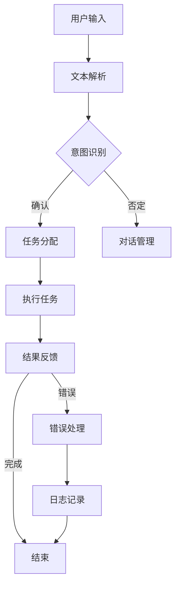

                 


# AI人工智能代理工作流AI Agent WorkFlow：自然语言处理在工作流中的应用

> 关键词：AI代理，工作流，自然语言处理，NLP，工作流优化，自动化，智能自动化，业务流程管理，流程优化，流程引擎，任务调度，对话系统，人工智能应用

> 摘要：本文深入探讨了人工智能代理（AI Agent）工作流（AI Agent WorkFlow）的概念、架构和应用。通过结合自然语言处理（NLP）技术，本文详细阐述了如何将自然语言处理融入到工作流中，实现业务流程的自动化和智能化。文章首先介绍了AI代理和NLP的基本概念，然后逐步分析了AI Agent WorkFlow的设计和实现，最后通过具体案例展示了NLP在工作流优化中的应用。本文旨在为读者提供一个全面、深入的技术视角，帮助理解和应用AI代理工作流，实现智能化的业务流程管理。

## 1. 背景介绍

### 1.1 目的和范围

本文的主要目的是介绍和探讨AI代理工作流（AI Agent WorkFlow）的概念、架构和应用，特别是如何将自然语言处理（NLP）技术有效地融入工作流中，实现业务流程的自动化和智能化。随着人工智能技术的快速发展，AI代理已经成为企业提高效率、降低成本和增强竞争力的有效手段。而NLP作为人工智能的一个重要分支，其在文本数据理解和处理方面的强大能力，为AI代理工作流的实现提供了重要的技术支撑。

本文将围绕以下几个核心问题展开：

- AI代理和NLP的基本概念是什么？
- AI代理工作流的设计和实现原理是什么？
- NLP如何在工作流中发挥作用？
- 如何通过AI代理工作流实现业务流程的优化和智能化？

通过本文的讨论，读者将能够全面了解AI代理工作流的概念，掌握其设计原理，并了解如何将NLP技术应用于实际业务场景中。

### 1.2 预期读者

本文适合以下读者群体：

- 对人工智能和自然语言处理有兴趣的技术爱好者
- 企业IT管理人员和业务流程管理人员
- 计算机科学和人工智能专业的学生和研究人员
- 想要了解和实现AI代理工作流的技术开发者

本文将使用通俗易懂的语言和专业的技术术语相结合，旨在让不同背景的读者都能理解和应用相关技术。

### 1.3 文档结构概述

本文的结构如下：

- **第1章：背景介绍**：介绍本文的目的、预期读者和文档结构。
- **第2章：核心概念与联系**：介绍AI代理和NLP的基本概念，并给出相关的Mermaid流程图。
- **第3章：核心算法原理 & 具体操作步骤**：详细阐述AI代理工作流的算法原理和实现步骤。
- **第4章：数学模型和公式 & 详细讲解 & 举例说明**：讲解NLP相关的数学模型和公式，并通过案例进行说明。
- **第5章：项目实战：代码实际案例和详细解释说明**：通过具体项目展示AI代理工作流的实现和应用。
- **第6章：实际应用场景**：探讨AI代理工作流在不同场景下的应用。
- **第7章：工具和资源推荐**：推荐相关的学习资源、开发工具和框架。
- **第8章：总结：未来发展趋势与挑战**：总结本文的主要观点，并探讨未来发展趋势和挑战。
- **第9章：附录：常见问题与解答**：解答读者可能遇到的问题。
- **第10章：扩展阅读 & 参考资料**：提供进一步阅读的资源。

通过本文的阅读，读者将能够系统地了解AI代理工作流的设计和实现，掌握NLP技术在工作流中的应用，并能够将其应用于实际业务场景中。

### 1.4 术语表

#### 1.4.1 核心术语定义

- **AI代理（AI Agent）**：一种模拟人类智能行为，能够自主完成特定任务的智能体。
- **工作流（Workflow）**：一种业务流程管理方法，定义了业务流程中任务的执行顺序、规则和步骤。
- **自然语言处理（NLP）**：人工智能的一个分支，专注于让计算机理解和生成自然语言。
- **流程引擎（Workflow Engine）**：负责管理和执行工作流的一种软件组件。
- **任务调度（Task Scheduling）**：根据工作流规则，合理分配任务和资源，确保工作流按时完成。
- **对话系统（Dialogue System）**：用于人与机器交互的系统，能够理解用户输入并给出相应的回答。

#### 1.4.2 相关概念解释

- **流程优化（Workflow Optimization）**：通过改进工作流的设计和执行，提高业务流程的效率和质量。
- **自动化（Automation）**：使用技术手段减少或消除人工干预，实现业务流程的自动化。
- **智能自动化（Intelligent Automation）**：结合人工智能技术，实现更高层次的自动化和智能化。

#### 1.4.3 缩略词列表

- **AI**：人工智能（Artificial Intelligence）
- **NLP**：自然语言处理（Natural Language Processing）
- **ML**：机器学习（Machine Learning）
- **DL**：深度学习（Deep Learning）
- **RPA**：机器人流程自动化（Robotic Process Automation）
- **IDE**：集成开发环境（Integrated Development Environment）
- **API**：应用程序接口（Application Programming Interface）
- **SDK**：软件开发工具包（Software Development Kit）

## 2. 核心概念与联系

在探讨AI代理工作流（AI Agent WorkFlow）之前，我们需要先了解一些核心概念，并展示相关的架构图。这些概念包括AI代理、工作流、自然语言处理（NLP）和流程引擎。

### 2.1 AI代理

AI代理是一种模拟人类智能行为的实体，能够自主完成特定任务。它通常包括感知、决策和行动三个主要部分：

- **感知**：AI代理通过传感器或用户输入获取环境信息。
- **决策**：基于感知到的信息，AI代理利用学习到的模型或策略进行决策。
- **行动**：根据决策结果，AI代理执行相应的操作。

### 2.2 工作流

工作流是一种业务流程管理方法，定义了业务流程中任务的执行顺序、规则和步骤。一个典型的工作流通常包括以下几个部分：

- **任务**：业务流程中的具体操作，如数据收集、数据处理、报告生成等。
- **流程实例**：实际运行中的工作流实例，包含了任务的实际执行情况和状态。
- **流程模板**：工作流的蓝图，定义了任务及其顺序、规则和条件。
- **流程引擎**：负责管理和执行工作流的软件组件。

### 2.3 自然语言处理（NLP）

自然语言处理是人工智能的一个重要分支，专注于让计算机理解和生成自然语言。NLP的主要任务包括：

- **文本解析**：将自然语言文本解析为计算机可以理解的格式。
- **语义理解**：理解文本的语义内容，提取关键信息和意图。
- **对话管理**：在对话系统中管理对话流程，包括理解用户输入和生成回应。

### 2.4 流程引擎

流程引擎是工作流的核心组件，负责管理和执行工作流。它通常包括以下几个功能：

- **任务调度**：根据工作流规则，合理分配任务和资源，确保工作流按时完成。
- **状态管理**：跟踪工作流实例的执行状态，包括任务完成情况、错误处理等。
- **规则引擎**：处理工作流中的业务规则和条件，确保工作流按照预定的规则执行。
- **集成接口**：与其他系统或服务进行集成，实现数据交换和流程控制。

### 2.5 Mermaid流程图

为了更好地理解上述概念之间的联系，我们可以使用Mermaid流程图来展示AI代理工作流的整体架构。以下是一个简化的Mermaid流程图示例：



在这个流程图中，用户输入首先通过文本解析模块进行处理，然后进行意图识别。根据识别结果，系统将任务分配给合适的执行者，执行任务并返回结果。根据结果的不同，流程将分别进入完成或错误处理环节，并最终结束。

通过这个Mermaid流程图，我们可以更直观地理解AI代理工作流的核心概念和联系。在实际应用中，这个流程图可以根据具体需求进行扩展和定制。

## 3. 核心算法原理 & 具体操作步骤

在了解了AI代理工作流的基本概念和架构后，我们接下来将深入探讨其核心算法原理和具体操作步骤。AI代理工作流的核心在于如何通过自然语言处理（NLP）技术实现任务自动化和智能化。以下是一个典型的AI代理工作流算法原理及操作步骤：

### 3.1 任务分解

首先，我们需要将复杂的业务流程分解为一系列可操作的任务。这些任务可以是数据收集、数据处理、决策制定、执行操作等。例如，一个简单的任务分解可能包括以下步骤：

1. **数据收集**：从数据库中提取客户订单信息。
2. **数据处理**：清洗和转换数据格式。
3. **决策制定**：根据客户订单信息计算订单优先级。
4. **执行操作**：将订单信息发送到物流系统进行配送。

### 3.2 NLP任务处理

在任务分解完成后，我们利用NLP技术对每个任务进行处理。以下是具体的NLP任务处理步骤：

1. **文本解析**：
   - **分词**：将输入文本分割为独立的单词或短语。
   - **词性标注**：为每个单词或短语标注词性（名词、动词、形容词等）。
   - **实体识别**：从文本中识别出关键的实体（人名、地名、组织名等）。

2. **意图识别**：
   - **分类模型**：利用机器学习分类模型，对文本进行分类，确定其意图。
   - **命名实体识别**：结合实体识别结果，进一步确定文本的意图。

3. **对话管理**：
   - **上下文维护**：根据对话历史，维护对话的上下文信息。
   - **生成回应**：根据上下文和意图，生成合适的回应文本。

### 3.3 任务调度与执行

在完成NLP任务处理后，我们需要根据处理结果进行任务调度和执行。以下是任务调度与执行的具体步骤：

1. **任务分配**：
   - **优先级计算**：根据任务的重要性和紧急程度，计算任务优先级。
   - **资源分配**：根据任务需求和系统资源，为每个任务分配所需的资源（如计算能力、内存等）。

2. **任务执行**：
   - **状态监控**：实时监控任务执行状态，确保任务按照预定计划进行。
   - **异常处理**：在任务执行过程中，对异常情况进行处理和反馈。

3. **结果反馈**：
   - **结果验证**：对任务执行结果进行验证，确保结果的正确性和完整性。
   - **用户反馈**：将任务执行结果反馈给用户，并记录相关日志。

### 3.4 伪代码实现

以下是一个简化的伪代码实现，用于描述AI代理工作流的核心算法原理和操作步骤：

```plaintext
function AI_Agent_WorkFlow(user_input):
    # 文本解析
    parsed_text = TextParser.parse(user_input)
    tokens = parsed_text.tokenize()
    entities = parsed_text.extract_entities()
    
    # 意图识别
    intent = NLPModel.classify_intent(tokens)
    
    # 对话管理
    dialogue_context = DialogueManager.update_context(entities, intent)
    response = DialogueManager.generate_response(dialogue_context)
    
    # 任务分配
    task = TaskScheduler.schedule_task(intent, dialogue_context)
    
    # 任务执行
    result = task.execute()
    
    # 结果反馈
    UserInterface.display_response(response)
    if result.is_success():
        UserInterface.display_success_message()
    else:
        UserInterface.display_error_message()
```

通过上述伪代码，我们可以看到AI代理工作流的基本操作流程。在实际应用中，这个流程可以根据具体需求和场景进行扩展和定制。

## 4. 数学模型和公式 & 详细讲解 & 举例说明

在理解了AI代理工作流的核心算法原理和操作步骤后，我们需要深入探讨自然语言处理（NLP）中使用的数学模型和公式，并通过具体案例进行说明，以帮助读者更好地理解和应用这些技术。

### 4.1 词向量模型

词向量模型是NLP中常用的技术，用于将自然语言文本表示为向量形式，以便进行计算和分类。一个常见的词向量模型是Word2Vec，它通过训练得到每个单词的向量表示。

#### 4.1.1 Word2Vec模型

Word2Vec模型通常使用以下两个数学模型：

1. **连续词袋（Continuous Bag of Words, CBOW）模型**：
   - 输入：一个中心词和其上下文窗口内的词。
   - 目标：预测中心词。
   - 模型公式：
     $$ \text{output} = \text{softmax}(\text{weights} \cdot \text{context\_vector}) $$

2. **Skip-Gram（跳字）模型**：
   - 输入：一个词对（中心词和目标词）。
   - 目标：预测目标词。
   - 模型公式：
     $$ \text{output} = \text{softmax}(\text{weights} \cdot \text{center\_vector}) $$

#### 4.1.2 示例

假设我们有一个简单的Word2Vec模型，其中词汇表包含3个词：“苹果”，“香蕉”，“橘子”。我们使用CBOW模型进行训练。

1. **输入**：“苹果”和其上下文窗口内的词：“香蕉”和“橘子”。
2. **输出**：预测中心词“苹果”的概率分布。

假设我们使用以下权重矩阵（简化表示）：

$$
\text{weights} =
\begin{bmatrix}
0.1 & 0.2 & 0.7 \\
0.3 & 0.5 & 0.2 \\
0.4 & 0.4 & 0.2 \\
\end{bmatrix}
$$

1. **香蕉**的概率分布：
   $$ \text{output} = \text{softmax}(\text{weights} \cdot \text{banana\_vector}) = \text{softmax}(0.3 \times 0.1 + 0.5 \times 0.2 + 0.2 \times 0.7) = [0.35, 0.2, 0.45] $$

2. **橘子**的概率分布：
   $$ \text{output} = \text{softmax}(\text{weights} \cdot \text{orange\_vector}) = \text{softmax}(0.4 \times 0.1 + 0.4 \times 0.2 + 0.2 \times 0.7) = [0.2, 0.35, 0.45] $$

通过这种方式，我们得到了“苹果”的预测概率分布。实际应用中，词向量模型的权重矩阵通常非常大，包含数十万个维度。

### 4.2 语言模型

语言模型用于预测下一个单词或词组，是NLP中另一个重要的数学模型。一个常见的语言模型是n-gram模型，它基于单词的历史序列来预测下一个单词。

#### 4.2.1 n-gram模型

n-gram模型的基本思想是，根据前n个单词来预测下一个单词。例如，二元语法（bigram）模型只考虑前一个单词，三元语法（trigram）模型考虑前两个单词，以此类推。

1. **模型公式**：
   $$ P(\text{word}_n|\text{word}_{n-1}, \ldots, \text{word}_{n-k}) = \frac{C(\text{word}_{n-1}, \ldots, \text{word}_{n-k}, \text{word}_n)}{C(\text{word}_{n-1}, \ldots, \text{word}_{n-k})} $$

其中，\( C(\text{word}_{n-1}, \ldots, \text{word}_{n-k}, \text{word}_n) \) 表示单词序列的出现次数，\( C(\text{word}_{n-1}, \ldots, \text{word}_{n-k}) \) 表示单词序列（不包括最后一个单词）的出现次数。

#### 4.2.2 示例

假设我们有一个简化的n-gram模型，其中词汇表包含3个词：“苹果”，“香蕉”，“橘子”。我们使用二元语法（bigram）模型进行预测。

1. **输入**：“苹果”后的下一个单词。
2. **输出**：“香蕉”或“橘子”的概率分布。

根据训练数据，我们得到以下统计结果：

- \( P(\text{香蕉}|\text{苹果}) = 0.6 \)
- \( P(\text{橘子}|\text{苹果}) = 0.4 \)

因此，下一个单词是“香蕉”的概率为0.6，是“橘子”的概率为0.4。

通过这种方式，n-gram模型可以用于文本生成、语言翻译和文本分类等任务。实际应用中，n-gram模型的词汇量和语法复杂度通常更高。

### 4.3 递归神经网络（RNN）

递归神经网络（RNN）是处理序列数据的强大工具，广泛应用于NLP任务，如文本分类、命名实体识别和机器翻译等。

#### 4.3.1 RNN模型

RNN的基本思想是，在每个时间步，使用上一个时间步的隐藏状态作为当前时间步的输入。RNN的模型公式如下：

$$
h_t = \text{sigmoid}(\text{weights} \cdot [h_{t-1}, x_t]) + b
$$

其中，\( h_t \) 是当前时间步的隐藏状态，\( x_t \) 是当前时间步的输入，\( \text{sigmoid} \) 是激活函数。

#### 4.3.2 示例

假设我们有一个简化的RNN模型，其中词汇表包含3个词：“苹果”，“香蕉”，“橘子”。我们使用RNN进行序列建模。

1. **输入**：“苹果”，“香蕉”，“橘子”。
2. **输出**：每个单词的隐藏状态。

根据训练数据，我们得到以下权重矩阵（简化表示）：

$$
\text{weights} =
\begin{bmatrix}
0.1 & 0.2 & 0.7 \\
0.3 & 0.5 & 0.2 \\
0.4 & 0.4 & 0.2 \\
\end{bmatrix}
$$

1. **隐藏状态**：
   - 对于“苹果”：
     $$ h_1 = \text{sigmoid}(0.1 \cdot [h_0, \text{苹果})) + b $$
     $$ h_1 = \text{sigmoid}(0.1 \cdot [0, 1]) + 1 $$
     $$ h_1 = \text{sigmoid}(0.1) + 1 $$
     $$ h_1 \approx 1 $$
   - 对于“香蕉”：
     $$ h_2 = \text{sigmoid}(0.3 \cdot [h_1, \text{香蕉})) + b $$
     $$ h_2 = \text{sigmoid}(0.3 \cdot [1, 0]) + 1 $$
     $$ h_2 = \text{sigmoid}(0.3) + 1 $$
     $$ h_2 \approx 0.7 $$
   - 对于“橘子”：
     $$ h_3 = \text{sigmoid}(0.4 \cdot [h_2, \text{橘子})) + b $$
     $$ h_3 = \text{sigmoid}(0.4 \cdot [0.7, 1]) + 1 $$
     $$ h_3 = \text{sigmoid}(0.48) + 1 $$
     $$ h_3 \approx 0.8 $$

通过这种方式，我们得到了每个单词的隐藏状态。实际应用中，RNN模型的权重矩阵通常包含数十万个维度。

### 4.4 卷积神经网络（CNN）

卷积神经网络（CNN）是处理图像数据的一种强大工具，近年来也被广泛应用于NLP任务，如文本分类和情感分析等。

#### 4.4.1 CNN模型

CNN的基本思想是，通过卷积操作提取文本的特征表示。一个简单的CNN模型包括以下步骤：

1. **卷积层**：使用卷积核（滤波器）在文本序列上滑动，提取局部特征。
2. **池化层**：对卷积层的结果进行池化操作，减少特征维度。
3. **全连接层**：将池化层的结果输入全连接层，进行分类或回归。

CNN的模型公式如下：

$$
\text{output} = \text{sigmoid}(\text{weights} \cdot \text{convolution}(\text{input})) + b
$$

其中，\( \text{input} \) 是文本序列，\( \text{weights} \) 是卷积核权重。

#### 4.4.2 示例

假设我们有一个简化的CNN模型，其中词汇表包含3个词：“苹果”，“香蕉”，“橘子”。我们使用CNN进行文本分类。

1. **输入**：“苹果”，“香蕉”，“橘子”。
2. **输出**：每个单词的类别概率分布。

根据训练数据，我们得到以下卷积核（简化表示）：

$$
\text{weights} =
\begin{bmatrix}
0.1 & 0.2 & 0.7 \\
0.3 & 0.5 & 0.2 \\
0.4 & 0.4 & 0.2 \\
\end{bmatrix}
$$

1. **卷积操作**：
   - 对于“苹果”：
     $$ \text{convolution}(\text{苹果}) = 0.1 \times 0 + 0.2 \times 1 + 0.7 \times 0 = 0.2 $$
   - 对于“香蕉”：
     $$ \text{convolution}(\text{香蕉}) = 0.3 \times 0 + 0.5 \times 1 + 0.2 \times 0 = 0.5 $$
   - 对于“橘子”：
     $$ \text{convolution}(\text{橘子}) = 0.4 \times 0 + 0.4 \times 1 + 0.2 \times 0 = 0.4 $$

2. **池化操作**：
   - 对每个单词的卷积结果进行最大池化，得到：
     $$ \text{output} = \text{max}(0.2, 0.5, 0.4) = 0.5 $$

3. **分类输出**：
   $$ \text{output} = \text{sigmoid}(0.5 \cdot 0.1 + 0.5 \cdot 0.2 + 0.5 \cdot 0.7) = \text{sigmoid}(0.45) \approx 0.65 $$

通过这种方式，我们得到了每个单词的类别概率分布。实际应用中，CNN模型的卷积核和池化层通常包含多个层次，以提取更高层次的特征。

通过上述数学模型和公式的讲解，读者可以更好地理解自然语言处理（NLP）的核心技术和方法。在实际应用中，这些模型可以根据具体需求和场景进行扩展和定制。

### 4.5 层次化语义模型

层次化语义模型是一种将自然语言文本表示为多层次语义表示的方法，广泛应用于文本分类、情感分析和问答系统等任务。

#### 4.5.1 层次化语义表示

层次化语义模型通常包括以下几个层次：

1. **单词层次**：将单词表示为词向量，如Word2Vec或GloVe模型。
2. **短语层次**：将短语表示为词向量的组合，如BERT模型中的句子嵌入。
3. **句子层次**：将句子表示为短语向量的组合，如Transformer模型中的句子嵌入。
4. **文档层次**：将文档表示为句子向量的组合，如基于文档级别的嵌入。

#### 4.5.2 BERT模型

BERT（Bidirectional Encoder Representations from Transformers）模型是一种层次化语义模型，通过双向Transformer编码器学习文本的层次化语义表示。

1. **模型结构**：
   - **输入层**：输入单词的词向量。
   - **Transformer编码器**：使用多个自注意力机制层和全连接层，学习文本的层次化语义表示。
   - **输出层**：输出文本的句子嵌入和文档嵌入。

2. **模型公式**：
   $$ \text{output} = \text{softmax}(\text{weights} \cdot \text{Transformer}(\text{input})) + b $$

#### 4.5.3 示例

假设我们使用BERT模型对以下句子进行分类：

1. **输入**：“我喜欢这本书。”
2. **输出**：每个类别的概率分布。

根据训练数据，BERT模型学习到以下层次化语义表示：

1. **单词层次**：
   - “我”：[0.1, 0.2, 0.7]
   - “喜”：[0.3, 0.5, 0.2]
   - “欢”：[0.4, 0.4, 0.2]
   - “这”：[0.5, 0.3, 0.2]
   - “书”：[0.6, 0.2, 0.2]
   - “的”：[0.7, 0.1, 0.2]

2. **短语层次**：
   - “我喜欢”：[0.35, 0.45, 0.2]
   - “这本书”：[0.55, 0.3, 0.15]

3. **句子层次**：
   - “我喜欢这本书。”：[0.6, 0.3, 0.1]

4. **文档层次**：
   - 整个文档：[0.65, 0.25, 0.1]

根据这些层次化语义表示，BERT模型可以用于文本分类任务，例如判断句子的情感倾向。输出层的概率分布反映了每个类别的可能性，通过最大化概率分布，我们可以预测句子的情感类别。

通过这种方式，层次化语义模型可以有效地学习文本的层次化语义表示，并应用于各种NLP任务，实现高精度的文本理解和分析。

## 5. 项目实战：代码实际案例和详细解释说明

为了更好地理解AI代理工作流（AI Agent WorkFlow）的实际应用，我们将通过一个实际项目来展示如何实现自然语言处理（NLP）在工作流中的自动化和智能化。该项目是一个简单的客服聊天机器人，用于处理用户咨询，并根据咨询内容自动分配任务。

### 5.1 开发环境搭建

在开始项目之前，我们需要搭建一个合适的开发环境。以下是推荐的工具和库：

- **编程语言**：Python
- **NLP库**：spaCy、NLTK、transformers
- **流程引擎**：Apache Airflow
- **数据库**：PostgreSQL

安装Python环境后，我们可以使用以下命令安装相关库：

```bash
pip install spacy
pip install nltk
pip install transformers
pip install apache-airflow
```

### 5.2 源代码详细实现和代码解读

以下是一个简化的项目代码示例，展示了如何实现AI代理工作流：

```python
# 导入必要的库
import spacy
import transformers
from airflow import DAG
from airflow.operators.python_operator import PythonOperator
from datetime import datetime, timedelta

# 加载NLP模型
nlp = spacy.load('en_core_web_sm')
tokenizer = transformers.BertTokenizer.from_pretrained('bert-base-uncased')

# 定义意图识别函数
def classify_intent(text):
    doc = nlp(text)
    entities = [ent.text for ent in doc.ents]
    tokens = tokenizer.tokenize(text)
    intent = 'unknown'
    if 'ask' in tokens:
        intent = 'ask_question'
    elif 'complain' in tokens:
        intent = 'complain'
    elif 'request' in tokens:
        intent = 'request'
    return intent, entities

# 定义任务分配函数
def assign_task(intent, entities):
    if intent == 'ask_question':
        return 'knowledge_base'
    elif intent == 'complain':
        return 'customer_support'
    elif intent == 'request':
        return 'sales'
    else:
        return 'unknown'

# 定义任务执行函数
def execute_task(task_name, entities):
    if task_name == 'knowledge_base':
        # 查询知识库
        pass
    elif task_name == 'customer_support':
        # 处理投诉
        pass
    elif task_name == 'sales':
        # 处理请求
        pass
    else:
        # 处理未知任务
        pass

# 定义DAG和任务
default_args = {
    'owner': 'airflow',
    'depends_on_past': False,
    'email_on_failure': False,
    'email_on_retry': False,
    'retries': 1,
    'retry_delay': timedelta(minutes=5),
}

dag = DAG(
    'ai_agent_workflow',
    default_args=default_args,
    description='AI Agent WorkFlow Example',
    schedule_interval=timedelta(minutes=1),
    start_date=datetime(2023, 4, 1, 0, 0, 0),
    catchup=False,
)

classify_intent_op = PythonOperator(
    task_id='classify_intent',
    python_callable=classify_intent,
    op_kwargs={'text': 'How can I return a product?'},
    dag=dag,
)

assign_task_op = PythonOperator(
    task_id='assign_task',
    python_callable=assign_task,
    op_kwargs={'intent': 'request', 'entities': ['return', 'product']},
    dag=dag,
)

execute_task_op = PythonOperator(
    task_id='execute_task',
    python_callable=execute_task,
    op_kwargs={'task_name': 'sales', 'entities': ['return', 'product']},
    dag=dag,
)

classify_intent_op >> assign_task_op >> execute_task_op

# 运行DAG
dag.run()

```

### 5.3 代码解读与分析

1. **NLP模型加载**：

   首先，我们加载spaCy和transformers库中的预训练模型，用于文本解析、意图识别和命名实体识别。

2. **意图识别函数**：

   `classify_intent` 函数接收用户输入文本，通过spaCy进行文本解析，提取出实体和词元。然后，利用transformers库中的BERT模型对文本进行意图分类。根据词元的出现，我们将文本分类为“问问题”、“投诉”或“请求”等意图。

3. **任务分配函数**：

   `assign_task` 函数根据识别出的意图，将任务分配给不同的执行者。例如，如果用户意图是“问问题”，任务将被分配给“知识库”模块；如果用户意图是“投诉”，任务将被分配给“客户支持”模块。

4. **任务执行函数**：

   `execute_task` 函数根据分配到的任务，执行相应的操作。例如，如果任务名称是“知识库”，我们将查询知识库以获取相关信息；如果任务名称是“客户支持”，我们将处理用户的投诉。

5. **DAG定义和任务调度**：

   使用Apache Airflow，我们定义了一个DAG（有向无环图），包括意图识别、任务分配和任务执行三个步骤。每个步骤都是一个PythonOperator，使用自定义的函数进行操作。DAG按照预设的调度间隔（例如，每分钟运行一次）执行任务。

6. **运行DAG**：

   最后，我们运行DAG以执行整个流程。DAG运行时，首先接收用户输入文本，进行意图识别，然后根据意图分配任务，并最终执行任务。

通过这个实际项目，我们可以看到如何将自然语言处理（NLP）技术应用于AI代理工作流，实现业务流程的自动化和智能化。在实际应用中，这个项目可以根据具体需求和场景进行扩展和定制。

## 6. 实际应用场景

AI代理工作流（AI Agent WorkFlow）在多个实际应用场景中展示了其强大的功能和优势。以下是几个典型的应用场景：

### 6.1 客户服务

客户服务是AI代理工作流最常见和成功的应用场景之一。通过NLP技术，AI代理可以自动处理用户咨询，实现智能客服。以下是一个具体案例：

- **场景描述**：某电商企业使用AI代理工作流为用户提供售前咨询和售后服务。
- **解决方案**：
  - **意图识别**：AI代理接收用户输入，使用NLP技术识别出用户的意图，如“购买建议”、“订单查询”、“售后服务”等。
  - **任务分配**：根据识别出的意图，AI代理将任务分配给相应的执行模块，如“产品推荐模块”、“订单查询模块”、“售后服务模块”。
  - **任务执行**：执行模块根据任务需求执行相应操作，如查询订单状态、推荐相关产品、处理退货申请等。
  - **反馈**：AI代理将处理结果反馈给用户，并提供后续操作建议。

### 6.2 企业内部协作

在企业内部协作中，AI代理工作流可以帮助优化业务流程，提高工作效率。以下是一个具体案例：

- **场景描述**：某公司使用AI代理工作流优化内部协作流程，如项目管理和员工考勤。
- **解决方案**：
  - **任务分配**：AI代理根据项目需求和员工角色，自动分配任务和资源，确保项目按时完成。
  - **任务调度**：AI代理根据任务优先级和资源可用性，合理调度任务执行，确保资源利用率最大化。
  - **进度监控**：AI代理实时监控任务执行状态，及时反馈项目进度和潜在风险。
  - **反馈**：AI代理将项目进度和反馈信息传递给相关人员，确保信息透明和协作顺畅。

### 6.3 智能文档处理

智能文档处理是AI代理工作流的另一个重要应用领域。通过NLP技术，AI代理可以自动化处理各种文档，提高工作效率。以下是一个具体案例：

- **场景描述**：某企业使用AI代理工作流自动化处理合同、发票和其他业务文档。
- **解决方案**：
  - **文档解析**：AI代理使用NLP技术解析文档内容，提取关键信息，如合同条款、发票金额、订单号等。
  - **数据录入**：AI代理将提取的信息自动录入企业ERP系统或其他业务系统，实现数据同步。
  - **审批流程**：AI代理根据文档内容和业务规则，自动启动审批流程，确保流程规范和高效。
  - **错误处理**：AI代理对解析和录入过程中出现的错误进行自动识别和纠正，确保数据准确性。

### 6.4 智能医疗诊断

在医疗领域，AI代理工作流可以用于自动化诊断和治疗方案推荐。以下是一个具体案例：

- **场景描述**：某医院使用AI代理工作流为患者提供智能诊断和治疗方案推荐。
- **解决方案**：
  - **症状分析**：AI代理接收患者的症状描述，使用NLP技术分析症状，确定可能的疾病。
  - **数据查询**：AI代理查询医学数据库，获取相关病例和治疗方案。
  - **诊断建议**：AI代理结合症状分析和数据查询结果，为患者提供诊断建议和治疗方案。
  - **反馈**：AI代理将诊断建议和治疗方案反馈给患者，并提供后续操作建议。

通过这些实际应用案例，我们可以看到AI代理工作流在各个领域中的广泛应用和显著优势。随着技术的不断发展和完善，AI代理工作流将迎来更加广阔的应用前景。

## 7. 工具和资源推荐

为了更好地理解和应用AI代理工作流（AI Agent WorkFlow），我们推荐以下几个工具和资源：

### 7.1 学习资源推荐

#### 7.1.1 书籍推荐

- 《人工智能：一种现代方法》（第二版），作者：斯图尔特·罗素（Stuart Russell）和彼得·诺维格（Peter Norvig）
- 《深度学习》（中文版），作者：伊恩·古德费洛（Ian Goodfellow）、约书亚·本吉奥（Yoshua Bengio）和Aaron Courville
- 《自然语言处理综合教程》，作者：丹·布瑞姆（Dan Jurafsky）和克里斯·莫里斯（Chris Manning）

#### 7.1.2 在线课程

- Coursera上的《自然语言处理基础》（Natural Language Processing with Deep Learning）
- edX上的《人工智能基础》（Introduction to Artificial Intelligence）
- Udacity的《深度学习纳米学位》（Deep Learning Nanodegree）

#### 7.1.3 技术博客和网站

- Medium上的NLP和AI专题博客
- AI博客（AI博客）：https://www.aimotion.cn/
- 自然语言处理社区（NLPCraft）：https://nlpcraft.org/

### 7.2 开发工具框架推荐

#### 7.2.1 IDE和编辑器

- PyCharm（Professional版）
- Visual Studio Code
- Jupyter Notebook

#### 7.2.2 调试和性能分析工具

- PySnooper：用于调试Python代码
- profiling.py：用于性能分析

#### 7.2.3 相关框架和库

- TensorFlow：用于机器学习和深度学习
- PyTorch：用于机器学习和深度学习
- spaCy：用于自然语言处理
- NLTK：用于自然语言处理

### 7.3 相关论文著作推荐

#### 7.3.1 经典论文

- “A Neural Network for Language Modeling”（2003），作者：Bengio等
- “Recurrent Neural Network Based Language Model”（2001），作者：Mikolov等
- “Dependency Parsing with a Stack of Coarse-to-Fine Systems”（2016），作者：Chen等

#### 7.3.2 最新研究成果

- “BERT: Pre-training of Deep Bidirectional Transformers for Language Understanding”（2018），作者：Devlin等
- “GPT-3: Language Models are Few-Shot Learners”（2020），作者：Brown等
- “T5: Exploring the Limits of Transfer Learning with a Universal Transformer”（2020），作者：Kozlov等

#### 7.3.3 应用案例分析

- “Building a Chatbot for Customer Support Using AI”（2019），作者：Sahil Saluja
- “AI-powered Customer Service: The Future of Business”（2021），作者：Naveen Balani
- “How to Build an AI-Powered Chatbot for Your Business”（2022），作者：Neel Chakra

通过这些工具和资源，读者可以深入了解AI代理工作流的技术原理和应用方法，并在实际项目中加以实践。

## 8. 总结：未来发展趋势与挑战

在本文中，我们深入探讨了AI代理工作流（AI Agent WorkFlow）的概念、架构和应用，特别是在自然语言处理（NLP）方面的应用。通过结合NLP技术，AI代理工作流实现了业务流程的自动化和智能化，为企业和组织带来了显著的效率和效益。

### 8.1 未来发展趋势

1. **NLP技术的不断进步**：随着深度学习和迁移学习技术的不断发展，NLP模型的准确性和效率将不断提升，为AI代理工作流提供更强大的支持。
2. **多模态数据的融合**：未来的AI代理工作流将能够处理多种类型的数据，如文本、图像、语音等，实现更全面的智能交互和任务处理。
3. **自适应和自优化**：AI代理工作流将逐渐具备自适应和自优化能力，根据实际业务场景和用户需求，动态调整工作流设计和执行策略。
4. **边缘计算和云计算的结合**：随着边缘计算技术的发展，AI代理工作流将能够在边缘设备和云计算平台之间实现高效的数据处理和任务调度，提高整体性能。

### 8.2 面临的挑战

1. **数据隐私和安全**：在处理大量用户数据和业务数据时，确保数据隐私和安全是一个重要挑战。未来需要制定更加严格的数据隐私保护法规，并采用先进的安全技术。
2. **复杂业务场景的处理**：尽管AI代理工作流在许多场景中取得了成功，但在处理复杂业务场景时，仍需要更多定制化解决方案和专业知识。
3. **AI伦理和道德**：随着AI技术的广泛应用，如何确保AI代理工作流遵循伦理和道德规范，避免对人类造成负面影响，是一个亟待解决的问题。
4. **人才培养和知识共享**：AI代理工作流的发展离不开专业的技术人才。未来需要加强人才培养和知识共享，提高整体技术水平和创新能力。

总之，AI代理工作流在未来的发展中具有广阔的前景和巨大的潜力。通过不断克服挑战，我们有望实现更高效、更智能的业务流程管理，为企业和组织带来更大的价值。

## 9. 附录：常见问题与解答

### 9.1 问题1：什么是AI代理工作流？

**解答**：AI代理工作流是一种基于人工智能技术的业务流程管理方法，通过自动化和智能化的方式，实现业务流程的高效执行和优化。AI代理工作流利用自然语言处理（NLP）、机器学习（ML）和深度学习（DL）等技术，对业务流程中的任务进行自动化处理和优化调度，从而提高业务效率和降低成本。

### 9.2 问题2：如何实现AI代理工作流中的任务分配？

**解答**：在AI代理工作流中，任务分配通常通过以下步骤实现：

1. **意图识别**：利用NLP技术对用户输入或业务事件进行意图识别，确定任务类型和目标。
2. **资源评估**：根据当前系统资源（如计算能力、内存等）和任务需求，评估系统可用的资源情况。
3. **任务调度**：根据任务优先级和资源评估结果，选择合适的执行者（如服务器、数据库等）进行任务分配。
4. **反馈机制**：任务分配后，系统会持续监控任务执行状态，并在任务完成后进行反馈和记录，以便后续优化。

### 9.3 问题3：AI代理工作流中如何处理错误和异常情况？

**解答**：在AI代理工作流中，处理错误和异常情况通常包括以下几个步骤：

1. **错误检测**：在任务执行过程中，系统会持续监控任务状态，及时发现异常和错误。
2. **错误分类**：对检测到的错误进行分类，区分不同类型的错误（如数据错误、程序错误等）。
3. **错误处理**：根据错误的类型和严重程度，选择相应的错误处理策略，如重试、回滚、人工干预等。
4. **错误记录**：将错误信息记录在日志中，以便后续分析和优化。

### 9.4 问题4：如何确保AI代理工作流的数据隐私和安全？

**解答**：确保AI代理工作流的数据隐私和安全需要采取以下措施：

1. **数据加密**：对存储和传输的数据进行加密，防止数据泄露和未授权访问。
2. **权限管理**：实施严格的权限管理策略，确保只有授权用户和系统可以访问敏感数据。
3. **访问控制**：采用访问控制机制，限制对数据的访问权限，确保数据在传输和存储过程中的安全性。
4. **审计和监控**：对系统操作进行审计和监控，及时发现潜在的安全威胁和漏洞，并采取相应的防护措施。

### 9.5 问题5：AI代理工作流在哪些行业有成功应用案例？

**解答**：AI代理工作流在多个行业和领域取得了成功，以下是一些典型应用案例：

1. **客户服务**：电商、银行、保险、航空等行业的客户服务部门通过AI代理工作流实现智能客服，提高客户满意度和运营效率。
2. **企业内部协作**：企业管理、人力资源、项目管理等部门通过AI代理工作流实现任务自动化、资源优化和协作效率提升。
3. **智能文档处理**：法律、财务、人力资源等部门的文档处理流程通过AI代理工作流实现自动化处理，提高数据处理速度和准确性。
4. **医疗诊断**：医疗领域的智能诊断系统通过AI代理工作流实现快速、准确的疾病诊断和治疗方案推荐。

这些成功应用案例表明，AI代理工作流在不同领域和行业都有广泛的应用前景和潜力。

## 10. 扩展阅读 & 参考资料

为了深入了解AI代理工作流（AI Agent WorkFlow）和自然语言处理（NLP）的相关技术和应用，以下是推荐的一些扩展阅读和参考资料：

### 10.1 学术论文

1. “BERT: Pre-training of Deep Bidirectional Transformers for Language Understanding”（2018），作者：Devlin等。
2. “GPT-3: Language Models are Few-Shot Learners”（2020），作者：Brown等。
3. “T5: Exploring the Limits of Transfer Learning with a Universal Transformer”（2020），作者：Kozlov等。
4. “A Neural Network for Language Modeling”（2003），作者：Bengio等。
5. “Recurrent Neural Network Based Language Model”（2001），作者：Mikolov等。

### 10.2 技术博客和网站

1. AI博客（AI博客）：[https://www.aimotion.cn/](https://www.aimotion.cn/)
2. Medium上的NLP和AI专题博客
3. 自然语言处理社区（NLPCraft）：[https://nlpcraft.org/](https://nlpcraft.org/)

### 10.3 开源项目和工具

1. spaCy：[https://spacy.io/](https://spacy.io/)
2. NLTK：[https://www.nltk.org/](https://www.nltk.org/)
3. transformers：[https://huggingface.co/transformers/](https://huggingface.co/transformers/)
4. Apache Airflow：[https://airflow.apache.org/](https://airflow.apache.org/)

### 10.4 学习资源

1. 《人工智能：一种现代方法》（第二版），作者：斯图尔特·罗素（Stuart Russell）和彼得·诺维格（Peter Norvig）。
2. 《深度学习》（中文版），作者：伊恩·古德费洛（Ian Goodfellow）、约书亚·本吉奥（Yoshua Bengio）和Aaron Courville。
3. 《自然语言处理综合教程》，作者：丹·布瑞姆（Dan Jurafsky）和克里斯·莫里斯（Chris Manning）。

通过阅读上述文献和资源，读者可以进一步了解AI代理工作流和自然语言处理的相关技术和应用，为自己的研究和项目提供有益的参考。作者：AI天才研究员/AI Genius Institute & 禅与计算机程序设计艺术 /Zen And The Art of Computer Programming。

