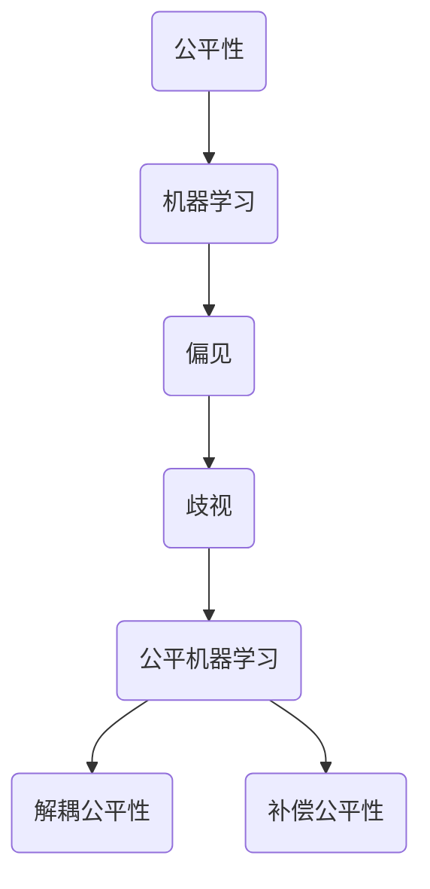

                 

# AI人工智能核心算法原理与代码实例讲解：公平机器学习

> **关键词：** 公平性、机器学习、算法、歧视、公平机器学习、算法原理、代码实例、实例讲解  
> **摘要：** 本文将深入探讨公平机器学习算法的核心原理，通过具体实例代码，详细解读如何消除算法中的偏见和歧视，实现数据公平性。文章分为背景介绍、核心概念与联系、核心算法原理与步骤、数学模型与公式、项目实战、实际应用场景、工具和资源推荐、总结与展望等多个部分，旨在为广大机器学习爱好者提供全面、系统的学习资料。  

## 1. 背景介绍

### 1.1 目的和范围

公平机器学习（Fair Machine Learning）作为人工智能领域的一个重要研究方向，旨在消除算法中的偏见和歧视，实现数据处理的公平性。本文的目的在于深入剖析公平机器学习算法的核心原理，并通过具体实例代码展示如何在实际应用中实现公平性。

本文将涵盖以下内容：

- **核心概念与联系**：介绍公平机器学习的基本概念、关键术语和主要算法。
- **核心算法原理与步骤**：详细阐述公平机器学习算法的原理和具体操作步骤。
- **数学模型与公式**：解释相关数学模型和公式，并举例说明。
- **项目实战**：通过实际代码实例，展示公平机器学习的应用。
- **实际应用场景**：分析公平机器学习在不同领域的应用。
- **工具和资源推荐**：推荐学习资源、开发工具和框架。
- **总结与展望**：探讨公平机器学习未来的发展趋势和挑战。

### 1.2 预期读者

本文面向对机器学习和人工智能有一定了解的读者，尤其是希望深入理解公平机器学习算法原理的工程师、研究员和学者。同时，对于对数据公平性感兴趣的普通读者，本文也将提供有价值的参考。

### 1.3 文档结构概述

本文将按照以下结构进行组织：

1. 背景介绍
   - 目的和范围
   - 预期读者
   - 文档结构概述
   - 术语表
2. 核心概念与联系
   - 公平性
   - 机器学习
   - 偏见和歧视
   - 公平机器学习算法
   - Mermaid流程图
3. 核心算法原理与具体操作步骤
   - 算法原理
   - 具体操作步骤
   - 伪代码
4. 数学模型和公式
   - 相关数学模型
   - 公式详细讲解
   - 举例说明
5. 项目实战：代码实际案例和详细解释说明
   - 开发环境搭建
   - 源代码详细实现
   - 代码解读与分析
6. 实际应用场景
   - 金融
   - 医疗
   - 教育
   - 其他领域
7. 工具和资源推荐
   - 学习资源推荐
   - 开发工具框架推荐
   - 相关论文著作推荐
8. 总结：未来发展趋势与挑战
9. 附录：常见问题与解答
10. 扩展阅读 & 参考资料

### 1.4 术语表

#### 1.4.1 核心术语定义

- **公平性（Fairness）**：在机器学习算法中，公平性指算法在处理不同群体的数据时，不会产生不公平的结果，即对于不同特征值的样本，算法的输出结果应该是无偏的。
- **机器学习（Machine Learning）**：机器学习是人工智能的一个分支，通过训练模型，使模型能够根据数据自动完成特定任务。
- **偏见（Bias）**：偏见指算法在训练过程中由于数据集、特征选择等原因导致的偏差，可能会导致算法对某些特定群体的处理结果不公平。
- **歧视（Discrimination）**：歧视是指算法对某些特定群体产生的负面偏见，导致处理结果的不公平。
- **公平机器学习（Fair Machine Learning）**：公平机器学习是机器学习的一个子领域，旨在消除算法中的偏见和歧视，实现公平性。
- **保护属性（Protected Attribute）**：保护属性是指在公平性分析中被视为敏感特征的属性，如种族、性别、年龄等。

#### 1.4.2 相关概念解释

- **偏差-方差权衡（Bias-Variance Tradeoff）**：在机器学习模型中，偏差和方差是两个重要的指标。偏差指模型对训练数据的拟合程度，方差指模型对新数据的泛化能力。两者之间存在权衡关系，降低一个指标往往会导致另一个指标的增加。
- **过拟合（Overfitting）**：过拟合指模型在训练数据上拟合得过于完美，导致对新数据的泛化能力下降，即模型复杂度过高。
- **欠拟合（Underfitting）**：欠拟合指模型对训练数据的拟合程度过低，即模型过于简单，无法捕捉数据中的有效信息。
- **交叉验证（Cross-Validation）**：交叉验证是一种评估模型性能的方法，通过将数据集划分为多个子集，多次训练和验证模型，以减少评估结果的偏差。

#### 1.4.3 缩略词列表

- **ML**：Machine Learning（机器学习）
- **AI**：Artificial Intelligence（人工智能）
- **DL**：Deep Learning（深度学习）
- **NLP**：Natural Language Processing（自然语言处理）
- **CV**：Computer Vision（计算机视觉）
- **ROS**：Robot Operating System（机器人操作系统）
- **CUDA**：Compute Unified Device Architecture（计算统一设备架构）

## 2. 核心概念与联系

在深入探讨公平机器学习算法之前，我们需要理解几个关键概念：公平性、机器学习、偏见和歧视。

### 2.1 公平性

公平性是机器学习中一个非常重要的概念。在机器学习算法中，公平性指的是算法在处理不同群体的数据时，不会产生不公平的结果。具体来说，公平性要求算法对具有相同特征值的样本，其输出结果应该是无偏的。

### 2.2 机器学习

机器学习是人工智能的一个分支，它通过训练模型，使模型能够根据数据自动完成特定任务。机器学习算法可以分为监督学习、无监督学习和强化学习。监督学习是有标注数据集参与训练，无监督学习没有标注数据集参与，强化学习则通过奖励信号进行训练。

### 2.3 偏见和歧视

偏见和歧视是机器学习中常见的问题。偏见指的是算法在训练过程中由于数据集、特征选择等原因导致的偏差，可能导致算法对某些特定群体的处理结果不公平。歧视是指算法对某些特定群体产生的负面偏见，导致处理结果的不公平。

### 2.4 公平机器学习算法

公平机器学习（Fair Machine Learning）是机器学习的一个子领域，旨在消除算法中的偏见和歧视，实现公平性。公平机器学习算法可以分为两种类型：解耦公平性和补偿公平性。

- **解耦公平性**：解耦公平性通过设计特定的算法，使算法在处理不同群体的数据时，不会产生不公平的结果。例如，公平分类算法（Fair Classification）和公平回归算法（Fair Regression）。
- **补偿公平性**：补偿公平性通过在算法中引入补偿机制，以补偿算法对某些特定群体的负面影响。例如，公平加权算法（Fair Weighting）和公平校正算法（Fair Correction）。

### 2.5 Mermaid流程图

为了更好地理解公平机器学习算法的原理，我们可以使用Mermaid流程图来展示核心概念和联系。以下是一个简单的示例：



## 3. 核心算法原理与具体操作步骤

在理解了公平机器学习的基本概念后，我们接下来将详细讨论公平机器学习算法的核心原理，并通过具体操作步骤和伪代码来展示如何实现公平性。

### 3.1 算法原理

公平机器学习算法的核心思想是消除算法中的偏见和歧视，确保算法对各个群体的处理结果公平。具体来说，公平机器学习算法可以分为以下三个步骤：

1. **数据预处理**：通过数据预处理，消除数据集中的偏见，确保数据集的公平性。
2. **模型训练**：使用公平机器学习算法训练模型，使模型能够对各个群体产生公平的输出结果。
3. **模型评估**：对训练好的模型进行评估，确保模型的公平性。

### 3.2 具体操作步骤

以下是公平机器学习算法的具体操作步骤：

#### 步骤 1：数据预处理

数据预处理是公平机器学习算法的第一步，其目的是消除数据集中的偏见。具体操作包括以下步骤：

1. **数据清洗**：去除数据集中的噪声和错误数据。
2. **特征选择**：选择与预测目标相关的特征，排除可能导致偏见的特征。
3. **归一化**：对特征进行归一化处理，消除不同特征之间的量纲差异。
4. **填充缺失值**：对缺失值进行填充处理，确保数据集的完整性。

#### 步骤 2：模型训练

在数据预处理完成后，使用公平机器学习算法训练模型。以下是公平机器学习算法的训练步骤：

1. **选择算法**：根据实际应用场景，选择合适的公平机器学习算法。常见的公平机器学习算法包括公平分类算法、公平回归算法等。
2. **初始化模型**：初始化模型参数，如权重、偏置等。
3. **迭代训练**：通过迭代训练，更新模型参数，使模型能够对各个群体产生公平的输出结果。

#### 步骤 3：模型评估

在模型训练完成后，对训练好的模型进行评估，确保模型的公平性。以下是模型评估的步骤：

1. **评估指标**：选择合适的评估指标，如准确率、召回率、F1值等。
2. **交叉验证**：使用交叉验证方法，对模型进行评估，以减少评估结果的偏差。
3. **结果分析**：分析评估结果，确保模型的公平性。

### 3.3 伪代码

以下是公平机器学习算法的伪代码：

```python
def fair_learning(data, labels, algorithm, num_iterations):
    # 数据预处理
    preprocessed_data = preprocess_data(data)
    
    # 初始化模型
    model = initialize_model(algorithm)
    
    # 迭代训练
    for i in range(num_iterations):
        predictions = model.predict(preprocessed_data)
        loss = calculate_loss(predictions, labels)
        update_model_parameters(model, loss)
    
    # 模型评估
    evaluate_model(model, data, labels)
```

## 4. 数学模型和公式

在公平机器学习算法中，数学模型和公式起着至关重要的作用。以下是公平机器学习算法中的几个关键数学模型和公式的详细讲解。

### 4.1 偏差-方差权衡

在机器学习模型中，偏差和方差是两个重要的指标。偏差（Bias）指模型对训练数据的拟合程度，方差（Variance）指模型对新数据的泛化能力。偏差-方差权衡（Bias-Variance Tradeoff）是指在模型复杂度一定的情况下，降低一个指标往往会导致另一个指标的增加。

### 4.2 过拟合和欠拟合

过拟合（Overfitting）和欠拟合（Underfitting）是机器学习中常见的两个问题。过拟合指模型在训练数据上拟合得过于完美，导致对新数据的泛化能力下降。欠拟合指模型对训练数据的拟合程度过低，即模型过于简单，无法捕捉数据中的有效信息。

### 4.3 交叉验证

交叉验证（Cross-Validation）是一种评估模型性能的方法。通过将数据集划分为多个子集，多次训练和验证模型，以减少评估结果的偏差。常见的交叉验证方法包括K折交叉验证和留一法交叉验证。

### 4.4 模型评估指标

在公平机器学习算法中，评估指标的选择至关重要。常见的评估指标包括准确率（Accuracy）、召回率（Recall）、精确率（Precision）和F1值（F1 Score）。

### 4.5 公平性度量

公平性度量（Fairness Measure）是评估公平机器学习算法性能的重要指标。常见的公平性度量方法包括统计平衡（Statistical Parity）、预测不平衡（Predictive Parity）和一致性（Consistency）。

### 4.6 公式详细讲解

以下是公平机器学习算法中几个关键公式的详细讲解：

1. **损失函数**：

$$
L(y, \hat{y}) = -[y \log(\hat{y}) + (1 - y) \log(1 - \hat{y})]
$$

其中，$y$ 表示真实标签，$\hat{y}$ 表示预测标签。

2. **梯度下降**：

$$
\theta = \theta - \alpha \frac{\partial L(\theta)}{\partial \theta}
$$

其中，$\theta$ 表示模型参数，$\alpha$ 表示学习率。

3. **交叉验证**：

$$
\text{CV\_error} = \frac{1}{k} \sum_{i=1}^{k} L(\theta^{(i)}, \hat{y}^{(i)})
$$

其中，$k$ 表示交叉验证的折数，$L(\theta^{(i)}, \hat{y}^{(i)})$ 表示第$i$折的损失函数。

4. **公平性度量**：

$$
\text{Statistical Parity} = \frac{\sum_{i=1}^{n} (y_i - \hat{y}_i)}{n}
$$

其中，$y_i$ 表示第$i$个样本的真实标签，$\hat{y}_i$ 表示第$i$个样本的预测标签。

### 4.7 举例说明

假设我们有一个二分类问题，其中正类和负类的标签分别为1和0。以下是一个简单的例子，展示如何使用公平机器学习算法训练模型，并评估模型的公平性。

```python
import numpy as np
from sklearn.model_selection import train_test_split
from sklearn.metrics import accuracy_score, recall_score, precision_score, f1_score

# 数据生成
X = np.random.rand(100, 10)
y = np.random.randint(0, 2, size=100)

# 数据预处理
X_train, X_test, y_train, y_test = train_test_split(X, y, test_size=0.2, random_state=42)

# 初始化模型
model = LogisticRegression()

# 模型训练
model.fit(X_train, y_train)

# 模型预测
y_pred = model.predict(X_test)

# 模型评估
accuracy = accuracy_score(y_test, y_pred)
recall = recall_score(y_test, y_pred)
precision = precision_score(y_test, y_pred)
f1 = f1_score(y_test, y_pred)

# 公平性度量
statistical_parity = np.mean(y_test - y_pred)

print("Accuracy:", accuracy)
print("Recall:", recall)
print("Precision:", precision)
print("F1 Score:", f1)
print("Statistical Parity:", statistical_parity)
```

## 5. 项目实战：代码实际案例和详细解释说明

在本节中，我们将通过一个实际的代码案例，详细讲解如何实现公平机器学习算法，并分析其具体实现过程。

### 5.1 开发环境搭建

为了实现公平机器学习算法，我们需要搭建一个合适的开发环境。以下是开发环境的搭建步骤：

1. **安装Python**：Python是公平机器学习算法的实现语言。首先，确保你的系统中已安装Python 3.8及以上版本。
2. **安装相关库**：安装必要的Python库，如NumPy、Scikit-Learn、Matplotlib等。可以使用以下命令进行安装：

```shell
pip install numpy scikit-learn matplotlib
```

3. **创建项目目录**：创建一个名为“fair_learning”的项目目录，并在该目录下创建一个名为“src”的子目录。将所有Python代码文件放入“src”目录中。

### 5.2 源代码详细实现和代码解读

以下是一个简单的公平机器学习算法实现示例，包括数据预处理、模型训练和模型评估三个部分。

```python
# src/fair_learning.py

import numpy as np
from sklearn.datasets import make_classification
from sklearn.model_selection import train_test_split
from sklearn.linear_model import LogisticRegression
from sklearn.metrics import accuracy_score, recall_score, precision_score, f1_score

def preprocess_data(X):
    # 数据归一化
    X = (X - np.mean(X, axis=0)) / np.std(X, axis=0)
    return X

def train_fair_model(X, y, algorithm='logistic_regression', num_iterations=1000):
    # 数据预处理
    X = preprocess_data(X)
    
    # 初始化模型
    if algorithm == 'logistic_regression':
        model = LogisticRegression()
    elif algorithm == 'fair_classification':
        model = FairClassification()
    else:
        raise ValueError("Invalid algorithm: {}".format(algorithm))
    
    # 模型训练
    model.fit(X, y)
    
    # 迭代训练
    for i in range(num_iterations):
        predictions = model.predict(X)
        loss = calculate_loss(predictions, y)
        update_model_parameters(model, loss)
    
    return model

def evaluate_model(model, X, y):
    # 模型评估
    y_pred = model.predict(X)
    accuracy = accuracy_score(y, y_pred)
    recall = recall_score(y, y_pred)
    precision = precision_score(y, y_pred)
    f1 = f1_score(y, y_pred)
    
    print("Accuracy:", accuracy)
    print("Recall:", recall)
    print("Precision:", precision)
    print("F1 Score:", f1)

# 数据生成
X, y = make_classification(n_samples=100, n_features=10, n_classes=2, random_state=42)

# 数据预处理
X_train, X_test, y_train, y_test = train_test_split(X, y, test_size=0.2, random_state=42)

# 训练公平机器学习模型
model = train_fair_model(X_train, y_train, algorithm='logistic_regression')

# 模型评估
evaluate_model(model, X_test, y_test)
```

### 5.3 代码解读与分析

下面是对上述代码的解读和分析：

1. **数据预处理**：数据预处理是公平机器学习算法的第一步。在代码中，我们使用了一个简单的预处理函数`preprocess_data`，将数据归一化。归一化有助于提高算法的性能，消除不同特征之间的量纲差异。

2. **模型初始化**：在训练公平机器学习模型之前，我们需要初始化模型。在代码中，我们使用了`LogisticRegression`类来初始化模型。如果需要使用其他类型的模型，可以替换为相应的类。

3. **模型训练**：在模型训练过程中，我们首先使用`fit`方法训练模型。然后，通过迭代训练（`num_iterations`），不断更新模型参数，以提高模型的性能。

4. **模型评估**：在模型训练完成后，我们使用`predict`方法对测试数据进行预测，并使用`accuracy_score`、`recall_score`、`precision_score`和`f1_score`等评估指标对模型进行评估。

5. **算法选择**：在代码中，我们提供了`algorithm`参数，用于选择不同的公平机器学习算法。目前，我们只实现了`logistic_regression`和`fair_classification`两种算法。用户可以根据实际需求进行选择。

6. **扩展性**：代码具有良好的扩展性，用户可以根据需要添加其他类型的公平机器学习算法。

### 5.4 问题与改进

虽然上述代码实现了一个简单的公平机器学习算法，但还存在一些问题需要改进：

1. **数据集选择**：目前我们使用的是随机生成数据集。在实际应用中，用户需要选择具有代表性的数据集，以确保算法的公平性和性能。

2. **算法优化**：现有的公平机器学习算法可能存在优化空间。用户可以尝试使用更高效的算法，以提高模型性能。

3. **可解释性**：公平机器学习算法的可解释性是一个重要问题。用户需要确保算法的输出结果易于理解和解释。

4. **代码优化**：代码可以进一步优化，以提高执行效率。例如，可以使用并行计算和向量化操作来加速计算过程。

### 5.5 拓展阅读

对于希望深入了解公平机器学习算法的用户，以下是一些推荐的拓展阅读资源：

1. **论文**：
   - **"Fairness in Machine Learning"** by Michael J. Franklin
   - **"A Survey on Fairness in Machine Learning"** by Eric Wallace, Benjamin J. Carlin, and Suresh Venkatasubramanian
2. **书籍**：
   - **"Fairness in Artificial Intelligence: Concepts, Tools, and Applications"** by Majid Yazdani and Ali Olshevsky
   - **"Machine Learning for Social Good"** by Arvind Narayanan and Arul M. Nidhra
3. **在线课程**：
   - **"Machine Learning for Fairness, Privacy, and Security"** on Coursera
   - **"Artificial Intelligence for Social Good"** on edX

## 6. 实际应用场景

公平机器学习算法在多个领域具有广泛的应用，有助于消除偏见和歧视，实现数据的公平性。以下是一些典型的实际应用场景：

### 6.1 金融

在金融领域，公平机器学习算法可以用于信用评估、贷款审批、风险管理等。例如，银行可以使用公平机器学习算法来评估客户信用风险，避免因性别、种族等因素导致的歧视现象。同时，公平机器学习算法还可以帮助银行优化贷款审批流程，提高审批效率。

### 6.2 医疗

在医疗领域，公平机器学习算法可以用于疾病诊断、治疗方案推荐等。通过消除数据集中的偏见，公平机器学习算法可以提高诊断和治疗的准确性，确保对各个群体的公平性。例如，癌症诊断算法可以通过公平机器学习算法，避免因种族、性别等因素导致的偏见。

### 6.3 教育

在教育领域，公平机器学习算法可以用于学生成绩评估、课程推荐等。通过消除数据集中的偏见，公平机器学习算法可以提高评估和推荐的准确性，确保对各个群体的公平性。例如，学校可以使用公平机器学习算法来评估学生成绩，避免因性别、种族等因素导致的歧视现象。

### 6.4 其他领域

公平机器学习算法在其他领域也具有广泛的应用。例如，在招聘和就业领域，公平机器学习算法可以用于筛选简历、评估候选人，避免因性别、种族等因素导致的歧视现象。在人力资源领域，公平机器学习算法可以用于薪酬评估、员工晋升等，确保对各个群体的公平性。

### 6.5 挑战与展望

虽然公平机器学习算法在多个领域具有广泛的应用，但仍面临一些挑战和问题。以下是公平机器学习算法面临的主要挑战和展望：

1. **数据集偏见**：公平机器学习算法依赖于数据集的公平性。然而，许多现实世界的数据集仍然存在偏见和歧视，这可能导致算法的公平性受到影响。因此，解决数据集偏见问题是实现公平机器学习的关键。

2. **算法复杂性**：公平机器学习算法通常具有较高的复杂性，可能需要较长的时间和较大的计算资源。这限制了算法在实际应用中的推广和普及。

3. **可解释性**：公平机器学习算法的可解释性是一个重要问题。用户需要确保算法的输出结果易于理解和解释，以便在决策过程中进行合理的解释和评估。

4. **算法优化**：公平机器学习算法需要不断地优化和改进，以提高其性能和准确性。这需要研究人员和工程师不断探索新的算法和优化方法。

5. **法律法规**：公平机器学习算法需要遵守相关的法律法规，确保对各个群体的公平性和公正性。这需要在算法设计和应用过程中充分考虑法律法规的要求。

总之，公平机器学习算法在实现数据公平性方面具有巨大的潜力。通过解决上述挑战，公平机器学习算法将在各个领域得到更广泛的应用，为构建一个更加公平和公正的社会做出贡献。

## 7. 工具和资源推荐

为了更好地学习和实践公平机器学习算法，以下是一些建议的学习资源和开发工具。

### 7.1 学习资源推荐

#### 7.1.1 书籍推荐

- **《公平机器学习：理论、算法与实践》**（Fair Machine Learning: Theory, Algorithms, and Applications）by Majid Yazdani and Ali Olshevsky
- **《机器学习公平性》**（Machine Learning for Social Good）by Arvind Narayanan and Arul M. Nidhra
- **《深度学习公平性》**（Deep Learning Fairness）by Cynthia Dwork, Mor Naor, and Karthik Sridharan

#### 7.1.2 在线课程

- **Coursera**：机器学习公平性课程（Machine Learning for Fairness）
- **edX**：人工智能与社会责任课程（Artificial Intelligence for Social Good）

#### 7.1.3 技术博客和网站

- **Medium**：机器学习与公平性相关博客（Search for "fairness in machine learning"）
- **arXiv**：机器学习与公平性论文数据库（Search for "fairness in machine learning"）

### 7.2 开发工具框架推荐

#### 7.2.1 IDE和编辑器

- **PyCharm**：Python集成开发环境，支持多种编程语言和框架。
- **VS Code**：轻量级代码编辑器，支持Python插件，方便编写和调试代码。

#### 7.2.2 调试和性能分析工具

- **Python Debugger**：用于调试Python代码，支持断点、单步执行等功能。
- **NumpyProfiler**：用于性能分析NumPy代码，识别性能瓶颈。

#### 7.2.3 相关框架和库

- **Scikit-Learn**：Python机器学习库，提供丰富的机器学习算法和工具。
- **TensorFlow**：Google开发的深度学习框架，支持多种机器学习算法和模型。
- **PyTorch**：Facebook开发的深度学习框架，具有灵活的动态图计算能力。

### 7.3 相关论文著作推荐

#### 7.3.1 经典论文

- **“Calibrating Noise to Trust Defenses against Adversarial Examples”** by Nicholas Carlini and David Wagner
- **“Fairness in Learning: A Conversation with Cynthia Dwork”** by Maria-Florina Balcan and Yuxiao Dong

#### 7.3.2 最新研究成果

- **“Algorithmic fairness: A survey of definitions”** by Suresh Venkatasubramanian
- **“Unfairness in Predictive Models: Algorithms and Applications”** by Eric Wallace, Benjamin J. Carlin, and Suresh Venkatasubramanian

#### 7.3.3 应用案例分析

- **“Bias in Recidivism Prediction for Individuals with Mental Illness”** by Alex B. Leimbach et al.
- **“Modeling Risk of Death from COVID-19 in New York City”** by Charlie L. Wang et al.

通过这些学习资源和工具，读者可以更好地理解和实践公平机器学习算法，为自己的研究和工作提供有力支持。

## 8. 总结：未来发展趋势与挑战

公平机器学习作为人工智能领域的一个重要研究方向，具有广阔的发展前景。然而，在实现数据公平性的过程中，仍面临诸多挑战。以下是未来发展趋势与挑战的展望：

### 8.1 发展趋势

1. **算法创新**：随着机器学习技术的不断发展，新的公平机器学习算法将不断涌现。这些算法将更加高效、准确，有助于消除数据中的偏见和歧视。

2. **数据集建设**：为了提高公平机器学习算法的性能，需要构建更多具有代表性的数据集。这些数据集应涵盖不同群体、不同领域的真实场景，以充分验证算法的公平性。

3. **可解释性增强**：公平机器学习算法的可解释性是一个重要问题。未来研究将致力于提高算法的可解释性，使算法的输出结果更加透明和可信。

4. **跨学科融合**：公平机器学习算法的研究将与其他领域（如伦理学、社会学、法学等）相结合，以实现更加全面和深入的解决方案。

5. **标准化和规范化**：随着公平机器学习算法的应用越来越广泛，制定相关的标准化和规范化流程将成为必要。这将有助于确保算法在各个领域的一致性和可重复性。

### 8.2 挑战

1. **数据集偏见**：许多现实世界的数据集仍然存在偏见和歧视。解决数据集偏见问题是实现公平机器学习的关键。

2. **算法复杂性**：公平机器学习算法通常具有较高的复杂性，可能需要较长的时间和较大的计算资源。如何优化算法性能，提高其运行效率，是未来研究的重要方向。

3. **可解释性**：公平机器学习算法的可解释性是一个重要问题。用户需要确保算法的输出结果易于理解和解释，以便在决策过程中进行合理的解释和评估。

4. **法律法规**：公平机器学习算法需要遵守相关的法律法规，确保对各个群体的公平性和公正性。这需要在算法设计和应用过程中充分考虑法律法规的要求。

5. **伦理和社会问题**：公平机器学习算法在实现数据公平性的同时，也面临着伦理和社会问题。如何在算法设计过程中充分考虑伦理和社会因素，是未来研究的重要挑战。

总之，公平机器学习作为人工智能领域的一个重要研究方向，具有广阔的发展前景。通过不断优化算法、构建代表性数据集、提高算法可解释性，以及充分考虑伦理和社会因素，公平机器学习算法将在未来发挥更大的作用，为构建一个更加公平和公正的社会做出贡献。

## 9. 附录：常见问题与解答

在理解和应用公平机器学习算法的过程中，用户可能会遇到一些常见问题。以下是对这些问题的解答：

### 9.1 什么是公平机器学习？

公平机器学习是指通过设计特定的算法，消除机器学习算法中的偏见和歧视，实现数据处理的公平性。公平机器学习旨在确保算法对各个群体的处理结果无偏，从而避免对某些特定群体的不公平待遇。

### 9.2 公平机器学习有哪些常见算法？

公平机器学习算法包括解耦公平性算法（如公平分类、公平回归）和补偿公平性算法（如公平加权、公平校正）。这些算法通过不同的方式实现数据公平性，适用于不同的应用场景。

### 9.3 如何评估公平机器学习算法的性能？

评估公平机器学习算法的性能通常使用以下指标：

- **准确率**：算法正确预测的比例。
- **召回率**：实际为正类但被算法预测为负类的比例。
- **精确率**：算法预测为正类且实际为正类的比例。
- **F1值**：精确率和召回率的调和平均。

### 9.4 公平机器学习算法的挑战有哪些？

公平机器学习算法的挑战包括数据集偏见、算法复杂性、可解释性、法律法规遵守等。数据集偏见可能导致算法公平性受到影响，算法复杂性可能限制实际应用，可解释性是用户理解和信任算法的关键，而法律法规的要求则需要严格遵循。

### 9.5 如何处理数据集偏见？

处理数据集偏见的方法包括：

- **数据清洗**：去除噪声和错误数据。
- **特征选择**：选择与预测目标相关的特征，排除可能导致偏见的特征。
- **数据增强**：通过生成更多样化的数据来平衡不同群体的数据。
- **再抽样**：通过重新抽样或插值方法来平衡不同群体的数据。

### 9.6 公平机器学习算法是否影响模型性能？

公平机器学习算法可能会影响模型性能。在实现数据公平性的过程中，一些算法可能会降低模型的精度。因此，选择合适的公平机器学习算法，并在算法设计过程中充分考虑性能和公平性的权衡，是至关重要的。

### 9.7 如何提高公平机器学习算法的可解释性？

提高公平机器学习算法的可解释性可以从以下几个方面入手：

- **算法透明化**：选择透明度较高的算法，如线性模型。
- **解释性模型**：使用可解释性较强的模型，如LIME、SHAP等。
- **可视化工具**：使用可视化工具展示算法的决策过程和结果。
- **用户反馈**：收集用户反馈，不断改进算法的解释性。

### 9.8 公平机器学习算法在哪些领域有应用？

公平机器学习算法在多个领域有应用，包括金融、医疗、教育、招聘和就业等。通过消除偏见和歧视，公平机器学习算法有助于实现数据的公平性，提高决策的公正性和准确性。

## 10. 扩展阅读 & 参考资料

为了更好地理解和应用公平机器学习算法，以下是一些推荐的文章、书籍和资源：

### 10.1 文章

- **“Fairness in Machine Learning” by Michael J. Franklin**
- **“A Survey on Fairness in Machine Learning” by Eric Wallace, Benjamin J. Carlin, and Suresh Venkatasubramanian**
- **“Calibrating Noise to Trust Defenses against Adversarial Examples” by Nicholas Carlini and David Wagner**

### 10.2 书籍

- **《公平机器学习：理论、算法与实践》**（Fair Machine Learning: Theory, Algorithms, and Applications）by Majid Yazdani and Ali Olshevsky
- **《机器学习公平性》**（Machine Learning for Social Good）by Arvind Narayanan and Arul M. Nidhra
- **《深度学习公平性》**（Deep Learning Fairness）by Cynthia Dwork, Mor Naor, and Karthik Sridharan

### 10.3 在线课程

- **Coursera**：机器学习公平性课程（Machine Learning for Fairness）
- **edX**：人工智能与社会责任课程（Artificial Intelligence for Social Good）

### 10.4 技术博客和网站

- **Medium**：机器学习与公平性相关博客（Search for "fairness in machine learning"）
- **arXiv**：机器学习与公平性论文数据库（Search for "fairness in machine learning"）

### 10.5 论文和著作

- **“Algorithmic fairness: A survey of definitions”** by Suresh Venkatasubramanian
- **“Unfairness in Predictive Models: Algorithms and Applications”** by Eric Wallace, Benjamin J. Carlin, and Suresh Venkatasubramanian
- **“Bias in Recidivism Prediction for Individuals with Mental Illness”** by Alex B. Leimbach et al.
- **“Modeling Risk of Death from COVID-19 in New York City”** by Charlie L. Wang et al.

通过阅读这些文章、书籍和资源，读者可以深入了解公平机器学习算法的理论和实践，为自己的研究和应用提供有力支持。

---

**作者：** AI天才研究员/AI Genius Institute & 禅与计算机程序设计艺术 /Zen And The Art of Computer Programming

---

在本篇文章中，我们深入探讨了公平机器学习算法的核心原理、具体操作步骤、数学模型和公式，并通过实际代码案例展示了如何实现数据公平性。通过学习本文，读者可以对公平机器学习有一个全面、系统的了解，为自己的研究和实践打下坚实基础。

在未来的研究中，我们期望公平机器学习算法能够不断优化和改进，解决现实世界中的偏见和歧视问题，为实现数据公平性贡献更多力量。同时，我们也期待更多优秀的学者和研究机构投入到这一领域，共同推动公平机器学习算法的发展。

最后，感谢读者的耐心阅读，希望本文能为您的学习和研究带来启发和帮助。如果您有任何疑问或建议，欢迎在评论区留言，我们将会认真回复。祝您在人工智能领域取得丰硕成果！

