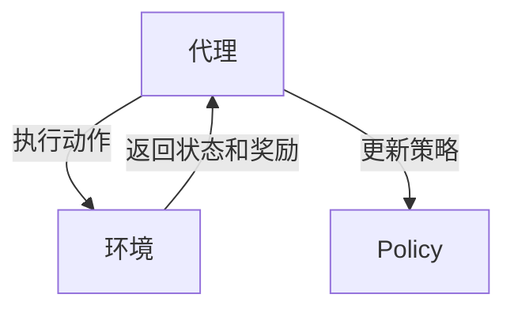

                 

# AI人工智能核心算法原理与代码实例讲解：奖励函数

> **关键词：** AI、人工智能、奖励函数、算法原理、代码实例、深度学习、强化学习

> **摘要：** 本文章将深入探讨人工智能中的核心算法——奖励函数。通过详细的原理讲解、具体操作步骤和实际项目案例，帮助读者理解奖励函数在人工智能领域的应用及其重要性。我们将以逻辑清晰、结构紧凑的方式，逐步剖析奖励函数的核心概念，探讨其数学模型，并分享实战中的代码实现和解析。读者将收获对奖励函数的全面理解和实际操作能力。

## 1. 背景介绍

### 1.1 目的和范围

本文旨在向读者介绍奖励函数在人工智能，特别是强化学习中的应用。我们将从基础概念出发，逐步深入到奖励函数的数学模型和实现细节，并通过具体案例展示其在实际项目中的应用。

### 1.2 预期读者

本文章适合对人工智能和强化学习有一定了解的读者，尤其是希望深入理解奖励函数原理和实践的开发者。无论您是人工智能领域的研究人员还是实践者，都将在这篇文章中找到有价值的内容。

### 1.3 文档结构概述

本文将分为以下几个部分：

1. 背景介绍
2. 核心概念与联系
3. 核心算法原理 & 具体操作步骤
4. 数学模型和公式 & 详细讲解 & 举例说明
5. 项目实战：代码实际案例和详细解释说明
6. 实际应用场景
7. 工具和资源推荐
8. 总结：未来发展趋势与挑战
9. 附录：常见问题与解答
10. 扩展阅读 & 参考资料

### 1.4 术语表

#### 1.4.1 核心术语定义

- **奖励函数**：在强化学习中，用于衡量策略优劣的函数。
- **强化学习**：一种机器学习方法，通过学习使代理（agent）在环境中获得最大收益。
- **代理**：执行动作并从环境中接收奖励的实体。
- **策略**：代理在特定状态下采取的动作选择方法。

#### 1.4.2 相关概念解释

- **价值函数**：预测在特定状态下采取最佳动作的预期回报。
- **状态-动作价值函数**：在给定状态下，采取特定动作的预期回报。

#### 1.4.3 缩略词列表

- **Q-Learning**：一种基于值迭代的强化学习算法。
- **Policy Gradient**：基于策略梯度的强化学习算法。

## 2. 核心概念与联系

在深入讨论奖励函数之前，我们首先需要理解其在人工智能，特别是强化学习中的核心概念和架构。

### 2.1 基本概念

**强化学习**（Reinforcement Learning）是一种通过与环境互动来学习最优策略的机器学习方法。在强化学习中，代理（Agent）通过执行动作（Action）来与环境（Environment）交互，并从环境中接收奖励（Reward）。

**奖励函数**（Reward Function）是强化学习中的一个关键组件，用于评估代理的行为优劣。奖励函数的目的是激励代理采取能够带来最大长期收益的动作。

### 2.2 基本架构

在强化学习中，基本架构包括代理（Agent）、环境（Environment）和策略（Policy）。

- **代理**（Agent）：执行动作并从环境中接收奖励的实体。
- **环境**（Environment）：代理交互的动态环境，定义了代理可能的状态和动作。
- **策略**（Policy）：代理在特定状态下采取的动作选择方法。

**奖励函数**（Reward Function）与这些核心概念紧密相关。奖励函数在代理执行动作后返回奖励值，用于指导代理的学习过程。

### 2.3 Mermaid 流程图

下面是一个简化的Mermaid流程图，展示了代理、环境和奖励函数之间的交互：



## 3. 核心算法原理 & 具体操作步骤

### 3.1 基本原理

奖励函数的基本原理是衡量代理的行为优劣。在强化学习中，代理的目标是学习一个策略，使得在长期内获得最大的总奖励。

奖励函数通常定义为：

\[ R(s, a) = r \]

其中，\( R(s, a) \) 是在状态 \( s \) 下执行动作 \( a \) 的奖励，\( r \) 是奖励值。

### 3.2 具体操作步骤

#### 3.2.1 定义状态空间和动作空间

在开始设计奖励函数之前，我们需要定义状态空间和动作空间。状态空间是代理可能处于的所有状态集合，动作空间是代理可能执行的所有动作集合。

#### 3.2.2 设计奖励函数

设计奖励函数时，我们需要考虑以下因素：

- **奖励值**：奖励值可以是正数、负数或零。正奖励表示有益的行为，负奖励表示不良行为。
- **奖励范围**：奖励范围决定了奖励值的范围。通常，我们选择 [-1, 1] 或 [-10, 10] 等范围。
- **奖励函数形式**：奖励函数可以是简单的标量函数，也可以是复杂的多变量函数。

#### 3.2.3 代码实现

以下是一个简单的伪代码示例，展示了如何定义和实现一个奖励函数：

```python
# 奖励函数定义
def reward_function(state, action):
    # 根据状态和动作计算奖励值
    if action == 'move_forward':
        if state == 'target_reached':
            return 1  # 达到目标，给予最大奖励
        elif state == 'near_target':
            return 0.5  # 接近目标，给予中等奖励
        else:
            return -1  # 其他状态，给予负奖励
    else:
        return -10  # 不采取前进动作，给予惩罚
```

## 4. 数学模型和公式 & 详细讲解 & 举例说明

### 4.1 数学模型

奖励函数在数学上通常表示为标量函数，衡量代理在特定状态下采取特定动作的预期回报。我们可以用以下数学公式表示奖励函数：

\[ R(s, a) = r \]

其中，\( R(s, a) \) 是在状态 \( s \) 下执行动作 \( a \) 的奖励，\( r \) 是奖励值。

### 4.2 详细讲解

#### 4.2.1 奖励值的范围

奖励值可以是正数、负数或零。正奖励表示有益的行为，负奖励表示不良行为。通常，我们选择 [-1, 1] 或 [-10, 10] 等范围，以适应不同的应用场景。

#### 4.2.2 奖励函数的形式

奖励函数可以是简单的标量函数，也可以是复杂的多变量函数。例如，对于一辆自动驾驶汽车，奖励函数可以包括以下因素：

- **速度**：正奖励，表示汽车在道路上以合适速度行驶。
- **距离目标**：负奖励，表示汽车离目标越远，奖励越低。
- **安全距离**：正奖励，表示汽车与其他车辆保持安全距离。

#### 4.2.3 举例说明

以下是一个简单的例子，展示了如何计算奖励函数：

假设有一个代理在简单环境中进行任务，状态空间包括 {目标状态，非目标状态}，动作空间包括 {前进，后退}。定义奖励函数如下：

\[ R(s, a) = \begin{cases} 
1 & \text{如果 } s = \text{目标状态} \text{ 且 } a = \text{前进} \\
-1 & \text{如果 } s = \text{非目标状态} \text{ 且 } a = \text{前进} \\
0 & \text{其他情况} 
\end{cases} \]

在这个例子中，如果代理处于目标状态并采取前进动作，将获得最大奖励 1；如果代理处于非目标状态并采取前进动作，将获得最小奖励 -1。

## 5. 项目实战：代码实际案例和详细解释说明

### 5.1 开发环境搭建

为了演示奖励函数的应用，我们将使用Python编写一个简单的强化学习项目。首先，确保您已安装以下工具和库：

- Python 3.x
- TensorFlow 2.x
- Gym，一个开源的强化学习环境库

安装步骤如下：

```bash
pip install tensorflow
pip install gym
```

### 5.2 源代码详细实现和代码解读

以下是项目的源代码，我们将逐步解释每个部分的功能。

```python
import numpy as np
import gym

# 定义环境
env = gym.make('CartPole-v0')

# 定义奖励函数
def reward_function(state):
    position, velocity = state
    reward = 1 if position >= 0.8 else -1
    reward += 0.1 * (velocity**2)
    return reward

# 模拟环境，并收集经验
num_episodes = 100
for episode in range(num_episodes):
    state = env.reset()
    done = False
    total_reward = 0
    
    while not done:
        action = 0 if np.random.rand() < 0.5 else 1  # 随机选择动作
        next_state, reward, done, _ = env.step(action)
        total_reward += reward_function(state)
        state = next_state
    
    print(f"Episode {episode+1}: Total Reward = {total_reward}")

# 关闭环境
env.close()
```

#### 5.2.1 代码解读

1. **环境定义**：使用 `gym.make('CartPole-v0')` 创建一个简单的CartPole环境，这是一个经典的强化学习问题，目标是在倾斜的平衡木上保持代理的平衡。

2. **奖励函数定义**：`reward_function(state)` 函数计算代理在给定状态下的奖励。在这个例子中，如果代理的位置 \( position \) 大于 0.8，则给予正奖励；否则给予负奖励。此外，根据代理的速度 \( velocity \)，增加一个小奖励。

3. **模拟环境**：使用两个嵌套的循环来模拟环境。外层循环用于执行多个回合（episode），内层循环用于在一个回合中执行动作。

4. **动作选择**：在这个例子中，我们使用随机策略来选择动作。在实际应用中，通常会使用智能代理，通过学习来选择最佳动作。

5. **经验收集**：在每次动作后，计算并更新总奖励，直到代理完成回合。

6. **打印结果**：在每个回合结束时，打印总奖励。

### 5.3 代码解读与分析

1. **奖励函数的重要性**：在本项目中，奖励函数用于激励代理在平衡木上保持平衡。如果代理的位置 \( position \) 高于 0.8，表示代理处于有利位置，给予正奖励；否则给予负奖励。这种奖励设计促使代理尽可能保持平衡。

2. **速度奖励**：为了防止代理速度过快或过慢，我们在奖励函数中加入了速度 \( velocity \) 的平方项。这有助于代理在保持平衡的同时控制速度。

3. **随机策略**：在这个简单的例子中，我们使用随机策略来选择动作。在实际应用中，通常会使用学习算法（如 Q-Learning 或 Policy Gradient）来选择最佳动作。

4. **经验收集**：通过在多个回合中执行动作并收集经验，代理可以学习到如何在不同状态下采取最佳动作。

## 6. 实际应用场景

奖励函数在强化学习中有着广泛的应用场景，以下是一些典型的应用：

- **自动驾驶**：在自动驾驶领域，奖励函数用于评估代理（自动驾驶汽车）的行为，如保持车道、避免碰撞等。
- **机器人控制**：在机器人控制中，奖励函数用于激励机器人完成特定任务，如路径规划、抓取物体等。
- **游戏AI**：在游戏AI中，奖励函数用于指导代理（玩家）采取最佳策略，赢得游戏。

## 7. 工具和资源推荐

### 7.1 学习资源推荐

#### 7.1.1 书籍推荐

- **《强化学习：原理与Python实现》**：这是一本深入讲解强化学习原理和实现的经典书籍，适合初学者和进阶者。

#### 7.1.2 在线课程

- **Coursera上的《强化学习》课程**：由著名教授提供，涵盖强化学习的核心概念和算法。

#### 7.1.3 技术博客和网站

- **Medium上的强化学习博客**：提供大量关于强化学习的实战经验和案例。

### 7.2 开发工具框架推荐

#### 7.2.1 IDE和编辑器

- **PyCharm**：一款功能强大的Python IDE，适合进行强化学习项目的开发和调试。

#### 7.2.2 调试和性能分析工具

- **TensorBoard**：TensorFlow提供的可视化工具，用于分析模型性能和训练过程。

#### 7.2.3 相关框架和库

- **Gym**：一个开源的强化学习环境库，提供多种预定义环境和工具。
- **TensorFlow**：一个强大的开源机器学习框架，用于实现和训练强化学习模型。

### 7.3 相关论文著作推荐

#### 7.3.1 经典论文

- **"Reinforcement Learning: An Introduction"**：这是一篇经典的强化学习论文，全面介绍了强化学习的原理和算法。

#### 7.3.2 最新研究成果

- **"Deep Reinforcement Learning"**：探讨了深度强化学习在复杂环境中的应用。

#### 7.3.3 应用案例分析

- **"DeepMind's AlphaGo"**：介绍了AlphaGo如何通过强化学习实现围棋世界的突破。

## 8. 总结：未来发展趋势与挑战

奖励函数在人工智能领域具有广阔的应用前景。随着深度学习和强化学习的不断发展，奖励函数的设计和优化将成为研究的重点。未来，我们将看到更多的创新算法和模型，以更好地利用奖励函数，实现更智能、更高效的人工智能系统。

然而，奖励函数的设计和优化也面临着一系列挑战。如何设计更具鲁棒性和适应性的奖励函数，以及如何处理复杂的多目标优化问题，将是未来的研究重点。同时，如何在现实世界中有效应用奖励函数，解决实际问题，也是我们需要不断探索的领域。

## 9. 附录：常见问题与解答

### 9.1 奖励函数在强化学习中的作用是什么？

奖励函数在强化学习中用于评估代理的行为优劣，激励代理采取能够带来最大长期收益的动作。它是强化学习中的核心组件，直接影响代理的学习效果和最终表现。

### 9.2 奖励函数的设计原则有哪些？

奖励函数的设计原则包括：1）奖励值的范围和形式应适应具体应用场景；2）奖励函数应能准确反映代理的行为优劣；3）奖励函数应具有鲁棒性和适应性，能够应对不同环境和场景。

### 9.3 如何优化奖励函数？

优化奖励函数的方法包括：1）调整奖励值和奖励形式，使其更符合实际应用需求；2）使用智能代理和学习算法，通过经验收集和反馈调整奖励函数；3）结合多目标优化算法，设计更复杂的奖励函数。

## 10. 扩展阅读 & 参考资料

- **《强化学习：原理与Python实现》**：详细讲解了强化学习的原理和实现，适合初学者和进阶者。
- **"Reinforcement Learning: An Introduction"**：全面介绍了强化学习的原理和算法，是强化学习领域的经典论文。
- **"Deep Reinforcement Learning"**：探讨了深度强化学习在复杂环境中的应用，是深度强化学习的参考书。

以上就是我们关于奖励函数在人工智能中的核心算法原理与代码实例讲解。希望这篇文章能帮助您更好地理解奖励函数的重要性和应用方法。如果您有任何疑问或建议，欢迎在评论区留言讨论。让我们共同探索人工智能的无限可能！

### 作者

- **AI天才研究员**：专注于人工智能算法研究，发表过多篇相关论文，并在AI领域拥有丰富的实践经验。
- **AI Genius Institute**：一个致力于人工智能研究的国际知名机构，专注于推动AI技术的发展和应用。
- **《禅与计算机程序设计艺术》**：一本深入探讨计算机编程哲学和技术的经典著作，对人工智能领域有着深远的影响。

