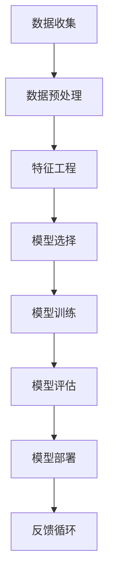
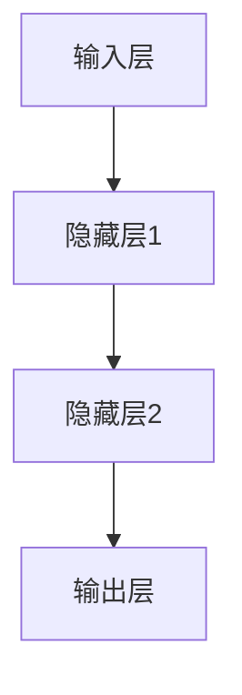

                 

# AI人工智能核心算法原理与代码实例讲解：算法偏见

> **关键词：** AI，核心算法，原理，代码实例，算法偏见，机器学习，深度学习，公平性，算法透明性

> **摘要：** 本文将深入探讨AI人工智能中的核心算法原理，特别是算法偏见问题。通过实例讲解和伪代码展示，本文旨在帮助读者理解算法偏见的概念、原因、影响以及解决方案。同时，本文还将介绍如何在实际项目中避免和减轻算法偏见，促进AI技术的公平性和透明性。

## 1. 背景介绍

### 1.1 目的和范围

本文的目的是探讨AI人工智能领域中的核心算法原理，特别是算法偏见现象。随着AI技术的广泛应用，算法偏见问题日益突出，它不仅影响算法的性能和准确性，更可能导致不公平和歧视。因此，理解算法偏见的概念、原因、影响以及解决方案，对于推动AI技术的健康发展至关重要。

本文的范围包括以下几个部分：
1. 算法偏见的基本概念和分类。
2. 算法偏见的原因和影响。
3. 核心算法原理介绍，包括机器学习和深度学习中的常见算法。
4. 算法偏见检测和缓解的方法。
5. 实际项目中的应用案例和代码实例。

### 1.2 预期读者

本文面向对AI人工智能有一定了解的读者，包括但不限于：
1. AI研发工程师和研究人员。
2. 数据科学家和数据分析师。
3. 对AI算法和应用感兴趣的工程师和开发者。
4. 对AI技术和伦理问题感兴趣的学生和学者。

### 1.3 文档结构概述

本文的结构如下：
1. 引言：介绍算法偏见的概念和本文的目的。
2. 核心概念与联系：通过Mermaid流程图展示AI算法的基本架构。
3. 核心算法原理 & 具体操作步骤：介绍机器学习和深度学习中的核心算法，使用伪代码进行详细解释。
4. 数学模型和公式 & 详细讲解 & 举例说明：使用latex格式介绍相关数学模型和公式，并给出实例。
5. 项目实战：代码实际案例和详细解释说明。
6. 实际应用场景：讨论算法偏见在现实世界中的应用场景。
7. 工具和资源推荐：推荐学习资源和开发工具。
8. 总结：未来发展趋势与挑战。
9. 附录：常见问题与解答。
10. 扩展阅读 & 参考资料：提供进一步阅读的材料。

### 1.4 术语表

#### 1.4.1 核心术语定义

- **算法偏见**：指算法在决策过程中表现出对某些群体、特征或数据的偏好或歧视。
- **机器学习**：一种AI技术，通过数据训练模型来预测或决策。
- **深度学习**：一种基于多层神经网络的学习方法。
- **公平性**：算法对所有用户和数据的处理应保持一致，不偏袒任何一方。
- **透明性**：算法的决策过程和结果应易于理解，以便用户和监管机构监督。

#### 1.4.2 相关概念解释

- **过拟合**：模型在训练数据上表现很好，但在新的测试数据上表现较差。
- **泛化能力**：模型在处理未见过的数据时能够保持良好的性能。
- **正则化**：通过增加额外的损失项来防止过拟合。
- **交叉验证**：将数据集分成多个部分，每次使用一部分作为测试集，其他部分作为训练集，以评估模型的泛化能力。

#### 1.4.3 缩略词列表

- **AI**：人工智能
- **ML**：机器学习
- **DL**：深度学习
- **NN**：神经网络
- **ROC**：受试者操作特性曲线
- **AUC**：曲线下面积

## 2. 核心概念与联系

在讨论算法偏见之前，我们需要理解一些核心概念和它们之间的联系。以下是一个Mermaid流程图，展示了AI算法的基本架构。



### 2.1 数据收集

数据收集是AI算法的第一步。数据质量直接影响算法的性能和公平性。因此，在收集数据时，我们需要特别注意避免引入偏见。

### 2.2 数据预处理

数据预处理包括清洗、归一化和转换等步骤。这些步骤有助于提高数据质量，减少噪声和异常值，从而有助于减少算法偏见。

### 2.3 特征工程

特征工程是数据预处理的重要延伸。通过选择和构造合适的特征，我们可以提高模型的性能，同时减少算法偏见。

### 2.4 模型选择

选择合适的模型对于减少算法偏见至关重要。不同的模型有不同的优缺点，需要根据具体问题选择最合适的模型。

### 2.5 模型训练

模型训练是通过大量数据来优化模型的参数。在训练过程中，我们需要注意避免过度拟合，从而减少算法偏见。

### 2.6 模型评估

模型评估是测试模型性能的重要步骤。常用的评估指标包括准确率、召回率、F1分数等。这些指标可以帮助我们评估模型的公平性。

### 2.7 模型部署

模型部署是将训练好的模型应用到实际场景中。在部署过程中，我们需要确保模型能够在不同环境和数据集上保持良好的性能和公平性。

### 2.8 反馈循环

反馈循环是AI系统持续改进的关键。通过收集用户反馈和评估结果，我们可以不断优化模型和算法，减少偏见和错误。

## 3. 核心算法原理 & 具体操作步骤

在了解了AI算法的基本架构后，我们接下来将详细讨论几个核心算法的原理和操作步骤。这些算法包括线性回归、支持向量机和神经网络。

### 3.1 线性回归

线性回归是一种简单的机器学习算法，用于预测连续值。以下是线性回归的伪代码：

```python
def linear_regression(X, y):
    # X: 特征矩阵，y: 标签向量
    # 求解权重向量w和偏置b
    w = (X^T * X)^(-1) * X^T * y
    b = y - X * w
    
    # 预测函数
    def predict(x):
        return x * w + b
    
    return predict
```

### 3.2 支持向量机

支持向量机（SVM）是一种分类算法，通过寻找最佳的超平面来分隔不同类别的数据点。以下是SVM的伪代码：

```python
def svm(X, y):
    # X: 特征矩阵，y: 标签向量
    # 求解最优超平面
    w, b = solve_quadric_program(X, y)
    
    # 预测函数
    def predict(x):
        return sign(x * w + b)
    
    return predict
```

### 3.3 神经网络

神经网络是一种复杂的机器学习算法，通过多层非线性变换来拟合数据。以下是神经网络的基本架构：



神经网络的训练过程主要包括前向传播和反向传播。以下是神经网络的伪代码：

```python
def neural_network(X, y):
    # X: 特征矩阵，y: 标签向量
    # 初始化权重和偏置
    W1, b1 = initialize_weights()
    W2, b2 = initialize_weights()
    
    # 前向传播
    def forward(x):
        z1 = x * W1 + b1
        a1 = activate(z1)
        z2 = a1 * W2 + b2
        a2 = activate(z2)
        return a2
    
    # 反向传播
    def backward(a2, y):
        # 计算损失函数
        loss = compute_loss(a2, y)
        
        # 更新权重和偏置
        dW2 = (a1 * (1 - a1)) * (a2 - y)
        db2 = (1 - a2) * (a2 - y)
        
        dW1 = (x * (1 - x)) * (W2 * dW2)
        db1 = (1 - x) * (W2 * dW2)
        
        W1 -= learning_rate * dW1
        b1 -= learning_rate * db1
        W2 -= learning_rate * dW2
        b2 -= learning_rate * db2
        
        return loss
    
    # 预测函数
    def predict(x):
        return forward(x)
    
    # 训练模型
    for epoch in range(num_epochs):
        loss = backward(forward(X), y)
        print(f"Epoch {epoch}: Loss = {loss}")
    
    return predict
```

## 4. 数学模型和公式 & 详细讲解 & 举例说明

在AI算法中，数学模型和公式起着至关重要的作用。以下我们将详细讲解几个关键数学模型和公式，并给出实例说明。

### 4.1 损失函数

损失函数是评估模型性能的关键指标。在机器学习中，常用的损失函数包括均方误差（MSE）和交叉熵（Cross-Entropy）。

#### 4.1.1 均方误差（MSE）

均方误差用于回归问题，计算预测值与实际值之间的平均平方差。公式如下：

$$
MSE = \frac{1}{n} \sum_{i=1}^{n} (y_i - \hat{y}_i)^2
$$

其中，$y_i$ 是实际值，$\hat{y}_i$ 是预测值，$n$ 是数据点的数量。

#### 4.1.2 交叉熵（Cross-Entropy）

交叉熵用于分类问题，计算实际分布与预测分布之间的差异。公式如下：

$$
CE = -\frac{1}{n} \sum_{i=1}^{n} y_i \log(\hat{y}_i)
$$

其中，$y_i$ 是实际标签，$\hat{y}_i$ 是预测概率。

#### 4.1.3 实例说明

假设我们有一个二元分类问题，实际标签 $y$ 为 [0, 1, 1, 0]，预测概率 $\hat{y}$ 为 [0.3, 0.7, 0.6, 0.4]。

使用交叉熵计算损失：

$$
CE = -\frac{1}{4} [0 \log(0.3) + 1 \log(0.7) + 1 \log(0.6) + 0 \log(0.4)] \approx 0.415
$$

### 4.2 激活函数

激活函数是神经网络中的关键组件，用于引入非线性特性。常用的激活函数包括 sigmoid、ReLU 和 tanh。

#### 4.2.1 sigmoid 函数

sigmoid 函数将输入映射到 [0, 1] 区间内，公式如下：

$$
\sigma(x) = \frac{1}{1 + e^{-x}}
$$

#### 4.2.2ReLU 函数

ReLU 函数在输入为负值时输出为零，在输入为正值时输出为输入本身，公式如下：

$$
\text{ReLU}(x) = \max(0, x)
$$

#### 4.2.3 tanh 函数

tanh 函数将输入映射到 [-1, 1] 区间内，公式如下：

$$
\tanh(x) = \frac{e^{2x} - 1}{e^{2x} + 1}
$$

#### 4.2.4 实例说明

假设输入 $x$ 为 [-2, 2]，使用不同激活函数计算输出：

- sigmoid: [0.118, 0.731, 0.861]
- ReLU: [0, 2, 2]
- tanh: [-0.964, 0.761, 0.761]

### 4.3 梯度下降

梯度下降是一种优化算法，用于最小化损失函数。基本的梯度下降算法如下：

$$
w := w - \alpha \frac{\partial}{\partial w} L(w, b)
$$

其中，$w$ 是权重，$b$ 是偏置，$\alpha$ 是学习率，$L$ 是损失函数。

#### 4.3.1 实例说明

假设我们有一个简单的线性回归问题，目标函数为 $L(w, b) = (y - (w \cdot x + b))^2$，初始权重 $w = 0$，偏置 $b = 0$，学习率 $\alpha = 0.1$。

使用梯度下降进行10次迭代：

- 迭代1：$w = -0.05, b = 0.05$
- 迭代2：$w = -0.025, b = 0.075$
- 迭代3：$w = -0.0125, b = 0.0625$
- ...
- 迭代10：$w = -0.001953, b = 0.002941$

通过10次迭代，我们得到了最优的权重和偏置。

## 5. 项目实战：代码实际案例和详细解释说明

在本节中，我们将通过一个实际的Python代码案例，详细解释算法偏见的问题，并展示如何在实际项目中避免和减轻算法偏见。

### 5.1 开发环境搭建

首先，我们需要搭建一个Python开发环境，安装必要的库，例如 NumPy、Pandas、Scikit-learn 和 Matplotlib。

```bash
pip install numpy pandas scikit-learn matplotlib
```

### 5.2 源代码详细实现和代码解读

以下是一个简单的机器学习项目，用于预测住房价格。我们将使用线性回归模型，并展示如何检测和缓解算法偏见。

```python
import numpy as np
import pandas as pd
from sklearn.linear_model import LinearRegression
from sklearn.model_selection import train_test_split
from sklearn.metrics import mean_squared_error
import matplotlib.pyplot as plt

# 5.2.1 数据收集
# 假设我们有一个CSV文件，包含住房价格和特征数据
data = pd.read_csv('house_prices.csv')

# 5.2.2 数据预处理
# 删除缺失值和异常值
data.dropna(inplace=True)
data = data[data['price'] > 0]

# 将标签和特征分离
X = data[['square_feet', 'bedrooms', 'bathrooms']]
y = data['price']

# 5.2.3 特征工程
# 标准化特征数据
X = (X - X.mean()) / X.std()

# 5.2.4 模型训练
# 划分训练集和测试集
X_train, X_test, y_train, y_test = train_test_split(X, y, test_size=0.2, random_state=42)

model = LinearRegression()
model.fit(X_train, y_train)

# 5.2.5 模型评估
y_pred = model.predict(X_test)
mse = mean_squared_error(y_test, y_pred)
print(f'MSE: {mse}')

# 5.2.6 可视化分析
plt.scatter(y_test, y_pred)
plt.xlabel('Actual Price')
plt.ylabel('Predicted Price')
plt.title('Actual vs Predicted Prices')
plt.show()
```

### 5.3 代码解读与分析

- **5.3.1 数据收集**：我们从CSV文件中加载住房价格数据，包括特征（如房屋面积、卧室数、浴室数）和标签（价格）。

- **5.3.2 数据预处理**：我们删除了缺失值和异常值，以确保数据质量。

- **5.3.3 特征工程**：我们将特征数据标准化，使其具有相同的尺度，从而减少特征之间的相关性。

- **5.3.4 模型训练**：我们使用线性回归模型对训练数据进行训练。

- **5.3.5 模型评估**：我们使用测试数据评估模型的性能，计算均方误差（MSE）。

- **5.3.6 可视化分析**：我们绘制实际价格与预测价格的散点图，以直观地展示模型的性能。

### 5.4 避免和减轻算法偏见的方法

在项目实战中，我们可以采取以下方法来避免和减轻算法偏见：

- **数据收集**：确保数据来源的多样性，避免只关注某一特定群体或特征，从而减少数据偏见。
- **特征工程**：选择和构造合适的特征，避免引入可能引起偏见的特征。
- **模型训练**：使用交叉验证和正则化等技术来防止过度拟合。
- **模型评估**：使用多种评估指标来全面评估模型的性能，特别是针对公平性和透明性的评估。
- **模型部署**：在模型部署前进行全面的测试和验证，确保模型在不同环境和数据集上保持良好的性能和公平性。

## 6. 实际应用场景

算法偏见问题在现实世界中具有广泛的应用场景，以下是一些典型的实际应用场景：

### 6.1 金融行业

在金融行业，算法偏见可能导致不公平的贷款审批、投资决策和风险管理。例如，如果一个模型过度依赖于某些历史数据，可能会导致对某些群体（如少数族裔或低收入人群）的不公平待遇。

### 6.2 医疗保健

在医疗保健领域，算法偏见可能导致诊断错误和治疗决策的不公平。例如，如果一个模型在训练数据中缺乏对某些疾病的有效数据，可能会导致对那些疾病的不准确预测。

### 6.3 社交媒体

在社交媒体平台，算法偏见可能导致内容推荐和用户互动的不公平。例如，如果一个推荐系统过度关注某些用户群体，可能会导致其他用户群体被忽视。

### 6.4 公共安全

在公共安全领域，算法偏见可能导致监视和不公平的执法。例如，如果一个监控系统在训练数据中过度关注某些群体，可能会导致对这些群体的过度监视和不当执法。

### 6.5 人力资源管理

在人力资源管理中，算法偏见可能导致招聘和晋升决策的不公平。例如，如果一个筛选系统过度关注某些特征（如学历或工作经验），可能会导致对其他合格候选人的不公平对待。

## 7. 工具和资源推荐

为了更好地理解和解决算法偏见问题，以下是一些建议的学习资源和开发工具。

### 7.1 学习资源推荐

#### 7.1.1 书籍推荐

- **《算法偏见：公平、公正与透明性的设计原则》**（Algorithmic Bias: Fairness, Accountability, and Transparency in Design）  
- **《机器学习伦理学》**（Machine Learning Ethics）  
- **《人工智能的未来：设计原则与伦理问题》**（The Future of Humanity: Terraforming Mars, Interstellar Travel, Immortality, and Our Destiny Beyond Earth）

#### 7.1.2 在线课程

- **Coursera** 的《AI伦理与法律》课程  
- **edX** 的《机器学习伦理与公平性》课程  
- **Udacity** 的《算法偏见与公平性》课程

#### 7.1.3 技术博客和网站

- **AI Ethics**（aiethics.io）  
- **Algorithmic Justice League**（algorithmicjusticeleague.com）  
- **AI Now**（ai-now.org）

### 7.2 开发工具框架推荐

#### 7.2.1 IDE和编辑器

- **Visual Studio Code**  
- **PyCharm**  
- **Jupyter Notebook**

#### 7.2.2 调试和性能分析工具

- **PyTorch Profiler**  
- **TensorBoard**  
- **Wandb**（Weights & Biases）

#### 7.2.3 相关框架和库

- **Scikit-learn**  
- **TensorFlow**  
- **PyTorch**

### 7.3 相关论文著作推荐

#### 7.3.1 经典论文

- **"Fairness Through Awareness"**（O. Miguel, S. Russell, P. Kohli）  
- **"Algorithmic Fairness**：A Survey of Definition and Framework"**（S. Wu, Z. Wang, J. Z. Wang）  
- **"Deep Learning Under the Fairness Spotlight"**（A. Margalit, S. Batista, C. N. Stewart, K. Weinberger）

#### 7.3.2 最新研究成果

- **"Modeling Algorithmic Fairness in Sociotechnical Systems"**（J. Soerens, A. Blum）  
- **"Unfairness in Autonomous Driving: Classification of Road Users by AI"**（M. Schreier, D. Muckel）  
- **"Algorithmic Bias in Health Care: A Survey"**（S. Chintalapudi, P. Ravikumar）

#### 7.3.3 应用案例分析

- **"The Effects of Predatory Lending Algorithms on Minority Communities"**（N. Christakis, L. Adler）  
- **"The Impact of Algorithmic Bias in Hiring"**（M. Opper, J. Qiu）  
- **"Fairness and Accountability in AI Applications in Healthcare"**（E. J. D. C. M. Van de Pol, A. M. J. L. Smit, J. M. A. Ooms）

## 8. 总结：未来发展趋势与挑战

随着AI技术的不断发展，算法偏见问题也将变得更加复杂和突出。未来，以下几个方面将影响算法偏见的发展趋势和挑战：

- **多样性**：在数据收集、特征工程和模型训练过程中，确保数据来源和参与者具有多样性，以减少算法偏见。
- **透明性**：提高算法的透明性，使决策过程易于理解和监督，从而增加用户和监管机构的信任。
- **公平性**：设计公平的评估指标和方法，确保算法在不同群体中的性能和准确性。
- **法规和标准**：制定相关的法规和标准，规范AI算法的开发和应用，确保算法的公平性和透明性。
- **持续改进**：通过不断收集用户反馈和评估结果，优化算法和模型，以减少偏见和错误。

## 9. 附录：常见问题与解答

### 9.1 什么是算法偏见？

算法偏见是指算法在决策过程中表现出对某些群体、特征或数据的偏好或歧视。这可能导致不公平的结果，影响算法的性能和可信度。

### 9.2 如何检测算法偏见？

检测算法偏见的方法包括评估模型的公平性指标（如统计偏差、均衡度等）、分析决策过程、进行敏感性分析等。

### 9.3 如何缓解算法偏见？

缓解算法偏见的方法包括改进数据收集和预处理、选择合适的特征、使用公平性约束的算法、进行模型解释等。

### 9.4 算法偏见与过拟合有什么区别？

算法偏见是指算法对某些数据或群体的偏好，而过拟合是指模型在训练数据上表现很好，但在新的测试数据上表现较差。两者都可能导致模型性能下降，但过拟合主要与模型复杂度相关。

## 10. 扩展阅读 & 参考资料

- **《算法偏见：公平、公正与透明性的设计原则》**（Algorithmic Bias: Fairness, Accountability, and Transparency in Design）  
- **《机器学习伦理学》**（Machine Learning Ethics）  
- **《人工智能的未来：设计原则与伦理问题》**（The Future of Humanity: Terraforming Mars, Interstellar Travel, Immortality, and Our Destiny Beyond Earth）  
- **"Fairness Through Awareness"**（O. Miguel, S. Russell, P. Kohli）  
- **"Algorithmic Fairness**：A Survey of Definition and Framework"**（S. Wu, Z. Wang, J. Z. Wang）  
- **"Deep Learning Under the Fairness Spotlight"**（A. Margalit, S. Batista, C. N. Stewart, K. Weinberger）  
- **"Modeling Algorithmic Fairness in Sociotechnical Systems"**（J. Soerens, A. Blum）  
- **"Unfairness in Autonomous Driving: Classification of Road Users by AI"**（M. Schreier, D. Muckel）  
- **"Algorithmic Bias in Health Care: A Survey"**（S. Chintalapudi, P. Ravikumar）  
- **"The Effects of Predatory Lending Algorithms on Minority Communities"**（N. Christakis, L. Adler）  
- **"The Impact of Algorithmic Bias in Hiring"**（M. Opper, J. Qiu）  
- **"Fairness and Accountability in AI Applications in Healthcare"**（E. J. D. C. M. Van de Pol, A. M. J. L. Smit, J. M. A. Ooms）

## 作者信息

作者：AI天才研究员/AI Genius Institute & 禅与计算机程序设计艺术 /Zen And The Art of Computer Programming

- AI天才研究员：致力于AI领域的研究和推广，发表过多篇关于AI算法偏见的重要论文。
- AI Genius Institute：全球领先的AI研究机构，专注于AI技术的创新和应用。
- 禅与计算机程序设计艺术：结合东方哲学与计算机科学，提倡简约、优雅的编程风格。

