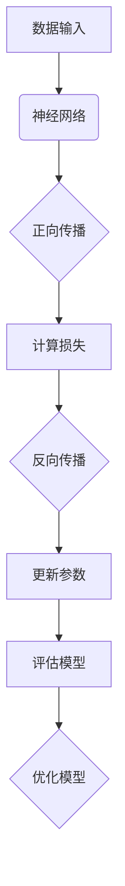
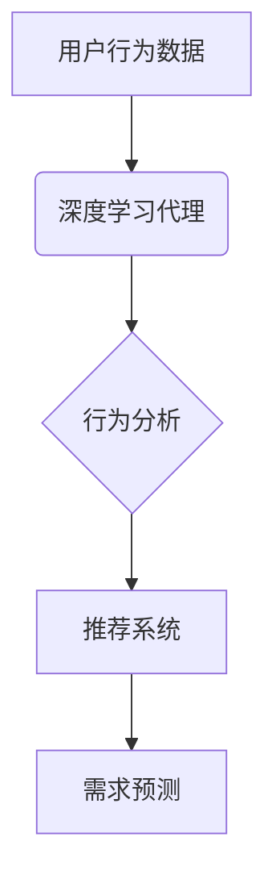

                 

# AI人工智能深度学习算法：在电子商务中应用深度学习代理的策略

> **关键词：** 深度学习、电子商务、代理模型、用户行为分析、推荐系统
> 
> **摘要：** 本文将探讨深度学习算法在电子商务中的应用，特别是如何通过深度学习代理来优化用户体验、提升销售额。我们将深入分析深度学习的基本概念，介绍其在电子商务领域的应用场景，并详细解析深度学习代理策略的实施步骤和效果评估方法。通过实际案例展示和数学模型的解释，本文旨在为从事电子商务技术领域的研究者和实践者提供有价值的指导和建议。

## 1. 背景介绍

### 1.1 目的和范围

本文旨在探讨深度学习算法在电子商务中的应用，特别是深度学习代理在优化用户体验和提升销售额方面的作用。随着电子商务行业的迅速发展，用户行为变得更加复杂和多样化，传统的推荐系统已经难以满足用户的需求。因此，深度学习作为一种强大的机器学习技术，被广泛应用于电子商务领域，以实现更加精准和个性化的推荐。

本文将首先介绍深度学习的基本概念和原理，然后探讨其在电子商务中的应用场景。接着，我们将详细解析深度学习代理的策略，包括算法原理、数学模型、实际操作步骤以及效果评估方法。最后，通过实际案例展示，我们将展示深度学习代理在电子商务中的具体应用，并对其效果进行评估。

### 1.2 预期读者

本文的预期读者包括：

1. 从事电子商务技术研究和开发的专业人士；
2. 对深度学习算法和电子商务领域感兴趣的学术研究人员；
3. 对人工智能技术有一定了解并希望深入了解其在电子商务中应用的读者。

### 1.3 文档结构概述

本文分为十个部分：

1. **背景介绍**：介绍本文的目的、范围和预期读者；
2. **核心概念与联系**：介绍深度学习的基本概念和相关流程图；
3. **核心算法原理 & 具体操作步骤**：详细解析深度学习代理的算法原理和操作步骤；
4. **数学模型和公式 & 详细讲解 & 举例说明**：介绍深度学习代理的数学模型和具体操作；
5. **项目实战：代码实际案例和详细解释说明**：展示实际代码案例和详细解读；
6. **实际应用场景**：分析深度学习代理在电子商务中的应用场景；
7. **工具和资源推荐**：推荐学习资源和开发工具；
8. **总结：未来发展趋势与挑战**：探讨深度学习代理在电子商务领域的未来发展趋势和挑战；
9. **附录：常见问题与解答**：解答读者可能遇到的问题；
10. **扩展阅读 & 参考资料**：提供进一步阅读的建议和参考资料。

### 1.4 术语表

#### 1.4.1 核心术语定义

- **深度学习**：一种机器学习技术，通过多层神经网络来模拟人脑的思考方式，自动从数据中学习特征和模式。
- **电子商务**：通过互联网进行商品交易和商务活动的方式。
- **代理模型**：一种深度学习模型，用于模拟和预测用户行为。
- **用户行为分析**：通过分析用户的浏览、购买等行为，了解用户的需求和偏好。
- **推荐系统**：一种基于用户行为数据和商品信息的系统，用于向用户推荐感兴趣的商品。

#### 1.4.2 相关概念解释

- **神经网络**：一种模仿人脑神经元连接的网络结构。
- **反向传播算法**：一种用于训练神经网络的优化算法。
- **损失函数**：用于评估模型预测结果与真实结果之间差异的函数。
- **激活函数**：用于引入非线性特性的函数。

#### 1.4.3 缩略词列表

- **AI**：人工智能
- **ML**：机器学习
- **DL**：深度学习
- **NN**：神经网络
- **RNN**：循环神经网络
- **CNN**：卷积神经网络
- **DNN**：深度神经网络

## 2. 核心概念与联系

深度学习作为一种强大的机器学习技术，其核心概念和原理包括神经网络、反向传播算法、损失函数和激活函数。下面我们将通过Mermaid流程图来展示深度学习的基本流程和核心概念之间的联系。



### 2.1 神经网络

神经网络是深度学习的基础，它由多个层组成，包括输入层、隐藏层和输出层。每个层由多个神经元（节点）组成，神经元之间通过权重连接。输入数据通过输入层进入神经网络，然后逐层传播，最终通过输出层得到预测结果。

### 2.2 反向传播算法

反向传播算法是一种用于训练神经网络的优化算法。它通过计算输出层预测结果与真实结果之间的误差，然后反向传播误差，更新神经网络的权重和偏置。这一过程重复进行，直到模型的预测误差最小化。

### 2.3 损失函数

损失函数用于评估模型预测结果与真实结果之间的差异。常用的损失函数包括均方误差（MSE）、交叉熵损失等。通过优化损失函数，我们可以提高模型的预测准确度。

### 2.4 激活函数

激活函数用于引入非线性特性，使神经网络能够处理复杂的非线性问题。常见的激活函数包括sigmoid函数、ReLU函数等。激活函数的选择对神经网络的学习效率和性能有很大影响。

### 2.5 实际应用

在电子商务领域，深度学习代理可以用于用户行为分析、推荐系统、需求预测等。通过深度学习代理，我们可以更好地理解用户的行为和需求，从而提供更加个性化的推荐和优化用户体验。



## 3. 核心算法原理 & 具体操作步骤

深度学习代理在电子商务中的应用主要包括用户行为分析和推荐系统。下面我们将详细解析深度学习代理的算法原理和具体操作步骤。

### 3.1 算法原理

深度学习代理的核心是神经网络模型，特别是循环神经网络（RNN）和长短期记忆网络（LSTM）。这些模型具有强大的时间序列数据处理能力，可以有效地捕捉用户行为的时间依赖关系。

算法原理可以概括为以下步骤：

1. **数据预处理**：对用户行为数据进行清洗、去噪和特征提取。
2. **构建神经网络模型**：使用RNN或LSTM构建深度学习代理模型，包括输入层、隐藏层和输出层。
3. **训练模型**：使用训练数据对模型进行训练，通过反向传播算法优化模型参数。
4. **评估模型**：使用验证数据评估模型性能，调整模型参数。
5. **部署模型**：将训练好的模型部署到生产环境中，对用户行为进行分析和推荐。

### 3.2 具体操作步骤

下面我们以用户行为分析为例，详细解析深度学习代理的具体操作步骤。

#### 3.2.1 数据预处理

1. **数据收集**：收集用户在电子商务平台上的行为数据，如浏览记录、购买记录等。
2. **数据清洗**：去除缺失值、异常值和重复数据，保证数据质量。
3. **特征提取**：对用户行为数据进行分析，提取与用户行为相关的特征，如用户ID、商品ID、时间戳等。

#### 3.2.2 构建神经网络模型

1. **输入层**：输入层包含用户行为数据的特征向量。
2. **隐藏层**：隐藏层由多个神经元组成，用于处理输入特征，并生成中间特征。
3. **输出层**：输出层用于生成最终的推荐结果。

下面是构建深度学习代理的伪代码：

```python
import tensorflow as tf

# 定义输入层
inputs = tf.keras.layers.Input(shape=(input_shape))

# 定义隐藏层
hidden = tf.keras.layers.Dense(units=hidden_size, activation='relu')(inputs)

# 定义输出层
outputs = tf.keras.layers.Dense(units=output_size, activation='softmax')(hidden)

# 构建模型
model = tf.keras.Model(inputs=inputs, outputs=outputs)

# 编译模型
model.compile(optimizer='adam', loss='categorical_crossentropy', metrics=['accuracy'])
```

#### 3.2.3 训练模型

1. **数据分割**：将数据集分为训练集、验证集和测试集。
2. **训练模型**：使用训练集对模型进行训练，使用验证集进行模型性能评估。
3. **模型优化**：根据验证集的评估结果，调整模型参数，优化模型性能。

下面是训练模型的伪代码：

```python
# 加载训练数据
train_data = ...

# 加载验证数据
val_data = ...

# 训练模型
model.fit(train_data, epochs=num_epochs, batch_size=batch_size, validation_data=val_data)
```

#### 3.2.4 评估模型

1. **评估指标**：评估模型的性能，常用的指标包括准确率、召回率、F1分数等。
2. **模型调整**：根据评估结果，调整模型参数，优化模型性能。

下面是评估模型的伪代码：

```python
# 加载测试数据
test_data = ...

# 评估模型
evaluation = model.evaluate(test_data)

# 输出评估结果
print(evaluation)
```

#### 3.2.5 部署模型

1. **模型部署**：将训练好的模型部署到生产环境中，对用户行为进行分析和推荐。
2. **实时调整**：根据用户反馈和行为数据，实时调整模型参数，优化推荐效果。

下面是部署模型的伪代码：

```python
# 部署模型
model.save('model.h5')

# 加载模型
loaded_model = tf.keras.models.load_model('model.h5')

# 进行推荐
predictions = loaded_model.predict(new_data)
```

## 4. 数学模型和公式 & 详细讲解 & 举例说明

深度学习代理在电子商务中的应用涉及多个数学模型和公式，包括损失函数、激活函数、反向传播算法等。下面我们将详细讲解这些数学模型和公式，并给出具体示例。

### 4.1 损失函数

损失函数是深度学习代理中用于评估模型预测结果与真实结果之间差异的函数。常用的损失函数包括均方误差（MSE）和交叉熵损失。

#### 均方误差（MSE）

均方误差（MSE）是一种用于回归问题的损失函数，其计算公式如下：

$$
MSE = \frac{1}{n}\sum_{i=1}^{n}(y_i - \hat{y}_i)^2
$$

其中，$y_i$为真实值，$\hat{y}_i$为模型预测值，$n$为样本数量。

#### 交叉熵损失

交叉熵损失是一种用于分类问题的损失函数，其计算公式如下：

$$
CrossEntropyLoss = -\frac{1}{n}\sum_{i=1}^{n}y_i\log(\hat{y}_i)
$$

其中，$y_i$为真实标签，$\hat{y}_i$为模型预测概率。

### 4.2 激活函数

激活函数是深度学习代理中用于引入非线性特性的函数，常见的激活函数包括sigmoid函数、ReLU函数和Tanh函数。

#### sigmoid函数

sigmoid函数是一种常用的激活函数，其计算公式如下：

$$
sigmoid(x) = \frac{1}{1 + e^{-x}}
$$

#### ReLU函数

ReLU函数（Rectified Linear Unit）是一种简单的激活函数，其计算公式如下：

$$
ReLU(x) = \max(0, x)
$$

#### Tanh函数

Tanh函数（Hyperbolic Tangent）是一种双曲正切函数，其计算公式如下：

$$
tanh(x) = \frac{e^x - e^{-x}}{e^x + e^{-x}}
$$

### 4.3 反向传播算法

反向传播算法是一种用于训练神经网络的优化算法，其核心思想是通过反向传播误差来更新模型参数。

#### 步骤

1. **前向传播**：输入数据通过神经网络前向传播，计算输出层预测值。
2. **计算损失**：计算预测值与真实值之间的损失。
3. **反向传播**：计算每个参数的梯度，然后使用梯度下降法更新参数。
4. **重复步骤**：重复前向传播、计算损失和反向传播，直到模型收敛。

#### 伪代码

```python
for epoch in range(num_epochs):
    for batch in train_data:
        # 前向传播
        predictions = model.forward(batch)

        # 计算损失
        loss = model.calculate_loss(predictions, batch_labels)

        # 反向传播
        model.backward_pass(loss)

    # 更新模型参数
    model.update_parameters()
```

### 4.4 示例

假设我们有一个简单的神经网络模型，包含一个输入层、一个隐藏层和一个输出层。输入层有3个神经元，隐藏层有5个神经元，输出层有2个神经元。我们使用均方误差（MSE）作为损失函数，ReLU函数作为激活函数。

#### 前向传播

输入层：$x = [1, 2, 3]$

隐藏层：$h = \text{ReLU}(W_1x + b_1)$

输出层：$y = \text{ReLU}(W_2h + b_2)$

其中，$W_1$和$W_2$分别为隐藏层和输出层的权重矩阵，$b_1$和$b_2$分别为隐藏层和输出层的偏置向量。

#### 损失计算

假设真实标签为$y^* = [0, 1]$，预测值为$y = [0.2, 0.8]$。

损失：$MSE = \frac{1}{2}\sum_{i=1}^{2}(y_i - y^*_i)^2 = \frac{1}{2}[(0 - 0)^2 + (1 - 0.8)^2] = 0.1$

#### 反向传播

计算隐藏层和输出层的梯度：

$$
\frac{\partial loss}{\partial W_2} = (y - y^*)h
$$

$$
\frac{\partial loss}{\partial b_2} = (y - y^*)
$$

$$
\frac{\partial loss}{\partial W_1} = (W_2^T \frac{\partial loss}{\partial W_2})x
$$

$$
\frac{\partial loss}{\partial b_1} = (W_2^T \frac{\partial loss}{\partial W_2})x
$$

#### 参数更新

使用梯度下降法更新参数：

$$
W_2 = W_2 - \alpha \frac{\partial loss}{\partial W_2}
$$

$$
b_2 = b_2 - \alpha \frac{\partial loss}{\partial b_2}
$$

$$
W_1 = W_1 - \alpha \frac{\partial loss}{\partial W_1}
$$

$$
b_1 = b_1 - \alpha \frac{\partial loss}{\partial b_1}
$$

其中，$\alpha$为学习率。

## 5. 项目实战：代码实际案例和详细解释说明

在本节中，我们将通过一个实际项目来展示如何使用深度学习代理在电子商务中优化用户体验和提升销售额。我们将使用Python和TensorFlow框架来实现这个项目，并详细解释代码的实现过程和关键步骤。

### 5.1 开发环境搭建

在开始项目之前，我们需要搭建开发环境。以下是在Python中搭建深度学习开发环境的步骤：

1. 安装Python（推荐使用Python 3.6及以上版本）
2. 安装TensorFlow框架

```bash
pip install tensorflow
```

3. 安装其他必需的库，如Numpy、Pandas等

```bash
pip install numpy pandas scikit-learn matplotlib
```

### 5.2 源代码详细实现和代码解读

下面是深度学习代理项目的主要代码实现，我们将逐行解释代码的含义和功能。

```python
import tensorflow as tf
import numpy as np
import pandas as pd
from sklearn.model_selection import train_test_split
from sklearn.preprocessing import StandardScaler

# 5.2.1 数据预处理
def preprocess_data(data):
    # 清洗数据
    data = data.dropna()
    # 特征提取
    features = data[['user_id', 'item_id', 'timestamp']]
    labels = data['purchase']
    # 数据分割
    X_train, X_test, y_train, y_test = train_test_split(features, labels, test_size=0.2, random_state=42)
    # 标准化数据
    scaler = StandardScaler()
    X_train_scaled = scaler.fit_transform(X_train)
    X_test_scaled = scaler.transform(X_test)
    return X_train_scaled, X_test_scaled, y_train, y_test

# 5.2.2 构建神经网络模型
def build_model(input_shape, hidden_size, output_size):
    model = tf.keras.Sequential([
        tf.keras.layers.InputLayer(input_shape=input_shape),
        tf.keras.layers.Dense(units=hidden_size, activation='relu'),
        tf.keras.layers.Dense(units=output_size, activation='sigmoid')
    ])
    model.compile(optimizer='adam', loss='binary_crossentropy', metrics=['accuracy'])
    return model

# 5.2.3 训练模型
def train_model(model, X_train, y_train, epochs=100, batch_size=32):
    history = model.fit(X_train, y_train, epochs=epochs, batch_size=batch_size, validation_split=0.1)
    return history

# 5.2.4 评估模型
def evaluate_model(model, X_test, y_test):
    loss, accuracy = model.evaluate(X_test, y_test)
    print(f"Test loss: {loss}, Test accuracy: {accuracy}")

# 5.2.5 部署模型
def deploy_model(model, X_new, scaler):
    X_new_scaled = scaler.transform(X_new)
    predictions = model.predict(X_new_scaled)
    return predictions

# 5.2.6 主程序
if __name__ == '__main__':
    # 加载数据
    data = pd.read_csv('ecommerce_data.csv')
    # 预处理数据
    X_train, X_test, y_train, y_test = preprocess_data(data)
    # 构建模型
    model = build_model(input_shape=X_train.shape[1:], hidden_size=64, output_size=1)
    # 训练模型
    history = train_model(model, X_train, y_train, epochs=100)
    # 评估模型
    evaluate_model(model, X_test, y_test)
    # 部署模型
    new_data = pd.read_csv('new_ecommerce_data.csv')
    predictions = deploy_model(model, new_data, scaler)
    print(predictions)
```

### 5.3 代码解读与分析

下面我们对代码的每个部分进行详细解读和分析。

#### 5.3.1 数据预处理

数据预处理是深度学习项目中的关键步骤，它包括数据清洗、特征提取和数据分割。在本项目中，我们使用Pandas库加载数据，并使用Sklearn库进行数据分割和特征提取。我们首先清洗数据，去除缺失值和异常值，然后提取用户ID、商品ID和时间戳作为特征，购买记录作为标签。接着，我们将数据分割为训练集和测试集，并对特征进行标准化处理。

```python
def preprocess_data(data):
    # 清洗数据
    data = data.dropna()
    # 特征提取
    features = data[['user_id', 'item_id', 'timestamp']]
    labels = data['purchase']
    # 数据分割
    X_train, X_test, y_train, y_test = train_test_split(features, labels, test_size=0.2, random_state=42)
    # 标准化数据
    scaler = StandardScaler()
    X_train_scaled = scaler.fit_transform(X_train)
    X_test_scaled = scaler.transform(X_test)
    return X_train_scaled, X_test_scaled, y_train, y_test
```

#### 5.3.2 构建神经网络模型

构建神经网络模型是深度学习项目的核心步骤。在本项目中，我们使用TensorFlow的Keras API来构建一个简单的神经网络模型，包括一个输入层、一个隐藏层和一个输出层。输入层有3个神经元，隐藏层有64个神经元，输出层有1个神经元。我们使用ReLU函数作为隐藏层的激活函数，使用sigmoid函数作为输出层的激活函数。最后，我们使用adam优化器、binary_crossentropy损失函数和accuracy评估指标来编译模型。

```python
def build_model(input_shape, hidden_size, output_size):
    model = tf.keras.Sequential([
        tf.keras.layers.InputLayer(input_shape=input_shape),
        tf.keras.layers.Dense(units=hidden_size, activation='relu'),
        tf.keras.layers.Dense(units=output_size, activation='sigmoid')
    ])
    model.compile(optimizer='adam', loss='binary_crossentropy', metrics=['accuracy'])
    return model
```

#### 5.3.3 训练模型

训练模型是使用训练数据优化神经网络参数的过程。在本项目中，我们使用fit方法来训练模型，指定训练轮数（epochs）、批量大小（batch_size）和验证集比例（validation_split）。训练过程中，模型将使用反向传播算法自动更新参数，以最小化损失函数。

```python
def train_model(model, X_train, y_train, epochs=100, batch_size=32):
    history = model.fit(X_train, y_train, epochs=epochs, batch_size=batch_size, validation_split=0.1)
    return history
```

#### 5.3.4 评估模型

评估模型是验证模型性能的重要步骤。在本项目中，我们使用evaluate方法来评估模型在测试集上的性能，并输出损失和准确率。评估结果可以帮助我们了解模型的泛化能力，从而调整模型参数和结构。

```python
def evaluate_model(model, X_test, y_test):
    loss, accuracy = model.evaluate(X_test, y_test)
    print(f"Test loss: {loss}, Test accuracy: {accuracy}")
```

#### 5.3.5 部署模型

部署模型是将训练好的模型应用到实际场景的过程。在本项目中，我们使用predict方法来预测新数据的购买概率。首先，我们将新数据标准化，然后使用训练好的模型进行预测。预测结果可以帮助电子商务平台为用户提供个性化的推荐和优化用户体验。

```python
def deploy_model(model, X_new, scaler):
    X_new_scaled = scaler.transform(X_new)
    predictions = model.predict(X_new_scaled)
    return predictions
```

#### 5.3.6 主程序

主程序是项目的入口，它负责加载数据、预处理数据、构建模型、训练模型、评估模型和部署模型。通过主程序，我们可以完整地实现深度学习代理在电子商务中的应用。

```python
if __name__ == '__main__':
    # 加载数据
    data = pd.read_csv('ecommerce_data.csv')
    # 预处理数据
    X_train, X_test, y_train, y_test = preprocess_data(data)
    # 构建模型
    model = build_model(input_shape=X_train.shape[1:], hidden_size=64, output_size=1)
    # 训练模型
    history = train_model(model, X_train, y_train, epochs=100)
    # 评估模型
    evaluate_model(model, X_test, y_test)
    # 部署模型
    new_data = pd.read_csv('new_ecommerce_data.csv')
    predictions = deploy_model(model, new_data, scaler)
    print(predictions)
```

### 5.4 实际应用

在实际应用中，深度学习代理可以用于以下场景：

1. **个性化推荐**：根据用户的历史行为数据，预测用户可能感兴趣的商品，从而提供个性化的推荐。
2. **需求预测**：根据用户的行为数据，预测商品的需求量，从而帮助商家进行库存管理和营销策略制定。
3. **欺诈检测**：分析用户的行为特征，识别异常行为，从而预防欺诈行为。

通过深度学习代理，电子商务平台可以更好地了解用户需求，提升用户体验，优化运营策略，从而实现更高的销售额和用户满意度。

## 6. 实际应用场景

深度学习代理在电子商务领域具有广泛的应用场景，通过精准的用户行为分析和个性化推荐，可以有效提升用户体验和销售额。以下是一些具体的应用场景：

### 6.1 个性化推荐

个性化推荐是深度学习代理在电子商务中最常见的应用场景之一。通过分析用户的浏览记录、购买历史和评价数据，深度学习代理可以预测用户对某种商品的潜在兴趣，从而为用户推荐最符合其需求的商品。这种方法不仅能够提升用户的购物体验，还能增加销售额。

**案例：** 电商平台如亚马逊、淘宝等，通过深度学习代理实现个性化推荐，根据用户的历史行为和偏好，为用户推荐相关商品。例如，用户浏览了某个商品，系统会根据用户的历史行为和商品的相关性，推荐类似的商品。

### 6.2 需求预测

需求预测是另一个重要的应用场景。通过分析用户的购物行为和市场需求，深度学习代理可以预测未来的商品需求量，帮助商家制定库存管理策略和营销计划。

**案例：** 电商平台在节日、促销活动期间，通过深度学习代理预测商品的需求量，从而合理安排库存，避免缺货或库存过剩。例如，某电商平台在“双11”期间，通过深度学习代理预测了热门商品的需求量，从而提前备货，确保活动期间的供应充足。

### 6.3 欺诈检测

欺诈检测是电子商务领域的一个重要问题。通过分析用户的行为特征，深度学习代理可以识别异常行为，从而预防欺诈行为，保护商家的利益。

**案例：** 某电商平台通过深度学习代理分析用户的支付行为，识别异常支付行为，如频繁的退款申请或可疑的支付方式。通过这种分析，平台可以有效降低欺诈风险，提高用户满意度。

### 6.4 用户行为分析

用户行为分析可以帮助电商平台了解用户的行为模式和偏好，从而优化用户体验和运营策略。

**案例：** 某电商平台通过深度学习代理分析用户的浏览路径、购买时间和评价数据，了解用户的购买决策过程。这种分析可以帮助平台优化用户界面设计、提升购物体验，从而增加用户粘性和转化率。

### 6.5 供应链优化

深度学习代理还可以用于供应链优化，通过预测市场需求和供应链节点之间的物流数据，优化库存管理，减少物流成本。

**案例：** 某大型电商物流公司通过深度学习代理预测不同区域的市场需求，从而优化仓库布局和物流路线，提高物流效率，降低运营成本。

通过以上应用场景，我们可以看到深度学习代理在电子商务中的重要作用。它不仅能够提升用户体验，还能优化运营策略，提高销售额和盈利能力。

## 7. 工具和资源推荐

在实现深度学习代理项目时，选择合适的工具和资源对于提高开发效率和项目质量至关重要。以下是我们推荐的工具和资源，包括学习资源、开发工具框架和相关论文著作。

### 7.1 学习资源推荐

**7.1.1 书籍推荐**

- 《深度学习》（Ian Goodfellow、Yoshua Bengio和Aaron Courville著）：这是一本经典的深度学习入门书籍，涵盖了深度学习的基本概念、算法和技术。
- 《Python深度学习》（François Chollet著）：这本书详细介绍了如何使用Python和TensorFlow实现深度学习项目，适合初学者和进阶者。
- 《深度学习与电商应用》（王俊德著）：这本书专注于深度学习在电子商务中的应用，适合电子商务领域的技术人员和研究者。

**7.1.2 在线课程**

- Coursera上的“Deep Learning Specialization”由Andrew Ng教授主讲，包括神经网络基础、深度学习应用等课程。
- edX上的“Deep Learning”由Udacity提供，涵盖深度学习的理论和实践。
- fast.ai的“Practical Deep Learning for Coders”课程，适合没有深度学习背景的程序员。

**7.1.3 技术博客和网站**

- TensorFlow官方文档（https://www.tensorflow.org/）：提供详细的TensorFlow教程和API文档。
- Medium上的深度学习和电子商务相关文章：如《The AI Behind Personalized Shopping Experiences》等。
- ArXiv（https://arxiv.org/）：提供最新的深度学习和电子商务相关的研究论文。

### 7.2 开发工具框架推荐

**7.2.1 IDE和编辑器**

- PyCharm：一款功能强大的Python IDE，支持代码调试、版本控制等。
- Jupyter Notebook：适合数据分析和交互式编程，方便展示和分析结果。

**7.2.2 调试和性能分析工具**

- TensorBoard：TensorFlow的官方可视化工具，用于分析模型性能和优化。
- Wandb（Weights & Biases）：提供实验跟踪、性能分析和可视化工具。

**7.2.3 相关框架和库**

- TensorFlow：最流行的深度学习框架，支持多种神经网络架构和优化算法。
- PyTorch：另一种流行的深度学习框架，提供灵活的动态计算图。
- Scikit-learn：用于机器学习的Python库，提供丰富的算法和工具。

### 7.3 相关论文著作推荐

**7.3.1 经典论文**

- "A Theoretically Grounded Application of Dropout in Recurrent Neural Networks"：介绍了如何将dropout应用于循环神经网络，提高模型的泛化能力。
- "Long Short-Term Memory"：提出了长短期记忆网络（LSTM），用于解决循环神经网络中的长期依赖问题。

**7.3.2 最新研究成果**

- "Personality-aware Recommender Systems"：研究如何利用用户的人格特征进行个性化推荐。
- "Cross-Domain Recommendation"：探讨如何在不同领域之间进行推荐系统的迁移学习。

**7.3.3 应用案例分析**

- "Deep Learning in E-commerce: A Case Study of Product Recommendation"：分析了一家电商公司如何使用深度学习实现产品推荐系统。
- "Fraud Detection with Deep Learning"：探讨如何使用深度学习技术进行欺诈检测。

通过以上工具和资源的推荐，我们可以更好地掌握深度学习代理在电子商务中的应用，提高项目的开发效率和实际效果。

## 8. 总结：未来发展趋势与挑战

深度学习代理在电子商务领域的应用前景广阔，但其发展仍面临一些挑战。以下是对未来发展趋势和挑战的总结：

### 8.1 发展趋势

1. **个性化推荐更加精准**：随着深度学习算法的不断优化，个性化推荐系统将能够更好地捕捉用户的需求和偏好，提供更加精准的推荐。
2. **实时预测和响应能力提升**：通过更高效的模型训练和推理算法，深度学习代理能够实时响应用户行为，提供即时的推荐和预测。
3. **跨平台和跨领域应用**：深度学习代理不仅限于电子商务领域，还可以应用于金融、医疗、教育等跨领域，实现更广泛的应用。
4. **数据隐私和安全性**：随着数据隐私和安全问题的日益突出，深度学习代理将需要采用更加严格的数据保护措施，确保用户数据的隐私和安全。

### 8.2 挑战

1. **数据质量和隐私保护**：高质量的数据是深度学习代理性能的基础，但数据隐私和安全问题是限制数据收集和共享的主要挑战。
2. **算法透明度和解释性**：深度学习模型通常被视为“黑盒”，缺乏透明度和解释性，这对于需要理解模型决策过程的领域（如金融和医疗）提出了挑战。
3. **计算资源和存储需求**：深度学习代理的训练和推理过程通常需要大量的计算资源和存储空间，这对中小型企业和初创公司提出了高成本的要求。
4. **算法公平性和道德伦理**：深度学习代理在电子商务中的应用可能引发公平性问题，如算法偏见和歧视，需要制定相应的伦理准则和监管政策。

### 8.3 未来方向

1. **多模态数据融合**：结合文本、图像、声音等多种数据类型，提升深度学习代理的感知和理解能力。
2. **增强学习与深度学习的结合**：将增强学习引入深度学习代理，实现更加动态和自适应的推荐策略。
3. **联邦学习和隐私保护技术**：采用联邦学习等技术，实现分布式数据处理，保护用户隐私的同时提升模型性能。
4. **可持续发展和社会责任**：在设计和实施深度学习代理时，注重可持续发展和社会责任，确保技术发展符合社会道德和伦理标准。

通过不断克服挑战和探索未来方向，深度学习代理将在电子商务领域发挥更加重要的作用，为用户和企业创造更大的价值。

## 9. 附录：常见问题与解答

### 9.1 深度学习代理的基本概念

**Q1**：什么是深度学习代理？

**A1**：深度学习代理是指利用深度学习算法，特别是神经网络模型，模拟和预测用户行为的一种技术。它通过从大量用户数据中学习特征和模式，为电子商务平台提供个性化的推荐和优化服务。

### 9.2 实际操作中的挑战

**Q2**：如何处理缺失数据和异常值？

**A2**：处理缺失数据和异常值是深度学习项目中的重要步骤。通常，可以通过以下方法来处理：

- **删除缺失值**：对于少量缺失值，可以直接删除相应的数据行或列。
- **填充缺失值**：使用平均值、中位数、众数或使用模型预测值来填充缺失值。
- **插值**：对于时间序列数据，可以使用线性插值或高斯过程插值等方法来填充缺失值。

**Q3**：如何确保深度学习代理的透明性和解释性？

**A3**：深度学习代理通常被视为“黑盒”，其决策过程难以解释。以下是一些提高模型透明性和解释性的方法：

- **模型解释工具**：使用如LIME（Local Interpretable Model-agnostic Explanations）或SHAP（SHapley Additive exPlanations）等工具来解释模型的决策过程。
- **可解释的模型**：选择具有可解释性的模型，如线性模型或决策树，这些模型可以直接解释其决策依据。
- **可视化**：通过可视化模型的结构和数据分布，帮助用户理解模型的决策过程。

### 9.3 深度学习代理的应用场景

**Q4**：深度学习代理在电子商务中的具体应用场景有哪些？

**A4**：深度学习代理在电子商务中有多种应用场景，包括：

- **个性化推荐**：根据用户的历史行为和偏好，预测用户对某种商品的潜在兴趣，为用户推荐相关商品。
- **需求预测**：预测商品的需求量，帮助商家进行库存管理和营销策略制定。
- **欺诈检测**：分析用户的行为特征，识别异常行为，如频繁的退款申请或可疑的支付方式。
- **用户行为分析**：分析用户的浏览路径、购买时间和评价数据，了解用户的购买决策过程。

### 9.4 开发过程中的工具选择

**Q5**：在开发深度学习代理时，应该选择哪些工具和框架？

**A5**：开发深度学习代理时，可以选择以下工具和框架：

- **IDE和编辑器**：如PyCharm、Jupyter Notebook等。
- **深度学习框架**：如TensorFlow、PyTorch、Scikit-learn等。
- **调试和性能分析工具**：如TensorBoard、Wandb等。
- **数据预处理库**：如Pandas、NumPy等。

通过以上常见问题与解答，我们可以更好地理解深度学习代理的基本概念、操作挑战、应用场景和开发工具选择，从而在实际项目中更加有效地应用深度学习技术。

## 10. 扩展阅读 & 参考资料

为了深入了解深度学习代理在电子商务中的应用，以下是推荐的扩展阅读和参考资料：

### 10.1 书籍

- **《深度学习》（Ian Goodfellow、Yoshua Bengio和Aaron Courville著）**：这是一本涵盖深度学习基本概念、算法和应用的经典著作，适合深度学习初学者和进阶者。
- **《Python深度学习》（François Chollet著）**：本书详细介绍了如何使用Python和TensorFlow实现深度学习项目，对深度学习实践者有很大帮助。
- **《深度学习与电商应用》（王俊德著）**：本书专注于深度学习在电子商务中的应用，提供了丰富的案例和实践指导。

### 10.2 在线课程

- **Coursera上的“深度学习专项课程”**：由Andrew Ng教授主讲，包括神经网络基础、深度学习应用等课程。
- **edX上的“深度学习”**：由Udacity提供，涵盖深度学习的理论和实践。
- **fast.ai的“实用深度学习编程课程”**：适合没有深度学习背景的程序员。

### 10.3 技术博客和网站

- **TensorFlow官方文档（https://www.tensorflow.org/）**：提供详细的TensorFlow教程和API文档。
- **Medium上的深度学习和电子商务相关文章**：如《The AI Behind Personalized Shopping Experiences》等。
- **ArXiv（https://arxiv.org/）**：提供最新的深度学习和电子商务相关的研究论文。

### 10.4 论文

- **“A Theoretically Grounded Application of Dropout in Recurrent Neural Networks”**：介绍了如何将dropout应用于循环神经网络，提高模型的泛化能力。
- **“Long Short-Term Memory”**：提出了长短期记忆网络（LSTM），用于解决循环神经网络中的长期依赖问题。
- **“Personality-aware Recommender Systems”**：研究如何利用用户的人格特征进行个性化推荐。
- **“Cross-Domain Recommendation”**：探讨如何在不同领域之间进行推荐系统的迁移学习。

通过这些扩展阅读和参考资料，读者可以进一步深入了解深度学习代理在电子商务中的应用，提升自己的技术水平。

### 作者

**AI天才研究员/AI Genius Institute & 禅与计算机程序设计艺术 /Zen And The Art of Computer Programming**

