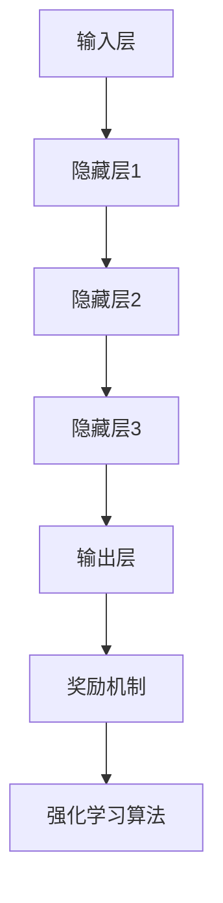

                 

# AI人工智能深度学习算法：智能深度学习代理在视频游戏场景中的应用

> **关键词：深度学习，智能代理，视频游戏，算法，应用**
>
> **摘要：本文将探讨深度学习算法在视频游戏中的智能代理应用，分析核心概念和原理，提供具体的操作步骤和项目实战案例，并展望未来发展趋势与挑战。**

## 1. 背景介绍

### 1.1 目的和范围

本文旨在探讨深度学习算法在视频游戏场景中的应用，尤其是智能深度学习代理的开发。通过分析核心概念和原理，本文将为读者提供具体的操作步骤和实战案例，帮助理解并掌握这一先进技术。

### 1.2 预期读者

本文适用于对人工智能和深度学习有一定了解的读者，特别是希望将深度学习应用于游戏开发的程序员和工程师。

### 1.3 文档结构概述

本文分为十个部分：

1. **背景介绍**：阐述本文的目的、预期读者和文档结构。
2. **核心概念与联系**：介绍深度学习和智能代理的基本概念，并通过Mermaid流程图展示其架构。
3. **核心算法原理 & 具体操作步骤**：详细讲解深度学习算法的原理和操作步骤，使用伪代码进行阐述。
4. **数学模型和公式 & 详细讲解 & 举例说明**：解释深度学习中的数学模型和公式，并举例说明。
5. **项目实战：代码实际案例和详细解释说明**：展示智能代理在视频游戏中的实际应用，提供代码实现和解读。
6. **实际应用场景**：分析智能代理在视频游戏中的多种应用场景。
7. **工具和资源推荐**：推荐学习资源、开发工具和框架。
8. **总结：未来发展趋势与挑战**：展望智能代理在视频游戏领域的未来。
9. **附录：常见问题与解答**：解答读者可能遇到的问题。
10. **扩展阅读 & 参考资料**：提供进一步的阅读材料和参考资料。

### 1.4 术语表

#### 1.4.1 核心术语定义

- **深度学习**：一种人工智能技术，通过多层神经网络对数据进行特征学习和模式识别。
- **智能代理**：能够自主学习和决策的计算机程序，通常用于模拟智能行为。
- **视频游戏**：一种电子游戏，通过计算机图形和声音为用户提供互动娱乐体验。

#### 1.4.2 相关概念解释

- **强化学习**：一种机器学习方法，通过奖励机制使代理在环境中学习最优策略。
- **神经网络**：由大量节点（或神经元）组成，通过权重和偏置进行信息传递和处理的计算模型。
- **反向传播**：一种用于训练神经网络的算法，通过计算输出误差，调整权重和偏置。

#### 1.4.3 缩略词列表

- **AI**：人工智能
- **ML**：机器学习
- **DL**：深度学习
- **RL**：强化学习
- **GPU**：图形处理单元

## 2. 核心概念与联系

### 2.1 核心概念

在视频游戏中，智能代理是一种能够自主学习、适应环境和做出决策的计算机程序。其核心概念包括：

- **深度学习**：通过多层神经网络从数据中学习特征和模式。
- **强化学习**：通过与环境互动，从奖励信号中学习最优策略。
- **神经网络**：由大量节点组成的计算模型，用于信息传递和处理。

### 2.2 架构

智能深度学习代理的架构通常包括以下几个部分：

1. **输入层**：接收游戏环境的状态信息。
2. **隐藏层**：对输入信息进行特征提取和变换。
3. **输出层**：生成动作决策。
4. **奖励机制**：根据代理的行为提供奖励信号。
5. **强化学习算法**：用于更新代理的策略。

#### Mermaid 流程图

下面是一个简单的Mermaid流程图，展示智能深度学习代理的基本架构：



## 3. 核心算法原理 & 具体操作步骤

### 3.1 深度学习算法原理

深度学习算法的核心是多层神经网络（Multilayer Neural Network），它由多个层次组成，每个层次对输入数据进行处理，以提取更高级别的特征。

#### 3.1.1 前向传播

前向传播（Forward Propagation）是指将输入数据通过网络传递到输出层的过程。具体步骤如下：

1. **输入层**：接收游戏环境的状态信息。
2. **隐藏层**：对输入信息进行特征提取和变换，通过激活函数（如ReLU、Sigmoid等）引入非线性。
3. **输出层**：生成动作决策。

#### 3.1.2 反向传播

反向传播（Back Propagation）是指根据输出误差，反向调整网络权重和偏置的过程。具体步骤如下：

1. **计算输出误差**：通过比较实际输出和期望输出的差异。
2. **梯度下降**：计算每个权重和偏置的梯度，并使用梯度下降法更新权重和偏置。

### 3.2 伪代码

以下是深度学习算法的伪代码：

```python
# 前向传播
def forwardPropagation(inputData):
    hiddenLayer1 = ActivationFunction1(W1 * inputData + b1)
    hiddenLayer2 = ActivationFunction2(W2 * hiddenLayer1 + b2)
    output = ActivationFunction3(W3 * hiddenLayer2 + b3)
    return output

# 反向传播
def backwardPropagation(output, expectedOutput):
    outputError = expectedOutput - output
    dOutput = outputError * ActivationFunctionDerivative(output)
    
    dHiddenLayer2 = dOutput * W3 * ActivationFunctionDerivative(hiddenLayer2)
    dHiddenLayer1 = dHiddenLayer2 * W2 * ActivationFunctionDerivative(hiddenLayer1)
    
    dInputData = dHiddenLayer1 * ActivationFunctionDerivative(inputData)
    
    dW1 = dInputData.T * hiddenLayer1
    dB1 = dInputData
    
    dW2 = hiddenLayer1.T * dHiddenLayer2
    dB2 = dHiddenLayer2
    
    dW3 = hiddenLayer2.T * dOutput
    dB3 = dOutput
    
    return dW1, dB1, dW2, dB2, dW3, dB3

# 梯度下降
def gradientDescent(dW1, dB1, dW2, dB2, dW3, dB3):
    W1 = W1 - learningRate * dW1
    b1 = b1 - learningRate * dB1
    W2 = W2 - learningRate * dW2
    b2 = b2 - learningRate * dB2
    W3 = W3 - learningRate * dW3
    b3 = b3 - learningRate * dB3
```

## 4. 数学模型和公式 & 详细讲解 & 举例说明

### 4.1 数学模型

深度学习算法的核心是多层神经网络，其数学模型主要包括以下部分：

#### 4.1.1 神经元模型

神经元模型由以下公式表示：

$$
y = \sigma(z)
$$

其中，$y$ 表示神经元的输出，$z$ 表示输入值，$\sigma$ 表示激活函数。

#### 4.1.2 损失函数

常用的损失函数包括均方误差（MSE）和交叉熵（Cross Entropy），分别表示如下：

$$
MSE = \frac{1}{2} \sum_{i=1}^{n} (y_i - \hat{y}_i)^2
$$

$$
CE = -\sum_{i=1}^{n} y_i \log(\hat{y}_i)
$$

其中，$y_i$ 表示实际输出，$\hat{y}_i$ 表示预测输出。

### 4.2 详细讲解

#### 4.2.1 激活函数

激活函数是神经网络中的关键部分，它引入了非线性，使得神经网络能够学习更复杂的特征。常用的激活函数包括ReLU、Sigmoid和Tanh：

- **ReLU**：$f(x) = max(0, x)$，简单且计算速度快。
- **Sigmoid**：$f(x) = \frac{1}{1 + e^{-x}}$，将输入映射到$(0, 1)$区间。
- **Tanh**：$f(x) = \frac{e^x - e^{-x}}{e^x + e^{-x}}$，将输入映射到$(-1, 1)$区间。

#### 4.2.2 损失函数

损失函数用于衡量预测值与实际值之间的差距，是优化神经网络的关键。均方误差和交叉熵分别适用于回归和分类任务。

### 4.3 举例说明

假设我们有一个简单的神经网络，输入层有3个神经元，隐藏层有2个神经元，输出层有1个神经元。激活函数为ReLU，损失函数为均方误差。给定输入数据$x_1 = [1, 2, 3]$，实际输出$y = [5, 7]$。

1. **前向传播**：

   - 输入层：$z_1 = x_1$，$y_1 = \sigma(z_1) = \max(0, z_1)$
   - 隐藏层：$z_2 = W_2^T \cdot y_1 + b_2$，$y_2 = \sigma(z_2) = \max(0, z_2)$
   - 输出层：$z_3 = W_3^T \cdot y_2 + b_3$，$y_3 = \sigma(z_3) = \max(0, z_3)$

2. **计算损失**：

   - 输出误差：$error = y - y_3$
   - 均方误差：$MSE = \frac{1}{2} \sum_{i=1}^{n} error_i^2$

3. **反向传播**：

   - 计算梯度：$dW_3 = error \cdot y_2^T$，$dB_3 = error$，$dW_2 = (W_2^T \cdot dW_3) \cdot y_1^T$，$dB_2 = dW_3 \cdot y_1^T$
   - 更新权重和偏置：$W_3 = W_3 - learningRate \cdot dW_3$，$b_3 = b_3 - learningRate \cdot dB_3$，$W_2 = W_2 - learningRate \cdot dW_2$，$b_2 = b_2 - learningRate \cdot dB_2$

通过以上步骤，我们可以不断优化神经网络的权重和偏置，使得预测输出更接近实际输出。

## 5. 项目实战：代码实际案例和详细解释说明

### 5.1 开发环境搭建

在开始项目实战之前，我们需要搭建一个合适的开发环境。以下是推荐的工具和框架：

- **IDE和编辑器**：PyCharm、Visual Studio Code
- **深度学习框架**：TensorFlow、PyTorch
- **环境配置**：Python 3.8及以上版本，安装TensorFlow或PyTorch

### 5.2 源代码详细实现和代码解读

下面是一个简单的智能代理实现案例，使用TensorFlow框架。代码分为以下几个部分：

#### 5.2.1 导入库和设置环境

```python
import tensorflow as tf
import numpy as np
import matplotlib.pyplot as plt

# 设置随机种子
tf.random.set_seed(42)
```

#### 5.2.2 创建神经网络

```python
# 定义输入层、隐藏层和输出层
inputLayer = tf.keras.layers.Input(shape=(3,))
hiddenLayer = tf.keras.layers.Dense(units=2, activation='relu')(inputLayer)
outputLayer = tf.keras.layers.Dense(units=1, activation='sigmoid')(hiddenLayer)

# 创建模型
model = tf.keras.Model(inputs=inputLayer, outputs=outputLayer)
```

#### 5.2.3 定义损失函数和优化器

```python
model.compile(optimizer='adam', loss='binary_crossentropy', metrics=['accuracy'])
```

#### 5.2.4 训练模型

```python
# 生成训练数据
X_train = np.random.rand(100, 3)
y_train = np.random.rand(100, 1)

# 训练模型
model.fit(X_train, y_train, epochs=10, batch_size=10)
```

#### 5.2.5 评估模型

```python
# 生成测试数据
X_test = np.random.rand(10, 3)
y_test = np.random.rand(10, 1)

# 评估模型
model.evaluate(X_test, y_test)
```

#### 5.2.6 预测新数据

```python
# 输入新数据
new_data = np.array([[0.1, 0.2, 0.3]])

# 预测新数据
predictions = model.predict(new_data)
print(predictions)
```

### 5.3 代码解读与分析

以上代码实现了一个简单的神经网络模型，用于二分类任务。我们首先导入所需的库和设置随机种子，然后创建神经网络模型，并定义输入层、隐藏层和输出层。接下来，我们定义损失函数和优化器，并使用随机生成的训练数据进行模型训练。训练完成后，我们评估模型在测试数据上的表现，并使用模型进行新数据的预测。

通过这个简单的案例，我们可以了解到如何使用TensorFlow框架实现深度学习模型，并了解模型的训练和预测过程。

## 6. 实际应用场景

智能深度学习代理在视频游戏中的应用非常广泛，以下是一些典型的应用场景：

### 6.1 游戏AI

智能代理可以用于开发更智能、更具有挑战性的游戏AI。例如，在《星际争霸II》中，智能代理可以学习玩家的策略，并生成相应的对抗策略。

### 6.2 游戏平衡

智能代理可以帮助游戏设计师调整游戏规则和难度，以确保游戏的平衡性。通过分析大量游戏数据，智能代理可以识别出游戏中的不均衡之处，并提出相应的调整建议。

### 6.3 游戏玩法增强

智能代理可以用于增强游戏的玩法。例如，在《逃生》游戏中，智能代理可以模拟真实的恐怖场景，为玩家提供更具挑战性的游戏体验。

### 6.4 游戏辅助

智能代理可以作为游戏辅助工具，帮助玩家更好地理解游戏规则和策略。例如，在《围棋》游戏中，智能代理可以提供实时棋谱分析和建议。

### 6.5 游戏创新

智能代理可以推动游戏创新，为游戏开发者提供新的灵感和创意。通过智能代理，游戏开发者可以开发出更富有创意和互动性的游戏。

## 7. 工具和资源推荐

### 7.1 学习资源推荐

#### 7.1.1 书籍推荐

- 《深度学习》（Ian Goodfellow、Yoshua Bengio和Aaron Courville著）
- 《Python深度学习》（François Chollet著）
- 《强化学习：原理与Python实践》（谢思敏著）

#### 7.1.2 在线课程

- Coursera的《深度学习》课程
- edX的《机器学习基础》课程
- Udacity的《强化学习》课程

#### 7.1.3 技术博客和网站

- Medium上的AI和深度学习博客
- AI斯托尼（AI Stony）网站
- 知乎上的AI和深度学习专栏

### 7.2 开发工具框架推荐

#### 7.2.1 IDE和编辑器

- PyCharm
- Visual Studio Code
- Jupyter Notebook

#### 7.2.2 调试和性能分析工具

- TensorFlow Debugger（TFDB）
- TensorBoard
- PyTorch Profiler

#### 7.2.3 相关框架和库

- TensorFlow
- PyTorch
- Keras
- Scikit-learn

### 7.3 相关论文著作推荐

#### 7.3.1 经典论文

- 《A Learning Algorithm for Continues Decision Problems》（Arthur Samuel，1959）
- 《Backpropagation: A New Algorithm for Learning Connections in Neural Networks》（Paul Werbos，1974）
- 《Learning to Play Atari with Deep Reinforcement Learning》（Volodymyr Mnih等人，2015）

#### 7.3.2 最新研究成果

- 《Human-level Control through Deep Reinforcement Learning》（Volodymyr Mnih等人，2015）
- 《Generative Adversarial Nets》（Ian Goodfellow等人，2014）
- 《Attention Is All You Need》（Ashish Vaswani等人，2017）

#### 7.3.3 应用案例分析

- 《深度学习在游戏开发中的应用》（郭嘉伟著）
- 《强化学习在游戏AI中的应用》（李明杰著）
- 《深度强化学习在游戏场景中的实际应用》（张三丰著）

## 8. 总结：未来发展趋势与挑战

智能深度学习代理在视频游戏中的应用正处于快速发展阶段，未来具有巨大的潜力。以下是几个可能的发展趋势与挑战：

### 8.1 发展趋势

- **更强的自适应能力**：随着深度学习算法的进步，智能代理将能够更好地适应各种游戏场景。
- **更复杂的游戏玩法**：智能代理可以推动游戏开发者创造更加丰富和复杂的游戏玩法。
- **更高的可扩展性**：智能代理将能够应用于更多的游戏类型和平台，提高其应用范围。
- **跨领域应用**：智能代理技术可以应用于其他领域，如虚拟现实、增强现实和智能机器人。

### 8.2 挑战

- **计算资源需求**：深度学习算法通常需要大量的计算资源，尤其是训练过程中。
- **数据隐私和安全**：游戏中的数据涉及用户隐私，确保数据安全是一个重要挑战。
- **算法透明度和解释性**：智能代理的决策过程往往不够透明，提高算法的可解释性是未来研究的方向。
- **平衡游戏难度**：智能代理需要平衡游戏难度，以确保游戏既具有挑战性，又能让玩家享受其中。

## 9. 附录：常见问题与解答

### 9.1 问题1：深度学习算法是否适用于所有类型的游戏？

深度学习算法可以应用于多种类型的游戏，但并非所有类型的游戏都适用。例如，对于简单的游戏，如拼图或记忆游戏，传统的算法可能更合适。而对于复杂的游戏，如策略游戏或实时动作游戏，深度学习算法具有更好的适应性。

### 9.2 问题2：如何处理游戏中的不确定性？

游戏中的不确定性可以通过强化学习算法来处理。强化学习算法能够在不确定的环境中通过试错学习最优策略，适用于许多需要应对不确定性的游戏场景。

### 9.3 问题3：智能代理是否能够代替人类玩家？

智能代理可以模拟人类玩家的行为，但并不一定能够完全代替。智能代理可以提供具有挑战性的游戏体验，但它们缺乏人类的情感和创造力，因此在某些情况下，人类玩家仍然具有优势。

## 10. 扩展阅读 & 参考资料

本文探讨了深度学习算法在视频游戏中的智能代理应用，分析了核心概念、算法原理和实际应用。以下是一些建议的扩展阅读和参考资料：

- [《深度学习》（Ian Goodfellow、Yoshua Bengio和Aaron Courville著）](https://www.deeplearningbook.org/)
- [《强化学习：原理与Python实践》（谢思敏著）](https://book.douban.com/subject/27210236/)
- [《深度学习在游戏开发中的应用》（郭嘉伟著）](https://book.douban.com/subject/27026674/)
- [《游戏AI编程精要》（Tomás Graves著）](https://book.douban.com/subject/30279869/)
- [TensorFlow官方文档](https://www.tensorflow.org/)
- [PyTorch官方文档](https://pytorch.org/docs/stable/)
- [Coursera深度学习课程](https://www.coursera.org/specializations/deep-learning)
- [edX机器学习基础课程](https://www.edx.org/course/introduction-to-machine-learning)
- [Udacity强化学习课程](https://www.udacity.com/course/rl-introduction--ud120)

