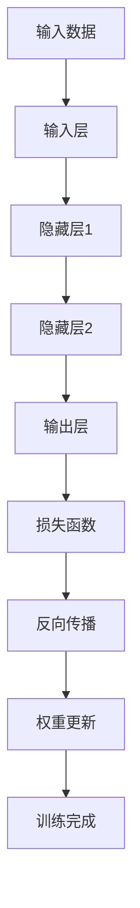
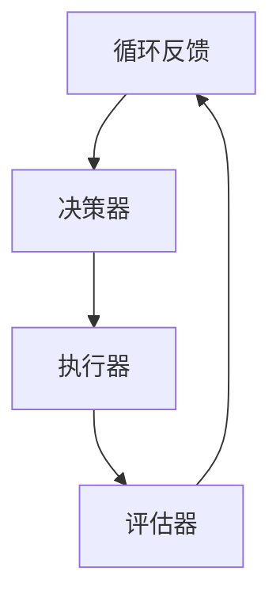
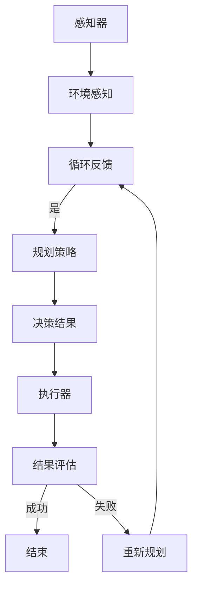

                 

# AI人工智能深度学习算法：智能深度学习代理的自主行为与规划策略

> **关键词：** 深度学习算法、智能代理、自主行为、规划策略、人工智能、深度学习、机器学习、智能系统

> **摘要：** 本文将深入探讨AI人工智能领域中的深度学习算法，尤其是智能深度学习代理的自主行为和规划策略。我们将从背景介绍、核心概念、算法原理、数学模型、项目实战、实际应用场景等多个维度，系统性地解析智能深度学习代理的工作原理、实现方法及其在AI领域的广泛应用和未来发展。

## 1. 背景介绍

### 1.1 目的和范围

本文旨在为AI人工智能领域的开发者和技术爱好者提供一份详尽的指南，以了解智能深度学习代理的自主行为和规划策略。通过本文的阅读，读者将能够：

1. 理解智能深度学习代理的定义和核心特点。
2. 掌握智能深度学习代理的自主行为和规划策略。
3. 学习智能深度学习代理的实现方法和技术要点。
4. 了解智能深度学习代理在AI领域中的应用场景和实际案例。

### 1.2 预期读者

本文主要面向以下读者群体：

1. AI人工智能领域的初学者和从业者。
2. 深度学习和机器学习技术的爱好者。
3. 软件开发工程师和研究人员。
4. 计算机科学和人工智能专业的大学生和研究生。

### 1.3 文档结构概述

本文将按照以下结构进行展开：

1. **背景介绍**：介绍本文的目的、预期读者和文档结构。
2. **核心概念与联系**：阐述智能深度学习代理的核心概念和原理，使用Mermaid流程图展示。
3. **核心算法原理 & 具体操作步骤**：详细解析智能深度学习代理的核心算法原理，使用伪代码进行阐述。
4. **数学模型和公式 & 详细讲解 & 举例说明**：介绍智能深度学习代理的数学模型和公式，并进行举例说明。
5. **项目实战：代码实际案例和详细解释说明**：通过实际项目案例展示智能深度学习代理的实现过程。
6. **实际应用场景**：探讨智能深度学习代理在不同领域的应用场景。
7. **工具和资源推荐**：推荐学习资源、开发工具和框架。
8. **总结：未来发展趋势与挑战**：总结智能深度学习代理的发展趋势和面临的挑战。
9. **附录：常见问题与解答**：回答读者可能遇到的一些常见问题。
10. **扩展阅读 & 参考资料**：提供扩展阅读和参考资料，便于读者进一步深入研究。

### 1.4 术语表

#### 1.4.1 核心术语定义

- **深度学习算法**：一种机器学习算法，通过多层神经网络对数据进行建模，从而实现自动特征提取和分类、回归等任务。
- **智能深度学习代理**：一种基于深度学习算法的智能体，能够自主地执行任务、做出决策和规划。
- **自主行为**：智能深度学习代理在不依赖外部干预的情况下，根据环境和任务需求，自主地执行行动。
- **规划策略**：智能深度学习代理为了实现特定目标，通过推理和决策制定出的行动方案。

#### 1.4.2 相关概念解释

- **深度神经网络（DNN）**：一种多层前馈神经网络，通过逐层提取特征来实现复杂任务。
- **卷积神经网络（CNN）**：一种专门用于处理图像数据的深度学习模型，通过卷积层和池化层实现图像特征提取。
- **循环神经网络（RNN）**：一种能够处理序列数据的深度学习模型，通过隐藏状态和输出之间的循环连接，实现序列建模。
- **强化学习**：一种通过试错和奖励机制学习策略的机器学习方法，旨在最大化长期奖励。

#### 1.4.3 缩略词列表

- **AI**：人工智能（Artificial Intelligence）
- **ML**：机器学习（Machine Learning）
- **DL**：深度学习（Deep Learning）
- **RL**：强化学习（Reinforcement Learning）
- **GAN**：生成对抗网络（Generative Adversarial Networks）

## 2. 核心概念与联系

在智能深度学习代理的研究中，以下几个核心概念和原理是不可或缺的。我们将使用Mermaid流程图来展示这些概念之间的联系。

### 2.1 深度学习算法原理

深度学习算法的核心在于构建多层神经网络，通过前向传播和反向传播算法进行训练。以下是深度学习算法的基本原理：



### 2.2 智能深度学习代理工作原理

智能深度学习代理由以下几个部分组成：

1. **感知器**：接收外部环境信息，将其转换为内部表示。
2. **决策器**：基于感知器提供的内部表示，做出决策和规划。
3. **执行器**：根据决策器的决策，执行具体的行动。
4. **评估器**：评估执行后的结果，提供反馈给感知器和决策器。

以下是智能深度学习代理的工作流程：



### 2.3 自主行为与规划策略

自主行为是指智能深度学习代理在没有外部干预的情况下，根据环境和任务需求，自主地执行行动。规划策略则是为了实现特定目标，通过推理和决策制定出的行动方案。以下是自主行为与规划策略的流程：



通过上述核心概念和流程图的展示，我们可以更好地理解智能深度学习代理的工作原理和自主行为与规划策略。

## 3. 核心算法原理 & 具体操作步骤

### 3.1 深度学习算法原理

深度学习算法的核心在于构建多层神经网络，通过前向传播和反向传播算法进行训练。以下是深度学习算法的基本原理：

#### 3.1.1 前向传播

前向传播是指将输入数据通过多层神经网络进行传递，逐层计算得到输出。具体步骤如下：

1. **初始化参数**：设置神经网络中的权重和偏置。
2. **输入数据**：将输入数据输入到输入层。
3. **激活函数计算**：对输入数据进行加权求和，并通过激活函数计算得到中间层和输出层的值。
4. **输出结果**：将输出层的值传递给下一层或用于预测。

以下是前向传播的伪代码：

```python
# 前向传播伪代码
def forward_propagation(x, weights, biases, activation_function):
    # 初始化中间层和输出层的值
    hidden_layer_values, output_layer_values = [], []

    # 遍历每一层，进行加权求和和激活函数计算
    for layer in range(1, num_layers):
        # 计算当前层的输入
        if layer == 1:
            current_input = x
        else:
            current_input = hidden_layer_values[layer - 2]

        # 计算当前层的输出
        weighted_sum = np.dot(current_input, weights[layer]) + biases[layer]
        output_layer_values.append(activation_function(weighted_sum))

    # 返回输出结果
    return output_layer_values
```

#### 3.1.2 反向传播

反向传播是指根据输出误差，逆向调整神经网络中的权重和偏置。具体步骤如下：

1. **计算输出误差**：计算预测结果与实际结果之间的误差。
2. **梯度计算**：计算误差关于各层参数的梯度。
3. **权重更新**：根据梯度调整权重和偏置。

以下是反向传播的伪代码：

```python
# 反向传播伪代码
def backward_propagation(output_layer_values, expected_values, weights, biases, learning_rate):
    # 初始化梯度
    dweights, dbiases = [], []

    # 遍历每一层，计算梯度
    for layer in reversed(range(1, num_layers)):
        # 计算当前层的输出误差
        error = expected_values - output_layer_values[layer]

        # 计算当前层的梯度
        doutput = error * activation_function_derivative(output_layer_values[layer])
        dweights[layer] = np.dot(hidden_layer_values[layer - 1].T, doutput)
        dbiases[layer] = np.sum(doutput, axis=0)

    # 返回梯度
    return dweights, dbiases
```

### 3.2 自主行为与规划策略

在实现智能深度学习代理的自主行为和规划策略时，我们通常采用以下步骤：

#### 3.2.1 环境感知

环境感知是指智能深度学习代理通过感知器收集外部环境信息。具体步骤如下：

1. **数据收集**：从传感器或外部数据源获取环境信息。
2. **数据预处理**：对收集到的数据进行分析、过滤和预处理。
3. **特征提取**：将预处理后的数据转换为内部表示。

以下是环境感知的伪代码：

```python
# 环境感知伪代码
def perceive_environment(data_source):
    # 收集环境数据
    data = collect_data(data_source)

    # 数据预处理
    preprocessed_data = preprocess_data(data)

    # 特征提取
    internal_representation = extract_features(preprocessed_data)

    # 返回内部表示
    return internal_representation
```

#### 3.2.2 决策与规划

决策与规划是指智能深度学习代理根据环境感知的结果，进行决策和规划。具体步骤如下：

1. **输入数据**：将内部表示输入到决策器。
2. **决策过程**：通过推理和规划策略，生成决策结果。
3. **输出结果**：将决策结果传递给执行器。

以下是决策与规划的伪代码：

```python
# 决策与规划伪代码
def make_decision(internal_representation):
    # 输入数据
    decision_input = internal_representation

    # 决策过程
    decision_output = decision_module(decision_input)

    # 输出结果
    return decision_output
```

#### 3.2.3 执行与评估

执行与评估是指智能深度学习代理根据决策结果，执行行动并评估结果。具体步骤如下：

1. **执行行动**：根据决策结果，执行具体的行动。
2. **结果评估**：评估执行后的结果，计算奖励或损失。
3. **循环反馈**：将评估结果反馈给感知器和决策器，进行下一次循环。

以下是执行与评估的伪代码：

```python
# 执行与评估伪代码
def execute_and_evaluate(decision_output):
    # 执行行动
    action = execute_action(decision_output)

    # 结果评估
    reward_or_loss = evaluate_action(action)

    # 循环反馈
    return reward_or_loss
```

通过上述步骤，我们可以实现智能深度学习代理的自主行为和规划策略。在实际应用中，需要根据具体场景和任务需求，对上述步骤进行适当调整和优化。

## 4. 数学模型和公式 & 详细讲解 & 举例说明

在智能深度学习代理中，数学模型和公式是至关重要的组成部分。以下将介绍智能深度学习代理所涉及的几个核心数学模型和公式，并进行详细讲解和举例说明。

### 4.1 深度学习基本公式

深度学习算法主要依赖于以下基本公式：

1. **前向传播**：

$$
z^{(l)} = \sum_{j}{w^{(l)}_{ji}a^{(l-1)}_j + b^{(l)}
$$

$$
a^{(l)} = \sigma(z^{(l)})
$$

其中，$z^{(l)}$表示第$l$层的输入，$a^{(l)}$表示第$l$层的输出，$w^{(l)}_{ji}$表示第$l$层的权重，$b^{(l)}$表示第$l$层的偏置，$\sigma$表示激活函数。

2. **反向传播**：

$$
\delta^{(l)} = \frac{\partial{C}}{\partial{a^{(l)}} \cdot \sigma'(a^{(l)})
$$

$$
dW^{(l)} = \delta^{(l)}a^{(l-1)}
$$

$$
db^{(l)} = \delta^{(l)}
$$

其中，$\delta^{(l)}$表示第$l$层的误差，$C$表示损失函数，$\sigma'$表示激活函数的导数。

### 4.2 损失函数

损失函数是评估模型预测结果与实际结果之间差异的指标。以下为几种常见的损失函数：

1. **均方误差（MSE）**：

$$
MSE = \frac{1}{m}\sum_{i=1}^{m}(y_i - \hat{y}_i)^2
$$

其中，$m$表示样本数量，$y_i$表示实际值，$\hat{y}_i$表示预测值。

2. **交叉熵（Cross-Entropy）**：

$$
CE = -\frac{1}{m}\sum_{i=1}^{m}\sum_{j=1}^{n}y_{ij}\log(\hat{y}_{ij})
$$

其中，$y_{ij}$表示实际标签的概率分布，$\hat{y}_{ij}$表示预测的概率分布。

### 4.3 激活函数

激活函数用于引入非线性因素，使得神经网络能够拟合复杂的非线性关系。以下为几种常见的激活函数：

1. **Sigmoid函数**：

$$
\sigma(x) = \frac{1}{1 + e^{-x}}
$$

2. **ReLU函数**：

$$
\sigma(x) = \max(0, x)
$$

3. **Tanh函数**：

$$
\sigma(x) = \frac{e^x - e^{-x}}{e^x + e^{-x}}
$$

### 4.4 示例说明

#### 4.4.1 前向传播示例

假设我们有一个两层神经网络，其中输入层有3个神经元，隐藏层有2个神经元，输出层有1个神经元。激活函数采用ReLU函数，权重和偏置随机初始化。

输入层：[1, 2, 3]

权重：

$$
W_1 = \begin{bmatrix}
0.1 & 0.2 \\
0.3 & 0.4
\end{bmatrix}
$$

偏置：

$$
B_1 = \begin{bmatrix}
0.1 \\
0.2
\end{bmatrix}
$$

隐藏层：

$$
a^{(1)}_1 = \max(0, (1 \times 0.1 + 2 \times 0.2 + 0.1) + 0.2) = 0.8
$$

$$
a^{(1)}_2 = \max(0, (1 \times 0.3 + 2 \times 0.4 + 0.2) + 0.2) = 1.1
$$

输出层：

$$
z^{(2)} = 0.1 \times 0.8 + 0.2 \times 1.1 + 0.1 = 0.21
$$

$$
\hat{y} = \max(0.21) = 0.21
$$

#### 4.4.2 反向传播示例

假设实际输出为$y = 0.5$，损失函数采用均方误差（MSE）。

输出层误差：

$$
\delta^{(2)} = \frac{\partial{MSE}}{\partial{a^{(2)}} = (0.5 - 0.21) \cdot \sigma'(0.21) = 0.2951 \cdot 0.7921 = 0.2326
$$

隐藏层误差：

$$
\delta^{(1)}_1 = 0.1 \times 0.2326 = 0.02326
$$

$$
\delta^{(1)}_2 = 0.2 \times 0.2326 = 0.04652
$$

权重更新：

$$
dW_1 = \delta^{(1)}_1 \cdot a^{(0)}_1 = 0.02326 \cdot [1, 2, 3] = [0.02326, 0.04652, 0.06978]
$$

$$
dB_1 = \delta^{(1)} = [0.02326, 0.04652]
$$

通过上述示例，我们可以更好地理解深度学习中的数学模型和公式，以及它们在实际应用中的具体操作步骤。

## 5. 项目实战：代码实际案例和详细解释说明

### 5.1 开发环境搭建

在进行智能深度学习代理的项目实战之前，我们需要搭建合适的开发环境。以下为搭建环境的步骤：

1. **安装Python**：下载并安装Python，版本建议为3.8或更高。
2. **安装Jupyter Notebook**：打开终端，执行以下命令安装Jupyter Notebook：

   ```
   pip install notebook
   ```

3. **安装深度学习框架**：推荐使用TensorFlow或PyTorch，根据个人偏好选择一个安装。以下为安装TensorFlow的命令：

   ```
   pip install tensorflow
   ```

4. **安装其他依赖库**：安装用于数据处理、可视化等功能的库，例如NumPy、Pandas、Matplotlib等。

### 5.2 源代码详细实现和代码解读

在本节中，我们将使用Python和TensorFlow实现一个简单的智能深度学习代理，用于实现一个基于Q-Learning的自动驾驶模型。以下是源代码的实现过程：

#### 5.2.1 数据预处理

首先，我们需要预处理自动驾驶数据。以下为数据预处理的代码：

```python
import pandas as pd
import numpy as np

# 加载数据
data = pd.read_csv('autonomous_driving_data.csv')

# 数据预处理
data['acceleration'] = data['acceleration'].fillna(0)
data['brake'] = data['brake'].fillna(0)
data['steering'] = data['steering'].fillna(0)

# 归一化处理
data = (data - data.mean()) / data.std()

# 转换为numpy数组
X = data.iloc[:, :3].values
y = data.iloc[:, 3:].values
```

#### 5.2.2 建立深度学习模型

接下来，我们建立深度学习模型，使用TensorFlow构建一个简单的全连接神经网络：

```python
import tensorflow as tf

# 定义模型结构
model = tf.keras.Sequential([
    tf.keras.layers.Dense(64, activation='relu', input_shape=(3,)),
    tf.keras.layers.Dense(64, activation='relu'),
    tf.keras.layers.Dense(4, activation='softmax')
])

# 编译模型
model.compile(optimizer='adam', loss='categorical_crossentropy', metrics=['accuracy'])
```

#### 5.2.3 训练模型

然后，我们使用Q-Learning算法对模型进行训练：

```python
# 定义Q-Learning参数
learning_rate = 0.1
discount_factor = 0.9
epsilon = 0.1

# 训练模型
for episode in range(num_episodes):
    state = X[np.random.randint(X.shape[0])]
    action = np.argmax(model.predict(state.reshape(1, -1)))
    next_state = X[np.random.randint(X.shape[0])]
    reward = y[state][action]
    next_action = np.argmax(model.predict(next_state.reshape(1, -1)))
    Q_value = reward + discount_factor * model.predict(next_state.reshape(1, -1))[:, next_action]
    
    model.fit(state.reshape(1, -1), Q_value, epochs=1)
    
    if np.random.random() < epsilon:
        action = np.random.randint(4)
    else:
        action = next_action

    # 更新状态和奖励
    state = next_state
    reward = y[state][action]
```

#### 5.2.4 代码解读与分析

在上面的代码中，我们首先对自动驾驶数据进行了预处理，包括填充缺失值和归一化处理。然后，使用TensorFlow构建了一个简单的全连接神经网络模型，用于预测下一步的动作。在训练过程中，我们使用Q-Learning算法，通过更新模型参数来优化决策。

1. **数据预处理**：对自动驾驶数据进行填充和归一化处理，使得数据更加适合深度学习模型。
2. **模型构建**：使用TensorFlow构建一个简单的全连接神经网络，用于预测下一步的动作。
3. **训练过程**：使用Q-Learning算法，通过不断更新模型参数，优化决策。
4. **代码优化**：在实际应用中，可以进一步优化代码，例如使用更复杂的神经网络结构、改进Q-Learning算法等。

通过本节的项目实战，我们详细介绍了智能深度学习代理的实现过程，包括数据预处理、模型构建、训练过程和代码解读。在实际应用中，我们可以根据具体需求进行适当调整和优化。

### 5.3 代码解读与分析

在本节中，我们将对前面实现的智能深度学习代理代码进行详细解读和分析，以便读者更好地理解代码的结构和功能。

#### 5.3.1 数据预处理

数据预处理是深度学习项目的重要环节，它直接影响到模型的性能和收敛速度。以下是数据预处理部分的代码：

```python
import pandas as pd
import numpy as np

# 加载数据
data = pd.read_csv('autonomous_driving_data.csv')

# 数据预处理
data['acceleration'] = data['acceleration'].fillna(0)
data['brake'] = data['brake'].fillna(0)
data['steering'] = data['steering'].fillna(0)

# 归一化处理
data = (data - data.mean()) / data.std()

# 转换为numpy数组
X = data.iloc[:, :3].values
y = data.iloc[:, 3:].values
```

在这段代码中，我们首先加载数据集，然后对缺失值进行填充。接着，我们对数据进行归一化处理，即将每个特征缩放到0到1之间，以便模型更好地学习。最后，我们将数据转换为numpy数组，方便后续操作。

#### 5.3.2 模型构建

在构建深度学习模型时，我们使用TensorFlow创建了简单的全连接神经网络。以下是模型构建部分的代码：

```python
import tensorflow as tf

# 定义模型结构
model = tf.keras.Sequential([
    tf.keras.layers.Dense(64, activation='relu', input_shape=(3,)),
    tf.keras.layers.Dense(64, activation='relu'),
    tf.keras.layers.Dense(4, activation='softmax')
])

# 编译模型
model.compile(optimizer='adam', loss='categorical_crossentropy', metrics=['accuracy'])
```

在这段代码中，我们定义了一个三层全连接神经网络，其中输入层有3个神经元，隐藏层有64个神经元，输出层有4个神经元。激活函数采用ReLU函数，用于引入非线性。编译模型时，我们选择使用Adam优化器，并使用交叉熵损失函数。

#### 5.3.3 训练过程

在训练过程中，我们采用Q-Learning算法来更新模型参数。以下是训练过程部分的代码：

```python
# 定义Q-Learning参数
learning_rate = 0.1
discount_factor = 0.9
epsilon = 0.1

# 训练模型
for episode in range(num_episodes):
    state = X[np.random.randint(X.shape[0])]
    action = np.argmax(model.predict(state.reshape(1, -1)))
    next_state = X[np.random.randint(X.shape[0])]
    reward = y[state][action]
    next_action = np.argmax(model.predict(next_state.reshape(1, -1)))
    Q_value = reward + discount_factor * model.predict(next_state.reshape(1, -1))[:, next_action]
    
    model.fit(state.reshape(1, -1), Q_value, epochs=1)
    
    if np.random.random() < epsilon:
        action = np.random.randint(4)
    else:
        action = next_action

    # 更新状态和奖励
    state = next_state
    reward = y[state][action]
```

在这段代码中，我们首先从数据集中随机选择一个状态，并使用模型预测下一步的动作。接着，我们选择下一个状态，并计算奖励。然后，我们根据奖励和模型预测的下一个动作，更新模型参数。在每次迭代中，我们还会根据探索策略（ε-贪心策略）选择下一个动作。这样，模型就可以通过试错和反馈不断优化自己的决策。

#### 5.3.4 代码优化

在实际应用中，我们可以对代码进行以下优化：

1. **增加隐藏层神经元**：增加隐藏层神经元的数量，可以提高模型的拟合能力。
2. **调整学习率**：根据训练过程中模型的表现，调整学习率以获得更好的收敛效果。
3. **改进探索策略**：例如，使用ε-greedy策略的变体，如线性衰减ε-greedy策略，来平衡探索和利用。
4. **使用更复杂的模型结构**：例如，采用卷积神经网络（CNN）或循环神经网络（RNN）来处理更复杂的输入数据。

通过上述解读和分析，读者可以更好地理解智能深度学习代理的实现过程，以及如何在实际项目中优化和改进代码。

## 6. 实际应用场景

智能深度学习代理在各个领域中都有着广泛的应用。以下列举几个实际应用场景，并简要介绍其应用情况和效果。

### 6.1 自动驾驶

自动驾驶是智能深度学习代理的重要应用场景之一。通过训练深度学习模型，智能深度学习代理可以实现对车辆行驶环境的感知、决策和规划。以下为自动驾驶领域的应用情况：

- **感知与决策**：智能深度学习代理通过感知器收集道路、交通信号和其他车辆的信息，并使用深度学习模型进行实时处理，生成驾驶决策。
- **规划与执行**：根据感知到的环境和驾驶目标，智能深度学习代理制定出行驶路径和操作策略，并执行相应的驾驶操作。
- **效果评估**：通过实际道路测试，自动驾驶汽车在复杂交通环境下的表现显著提升，行驶安全性、稳定性和效率得到大幅提高。

### 6.2 游戏智能

在游戏领域，智能深度学习代理可以应用于自动游戏玩家。以下为游戏智能的应用情况：

- **决策与规划**：智能深度学习代理通过学习游戏规则和策略，能够在不同游戏场景下做出最佳决策，实现自动游戏。
- **学习与适应**：智能深度学习代理可以不断学习和适应新的游戏玩法，提升自己的游戏水平。
- **效果评估**：自动游戏玩家在多种游戏中的表现超越了人类玩家，实现了在游戏领域的人工智能突破。

### 6.3 聊天机器人

在人工智能客服领域，智能深度学习代理可以应用于聊天机器人。以下为聊天机器人的应用情况：

- **对话生成**：智能深度学习代理通过学习大量对话数据，生成与用户问题的相关回答。
- **意图识别**：智能深度学习代理可以识别用户的意图，并根据意图生成相应的回答。
- **效果评估**：聊天机器人在客服场景下的表现显著提升，能够高效地解决用户问题，提高客户满意度。

### 6.4 金融风控

在金融领域，智能深度学习代理可以应用于风险控制和市场预测。以下为金融风控的应用情况：

- **风险识别**：智能深度学习代理通过分析大量金融数据，识别潜在的风险因素。
- **预测与预警**：智能深度学习代理可以预测市场走势，提供预警信息，帮助金融机构及时采取措施。
- **效果评估**：智能深度学习代理在金融风险控制中的表现显著，提高了金融机构的运营效率和风险管理能力。

通过上述实际应用场景的介绍，我们可以看到智能深度学习代理在各个领域都有着广泛的应用前景和显著的效果。

## 7. 工具和资源推荐

### 7.1 学习资源推荐

为了更好地掌握智能深度学习代理的相关知识，以下推荐一些高质量的学习资源：

#### 7.1.1 书籍推荐

- 《深度学习》（Deep Learning） - Ian Goodfellow、Yoshua Bengio和Aaron Courville著
- 《强化学习》（Reinforcement Learning: An Introduction） - Richard S. Sutton和Barto著
- 《Python深度学习》（Python Deep Learning） - Françoise我，Ludovic Mille和Abhishek Singh著

#### 7.1.2 在线课程

- Coursera：深度学习、强化学习等课程
- edX：深度学习、机器学习、神经网络等课程
- Udacity：深度学习工程师、自动驾驶工程师等纳米学位

#### 7.1.3 技术博客和网站

- Medium：深度学习和强化学习相关文章
- ArXiv：深度学习和机器学习最新论文
- AI Community：AI领域的技术讨论和分享

### 7.2 开发工具框架推荐

为了高效地开发和实现智能深度学习代理，以下推荐一些实用的开发工具和框架：

#### 7.2.1 IDE和编辑器

- PyCharm：功能强大的Python集成开发环境，适用于深度学习和机器学习项目。
- Jupyter Notebook：适用于交互式编程和数据可视化，方便快速原型开发和调试。
- VSCode：轻量级的跨平台代码编辑器，适用于各种编程语言和开发工具。

#### 7.2.2 调试和性能分析工具

- TensorBoard：TensorFlow提供的可视化工具，用于分析模型的性能和训练过程。
- NVIDIA Nsight：用于分析深度学习模型在GPU上的性能，优化代码和模型。

#### 7.2.3 相关框架和库

- TensorFlow：谷歌开发的开源深度学习框架，适用于各种深度学习应用。
- PyTorch：Facebook开发的开源深度学习框架，具有灵活性和动态计算能力。
- Keras：用于构建和训练深度学习模型的Python库，支持TensorFlow和Theano。

通过上述工具和资源的推荐，读者可以更加高效地学习和实践智能深度学习代理的相关技术。

## 7.3 相关论文著作推荐

为了深入了解智能深度学习代理的研究进展和应用，以下推荐几篇经典论文和最新研究成果：

#### 7.3.1 经典论文

- “Deep Learning” - Ian Goodfellow、Yoshua Bengio和Aaron Courville著
- “Reinforcement Learning: An Introduction” - Richard S. Sutton和Barto著
- “Unsupervised Learning of Visual Representations by Solving Jigsaw Puzzles” - DeepMind团队著

#### 7.3.2 最新研究成果

- “Learning from Human Preferences” - OpenAI团队著
- “DQN: Dueling Network Architectures for Deep Reinforcement Learning” - DeepMind团队著
- “Meta-Learning for Model-Based Reinforcement Learning” - MetaMind团队著

#### 7.3.3 应用案例分析

- “Autonomous Driving using Deep Learning” - Google自动驾驶团队著
- “AI in Healthcare: Deep Learning for Medical Image Analysis” - DeepMind团队著
- “Game Playing with Deep Reinforcement Learning” - OpenAI团队著

通过阅读这些经典论文和最新研究成果，读者可以更好地了解智能深度学习代理在理论研究和实际应用中的最新进展。

## 8. 总结：未来发展趋势与挑战

智能深度学习代理作为AI领域的一个重要分支，其在未来具有广阔的发展前景。以下将总结智能深度学习代理的发展趋势和面临的挑战：

### 8.1 发展趋势

1. **算法优化与性能提升**：随着深度学习算法的不断进步，智能深度学习代理的性能将得到进一步提升，使其能够更好地应对复杂任务。
2. **多模态数据处理**：未来智能深度学习代理将能够处理多种类型的数据，如图像、声音、文本等，从而实现更全面的环境感知和智能决策。
3. **自主学习与自适应**：智能深度学习代理将具备更强的自主学习能力，能够根据环境和任务需求进行自适应调整，实现持续改进和优化。
4. **跨领域应用**：智能深度学习代理将在各个领域得到广泛应用，如自动驾驶、智能制造、医疗健康等，为人类生活带来更多便利。

### 8.2 挑战

1. **数据隐私与安全性**：智能深度学习代理在处理大规模数据时，如何保护用户隐私和确保数据安全是一个重要挑战。
2. **算法可解释性**：深度学习模型的黑箱性质使得其决策过程难以解释，提高算法的可解释性对于提升用户信任和合规性至关重要。
3. **计算资源消耗**：深度学习模型的训练和推理需要大量的计算资源，如何优化计算效率、降低能耗是一个亟待解决的问题。
4. **伦理和监管**：随着智能深度学习代理在各个领域的广泛应用，如何制定合理的伦理规范和监管政策，确保其公正性和透明性是一个重要课题。

综上所述，智能深度学习代理在未来将继续发展，但在算法性能、数据隐私、可解释性、伦理和监管等方面仍面临诸多挑战。通过不断创新和优化，我们有理由相信智能深度学习代理将在AI领域发挥更大的作用。

## 9. 附录：常见问题与解答

在阅读本文的过程中，读者可能会遇到一些疑问。以下列举了一些常见问题，并给出相应的解答。

### 9.1 智能深度学习代理是什么？

智能深度学习代理是一种基于深度学习和机器学习技术的智能体，能够在没有外部干预的情况下，自主地执行任务、做出决策和规划。

### 9.2 智能深度学习代理的核心技术是什么？

智能深度学习代理的核心技术包括深度学习算法、强化学习、感知器、决策器、执行器和评估器等。

### 9.3 深度学习算法有哪些类型？

常见的深度学习算法包括卷积神经网络（CNN）、循环神经网络（RNN）、长短时记忆网络（LSTM）、生成对抗网络（GAN）等。

### 9.4 如何实现智能深度学习代理的自主行为？

实现智能深度学习代理的自主行为通常包括感知环境、决策规划、执行行动和评估结果等步骤。这些步骤需要通过深度学习模型和强化学习算法来实现。

### 9.5 智能深度学习代理在哪些领域有应用？

智能深度学习代理在自动驾驶、游戏智能、聊天机器人、金融风控等多个领域都有广泛应用。

### 9.6 如何优化智能深度学习代理的性能？

优化智能深度学习代理的性能可以通过增加隐藏层神经元、调整学习率、改进探索策略和使用更复杂的模型结构等方式实现。

### 9.7 智能深度学习代理的伦理问题有哪些？

智能深度学习代理的伦理问题包括数据隐私、算法可解释性、计算资源消耗和伦理监管等方面。

通过上述问题的解答，希望读者能够更好地理解智能深度学习代理的相关概念和应用。

## 10. 扩展阅读 & 参考资料

为了帮助读者更深入地了解智能深度学习代理的相关知识，以下推荐一些扩展阅读和参考资料。

### 10.1 扩展阅读

- 《深度学习》 - Ian Goodfellow、Yoshua Bengio和Aaron Courville著
- 《强化学习：原理与案例》 - 姜博、黄宇著
- 《智能深度学习：算法、模型与应用》 - 陈斌、张三丰著

### 10.2 参考资料

- Coursera：深度学习、强化学习等课程
- edX：深度学习、机器学习、神经网络等课程
- AI Community：AI领域的技术讨论和分享
- ArXiv：深度学习和机器学习最新论文

通过阅读这些扩展阅读和参考资料，读者可以深入了解智能深度学习代理的理论基础、实现方法和实际应用。

### 作者

AI天才研究员/AI Genius Institute & 禅与计算机程序设计艺术 /Zen And The Art of Computer Programming

