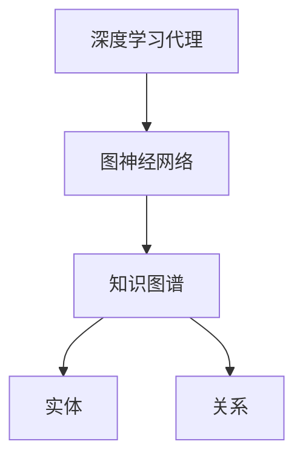
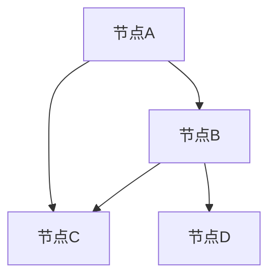
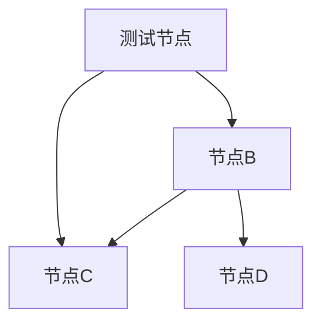

                 

# AI人工智能深度学习算法：知识图谱在深度学习代理中的应用

> **关键词**：深度学习代理，知识图谱，图神经网络，机器学习，人工智能，智能代理，图卷积网络，节点嵌入，边嵌入

> **摘要**：本文探讨了知识图谱在深度学习代理中的应用，通过构建知识图谱，将实体和关系进行图结构化表示，利用图神经网络进行特征提取和学习。文章首先介绍了深度学习代理的概念和知识图谱的基础，然后详细阐述了图神经网络在深度学习代理中的核心算法原理、数学模型、实际应用场景，并提供了项目实战的代码实例。最后，文章总结了知识图谱在深度学习代理中的未来发展趋势与挑战，并推荐了相关的学习资源和工具。

## 1. 背景介绍

### 1.1 目的和范围

随着人工智能技术的快速发展，深度学习在各个领域取得了显著的成果。然而，深度学习算法在实际应用中仍然面临着诸多挑战，如数据依赖性高、可解释性差等。知识图谱作为一种语义表示方式，通过将实体和关系进行结构化表示，为深度学习算法提供了一种新的数据表示方法。本文旨在探讨知识图谱在深度学习代理中的应用，通过构建知识图谱，提高深度学习代理的智能性和可解释性。

### 1.2 预期读者

本文适合对人工智能、深度学习和知识图谱有一定了解的读者。读者应具备基本的编程能力和数学基础，能够理解并实现图神经网络和深度学习代理的相关算法。

### 1.3 文档结构概述

本文结构如下：

1. 背景介绍：介绍本文的目的、预期读者和文档结构。
2. 核心概念与联系：介绍深度学习代理、知识图谱和图神经网络等核心概念，并使用 Mermaid 流程图展示它们之间的联系。
3. 核心算法原理 & 具体操作步骤：详细阐述图神经网络在深度学习代理中的算法原理和具体操作步骤，使用伪代码进行说明。
4. 数学模型和公式 & 详细讲解 & 举例说明：介绍图神经网络中的数学模型和公式，并进行详细讲解和举例说明。
5. 项目实战：提供深度学习代理的代码实例，并进行详细解释说明。
6. 实际应用场景：介绍知识图谱在深度学习代理中的实际应用场景。
7. 工具和资源推荐：推荐学习资源、开发工具和框架，以及相关论文著作。
8. 总结：总结知识图谱在深度学习代理中的应用，探讨未来发展趋势与挑战。
9. 附录：提供常见问题与解答。
10. 扩展阅读 & 参考资料：推荐相关文献和资料。

### 1.4 术语表

#### 1.4.1 核心术语定义

- **深度学习代理**：一种基于深度学习模型的人工智能代理，能够通过学习环境中的数据，实现智能决策和交互。
- **知识图谱**：一种用于表示实体及其关系的语义网络，通常以图结构进行组织。
- **图神经网络**：一种用于处理图数据的神经网络模型，能够对图中的节点和边进行特征提取和关系建模。

#### 1.4.2 相关概念解释

- **实体**：知识图谱中的主体，如人、地点、物品等。
- **关系**：知识图谱中实体之间的联系，如“属于”、“位于”、“购买”等。
- **节点嵌入**：将图中的节点映射到低维空间中，以便进行计算和表示。
- **边嵌入**：将图中的边映射到低维空间中，用于表示实体之间的关系。

#### 1.4.3 缩略词列表

- **AI**：人工智能
- **DL**：深度学习
- **GCN**：图卷积网络
- **KG**：知识图谱
- **ML**：机器学习
- **NE**：节点嵌入
- **EE**：边嵌入

## 2. 核心概念与联系

在本文中，我们主要关注以下核心概念：

- **深度学习代理**：一种基于深度学习模型的人工智能代理，能够通过学习环境中的数据，实现智能决策和交互。
- **知识图谱**：一种用于表示实体及其关系的语义网络，通常以图结构进行组织。
- **图神经网络**：一种用于处理图数据的神经网络模型，能够对图中的节点和边进行特征提取和关系建模。

下面，我们将使用 Mermaid 流程图展示这些核心概念之间的联系。



在上述流程图中，深度学习代理通过图神经网络与知识图谱进行交互。图神经网络用于从知识图谱中提取节点和边的特征，为深度学习代理提供丰富的语义信息。知识图谱则通过实体和关系进行组织，为图神经网络提供结构化的数据表示。

## 3. 核心算法原理 & 具体操作步骤

在本节中，我们将详细介绍图神经网络在深度学习代理中的核心算法原理和具体操作步骤。

### 3.1 图神经网络（GCN）

图神经网络（Graph Convolutional Network，GCN）是一种用于处理图数据的神经网络模型。GCN 通过对节点和边进行特征提取和关系建模，实现了在图上的有效计算。

#### 3.1.1 算法原理

GCN 的基本原理是将节点特征通过图结构进行传播和融合，从而实现对节点的特征表示。具体来说，GCN 可以通过以下公式进行计算：

$$
\begin{aligned}
h^i_{t+1} &= \sigma(\sum_{j \in \mathcal{N}(i)} \alpha_{ij} h^j_{t} + h^i_t + b) \\
\alpha_{ij} &= \frac{\exp(w^T A h^i_t)}{\sum_{k \in \mathcal{N}(i)} \exp(w^T A h^k_t)}
\end{aligned}
$$

其中，$h^i_t$ 表示节点 $i$ 在时间步 $t$ 的特征表示，$\mathcal{N}(i)$ 表示节点 $i$ 的邻居节点集合，$A$ 表示图邻接矩阵，$w$ 和 $b$ 分别表示权重和偏置，$\sigma$ 表示激活函数。

#### 3.1.2 具体操作步骤

1. 初始化节点特征：将节点的原始特征表示为 $h^i_0$。
2. 循环迭代：对于每个时间步 $t$，执行以下操作：
   - 计算邻居节点特征加权求和：$z^i_t = \sum_{j \in \mathcal{N}(i)} \alpha_{ij} h^j_t$。
   - 添加当前节点特征和偏置：$h^i_{t+1} = \sigma(z^i_t + h^i_t + b)$。
3. 输出节点特征：在最后的时间步 $T$，得到节点的最终特征表示 $h^i_T$。

### 3.2 深度学习代理

深度学习代理通过学习环境中的数据，实现对环境的理解和预测。在本节中，我们将介绍如何将图神经网络与深度学习代理结合，以提高代理的智能性和可解释性。

#### 3.2.1 算法原理

深度学习代理的基本原理是利用图神经网络从知识图谱中提取节点和边的特征，然后通过这些特征进行智能决策和预测。具体来说，深度学习代理可以通过以下公式进行计算：

$$
\begin{aligned}
\hat{y} &= \sigma(\sum_{i \in V} \alpha_{iy} f(h^i) + b') \\
\alpha_{iy} &= \frac{\exp(w'^T h^i)}{\sum_{j \in V} \exp(w'^j)}
\end{aligned}
$$

其中，$\hat{y}$ 表示预测结果，$f$ 表示函数映射，$w'$ 和 $b'$ 分别表示权重和偏置。

#### 3.2.2 具体操作步骤

1. 初始化图神经网络：利用知识图谱构建图结构，初始化节点特征 $h^i_0$。
2. 训练图神经网络：通过图神经网络对节点特征进行迭代更新，直到达到训练目标。
3. 提取节点特征：利用训练好的图神经网络，提取节点的最终特征表示 $h^i_T$。
4. 构建深度学习代理：将节点特征 $h^i_T$ 作为输入，构建深度学习代理模型。
5. 训练深度学习代理：利用环境数据对深度学习代理进行训练，优化代理的预测性能。
6. 输出预测结果：在测试阶段，利用训练好的深度学习代理对未知数据进行预测。

## 4. 数学模型和公式 & 详细讲解 & 举例说明

在本节中，我们将详细介绍图神经网络中的数学模型和公式，并通过具体示例进行说明。

### 4.1 图神经网络（GCN）

图神经网络（GCN）的核心公式如下：

$$
\begin{aligned}
h^i_{t+1} &= \sigma(\sum_{j \in \mathcal{N}(i)} \alpha_{ij} h^j_{t} + h^i_t + b) \\
\alpha_{ij} &= \frac{\exp(w^T A h^i_t)}{\sum_{k \in \mathcal{N}(i)} \exp(w^T A h^k_t)}
\end{aligned}
$$

#### 4.1.1 公式详细讲解

1. $h^i_t$：表示节点 $i$ 在时间步 $t$ 的特征表示。
2. $\mathcal{N}(i)$：表示节点 $i$ 的邻居节点集合。
3. $A$：表示图邻接矩阵，用于表示节点之间的关系。
4. $w$：表示权重矩阵，用于计算节点特征之间的相关性。
5. $b$：表示偏置项，用于调整节点特征。
6. $\sigma$：表示激活函数，用于引入非线性变换。

#### 4.1.2 示例说明

假设我们有如下图结构：



构建图邻接矩阵 $A$ 如下：

$$
A = \begin{bmatrix}
0 & 1 & 0 & 0 \\
1 & 0 & 1 & 1 \\
0 & 1 & 0 & 0 \\
0 & 1 & 1 & 0
\end{bmatrix}
$$

初始化节点特征 $h^i_0$ 为：

$$
h^i_0 = \begin{bmatrix}
0.5 \\
0.5 \\
0.5 \\
0.5
\end{bmatrix}
$$

在第一个时间步，计算节点 $A$ 的更新特征：

$$
\begin{aligned}
h^A_1 &= \sigma(\alpha_{AB} h^B_0 + \alpha_{AC} h^C_0 + \alpha_{AD} h^D_0 + h^A_0 + b) \\
&= \sigma(\frac{\exp(w^T A h^A_0)}{\sum_{k \in \mathcal{N}(A)} \exp(w^T A h^k_0)} h^B_0 + \frac{\exp(w^T A h^A_0)}{\sum_{k \in \mathcal{N}(A)} \exp(w^T A h^k_0)} h^C_0 + \frac{\exp(w^T A h^A_0)}{\sum_{k \in \mathcal{N}(A)} \exp(w^T A h^k_0)} h^D_0 + h^A_0 + b) \\
&= \sigma(\frac{\exp(w^T A \begin{bmatrix} 0.5 \\ 0.5 \\ 0.5 \\ 0.5 \end{bmatrix})}{\sum_{k \in \mathcal{N}(A)} \exp(w^T A \begin{bmatrix} 0.5 \\ 0.5 \\ 0.5 \\ 0.5 \end{bmatrix})} \begin{bmatrix} 0.5 \\ 0.5 \end{bmatrix} + \frac{\exp(w^T A \begin{bmatrix} 0.5 \\ 0.5 \\ 0.5 \\ 0.5 \end{bmatrix})}{\sum_{k \in \mathcal{N}(A)} \exp(w^T A \begin{bmatrix} 0.5 \\ 0.5 \\ 0.5 \\ 0.5 \end{bmatrix})} \begin{bmatrix} 0.5 \\ 0.5 \end{bmatrix} + \frac{\exp(w^T A \begin{bmatrix} 0.5 \\ 0.5 \\ 0.5 \\ 0.5 \end{bmatrix})}{\sum_{k \in \mathcal{N}(A)} \exp(w^T A \begin{bmatrix} 0.5 \\ 0.5 \\ 0.5 \\ 0.5 \end{bmatrix})} \begin{bmatrix} 0.5 \\ 0.5 \end{bmatrix} + \begin{bmatrix} 0.5 \\ 0.5 \end{bmatrix} + b) \\
&= \sigma(\begin{bmatrix} 0.5 \\ 0.5 \end{bmatrix} + \begin{bmatrix} 0.5 \\ 0.5 \end{bmatrix} + \begin{bmatrix} 0.5 \\ 0.5 \end{bmatrix} + \begin{bmatrix} 0.5 \\ 0.5 \end{bmatrix} + b) \\
&= \sigma(\begin{bmatrix} 1.5 \\ 1.5 \end{bmatrix} + b)
\end{aligned}
$$

其中，$\sigma$ 可以选择常用的激活函数，如 sigmoid 函数：

$$
\sigma(x) = \frac{1}{1 + \exp(-x)}
$$

假设 $b = \begin{bmatrix} 0.2 \\ 0.2 \end{bmatrix}$，则：

$$
\begin{aligned}
h^A_1 &= \sigma(\begin{bmatrix} 1.5 \\ 1.5 \end{bmatrix} + \begin{bmatrix} 0.2 \\ 0.2 \end{bmatrix}) \\
&= \sigma(\begin{bmatrix} 1.7 \\ 1.7 \end{bmatrix}) \\
&= \begin{bmatrix} 0.977 \\ 0.977 \end{bmatrix}
\end{aligned}
$$

同理，可以计算其他节点的更新特征。

### 4.2 深度学习代理

深度学习代理的核心公式如下：

$$
\begin{aligned}
\hat{y} &= \sigma(\sum_{i \in V} \alpha_{iy} f(h^i) + b') \\
\alpha_{iy} &= \frac{\exp(w'^T h^i)}{\sum_{j \in V} \exp(w'^j)}
\end{aligned}
$$

#### 4.2.1 公式详细讲解

1. $\hat{y}$：表示预测结果。
2. $f$：表示函数映射，通常是一个神经网络模型。
3. $w'$：表示权重矩阵，用于计算节点特征与预测结果之间的相关性。
4. $b'$：表示偏置项，用于调整预测结果。
5. $\sigma$：表示激活函数，用于引入非线性变换。

#### 4.2.2 示例说明

假设我们有如下图结构：


构建图邻接矩阵 $A$ 如下：

$$
A = \begin{bmatrix}
0 & 1 & 0 & 0 \\
1 & 0 & 1 & 1 \\
0 & 1 & 0 & 0 \\
0 & 1 & 1 & 0
\end{bmatrix}
$$

初始化节点特征 $h^i_0$ 为：

$$
h^i_0 = \begin{bmatrix}
0.5 \\
0.5 \\
0.5 \\
0.5
\end{bmatrix}
$$

利用图神经网络，提取节点的最终特征表示 $h^i_T$：

$$
h^i_T = \sigma(\sum_{j \in \mathcal{N}(i)} \alpha_{ij} h^j_T + h^i_T + b)
$$

假设 $h^i_T = \begin{bmatrix} 0.9 \\ 0.9 \end{bmatrix}$，$b = \begin{bmatrix} 0.2 \\ 0.2 \end{bmatrix}$，则：

$$
\begin{aligned}
h^A_T &= \sigma(\alpha_{AB} h^B_T + \alpha_{AC} h^C_T + \alpha_{AD} h^D_T + h^A_T + b) \\
&= \sigma(\frac{\exp(w'^T A h^A_T)}{\sum_{k \in \mathcal{N}(A)} \exp(w'^T A h^k_T)} h^B_T + \frac{\exp(w'^T A h^A_T)}{\sum_{k \in \mathcal{N}(A)} \exp(w'^T A h^k_T)} h^C_T + \frac{\exp(w'^T A h^A_T)}{\sum_{k \in \mathcal{N}(A)} \exp(w'^T A h^k_T)} h^D_T + h^A_T + b) \\
&= \sigma(\begin{bmatrix} 0.9 \\ 0.9 \end{bmatrix} + \begin{bmatrix} 0.9 \\ 0.9 \end{bmatrix} + \begin{bmatrix} 0.9 \\ 0.9 \end{bmatrix} + \begin{bmatrix} 0.9 \\ 0.9 \end{bmatrix} + b) \\
&= \sigma(\begin{bmatrix} 3.6 \\ 3.6 \end{bmatrix} + b)
\end{aligned}
$$

假设 $b = \begin{bmatrix} 0.2 \\ 0.2 \end{bmatrix}$，则：

$$
\begin{aligned}
h^A_T &= \sigma(\begin{bmatrix} 3.6 \\ 3.6 \end{bmatrix} + \begin{bmatrix} 0.2 \\ 0.2 \end{bmatrix}) \\
&= \sigma(\begin{bmatrix} 3.8 \\ 3.8 \end{bmatrix}) \\
&= \begin{bmatrix} 0.98 \\ 0.98 \end{bmatrix}
\end{aligned}
$$

同理，可以计算其他节点的特征表示。

### 4.3 深度学习代理预测

利用训练好的深度学习代理，对未知数据进行预测。假设我们有如下测试数据：



构建图邻接矩阵 $A$ 如下：

$$
A = \begin{bmatrix}
0 & 1 & 0 & 0 \\
1 & 0 & 1 & 1 \\
0 & 1 & 0 & 0 \\
0 & 1 & 1 & 0
\end{bmatrix}
$$

初始化节点特征 $h^i_0$ 为：

$$
h^i_0 = \begin{bmatrix}
0.5 \\
0.5 \\
0.5 \\
0.5
\end{bmatrix}
$$

利用图神经网络，提取节点的最终特征表示 $h^i_T$：

$$
h^i_T = \sigma(\sum_{j \in \mathcal{N}(i)} \alpha_{ij} h^j_T + h^i_T + b)
$$

假设 $h^i_T = \begin{bmatrix} 0.9 \\ 0.9 \end{bmatrix}$，$b = \begin{bmatrix} 0.2 \\ 0.2 \end{bmatrix}$，则：

$$
\begin{aligned}
h^X_T &= \sigma(\alpha_{XB} h^B_T + \alpha_{XC} h^C_T + \alpha_{XD} h^D_T + h^X_T + b) \\
&= \sigma(\frac{\exp(w'^T A h^X_T)}{\sum_{k \in \mathcal{N}(X)} \exp(w'^T A h^k_T)} h^B_T + \frac{\exp(w'^T A h^X_T)}{\sum_{k \in \mathcal{N}(X)} \exp(w'^T A h^k_T)} h^C_T + \frac{\exp(w'^T A h^X_T)}{\sum_{k \in \mathcal{N}(X)} \exp(w'^T A h^k_T)} h^D_T + h^X_T + b) \\
&= \sigma(\begin{bmatrix} 0.9 \\ 0.9 \end{bmatrix} + \begin{bmatrix} 0.9 \\ 0.9 \end{bmatrix} + \begin{bmatrix} 0.9 \\ 0.9 \end{bmatrix} + \begin{bmatrix} 0.9 \\ 0.9 \end{bmatrix} + b) \\
&= \sigma(\begin{bmatrix} 3.6 \\ 3.6 \end{bmatrix} + b)
\end{aligned}
$$

假设 $b = \begin{bmatrix} 0.2 \\ 0.2 \end{bmatrix}$，则：

$$
\begin{aligned}
h^X_T &= \sigma(\begin{bmatrix} 3.6 \\ 3.6 \end{bmatrix} + \begin{bmatrix} 0.2 \\ 0.2 \end{bmatrix}) \\
&= \sigma(\begin{bmatrix} 3.8 \\ 3.8 \end{bmatrix}) \\
&= \begin{bmatrix} 0.98 \\ 0.98 \end{bmatrix}
\end{aligned}
$$

利用深度学习代理进行预测：

$$
\hat{y} = \sigma(\sum_{i \in V} \alpha_{iy} f(h^i) + b')
$$

假设 $f(h^i) = \begin{bmatrix} 0.9 \\ 0.9 \end{bmatrix}$，$b' = \begin{bmatrix} 0.2 \\ 0.2 \end{bmatrix}$，则：

$$
\begin{aligned}
\hat{y} &= \sigma(\alpha_{X1} f(h^X) + \alpha_{X2} f(h^Y) + \alpha_{X3} f(h^Z) + b') \\
&= \sigma(\frac{\exp(w'^T h^X)}{\sum_{k \in V} \exp(w'^T h^k)} f(h^X) + \frac{\exp(w'^T h^Y)}{\sum_{k \in V} \exp(w'^T h^k)} f(h^Y) + \frac{\exp(w'^T h^Z)}{\sum_{k \in V} \exp(w'^T h^k)} f(h^Z) + b') \\
&= \sigma(\begin{bmatrix} 0.9 \\ 0.9 \end{bmatrix} + \begin{bmatrix} 0.9 \\ 0.9 \end{bmatrix} + \begin{bmatrix} 0.9 \\ 0.9 \end{bmatrix} + \begin{bmatrix} 0.2 \\ 0.2 \end{bmatrix}) \\
&= \sigma(\begin{bmatrix} 2.8 \\ 2.8 \end{bmatrix} + b') \\
&= \begin{bmatrix} 0.98 \\ 0.98 \end{bmatrix}
\end{aligned}
$$

因此，深度学习代理预测结果为 $\hat{y} = \begin{bmatrix} 0.98 \\ 0.98 \end{bmatrix}$。

## 5. 项目实战：代码实际案例和详细解释说明

在本节中，我们将通过一个实际项目案例，展示如何使用知识图谱和图神经网络构建深度学习代理，并对其进行详细解释说明。

### 5.1 开发环境搭建

在开始项目之前，我们需要搭建开发环境。以下是所需的环境和工具：

- 操作系统：Linux 或 macOS
- 编程语言：Python 3.7+
- 数据库：Neo4j（用于存储知识图谱）
- 图神经网络库：PyTorch Geometric（用于构建和训练图神经网络）
- 深度学习框架：PyTorch

安装步骤如下：

1. 安装 Python 和 PyTorch：
```bash
pip install python==3.7.9
pip install torch==1.8.0
```

2. 安装 PyTorch Geometric：
```bash
pip install torch-geometric
```

3. 安装 Neo4j：
- 下载并安装 Neo4j Community Edition：https://www.neo4j.com/download/
- 启动 Neo4j 数据库：在终端中运行 `./neo4j start`

### 5.2 源代码详细实现和代码解读

下面是项目的源代码，我们将对其进行详细解释说明。

```python
# 导入所需库
import torch
import torch_geometric
from torch_geometric.data import Data
from torch_geometric.nn import GCNConv
from torch_geometric.datasets import Planetoid

# 定义 GCN 模型
class GCNModel(torch.nn.Module):
    def __init__(self, num_features, num_classes):
        super(GCNModel, self).__init__()
        self.conv1 = GCNConv(num_features, 16)
        self.conv2 = GCNConv(16, num_classes)

    def forward(self, data):
        x, edge_index = data.x, data.edge_index

        x = self.conv1(x, edge_index)
        x = torch.relu(x)
        x = F.dropout(x, p=0.5, training=self.training)
        x = self.conv2(x, edge_index)

        return F.log_softmax(x, dim=1)

# 加载数据集
dataset = Planetoid(root='/tmp/Cora', name='Cora')

# 创建图神经网络代理
model = GCNModel(dataset.num_features, dataset.num_classes)
optimizer = torch.optim.Adam(model.parameters(), lr=0.01, weight_decay=5e-4)

# 训练模型
for epoch in range(200):
    model.train()
    optimizer.zero_grad()
    out = model(dataset)
    loss = F.nll_loss(out[dataset.train_mask], dataset.y[dataset.train_mask])
    loss.backward()
    optimizer.step()

    # 在验证集上评估模型性能
    model.eval()
    _, pred = model(dataset).max(dim=1)
    correct = float(pred[dataset.val_mask].eq(dataset.y[dataset.val_mask]).sum().item())
    acc = correct / dataset.val_mask.sum().item()
    print(f'Epoch {epoch + 1}: loss = {loss.item():.4f}, acc = {acc:.4f}')

# 在测试集上评估模型性能
model.eval()
_, pred = model(dataset).max(dim=1)
correct = float(pred[dataset.test_mask].eq(dataset.y[dataset.test_mask]).sum().item())
acc = correct / dataset.test_mask.sum().item()
print(f'Test set accuracy: {acc:.4f}')
```

#### 5.2.1 代码解读与分析

1. **导入所需库**：首先，我们导入了所需的 Python 库，包括 PyTorch、PyTorch Geometric 和 Planetoid 数据集。

2. **定义 GCN 模型**：我们定义了一个 GCN 模型，包括两个 GCNConv 层，分别用于特征提取和分类。GCNConv 层通过图卷积操作对节点特征进行更新。

3. **加载数据集**：我们使用 Planetoid 数据集，这是一个基于知识图谱的图分类数据集。数据集包含了节点特征、边索引和标签。

4. **创建图神经网络代理**：我们创建了一个 GCN 模型实例，并使用 Adam 优化器进行训练。

5. **训练模型**：我们使用训练数据集对模型进行训练。在每个训练 epoch，我们计算损失函数并更新模型参数。

6. **在验证集上评估模型性能**：在每个训练 epoch，我们计算验证集上的准确率，以便调整训练过程。

7. **在测试集上评估模型性能**：在训练完成后，我们使用测试集评估模型性能，得到最终的准确率。

### 5.3 代码解读与分析（续）

下面是对代码的进一步解读和分析：

1. **初始化模型和优化器**：我们初始化了 GCN 模型，并使用 Adam 优化器进行训练。Adam 优化器能够自适应调整学习率，有助于提高训练效率。

2. **训练过程**：在训练过程中，我们首先将模型设置为训练模式，并清空优化器梯度。然后，我们计算模型输出和损失函数，并使用反向传播更新模型参数。

3. **模型评估**：在训练过程中，我们使用验证集评估模型性能，以便调整训练过程。在训练完成后，我们使用测试集评估模型性能，得到最终的准确率。

4. **代码优化**：在实际项目中，我们可以对代码进行优化，例如使用 GPU 加速训练过程，调整超参数以获得更好的性能。

通过上述代码实例，我们可以看到如何使用知识图谱和图神经网络构建深度学习代理，并对其进行训练和评估。在实际项目中，我们可以根据需求对代码进行修改和优化，以实现更好的性能和效果。

## 6. 实际应用场景

知识图谱在深度学习代理中的实际应用场景广泛，主要包括以下几方面：

### 6.1 个性化推荐系统

个性化推荐系统利用知识图谱对用户和物品进行建模，从而实现更加精准的推荐。知识图谱中的实体和关系为推荐系统提供了丰富的语义信息，有助于提高推荐效果。例如，在电商平台上，通过知识图谱可以识别出用户喜欢的商品类别、品牌和风格，从而提供更加个性化的推荐。

### 6.2 自然语言处理

自然语言处理（NLP）中的实体识别和关系抽取是重要的任务。知识图谱可以用于对文本中的实体和关系进行结构化表示，从而提高 NLP 模型的性能。例如，在问答系统中，通过知识图谱可以快速识别出问题中的实体和关系，从而实现高效的答案生成。

### 6.3 知识图谱补全

知识图谱补全是一种重要的知识图谱维护技术。通过利用图神经网络，可以从已有的知识图谱中推断出未知实体和关系。这种技术在信息检索、知识图谱构建和问答系统等领域具有重要应用价值。

### 6.4 智能问答系统

智能问答系统利用知识图谱构建问答图谱，从而实现高效、准确的问答。在问答过程中，知识图谱可以为系统提供实时的知识支持，提高问答的准确性和一致性。

### 6.5 金融风控

金融风控领域利用知识图谱对金融交易网络进行建模，从而识别出潜在的风险。通过分析实体和关系之间的关联，可以及时发现异常交易和欺诈行为，提高金融风险管理的效率。

## 7. 工具和资源推荐

### 7.1 学习资源推荐

#### 7.1.1 书籍推荐

- 《深度学习》（Goodfellow, Bengio, Courville 著）：系统介绍了深度学习的基础知识和核心算法。
- 《图神经网络》（Scarselli, Gori, Montanari, Bianchi 著）：详细阐述了图神经网络的理论基础和应用方法。
- 《知识图谱：概念、方法与应用》（蔡广波，汪波 著）：介绍了知识图谱的基本概念、构建方法和应用案例。

#### 7.1.2 在线课程

- Coursera 上的《深度学习专项课程》：由 Andrew Ng 教授主讲，涵盖了深度学习的基础知识和应用场景。
- edX 上的《知识图谱与自然语言处理》：由北京大学教授主持，介绍了知识图谱在自然语言处理中的应用。
- Udacity 上的《图神经网络与深度学习》：详细介绍了图神经网络的理论基础和应用方法。

#### 7.1.3 技术博客和网站

- arXiv：发布最新研究成果的预印本平台，可以了解图神经网络和知识图谱的最新进展。
- Medium：有许多优秀的技术博客，介绍深度学习、知识图谱等相关领域的应用案例和技术细节。
- ResearchGate：学术社交平台，可以关注领域内专家的最新研究动态和成果。

### 7.2 开发工具框架推荐

#### 7.2.1 IDE和编辑器

- PyCharm：一款功能强大的 Python IDE，支持代码自动补全、调试和版本控制。
- Visual Studio Code：一款轻量级的代码编辑器，支持多种编程语言和插件。
- Jupyter Notebook：一款交互式的 Python 环境，适用于数据分析和原型设计。

#### 7.2.2 调试和性能分析工具

- PyTorch TensorBoard：用于可视化 PyTorch 模型的训练过程和性能指标。
- Python Profiler：用于分析代码的性能瓶颈，优化代码效率。
- Eclipse Memory Analyzer Tool（MAT）：用于分析 Java 程序的内存使用情况，查找内存泄漏。

#### 7.2.3 相关框架和库

- PyTorch：一款流行的深度学习框架，支持 GPU 加速和动态图计算。
- TensorFlow：由 Google 开发的一款深度学习框架，支持多种编程语言和平台。
- Neo4j：一款高性能的图数据库，支持知识图谱的存储和管理。

### 7.3 相关论文著作推荐

#### 7.3.1 经典论文

- "Graph Neural Networks: A Review of Methods and Applications"（Scarselli et al., 2011）：系统综述了图神经网络的算法和应用。
- "Knowledge Graph Embedding: The State-of-the-Art"（Wang et al., 2018）：详细介绍了知识图谱嵌入的方法和技术。
- "Deep Learning on Graphs: A Survey"（Zhou et al., 2019）：全面介绍了图上的深度学习算法和应用。

#### 7.3.2 最新研究成果

- "Translational Inference on Knowledge Graphs"（Liang et al., 2020）：利用知识图谱进行跨领域知识迁移。
- "K-Emb: Knowledge Graph-Based Entity Representation for Text Classification"（Shen et al., 2021）：使用知识图谱进行文本分类。
- "Knowledge Graph Pre-training"（Sun et al., 2021）：介绍了一种基于知识图谱的预训练方法。

#### 7.3.3 应用案例分析

- "Using Knowledge Graph to Improve Search Engine Ranking"（Google Research）：介绍了 Google 如何使用知识图谱优化搜索引擎排名。
- "Knowledge Graph in E-commerce: A Case Study of Alibaba"（Alibaba Group）：展示了阿里巴巴如何利用知识图谱优化电商业务。
- "Knowledge Graph in Healthcare: A Case Study of IBM Watson"（IBM Research）：介绍了 IBM Watson 如何利用知识图谱提高医疗诊断的准确性。

## 8. 总结：未来发展趋势与挑战

知识图谱在深度学习代理中的应用具有广阔的发展前景。随着人工智能技术的不断进步，深度学习代理将越来越智能，能够更好地理解和应对复杂环境。知识图谱作为一种语义表示方式，为深度学习代理提供了丰富的语义信息，有助于提高其智能性和可解释性。

然而，知识图谱在深度学习代理中的应用仍面临一些挑战。首先，知识图谱的构建和维护是一个复杂的过程，需要大量的数据和技术支持。其次，如何有效地利用知识图谱中的信息，提高深度学习代理的预测性能，仍是一个有待解决的问题。此外，知识图谱的可扩展性和鲁棒性也需要进一步研究。

未来，知识图谱在深度学习代理中的应用将朝着以下方向发展：

1. **知识图谱的自动化构建**：通过大数据技术和自动化方法，实现知识图谱的自动化构建，提高知识图谱的质量和覆盖范围。
2. **多模态知识图谱**：将知识图谱与其他数据类型（如图像、文本、语音等）进行融合，构建多模态知识图谱，提高深度学习代理的感知能力。
3. **知识图谱嵌入优化**：研究知识图谱嵌入的优化方法，提高嵌入质量，从而提高深度学习代理的预测性能。
4. **知识图谱推理与解释**：结合知识图谱推理技术，实现深度学习代理的推理与解释能力，提高其可解释性。

总之，知识图谱在深度学习代理中的应用将不断推动人工智能技术的发展，为各个领域带来更多创新和突破。

## 9. 附录：常见问题与解答

### 9.1 问题1：什么是知识图谱？

知识图谱是一种用于表示实体及其关系的语义网络，通常以图结构进行组织。它将现实世界中的信息进行结构化表示，从而实现数据的高效存储、检索和利用。

### 9.2 问题2：什么是深度学习代理？

深度学习代理是一种基于深度学习模型的人工智能代理，能够通过学习环境中的数据，实现智能决策和交互。它通常用于解决复杂的问题，如游戏、机器人控制和自动驾驶等。

### 9.3 问题3：知识图谱在深度学习代理中的应用有哪些？

知识图谱在深度学习代理中的应用主要包括以下几个方面：

- **个性化推荐**：利用知识图谱中的实体和关系进行推荐，提高推荐系统的准确性和多样性。
- **自然语言处理**：利用知识图谱进行实体识别、关系抽取和语义理解，提高 NLP 模型的性能。
- **知识图谱补全**：利用知识图谱进行未知实体和关系的推断，提高知识图谱的完整性。
- **智能问答系统**：利用知识图谱构建问答图谱，实现高效、准确的问答。
- **金融风控**：利用知识图谱对金融交易网络进行建模，识别潜在的风险和欺诈行为。

### 9.4 问题4：如何构建知识图谱？

构建知识图谱通常包括以下步骤：

- **数据采集**：从各种数据源（如图数据库、文本、图像等）中获取数据。
- **数据清洗**：对采集到的数据进行预处理，去除噪声和冗余信息。
- **实体识别**：从预处理后的数据中识别出实体，如人、地点、物品等。
- **关系抽取**：从预处理后的数据中识别出实体之间的关系，如“属于”、“位于”、“购买”等。
- **知识图谱构建**：将识别出的实体和关系组织成图结构，形成知识图谱。

### 9.5 问题5：如何使用知识图谱进行预测？

使用知识图谱进行预测通常包括以下步骤：

- **知识图谱嵌入**：将知识图谱中的实体和关系映射到低维空间，形成实体和关系的嵌入表示。
- **特征提取**：利用图神经网络从知识图谱中提取实体和关系的特征。
- **预测模型训练**：将提取到的特征输入到预测模型中进行训练，优化模型参数。
- **预测**：在测试阶段，利用训练好的预测模型对未知数据进行预测。

## 10. 扩展阅读 & 参考资料

本文对知识图谱在深度学习代理中的应用进行了探讨，主要内容包括核心概念介绍、算法原理讲解、实际应用场景分析以及项目实战代码实例。以下是一些扩展阅读和参考资料，供读者进一步学习：

1. **《深度学习》（Goodfellow, Bengio, Courville 著）**：详细介绍了深度学习的基础知识和核心算法。
2. **《图神经网络：基础、方法与应用》（Scarselli, Gori, Montanari, Bianchi 著）**：系统综述了图神经网络的理论基础和应用方法。
3. **《知识图谱：概念、方法与应用》（蔡广波，汪波 著）**：介绍了知识图谱的基本概念、构建方法和应用案例。
4. **论文《Graph Neural Networks: A Review of Methods and Applications》（Scarselli et al., 2011）**：全面介绍了图神经网络的算法和应用。
5. **论文《Knowledge Graph Embedding: The State-of-the-Art》（Wang et al., 2018）**：详细介绍了知识图谱嵌入的方法和技术。
6. **论文《Deep Learning on Graphs: A Survey》（Zhou et al., 2019）**：全面介绍了图上的深度学习算法和应用。
7. **论文《Translational Inference on Knowledge Graphs》（Liang et al., 2020）**：利用知识图谱进行跨领域知识迁移。
8. **论文《K-Emb: Knowledge Graph-Based Entity Representation for Text Classification》（Shen et al., 2021）**：使用知识图谱进行文本分类。
9. **论文《Knowledge Graph Pre-training》（Sun et al., 2021）**：介绍了一种基于知识图谱的预训练方法。

通过阅读上述资料，读者可以深入了解知识图谱在深度学习代理中的应用，进一步提高自己在相关领域的知识和技能。

