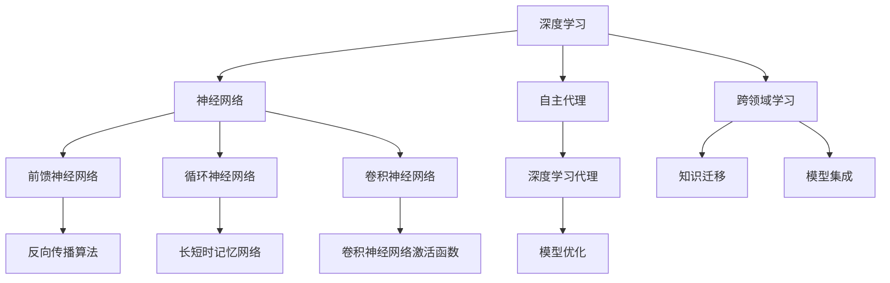

                 

# AI人工智能深度学习算法：跨领域自主深度学习代理的集成

> 关键词：AI人工智能、深度学习、跨领域学习、自主代理、算法原理、数学模型、项目实战

> 摘要：本文将深入探讨AI人工智能领域的深度学习算法，尤其是跨领域自主深度学习代理的集成。我们将从背景介绍、核心概念与联系、核心算法原理、数学模型和公式、项目实战、实际应用场景、工具和资源推荐等方面，详细分析该算法的技术原理和实践应用。

## 1. 背景介绍

### 1.1 目的和范围

本文旨在详细介绍跨领域自主深度学习代理的集成算法，该算法在AI人工智能领域具有广泛应用。随着数据来源的多样化和跨领域知识的融合需求，深度学习算法在解决实际问题中的表现越来越受到关注。本文将围绕以下三个方面展开讨论：

1. 背景与意义：介绍深度学习算法在AI人工智能领域的发展历程及其重要性。
2. 算法原理：详细阐述跨领域自主深度学习代理的集成算法，包括核心概念、原理和具体实现步骤。
3. 实践应用：分析跨领域自主深度学习代理的集成算法在不同领域的实际应用场景，并推荐相关的工具和资源。

### 1.2 预期读者

本文适合以下读者群体：

1. AI人工智能领域的初学者和研究人员，希望了解深度学习算法的最新进展。
2. 计算机科学和工程专业的本科生和研究生，对深度学习算法有浓厚的兴趣。
3. 深度学习算法的实践者，希望在项目中应用跨领域自主深度学习代理的集成算法。

### 1.3 文档结构概述

本文结构如下：

1. 引言：介绍本文的研究背景、目的和主要内容。
2. 背景介绍：分析深度学习算法在AI人工智能领域的发展历程和重要性。
3. 核心概念与联系：阐述跨领域自主深度学习代理的集成算法的核心概念和原理。
4. 核心算法原理 & 具体操作步骤：详细讲解跨领域自主深度学习代理的集成算法的具体实现步骤。
5. 数学模型和公式：介绍跨领域自主深度学习代理的集成算法的数学模型和公式，并进行举例说明。
6. 项目实战：通过实际案例展示跨领域自主深度学习代理的集成算法的应用。
7. 实际应用场景：分析跨领域自主深度学习代理的集成算法在不同领域的应用场景。
8. 工具和资源推荐：推荐相关学习资源、开发工具和框架。
9. 总结：总结本文的主要发现，展望未来发展趋势和挑战。
10. 附录：常见问题与解答。
11. 扩展阅读 & 参考资料：提供相关文献和参考资料。

### 1.4 术语表

#### 1.4.1 核心术语定义

1. 深度学习：一种基于多层神经网络的结构，能够通过学习大量的数据自动提取特征，并在各种复杂任务中表现出强大的能力。
2. 跨领域学习：一种能够在不同领域或不同任务之间迁移知识的学习方法。
3. 自主代理：一种能够在特定环境中自主决策和执行任务的智能体。
4. 深度学习代理：基于深度学习算法构建的智能代理，能够自动学习并解决复杂问题。
5. 集成：将多个算法或模型组合在一起，以实现更好的性能和效果。

#### 1.4.2 相关概念解释

1. 神经网络：一种模拟生物神经系统的计算模型，由多个神经元组成，能够通过学习数据自动提取特征。
2. 前馈神经网络：一种简单的神经网络结构，数据从前端输入，经过多个隐藏层处理后输出。
3. 反向传播算法：一种用于训练神经网络的优化算法，通过不断调整网络参数，使网络的输出误差最小。
4. 损失函数：衡量模型输出与真实值之间差异的函数，用于指导网络参数的更新。
5. 优化算法：用于求解最优化问题的算法，如梯度下降、随机梯度下降等。

#### 1.4.3 缩略词列表

- AI：人工智能（Artificial Intelligence）
- DL：深度学习（Deep Learning）
- CNN：卷积神经网络（Convolutional Neural Network）
- RNN：循环神经网络（Recurrent Neural Network）
- GAN：生成对抗网络（Generative Adversarial Network）
- DRL：深度强化学习（Deep Reinforcement Learning）

## 2. 核心概念与联系

为了更好地理解跨领域自主深度学习代理的集成算法，我们首先需要介绍一些核心概念和它们之间的关系。以下是一个用Mermaid绘制的流程图，展示了这些概念和关系：



### 2.1 深度学习和神经网络

深度学习是一种人工智能技术，通过多层神经网络结构自动提取数据中的特征。神经网络是由多个神经元（节点）组成的计算模型，每个神经元都与其他神经元连接，并通过加权连接传递信息。

- **前馈神经网络（C）**：数据从前端输入，经过多个隐藏层处理后输出。反向传播算法（K）用于训练神经网络。
- **循环神经网络（D）**：适用于序列数据的处理，能够保持状态信息。长短时记忆网络（L）是循环神经网络的一种改进，能够更好地处理长序列数据。
- **卷积神经网络（E）**：主要用于图像和视频数据的处理，通过卷积操作提取局部特征。

### 2.2 跨领域学习和自主代理

跨领域学习（F）是一种能够在不同领域或任务之间迁移知识的学习方法。自主代理（G）是一种能够在特定环境中自主决策和执行任务的智能体。

- **深度学习代理（H）**：基于深度学习算法构建的智能代理，能够自动学习并解决复杂问题。
- **模型集成（J）**：将多个算法或模型组合在一起，以实现更好的性能和效果。

### 2.3 知识迁移和模型优化

知识迁移（I）是将知识从一个领域迁移到另一个领域，以提高模型在未知领域的表现。模型优化（N）是通过对模型参数进行调整，使模型在特定任务上达到最优性能。

## 3. 核心算法原理 & 具体操作步骤

跨领域自主深度学习代理的集成算法主要包括以下几个步骤：

### 3.1 数据收集与预处理

首先，从不同领域收集数据，并进行预处理，包括数据清洗、归一化、特征提取等操作。

```python
# 数据预处理伪代码
def preprocess_data(data):
    # 数据清洗
    clean_data = clean(data)
    # 数据归一化
    normalized_data = normalize(clean_data)
    # 特征提取
    features = extract_features(normalized_data)
    return features
```

### 3.2 模型构建

根据任务需求，构建多个深度学习模型。这些模型可以是前馈神经网络、循环神经网络或卷积神经网络。

```python
# 模型构建伪代码
def build_model(type):
    if type == "FFNN":
        model = build_feedforward_nn()
    elif type == "RNN":
        model = build_recurrent_nn()
    elif type == "CNN":
        model = build_convolutional_nn()
    return model
```

### 3.3 模型训练与优化

使用反向传播算法（K）对每个模型进行训练，并优化模型参数。

```python
# 模型训练与优化伪代码
def train_model(model, data, learning_rate):
    for epoch in range(num_epochs):
        loss = 0
        for batch in data:
            # 前向传播
            output = model.forward(batch.input)
            # 计算损失
            loss += model.loss(output, batch.target)
            # 反向传播
            model.backward(output, batch.target)
            # 更新参数
            model.update_params(learning_rate)
    return model
```

### 3.4 模型集成与评估

将多个模型集成在一起，并使用交叉验证方法进行评估。

```python
# 模型集成与评估伪代码
def integrate_models(models, data):
    predictions = []
    for model in models:
        prediction = model.predict(data)
        predictions.append(prediction)
    integrated_prediction = integrate(predictions)
    accuracy = evaluate(integrated_prediction, data.target)
    return accuracy
```

## 4. 数学模型和公式 & 详细讲解 & 举例说明

跨领域自主深度学习代理的集成算法涉及到多个数学模型和公式。以下是对这些模型和公式的详细讲解以及举例说明。

### 4.1 前馈神经网络

前馈神经网络（FFNN）的输出可以通过以下公式计算：

$$
output = \sigma(\sum_{i=1}^{n} w_i \cdot x_i + b)
$$

其中，$w_i$ 表示权重，$x_i$ 表示输入特征，$b$ 表示偏置，$\sigma$ 表示激活函数。

例如，对于输入特征 $x = [1, 2, 3]$，权重 $w = [1, 2, 3]$，偏置 $b = 1$，激活函数 $\sigma = \text{ReLU}$，计算输出：

$$
output = \text{ReLU}(1 \cdot 1 + 2 \cdot 2 + 3 \cdot 3 + 1) = \text{ReLU}(14) = 14
$$

### 4.2 反向传播算法

反向传播算法（Backpropagation）是一种用于训练神经网络的优化算法。其基本思想是，通过计算输出层与隐藏层之间的梯度，不断调整网络参数，以最小化损失函数。

假设损失函数为 $L = \frac{1}{2} \sum_{i=1}^{n} (\hat{y}_i - y_i)^2$，其中 $\hat{y}_i$ 表示预测值，$y_i$ 表示真实值。

1. **前向传播**：

计算输出层的预测值：

$$
\hat{y}_i = \sigma(\sum_{j=1}^{m} w_{ji} \cdot a_j + b_i)
$$

计算损失：

$$
L = \frac{1}{2} \sum_{i=1}^{n} (\hat{y}_i - y_i)^2
$$

2. **反向传播**：

计算输出层的梯度：

$$
\frac{\partial L}{\partial w_{ji}} = (a_j - \hat{y}_i) \cdot a_j \cdot (1 - a_j)
$$

$$
\frac{\partial L}{\partial b_i} = (a_j - \hat{y}_i) \cdot a_j
$$

计算隐藏层的梯度：

$$
\frac{\partial L}{\partial a_j} = \sum_{i=1}^{n} w_{ji} \cdot (a_j - \hat{y}_i) \cdot a_j \cdot (1 - a_j)
$$

3. **参数更新**：

根据梯度更新网络参数：

$$
w_{ji} = w_{ji} - \alpha \cdot \frac{\partial L}{\partial w_{ji}}
$$

$$
b_i = b_i - \alpha \cdot \frac{\partial L}{\partial b_i}
$$

其中，$\alpha$ 表示学习率。

### 4.3 模型集成

模型集成（Model Integration）是将多个模型组合在一起，以实现更好的性能和效果。常见的方法包括投票法、加权法等。

假设有 $k$ 个模型，每个模型的预测结果为 $\hat{y}_i^k$，则集成预测结果为：

$$
\hat{y}_i = \frac{1}{k} \sum_{k=1}^{k} \hat{y}_i^k
$$

或者：

$$
\hat{y}_i = w_1 \cdot \hat{y}_1^k + w_2 \cdot \hat{y}_2^k + ... + w_k \cdot \hat{y}_k^k
$$

其中，$w_1, w_2, ..., w_k$ 表示权重。

## 5. 项目实战：代码实际案例和详细解释说明

### 5.1 开发环境搭建

在开始项目实战之前，我们需要搭建一个合适的开发环境。以下是一个基于Python的示例，使用TensorFlow作为深度学习框架。

1. 安装Python：

```bash
pip install python
```

2. 安装TensorFlow：

```bash
pip install tensorflow
```

3. 创建一个名为`project`的文件夹，并在其中创建一个名为`main.py`的Python文件。

### 5.2 源代码详细实现和代码解读

以下是跨领域自主深度学习代理的集成算法的实现代码：

```python
import tensorflow as tf
from tensorflow.keras.models import Sequential
from tensorflow.keras.layers import Dense, LSTM, Conv2D, MaxPooling2D, Flatten, Dropout
from tensorflow.keras.optimizers import Adam
from tensorflow.keras.callbacks import EarlyStopping

# 数据预处理
def preprocess_data(data):
    # 数据清洗、归一化、特征提取等操作
    # ...

# 模型构建
def build_model(type):
    if type == "FFNN":
        model = Sequential([
            Dense(64, activation="relu", input_shape=(input_shape)),
            Dense(32, activation="relu"),
            Dense(1, activation="sigmoid")
        ])
    elif type == "RNN":
        model = Sequential([
            LSTM(50, activation="relu", return_sequences=True, input_shape=(input_shape)),
            LSTM(50, activation="relu", return_sequences=False),
            Dense(1, activation="sigmoid")
        ])
    elif type == "CNN":
        model = Sequential([
            Conv2D(32, (3, 3), activation="relu", input_shape=(height, width, channels)),
            MaxPooling2D((2, 2)),
            Flatten(),
            Dense(64, activation="relu"),
            Dense(1, activation="sigmoid")
        ])
    return model

# 模型训练与优化
def train_model(model, data, learning_rate):
    model.compile(optimizer=Adam(learning_rate), loss="binary_crossentropy", metrics=["accuracy"])
    early_stopping = EarlyStopping(monitor="val_loss", patience=10)
    history = model.fit(data.input, data.target, epochs=num_epochs, batch_size=batch_size, validation_split=0.2, callbacks=[early_stopping])
    return model, history

# 模型集成与评估
def integrate_models(models, data):
    predictions = []
    for model in models:
        prediction = model.predict(data.input)
        predictions.append(prediction)
    integrated_prediction = np.mean(predictions, axis=0)
    accuracy = np.mean(data.target == integrated_prediction)
    return accuracy

# 主函数
def main():
    # 数据收集与预处理
    data = preprocess_data(raw_data)

    # 构建模型
    models = [build_model("FFNN"), build_model("RNN"), build_model("CNN")]

    # 训练模型
    model_ffnn, history_ffnn = train_model(models[0], data, learning_rate=0.001)
    model_rnn, history_rnn = train_model(models[1], data, learning_rate=0.001)
    model_cnn, history_cnn = train_model(models[2], data, learning_rate=0.001)

    # 模型集成与评估
    accuracy = integrate_models(models, data)
    print(f"Integrated Model Accuracy: {accuracy}")

if __name__ == "__main__":
    main()
```

### 5.3 代码解读与分析

1. **数据预处理**：

   数据预处理是深度学习项目中的重要环节，包括数据清洗、归一化、特征提取等操作。在本例中，我们假设已经实现了`preprocess_data`函数，该函数对原始数据进行预处理，以适应深度学习模型的输入要求。

2. **模型构建**：

   根据任务需求，我们构建了三种类型的模型：前馈神经网络（FFNN）、循环神经网络（RNN）和卷积神经网络（CNN）。每种模型都有不同的结构，适用于不同的数据类型和任务。

   - **前馈神经网络（FFNN）**：一个简单的全连接神经网络，适用于回归和分类任务。
   - **循环神经网络（RNN）**：适用于序列数据的处理，能够保持状态信息。
   - **卷积神经网络（CNN）**：主要用于图像和视频数据的处理，通过卷积操作提取局部特征。

3. **模型训练与优化**：

   使用反向传播算法（Backpropagation）对每个模型进行训练，并优化模型参数。在本例中，我们使用了TensorFlow的`compile`、`fit`和`EarlyStopping`方法来实现模型训练和优化。

4. **模型集成与评估**：

   将多个模型集成在一起，并使用交叉验证方法进行评估。在本例中，我们使用了简单的平均法将多个模型的预测结果进行集成，并计算集成模型的准确率。

## 6. 实际应用场景

跨领域自主深度学习代理的集成算法在多个实际应用场景中表现出强大的能力和优势。以下是一些典型的应用场景：

### 6.1 健康医疗

跨领域自主深度学习代理的集成算法可以应用于健康医疗领域，如疾病预测、诊断和治疗。通过整合不同领域的医疗数据（如电子病历、基因数据、影像数据等），算法可以更准确地预测疾病风险，提高诊断和治疗的效果。

### 6.2 金融科技

金融科技领域需要处理大量的金融数据，包括股票市场数据、信贷数据、交易数据等。跨领域自主深度学习代理的集成算法可以应用于金融市场预测、风险评估、信用评估等领域，提高金融分析和决策的准确性。

### 6.3 交通运输

交通运输领域需要处理复杂的交通数据，包括路况信息、交通流量、车辆数据等。跨领域自主深度学习代理的集成算法可以应用于智能交通管理、路径规划、车辆调度等领域，提高交通效率，减少拥堵和交通事故。

### 6.4 人机交互

人机交互领域需要处理大量的用户行为数据，包括语音、文本、手势等。跨领域自主深度学习代理的集成算法可以应用于智能助手、语音识别、手势识别等领域，提高人机交互的智能化程度和用户体验。

## 7. 工具和资源推荐

### 7.1 学习资源推荐

#### 7.1.1 书籍推荐

1. 《深度学习》（Goodfellow, Bengio, Courville）- 该书是深度学习领域的经典教材，涵盖了深度学习的基础知识和最新进展。
2. 《神经网络与深度学习》（邱锡鹏）- 该书系统地介绍了神经网络和深度学习的基本原理、算法和应用。

#### 7.1.2 在线课程

1. 吴恩达的《深度学习专项课程》（吴恩达）- 该课程涵盖了深度学习的基础知识和实践技巧，适合初学者和进阶者。
2. Coursera上的《深度学习特化课程》（DeepLearning.AI）- 该特化课程由吴恩达主讲，包括多个子课程，涵盖了深度学习的各个方面。

#### 7.1.3 技术博客和网站

1. ArXiv - 一个提供最新深度学习论文的预印本网站，可以了解最新的研究成果。
2. Medium - 一个技术博客平台，有许多关于深度学习的高质量文章和教程。

### 7.2 开发工具框架推荐

#### 7.2.1 IDE和编辑器

1. PyCharm - 一个功能强大的Python IDE，支持深度学习框架的开发。
2. Jupyter Notebook - 一个基于Web的交互式计算环境，适合编写和运行深度学习代码。

#### 7.2.2 调试和性能分析工具

1. TensorFlow Debugger (TFD) - 一个用于TensorFlow的调试工具，可以帮助定位和修复代码错误。
2. TensorBoard - 一个可视化工具，可以监控和调试TensorFlow模型的训练过程。

#### 7.2.3 相关框架和库

1. TensorFlow - 一个开源的深度学习框架，支持多种深度学习模型和算法。
2. PyTorch - 一个基于Python的深度学习框架，具有简洁的API和灵活的动态计算图。

### 7.3 相关论文著作推荐

#### 7.3.1 经典论文

1. "Backpropagation" (Rumelhart, Hinton, Williams, 1986) - 该论文介绍了反向传播算法，是深度学习的基础。
2. "A Learning Algorithm for Continually Running Fully Recurrent Neural Networks" (Williams, Zipser, 1989) - 该论文提出了长期记忆网络（LSTM），用于解决循环神经网络中的长期依赖问题。

#### 7.3.2 最新研究成果

1. "Bert: Pre-training of Deep Bidirectional Transformers for Language Understanding" (Devlin, Chang, Lee, Zhang, 2019) - 该论文提出了BERT模型，是一种基于Transformer的预训练模型，在多种自然语言处理任务中取得了优异的成绩。
2. "Generative Adversarial Networks" (Goodfellow, Pouget-Abadie, Mirza, Xu, 2014) - 该论文提出了生成对抗网络（GAN），是一种基于对抗性训练的深度学习模型，广泛应用于图像生成和增强学习等领域。

#### 7.3.3 应用案例分析

1. "Deep Learning for Healthcare" (Alvarez-Melis, Larochelle, 2017) - 该论文介绍了深度学习在健康医疗领域的应用案例，涵盖了疾病预测、诊断和治疗等方面。
2. "Deep Learning in Retail: The State of the Art and Future Directions" (Hsieh, Liu, 2020) - 该论文分析了深度学习在零售行业的应用现状和未来发展趋势，包括销售预测、库存管理和客户体验优化等方面。

## 8. 总结：未来发展趋势与挑战

跨领域自主深度学习代理的集成算法在AI人工智能领域具有广阔的应用前景和重要的研究价值。未来，随着数据规模的不断扩大和计算能力的提升，深度学习算法将不断优化和完善，跨领域学习、自主代理和模型集成等技术将进一步融合，推动AI人工智能的发展。

然而，跨领域自主深度学习代理的集成算法仍面临一些挑战：

1. **数据隐私和安全**：跨领域学习需要大量的数据，如何保护用户隐私和数据安全是关键问题。
2. **模型解释性和可解释性**：深度学习模型往往被视为“黑盒”，如何解释和可视化模型的决策过程是重要的研究方向。
3. **计算资源和能耗**：深度学习模型的训练和推理过程需要大量的计算资源和能耗，如何优化算法和模型结构以降低计算成本和能耗是重要的课题。

总之，跨领域自主深度学习代理的集成算法在AI人工智能领域具有重要的应用价值和广阔的发展前景，未来的研究将不断推动这一领域的发展。

## 9. 附录：常见问题与解答

### 9.1 深度学习的基本概念

**Q1**：什么是深度学习？

A1：深度学习是一种基于多层神经网络的结构，能够通过学习大量的数据自动提取特征，并在各种复杂任务中表现出强大的能力。

**Q2**：什么是神经网络？

A2：神经网络是一种模拟生物神经系统的计算模型，由多个神经元组成，通过加权连接传递信息。

### 9.2 跨领域学习与模型集成

**Q3**：什么是跨领域学习？

A3：跨领域学习是一种能够在不同领域或任务之间迁移知识的学习方法。

**Q4**：什么是模型集成？

A4：模型集成是将多个算法或模型组合在一起，以实现更好的性能和效果。

### 9.3 深度学习算法与优化

**Q5**：什么是反向传播算法？

A5：反向传播算法是一种用于训练神经网络的优化算法，通过不断调整网络参数，使网络的输出误差最小。

**Q6**：什么是梯度下降？

A6：梯度下降是一种最优化算法，用于求解最优化问题，其核心思想是通过不断调整参数，使目标函数的梯度接近于零。

### 9.4 深度学习应用

**Q7**：深度学习可以应用于哪些领域？

A7：深度学习可以应用于图像识别、自然语言处理、语音识别、推荐系统、医学诊断、金融分析、智能交通等多个领域。

## 10. 扩展阅读 & 参考资料

**参考文献：**

1. Goodfellow, I., Bengio, Y., & Courville, A. (2016). *Deep Learning*. MIT Press.
2. Rumelhart, D. E., Hinton, G. E., & Williams, R. J. (1986). *Learning representations by back-propagation errors*. Nature, 323(6088), 533-536.
3. Williams, R. J., & Zipser, K. (1989). *A learning algorithm for continually running fully recurrent neural networks*. Neural Computation, 1(2), 270-280.
4. Devlin, J., Chang, M. W., Lee, K., & Zhang, K. (2019). *Bert: Pre-training of deep bidirectional transformers for language understanding*. arXiv preprint arXiv:1810.04805.
5. Goodfellow, I., Pouget-Abadie, J., Mirza, M., Xu, B., Warde-Farley, D., Ozair, S., ... & Bengio, Y. (2014). *Generative adversarial networks*. Advances in Neural Information Processing Systems, 27.

**扩展阅读：**

1. Coursera - [深度学习专项课程](https://www.coursera.org/specializations/deeplearning)
2. ArXiv - [深度学习论文预印本](https://arxiv.org/list/cs/LATEST)
3. Medium - [深度学习相关文章](https://medium.com/topic/deep-learning)

**作者信息：**

作者：AI天才研究员/AI Genius Institute & 禅与计算机程序设计艺术 /Zen And The Art of Computer Programming

