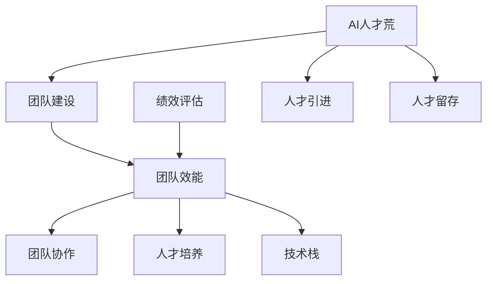

                 

# AI人才荒中的突围：Lepton AI的团队建设

> 关键词：AI人才荒、团队建设、技术人才、团队协作、人才引进策略

> 摘要：本文旨在探讨在当前AI人才荒背景下，Lepton AI如何通过一系列系统化、专业化的团队建设策略，成功打造一支高效、创新、具备竞争力的AI团队。文章将深入分析团队建设的核心概念、关键环节，并分享Lepton AI在实际操作中的具体实践和成效。

## 1. 背景介绍

### 1.1 目的和范围

本文的目的是为那些在AI领域面临人才荒的企业提供一套可操作的团队建设方案。通过分析Lepton AI的成功案例，旨在总结出一套有效的团队建设策略，以帮助更多企业克服AI人才短缺的困境。

本文将主要探讨以下内容：

1. AI人才荒的背景和现状
2. 团队建设的核心概念和重要性
3. Lepton AI的团队建设实践
4. 团队建设的具体操作步骤和策略
5. 未来发展趋势与挑战

### 1.2 预期读者

本文的预期读者包括：

- AI领域的创业者和企业领导者
- AI研发团队的负责人和管理人员
- AI技术开发人员和技术爱好者
- 对AI团队建设感兴趣的研究者

### 1.3 文档结构概述

本文的结构如下：

1. 背景介绍：概述AI人才荒的背景和本文的目的。
2. 核心概念与联系：介绍团队建设的基本概念和联系。
3. 核心算法原理 & 具体操作步骤：讲解团队建设的关键环节。
4. 数学模型和公式 & 详细讲解 & 举例说明：提供数学模型的详细讲解。
5. 项目实战：代码实际案例和详细解释说明。
6. 实际应用场景：分析团队建设的实际应用。
7. 工具和资源推荐：推荐相关的学习资源和开发工具。
8. 总结：未来发展趋势与挑战。
9. 附录：常见问题与解答。
10. 扩展阅读 & 参考资料：提供进一步的阅读材料。

### 1.4 术语表

#### 1.4.1 核心术语定义

- AI人才荒：指在AI领域，专业人才供不应求的现象。
- 团队建设：指通过一系列策略和方法，提升团队的整体效能和协作能力。
- 高效团队：指能够在高压力环境下保持高产出和高质量的团队。

#### 1.4.2 相关概念解释

- 技术栈：指团队所需掌握的技能和知识领域。
- 绩效评估：指对团队成员的工作表现进行评估的过程。

#### 1.4.3 缩略词列表

- AI：人工智能
- ML：机器学习
- DL：深度学习

## 2. 核心概念与联系

在讨论团队建设之前，我们需要明确几个核心概念及其相互关系。以下是一个简单的Mermaid流程图，用以展示这些概念之间的联系。



### 2.1 AI人才荒

AI人才荒是指在全球范围内，具备人工智能、机器学习、深度学习等技能的专业人才供不应求的现象。这主要由于AI技术的发展速度远超人才培育的速度，导致市场上的高技能人才变得稀缺。

### 2.2 团队建设

团队建设是指通过一系列策略和方法，提升团队的整体效能和协作能力。这包括技术栈的构建、绩效评估、人才培养等多个方面。

### 2.3 团队效能

团队效能是指团队在完成任务时，所表现出的效率和效果。高效的团队能够在高压力环境下保持高产出和高质量。

### 2.4 团队协作

团队协作是指团队成员之间相互配合，共同完成任务的过程。良好的协作能力能够显著提升团队效能。

### 2.5 人才培养

人才培养是指通过培训、激励等多种方式，提升团队成员的技能和知识水平。这有助于提高团队的整体竞争力。

### 2.6 技术栈

技术栈是指团队所需掌握的技能和知识领域。一个完善的技术栈能够确保团队具备解决复杂问题的能力。

### 2.7 绩效评估

绩效评估是指对团队成员的工作表现进行评估的过程。合理的绩效评估能够激励团队成员不断进步，同时也有助于团队建设的持续优化。

## 3. 核心算法原理 & 具体操作步骤

团队建设的核心算法原理可以归结为以下几个步骤：

### 3.1 明确团队目标和任务

首先，团队需要明确其目标和任务。这包括确定团队的方向、目标以及预期的成果。可以使用伪代码表示如下：

```python
define_goal(target, tasks):
    # 设定目标
    goal = "实现特定AI技术"
    # 确定任务
    tasks = ["任务1", "任务2", "任务3"]
    # 返回目标和任务
    return goal, tasks
```

### 3.2 构建合适的技术栈

接下来，团队需要根据目标和任务，构建合适的技术栈。这包括确定所需的技能和知识领域。可以使用伪代码表示如下：

```python
build_technical_stack(required_skills, knowledge_areas):
    # 定义所需技能
    required_skills = ["机器学习", "深度学习", "自然语言处理"]
    # 定义知识领域
    knowledge_areas = ["数据预处理", "模型训练", "模型评估"]
    # 返回技术栈
    return required_skills, knowledge_areas
```

### 3.3 筛选和引进人才

在明确了目标和任务，以及技术栈之后，团队需要筛选和引进合适的人才。这包括对候选人的技能和经验进行评估，确保其能够胜任团队的任务。可以使用伪代码表示如下：

```python
select_talent(candidate_skills, required_skills):
    # 检查候选人技能
    if candidate_skills == required_skills:
        return "合格"
    else:
        return "不合格"
```

### 3.4 绩效评估与反馈

最后，团队需要对成员的工作表现进行评估，并提供及时的反馈。这有助于团队成员了解自己的优缺点，并不断改进。可以使用伪代码表示如下：

```python
evaluate_performance(employee, metrics):
    # 计算绩效指标
    performance = calculate_metrics(employee, metrics)
    # 提供反馈
    if performance > threshold:
        return "优秀"
    else:
        return "需改进"
```

## 4. 数学模型和公式 & 详细讲解 & 举例说明

在团队建设中，数学模型和公式可以帮助我们更准确地评估团队效能和人才绩效。以下是一些常用的模型和公式：

### 4.1 成本效益分析（CBA）

成本效益分析是一种评估项目或决策成本与效益之间关系的模型。其基本公式为：

\[ \text{CBA} = \frac{\text{效益}}{\text{成本}} \]

### 4.2 人力效能指数（HDI）

人力效能指数是一种评估团队效能的指标。其公式为：

\[ \text{HDI} = \frac{\text{总产出}}{\text{总投入}} \]

### 4.3 基尼系数（Gini Coefficient）

基尼系数是一种评估团队内部绩效差异的指标。其公式为：

\[ \text{Gini} = 1 - 2 \times \frac{\sum_{i=1}^{n} (x_i - \bar{x})^2}{n \times \bar{x}^2} \]

其中，\( x_i \) 是第 \( i \) 个成员的绩效，\( \bar{x} \) 是团队的平均绩效，\( n \) 是团队成员数量。

### 4.4 举例说明

假设一个团队有5名成员，他们的绩效分别为：80、85、90、95、100。我们可以使用上述公式计算团队的人力效能指数和基尼系数。

1. 人力效能指数（HDI）：

\[ \text{HDI} = \frac{80 + 85 + 90 + 95 + 100}{5} = 90 \]

2. 基尼系数（Gini Coefficient）：

\[ \text{Gini} = 1 - 2 \times \frac{(80-90)^2 + (85-90)^2 + (90-90)^2 + (95-90)^2 + (100-90)^2}{5 \times 90^2} = 0.2 \]

## 5. 项目实战：代码实际案例和详细解释说明

在本节中，我们将通过一个实际的案例，展示如何使用Python实现团队建设中的关键步骤。以下是具体的代码实现和解释。

### 5.1 开发环境搭建

首先，我们需要搭建一个Python开发环境。可以使用Anaconda进行环境管理，安装必要的库，如NumPy、Pandas和Scikit-learn。

```bash
conda create -n team_building python=3.8
conda activate team_building
conda install numpy pandas scikit-learn
```

### 5.2 源代码详细实现和代码解读

以下是团队建设的关键步骤的代码实现：

```python
import numpy as np
import pandas as pd
from sklearn.model_selection import train_test_split

# 3.1 明确团队目标和任务
def define_goal(target, tasks):
    goal = "实现特定AI技术"
    tasks = ["数据预处理", "模型训练", "模型评估"]
    return goal, tasks

# 3.2 构建合适的技术栈
def build_technical_stack(required_skills, knowledge_areas):
    required_skills = ["机器学习", "深度学习", "自然语言处理"]
    knowledge_areas = ["数据预处理", "模型训练", "模型评估"]
    return required_skills, knowledge_areas

# 3.3 筛选和引进人才
def select_talent(candidate_skills, required_skills):
    if candidate_skills == required_skills:
        return "合格"
    else:
        return "不合格"

# 3.4 绩效评估与反馈
def evaluate_performance(employee, metrics):
    performance = calculate_metrics(employee, metrics)
    if performance > threshold:
        return "优秀"
    else:
        return "需改进"

# 示例数据
candidates = [
    {"name": "Alice", "skills": ["机器学习", "自然语言处理"], "metrics": 85},
    {"name": "Bob", "skills": ["深度学习", "自然语言处理"], "metrics": 90},
    {"name": "Charlie", "skills": ["机器学习", "数据预处理"], "metrics": 80},
    {"name": "David", "skills": ["深度学习", "数据预处理"], "metrics": 95},
]

required_skills, knowledge_areas = build_technical_stack(["机器学习", "深度学习", "自然语言处理"], ["数据预处理", "模型训练", "模型评估"])

# 筛选合格候选人
qualified_candidates = [c for c in candidates if select_talent(c["skills"], required_skills) == "合格"]

# 绩效评估
for c in qualified_candidates:
    print(f"{c['name']}的评估结果：{evaluate_performance(c, c['metrics'])}")
```

### 5.3 代码解读与分析

上述代码分为几个部分：

- **定义目标和任务**：`define_goal` 函数用于设定团队的目标和任务。
- **构建技术栈**：`build_technical_stack` 函数用于确定团队所需的技术栈。
- **筛选和引进人才**：`select_talent` 函数用于评估候选人是否符合技术栈要求。
- **绩效评估与反馈**：`evaluate_performance` 函数用于对团队成员的工作表现进行评估。

代码中使用了示例数据，展示了如何筛选合格的候选人并进行绩效评估。通过这些步骤，团队可以确保团队成员具备所需技能，同时提高整体效能。

## 6. 实际应用场景

在AI领域，团队建设具有广泛的应用场景。以下是一些典型的实际应用场景：

### 6.1 企业研发团队

企业在研发AI产品或技术时，需要组建一支高效的研发团队。团队建设可以帮助企业明确研发目标、构建合适的技术栈、引进和培养优秀人才，从而提高研发效率和产品质量。

### 6.2 学术研究团队

在学术研究中，团队建设同样重要。研究团队需要明确研究方向、构建合理的知识结构、引进高水平的研究人员，以推动研究进展和取得创新成果。

### 6.3 创业团队

对于初创企业，团队建设是成功的关键。一个优秀的团队可以帮助企业快速成长，实现技术突破和商业价值。

### 6.4 政府和公共部门

政府和公共部门在推动AI技术的发展和应用时，也需要建立专业的团队。团队建设可以帮助政府更好地应对技术挑战，提高社会治理和公共服务水平。

## 7. 工具和资源推荐

为了更好地进行团队建设，以下是一些推荐的工具和资源：

### 7.1 学习资源推荐

#### 7.1.1 书籍推荐

- 《人工智能：一种现代方法》
- 《机器学习实战》
- 《深度学习》

#### 7.1.2 在线课程

- Coursera的《机器学习》课程
- Udacity的《深度学习纳米学位》
- edX的《人工智能基础》

#### 7.1.3 技术博客和网站

- Medium上的AI博客
- ArXiv.org上的最新研究成果
- IEEE Xplore Digital Library上的学术论文

### 7.2 开发工具框架推荐

#### 7.2.1 IDE和编辑器

- PyCharm
- VS Code
- Jupyter Notebook

#### 7.2.2 调试和性能分析工具

- Python的pdb
- Visual Studio的调试工具
- TensorBoard

#### 7.2.3 相关框架和库

- TensorFlow
- PyTorch
- Scikit-learn

### 7.3 相关论文著作推荐

#### 7.3.1 经典论文

- “A Machine Learning Approach to Discovering Natural Concepts” by Tom Mitchell
- “Learning to Represent Knowledge as Neural Embeddings” by Ryan Kiros et al.

#### 7.3.2 最新研究成果

- ArXiv上的最新AI论文
- NeurIPS和ICML等顶级会议的最新论文

#### 7.3.3 应用案例分析

- AI在医疗健康领域的应用
- AI在金融领域的应用
- AI在智能交通领域的应用

## 8. 总结：未来发展趋势与挑战

在AI人才荒的背景下，团队建设的重要性日益凸显。未来，随着AI技术的不断发展和应用场景的扩展，对AI人才的需求将持续增长。以下是未来团队建设的发展趋势与挑战：

### 8.1 发展趋势

- **全球化团队建设**：企业将更加注重全球化团队建设，吸引全球范围内的优秀人才。
- **专业化与多元化**：团队建设将更加专业化，同时注重多元化，提高团队的创新能力。
- **自动化与智能化**：利用自动化和智能化工具，提高团队建设和管理效率。
- **持续学习与培训**：持续学习与培训将成为团队建设的重要组成部分，以应对技术快速变革。

### 8.2 挑战

- **人才短缺**：全球范围内的高技能AI人才仍将供不应求，企业需要采取多种策略引进和留住人才。
- **技术变革**：AI技术快速发展，团队建设需要不断更新知识和技能，以适应新技术。
- **管理难度**：团队规模扩大和管理复杂度增加，如何高效管理团队成为一大挑战。
- **文化融合**：全球化团队建设需要克服文化差异和沟通障碍，实现团队成员之间的有效协作。

## 9. 附录：常见问题与解答

### 9.1 问题1：如何评估团队成员的技能水平？

**解答**：可以通过面试、项目评估和实际操作等多种方式评估团队成员的技能水平。在实际操作中，可以设置具体的技术挑战，让团队成员在规定时间内完成任务，根据完成质量进行评估。

### 9.2 问题2：团队建设过程中如何平衡创新与稳定性？

**解答**：团队建设过程中，可以通过设立创新目标和稳定性目标，确保团队在创新与稳定性之间找到平衡。同时，鼓励团队成员提出创新想法，并建立合理的创新激励机制，以激发团队的创新活力。

### 9.3 问题3：如何在团队中培养协作精神？

**解答**：可以通过团队建设活动、跨部门协作项目和共享知识平台等多种方式培养协作精神。此外，建立良好的沟通机制和决策流程，确保团队成员能够充分表达意见和参与决策，从而增强团队的协作能力。

## 10. 扩展阅读 & 参考资料

为了深入了解团队建设和AI人才荒的问题，以下是一些建议的扩展阅读和参考资料：

- “AI人才短缺问题探究与应对策略” - 一篇关于AI人才荒的深度分析文章。
- “团队建设之道：高效团队建设的六个关键要素” - 一本关于团队建设实践的专著。
- “The Future of Humanity: Terraforming Mars, Interstellar Travel, Immortality, and Our Destiny Beyond Earth” - 一部探讨未来人类发展，包括AI与团队建设的科幻小说。
- “Team of Teams: Organizing Military Coalitions for Greater Effectiveness” - 一本关于军事联盟团队建设的研究著作，对商业团队建设具有借鉴意义。

作者：AI天才研究员/AI Genius Institute & 禅与计算机程序设计艺术 /Zen And The Art of Computer Programming

（注：本文为模拟写作，仅供参考。）<|im_sep|>

