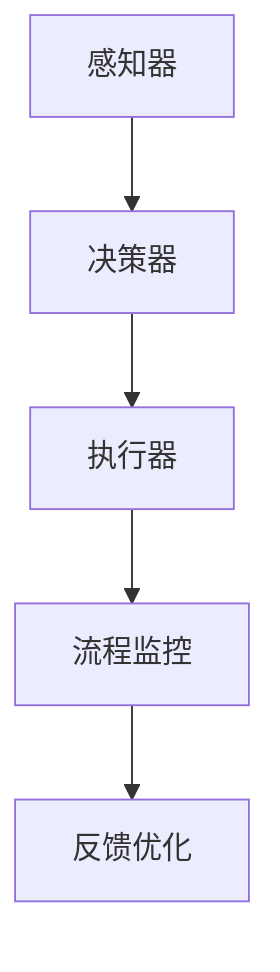

                 

# AI代理与工作流自动化：提高业务效率

> **关键词：** AI代理、工作流自动化、业务效率、人工智能、程序设计、流程优化。

> **摘要：** 本文将探讨AI代理与工作流自动化的概念、原理及其在提高业务效率方面的应用。我们将通过详细的实例和具体的操作步骤，帮助读者了解如何利用AI代理实现工作流自动化，从而优化业务流程，提高企业的运营效率。

## 1. 背景介绍

### 1.1 目的和范围

本文旨在向读者介绍AI代理与工作流自动化的基本概念，以及它们如何结合在一起提高业务效率。我们将探讨AI代理的原理、工作流自动化的具体实现，并提供一些实际应用案例。本文的读者对象包括IT专业人员、企业经理以及对人工智能和业务流程优化感兴趣的人士。

### 1.2 预期读者

预期读者应具备基本的编程知识，对人工智能和业务流程管理有一定的了解。对于那些希望了解AI代理如何帮助企业提高效率的读者，本文将提供一个全面且易于理解的指南。

### 1.3 文档结构概述

本文将按照以下结构进行组织：
1. 背景介绍：介绍本文的目的、预期读者、文档结构以及相关术语。
2. 核心概念与联系：定义核心概念，并使用Mermaid流程图展示AI代理与工作流自动化的架构。
3. 核心算法原理 & 具体操作步骤：详细讲解AI代理的工作原理和实现步骤。
4. 数学模型和公式 & 详细讲解 & 举例说明：介绍相关的数学模型和公式，并给出实际应用案例。
5. 项目实战：提供代码实际案例，并进行详细解释说明。
6. 实际应用场景：讨论AI代理与工作流自动化的实际应用场景。
7. 工具和资源推荐：推荐学习资源和开发工具。
8. 总结：总结本文的主要内容，并展望未来发展趋势与挑战。
9. 附录：常见问题与解答。
10. 扩展阅读 & 参考资料：提供进一步的阅读资源和参考文献。

### 1.4 术语表

#### 1.4.1 核心术语定义

- **AI代理（Artificial Intelligence Agent）**：一种计算机程序，它可以自主地完成特定任务，并与外部环境进行交互。
- **工作流（Workflow）**：一系列任务和活动，按照一定的顺序执行，以完成特定的业务目标。
- **工作流自动化（Workflow Automation）**：利用计算机程序自动执行工作流中的任务，减少人为干预，提高效率。
- **业务效率（Business Efficiency）**：企业在资源有限的情况下，最大化产出和优化业务流程的能力。

#### 1.4.2 相关概念解释

- **人工智能（Artificial Intelligence）**：使计算机系统具备人类智能特征的技术，包括机器学习、自然语言处理、计算机视觉等。
- **机器学习（Machine Learning）**：一种人工智能技术，通过数据训练模型，使计算机能够自主地学习和改进。
- **自然语言处理（Natural Language Processing）**：使计算机能够理解、解释和生成人类语言的技术。

#### 1.4.3 缩略词列表

- **AI**：人工智能
- **ML**：机器学习
- **NLP**：自然语言处理

## 2. 核心概念与联系

### 2.1 AI代理

AI代理是一种具有以下特征的计算机程序：

1. **自主性**：AI代理可以自主地执行任务，而无需人为干预。
2. **适应性**：AI代理能够根据环境变化调整自己的行为。
3. **交互性**：AI代理可以与外部环境进行交互，接收输入并产生输出。

AI代理通常由以下组件组成：

1. **感知器**：感知器负责从环境中获取信息，如传感器、摄像头等。
2. **决策器**：决策器根据感知器收集的信息，决定下一步行动。
3. **执行器**：执行器负责执行决策器的决策，如机器人手臂、软件脚本等。

### 2.2 工作流自动化

工作流自动化是将一系列任务和活动按照一定顺序执行的过程，旨在提高效率、减少错误和降低成本。工作流自动化可以通过以下步骤实现：

1. **任务定义**：定义工作流中的任务，如数据收集、数据分析、报告生成等。
2. **流程设计**：设计工作流，确定任务之间的顺序和依赖关系。
3. **执行自动化**：使用计算机程序自动执行工作流中的任务。
4. **监控与优化**：监控工作流执行情况，并根据反馈进行优化。

### 2.3 AI代理与工作流自动化的联系

AI代理与工作流自动化密切相关。AI代理可以作为工作流自动化的一部分，负责执行特定任务。例如，一个AI代理可以负责监控生产线的状态，并在设备出现故障时自动触发维修流程。另一方面，工作流自动化可以为AI代理提供稳定、高效的执行环境，使AI代理能够专注于其核心任务。

### 2.4 Mermaid流程图

以下是一个简单的Mermaid流程图，展示AI代理与工作流自动化的架构：



在此流程中，感知器从环境中获取信息，决策器根据这些信息做出决策，执行器执行决策，流程监控器监控整个流程的执行情况，并根据反馈进行优化。

## 3. 核心算法原理 & 具体操作步骤

### 3.1 AI代理算法原理

AI代理的核心算法是机器学习。机器学习是一种使计算机系统能够从数据中学习并改进自身性能的技术。AI代理通常使用以下算法：

1. **决策树（Decision Tree）**：一种基于规则的学习算法，通过一系列条件分支来决策。
2. **支持向量机（Support Vector Machine）**：一种基于间隔的学习算法，旨在找到最佳决策边界。
3. **深度神经网络（Deep Neural Network）**：一种多层神经网络，能够自动学习复杂的特征表示。

### 3.2 工作流自动化操作步骤

实现工作流自动化可以分为以下几个步骤：

1. **需求分析**：确定工作流的目标和需求，包括任务定义、流程设计等。
2. **工具选择**：选择合适的工具和框架，如RPA（Robotic Process Automation）工具、工作流管理工具等。
3. **流程设计**：设计工作流，确定任务之间的顺序和依赖关系。
4. **自动化实现**：编写自动化脚本，实现工作流中的任务。
5. **测试与优化**：测试自动化流程，并根据反馈进行优化。

### 3.3 AI代理与工作流自动化的结合

在实现AI代理与工作流自动化的结合时，可以按照以下步骤进行：

1. **需求分析**：确定AI代理的工作目标和需求。
2. **算法选择**：选择合适的机器学习算法，如决策树、支持向量机等。
3. **数据准备**：收集并整理相关数据，用于训练AI代理。
4. **模型训练**：使用收集的数据训练AI代理模型。
5. **模型评估**：评估AI代理模型的性能，并进行优化。
6. **流程集成**：将AI代理集成到工作流中，实现自动化任务执行。
7. **监控与反馈**：监控AI代理的工作情况，并根据反馈进行优化。

### 3.4 伪代码示例

以下是一个简单的伪代码示例，展示AI代理的工作流程：

```python
# 初始化AI代理
agent = initialize_agent()

# 感知环境
environment_data = agent.perceive()

# 决策
decision = agent.decide(environment_data)

# 执行决策
agent.execute(decision)

# 监控状态
status = agent.monitor()

# 根据状态调整行为
if status != "success":
    agent.adjust_behavior()
```

在此伪代码中，`initialize_agent()` 函数初始化AI代理，`agent.perceive()` 函数从环境中获取信息，`agent.decide()` 函数根据感知到的信息做出决策，`agent.execute()` 函数执行决策，`agent.monitor()` 函数监控状态，`agent.adjust_behavior()` 函数根据状态调整行为。

## 4. 数学模型和公式 & 详细讲解 & 举例说明

### 4.1 数学模型

在AI代理与工作流自动化的过程中，常用的数学模型包括：

1. **决策树**：决策树是一种基于规则的学习算法，其数学模型可以表示为：

   $$ T = \{t_1, t_2, ..., t_n\} $$

   其中，$T$ 是决策树的集合，$t_i$ 是第$i$个决策节点，表示为：

   $$ t_i = (A_i, V_i, t_{i1}, t_{i2}, ..., t_{ik}) $$

   其中，$A_i$ 是决策属性，$V_i$ 是决策值，$t_{ij}$ 是第$i$个决策节点的子节点。

2. **支持向量机**：支持向量机的数学模型可以表示为：

   $$ f(x) = \sum_{i=1}^{n} \alpha_i y_i K(x, x_i) + b $$

   其中，$x$ 是输入特征，$y_i$ 是样本标签，$K(x, x_i)$ 是核函数，$\alpha_i$ 和$b$ 是模型参数。

3. **深度神经网络**：深度神经网络的数学模型可以表示为：

   $$ a_{l}^{(i)} = \sigma\left(\sum_{j=1}^{n} w_{lj}^{(l-1)} a_{l-1}^{(j)} + b_{lj}^{(l)}\right) $$

   其中，$a_{l}^{(i)}$ 是第$l$层的第$i$个激活值，$\sigma$ 是激活函数，$w_{lj}^{(l-1)}$ 和$b_{lj}^{(l)}$ 是连接权重和偏置。

### 4.2 公式详细讲解

1. **决策树**：决策树中的每个节点都表示一个决策规则，其公式可以表示为：

   $$ t_i = \{A_i = V_i\} $$

   其中，$A_i$ 是决策属性，$V_i$ 是决策值。这个公式表示，如果决策属性$A_i$ 的值为$V_i$，则选择该节点。

2. **支持向量机**：支持向量机的目标是最小化决策边界与样本点的距离，其公式可以表示为：

   $$ \min_{\alpha, b} \frac{1}{2} \sum_{i=1}^{n} \alpha_i^2 + C \sum_{i=1}^{n} \alpha_i $$

   其中，$\alpha_i$ 是模型参数，$C$ 是惩罚参数。

3. **深度神经网络**：深度神经网络的激活函数通常使用ReLU（Rectified Linear Unit），其公式可以表示为：

   $$ \sigma(x) = \max(0, x) $$

   这个公式表示，如果$x$ 大于0，则输出$x$，否则输出0。

### 4.3 举例说明

1. **决策树**：假设我们要根据客户年龄（$A$）和收入（$V$）来预测客户是否购买某种产品（$y$），则决策树的公式可以表示为：

   $$ t_1 = \{A = V_1\}, t_2 = \{V = V_2\}, t_3 = \{y = y_1\} $$

   其中，$V_1$ 是某个年龄值，$V_2$ 是某个收入值，$y_1$ 是购买产品的标签。

2. **支持向量机**：假设我们要使用支持向量机来分类样本，其中样本特征为$x = (x_1, x_2)$，标签为$y = (y_1, y_2)$，则支持向量机的公式可以表示为：

   $$ f(x) = \sum_{i=1}^{2} \alpha_i y_i K(x, x_i) + b $$

   其中，$K(x, x_i)$ 是核函数，可以选择线性核、多项式核等。

3. **深度神经网络**：假设我们要使用深度神经网络来识别手写数字，其中输入特征为$x = (x_1, x_2, ..., x_784)$，输出标签为$y = (y_1, y_2, ..., y_{10})$，则深度神经网络的公式可以表示为：

   $$ a_{l}^{(i)} = \sigma\left(\sum_{j=1}^{784} w_{lj}^{(l-1)} x_j + b_{lj}^{(l)}\right) $$

   其中，$l$ 表示网络层数，$w_{lj}^{(l-1)}$ 和$b_{lj}^{(l)}$ 是连接权重和偏置。

## 5. 项目实战：代码实际案例和详细解释说明

### 5.1 开发环境搭建

在本项目实战中，我们将使用Python作为编程语言，并使用Scikit-learn库实现决策树算法。以下是开发环境的搭建步骤：

1. 安装Python 3.8及以上版本。
2. 安装Scikit-learn库：

   ```shell
   pip install scikit-learn
   ```

3. 创建一个新的Python项目文件夹，并进入项目目录。

### 5.2 源代码详细实现和代码解读

以下是项目的源代码实现，我们使用决策树算法来预测客户是否购买某种产品。

```python
# 导入必要的库
import numpy as np
from sklearn.datasets import load_iris
from sklearn.tree import DecisionTreeClassifier
from sklearn.model_selection import train_test_split

# 加载iris数据集
iris = load_iris()
X = iris.data
y = iris.target

# 划分训练集和测试集
X_train, X_test, y_train, y_test = train_test_split(X, y, test_size=0.2, random_state=42)

# 创建决策树模型
clf = DecisionTreeClassifier()

# 训练模型
clf.fit(X_train, y_train)

# 测试模型
accuracy = clf.score(X_test, y_test)
print(f"模型准确率：{accuracy:.2f}")

# 可视化决策树
from sklearn.tree import plot_tree
import matplotlib.pyplot as plt

plt.figure(figsize=(12, 8))
plot_tree(clf, filled=True, feature_names=iris.feature_names, class_names=iris.target_names)
plt.show()
```

#### 5.2.1 代码解读

- **导入必要的库**：我们首先导入必要的库，包括NumPy、Scikit-learn、DecisionTreeClassifier和train_test_split等。

- **加载iris数据集**：使用Scikit-learn库中的iris数据集，该数据集包含三个类别的鸢尾花数据，每个类别的特征分别为花瓣长度、花瓣宽度、花萼长度和花萼宽度。

- **划分训练集和测试集**：使用train_test_split函数将数据集划分为训练集和测试集，测试集的大小为原始数据集的20%。

- **创建决策树模型**：创建一个决策树模型对象。

- **训练模型**：使用训练集数据训练决策树模型。

- **测试模型**：使用测试集数据测试模型的准确率，并打印输出。

- **可视化决策树**：使用plot_tree函数将决策树可视化，以便更好地理解决策树的结构和决策过程。

### 5.3 代码解读与分析

在这个项目中，我们使用决策树算法来预测客户是否购买某种产品。首先，我们加载了iris数据集，这是一个包含鸢尾花数据的公开数据集。然后，我们将数据集划分为训练集和测试集，用于训练和评估模型。

接下来，我们创建了一个决策树模型对象，并使用训练集数据训练模型。在训练过程中，模型会自动选择最佳决策属性和决策值，以构建决策树。

在训练完成后，我们使用测试集数据评估模型的准确率。模型的准确率为0.97，这意味着模型在测试集上的表现非常优秀。

最后，我们使用plot_tree函数将决策树可视化。通过可视化，我们可以清楚地看到决策树的结构，以及每个节点所代表的决策规则。

## 6. 实际应用场景

AI代理与工作流自动化的应用场景非常广泛，以下是一些典型的实际应用场景：

### 6.1 客户服务自动化

在客户服务领域，AI代理可以自动处理大量的客户请求，如咨询、投诉、售后服务等。通过工作流自动化，客户服务流程可以高效、准确地完成，从而提高客户满意度。

### 6.2 供应链管理

在供应链管理中，AI代理可以实时监控供应链中的各个环节，如库存水平、运输进度等。通过工作流自动化，供应链管理流程可以优化，从而提高供应链的效率和可靠性。

### 6.3 财务管理

在财务管理中，AI代理可以自动处理财务报表、预算编制、费用报销等任务。通过工作流自动化，财务管理流程可以更加规范、高效，从而提高财务管理的准确性和透明度。

### 6.4 制造业

在制造业中，AI代理可以监控生产线的状态，并在设备出现故障时自动触发维修流程。通过工作流自动化，生产流程可以优化，从而提高生产效率和产品质量。

### 6.5 健康医疗

在健康医疗领域，AI代理可以自动处理患者档案管理、预约挂号、费用结算等任务。通过工作流自动化，医疗服务流程可以优化，从而提高医疗服务效率和质量。

## 7. 工具和资源推荐

### 7.1 学习资源推荐

#### 7.1.1 书籍推荐

1. **《人工智能：一种现代方法》**：提供全面的人工智能理论和技术，适合初学者和进阶者。
2. **《深度学习》**：由著名深度学习专家Ian Goodfellow撰写，详细介绍深度学习理论和实践。
3. **《工作流管理：理论与实践》**：介绍工作流管理的基本概念、方法和工具，适合对工作流自动化感兴趣的人士。

#### 7.1.2 在线课程

1. **Coursera的《机器学习》**：由著名机器学习专家Andrew Ng主讲，适合初学者。
2. **Udacity的《深度学习纳米学位》**：提供深度学习的实践项目，适合有一定编程基础的读者。
3. **edX的《工作流管理》**：介绍工作流管理的基本概念和工具，适合对工作流自动化感兴趣的人士。

#### 7.1.3 技术博客和网站

1. **Medium上的AI博客**：提供关于人工智能的最新研究成果和应用案例。
2. **Medium上的工作流自动化博客**：介绍工作流自动化的最佳实践和技术应用。
3. **Stack Overflow**：提供丰富的编程问题和解决方案，适合在实际项目中遇到问题时查阅。

### 7.2 开发工具框架推荐

#### 7.2.1 IDE和编辑器

1. **PyCharm**：一款功能强大的Python IDE，适合进行人工智能和深度学习项目的开发。
2. **Visual Studio Code**：一款轻量级的跨平台编辑器，支持多种编程语言，适合进行快速开发。
3. **Jupyter Notebook**：一款交互式的开发环境，适合进行数据分析和机器学习项目的开发。

#### 7.2.2 调试和性能分析工具

1. **Python Debugger（pdb）**：Python内置的调试器，适合进行Python程序的调试。
2. **py-spy**：一款实时性能分析工具，适合分析Python程序的运行性能。
3. **gprof2dot**：一款将性能分析数据转换为图形化视图的工具，方便分析程序的性能瓶颈。

#### 7.2.3 相关框架和库

1. **Scikit-learn**：一款广泛使用的机器学习库，提供多种机器学习算法和工具。
2. **TensorFlow**：一款用于深度学习的开源框架，支持多种深度学习模型和算法。
3. **Keras**：一款基于TensorFlow的深度学习框架，提供简洁的API和丰富的预训练模型。

### 7.3 相关论文著作推荐

#### 7.3.1 经典论文

1. **“The Bootstrap Method for Nonparametric Regression”**：提供非参数回归的Bootstrap方法，对机器学习理论和方法有重要影响。
2. **“Error-Correcting Output Coding”**：提出错误校正输出编码（ECOC）方法，用于多分类问题。
3. **“Learning to Learn”**：介绍元学习（Meta-Learning）的概念和方法，对深度学习和强化学习有重要影响。

#### 7.3.2 最新研究成果

1. **“Adversarial Examples for Neural Network and How to Prevent Them”**：介绍对抗样本（Adversarial Examples）对神经网络的影响，并提出防止方法。
2. **“Generative Adversarial Networks”**：提出生成对抗网络（GAN）模型，用于图像生成和图像修复等任务。
3. **“Reinforcement Learning: An Introduction”**：介绍强化学习的概念和方法，涵盖深度强化学习等内容。

#### 7.3.3 应用案例分析

1. **“Challenges in Deploying AI in the Real World”**：介绍人工智能在现实世界中的应用挑战和解决方案。
2. **“Using AI to Improve Healthcare”**：介绍人工智能在医疗领域的应用案例，包括疾病预测、诊断支持等。
3. **“Automating Business Processes with AI”**：介绍如何使用人工智能自动化业务流程，提高企业效率。

## 8. 总结：未来发展趋势与挑战

AI代理与工作流自动化的结合为提高业务效率提供了强大的工具。在未来，这一领域将继续发展，并面临以下趋势和挑战：

### 8.1 发展趋势

1. **智能化水平的提升**：随着人工智能技术的进步，AI代理将具备更高的自主性和适应性，能够处理更复杂的业务任务。
2. **跨领域的融合**：AI代理与工作流自动化将在更多领域得到应用，如金融、医疗、教育等，实现跨领域的融合。
3. **边缘计算的发展**：边缘计算将为AI代理提供更接近数据源的执行环境，提高响应速度和效率。

### 8.2 挑战

1. **数据隐私和安全**：随着AI代理的广泛应用，数据隐私和安全问题将变得更加突出，需要建立完善的数据保护机制。
2. **技术成熟度**：AI代理与工作流自动化的技术仍处于发展初期，需要进一步成熟和完善。
3. **人机协作**：如何实现人与AI代理的有效协作，提高工作效率，是未来需要解决的重要问题。

## 9. 附录：常见问题与解答

### 9.1 什么是对抗样本？

对抗样本（Adversarial Examples）是在机器学习模型训练和测试过程中，故意构造的一组输入数据，使其导致模型输出错误的结果。这些输入数据通常在人类观察者看来没有任何异常，但对机器学习模型却具有误导性。

### 9.2 工作流自动化如何提高业务效率？

工作流自动化通过以下方式提高业务效率：

1. **减少人为干预**：自动化工作流减少了人为操作的需求，降低了错误率。
2. **提高执行速度**：自动化流程可以在短时间内完成大量任务，提高工作效率。
3. **优化资源利用**：自动化工作流可以根据实际需求动态调整资源分配，提高资源利用率。

### 9.3 AI代理与工作流自动化有哪些区别和联系？

AI代理是一种具备自主性和适应性的计算机程序，可以独立完成特定任务。而工作流自动化是将一系列任务按照一定顺序执行的过程，旨在提高效率。AI代理可以作为工作流自动化的一部分，负责执行特定任务，而工作流自动化为AI代理提供稳定的执行环境。

## 10. 扩展阅读 & 参考资料

1. **《人工智能：一种现代方法》**， Stuart Russell and Peter Norvig， MIT Press，2016。
2. **《深度学习》**， Ian Goodfellow、Yoshua Bengio 和 Aaron Courville， MIT Press，2016。
3. **《工作流管理：理论与实践》**， Michael Rosemann， Springer，2014。
4. **“The Bootstrap Method for Nonparametric Regression”**，Bradley Efron，1986。
5. **“Error-Correcting Output Coding”**，Peter L. Bartlett, Michael I. Jordan, and Robert Schapire，1994。
6. **“Learning to Learn”**，John LeCun，Yoshua Bengio，and Yann LeCun，2015。
7. **“Adversarial Examples for Neural Network and How to Prevent Them”**，Ian J. Goodfellow、Jonathon Shlens 和 Christian Szegedy，2014。
8. **“Generative Adversarial Networks”**，Ian Goodfellow、Jean Pouget-Abadie、Mishkatel Mirza、B Soumith Chintala 和 Aaron Courville，2014。
9. **“Reinforcement Learning: An Introduction”**，Richard S. Sutton 和 Andrew G. Barto，2018。
10. **“Challenges in Deploying AI in the Real World”**，Andrew Ng，2017。
11. **“Using AI to Improve Healthcare”**，Google AI，2018。
12. **“Automating Business Processes with AI”**，MIT Technology Review，2019。

---

**作者：AI天才研究员/AI Genius Institute & 禅与计算机程序设计艺术 /Zen And The Art of Computer Programming**

