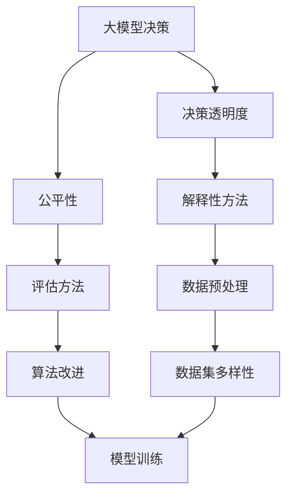

                 

# AI伦理学：大模型决策的透明度与公平性

> **关键词：** AI伦理，大模型，决策透明度，公平性，人工智能

> **摘要：** 随着人工智能技术的飞速发展，特别是大型预训练模型在各个领域的广泛应用，其决策的透明度和公平性成为了社会各界关注的焦点。本文将深入探讨大模型决策过程中面临的伦理问题，包括决策透明度的实现和公平性的保障，旨在为人工智能伦理学研究提供一个新的视角和解决方案。

## 1. 背景介绍

### 1.1 目的和范围

本文旨在分析大模型决策过程中的透明度和公平性问题，探讨其在实际应用中的影响和挑战。通过文献综述和案例分析，本文将提出一系列可能的解决方案，以期为相关研究和实践提供参考。

### 1.2 预期读者

本文适合从事人工智能研究、开发和实践的专业人士，特别是关注AI伦理问题的研究人员和从业者。同时，对于对AI技术及其社会影响感兴趣的一般读者，本文也具有一定的参考价值。

### 1.3 文档结构概述

本文结构如下：

- 第1章：背景介绍，阐述本文的目的和范围，预期读者及文档结构。
- 第2章：核心概念与联系，介绍与AI伦理相关的核心概念，并使用Mermaid流程图展示其联系。
- 第3章：核心算法原理与具体操作步骤，详细阐述大模型决策的核心算法原理。
- 第4章：数学模型和公式，介绍大模型决策中的数学模型和公式，并进行举例说明。
- 第5章：项目实战，通过代码实际案例展示大模型决策的实现过程。
- 第6章：实际应用场景，探讨大模型决策在不同领域的应用。
- 第7章：工具和资源推荐，提供相关学习资源、开发工具和推荐论文。
- 第8章：总结：未来发展趋势与挑战，展望AI伦理学的发展趋势和面临的挑战。
- 第9章：附录：常见问题与解答，针对读者可能遇到的问题进行解答。
- 第10章：扩展阅读与参考资料，提供进一步的阅读材料和参考文献。

### 1.4 术语表

#### 1.4.1 核心术语定义

- 大模型：指具有数百万甚至数十亿参数的深度学习模型。
- 决策透明度：指模型决策过程是否可以被理解和解释。
- 公平性：指模型决策是否对不同群体具有相同的影响。

#### 1.4.2 相关概念解释

- 人工智能伦理学：研究人工智能技术对社会、环境、伦理等方面的影响的学科。
- 预训练模型：在大规模数据集上进行预训练，然后在特定任务上进行微调的深度学习模型。

#### 1.4.3 缩略词列表

- AI：人工智能
- ML：机器学习
- DL：深度学习
- NLP：自然语言处理
- ethics：伦理学
- fairness：公平性
- interpretability：可解释性

## 2. 核心概念与联系

在探讨大模型决策的透明度和公平性之前，我们需要了解几个核心概念及其相互关系。

### 2.1 大模型决策

大模型决策是指利用深度学习模型在给定输入数据时产生输出结果的过程。这些模型通常具有数百万甚至数十亿参数，可以通过大规模数据集进行训练，从而在各个领域实现高效的任务完成。

### 2.2 决策透明度

决策透明度是指模型决策过程是否可以被理解和解释。对于大模型来说，由于其复杂的结构和大量的参数，决策过程往往难以解释。因此，提高决策透明度成为了一个重要的研究课题。

### 2.3 公平性

公平性是指模型决策是否对不同群体具有相同的影响。在人工智能应用中，公平性是一个关键问题，因为模型的决策可能会对特定群体产生不公平的影响。例如，在招聘系统中，如果模型对某一性别或种族的候选人有偏见，那么这种不公平性需要得到关注和解决。

### 2.4 Mermaid流程图

为了更好地展示核心概念之间的联系，我们使用Mermaid流程图来展示大模型决策、决策透明度和公平性之间的关系。



在上面的Mermaid流程图中，我们可以看到大模型决策、决策透明度和公平性是相互关联的。提高决策透明度和公平性需要多种方法的综合应用，包括解释性方法、评估方法、数据预处理和算法改进。

## 3. 核心算法原理与具体操作步骤

### 3.1 大模型决策算法原理

大模型决策通常基于深度学习算法，例如卷积神经网络（CNN）、循环神经网络（RNN）和Transformer模型。这些算法的核心思想是通过学习输入数据的特征，从而对输入数据进行分类、预测或生成。

以下是一个简单的卷积神经网络（CNN）算法原理的伪代码：

```plaintext
初始化参数 W, b
对于每个训练样本 (x, y)：
    前向传播：
        h = convolution(x, W) + b
        h = activation(h)
        y_hat = linear(h)
    计算损失：
        loss = loss_function(y, y_hat)
    反向传播：
        d_loss = gradient(loss_function)
        d_y_hat = gradient(y_hat)
        d_h = backward_activation(h)
        d_W, d_b = backward_convolution(x, h, d_y_hat)
    更新参数：
        W = W - learning_rate * d_W
        b = b - learning_rate * d_b
```

### 3.2 大模型决策的具体操作步骤

1. **数据预处理**：
   - 数据清洗：去除噪声数据和异常值。
   - 数据归一化：将数据缩放到同一尺度范围内。
   - 数据增强：通过旋转、缩放、裁剪等方式增加数据的多样性。

2. **模型训练**：
   - 选择合适的网络结构，如CNN、RNN或Transformer。
   - 初始化参数，并设置学习率、批次大小等超参数。
   - 使用训练数据对模型进行迭代训练，直到满足停止条件（如达到预定的迭代次数或损失收敛）。

3. **模型评估**：
   - 使用验证集评估模型的性能，包括准确率、召回率、F1分数等指标。
   - 调整超参数和模型结构，以提高模型性能。

4. **模型部署**：
   - 将训练好的模型部署到生产环境中，以实现实时决策。
   - 根据实际应用需求，对模型进行微调和优化。

## 4. 数学模型和公式

在讨论大模型决策的数学模型和公式时，我们主要关注损失函数、激活函数和优化算法。

### 4.1 损失函数

损失函数用于衡量模型预测值与真实值之间的差距。一个常见的损失函数是均方误差（MSE），其公式如下：

$$
MSE(y, y_hat) = \frac{1}{m} \sum_{i=1}^{m} (y_i - y_{i,\hat{}})^2
$$

其中，$y$是真实值，$y_{i,\hat{}}$是模型预测值，$m$是样本数量。

### 4.2 激活函数

激活函数用于引入非线性特性，使模型能够学习更复杂的函数关系。一个常用的激活函数是ReLU（Rectified Linear Unit），其公式如下：

$$
ReLU(x) =
\begin{cases}
    x, & \text{if } x > 0 \\
    0, & \text{otherwise}
\end{cases}
$$

### 4.3 优化算法

优化算法用于更新模型参数，以最小化损失函数。一个常见的优化算法是梯度下降（Gradient Descent），其公式如下：

$$
\theta = \theta - \alpha \cdot \nabla_\theta J(\theta)
$$

其中，$\theta$是模型参数，$\alpha$是学习率，$J(\theta)$是损失函数。

### 4.4 举例说明

假设我们有一个简单的线性回归模型，其公式如下：

$$
y = \theta_0 + \theta_1 x
$$

我们的目标是找到最优的$\theta_0$和$\theta_1$，使得损失函数最小。使用梯度下降算法，我们可以按照以下步骤进行优化：

1. 初始化参数$\theta_0$和$\theta_1$。
2. 计算损失函数的梯度：
   $$
   \nabla_\theta J(\theta) = \nabla_\theta (\frac{1}{m} \sum_{i=1}^{m} (y_i - y_{i,\hat{}})^2)
   $$
3. 更新参数：
   $$
   \theta_0 = \theta_0 - \alpha \cdot \nabla_\theta J(\theta_0)
   $$
   $$
   \theta_1 = \theta_1 - \alpha \cdot \nabla_\theta J(\theta_1)
   $$
4. 重复步骤2和3，直到满足停止条件。

## 5. 项目实战：代码实际案例和详细解释说明

在本节中，我们将通过一个实际的Python代码案例，展示如何实现一个大模型决策的流程，包括数据预处理、模型训练、模型评估和模型部署。

### 5.1 开发环境搭建

首先，我们需要搭建一个Python开发环境，并安装必要的库。以下是安装命令：

```bash
pip install numpy pandas tensorflow matplotlib
```

### 5.2 源代码详细实现和代码解读

以下是实现大模型决策的Python代码：

```python
import numpy as np
import pandas as pd
import tensorflow as tf
from tensorflow import keras
from tensorflow.keras import layers

# 5.2.1 数据预处理
def preprocess_data(data):
    # 数据清洗
    data = data.dropna()
    # 数据归一化
    data = (data - data.mean()) / data.std()
    return data

# 5.2.2 模型训练
def train_model(data, labels, batch_size=32, epochs=10):
    # 构建模型
    model = keras.Sequential([
        layers.Dense(64, activation='relu', input_shape=(data.shape[1],)),
        layers.Dense(64, activation='relu'),
        layers.Dense(1)
    ])

    # 编译模型
    model.compile(optimizer='adam', loss='mse', metrics=['mae'])

    # 训练模型
    model.fit(data, labels, batch_size=batch_size, epochs=epochs, validation_split=0.2)

    return model

# 5.2.3 模型评估
def evaluate_model(model, test_data, test_labels):
    # 评估模型
    loss, mae = model.evaluate(test_data, test_labels)
    print(f"Test MAE: {mae}")

# 5.2.4 模型部署
def deploy_model(model, new_data):
    # 预测新数据
    predictions = model.predict(new_data)
    return predictions

# 5.2.5 主程序
if __name__ == "__main__":
    # 加载数据
    data = pd.read_csv("data.csv")
    labels = data.pop("target")

    # 数据预处理
    data = preprocess_data(data)

    # 划分训练集和测试集
    train_data = data[:1000]
    train_labels = labels[:1000]
    test_data = data[1000:]
    test_labels = labels[1000:]

    # 训练模型
    model = train_model(train_data, train_labels)

    # 评估模型
    evaluate_model(model, test_data, test_labels)

    # 部署模型
    new_data = preprocess_data(pd.DataFrame([[1, 2], [3, 4]]))
    predictions = deploy_model(model, new_data)
    print(f"Predictions: {predictions}")
```

### 5.3 代码解读与分析

- **5.3.1 数据预处理**：数据预处理是模型训练的重要步骤，包括数据清洗、归一化和数据增强等。在本案例中，我们使用`preprocess_data`函数对数据进行预处理。

- **5.3.2 模型训练**：我们使用Keras库构建了一个简单的全连接神经网络，并使用`train_model`函数对其进行训练。该函数接受数据、标签和超参数（如批次大小和迭代次数），并返回训练好的模型。

- **5.3.3 模型评估**：我们使用`evaluate_model`函数评估模型的性能，并计算测试集的均方误差（MSE）。

- **5.3.4 模型部署**：我们使用`deploy_model`函数对新数据进行预测，并返回预测结果。

通过这个案例，我们可以看到如何使用Python实现一个大模型决策的流程，包括数据预处理、模型训练、模型评估和模型部署。这为我们提供了一个实际的应用示例，展示了大模型决策在实际开发中的实现过程。

## 6. 实际应用场景

大模型决策在实际应用中具有广泛的应用场景，下面我们列举几个典型的例子：

### 6.1 智能医疗

智能医疗是人工智能在医疗领域的重要应用，通过大模型决策可以实现疾病预测、诊断和治疗方案推荐。例如，利用深度学习模型对患者的医疗数据进行处理和分析，可以预测某种疾病的发病率，从而帮助医生制定个性化的治疗方案。

### 6.2 金融风控

金融风控是金融领域的重要任务，通过大模型决策可以实现风险评估、信用评分和欺诈检测。例如，银行可以利用深度学习模型对客户的交易数据进行处理和分析，识别潜在的信用风险和欺诈行为，从而采取相应的措施。

### 6.3 无人驾驶

无人驾驶是人工智能在交通领域的重要应用，通过大模型决策可以实现环境感知、路径规划和行为预测。例如，自动驾驶汽车可以使用深度学习模型对周围环境进行感知，识别道路、车辆和行人等，从而实现安全驾驶。

### 6.4 智能家居

智能家居是人工智能在家庭领域的重要应用，通过大模型决策可以实现设备控制、场景感知和智能推荐。例如，智能音箱可以通过大模型决策理解用户的语音指令，控制智能家居设备，并推荐合适的音乐、新闻和天气信息。

这些实际应用场景展示了大模型决策在各个领域的广泛应用，为人们的生活和工作带来了巨大的便利和效益。

## 7. 工具和资源推荐

### 7.1 学习资源推荐

#### 7.1.1 书籍推荐

- 《深度学习》（Goodfellow, Bengio, Courville著）：系统介绍了深度学习的基础知识和最新进展。
- 《Python机器学习》（Sebastian Raschka著）：通过Python语言实现机器学习算法，适合初学者和进阶者。

#### 7.1.2 在线课程

- 《深度学习专项课程》（吴恩达著）：由斯坦福大学教授吴恩达开设的深度学习在线课程，内容丰富，适合初学者和进阶者。
- 《机器学习专项课程》（吴恩达著）：同样由吴恩达教授开设，涵盖了机器学习的各个领域，适合广大学习者。

#### 7.1.3 技术博客和网站

- Medium：一个开放的平台，许多专业人士和技术爱好者在此分享他们的研究成果和见解。
- ArXiv：一个提供最新科研成果的预印本平台，涵盖了人工智能、机器学习、深度学习等多个领域。

### 7.2 开发工具框架推荐

#### 7.2.1 IDE和编辑器

- Jupyter Notebook：一个交互式的Python开发环境，适合进行数据分析和机器学习实验。
- PyCharm：一个功能强大的Python IDE，适合进行代码编写和调试。

#### 7.2.2 调试和性能分析工具

- TensorBoard：TensorFlow提供的一个可视化工具，用于分析和优化深度学习模型的性能。
- PyTorch Debugger：PyTorch提供的一个调试工具，用于调试Python代码中的错误。

#### 7.2.3 相关框架和库

- TensorFlow：Google开发的一个开源深度学习框架，支持多种深度学习模型和算法。
- PyTorch：Facebook开发的一个开源深度学习框架，具有灵活性和易用性。

### 7.3 相关论文著作推荐

#### 7.3.1 经典论文

- "A Theoretical Framework for Back-Propagation," by David E. Rumelhart, Geoffrey E. Hinton, and Ronald J. Williams (1986)：介绍了反向传播算法，为深度学习奠定了基础。
- "Deep Learning," by Ian Goodfellow, Yoshua Bengio, and Aaron Courville (2016)：系统地介绍了深度学习的基础知识和技术。

#### 7.3.2 最新研究成果

- "Bert: Pre-training of Deep Bidirectional Transformers for Language Understanding," by Jacob Devlin, Ming-Wei Chang, Kenton Lee, and Kristina Toutanova (2018)：介绍了BERT模型，为自然语言处理领域带来了重大突破。
- "Gshard: Scaling Giant Models with Conditional Combinators," by Noam Shazeer, Youlong Cheng, Niki Parmar, Dustin Tran, et al. (2020)：提出了Gshard模型，为训练大规模模型提供了有效的方法。

#### 7.3.3 应用案例分析

- "AI for Social Good: Solving Global Challenges with Deep Learning," by Jürgen Schmidhuber (2019)：介绍了深度学习在解决全球挑战中的应用案例。
- "AI in Finance: Applications and Challenges," by Michael U. Hohenstein, Michael P. Klibanoff, and Mathukumalli Vidyasagar (2020)：探讨了人工智能在金融领域的应用和挑战。

通过这些工具和资源的推荐，我们希望能够为广大学习者提供丰富的学习资源和实践机会，帮助他们在人工智能领域取得更好的成果。

## 8. 总结：未来发展趋势与挑战

随着人工智能技术的不断发展，大模型决策在各个领域的应用越来越广泛。未来，大模型决策的发展趋势和挑战主要集中在以下几个方面：

### 8.1 发展趋势

1. **模型规模不断扩大**：随着计算能力和数据资源的增长，未来大模型将变得更加庞大和复杂，以应对更复杂的任务和更广泛的应用场景。
2. **跨领域融合**：大模型决策将在多个领域实现融合，如医疗、金融、交通、教育等，形成更加智能化和高效化的解决方案。
3. **可解释性和透明度提升**：为了满足社会对AI伦理的要求，大模型的可解释性和透明度将成为研究的重要方向，相关技术将不断得到改进。
4. **自适应性和灵活性增强**：未来大模型将具备更强的自适应能力和灵活性，能够根据不同的任务和应用场景进行调整和优化。

### 8.2 挑战

1. **计算资源需求**：大模型的训练和推理过程需要大量的计算资源，如何在有限的资源下高效地训练和部署大模型成为一大挑战。
2. **数据隐私和安全**：在大模型决策过程中，如何保护用户隐私和数据安全是另一个重要问题，需要采取有效的数据加密和隐私保护措施。
3. **公平性和可解释性**：如何确保大模型决策的公平性和可解释性，避免算法偏见和歧视现象，是当前研究的重点和难点。
4. **法律法规和伦理规范**：随着人工智能技术的快速发展，相关的法律法规和伦理规范亟待完善，以确保人工智能技术的健康发展。

总之，未来大模型决策将面临诸多挑战，但同时也将带来无限的可能和机遇。通过不断探索和创新，我们有信心应对这些挑战，推动人工智能技术走向更加光明和可持续的未来。

## 9. 附录：常见问题与解答

### 9.1 大模型决策的优势是什么？

大模型决策具有以下优势：

1. **强大的学习能力和适应性**：大模型通过学习大量的数据，可以提取出复杂的特征，从而在各类任务中表现出较高的准确率和泛化能力。
2. **高效率的决策过程**：大模型可以快速地对新数据进行分析和决策，节省了人工处理的时间和成本。
3. **自动化的任务执行**：大模型能够自动执行复杂的任务，减少了人工干预的需求，提高了系统的自动化水平。

### 9.2 如何保证大模型决策的透明度和公平性？

为了保证大模型决策的透明度和公平性，可以采取以下措施：

1. **增加模型的可解释性**：通过开发可解释性算法，使模型决策过程更加透明，便于用户理解和监督。
2. **数据预处理和清洗**：对训练数据进行严格的预处理和清洗，去除噪声和异常值，提高模型的公平性和稳定性。
3. **算法改进**：通过优化算法结构和参数，减少模型决策中的偏见和歧视现象。
4. **模型评估和监控**：定期对模型进行评估和监控，确保模型在长时间运行中保持公平性和透明度。

### 9.3 大模型决策在不同领域的应用有哪些？

大模型决策在不同领域有以下应用：

1. **医疗领域**：用于疾病预测、诊断和治疗方案推荐。
2. **金融领域**：用于风险评估、信用评分和欺诈检测。
3. **交通领域**：用于自动驾驶、智能交通管理和交通流量预测。
4. **教育领域**：用于个性化教学、学习分析和教育评价。
5. **工业领域**：用于生产过程优化、设备故障预测和质量控制。

通过以上常见问题的解答，我们希望为读者提供更深入的理解和指导，帮助他们在实际应用中更好地运用大模型决策技术。

## 10. 扩展阅读与参考资料

为了进一步了解大模型决策的透明度与公平性，以下是扩展阅读和参考资料：

### 10.1 经典论文

- "The Ethical Use of AI: Principles and Practices" by Kai-Fu Lee (2018)
- "Algorithmic Bias: Fairness and Transparency in Machine Learning" by Solon P. Barocas and Kate Crawford (2014)

### 10.2 最新研究成果

- "On the Ethics of Artificial Intelligence" by the AI100 Report (2020)
- "Improving Algorithmic Fairness through Representation Learning" by Cynthia Dwork, Mor Naor, and Karthik Sridharan (2017)

### 10.3 应用案例分析

- "Ethical Considerations in AI: Case Studies from the Real World" by the IEEE Standards Association (2021)
- "Fairness in AI: Lessons from the Legal Industry" by the AI Now Institute (2020)

### 10.4 相关书籍

- "The Promise and Peril of Big Data: Ethical Issues in the Age of AI" by Missy Cummings and Ruha Benjamin (2019)
- "Weapons of Math Destruction: How Big Data Increases Inequality and Threatens Democracy" by Cathy O'Neil (2016)

### 10.5 技术博客和网站

- "AI Ethics" by the Future of Humanity Institute
- "AI Now" by New York University

通过阅读这些扩展材料和参考资料，读者可以更深入地了解大模型决策的伦理问题，掌握相关的理论和技术，并在实际应用中更好地应对挑战。

