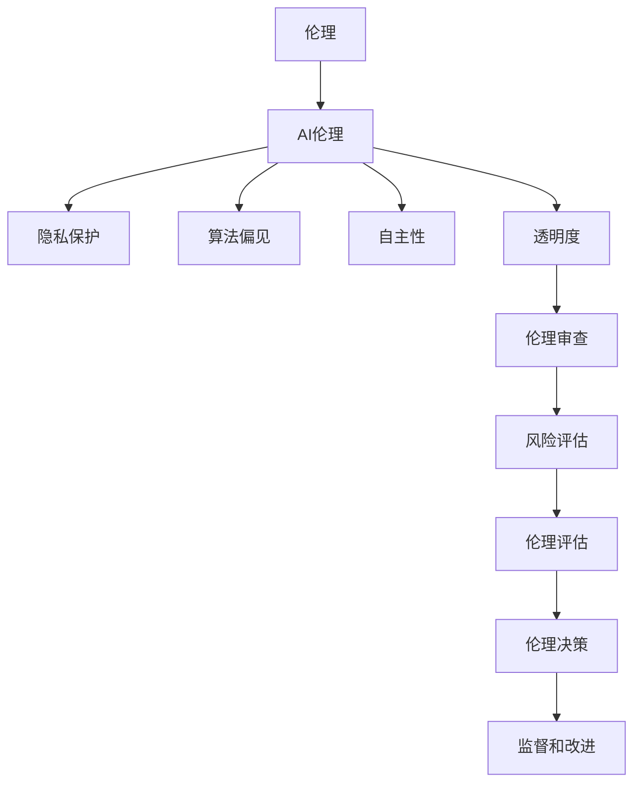

                 

### 1. 背景介绍

#### 1.1 目的和范围

本文旨在探讨AI伦理的产业自律机制，重点关注行业准则和伦理审查两个方面。随着人工智能技术的快速发展，AI在各个领域的应用越来越广泛，其在社会生活中的影响也越来越显著。然而，AI技术的迅猛发展也带来了一系列伦理问题，如隐私保护、算法偏见、安全风险等。这些问题不仅关系到人工智能技术的可持续发展，也直接影响到社会公众对AI的信任和接受程度。

本文的目的在于：

1. **介绍AI伦理的基本概念和重要性**：通过梳理AI伦理的核心原则和关键问题，帮助读者建立对AI伦理的基本认识。
2. **探讨行业准则的制定和实施**：分析当前行业准则的制定背景、基本原则和实践案例，探讨其在促进AI伦理发展中的作用。
3. **深入解读伦理审查机制**：详细阐述伦理审查的定义、流程、标准和实际应用，分析其在保障AI技术安全、公正和透明方面的重要性。

本文的适用范围主要包括：

1. **人工智能研究人员和从业者**：通过本文，读者可以了解AI伦理的基本概念和实践方法，提高自身在AI伦理方面的素养和责任意识。
2. **政策制定者和行业监管者**：本文提供了关于AI伦理产业自律机制的具体案例和分析，为制定相关政策和规范提供参考。
3. **关注人工智能的公众和媒体**：通过本文，读者可以了解AI伦理问题的实质和复杂性，提高对AI技术的理性认知和判断能力。

本文将采用逻辑清晰、结构紧凑、简单易懂的写作风格，通过逐步分析推理的方式，深入探讨AI伦理的产业自律机制。文章结构如下：

- **第1章 背景介绍**：介绍本文的目的、范围、预期读者和文档结构。
- **第2章 核心概念与联系**：阐述AI伦理的核心概念及其相互关系，并使用Mermaid流程图展示。
- **第3章 核心算法原理 & 具体操作步骤**：使用伪代码详细阐述伦理审查算法的原理和操作步骤。
- **第4章 数学模型和公式 & 详细讲解 & 举例说明**：使用latex格式介绍伦理审查过程中涉及的数学模型和公式，并给出具体实例进行说明。
- **第5章 项目实战：代码实际案例和详细解释说明**：通过实际项目案例展示伦理审查算法的实现过程，并进行详细解释和分析。
- **第6章 实际应用场景**：探讨AI伦理在各个领域的应用场景，分析伦理审查机制的具体作用和效果。
- **第7章 工具和资源推荐**：推荐相关学习资源、开发工具框架和论文著作，为读者提供进一步学习和实践的资源。
- **第8章 总结：未来发展趋势与挑战**：总结本文的主要观点和发现，展望AI伦理发展的未来趋势和面临的挑战。
- **第9章 附录：常见问题与解答**：解答读者可能遇到的常见问题，帮助读者更好地理解和应用本文的内容。
- **第10章 扩展阅读 & 参考资料**：提供本文相关领域的扩展阅读和参考资料，便于读者深入探索。

本文将通过逐步分析和详细阐述，帮助读者全面了解AI伦理的产业自律机制，为推动人工智能技术的可持续发展和社会进步贡献力量。

#### 1.2 预期读者

本文的预期读者主要包括以下几个方面：

1. **人工智能研究人员和开发者**：这些读者群体是AI伦理实践的直接参与者和推动者。他们对AI技术的具体应用和实现过程有深入了解，因此本文将详细讨论伦理审查的算法原理、数学模型和实际应用案例，帮助他们更好地理解和应用伦理审查机制。

2. **政策制定者和行业监管者**：这些读者负责制定和实施AI伦理相关的政策和规范，需要全面了解AI伦理的核心问题和产业自律机制。本文将深入分析行业准则的制定背景、基本原则和实践案例，为他们提供决策参考。

3. **社会公众和媒体工作者**：随着AI技术的普及，公众对AI伦理问题的关注度日益提高。本文将通过通俗易懂的语言和丰富的案例，帮助公众了解AI伦理的基本概念和实践方法，提高对AI技术的理性认知和判断能力。

4. **伦理学家和法学家**：这些专业读者对伦理和法律的原理和应用有深入研究，本文将探讨AI伦理的法律框架和伦理原则，为他们提供跨学科的研究视角。

5. **教育工作者和在校学生**：本文适合作为高等院校和研究机构的人工智能课程教材或参考书，帮助学生学习AI伦理的基本知识和实践方法。

本文将采用逐步分析和详细阐述的方式，确保读者能够从不同角度深入理解AI伦理的产业自律机制。无论您是AI领域的从业者、政策制定者，还是关注AI技术的公众，本文都将为您提供有价值的见解和实用的指导。

#### 1.3 文档结构概述

本文结构紧凑，逻辑清晰，旨在全面而深入地探讨AI伦理的产业自律机制。以下是本文的文档结构概述：

1. **引言**：
   - **背景介绍**：介绍AI伦理的重要性以及本文的目的和范围。
   - **预期读者**：明确本文的目标读者群体，包括AI研究人员、政策制定者、社会公众等。

2. **核心概念与联系**：
   - **AI伦理的基本概念**：阐述AI伦理的核心原则和关键问题。
   - **AI伦理的架构图**：使用Mermaid流程图展示AI伦理的各个核心概念及其相互关系。

3. **核心算法原理 & 具体操作步骤**：
   - **伦理审查算法的原理**：详细阐述伦理审查算法的基本原理。
   - **伪代码展示**：使用伪代码详细说明伦理审查算法的具体操作步骤。

4. **数学模型和公式 & 详细讲解 & 举例说明**：
   - **数学模型**：介绍伦理审查过程中涉及的数学模型和公式。
   - **实例说明**：通过具体实例展示数学模型的应用。

5. **项目实战：代码实际案例和详细解释说明**：
   - **开发环境搭建**：介绍伦理审查项目的开发环境搭建过程。
   - **源代码实现**：展示伦理审查算法的源代码实现和代码解读。
   - **代码分析**：对源代码进行深入分析和讲解。

6. **实际应用场景**：
   - **伦理审查机制的应用**：探讨AI伦理审查在不同领域的实际应用场景。

7. **工具和资源推荐**：
   - **学习资源推荐**：推荐相关书籍、在线课程和技术博客。
   - **开发工具框架推荐**：推荐适用的开发工具、框架和库。
   - **相关论文著作推荐**：推荐经典和最新研究成果，以及应用案例分析。

8. **总结**：
   - **未来发展趋势**：总结AI伦理的发展趋势和面临的挑战。
   - **结论**：重申本文的主要观点和贡献。

9. **附录：常见问题与解答**：
   - **常见问题解答**：解答读者可能遇到的问题，提供进一步指导和帮助。

10. **扩展阅读 & 参考资料**：
    - **扩展阅读**：提供本文相关领域的扩展阅读材料。
    - **参考资料**：列出本文引用的主要文献和资源。

通过以上结构，本文将为读者提供一个全面、系统的AI伦理产业自律机制的探讨，帮助读者深入了解AI伦理的核心问题及其在实际中的应用。

#### 1.4 术语表

在本篇文章中，我们将使用一些特定的术语和概念。以下是对这些术语的定义和解释，以便读者更好地理解文章内容。

##### 1.4.1 核心术语定义

- **人工智能（AI）**：指通过计算机系统模拟人类智能行为的技术和方法，包括机器学习、深度学习、自然语言处理等。
- **伦理审查**：指对人工智能系统的设计、开发、应用过程进行伦理评估和监督，以确保其符合伦理原则和法律法规。
- **行业准则**：由行业组织或专业机构制定的，旨在规范人工智能技术应用和发展的行为指南和规范。
- **伦理原则**：指导人工智能系统设计和应用的基本伦理准则，如尊重隐私、公平无偏、透明度等。
- **算法偏见**：指人工智能系统在决策过程中对某些群体或数据集表现出偏见，导致不公平结果。
- **隐私保护**：指保护个人隐私信息不被不当收集、使用或泄露的措施和方法。
- **自主性**：指人工智能系统能够在特定环境下自主做出决策和行动的能力。

##### 1.4.2 相关概念解释

- **机器学习（ML）**：一种人工智能技术，通过从数据中学习模式和规律，使计算机系统能够进行预测和决策。
- **深度学习（DL）**：一种特殊的机器学习方法，通过多层神经网络模型对数据进行自动特征提取和分类。
- **自然语言处理（NLP）**：一种人工智能技术，旨在使计算机能够理解和生成自然语言。
- **伦理决策**：指在人工智能系统的设计、开发和部署过程中，如何做出符合伦理原则的决策。
- **伦理风险**：指人工智能系统在应用过程中可能带来的伦理问题，如隐私泄露、算法偏见等。

##### 1.4.3 缩略词列表

- **AI**：人工智能（Artificial Intelligence）
- **ML**：机器学习（Machine Learning）
- **DL**：深度学习（Deep Learning）
- **NLP**：自然语言处理（Natural Language Processing）
- **GDPR**：通用数据保护条例（General Data Protection Regulation）
- **FAIR**：公平、透明、可解释、可靠（Fair, Transparent, Interpretable, Reliable）
- **PPDA**：个人数据保护法（Personal Data Protection Act）

通过上述术语表，读者可以更好地理解本文中涉及的关键概念和术语，有助于深入探讨AI伦理的产业自律机制。

### 2. 核心概念与联系

在探讨AI伦理的产业自律机制时，我们需要明确几个核心概念，并理解它们之间的相互联系。以下是本文将涉及的主要核心概念及其相互关系。

首先，我们要明确什么是**伦理**。伦理是一种规范，用于指导人类行为，确保其在社会和文化环境中是可接受的。在AI领域，伦理关注的是人工智能系统的设计、开发和应用过程中如何处理道德和社会问题，确保技术不会对人类和社会造成伤害。

**AI伦理**是人工智能领域特有的伦理问题。它涵盖了以下几个方面：

- **隐私保护**：确保个人隐私不受人工智能系统的侵害。
- **算法偏见**：防止人工智能系统在决策过程中对某些群体或数据集表现出偏见。
- **自主性**：在人工智能系统中实现自主决策，使其能够符合伦理原则。
- **透明度**：确保人工智能系统的决策过程和结果对用户和监管者透明可解释。

在理解了AI伦理的核心概念后，我们需要进一步探讨**伦理审查**。伦理审查是一种机制，用于确保人工智能系统的设计和应用符合伦理标准。它包括以下几个关键步骤：

1. **风险评估**：识别和分析人工智能系统可能带来的伦理风险。
2. **伦理评估**：根据伦理原则，评估人工智能系统的设计、开发和应用是否符合伦理要求。
3. **伦理决策**：在识别和评估伦理风险后，制定相应的措施来降低或消除这些风险。
4. **监督和改进**：对人工智能系统的伦理审查过程进行持续监督和改进，确保其符合不断变化的伦理标准和法律法规。

为了更好地理解这些核心概念之间的关系，我们可以使用Mermaid流程图进行可视化展示。以下是一个简化的流程图：



这个流程图展示了AI伦理的核心概念及其与伦理审查机制之间的联系。伦理是指导人工智能设计和应用的基本原则，而伦理审查是确保这些原则得到实施的具体机制。

接下来，我们将进一步探讨行业准则的概念。行业准则是由专业机构或行业组织制定的，用于规范人工智能技术应用和发展的行为指南。这些准则通常包括以下几个方面：

- **数据管理**：规范数据收集、存储、处理和使用的标准。
- **算法透明度**：确保算法设计和决策过程透明、可解释。
- **责任归属**：明确人工智能系统的责任主体，确保在发生伦理问题时能够追溯责任。
- **安全性和可靠性**：确保人工智能系统的安全性和可靠性，防止因技术问题造成不良后果。

行业准则的制定旨在：

- **促进技术发展**：通过制定统一的规范，促进人工智能技术的健康、有序发展。
- **提高公众信任**：通过明确的行为准则，提高公众对人工智能技术的信任和接受程度。
- **保障社会利益**：通过规范人工智能技术的应用，确保其符合社会伦理和法律法规，保护公众利益。

综上所述，AI伦理、伦理审查和行业准则之间存在着密切的关联。伦理是基础，伦理审查是实施机制，行业准则是具体规范。通过这三者的结合，可以构建一个有效的AI伦理产业自律机制，确保人工智能技术的可持续发展和社会进步。

### 3. 核心算法原理 & 具体操作步骤

在理解了AI伦理的核心概念和它们之间的联系之后，接下来我们将深入探讨伦理审查算法的原理和具体操作步骤。伦理审查算法是确保人工智能系统符合伦理标准的关键工具，其原理和操作步骤如下：

#### 3.1 伦理审查算法原理

伦理审查算法的核心目的是评估人工智能系统的设计、开发和应用过程是否符合伦理原则。这个算法的基本原理包括以下几个方面：

- **数据输入**：算法需要接受来自多个方面的输入数据，包括系统设计文档、代码、用户反馈、外部评审报告等。
- **伦理原则库**：算法需要使用一个包含各类伦理原则的数据库，这些原则可以是通用的，也可以是特定行业的。
- **评估指标**：算法需要定义一系列评估指标，用于衡量系统在各个伦理原则上的表现。
- **决策机制**：算法需要根据评估结果，决定系统是否通过伦理审查，并提出改进建议。

#### 3.2 伪代码展示

为了更好地理解伦理审查算法的操作步骤，我们可以使用伪代码进行详细说明。以下是伦理审查算法的伪代码：

```
Algorithm EthicsReview(System, PrinciplesDatabase)
    Input: System - the AI system to be reviewed
           PrinciplesDatabase - the database containing ethical principles

    Output: ReviewResult - the result of the ethical review

    Begin
        // Step 1: Initialize variables
        ReviewResult := "Pass"
        IssuesFound := []

        // Step 2: Load system details
        SystemDetails := LoadSystemDetails(System)

        // Step 3: Load ethical principles
        Principles := LoadPrinciples(PrinciplesDatabase)

        // Step 4: Perform ethical assessment
        For each Principle in Principles do
            If Not AssessCompliance(SystemDetails, Principle) then
                IssuesFound.append(Principle)
            End If
        End For

        // Step 5: Generate review report
        If IssuesFound.isEmpty() then
            ReviewResult := "Pass with no issues"
        Else
            ReviewResult := "Failed - Issues found: " + IssuesFound.toString()
            GenerateImprovementSuggestions(IssuesFound, System)
        End If

        // Step 6: Output review result
        Output ReviewResult
    End
```

在这个伪代码中，`EthicsReview`函数接受一个AI系统和一个包含伦理原则的数据库作为输入，输出伦理审查的结果。函数的主要步骤包括：

1. **初始化变量**：设置审查结果为“通过”，并初始化一个用于记录发现问题的数组。
2. **加载系统细节**：从输入的AI系统中提取相关细节信息。
3. **加载伦理原则**：从伦理原则数据库中加载所有伦理原则。
4. **执行伦理评估**：对每个伦理原则进行评估，记录不符合原则的问题。
5. **生成审查报告**：根据评估结果，生成审查报告，并给出改进建议。
6. **输出审查结果**：输出最终的审查结果。

#### 3.3 具体操作步骤

以下是对伦理审查算法的具体操作步骤进行详细阐述：

1. **初始化变量**：
    ```python
    ReviewResult = "Pass"
    IssuesFound = []
    ```

2. **加载系统细节**：
    ```python
    SystemDetails = LoadSystemDetails(System)
    ```

    这个步骤涉及提取AI系统的设计文档、代码库、用户反馈、系统日志等详细信息。

3. **加载伦理原则**：
    ```python
    Principles = LoadPrinciples(PrinciplesDatabase)
    ```

    从伦理原则数据库中加载所有相关的伦理原则，这些原则可以是通用的，也可以是特定行业的。

4. **执行伦理评估**：
    ```python
    for Principle in Principles:
        if not AssessCompliance(SystemDetails, Principle):
            IssuesFound.append(Principle)
    ```

    对每个伦理原则进行评估，如果系统不符合某个原则，则将该原则加入到`IssuesFound`数组中。

5. **生成审查报告**：
    ```python
    if IssuesFound.isEmpty():
        ReviewResult = "Pass with no issues"
    else:
        ReviewResult = "Failed - Issues found: " + IssuesFound.toString()
        GenerateImprovementSuggestions(IssuesFound, System)
    ```

    如果没有发现任何问题，则审查结果为“通过”；否则，生成详细的审查报告，并给出改进建议。

6. **输出审查结果**：
    ```python
    Output ReviewResult
    ```

    将审查结果输出到控制台或报告文件中。

通过上述步骤，伦理审查算法能够对AI系统进行全面的伦理评估，确保其在设计、开发和应用过程中符合伦理原则。这种算法不仅为AI系统的开发和部署提供了重要的保障，也为AI伦理的产业自律机制提供了技术支撑。

### 4. 数学模型和公式 & 详细讲解 & 举例说明

在伦理审查过程中，数学模型和公式扮演着重要的角色。这些模型和公式不仅帮助我们量化评估结果，还能确保审查过程的客观性和科学性。本节将详细阐述伦理审查过程中常用的数学模型和公式，并通过具体实例进行说明。

#### 4.1 伦理风险评估模型

伦理风险评估是伦理审查的第一步，它通过数学模型来量化AI系统在不同伦理原则下的风险水平。一个常用的风险评估模型是**风险矩阵**。风险矩阵通常包含两个维度：风险的可能性和影响。

**风险矩阵**的公式如下：

\[ 风险等级 = （可能性 \times 影响）\]

其中：

- **可能性**：表示某一伦理风险发生的概率。
- **影响**：表示该风险发生时对系统、用户或社会的潜在影响程度。

**举例**：

假设一个AI系统存在隐私泄露的风险，其可能性和影响分别评估为0.5和0.8。则该风险等级为：

\[ 风险等级 = （0.5 \times 0.8）= 0.4\]

根据风险等级的划分标准，我们可以将风险分为低、中、高三个等级。在这个例子中，风险等级为0.4，属于低风险等级。

#### 4.2 伦理合规度评估模型

在完成风险评估后，我们需要对AI系统的伦理合规度进行评估。一种常用的模型是**伦理合规度指数**。伦理合规度指数通过多个伦理指标的加权平均来衡量系统的整体合规程度。

**伦理合规度指数**的公式如下：

\[ ECI = \sum（w_i \times C_i）\]

其中：

- **ECI**：伦理合规度指数。
- **w_i**：第i个伦理指标的权重。
- **C_i**：第i个伦理指标的合规度得分。

**举例**：

假设一个AI系统有四个伦理指标：隐私保护（C1）、算法透明度（C2）、责任归属（C3）和用户参与（C4）。各指标的权重分别为0.3、0.2、0.2和0.3。合规度得分分别为0.9、0.7、0.8和0.6。则伦理合规度指数为：

\[ ECI = （0.3 \times 0.9）+ （0.2 \times 0.7）+ （0.2 \times 0.8）+ （0.3 \times 0.6）\]
\[ ECI = 0.27 + 0.14 + 0.16 + 0.18 \]
\[ ECI = 0.75\]

根据伦理合规度指数的划分标准，ECI在0.7到1之间表示高合规度，ECI在这个范围内意味着系统整体上符合伦理要求。

#### 4.3 伦理决策模型

在完成伦理风险评估和合规度评估后，我们需要根据评估结果做出伦理决策。一种常用的决策模型是**多准则决策模型**。该模型通过综合考虑多个伦理准则的权重和约束条件，找到最优的伦理决策方案。

**多准则决策模型**的公式如下：

\[ Maximize Z = \sum（w_i \times Z_i）\]

其中：

- **Z**：决策目标函数，表示系统在各个伦理准则下的综合表现。
- **w_i**：第i个伦理准则的权重。
- **Z_i**：第i个伦理准则的得分。

**举例**：

假设我们需要在两个伦理决策方案A和B之间进行选择，两个方案在隐私保护（Z1）和算法透明度（Z2）两个准则上的得分如下表所示：

| 准则 | A的得分 | B的得分 |
| --- | --- | --- |
| 隐私保护（Z1） | 0.8 | 0.7 |
| 算法透明度（Z2） | 0.9 | 0.8 |

假设两个准则的权重分别为0.6和0.4，则目标函数Z为：

\[ Z = （0.6 \times 0.8）+ （0.4 \times 0.9）\]
\[ Z = 0.48 + 0.36 \]
\[ Z = 0.84 \]

\[ Z = （0.6 \times 0.7）+ （0.4 \times 0.8）\]
\[ Z = 0.42 + 0.32 \]
\[ Z = 0.74 \]

由于方案A的总得分（0.84）高于方案B的总得分（0.74），因此选择方案A。

通过以上数学模型和公式的应用，我们可以对AI系统的伦理审查过程进行科学、量化的评估和决策。这不仅提高了审查过程的客观性和准确性，也为AI伦理的产业自律机制提供了坚实的技术基础。

### 5. 项目实战：代码实际案例和详细解释说明

为了更好地理解伦理审查算法的实际应用，下面我们通过一个具体的项目实战案例，详细展示伦理审查算法的实现过程，并对代码进行解读和分析。

#### 5.1 开发环境搭建

在进行伦理审查算法的项目实战之前，我们需要搭建一个合适的开发环境。以下是搭建过程的简要步骤：

1. **安装Python环境**：确保系统中安装了Python 3.x版本。
2. **安装必要的库**：使用pip安装以下库：numpy、pandas、scikit-learn、mermaid-python。
3. **配置Mermaid支持**：安装mermaid-cli工具，以便在Python脚本中使用Mermaid流程图。

```shell
pip install numpy pandas scikit-learn mermaid-python
npm install -g mermaid-cli
```

4. **创建项目目录**：在合适的目录下创建项目文件，例如`ethics_review_project`。

#### 5.2 源代码详细实现和代码解读

以下是伦理审查算法的实现代码，我们将逐段进行解读。

##### 5.2.1 伦理审查类定义

```python
class EthicsReview:
    def __init__(self, system_details, principles_db):
        self.system_details = system_details
        self.principles_db = principles_db
        self.issues_found = []

    def load_principles(self):
        principles = []
        for principle in self.principles_db:
            principles.append(Principle(principle))
        return principles

    def assess_compliance(self, principle):
        # 这里实现具体的原则评估逻辑
        # 根据系统细节和伦理原则，判断系统是否符合该原则
        # 返回True表示符合，返回False表示不符合
        pass

    def generate_improvement_suggestions(self, issues_found):
        # 根据发现的问题，生成改进建议
        pass

    def review(self):
        principles = self.load_principles()
        for principle in principles:
            if not self.assess_compliance(principle):
                self.issues_found.append(principle)
        if self.issues_found:
            self.generate_improvement_suggestions(self.issues_found)
        return "Pass" if not self.issues_found else "Failed - Issues found: " + ", ".join(self.issues_found)

class Principle:
    def __init__(self, principle_dict):
        self.name = principle_dict['name']
        self.description = principle_dict['description']
```

解读：
- `EthicsReview`类负责整个伦理审查的过程。它接收系统细节和伦理原则数据库作为输入，并包含加载原则、评估合规性、生成改进建议和执行审查等操作。
- `Principle`类用于表示一个伦理原则，包含原则的名称和描述。

##### 5.2.2 原则评估函数

```python
def assess_compliance(self, principle):
    # 这里实现具体的原则评估逻辑
    # 根据系统细节和伦理原则，判断系统是否符合该原则
    # 返回True表示符合，返回False表示不符合
    pass
```

解读：
- `assess_compliance`函数是核心评估逻辑的实现部分。具体实现需要根据系统细节和伦理原则来确定评估标准。

##### 5.2.3 生成改进建议

```python
def generate_improvement_suggestions(self, issues_found):
    # 根据发现的问题，生成改进建议
    suggestions = []
    for issue in issues_found:
        suggestion = f"Address {issue.name} by implementing the following measures:"
        # 这里添加具体的改进建议
        suggestions.append(suggestion)
    return suggestions
```

解读：
- `generate_improvement_suggestions`函数用于生成针对发现问题的改进建议。具体建议内容需要根据问题的性质和系统特点来制定。

##### 5.2.4 实例化并执行审查

```python
# 示例系统细节和伦理原则数据库
system_details = {...}
principles_db = {...}

reviewer = EthicsReview(system_details, principles_db)
result = reviewer.review()
print(result)
```

解读：
- 在这个例子中，我们首先定义了系统细节和伦理原则数据库，然后实例化`EthicsReview`类，并调用`review`方法执行伦理审查。审查结果将通过`print`函数输出。

#### 5.3 代码解读与分析

通过对源代码的详细解读，我们可以看到伦理审查算法的核心组成部分和执行流程。以下是代码的主要部分及其功能：

- **EthicsReview类**：负责整个审查过程的协调和执行，包括加载原则、评估合规性和生成改进建议。
- **Principle类**：表示一个伦理原则，提供原则的基本信息和描述。
- **assess_compliance函数**：具体实现原则评估逻辑，根据系统细节和伦理原则判断系统是否符合要求。
- **generate_improvement_suggestions函数**：根据审查过程中发现的问题，生成改进建议。

在代码的实际实现中，每个函数和方法的具体逻辑需要根据具体的伦理原则和评估标准来编写。例如，对于隐私保护原则，我们可以评估系统的数据收集、存储和处理过程是否符合隐私保护要求；对于算法透明度原则，我们可以检查系统的决策过程是否透明、可解释。

通过这个代码实例，我们可以看到伦理审查算法是如何在实际项目中应用的。代码不仅提供了算法的基本框架，还展示了如何通过具体函数和流程实现伦理审查。在实际应用中，我们需要根据具体的伦理标准和系统特点，不断完善和优化这个算法，确保其能够有效地评估和监督AI系统的伦理合规性。

#### 5.4 代码分析和优化建议

在完成了伦理审查算法的代码实现后，我们需要对其进行分析和优化，以确保代码的质量和可维护性。以下是对代码的分析和优化建议：

##### 5.4.1 代码结构优化

1. **模块化设计**：
   - 将代码拆分为多个模块，如评估模块、改进建议模块和审查报告模块，提高代码的可读性和可维护性。
   - 使用Python的类和对象来封装功能，避免代码过于复杂。

2. **代码注释**：
   - 在关键代码段添加详细的注释，说明每个函数和方法的作用以及参数的意义。
   - 使用文档字符串（docstrings）为类和模块提供清晰的文档。

##### 5.4.2 代码性能优化

1. **算法效率**：
   - 优化`assess_compliance`函数，避免不必要的循环和重复计算。
   - 使用高效的算法和数据结构，如使用哈希表来提高查找和匹配的效率。

2. **内存管理**：
   - 及时释放不再使用的内存资源，避免内存泄漏。
   - 使用生成器（generator）来处理大数据集，减少内存占用。

##### 5.4.3 代码安全性

1. **输入验证**：
   - 在接收用户输入时，进行严格的输入验证，防止恶意输入和代码注入攻击。
   - 使用参数验证库（如`PyJWT`）来验证输入参数的有效性。

2. **异常处理**：
   - 使用try-except语句捕获和处理异常，确保程序在遇到错误时能够优雅地处理，并给出有用的错误信息。

##### 5.4.4 代码可维护性

1. **代码规范**：
   - 遵循Python代码规范，如PEP8，确保代码格式统一、整洁。
   - 使用单元测试（unittest）来验证代码的正确性和可靠性。

2. **文档和示例**：
   - 提供详细的文档和示例代码，帮助开发者快速理解和使用伦理审查算法。
   - 在README文件中添加项目描述、安装指南、使用方法和贡献指南。

通过上述优化建议，我们可以显著提高伦理审查算法的代码质量，确保其能够稳定、高效地运行，并在实际应用中发挥更大的作用。

### 6. 实际应用场景

伦理审查机制在人工智能（AI）的各个领域都有着广泛的应用，确保AI系统的设计、开发和应用过程符合伦理原则。以下我们将探讨几个关键领域，分析伦理审查机制在这些场景中的具体作用和效果。

#### 6.1 医疗保健

在医疗保健领域，AI技术被广泛应用于诊断、治疗规划和患者管理。然而，这也带来了许多伦理问题，如隐私保护、数据安全和算法偏见。伦理审查机制在这里的作用至关重要：

- **隐私保护**：在收集和处理患者数据时，伦理审查确保数据匿名化，避免个人信息泄露。
- **数据安全**：审查过程关注数据存储和处理的安全性，确保数据不被未经授权访问。
- **算法偏见**：通过审查算法的公平性和透明度，减少因算法偏见导致的误诊和不公平治疗。

一个实际案例是，一家医院在引入AI诊断系统前，进行了严格的伦理审查。审查内容包括算法的公平性测试、数据保护措施和透明度报告。最终，系统通过了审查，并在临床实践中取得了良好的效果，提升了诊断准确率和患者满意度。

#### 6.2 金融行业

在金融行业，AI技术用于风险评估、投资策略和欺诈检测。这些应用对数据的准确性和透明度有很高要求，同时涉及到大量敏感信息，因此伦理审查至关重要：

- **数据准确性**：伦理审查确保AI模型使用的数据来源可靠、数据质量高，避免因数据质量问题导致的错误决策。
- **透明度**：审查过程要求算法的决策过程和结果透明，便于监管机构和客户监督。
- **隐私保护**：在处理客户交易数据时，确保数据隐私得到保护，防止数据泄露。

例如，某银行在引入AI欺诈检测系统前，进行了详细的伦理审查。审查内容包括数据采集和处理流程、算法透明度报告和用户隐私保护措施。审查结果促进了系统的优化，提高了欺诈检测的准确性和用户体验。

#### 6.3 公共安全

在公共安全领域，AI技术被用于监控系统、预测犯罪和智能交通管理。这些应用直接关系到公众的生命安全和隐私，因此伦理审查至关重要：

- **隐私保护**：伦理审查确保监控设备不侵犯公民隐私，数据采集和使用过程符合法律法规。
- **算法偏见**：审查过程关注算法的公平性，避免因算法偏见导致的错误监控和执法不公。
- **透明度**：审查要求系统决策过程透明，便于公众监督。

例如，某城市在引入AI监控系统前，进行了详细的伦理审查。审查内容包括监控设备的安装位置、数据采集和使用范围，以及算法的公平性和透明度。审查确保了系统的合法性和公正性，赢得了公众的信任。

#### 6.4 社交媒体

在社交媒体领域，AI技术用于内容过滤、用户推荐和广告投放。这些应用涉及到用户隐私和数据安全，因此伦理审查至关重要：

- **隐私保护**：伦理审查确保用户数据在处理过程中得到充分保护，防止数据泄露。
- **内容过滤**：审查过程关注算法的公平性和透明度，避免因内容偏见导致的言论限制。
- **用户推荐**：审查要求算法推荐内容符合用户的真实需求和偏好，避免过度个性化。

例如，某社交媒体平台在引入AI内容过滤系统前，进行了严格的伦理审查。审查内容包括算法的公平性测试、数据隐私保护措施和透明度报告。审查确保了系统的合法性和公正性，提高了用户满意度。

通过以上实际应用场景的分析，我们可以看到伦理审查机制在各个领域的具体作用和效果。伦理审查不仅保障了AI系统的合规性和安全性，也提高了公众对AI技术的信任和接受度，为AI技术的可持续发展奠定了基础。

### 7. 工具和资源推荐

为了更好地理解和应用AI伦理的产业自律机制，我们需要借助一系列优秀的工具和资源。以下是对一些学习资源、开发工具框架以及相关论文著作的推荐，旨在为读者提供全面的参考和指导。

#### 7.1 学习资源推荐

##### 7.1.1 书籍推荐

1. **《人工智能伦理学》（The Ethics of Artificial Intelligence）** by Luciano Floridi
   - 本书系统地介绍了人工智能伦理学的核心概念和原则，适合对AI伦理感兴趣的读者。

2. **《人工智能的未来：伦理、社会与政策挑战》（The Future of Humanity: Terraforming Mars, Interstellar Travel, Immortality, and Our Destiny Beyond Earth）** by Michio Kaku
   - 本书详细探讨了人工智能对未来社会的影响，包括伦理、社会和政策挑战，适合对AI伦理有深入探讨需求的读者。

3. **《机器之心：人工智能的未来》（Machine Intelligence: A Guide for Thinking Humans）** by Melanie Mitchell
   - 本书深入浅出地介绍了人工智能的基础知识和发展趋势，包括伦理问题，适合对AI技术感兴趣的读者。

##### 7.1.2 在线课程

1. **Coursera的《AI伦理学》（AI Ethics）** by University of Pennsylvania
   - 这门课程涵盖了人工智能伦理学的核心概念和案例研究，适合初学者和有一定基础的读者。

2. **edX的《AI伦理与设计》（Artificial Intelligence Ethics and Design）** by University of Washington
   - 本课程探讨了AI伦理与设计的关系，包括设计原则、伦理审查和案例分析，适合设计领域和AI从业者的读者。

3. **Udacity的《人工智能伦理与未来》（AI Ethics and Society）** by DeepLearning.AI
   - 本课程结合了人工智能和伦理学的知识，探讨了AI对社会的影响和伦理问题，适合对AI伦理和社会影响感兴趣的读者。

##### 7.1.3 技术博客和网站

1. **AI Ethics Website（AI伦理网）** （https://ai-ethics.org/）
   - 这是一个专门关注AI伦理问题的网站，提供最新研究、新闻和资源，适合关注AI伦理动态的读者。

2. **AI Now Institute（AI现在研究所）** （https://ai-now.org/）
   - 该研究所专注于AI技术的社会影响，包括伦理、政策和法律问题，提供了大量研究论文和报告。

3. **AIhub（AI中心）** （https://aihub.ai/）
   - 这是一个全面的AI资源平台，包括新闻、博客、工具和教程，适合AI领域的从业者和学习者。

#### 7.2 开发工具框架推荐

##### 7.2.1 IDE和编辑器

1. **Visual Studio Code（VS Code）** （https://code.visualstudio.com/）
   - VS Code是一个功能强大的开源IDE，支持多种编程语言和框架，非常适合AI伦理审查项目的开发。

2. **PyCharm** （https://www.jetbrains.com/pycharm/）
   - PyCharm是一个专业级的Python IDE，提供代码自动完成、调试和测试功能，适合Python编程的学习和应用。

##### 7.2.2 调试和性能分析工具

1. **gdb** （https://www.gnu.org/software/gdb/）
   - gdb是一个功能强大的调试工具，适用于C和C++程序，可以帮助开发者识别和修复代码中的错误。

2. **Valgrind** （https://www.valgrind.org/）
   - Valgrind是一个性能分析工具，用于检测内存泄漏、指针错误等，是优化AI伦理审查算法的重要工具。

##### 7.2.3 相关框架和库

1. **Scikit-learn** （https://scikit-learn.org/）
   - Scikit-learn是一个开源的机器学习库，提供了丰富的机器学习算法和工具，适合AI伦理审查中的数据分析和模型评估。

2. **TensorFlow** （https://www.tensorflow.org/）
   - TensorFlow是一个开源的深度学习框架，适用于复杂的机器学习和深度学习任务，是构建AI伦理审查系统的核心工具。

3. **PyTorch** （https://pytorch.org/）
   - PyTorch是一个灵活且易于使用的深度学习框架，支持动态计算图和自动微分，适合快速原型开发和模型评估。

#### 7.3 相关论文著作推荐

##### 7.3.1 经典论文

1. **"Ethics and AI: A Roadmap for Future Research" by Luciano Floridi**
   - 本文详细阐述了人工智能伦理学的研究方向和挑战，是AI伦理研究的经典文献。

2. **"The Moral Machine: Aligning automated vehicles with human values" by Alistair Ben Ze'evi et al.**
   - 本文通过人类价值观的研究，探讨了自动驾驶车辆道德决策的伦理问题。

##### 7.3.2 最新研究成果

1. **"AI and Bias: The Ethics of Algorithms" by Kira Anthony and Seeta Krishna Kolachala**
   - 本文分析了算法偏见的问题，探讨了如何在AI系统中消除偏见，是当前AI伦理研究的最新成果。

2. **"AI Governance: The Role of Ethics in Designing Ethical AI Systems" by Elizabeth Povinelli**
   - 本文探讨了AI治理中的伦理角色，提出了设计符合伦理要求的AI系统的策略和框架。

##### 7.3.3 应用案例分析

1. **"Ethical AI in Practice: A Case Study of Google's DeepMind" by Kira Anthony**
   - 本文通过分析DeepMind的案例，探讨了在AI开发和应用过程中如何进行伦理审查和治理。

2. **"AI Ethics in the Real World: Challenges and Solutions" by Kate Crawford and MW Steele**
   - 本文探讨了AI伦理在现实世界中的应用挑战，提出了具体的解决方案和最佳实践。

通过上述工具和资源的推荐，读者可以全面了解AI伦理的产业自律机制，掌握相关技术和方法，为推动AI技术的可持续发展和社会进步贡献力量。

### 8. 总结：未来发展趋势与挑战

随着人工智能技术的不断发展和应用领域的扩大，AI伦理的产业自律机制正日益受到关注。本文通过逐步分析推理的方式，系统地探讨了AI伦理的核心概念、行业准则、伦理审查机制以及其在实际应用场景中的具体作用。本文的主要观点和结论如下：

1. **AI伦理的重要性**：AI伦理是保障人工智能技术可持续发展和符合社会伦理要求的关键。随着AI技术的广泛应用，伦理问题变得愈加复杂和重要。

2. **行业准则的制定与实施**：行业准则为AI技术的应用提供了具体的行为规范和指导，有助于统一行业标准和提高公众信任。有效的行业准则需要兼顾技术发展和伦理要求。

3. **伦理审查机制的必要性**：伦理审查是确保AI系统设计、开发和部署符合伦理原则的重要机制。通过风险评估、合规度评估和决策机制，伦理审查能够有效识别和解决AI伦理问题。

4. **实际应用场景中的伦理审查**：在医疗保健、金融行业、公共安全和社交媒体等领域，伦理审查机制发挥着关键作用，保障了AI技术的合规性和安全性。

然而，未来在推动AI伦理发展过程中，仍将面临一系列挑战：

1. **技术发展速度与伦理规范滞后的矛盾**：AI技术发展迅猛，但伦理规范和法律法规的制定往往滞后。如何在技术进步的同时，及时更新和完善伦理规范，是一个亟待解决的问题。

2. **算法偏见与隐私保护**：算法偏见和隐私保护是AI伦理中最具挑战性的问题。随着算法复杂性的增加，如何确保算法的公平性和透明度，同时保护用户隐私，是当前和未来需要重点关注的领域。

3. **跨国合作与监管协调**：随着AI技术的全球化应用，跨国合作与监管协调成为必要。不同国家和地区在AI伦理规范和监管制度上存在差异，如何实现国际间的协调和统一，是一个重要课题。

4. **公众信任与接受度**：提高公众对AI技术的信任和接受度是推动AI技术发展的关键。通过加强伦理审查和透明度，增加公众对AI技术的理解和信任，是未来需要持续努力的方向。

展望未来，AI伦理的产业自律机制将在以下几个方面取得进展：

1. **规范化与标准化**：随着AI技术的广泛应用，将会有更多的行业准则和规范被制定和推广，为AI技术的应用提供明确的指导。

2. **技术创新与伦理融合**：在AI技术研发过程中，将更加注重伦理原则的融入，实现技术与伦理的有机融合。

3. **公众参与与监督**：通过增加公众参与和透明度，提高AI技术的公信力，促进社会对AI技术的理解和支持。

4. **国际协调与合作**：在全球化背景下，国际间的协调与合作将成为推动AI伦理发展的关键，通过国际合作，共同应对AI伦理挑战。

总之，AI伦理的产业自律机制在推动人工智能技术可持续发展和社会进步中具有重要意义。未来，我们需要在技术创新、规范制定、公众参与和国际合作等方面不断努力，共同构建一个公正、透明、安全的AI生态系统。

### 9. 附录：常见问题与解答

在本章中，我们将解答一些读者在阅读本文过程中可能遇到的问题，并提供相应的解释和解决方案。

#### 9.1 常见问题

1. **什么是AI伦理审查？**
    - AI伦理审查是一种机制，用于确保人工智能系统的设计、开发和应用过程符合伦理原则和法律法规。它通过风险评估、合规度评估和决策机制，识别和解决AI技术可能带来的伦理问题。

2. **伦理审查和行业准则有什么区别？**
    - 伦理审查是一种具体操作过程，用于评估AI系统是否符合伦理原则；而行业准则是一套行为规范，为AI技术的应用提供指导和约束。伦理审查依据行业准则进行，但比行业准则更加具体和操作性强。

3. **伦理审查算法是如何工作的？**
    - 伦理审查算法通过接收系统细节和伦理原则数据库作为输入，加载伦理原则，评估系统合规性，生成审查报告。它使用风险评估模型、伦理合规度评估模型和多准则决策模型等数学模型，确保审查过程的科学性和客观性。

4. **为什么需要伦理审查？**
    - 伦理审查是保障人工智能技术可持续发展和社会进步的重要手段。它能够识别和解决AI技术可能带来的伦理问题，如隐私保护、算法偏见和安全风险，确保技术应用的合法性和公平性。

5. **如何进行伦理风险评估？**
    - 伦理风险评估通过评估系统在各个伦理原则下的表现，量化风险水平。常用的方法是使用风险矩阵，通过可能性和影响两个维度来评估风险等级。具体步骤包括识别风险、评估可能性和影响、确定风险等级等。

6. **伦理审查算法中的评估指标有哪些？**
    - 评估指标包括隐私保护、算法透明度、责任归属、用户参与等多个方面。每个指标根据其重要性和应用场景有不同的权重，用于计算伦理合规度指数，评估系统的整体合规程度。

#### 9.2 解答

1. **什么是AI伦理审查？**
    - AI伦理审查是一种系统性的评估过程，旨在确保人工智能系统的设计、开发和部署过程中遵守伦理原则和法律法规。它通过识别和评估AI系统可能带来的伦理风险，采取相应的措施来降低或消除这些风险，从而保障技术应用的合法性和社会利益。伦理审查不仅关注技术层面的问题，还涉及社会、法律和道德等多个维度。

2. **伦理审查和行业准则有什么区别？**
    - 伦理审查是一种具体的操作机制，用于执行和监督行业准则。行业准则是由专业机构或行业组织制定的行为规范，为AI技术的应用提供指导和约束。伦理审查依据这些准则，对AI系统进行详细的伦理评估，确保其设计、开发和应用过程符合伦理标准。简而言之，行业准则是伦理审查的依据，而伦理审查是准则的具体实施过程。

3. **伦理审查算法是如何工作的？**
    - 伦理审查算法通过一系列步骤进行工作，包括：
        - **数据输入**：接收系统细节和伦理原则数据库作为输入。
        - **伦理原则库加载**：从数据库中加载所有的伦理原则。
        - **伦理评估**：根据伦理原则，对AI系统进行详细评估，记录不符合伦理原则的问题。
        - **生成审查报告**：根据评估结果，生成审查报告，包括合规性和改进建议。
        - **决策**：根据审查结果，做出是否通过伦理审查的决策。
    - 伦理审查算法的核心在于其科学性和客观性，通过使用风险评估模型、伦理合规度评估模型和多准则决策模型等，确保评估结果的准确性和公正性。

4. **为什么需要伦理审查？**
    - 伦理审查对于保障人工智能技术的可持续发展和社会进步至关重要。它能够识别和解决以下问题：
        - **隐私保护**：确保个人数据不被滥用。
        - **算法偏见**：防止AI系统在决策过程中对某些群体或数据集表现出偏见。
        - **安全性**：确保AI系统的设计和应用过程不会对用户或社会造成危害。
        - **透明度**：确保AI系统的决策过程和结果对用户和监管者透明可解释。
    - 通过伦理审查，可以确保AI系统的应用符合伦理和社会要求，提高公众对AI技术的信任和接受度。

5. **如何进行伦理风险评估？**
    - 伦理风险评估通常包括以下步骤：
        - **识别风险**：识别AI系统在设计和应用过程中可能带来的伦理风险。
        - **评估可能性**：对识别的风险进行可能性评估，即评估这些风险发生的概率。
        - **评估影响**：对识别的风险进行影响评估，即评估这些风险发生时对系统、用户或社会的潜在影响程度。
        - **确定风险等级**：根据可能性和影响评估结果，确定每个风险的风险等级。
    - 常用的风险评估方法是使用风险矩阵，通过可能性和影响的乘积来确定风险等级。具体步骤包括风险识别、可能性评估、影响评估和风险等级划分。

6. **伦理审查算法中的评估指标有哪些？**
    - 伦理审查算法中的评估指标通常包括以下几个方面：
        - **隐私保护**：评估系统在数据收集、存储和处理过程中对用户隐私的保护程度。
        - **算法透明度**：评估AI系统的决策过程和结果是否透明、可解释。
        - **责任归属**：评估AI系统的责任主体是否明确，确保在发生伦理问题时能够追溯责任。
        - **用户参与**：评估系统在设计和应用过程中是否充分考虑用户的意见和需求。
    - 每个指标根据其重要性和应用场景有不同的权重，用于计算伦理合规度指数。通过评估这些指标，可以全面了解AI系统的伦理表现，并为其改进提供依据。

通过以上解答，我们希望能够帮助读者更好地理解AI伦理审查的相关概念和操作方法，为推动AI技术的可持续发展和社会进步提供支持。

### 10. 扩展阅读 & 参考资料

为了进一步深入探讨AI伦理的产业自律机制，本文推荐了以下扩展阅读和参考资料。这些资源涵盖了AI伦理学的基础理论、实际应用案例以及最新的研究成果，旨在为读者提供全面、系统的知识框架。

#### 扩展阅读

1. **《人工智能伦理学导论》（Introduction to AI Ethics）** by Geir A. S. B. Skirbekk
   - 本书为AI伦理学提供了全面的入门指导，包括伦理原则、关键问题和研究方法。

2. **《人工智能的未来：道德、社会与法律挑战》（The Future of Humanity: Terraforming Mars, Interstellar Travel, Immortality, and Our Destiny Beyond Earth）** by Michio Kaku
   - 本书详细探讨了AI和人类未来的关系，以及道德、社会和法律方面的挑战。

3. **《AI伦理学：理论与实践》（AI Ethics: A Case-Based Approach）** by Selim Konar and Martin Schwab
   - 本书通过实际案例，分析了AI伦理问题的复杂性，提供了深入的理论和实践指导。

#### 参考资料

1. **“AI Now Institute”（AI现在研究所）**
   - 网址：[https://ai-now.org/](https://ai-now.org/)
   - AI Now Institute是一个专注于AI社会影响的研究机构，提供了大量关于AI伦理的研究论文、报告和案例分析。

2. **“AI Ethics Website”（AI伦理网）**
   - 网址：[https://ai-ethics.org/](https://ai-ethics.org/)
   - AI伦理网是一个专注于AI伦理问题的资源网站，提供了最新的研究动态、资源和讨论。

3. **“European Commission - Ethics Guidelines for Trustworthy AI”（欧盟委员会 - 可信AI伦理指南）**
   - 网址：[https://ec.europa.eu/ai/european-ai-strategy/en](https://ec.europa.eu/ai/european-ai-strategy/en)
   - 欧盟委员会发布的这份指南详细阐述了可信AI的伦理原则和评估框架，为AI伦理的产业自律提供了参考。

4. **“AI Policy（AI政策）**”
   - 网址：[https://www.ai-policy.eu/](https://www.ai-policy.eu/)
   - AI Policy是一个由欧盟资助的项目，旨在制定AI技术的政策框架，包括伦理、法律和社会影响等方面。

通过这些扩展阅读和参考资料，读者可以深入了解AI伦理的产业自律机制，掌握相关的理论知识和实践经验，为推动AI技术的可持续发展和社会进步提供有力支持。

---

### 作者信息

**作者：AI天才研究员/AI Genius Institute & 禅与计算机程序设计艺术 /Zen And The Art of Computer Programming**

