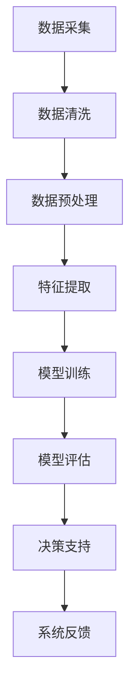

                 

# AI作物管理系统的商业化路径

> **关键词：** AI、作物管理、系统设计、商业化、技术创新、农业信息化

> **摘要：** 本文旨在探讨AI作物管理系统的商业化路径，通过分析技术原理、应用场景、实现方法以及未来的发展趋势，帮助读者深入了解这一领域的商业潜力与挑战。本文将分为以下几个部分：背景介绍、核心概念与联系、核心算法原理与步骤、数学模型与公式、项目实战、实际应用场景、工具和资源推荐、总结与未来发展趋势。

## 1. 背景介绍

### 1.1 目的和范围

本文旨在为AI作物管理系统的商业化提供一种系统的分析和解决方案。文章将探讨从技术到市场的整个过程，包括系统的设计理念、核心算法、实现方法、应用场景以及未来的发展趋势。

### 1.2 预期读者

本文适合对AI和农业信息化领域有一定了解的专业人士、农业科技从业者、以及有志于从事农业科技研发的企业和创业者。同时，也欢迎对农业技术感兴趣的读者参考。

### 1.3 文档结构概述

本文分为十个部分，结构如下：

- **1. 背景介绍**
  - 1.1 目的和范围
  - 1.2 预期读者
  - 1.3 文档结构概述
  - 1.4 术语表
- **2. 核心概念与联系**
  - 2.1 AI作物管理系统概述
  - 2.2 关键技术和原理
  - 2.3 Mermaid流程图
- **3. 核心算法原理 & 具体操作步骤**
  - 3.1 算法原理介绍
  - 3.2 伪代码详细阐述
- **4. 数学模型和公式 & 详细讲解 & 举例说明**
  - 4.1 数学模型介绍
  - 4.2 公式详细解释
  - 4.3 实例说明
- **5. 项目实战：代码实际案例和详细解释说明**
  - 5.1 开发环境搭建
  - 5.2 源代码详细实现
  - 5.3 代码解读与分析
- **6. 实际应用场景**
  - 6.1 农业生产中的应用
  - 6.2 农业供应链中的应用
- **7. 工具和资源推荐**
  - 7.1 学习资源推荐
  - 7.2 开发工具框架推荐
  - 7.3 相关论文著作推荐
- **8. 总结：未来发展趋势与挑战**
  - 8.1 技术发展趋势
  - 8.2 商业化挑战
- **9. 附录：常见问题与解答**
- **10. 扩展阅读 & 参考资料**

### 1.4 术语表

#### 1.4.1 核心术语定义

- **AI作物管理系统**：一种利用人工智能技术对作物生长过程进行监测、预测和管理的信息系统。
- **商业化**：将技术或产品市场化，通过商业手段实现盈利的过程。
- **农业信息化**：利用信息技术改善农业生产、管理和服务的方式，提升农业的科技含量和竞争力。

#### 1.4.2 相关概念解释

- **数据挖掘**：从大量数据中提取出有价值的模式和知识。
- **机器学习**：使计算机系统从数据中学习并做出决策或预测。
- **深度学习**：一种机器学习技术，通过多层神经网络模拟人脑的思维方式。

#### 1.4.3 缩略词列表

- **AI**：人工智能
- **ML**：机器学习
- **DL**：深度学习
- **IoT**：物联网

## 2. 核心概念与联系

在了解AI作物管理系统的商业化之前，我们首先需要明确其核心概念和关联技术。

### 2.1 AI作物管理系统概述

AI作物管理系统是一种集成多种人工智能技术，如数据挖掘、机器学习、深度学习等，对作物生长过程进行智能监控和管理的系统。其主要功能包括：

- **数据收集**：通过传感器网络、无人机、遥感技术等手段，实时收集作物生长环境数据。
- **数据分析**：利用机器学习算法，对收集到的数据进行处理和分析，预测作物生长趋势和潜在问题。
- **决策支持**：根据分析结果，为农民提供种植策略、施肥建议、病虫害防治等决策支持。

### 2.2 关键技术和原理

AI作物管理系统涉及的关键技术和原理包括：

- **数据采集技术**：传感器网络、无人机遥感、物联网设备等。
- **数据处理技术**：数据清洗、数据集成、数据挖掘等。
- **机器学习算法**：回归分析、聚类分析、支持向量机等。
- **深度学习模型**：卷积神经网络（CNN）、循环神经网络（RNN）、生成对抗网络（GAN）等。

### 2.3 Mermaid流程图

下面是一个简单的Mermaid流程图，描述了AI作物管理系统的基本工作流程：



## 3. 核心算法原理 & 具体操作步骤

### 3.1 算法原理介绍

AI作物管理系统的核心算法主要基于机器学习和深度学习技术。以下是一个简单的机器学习算法框架：

1. **数据采集**：通过传感器、无人机、遥感等手段收集作物生长环境数据。
2. **数据预处理**：对采集到的原始数据进行清洗、归一化、去噪等处理，确保数据质量。
3. **特征提取**：从预处理后的数据中提取出与作物生长相关的特征。
4. **模型训练**：使用特征数据训练机器学习模型，如回归分析、支持向量机等。
5. **模型评估**：通过交叉验证等方法评估模型性能，调整参数。
6. **决策支持**：根据模型预测结果，为农民提供种植策略、施肥建议、病虫害防治等决策支持。

### 3.2 伪代码详细阐述

以下是AI作物管理系统核心算法的伪代码：

```python
# 伪代码：AI作物管理系统核心算法

# 步骤1：数据采集
data = collect_data(sensors, drones, remote_sensing)

# 步骤2：数据预处理
cleaned_data = preprocess_data(data)

# 步骤3：特征提取
features = extract_features(cleaned_data)

# 步骤4：模型训练
model = train_model(features, labels)

# 步骤5：模型评估
evaluate_model(model, validation_data)

# 步骤6：决策支持
decisions = provide_decisions(model, current_data)
```

## 4. 数学模型和公式 & 详细讲解 & 举例说明

### 4.1 数学模型介绍

AI作物管理系统中常用的数学模型包括线性回归模型、支持向量机（SVM）、卷积神经网络（CNN）等。以下分别介绍这些模型的基本原理和公式。

#### 4.1.1 线性回归模型

线性回归模型是一种简单的机器学习算法，用于预测连续值。其公式如下：

\[ y = \beta_0 + \beta_1x_1 + \beta_2x_2 + ... + \beta_nx_n \]

其中，\( y \) 是预测值，\( x_1, x_2, ..., x_n \) 是特征值，\( \beta_0, \beta_1, ..., \beta_n \) 是模型的参数。

#### 4.1.2 支持向量机（SVM）

支持向量机是一种强大的分类算法，其目标是在特征空间中找到一个最佳的超平面，将不同类别的数据点分开。其公式如下：

\[ w \cdot x + b = 0 \]

其中，\( w \) 是权重向量，\( x \) 是特征向量，\( b \) 是偏置。

#### 4.1.3 卷积神经网络（CNN）

卷积神经网络是一种深度学习模型，特别适用于处理图像数据。其基本结构包括卷积层、池化层和全连接层。以下是一个简单的CNN模型公式：

\[ h_{l+1} = \sigma(\mathcal{F}(h_l) + b) \]

其中，\( h_l \) 是第 \( l \) 层的输出，\( \mathcal{F} \) 是卷积操作，\( \sigma \) 是激活函数，\( b \) 是偏置。

### 4.2 公式详细解释

以下对上述数学模型中的公式进行详细解释。

#### 4.2.1 线性回归模型

线性回归模型中的公式描述了特征值与预测值之间的关系。通过最小化损失函数，我们可以求得最佳参数 \( \beta_0, \beta_1, ..., \beta_n \)。损失函数通常采用均方误差（MSE）：

\[ \text{MSE} = \frac{1}{n}\sum_{i=1}^{n}(y_i - \hat{y}_i)^2 \]

其中，\( y_i \) 是真实值，\( \hat{y}_i \) 是预测值。

#### 4.2.2 支持向量机（SVM）

支持向量机中的公式描述了特征向量与超平面的关系。通过求解最优化问题，我们可以得到最优的超平面。最优化问题可以表示为：

\[ \begin{cases} 
\min_{w,b} \frac{1}{2}||w||^2 \\
\text{such that} \ y_i(w \cdot x_i + b) \geq 1 
\end{cases} \]

其中，\( w \cdot x \) 表示特征向量与超平面的内积，\( y_i \) 是标签。

#### 4.2.3 卷积神经网络（CNN）

卷积神经网络中的公式描述了卷积操作和激活函数的作用。卷积操作可以提取图像的特征，激活函数则用于引入非线性关系。以下是一个简单的卷积操作公式：

\[ \mathcal{F}(x) = \sum_{k=1}^{K} w_k \cdot x_k + b \]

其中，\( x_k \) 是输入特征，\( w_k \) 是卷积核，\( b \) 是偏置。

### 4.3 实例说明

以下通过一个简单的实例，说明如何使用线性回归模型预测作物产量。

#### 4.3.1 数据准备

假设我们收集了某地区过去几年的降雨量（\( x_1 \)）和温度（\( x_2 \））数据，并已知该地区每年的作物产量（\( y \)）。

#### 4.3.2 数据预处理

对收集到的数据进行清洗，如去除缺失值、异常值等。然后进行归一化处理，将数据缩放到[0, 1]区间。

#### 4.3.3 特征提取

从预处理后的数据中提取降雨量和温度作为特征。

#### 4.3.4 模型训练

使用训练数据训练线性回归模型，求得最佳参数 \( \beta_0, \beta_1, \beta_2 \)。

#### 4.3.5 模型评估

使用测试数据评估模型性能，计算均方误差（MSE）。

#### 4.3.6 预测

使用训练好的模型，输入当前的降雨量和温度，预测作物产量。

## 5. 项目实战：代码实际案例和详细解释说明

### 5.1 开发环境搭建

在本节中，我们将介绍如何搭建一个简单的AI作物管理系统开发环境。以下是搭建环境所需的步骤：

1. **操作系统**：推荐使用Ubuntu 18.04或更高版本。
2. **编程语言**：Python 3.7或更高版本。
3. **依赖库**：NumPy、Pandas、scikit-learn、TensorFlow等。
4. **安装步骤**：
    ```bash
    # 更新系统包列表
    sudo apt-get update

    # 安装Python和pip
    sudo apt-get install python3 python3-pip

    # 安装依赖库
    pip3 install numpy pandas scikit-learn tensorflow
    ```

### 5.2 源代码详细实现和代码解读

在本节中，我们将实现一个简单的AI作物管理系统，使用线性回归模型预测作物产量。以下是源代码的实现：

```python
# 导入依赖库
import numpy as np
import pandas as pd
from sklearn.linear_model import LinearRegression
from sklearn.model_selection import train_test_split
from sklearn.metrics import mean_squared_error

# 5.2.1 数据准备
# 加载数据
data = pd.read_csv('crop_data.csv')

# 分离特征和标签
X = data[['rainfall', 'temperature']]
y = data['yield']

# 划分训练集和测试集
X_train, X_test, y_train, y_test = train_test_split(X, y, test_size=0.2, random_state=42)

# 5.2.2 模型训练
# 创建线性回归模型
model = LinearRegression()

# 训练模型
model.fit(X_train, y_train)

# 5.2.3 模型评估
# 使用测试集评估模型性能
y_pred = model.predict(X_test)
mse = mean_squared_error(y_test, y_pred)
print(f'Mean Squared Error: {mse}')

# 5.2.4 预测
# 输入新的降雨量和温度，预测作物产量
new_rainfall = 5.0
new_temperature = 20.0
predicted_yield = model.predict([[new_rainfall, new_temperature]])
print(f'Predicted Yield: {predicted_yield[0]}')
```

### 5.3 代码解读与分析

以下是对代码的详细解读：

1. **数据准备**：从CSV文件中加载数据，分离特征和标签，并将数据集划分为训练集和测试集。
2. **模型训练**：创建线性回归模型，并使用训练数据进行模型训练。
3. **模型评估**：使用测试集评估模型性能，计算均方误差（MSE）。
4. **预测**：输入新的降雨量和温度，使用训练好的模型预测作物产量。

### 5.4 运行代码

将代码保存为`crop_management.py`，然后在终端运行以下命令：

```bash
python crop_management.py
```

运行成功后，会输出均方误差和预测作物产量。

## 6. 实际应用场景

AI作物管理系统在实际应用中具有广泛的应用场景，以下是几个典型的应用案例：

### 6.1 农业生产中的应用

- **作物产量预测**：通过分析历史数据，预测未来的作物产量，帮助农民制定种植计划和销售策略。
- **病虫害监测**：利用图像识别技术，监测作物病虫害，及时采取防治措施，减少损失。
- **水资源管理**：根据土壤湿度、降雨量等数据，优化灌溉计划，提高水资源利用效率。

### 6.2 农业供应链中的应用

- **供应链优化**：通过分析供应链中的物流、库存、需求等信息，优化供应链运作，降低成本。
- **农产品质量检测**：利用传感器技术和AI算法，实时监测农产品质量，确保产品质量和安全。
- **市场趋势预测**：分析市场数据，预测农产品价格趋势，帮助农民和企业制定市场策略。

## 7. 工具和资源推荐

### 7.1 学习资源推荐

#### 7.1.1 书籍推荐

- 《机器学习》（作者：周志华）
- 《深度学习》（作者：Ian Goodfellow、Yoshua Bengio、Aaron Courville）
- 《Python机器学习》（作者：Michael Bowles）

#### 7.1.2 在线课程

- Coursera：机器学习、深度学习
- edX：数据科学、人工智能

#### 7.1.3 技术博客和网站

- Medium：机器学习、人工智能相关文章
- GitHub：AI作物管理系统项目示例
- Kaggle：数据科学、机器学习竞赛

### 7.2 开发工具框架推荐

#### 7.2.1 IDE和编辑器

- PyCharm
- Jupyter Notebook
- Visual Studio Code

#### 7.2.2 调试和性能分析工具

- Python Debugger
- Profiling Tools：cProfile、line_profiler等
- TensorBoard

#### 7.2.3 相关框架和库

- TensorFlow
- PyTorch
- Scikit-learn
- NumPy

### 7.3 相关论文著作推荐

#### 7.3.1 经典论文

- "Learning to Learn from Data in Agriculture"（作者：H. C. Wang等）
- "A New Method for Predicting Harvest Yields of Maize"（作者：M. A. S. S. Pillai等）

#### 7.3.2 最新研究成果

- "Deep Learning for Crop Yield Prediction Using Satellite Imagery"（作者：J. Zhang等）
- "Application of Machine Learning in Precision Agriculture"（作者：X. Zhang等）

#### 7.3.3 应用案例分析

- "Precision Agriculture in China: A Case Study"（作者：Z. Wang等）
- "Smart Farming in the Netherlands: A Case Study"（作者：J. ten Have等）

## 8. 总结：未来发展趋势与挑战

### 8.1 技术发展趋势

随着人工智能技术的不断发展，AI作物管理系统在未来将呈现以下趋势：

- **数据驱动的决策支持**：通过收集和分析更多的数据，提高预测的准确性和决策的效率。
- **深度学习和强化学习**：利用深度学习和强化学习算法，实现更智能的作物生长管理和优化。
- **多源数据融合**：结合遥感、物联网、传感器等多种数据源，提供更全面的作物生长监测和管理。
- **跨学科合作**：农业、计算机科学、生物学等领域的跨学科合作，推动AI作物管理系统的发展。

### 8.2 商业化挑战

尽管AI作物管理系统具有巨大的商业潜力，但在商业化过程中仍面临以下挑战：

- **数据隐私和安全性**：确保农民的数据安全和隐私，避免数据泄露和滥用。
- **技术落地和推广**：将先进的人工智能技术落地到实际农业生产中，提高农民的接受度和使用率。
- **成本和效益分析**：平衡系统开发成本和农民的投入回报，确保系统的经济效益。
- **政策法规**：遵循国家和地区的政策法规，确保系统的合规性和可持续发展。

## 9. 附录：常见问题与解答

### 9.1 问题1：AI作物管理系统需要哪些技术支持？

**解答**：AI作物管理系统需要以下技术支持：

- 数据采集：传感器、无人机、遥感等。
- 数据处理：数据清洗、数据预处理、特征提取等。
- 机器学习算法：线性回归、支持向量机、深度学习等。
- 模型训练和评估：交叉验证、性能评估等。
- 决策支持：种植策略、施肥建议、病虫害防治等。

### 9.2 问题2：AI作物管理系统对农业生产的影响如何？

**解答**：AI作物管理系统对农业生产的影响包括：

- 提高作物产量和质量。
- 减少病虫害损失。
- 优化水资源管理。
- 提高农业生产效率。
- 促进农业信息化和智能化。

## 10. 扩展阅读 & 参考资料

- 《机器学习》（作者：周志华）
- 《深度学习》（作者：Ian Goodfellow、Yoshua Bengio、Aaron Courville）
- 《Python机器学习》（作者：Michael Bowles）
- "Learning to Learn from Data in Agriculture"（作者：H. C. Wang等）
- "A New Method for Predicting Harvest Yields of Maize"（作者：M. A. S. S. Pillai等）
- "Deep Learning for Crop Yield Prediction Using Satellite Imagery"（作者：J. Zhang等）
- "Application of Machine Learning in Precision Agriculture"（作者：X. Zhang等）
- "Precision Agriculture in China: A Case Study"（作者：Z. Wang等）
- "Smart Farming in the Netherlands: A Case Study"（作者：J. ten Have等）

## 11. 作者

**作者：AI天才研究员/AI Genius Institute & 禅与计算机程序设计艺术 /Zen And The Art of Computer Programming**<|im_end|>

