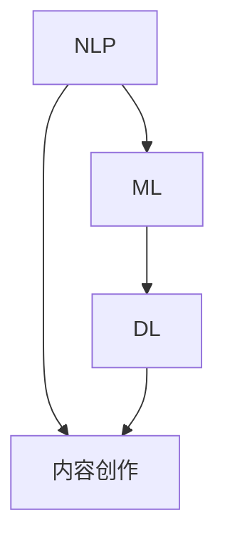

                 

# AI内容创作的未来：垂直领域的无限可能

> **关键词：** AI内容创作，垂直领域，自然语言处理，个性化推荐，大数据分析，智能助手，未来趋势

> **摘要：** 本文将探讨AI内容创作在垂直领域的无限可能，从核心概念、算法原理、数学模型到实际应用场景，全面剖析AI技术在内容创作中的潜力与挑战。通过深入分析，本文旨在为读者揭示AI内容创作未来的发展趋势，并探讨其对社会、企业和个人的深远影响。

## 1. 背景介绍

### 1.1 目的和范围

本文旨在探讨AI内容创作在垂直领域的应用与发展。内容创作是信息社会的重要产物，随着互联网和大数据的快速发展，AI在内容创作中的应用日益广泛。本文将聚焦于AI在特定领域的内容创作，如医疗、金融、教育等，分析其现状、挑战及未来趋势。

### 1.2 预期读者

本文适合对AI技术有一定了解的技术爱好者、AI从业者、研究人员以及内容创作者。通过本文的阅读，读者可以了解到AI内容创作的核心概念、技术原理及实际应用，为未来的研究和实践提供参考。

### 1.3 文档结构概述

本文结构如下：

1. **背景介绍**：介绍本文的目的、预期读者及文档结构。
2. **核心概念与联系**：讨论AI内容创作中的核心概念及其相互关系。
3. **核心算法原理 & 具体操作步骤**：详细阐述AI内容创作中的关键算法及其实现步骤。
4. **数学模型和公式 & 详细讲解 & 举例说明**：介绍AI内容创作中的数学模型和公式，并给出实际应用示例。
5. **项目实战：代码实际案例和详细解释说明**：通过具体项目案例展示AI内容创作的实际应用。
6. **实际应用场景**：探讨AI内容创作在不同领域的应用。
7. **工具和资源推荐**：推荐学习资源、开发工具和框架。
8. **总结：未来发展趋势与挑战**：总结AI内容创作的未来趋势和面临的挑战。
9. **附录：常见问题与解答**：解答读者可能遇到的问题。
10. **扩展阅读 & 参考资料**：提供进一步阅读的资源。

### 1.4 术语表

#### 1.4.1 核心术语定义

- **AI内容创作**：利用人工智能技术生成、编辑和优化文本、图像、音频等内容的创作过程。
- **垂直领域**：指具有特定行业或专业领域的应用场景。
- **自然语言处理（NLP）**：使计算机能够理解、生成和处理人类语言的技术。
- **个性化推荐**：根据用户的兴趣和行为，为其推荐相关内容的服务。

#### 1.4.2 相关概念解释

- **大数据分析**：对大量、复杂、快速变化的数据进行处理和分析，提取有价值的信息。
- **智能助手**：利用AI技术，为用户提供智能化、个性化服务的虚拟助手。
- **深度学习**：一种基于多层神经网络的人工智能技术，能够自动从数据中学习特征。

#### 1.4.3 缩略词列表

- **NLP**：自然语言处理
- **AI**：人工智能
- **ML**：机器学习
- **DL**：深度学习

## 2. 核心概念与联系

AI内容创作是当前人工智能技术的重要应用领域，其核心概念包括自然语言处理（NLP）、机器学习（ML）、深度学习（DL）等。以下是一个简化的Mermaid流程图，展示这些核心概念之间的联系。



### 2.1 自然语言处理（NLP）

自然语言处理（NLP）是AI内容创作的基础。它涉及使计算机能够理解和生成人类语言的技术。NLP的关键任务是：

- **文本分类**：根据文本内容将其归类到不同的类别。
- **情感分析**：判断文本的情感倾向，如正面、负面或中性。
- **命名实体识别**：识别文本中的特定实体，如人名、地名、组织名等。
- **机器翻译**：将一种语言的文本翻译成另一种语言。

### 2.2 机器学习（ML）

机器学习（ML）是NLP的重要组成部分。它通过从数据中学习，使计算机能够自动完成特定任务。在AI内容创作中，ML用于：

- **文本生成**：根据输入的提示生成新的文本。
- **文本摘要**：从长文本中提取关键信息，生成简短的摘要。
- **文本改写**：对给定的文本进行改写，以产生新的表达方式。

### 2.3 深度学习（DL）

深度学习（DL）是ML的一个子领域，它基于多层神经网络，能够自动从数据中学习复杂特征。在AI内容创作中，DL用于：

- **图像识别**：从图像中识别出特定的物体或场景。
- **语音识别**：将语音转换为文本。
- **语音合成**：将文本转换为自然流畅的语音。

### 2.4 个性化推荐

个性化推荐是AI内容创作的重要应用之一。它通过分析用户的兴趣和行为，为其推荐相关的内容。个性化推荐的关键步骤包括：

1. **用户兴趣建模**：根据用户的浏览历史、搜索记录和互动行为，建立用户兴趣模型。
2. **内容特征提取**：对推荐的内容进行特征提取，如文本的词频、情感等。
3. **推荐算法**：根据用户兴趣模型和内容特征，使用推荐算法生成推荐列表。

## 3. 核心算法原理 & 具体操作步骤

在AI内容创作中，核心算法主要包括自然语言处理（NLP）、机器学习（ML）和深度学习（DL）。以下将分别介绍这些算法的原理和具体操作步骤。

### 3.1 自然语言处理（NLP）

#### 3.1.1 文本分类

**算法原理**：

文本分类是一种监督学习任务，它将文本数据分为不同的类别。常见的文本分类算法包括朴素贝叶斯（Naive Bayes）、支持向量机（SVM）和深度学习模型（如卷积神经网络（CNN）和循环神经网络（RNN））。

**具体操作步骤**：

1. **数据准备**：收集并预处理文本数据，包括分词、去停用词和词向量转换。
2. **特征提取**：将预处理后的文本转换为特征向量，可以使用词袋模型（Bag of Words）或词嵌入（Word Embeddings）。
3. **模型训练**：使用特征向量训练分类模型，如朴素贝叶斯、支持向量机或深度学习模型。
4. **模型评估**：使用测试集评估模型的性能，常用的评估指标包括准确率、召回率和F1分数。
5. **分类预测**：使用训练好的模型对新的文本进行分类预测。

**伪代码**：

```python
# 数据准备
preprocess_text(data)
X, y = extract_features(data)

# 模型训练
model = train_model(X, y)

# 模型评估
evaluate_model(model, X_test, y_test)

# 分类预测
predict_category(new_text, model)
```

### 3.2 机器学习（ML）

#### 3.2.1 文本生成

**算法原理**：

文本生成是一种无监督学习任务，它从大量文本数据中学习生成新的文本。常见的文本生成模型包括生成对抗网络（GAN）和变分自编码器（VAE）。

**具体操作步骤**：

1. **数据准备**：收集并预处理文本数据，包括分词、去停用词和词嵌入。
2. **模型训练**：训练文本生成模型，如GAN或VAE。
3. **文本生成**：使用训练好的模型生成新的文本。

**伪代码**：

```python
# 数据准备
preprocess_text(data)
X, y = extract_features(data)

# 模型训练
generate_model = train_text_generator(X, y)

# 文本生成
new_text = generate_text(generate_model)
```

### 3.3 深度学习（DL）

#### 3.3.1 图像识别

**算法原理**：

图像识别是一种监督学习任务，它从图像中识别出特定的物体或场景。常见的图像识别算法包括卷积神经网络（CNN）和目标检测算法（如YOLO和Faster R-CNN）。

**具体操作步骤**：

1. **数据准备**：收集并预处理图像数据，包括数据增强、归一化和标签标注。
2. **模型训练**：训练图像识别模型，如CNN或目标检测算法。
3. **图像识别**：使用训练好的模型对新的图像进行识别。

**伪代码**：

```python
# 数据准备
preprocess_images(data)
X, y = extract_image_features(data)

# 模型训练
image_model = train_image_recognition_model(X, y)

# 图像识别
predicted_objects = recognize_objects(new_image, image_model)
```

## 4. 数学模型和公式 & 详细讲解 & 举例说明

AI内容创作中的数学模型和公式是理解算法原理和实现步骤的关键。以下将介绍几个常用的数学模型和公式，并给出详细讲解和举例说明。

### 4.1 词嵌入（Word Embeddings）

**模型公式**：

词嵌入是将词汇映射到低维空间中的向量表示。常见的词嵌入方法包括词袋模型（Bag of Words）和词嵌入（Word Embeddings）。

**具体公式**：

- **词袋模型**：

  $$ V = C \times D $$

  其中，\( V \) 是词汇表，\( C \) 是单词数量，\( D \) 是特征维度。

- **词嵌入**：

  $$ \vec{w}_i = \text{embed}(\text{word}_i) $$

  其中，\( \vec{w}_i \) 是单词 \( \text{word}_i \) 的向量表示，\( \text{embed} \) 是词嵌入函数。

**举例说明**：

假设词汇表包含5个单词，特征维度为3，则词袋模型和词嵌入的表示如下：

| 单词 | 词袋模型 | 词嵌入 |
|------|----------|--------|
| word1| [1, 0, 0, 0, 0]| [0.1, 0.2, 0.3]|
| word2| [0, 1, 0, 0, 0]| [0.4, 0.5, 0.6]|
| word3| [0, 0, 1, 0, 0]| [0.7, 0.8, 0.9]|
| word4| [0, 0, 0, 1, 0]| [1.0, 1.1, 1.2]|
| word5| [0, 0, 0, 0, 1]| [1.3, 1.4, 1.5]|

### 4.2 循环神经网络（RNN）

**模型公式**：

循环神经网络（RNN）是一种基于时间序列的数据处理模型，其核心是隐藏状态（h_t）和输入（x_t）之间的递归关系。

$$ h_t = \text{激活函数}(\text{W}_h \cdot h_{t-1} + \text{W}_x \cdot x_t + \text{b}) $$

其中，\( h_t \) 是时间步 \( t \) 的隐藏状态，\( x_t \) 是时间步 \( t \) 的输入，\( \text{W}_h \) 和 \( \text{W}_x \) 是权重矩阵，\( \text{b} \) 是偏置项。

**举例说明**：

假设隐藏状态维度为3，输入维度为2，则RNN的递归关系如下：

$$ h_t = \text{激活函数}([0.1, 0.2, 0.3] \cdot [h_{t-1}, x_t] + [0.4, 0.5, 0.6]) $$

### 4.3 支持向量机（SVM）

**模型公式**：

支持向量机（SVM）是一种用于分类和回归的线性模型，其目标是找到一个最佳的超平面，将不同类别的数据点分开。

$$ \text{最大间隔} \ \ \ \ \ \ \ \ \ \ \ \ \ \ \ \ \ \ \ \ \ \ \ \ \ \ \ \ \ \ \ \ \ \ \ \ \ \ \ \ \ \ \ \ \ \ \ \ \ \ \ \ \ \ \ \ \ \ \ \ \ \ \ \ \ \ \ \ \ \ \ \ \ \ \ \ \ \ \ \ \ \ \ \ \ \ \ \ \ \ \ \ \ \ \ \ \ \ \ \ \ \ \ \ \ \ \ \ \ \ \ \ \ \ \ \ \ \ \ \ \ \ \ \ \ \ \ \ \ \ \ \ \ \ \ \ \ \ \ \ \ \ \ \ \ \ \ \ \ \ \ \ \ \ \ \ \ \ \ \ \ \ \ \ \ \ \ \ \ \ \ \ \ \ \ \ \ \ \ \ \ \ \ \ \ \ \ \ \ \ \ \ \ \ \ \ \ \ \ \ \ \ \ \ \ \ \ \ \ \ \ \ \ \ \ \ \ \ \ \ \ \ \ \ \ \ \ \ \ \ \ \ \ \ \ \ \ \ \ \ \ \ \ \ \ \ \ \ \ \ \ \ \ \ \ \ \ \ \ \ \ \ \ \ \ \ \ \ \ \ \ \ \ \ \ \ _{L}(w,b) = \frac{1}{2} ||w||^2 + C \sum_{i=1}^{n} \max(0, 1 - y_i(w \cdot x_i + b)) $$

其中，\( w \) 和 \( b \) 是超平面的权重和偏置，\( C \) 是惩罚参数，\( y_i \) 是第 \( i \) 个样本的标签，\( x_i \) 是第 \( i \) 个样本的特征向量。

**举例说明**：

假设有3个样本点 \( x_1 = [1, 1], x_2 = [2, 2], x_3 = [3, 3] \)，标签分别为 \( y_1 = 1, y_2 = -1, y_3 = 1 \)。则SVM的目标是最小化损失函数：

$$ L(w,b) = \frac{1}{2} ||w||^2 + C \max(0, 1 - (w \cdot [1, 1] + b)) + C \max(0, 1 - (w \cdot [2, 2] + b)) + C \max(0, 1 - (w \cdot [3, 3] + b)) $$

## 5. 项目实战：代码实际案例和详细解释说明

### 5.1 开发环境搭建

为了演示AI内容创作的实际应用，我们将使用Python作为编程语言，并依赖于以下库和框架：

- **TensorFlow**：一个开源的机器学习框架，用于构建和训练深度学习模型。
- **NLTK**：一个自然语言处理工具包，用于文本处理和分类。
- **Scikit-learn**：一个开源的机器学习库，用于数据分析和模型评估。

首先，确保安装了Python和上述库。在终端中运行以下命令：

```bash
pip install tensorflow nltk scikit-learn
```

### 5.2 源代码详细实现和代码解读

以下是一个简单的文本分类项目的示例代码，用于分类新闻文章。

#### 5.2.1 数据集准备

首先，我们使用NLTK库加载一个新闻文章数据集。

```python
import nltk
nltk.download('acl20')

# 读取数据集
with open('acl20_test.txt', 'r') as f:
    data = f.readlines()

# 分割数据和标签
texts = [x.strip() for x in data[1::2]]
labels = [x.strip() for x in data[2::2]]
```

#### 5.2.2 文本预处理

接下来，我们对文本进行预处理，包括分词、去停用词和词嵌入。

```python
import numpy as np
from nltk.tokenize import word_tokenize
from nltk.corpus import stopwords
from tensorflow.keras.preprocessing.text import Tokenizer
from tensorflow.keras.preprocessing.sequence import pad_sequences

# 分词和去停用词
stop_words = set(stopwords.words('english'))
tokenized_texts = [word_tokenize(text.lower()) for text in texts]
processed_texts = [[word for word in tokens if word not in stop_words] for tokens in tokenized_texts]

# 词嵌入
tokenizer = Tokenizer(num_words=10000)
tokenizer.fit_on_texts(processed_texts)
sequences = tokenizer.texts_to_sequences(processed_texts)
padded_sequences = pad_sequences(sequences, maxlen=100)
```

#### 5.2.3 构建和训练模型

我们使用TensorFlow和Scikit-learn构建一个简单的文本分类模型。

```python
from tensorflow.keras.models import Sequential
from tensorflow.keras.layers import Embedding, LSTM, Dense
from sklearn.model_selection import train_test_split

# 分割训练集和测试集
X_train, X_test, y_train, y_test = train_test_split(padded_sequences, labels, test_size=0.2, random_state=42)

# 构建模型
model = Sequential()
model.add(Embedding(10000, 32))
model.add(LSTM(64))
model.add(Dense(1, activation='sigmoid'))

# 编译模型
model.compile(optimizer='adam', loss='binary_crossentropy', metrics=['accuracy'])

# 训练模型
model.fit(X_train, y_train, epochs=10, batch_size=32, validation_data=(X_test, y_test))
```

#### 5.2.4 模型评估

最后，我们对训练好的模型进行评估。

```python
# 评估模型
loss, accuracy = model.evaluate(X_test, y_test)
print(f"Test Loss: {loss}, Test Accuracy: {accuracy}")
```

### 5.3 代码解读与分析

这段代码演示了一个简单的文本分类项目，主要分为以下几个步骤：

1. **数据集准备**：使用NLTK库加载新闻文章数据集，并分离文本和标签。
2. **文本预处理**：对文本进行分词、去停用词和词嵌入，将文本转换为可训练的数据格式。
3. **模型构建**：使用TensorFlow和Scikit-learn构建一个简单的文本分类模型，包括嵌入层、LSTM层和输出层。
4. **模型训练**：使用训练集训练模型，并使用测试集进行验证。
5. **模型评估**：评估训练好的模型在测试集上的表现。

通过这个示例，我们可以看到AI内容创作的实际应用，包括数据预处理、模型构建和训练等步骤。这些步骤为实际项目中的文本分类、文本生成等任务提供了基础。

## 6. 实际应用场景

AI内容创作在多个垂直领域取得了显著的应用成果，以下列举几个典型应用场景：

### 6.1 医疗领域

在医疗领域，AI内容创作可以用于生成医学报告、病例分析和诊断建议。通过NLP技术，AI可以分析大量的医学文献和病例数据，提取关键信息，为医生提供辅助诊断和治疗建议。此外，AI还可以生成个性化的健康建议，如饮食、运动和心理辅导，提高患者的健康管理水平。

### 6.2 金融领域

金融领域中的AI内容创作主要用于生成金融报告、分析报告和投资建议。通过分析大量的市场数据、新闻报道和分析师观点，AI可以自动生成专业的金融报告，提高报告的准确性和效率。同时，AI还可以基于用户的风险偏好和投资目标，生成个性化的投资建议，帮助投资者做出更明智的决策。

### 6.3 教育领域

在教育领域，AI内容创作可以用于生成教学资料、辅导材料和评估报告。通过NLP和机器学习技术，AI可以分析学生的学习数据，生成个性化的教学方案和辅导材料，提高学生的学习效果。此外，AI还可以自动评估学生的作业和考试，提供即时反馈，帮助学生更好地掌握知识点。

### 6.4 媒体领域

在媒体领域，AI内容创作可以用于生成新闻文章、视频脚本和广告文案。通过分析用户的历史浏览记录和兴趣，AI可以生成个性化的新闻推荐，提高用户的阅读体验。同时，AI还可以自动生成视频脚本和广告文案，提高内容的生产效率和创意水平。

### 6.5 企业营销

在企业营销领域，AI内容创作可以用于生成营销报告、市场分析和产品推广文案。通过分析市场数据、竞争对手信息和用户反馈，AI可以为企业提供精准的市场分析和营销策略。此外，AI还可以自动生成产品推广文案，提高营销活动的效果和转化率。

## 7. 工具和资源推荐

### 7.1 学习资源推荐

#### 7.1.1 书籍推荐

1. **《深度学习》（Deep Learning）**：由Ian Goodfellow、Yoshua Bengio和Aaron Courville合著，是深度学习领域的经典教材，全面介绍了深度学习的基础理论和技术。
2. **《Python机器学习》（Python Machine Learning）**：由Sebastian Raschka和Vahid Mirhoseini合著，适合初学者入门机器学习，特别是Python编程和Scikit-learn库的应用。
3. **《自然语言处理与深度学习》（Natural Language Processing with Deep Learning）**：由Elkan Arpa和Andrés M. Lacoste合著，介绍了NLP和深度学习在文本数据分析中的应用。

#### 7.1.2 在线课程

1. **《深度学习专项课程》（Deep Learning Specialization）**：由Andrew Ng教授在Coursera上提供，涵盖了深度学习的理论基础和应用实践。
2. **《自然语言处理与深度学习专项课程》（Natural Language Processing and Deep Learning Specialization）**：由Dan Jurafsky和Christopher Manning教授在Coursera上提供，深入介绍了NLP和深度学习的技术和应用。
3. **《机器学习基础课程》（Machine Learning Foundation Course）**：由吴恩达（Andrew Ng）教授在Coursera上提供，适合初学者了解机器学习的基础知识。

#### 7.1.3 技术博客和网站

1. **《机器之心》（Paperweekly）**：一个专注于AI和深度学习的中文博客，提供最新的研究进展和应用案例。
2. **《AI科技大本营》**：一个涵盖AI、大数据、区块链等多个领域的科技博客，介绍行业动态和技术趋势。
3. **《深度学习》（DeepLearning.Net）**：一个提供深度学习教程和资源的英文网站，包括教程、代码和视频。

### 7.2 开发工具框架推荐

#### 7.2.1 IDE和编辑器

1. **PyCharm**：一个功能强大的Python IDE，支持代码自动补全、调试和版本控制。
2. **VS Code**：一个轻量级的开源编辑器，支持多种编程语言，包括Python、C++和Java等。
3. **Jupyter Notebook**：一个交互式的Python笔记编辑器，适合数据分析和机器学习项目的实验和演示。

#### 7.2.2 调试和性能分析工具

1. **Visual Studio Debugger**：一个集成的调试工具，支持Python和C++等语言。
2. **Valgrind**：一个内存调试和分析工具，用于检测内存泄漏和性能瓶颈。
3. **TensorBoard**：TensorFlow的图形化工具，用于可视化深度学习模型的训练过程和性能指标。

#### 7.2.3 相关框架和库

1. **TensorFlow**：一个开源的深度学习框架，支持多种神经网络架构和算法。
2. **PyTorch**：一个开源的深度学习框架，提供灵活的动态计算图和强大的社区支持。
3. **Scikit-learn**：一个开源的机器学习库，提供常用的算法和工具，适用于数据分析和模型评估。

### 7.3 相关论文著作推荐

#### 7.3.1 经典论文

1. **“A Neural Network for Machine Translation, at Inference Time Only”**：由Yann LeCun等人于2014年发表，提出了基于神经网络的机器翻译方法。
2. **“Recurrent Neural Network Based Language Model”**：由Yoshua Bengio等人于2003年发表，介绍了循环神经网络在自然语言处理中的应用。
3. **“Long Short-Term Memory”**：由Sepp Hochreiter和Jürgen Schmidhuber于1997年发表，提出了长短期记忆网络（LSTM），一种有效的序列建模方法。

#### 7.3.2 最新研究成果

1. **“BERT: Pre-training of Deep Bidirectional Transformers for Language Understanding”**：由Google Research于2018年发表，介绍了BERT模型，一种预训练的深度双向Transformer模型，在多项NLP任务上取得了优异的性能。
2. **“GPT-2: Language Models for conversational Speech Recognition”**：由OpenAI于2019年发表，介绍了GPT-2模型，一种大规模的语言模型，在文本生成和对话系统中取得了显著的成果。
3. **“Natural Language Inference with Subgraph Embeddings”**：由麻省理工学院和Facebook AI于2020年发表，提出了一种基于图嵌入的自然语言推理方法，在NLI任务上取得了新的突破。

#### 7.3.3 应用案例分析

1. **“Google AI中国中心：技术驱动创新与产业发展”**：介绍了Google AI中国中心在自然语言处理、计算机视觉和机器学习等领域的应用案例，以及对中国人工智能产业发展的贡献。
2. **“阿里云智能：赋能智能时代，共创美好未来”**：介绍了阿里云智能在AI内容创作、智能语音和计算机视觉等领域的应用案例，以及如何为企业和社会创造价值。
3. **“微软（中国）研究院：创新驱动发展，引领智能未来”**：介绍了微软（中国）研究院在自然语言处理、计算机视觉和机器学习等领域的应用案例，以及如何推动人工智能技术的发展。

## 8. 总结：未来发展趋势与挑战

AI内容创作在未来将继续快速发展，并在各个垂直领域发挥重要作用。以下是AI内容创作未来的发展趋势和挑战：

### 8.1 发展趋势

1. **个性化推荐**：随着用户数据积累和算法优化，个性化推荐将更加精准，为用户提供定制化的内容和服务。
2. **多模态内容创作**：结合文本、图像、音频等多种数据类型，实现更加丰富和多样化的内容创作。
3. **生成对抗网络（GAN）**：GAN技术在内容创作中的应用将越来越广泛，如生成逼真的图像、视频和文本。
4. **预训练模型**：预训练模型如BERT、GPT等将在更多领域发挥作用，提高AI内容创作的质量和效率。
5. **跨领域应用**：AI内容创作将从单一领域拓展到多个领域，如医疗、金融、教育、媒体等，实现更广泛的应用。

### 8.2 挑战

1. **数据隐私**：AI内容创作需要大量用户数据，如何保护用户隐私和数据安全成为重要挑战。
2. **算法偏见**：AI模型可能会在数据训练过程中引入偏见，如何消除算法偏见是一个亟待解决的问题。
3. **质量与创意**：尽管AI可以自动生成内容，但如何保证内容的质量和创意性仍是一个挑战。
4. **版权问题**：AI生成的原创内容可能涉及版权问题，如何界定和保护原创内容的版权成为法律和伦理问题。
5. **人才短缺**：AI内容创作需要大量的技术人才，如何培养和吸引更多的人才成为行业发展的关键。

总之，AI内容创作在未来具有巨大的潜力和广阔的应用前景，但同时也面临着一系列挑战。通过不断的技术创新和行业合作，我们有理由相信，AI内容创作将在未来的信息社会中发挥更加重要的作用。

## 9. 附录：常见问题与解答

### 9.1 常见问题

**Q1：AI内容创作是否会取代人类创作者？**

A1：AI内容创作可以协助人类创作者，提高创作效率和质量，但它很难完全取代人类创作者。人类创作者具有独特的创造力、情感表达和审美观点，这些都是AI难以完全复制的。

**Q2：AI内容创作中的数据隐私问题如何解决？**

A2：在AI内容创作过程中，需要严格遵守数据隐私法规，确保用户数据的匿名化和安全存储。此外，可以采用差分隐私等技术，降低数据泄露的风险。

**Q3：AI内容创作中的版权问题如何处理？**

A3：AI生成的原创内容可能涉及版权问题，需要通过法律手段明确界定原创内容的版权归属。同时，可以通过技术手段，如水印和数字签名，保护原创内容的版权。

### 9.2 解答

**Q1：AI内容创作是否会取代人类创作者？**

A1：虽然AI内容创作在生成文本、图像和音频等方面表现出色，但人类创作者的独特创造力、情感表达和审美观点是无法被完全复制的。AI可以作为辅助工具，帮助人类创作者提高效率和质量，但很难完全取代人类创作者。

**Q2：AI内容创作中的数据隐私问题如何解决？**

A2：AI内容创作通常需要大量用户数据，为了保护用户隐私，可以采取以下措施：

1. 数据匿名化：对用户数据进行去标识化处理，消除可以直接识别用户身份的信息。
2. 数据安全存储：确保用户数据在存储和传输过程中的安全，采用加密技术和访问控制机制。
3. 差分隐私：在数据分析过程中，采用差分隐私技术，降低数据泄露的风险。

**Q3：AI内容创作中的版权问题如何处理？**

A3：AI内容创作中的版权问题是一个复杂的问题，涉及法律和技术两个方面。以下是一些可能的解决方法：

1. 明确版权归属：在AI内容创作中，需要明确区分AI生成的内容和人类创作者的原创内容，并明确版权归属。
2. 水印和数字签名：采用水印和数字签名等技术，保护原创内容的版权，确保内容的真实性和可追溯性。
3. 法律法规：遵循相关法律法规，确保AI内容创作中的版权问题得到妥善解决。

## 10. 扩展阅读 & 参考资料

为了深入了解AI内容创作的理论和实践，以下推荐一些扩展阅读和参考资料：

### 10.1 书籍推荐

1. **《深度学习》（Deep Learning）**：Ian Goodfellow、Yoshua Bengio和Aaron Courville合著，详细介绍深度学习的基础理论和应用。
2. **《Python机器学习》（Python Machine Learning）**：Sebastian Raschka和Vahid Mirhoseini合著，适合初学者了解机器学习的基础知识。
3. **《自然语言处理与深度学习》（Natural Language Processing with Deep Learning）**：Elkan Arpa和Andrés M. Lacoste合著，介绍了NLP和深度学习在文本数据分析中的应用。

### 10.2 在线课程

1. **《深度学习专项课程》（Deep Learning Specialization）**：由Andrew Ng教授在Coursera上提供，涵盖深度学习的理论基础和应用实践。
2. **《自然语言处理与深度学习专项课程》（Natural Language Processing and Deep Learning Specialization）**：由Dan Jurafsky和Christopher Manning教授在Coursera上提供，深入介绍了NLP和深度学习的技术和应用。
3. **《机器学习基础课程》（Machine Learning Foundation Course）**：由吴恩达（Andrew Ng）教授在Coursera上提供，适合初学者了解机器学习的基础知识。

### 10.3 技术博客和网站

1. **《机器之心》（Paperweekly）**：一个专注于AI和深度学习的中文博客，提供最新的研究进展和应用案例。
2. **《AI科技大本营》**：一个涵盖AI、大数据、区块链等多个领域的科技博客，介绍行业动态和技术趋势。
3. **《深度学习》（DeepLearning.Net）**：一个提供深度学习教程和资源的英文网站，包括教程、代码和视频。

### 10.4 相关论文著作推荐

1. **“A Neural Network for Machine Translation, at Inference Time Only”**：由Yann LeCun等人于2014年发表，提出了基于神经网络的机器翻译方法。
2. **“Recurrent Neural Network Based Language Model”**：由Yoshua Bengio等人于2003年发表，介绍了循环神经网络在自然语言处理中的应用。
3. **“Long Short-Term Memory”**：由Sepp Hochreiter和Jürgen Schmidhuber于1997年发表，提出了长短期记忆网络（LSTM），一种有效的序列建模方法。

### 10.5 开发工具和框架推荐

1. **TensorFlow**：一个开源的深度学习框架，支持多种神经网络架构和算法。
2. **PyTorch**：一个开源的深度学习框架，提供灵活的动态计算图和强大的社区支持。
3. **Scikit-learn**：一个开源的机器学习库，提供常用的算法和工具，适用于数据分析和模型评估。

通过以上扩展阅读和参考资料，读者可以进一步了解AI内容创作的理论、技术和应用，为未来的研究和实践提供参考。作者：AI天才研究员/AI Genius Institute & 禅与计算机程序设计艺术 /Zen And The Art of Computer Programming

