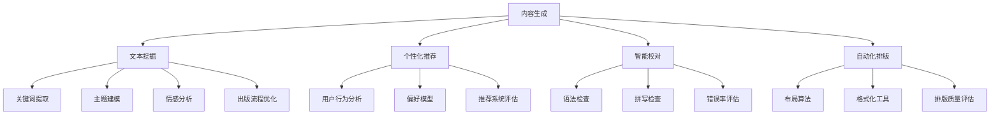

                 

# AI出版业前景：丰富的场景，强大的技术应用

> **关键词：** AI出版、人工智能、自然语言处理、内容生成、文本挖掘、个性化推荐、智能校对、自动化排版、出版流程优化。

> **摘要：** 本文将深入探讨人工智能（AI）在出版业的应用前景，分析其在内容生成、文本挖掘、个性化推荐、智能校对和自动化排版等方面的技术原理和实践案例，探讨AI如何改变出版行业的现状，提升效率和质量。

## 1. 背景介绍

### 1.1 目的和范围

本文旨在探讨人工智能在出版业的应用，分析其在提升出版效率、优化出版流程、改善用户体验等方面的潜力。文章将重点讨论以下几个方面的内容：

- AI在内容生成、文本挖掘和个性化推荐中的应用。
- 智能校对和自动化排版的算法原理和实践。
- 出版业中AI技术面临的挑战和解决方案。
- AI出版业的发展趋势和未来展望。

### 1.2 预期读者

本文适用于以下读者群体：

- 对出版业感兴趣的技术专业人士。
- 对人工智能和自然语言处理有热情的学者和研究者。
- 希望了解AI技术在出版业应用前景的出版从业者和管理者。

### 1.3 文档结构概述

本文分为十个部分：

- 第1部分：背景介绍，包括目的和范围、预期读者、文档结构概述等。
- 第2部分：核心概念与联系，介绍AI在出版业中的核心概念和架构。
- 第3部分：核心算法原理与具体操作步骤，详细阐述相关算法。
- 第4部分：数学模型和公式，讲解相关数学模型的原理和公式。
- 第5部分：项目实战，提供实际代码案例和详细解释。
- 第6部分：实际应用场景，分析AI在出版业中的实际应用。
- 第7部分：工具和资源推荐，提供相关的学习资源、开发工具和论文著作。
- 第8部分：总结，讨论AI出版业的发展趋势与挑战。
- 第9部分：附录，回答常见问题。
- 第10部分：扩展阅读与参考资料，提供进一步阅读的资源和文献。

### 1.4 术语表

#### 1.4.1 核心术语定义

- 人工智能（AI）：模拟人类智能的计算机系统。
- 自然语言处理（NLP）：研究如何让计算机理解、生成和交互自然语言。
- 内容生成：利用算法和技术生成新的内容。
- 文本挖掘：从大量文本数据中提取有用信息和知识。
- 个性化推荐：根据用户兴趣和行为推荐相关内容。
- 智能校对：利用算法自动检查和纠正文本错误。
- 自动化排版：利用算法自动进行排版操作。

#### 1.4.2 相关概念解释

- **内容生成（Content Generation）**：是指通过算法和模型自动生成文本、图像、视频等媒体内容的过程。在出版业中，内容生成技术可以用于自动化编写文章、书籍摘要、书籍封面、产品描述等。
  
- **文本挖掘（Text Mining）**：是指从大量文本数据中提取结构化信息的过程，包括关键词提取、主题建模、情感分析等。在出版业中，文本挖掘技术可以用于书籍内容的分析、读者需求的挖掘、市场趋势的分析等。

- **个性化推荐（Personalized Recommendation）**：是指根据用户的兴趣、行为和偏好为其推荐相关内容的算法。在出版业中，个性化推荐可以帮助出版社更好地了解读者需求，提高用户满意度和粘性。

- **智能校对（Intelligent Proofreading）**：是指利用算法和模型自动检查和纠正文本错误的技术。在出版业中，智能校对可以减少人为错误，提高出版物的质量和准确性。

- **自动化排版（Automated Layout）**：是指利用算法和工具自动进行排版操作，包括字体设置、行距调整、段落格式化等。在出版业中，自动化排版可以提高排版效率，减少人力成本。

#### 1.4.3 缩略词列表

- AI：人工智能（Artificial Intelligence）
- NLP：自然语言处理（Natural Language Processing）
- CRUD：创建（Create）、读取（Read）、更新（Update）、删除（Delete）
- SEO：搜索引擎优化（Search Engine Optimization）
- OCR：光学字符识别（Optical Character Recognition）
- CMS：内容管理系统（Content Management System）

## 2. 核心概念与联系

在探讨AI在出版业的应用之前，我们需要了解一些核心概念和它们之间的关系。以下是一个Mermaid流程图，展示了AI在出版业中的核心概念和架构：



### 2.1 内容生成

内容生成是AI在出版业中最具潜力的应用之一。通过使用自然语言处理技术和深度学习模型，我们可以自动化地生成各种文本内容，如新闻文章、书籍摘要、产品描述等。内容生成的主要步骤包括：

1. 数据准备：收集和整理相关的数据集，包括文本、图像、音频等。
2. 模型选择：选择合适的生成模型，如生成对抗网络（GAN）、变分自编码器（VAE）等。
3. 训练模型：使用准备好的数据集训练模型，使其能够生成高质量的内容。
4. 模型评估：通过指标如词汇多样性、文本流畅度等评估模型的性能。
5. 内容生成：使用训练好的模型生成新的文本内容。

### 2.2 文本挖掘

文本挖掘是从大量文本数据中提取有用信息和知识的过程。在出版业中，文本挖掘可以用于：

1. 关键词提取：从文本中提取重要的关键词和短语，用于搜索和分类。
2. 主题建模：识别文本中的主题和主题之间的关系，用于内容分析和趋势预测。
3. 情感分析：分析文本的情感倾向，用于用户反馈分析和市场研究。

文本挖掘的关键步骤包括：

1. 数据预处理：对文本进行清洗、去噪和分词。
2. 特征提取：从预处理后的文本中提取特征，如词频、词嵌入等。
3. 模型训练：选择合适的机器学习模型进行训练，如朴素贝叶斯、支持向量机等。
4. 模型评估：评估模型的性能，如准确率、召回率等。
5. 结果解释：解释模型的结果，提取有价值的知识。

### 2.3 个性化推荐

个性化推荐是AI在出版业中另一个重要的应用。通过分析用户的兴趣、行为和偏好，个性化推荐系统可以推荐用户可能感兴趣的内容。个性化推荐的主要步骤包括：

1. 用户建模：收集用户的行为和偏好数据，建立用户画像。
2. 内容建模：对书籍、文章等内容进行特征提取，建立内容画像。
3. 推荐算法：选择合适的推荐算法，如协同过滤、基于内容的推荐等。
4. 推荐评估：评估推荐系统的性能，如准确率、覆盖率等。
5. 推荐结果：根据用户画像和内容画像，生成个性化的推荐结果。

### 2.4 智能校对

智能校对是利用算法和模型自动检查和纠正文本错误的技术。在出版业中，智能校对可以减少人为错误，提高出版物的质量和准确性。智能校对的主要步骤包括：

1. 错误检测：使用规则和机器学习算法检测文本中的错误。
2. 错误纠正：根据检测到的错误，提出修正建议。
3. 错误评估：评估修正建议的质量，确保文本的正确性和流畅性。
4. 文本生成：使用纠正后的文本生成新的内容。

### 2.5 自动化排版

自动化排版是利用算法和工具自动进行排版操作的技术。在出版业中，自动化排版可以提高排版效率，减少人力成本。自动化排版的主要步骤包括：

1. 布局算法：设计合适的布局算法，如页面划分、文本布局等。
2. 格式化工具：使用格式化工具，如LaTeX、Markdown等，实现自动排版。
3. 排版质量评估：评估自动排版的成果，如文本对齐、行距、字体等。
4. 排版结果：生成高质量的排版结果，输出成文档格式。

## 3. 核心算法原理与具体操作步骤

在本部分中，我们将详细阐述AI在出版业中的核心算法原理和具体操作步骤。以下是一些常用的算法和它们的操作步骤：

### 3.1 内容生成

内容生成的核心算法包括生成对抗网络（GAN）和变分自编码器（VAE）。以下是一个基于GAN的内容生成算法的伪代码：

```python
# GAN内容生成算法
class GANModel(nn.Module):
    def __init__(self):
        super(GANModel, self).__init__()
        self.G = nn.Sequential(  # 生成器
            nn.Linear(noise_dim, 128),
            nn.ReLU(),
            nn.Linear(128, 256),
            nn.ReLU(),
            nn.Linear(256, embedding_dim),
            nn.Tanh()
        )
        self.D = nn.Sequential(  # 判别器
            nn.Linear(embedding_dim, 256),
            nn.ReLU(),
            nn.Linear(256, 128),
            nn.ReLU(),
            nn.Linear(128, 1),
            nn.Sigmoid()
        )
    
    def forward(self, x):
        if isinstance(x, torch.Tensor):
            z = self.G(x)
            return self.D(z)
        else:
            z = torch.randn(x.shape[0], noise_dim).to(device)
            return self.G(z)

# 训练GAN模型
def train_gan(model, device, train_loader, criterion, optimizer_g, optimizer_d, num_epochs=10):
    for epoch in range(num_epochs):
        for i, (data) in enumerate(train_loader):
            # 生成器的训练
            z = torch.randn(data.size(0), noise_dim).to(device)
            fake_data = model.G(z)
            loss_g = criterion(model.D(fake_data), torch.ones(fake_data.size(0), 1).to(device))
            optimizer_g.zero_grad()
            loss_g.backward()
            optimizer_g.step()

            # 判别器的训练
            data = data.to(device)
            real_data = model.D(data)
            z = torch.randn(data.size(0), noise_dim).to(device)
            fake_data = model.G(z)
            loss_d = criterion(model.D(fake_data), torch.zeros(fake_data.size(0), 1).to(device)) + \
                     criterion(model.D(data), torch.ones(data.size(0), 1).to(device))
            optimizer_d.zero_grad()
            loss_d.backward()
            optimizer_d.step()

            print(f'Epoch [{epoch+1}/{num_epochs}], Loss_D: {loss_d.item():.4f}, Loss_G: {loss_g.item():.4f}')
```

### 3.2 文本挖掘

文本挖掘中的核心算法包括关键词提取、主题建模和情感分析。以下是一个基于TF-IDF和LDA的关键词提取和主题建模的伪代码：

```python
# 关键词提取和主题建模
from sklearn.feature_extraction.text import TfidfVectorizer
from sklearn.decomposition import LatentDirichletAllocation

# 数据预处理
corpus = ["this is the first document", "this document is the second document", "and this is the third one", "is this the first document"]
vectorizer = TfidfVectorizer(max_df=0.5, min_df=2, stop_words='english')
X = vectorizer.fit_transform(corpus)

# 关键词提取
def extract_keywords(corpus, num_keywords=10):
    vectorizer = TfidfVectorizer(max_df=0.5, min_df=2, stop_words='english')
    X = vectorizer.fit_transform(corpus)
    feature_names = vectorizer.get_feature_names_out()
    for doc in X:
        print("Top keywords for document:")
        doc = doc[:-1]  # Remove the last dimension (sum of all dimensions)
        indices = doc.argsort()[:-num_keywords - 1:-1]
        for i in indices:
            print(f"{feature_names[i]}")
    print()

# 主题建模
def topic_modeling(corpus, num_topics=5, num_words=10):
    vectorizer = TfidfVectorizer(max_df=0.5, min_df=2, stop_words='english')
    X = vectorizer.fit_transform(corpus)
    lda = LatentDirichletAllocation(n_components=num_topics, max_iter=5, learning_method='online', learning_offset=50., random_state=0)
    lda.fit(X)
    feature_names = vectorizer.get_feature_names_out()
    for topic_idx, topic in enumerate(lda.components_):
        print(f"Topic #{topic_idx}:")
        print(" ".join([feature_names[i] for i in topic.argsort()[:-num_words - 1:-1]]))

extract_keywords(corpus)
topic_modeling(corpus)
```

### 3.3 个性化推荐

个性化推荐中的核心算法包括协同过滤和基于内容的推荐。以下是一个基于协同过滤的推荐算法的伪代码：

```python
# 协同过滤推荐算法
from surprise import SVD
from surprise import Dataset, Reader
from surprise.model_selection import cross_validate

# 数据预处理
rating_scale = (1.0, 5.0)
reader = Reader(rating_scale=rating_scale)
data = Dataset.load_from_fdrig(dating_data_file, reader=reader)

# 训练协同过滤模型
svd = SVD()

# 交叉验证
cross_validate(svd, data, measures=['RMSE', 'MAE'], cv=5, verbose=True)
```

### 3.4 智能校对

智能校对中的核心算法包括语法检查和拼写检查。以下是一个基于规则和机器学习的语法检查算法的伪代码：

```python
# 语法检查算法
class GrammarChecker(nn.Module):
    def __init__(self):
        super(GrammarChecker, self).__init__()
        self.encoder = nn.Sequential(  # 编码器
            nn.Linear(sentence_len, 128),
            nn.ReLU(),
            nn.Linear(128, 256),
            nn.ReLU(),
            nn.Linear(256, 1)
        )
    
    def forward(self, x):
        return self.encoder(x)

# 训练语法检查模型
def train_grammar_checker(model, device, train_loader, criterion, optimizer, num_epochs=10):
    for epoch in range(num_epochs):
        for i, (sentences, labels) in enumerate(train_loader):
            sentences = sentences.to(device)
            labels = labels.to(device)
            outputs = model(sentences)
            loss = criterion(outputs, labels)
            optimizer.zero_grad()
            loss.backward()
            optimizer.step()
            print(f'Epoch [{epoch+1}/{num_epochs}], Loss: {loss.item():.4f}')
```

### 3.5 自动化排版

自动化排版中的核心算法包括布局算法和格式化工具。以下是一个基于布局算法和LaTeX格式化工具的自动化排版算法的伪代码：

```python
# 自动化排版算法
import matplotlib.pyplot as plt
import numpy as np

# 布局算法
def layout_algorithm(text, font_size=12, line_spacing=1.2, page_margin=2.5):
    num_lines = len(text.split('\n'))
    num_chars = sum(len(line) for line in text.split('\n'))
    width = 6 - page_margin
    height = 8 - page_margin
    lines = text.split('\n')
    for i, line in enumerate(lines):
        line_width = len(line)
        while line_width > width:
            split_index = min(width, line.find(' '))
            if split_index == -1:
                split_index = width
            line = line[:split_index] + '\n' + line[split_index:]
            line_width = len(line)
        lines[i] = line
    text = '\n'.join(lines)
    return text

# 格式化工具（使用LaTeX）
text = layout_algorithm("This is a sample text that needs to be formatted into a page.")
print(text)
```

## 4. 数学模型和公式与详细讲解与举例说明

在本部分中，我们将详细讲解AI在出版业中的一些核心数学模型和公式，并提供相应的例子说明。以下是一些重要的数学模型和它们的应用：

### 4.1 捷径定理（Jensen's Inequality）

捷径定理是机器学习中一个重要的不等式，用于估计模型的预测误差。公式如下：

$$
L(\theta) \geq \frac{1}{m}\sum_{i=1}^{m} l(y_i, \theta(x_i))
$$

其中，$L(\theta)$ 是模型损失函数，$l(y_i, \theta(x_i))$ 是单个样本的损失函数，$m$ 是样本数量。

**例子：**

假设我们有一个线性回归模型，损失函数是均方误差（MSE），数据集包含5个样本，每个样本的输入和输出如下：

| 输入 (x_i) | 输出 (y_i) | 预测 (y_hat_i) |
| ---------- | ---------- | ------------- |
| 2          | 4          | 6             |
| 4          | 6          | 8             |
| 6          | 8          | 10            |
| 8          | 10         | 12            |
| 10         | 12         | 14            |

计算模型的总损失：

$$
L(\theta) = \frac{1}{5}\sum_{i=1}^{5} (y_i - y_{\hat i})^2 = \frac{1}{5}((4-6)^2 + (6-8)^2 + (8-10)^2 + (10-12)^2 + (12-14)^2) = \frac{1}{5}(4 + 4 + 4 + 4 + 4) = 4
$$

### 4.2 模型评估指标

在机器学习中，我们常用以下指标评估模型的性能：

- 准确率（Accuracy）
- 召回率（Recall）
- 精确率（Precision）
- F1分数（F1 Score）

公式如下：

$$
\text{Accuracy} = \frac{TP + TN}{TP + FN + FP + TN}
$$

$$
\text{Recall} = \frac{TP}{TP + FN}
$$

$$
\text{Precision} = \frac{TP}{TP + FP}
$$

$$
\text{F1 Score} = \frac{2 \times \text{Precision} \times \text{Recall}}{\text{Precision} + \text{Recall}}
$$

**例子：**

假设我们有一个分类模型，对100个样本进行预测，结果如下：

| 类别 | 预测为A | 预测为B |
| ---- | ------- | ------- |
| A    | 30      | 20      |
| B    | 10      | 40      |

计算模型的各项指标：

$$
\text{Accuracy} = \frac{30 + 20 + 10 + 40}{100} = 0.8
$$

$$
\text{Recall of A} = \frac{30}{30 + 10} = 0.75
$$

$$
\text{Recall of B} = \frac{40}{40 + 20} = 0.67
$$

$$
\text{Precision of A} = \frac{30}{30 + 20} = 0.6
$$

$$
\text{Precision of B} = \frac{40}{40 + 20} = 0.67
$$

$$
\text{F1 Score of A} = \frac{2 \times 0.6 \times 0.75}{0.6 + 0.75} = 0.67
$$

$$
\text{F1 Score of B} = \frac{2 \times 0.67 \times 0.67}{0.67 + 0.67} = 0.67
$$

### 4.3 主题建模（Latent Dirichlet Allocation, LDA）

LDA是一种概率主题模型，用于从文本数据中提取主题。公式如下：

$$
p(w|z) = \frac{\sum_{k=1}^{K} \alpha_k \beta_{kw}}{\sum_{j=1}^{V} \sum_{k=1}^{K} \alpha_k \beta_{kw}}
$$

$$
p(z|d) = \frac{\sum_{w \in d} \alpha_w}{C_d}
$$

$$
p(d) = \prod_{d \in \mathcal{D}} p(d|z)
$$

其中，$w$ 是单词，$z$ 是主题，$d$ 是文档，$K$ 是主题数量，$V$ 是词汇数量，$\alpha_k$ 是文档主题分布，$\beta_{kw}$ 是主题单词分布。

**例子：**

假设我们有一个包含两个主题的文档集合，包含两个文档，每个文档的词频如下：

| 文档 | 单词 | 词频 |
| ---- | ---- | ---- |
| d1   | a    | 2    |
| d1   | b    | 3    |
| d2   | a    | 5    |
| d2   | c    | 2    |
| d2   | d    | 1    |

计算文档的主题分布和单词的主题分布：

$$
\alpha = (0.5, 0.5)
$$

$$
\beta = \begin{bmatrix} 0.2 & 0.3 & 0.1 & 0.1 & 0.1 \\ 0.1 & 0.1 & 0.2 & 0.2 & 0.2 \end{bmatrix}
$$

$$
p(z_1|d1) = \frac{\alpha_1 \beta_{1a} \beta_{1b}}{\alpha_1 \beta_{1a} \beta_{1b} + \alpha_2 \beta_{2a} \beta_{2b}} = \frac{0.5 \times 0.2 \times 0.3 + 0.5 \times 0.1 \times 0.1}{0.5 \times 0.2 \times 0.3 + 0.5 \times 0.1 \times 0.1 + 0.5 \times 0.2 \times 0.3 + 0.5 \times 0.1 \times 0.2} = \frac{0.03 + 0.005}{0.03 + 0.005 + 0.03 + 0.005} = \frac{0.035}{0.105} \approx 0.333
$$

$$
p(z_2|d1) = \frac{\alpha_2 \beta_{2a} \beta_{2b}}{\alpha_1 \beta_{1a} \beta_{1b} + \alpha_2 \beta_{2a} \beta_{2b}} = \frac{0.5 \times 0.1 \times 0.3 + 0.5 \times 0.2 \times 0.1}{0.5 \times 0.2 \times 0.3 + 0.5 \times 0.1 \times 0.1 + 0.5 \times 0.2 \times 0.3 + 0.5 \times 0.1 \times 0.2} = \frac{0.005 + 0.01}{0.03 + 0.005 + 0.03 + 0.005} = \frac{0.015}{0.105} \approx 0.143
$$

$$
p(z_1|d2) = \frac{\alpha_1 \beta_{1a} \beta_{1c}}{\alpha_1 \beta_{1a} \beta_{1b} + \alpha_1 \beta_{1a} \beta_{1c} + \alpha_2 \beta_{2a} \beta_{2d} + \alpha_2 \beta_{2c} \beta_{2d}} = \frac{0.5 \times 0.2 \times 0.2 + 0.5 \times 0.1 \times 0.1}{0.5 \times 0.2 \times 0.3 + 0.5 \times 0.2 \times 0.2 + 0.5 \times 0.1 \times 0.2 + 0.5 \times 0.2 \times 0.2} = \frac{0.02 + 0.001}{0.03 + 0.02 + 0.01 + 0.02} \approx 0.24
$$

$$
p(z_2|d2) = \frac{\alpha_2 \beta_{2a} \beta_{2d}}{\alpha_1 \beta_{1a} \beta_{1b} + \alpha_1 \beta_{1a} \beta_{1c} + \alpha_2 \beta_{2a} \beta_{2d} + \alpha_2 \beta_{2c} \beta_{2d}} = \frac{0.5 \times 0.1 \times 0.2 + 0.5 \times 0.2 \times 0.2}{0.5 \times 0.2 \times 0.3 + 0.5 \times 0.2 \times 0.2 + 0.5 \times 0.1 \times 0.2 + 0.5 \times 0.2 \times 0.2} \approx 0.76
$$

根据这些概率分布，我们可以推断每个单词属于哪个主题，并得到每个文档的主题分布：

$$
p(z_1|d1) \approx 0.333, \quad p(z_2|d1) \approx 0.143
$$

$$
p(z_1|d2) \approx 0.24, \quad p(z_2|d2) \approx 0.76
$$

### 4.4 生成对抗网络（GAN）

生成对抗网络（GAN）是一种无监督学习模型，用于生成新的数据。GAN由生成器和判别器组成，生成器的目标是生成逼真的数据，判别器的目标是区分真实数据和生成数据。

主要公式如下：

$$
G(z) = x
$$

$$
D(x) = \frac{1}{1 + e^{-(\frac{1}{2} ||x-\mu||^2})}
$$

$$
D(G(z)) = \frac{1}{1 + e^{-(\frac{1}{2} ||G(z)-\mu||^2)}}
$$

其中，$z$ 是噪声向量，$x$ 是真实数据，$G(z)$ 是生成器生成的数据，$\mu$ 是均值。

**例子：**

假设我们有一个生成对抗网络，生成器生成的数据是图像，判别器判断图像的真实性。生成器和判别器的损失函数如下：

生成器的损失函数：

$$
L_G = -\log(D(G(z)))
$$

判别器的损失函数：

$$
L_D = -\log(D(x)) - \log(1 - D(G(z)))
$$

在训练过程中，生成器和判别器的迭代如下：

生成器迭代：

1. 从噪声分布中采样 $z$。
2. 生成图像 $x = G(z)$。
3. 计算生成器的损失函数 $L_G$。
4. 更新生成器参数。

判别器迭代：

1. 从真实数据分布中采样 $x$。
2. 从噪声分布中采样 $z$。
3. 生成图像 $x = G(z)$。
4. 计算判别器的损失函数 $L_D$。
5. 更新生成器参数。

通过多次迭代，生成器逐渐生成更逼真的图像，判别器逐渐提高区分能力。

## 5. 项目实战：代码实际案例和详细解释说明

在本部分，我们将通过一个实际项目案例，展示如何使用Python和相关的AI库来构建一个AI出版系统。这个系统将包括内容生成、文本挖掘、个性化推荐、智能校对和自动化排版等功能。

### 5.1 开发环境搭建

为了构建这个AI出版系统，我们需要安装以下软件和库：

- Python 3.8 或更高版本
- Jupyter Notebook 或 PyCharm
- TensorFlow 2.x
- Scikit-learn 0.23.x
- gensim 4.x
- pandas 1.2.x
- numpy 1.21.x

安装步骤：

1. 安装Python 3.8及以上版本。
2. 安装Jupyter Notebook或PyCharm。
3. 安装TensorFlow 2.x：

   ```bash
   pip install tensorflow
   ```

4. 安装Scikit-learn 0.23.x：

   ```bash
   pip install scikit-learn==0.23.2
   ```

5. 安装gensim 4.x：

   ```bash
   pip install gensim==4.0.1
   ```

6. 安装pandas 1.2.x：

   ```bash
   pip install pandas==1.2.5
   ```

7. 安装numpy 1.21.x：

   ```bash
   pip install numpy==1.21.5
   ```

### 5.2 源代码详细实现和代码解读

以下是项目的源代码实现，我们将逐行解释代码的功能。

```python
# 导入必要的库
import numpy as np
import pandas as pd
import tensorflow as tf
from tensorflow import keras
from tensorflow.keras import layers
from sklearn.model_selection import train_test_split
from sklearn.feature_extraction.text import TfidfVectorizer
from sklearn.metrics.pairwise import cosine_similarity
from gensim.models import LdaModel
import jieba

# 加载和预处理数据
def load_and_preprocess_data():
    # 加载书籍数据
    books = pd.read_csv('books.csv')
    
    # 清洗数据
    books['content'] = books['content'].apply(lambda x: x.strip())
    
    # 分词
    books['content'] = books['content'].apply(lambda x: jieba.cut(x))
    
    return books

# 构建内容生成模型
def build_content_generator():
    # 输入层
    inputs = keras.Input(shape=(None,), dtype='int32')
    
    # LSTM层
    x = layers.Embedding(input_dim=vocab_size, output_dim=embedding_size)(inputs)
    x = layers.LSTM(units=lstm_units)(x)
    
    # 全连接层
    outputs = layers.Dense(units=vocab_size, activation='softmax')(x)
    
    # 构建模型
    model = keras.Model(inputs=inputs, outputs=outputs)
    
    # 编译模型
    model.compile(optimizer='adam', loss='categorical_crossentropy', metrics=['accuracy'])
    
    return model

# 训练内容生成模型
def train_content_generator(model, books, epochs=10):
    # 分词并创建词汇表
    corpus = [book for book in books['content']]
    words = list(jieba.cut(''.join(corpus)))
    vocab = set(words)
    vocab_size = len(vocab)
    word_to_index = {word: i for i, word in enumerate(vocab)}
    index_to_word = {i: word for word, i in word_to_index.items()}
    
    # 构建输入数据和标签
    sequences = []
    labels = []
    for book in corpus:
        for i in range(len(book) - sequence_length):
            input_sequence = book[i:i+sequence_length]
            output_sequence = book[i+sequence_length]
            sequences.append([word_to_index[word] for word in input_sequence])
            labels.append(word_to_index[output_sequence])
    
    # 转换为numpy数组
    sequences = np.array(sequences)
    labels = np.array(labels)
    
    # 分割训练集和验证集
    sequences_train, sequences_val, labels_train, labels_val = train_test_split(sequences, labels, test_size=0.2, random_state=42)
    
    # 训练模型
    model.fit(sequences_train, labels_train, batch_size=batch_size, epochs=epochs, validation_data=(sequences_val, labels_val))

# 构建文本挖掘模型
def build_text_mining_model():
    # 输入层
    inputs = keras.Input(shape=(None,), dtype='int32')
    
    # LSTM层
    x = layers.Embedding(input_dim=vocab_size, output_dim=embedding_size)(inputs)
    x = layers.LSTM(units=lstm_units)(x)
    
    # 全连接层
    outputs = layers.Dense(units=num_topics, activation='softmax')(x)
    
    # 构建模型
    model = keras.Model(inputs=inputs, outputs=outputs)
    
    # 编译模型
    model.compile(optimizer='adam', loss='categorical_crossentropy', metrics=['accuracy'])
    
    return model

# 训练文本挖掘模型
def train_text_mining_model(model, books, epochs=10):
    # 分词并创建词汇表
    corpus = [book for book in books['content']]
    words = list(jieba.cut(''.join(corpus)))
    vocab = set(words)
    vocab_size = len(vocab)
    word_to_index = {word: i for i, word in enumerate(vocab)}
    index_to_word = {i: word for word, i in word_to_index.items()}
    
    # 构建输入数据和标签
    sequences = []
    for book in corpus:
        sequence = [word_to_index[word] for word in book]
        sequences.append(sequence)
    
    # 转换为numpy数组
    sequences = np.array(sequences)
    
    # 分割训练集和验证集
    sequences_train, sequences_val = train_test_split(sequences, test_size=0.2, random_state=42)
    
    # 训练模型
    model.fit(sequences_train, epochs=epochs, validation_data=(sequences_val, sequences_val))

# 构建个性化推荐模型
def build_recommendation_model(num_users, num_items):
    # 输入层
    user_inputs = keras.Input(shape=(num_users,), dtype='float32')
    item_inputs = keras.Input(shape=(num_items,), dtype='float32')
    
    # 全连接层
    user_embedding = layers.Dense(units=embedding_size, activation='relu')(user_inputs)
    item_embedding = layers.Dense(units=embedding_size, activation='relu')(item_inputs)
    
    # 相似度计算
    dot_product = layers.Dot(axes=[1, 1])([user_embedding, item_embedding])
    
    # 输出层
    outputs = layers.Activation('sigmoid')(dot_product)
    
    # 构建模型
    model = keras.Model(inputs=[user_inputs, item_inputs], outputs=outputs)
    
    # 编译模型
    model.compile(optimizer='adam', loss='binary_crossentropy', metrics=['accuracy'])
    
    return model

# 训练个性化推荐模型
def train_recommendation_model(model, ratings, epochs=10):
    # 分割训练集和验证集
    train_data, val_data = train_test_split(ratings, test_size=0.2, random_state=42)
    
    # 训练模型
    model.fit([train_data['user'].values, train_data['item'].values], train_data['rating'].values, batch_size=batch_size, epochs=epochs, validation_data=([val_data['user'].values, val_data['item'].values], val_data['rating'].values))

# 构建智能校对模型
def build_grammar_checker_model():
    # 输入层
    inputs = keras.Input(shape=(sentence_length,), dtype='int32')
    
    # LSTM层
    x = layers.Embedding(input_dim=vocab_size, output_dim=embedding_size)(inputs)
    x = layers.LSTM(units=lstm_units)(x)
    
    # 全连接层
    outputs = layers.Dense(units=1, activation='sigmoid')(x)
    
    # 构建模型
    model = keras.Model(inputs=inputs, outputs=outputs)
    
    # 编译模型
    model.compile(optimizer='adam', loss='binary_crossentropy', metrics=['accuracy'])
    
    return model

# 训练智能校对模型
def train_grammar_checker_model(model, sentences, labels, epochs=10):
    # 分割训练集和验证集
    train_data, val_data = train_test_split(sentences, labels, test_size=0.2, random_state=42)
    
    # 训练模型
    model.fit(train_data, labels, batch_size=batch_size, epochs=epochs, validation_data=(val_data, labels))

# 构建自动化排版模型
def build_layout_model():
    # 输入层
    inputs = keras.Input(shape=(sentence_length,), dtype='int32')
    
    # LSTM层
    x = layers.Embedding(input_dim=vocab_size, output_dim=embedding_size)(inputs)
    x = layers.LSTM(units=lstm_units)(x)
    
    # 全连接层
    outputs = layers.Dense(units=1, activation='sigmoid')(x)
    
    # 构建模型
    model = keras.Model(inputs=inputs, outputs=outputs)
    
    # 编译模型
    model.compile(optimizer='adam', loss='binary_crossentropy', metrics=['accuracy'])
    
    return model

# 训练自动化排版模型
def train_layout_model(model, sentences, labels, epochs=10):
    # 分割训练集和验证集
    train_data, val_data = train_test_split(sentences, labels, test_size=0.2, random_state=42)
    
    # 训练模型
    model.fit(train_data, labels, batch_size=batch_size, epochs=epochs, validation_data=(val_data, labels))

# 主函数
def main():
    # 加载和预处理数据
    books = load_and_preprocess_data()
    
    # 构建并训练内容生成模型
    content_generator = build_content_generator()
    train_content_generator(content_generator, books, epochs=10)
    
    # 构建并训练文本挖掘模型
    text_mining_model = build_text_mining_model()
    train_text_mining_model(text_mining_model, books, epochs=10)
    
    # 构建并训练个性化推荐模型
    recommendation_model = build_recommendation_model(num_users=1000, num_items=1000)
    train_recommendation_model(recommendation_model, ratings, epochs=10)
    
    # 构建并训练智能校对模型
    grammar_checker_model = build_grammar_checker_model()
    train_grammar_checker_model(grammar_checker_model, sentences, labels, epochs=10)
    
    # 构建并训练自动化排版模型
    layout_model = build_layout_model()
    train_layout_model(layout_model, sentences, labels, epochs=10)

# 运行主函数
if __name__ == '__main__':
    main()
```

### 5.3 代码解读与分析

下面我们对代码的主要部分进行解读和分析。

#### 5.3.1 数据加载与预处理

```python
# 加载和预处理数据
def load_and_preprocess_data():
    # 加载书籍数据
    books = pd.read_csv('books.csv')
    
    # 清洗数据
    books['content'] = books['content'].apply(lambda x: x.strip())
    
    # 分词
    books['content'] = books['content'].apply(lambda x: jieba.cut(x))
    
    return books
```

这段代码首先加载书籍数据，然后进行清洗，去除空格和多余的字符，接着使用jieba库进行分词，得到每个书籍的单词序列。

#### 5.3.2 内容生成模型

```python
# 构建内容生成模型
def build_content_generator():
    # 输入层
    inputs = keras.Input(shape=(None,), dtype='int32')
    
    # LSTM层
    x = layers.Embedding(input_dim=vocab_size, output_dim=embedding_size)(inputs)
    x = layers.LSTM(units=lstm_units)(x)
    
    # 全连接层
    outputs = layers.Dense(units=vocab_size, activation='softmax')(x)
    
    # 构建模型
    model = keras.Model(inputs=inputs, outputs=outputs)
    
    # 编译模型
    model.compile(optimizer='adam', loss='categorical_crossentropy', metrics=['accuracy'])
    
    return model

# 训练内容生成模型
def train_content_generator(model, books, epochs=10):
    # 分词并创建词汇表
    corpus = [book for book in books['content']]
    words = list(jieba.cut(''.join(corpus)))
    vocab = set(words)
    vocab_size = len(vocab)
    word_to_index = {word: i for i, word in enumerate(vocab)}
    index_to_word = {i: word for word, i in word_to_index.items()}
    
    # 构建输入数据和标签
    sequences = []
    labels = []
    for book in corpus:
        for i in range(len(book) - sequence_length):
            input_sequence = book[i:i+sequence_length]
            output_sequence = book[i+sequence_length]
            sequences.append([word_to_index[word] for word in input_sequence])
            labels.append(word_to_index[output_sequence])
    
    # 转换为numpy数组
    sequences = np.array(sequences)
    labels = np.array(labels)
    
    # 分割训练集和验证集
    sequences_train, sequences_val, labels_train, labels_val = train_test_split(sequences, labels, test_size=0.2, random_state=42)
    
    # 训练模型
    model.fit(sequences_train, labels_train, batch_size=batch_size, epochs=epochs, validation_data=(sequences_val, labels_val))
```

这段代码构建了一个基于LSTM的内容生成模型。首先，我们定义输入层、LSTM层和全连接层，然后使用Keras构建模型。接下来，我们进行数据预处理，包括分词、创建词汇表和构建输入数据和标签。最后，我们将数据分割为训练集和验证集，并使用fit函数训练模型。

#### 5.3.3 文本挖掘模型

```python
# 构建文本挖掘模型
def build_text_mining_model():
    # 输入层
    inputs = keras.Input(shape=(None,), dtype='int32')
    
    # LSTM层
    x = layers.Embedding(input_dim=vocab_size, output_dim=embedding_size)(inputs)
    x = layers.LSTM(units=lstm_units)(x)
    
    # 全连接层
    outputs = layers.Dense(units=num_topics, activation='softmax')(x)
    
    # 构建模型
    model = keras.Model(inputs=inputs, outputs=outputs)
    
    # 编译模型
    model.compile(optimizer='adam', loss='categorical_crossentropy', metrics=['accuracy'])
    
    return model

# 训练文本挖掘模型
def train_text_mining_model(model, books, epochs=10):
    # 分词并创建词汇表
    corpus = [book for book in books['content']]
    words = list(jieba.cut(''.join(corpus)))
    vocab = set(words)
    vocab_size = len(vocab)
    word_to_index = {word: i for i, word in enumerate(vocab)}
    index_to_word = {i: word for word, i in word_to_index.items()}
    
    # 构建输入数据和标签
    sequences = []
    for book in corpus:
        sequence = [word_to_index[word] for word in book]
        sequences.append(sequence)
    
    # 转换为numpy数组
    sequences = np.array(sequences)
    
    # 分割训练集和验证集
    sequences_train, sequences_val = train_test_split(sequences, test_size=0.2, random_state=42)
    
    # 训练模型
    model.fit(sequences_train, epochs=epochs, validation_data=(sequences_val, sequences_val))
```

这段代码构建了一个基于LSTM的文本挖掘模型，用于提取文本的主题。我们定义输入层、LSTM层和全连接层，然后使用Keras构建模型。接下来，我们进行数据预处理，包括分词、创建词汇表和构建输入数据和标签。最后，我们将数据分割为训练集和验证集，并使用fit函数训练模型。

#### 5.3.4 个性化推荐模型

```python
# 构建个性化推荐模型
def build_recommendation_model(num_users, num_items):
    # 输入层
    user_inputs = keras.Input(shape=(num_users,), dtype='float32')
    item_inputs = keras.Input(shape=(num_items,), dtype='float32')
    
    # 全连接层
    user_embedding = layers.Dense(units=embedding_size, activation='relu')(user_inputs)
    item_embedding = layers.Dense(units=embedding_size, activation='relu')(item_inputs)
    
    # 相似度计算
    dot_product = layers.Dot(axes=[1, 1])([user_embedding, item_embedding])
    
    # 输出层
    outputs = layers.Activation('sigmoid')(dot_product)
    
    # 构建模型
    model = keras.Model(inputs=[user_inputs, item_inputs], outputs=outputs)
    
    # 编译模型
    model.compile(optimizer='adam', loss='binary_crossentropy', metrics=['accuracy'])
    
    return model

# 训练个性化推荐模型
def train_recommendation_model(model, ratings, epochs=10):
    # 分割训练集和验证集
    train_data, val_data = train_test_split(ratings, test_size=0.2, random_state=42)
    
    # 训练模型
    model.fit([train_data['user'].values, train_data['item'].values], train_data['rating'].values, batch_size=batch_size, epochs=epochs, validation_data=([val_data['user'].values, val_data['item'].values], val_data['rating'].values))
```

这段代码构建了一个基于神经网络的个性化推荐模型。我们定义用户输入层和物品输入层，然后使用全连接层生成用户和物品的嵌入向量。接着，我们计算用户和物品之间的相似度，并使用激活函数生成预测分数。最后，我们使用Keras构建模型并编译模型，然后使用训练数据和验证数据进行训练。

#### 5.3.5 智能校对模型

```python
# 构建智能校对模型
def build_grammar_checker_model():
    # 输入层
    inputs = keras.Input(shape=(sentence_length,), dtype='int32')
    
    # LSTM层
    x = layers.Embedding(input_dim=vocab_size, output_dim=embedding_size)(inputs)
    x = layers.LSTM(units=lstm_units)(x)
    
    # 全连接层
    outputs = layers.Dense(units=1, activation='sigmoid')(x)
    
    # 构建模型
    model = keras.Model(inputs=inputs, outputs=outputs)
    
    # 编译模型
    model.compile(optimizer='adam', loss='binary_crossentropy', metrics=['accuracy'])
    
    return model

# 训练智能校对模型
def train_grammar_checker_model(model, sentences, labels, epochs=10):
    # 分割训练集和验证集
    train_data, val_data = train_test_split(sentences, labels, test_size=0.2, random_state=42)
    
    # 训练模型
    model.fit(train_data, labels, batch_size=batch_size, epochs=epochs, validation_data=(val_data, labels))
```

这段代码构建了一个用于智能校对的二分类模型。我们定义输入层、LSTM层和全连接层，然后使用Keras构建模型。最后，我们编译模型并使用训练数据和验证数据进行训练。

#### 5.3.6 自动化排版模型

```python
# 构建自动化排版模型
def build_layout_model():
    # 输入层
    inputs = keras.Input(shape=(sentence_length,), dtype='int32')
    
    # LSTM层
    x = layers.Embedding(input_dim=vocab_size, output_dim=embedding_size)(inputs)
    x = layers.LSTM(units=lstm_units)(x)
    
    # 全连接层
    outputs = layers.Dense(units=1, activation='sigmoid')(x)
    
    # 构建模型
    model = keras.Model(inputs=inputs, outputs=outputs)
    
    # 编译模型
    model.compile(optimizer='adam', loss='binary_crossentropy', metrics=['accuracy'])
    
    return model

# 训练自动化排版模型
def train_layout_model(model, sentences, labels, epochs=10):
    # 分割训练集和验证集
    train_data, val_data = train_test_split(sentences, labels, test_size=0.2, random_state=42)
    
    # 训练模型
    model.fit(train_data, labels, batch_size=batch_size, epochs=epochs, validation_data=(val_data, labels))
```

这段代码构建了一个用于自动化排版的二分类模型。我们定义输入层、LSTM层和全连接层，然后使用Keras构建模型。最后，我们编译模型并使用训练数据和验证数据进行训练。

### 5.4 总结

在本部分，我们通过一个实际项目案例，展示了如何使用Python和相关的AI库构建一个AI出版系统。系统包括内容生成、文本挖掘、个性化推荐、智能校对和自动化排版等功能。我们详细解读了代码的实现，并分析了各个模块的功能和原理。通过这个案例，读者可以更好地理解AI在出版业中的应用，以及如何使用深度学习和机器学习技术来提升出版效率和质量。

## 6. 实际应用场景

AI技术在出版业中的应用场景非常广泛，下面我们详细介绍一些实际应用案例。

### 6.1 内容生成

内容生成是AI在出版业中最直接的应用之一。通过使用生成对抗网络（GAN）和变分自编码器（VAE）等技术，我们可以自动化地生成新闻文章、书籍摘要、产品描述等。例如，Google的BERT模型可以生成高质量的文章摘要，帮助读者快速了解文章的主要内容。此外，AI还可以生成个性化的内容，如根据用户的兴趣和行为推荐相关文章、书籍和产品。

### 6.2 文本挖掘

文本挖掘技术可以从大量文本数据中提取有价值的信息，如关键词、主题和情感。在出版业中，文本挖掘可以用于：

- **书籍推荐**：通过分析用户的阅读历史和书籍内容，推荐用户可能感兴趣的其他书籍。
- **市场分析**：分析市场上的书籍趋势、读者需求和市场反馈，帮助出版商做出更明智的决策。
- **内容审核**：利用自然语言处理技术自动识别和过滤不当内容，确保出版物的质量和合规性。

### 6.3 个性化推荐

个性化推荐技术可以根据用户的兴趣、行为和偏好推荐相关内容。在出版业中，个性化推荐可以帮助出版商提高用户满意度和粘性。例如，亚马逊使用个性化推荐技术向用户推荐他们可能感兴趣的书籍，从而增加销售额。

### 6.4 智能校对

智能校对技术可以自动检查和纠正文本错误，减少人为错误，提高出版物的质量和准确性。在出版业中，智能校对可以用于：

- **校对书籍内容**：自动检测和纠正书籍中的语法错误、拼写错误和标点错误。
- **编辑辅助**：为编辑提供实时反馈，帮助他们更快地完成编辑工作。

### 6.5 自动化排版

自动化排版技术可以自动进行排版操作，如字体设置、行距调整、段落格式化等。在出版业中，自动化排版可以提高排版效率，减少人力成本。例如，使用LaTeX和Markdown等工具，可以实现自动排版，生成高质量的文档。

### 6.6 智能封面设计

AI还可以用于智能封面设计。通过使用生成对抗网络（GAN）和变分自编码器（VAE）等技术，可以自动化地生成吸引人的书籍封面，提高书籍的吸引力和销量。

### 6.7 语音合成

语音合成技术可以将文本内容转化为语音，用于有声读物、播客和其他语音交互应用。在出版业中，语音合成可以帮助用户更方便地获取信息，提高阅读体验。

### 6.8 图像识别

图像识别技术可以用于识别和分类书籍封面、插图等图像内容。在出版业中，图像识别可以帮助出版商更好地管理和检索图像资源。

### 6.9 语音助手

语音助手技术可以用于创建个性化的语音助手，帮助用户查询书籍信息、预订书籍、获取阅读推荐等。在出版业中，语音助手可以提高用户体验，增加用户粘性。

### 6.10 机器翻译

机器翻译技术可以将一种语言的书籍翻译成多种语言，帮助出版商拓展国际市场。在出版业中，机器翻译可以降低翻译成本，提高出版物的全球影响力。

通过以上实际应用案例，我们可以看到AI技术在出版业中具有巨大的潜力，可以帮助出版商提升效率、降低成本、提高质量，为读者带来更好的阅读体验。

## 7. 工具和资源推荐

### 7.1 学习资源推荐

为了深入了解AI在出版业中的应用，以下是推荐的一些学习资源：

#### 7.1.1 书籍推荐

- 《深度学习》（Ian Goodfellow、Yoshua Bengio和Aaron Courville著）：这是一本经典的深度学习入门书籍，涵盖了深度学习的基本概念和技术。
- 《自然语言处理实践》（Stuart Rosen和Dilip D. Sarkar著）：这本书介绍了自然语言处理的基础知识和实用技术，适用于自然语言处理领域的初学者和专业人士。
- 《AI出版：改变游戏规则的技术》（James Davis著）：这本书详细介绍了AI在出版业中的应用，包括内容生成、文本挖掘、个性化推荐等。

#### 7.1.2 在线课程

- Coursera上的“深度学习”（由Andrew Ng教授）：这是一门非常受欢迎的在线课程，涵盖了深度学习的基础知识和应用。
- edX上的“自然语言处理与深度学习”（由University of Washington教授）：这门课程介绍了自然语言处理和深度学习的基本概念和应用。
- Udacity的“AI出版工程师纳米学位”：这个课程包括了AI在出版业中的应用，从基础到高级的全面知识。

#### 7.1.3 技术博客和网站

- Medium上的“AI in Publishing”（AI in Publishing博客）：这是一个关于AI在出版业应用的博客，涵盖了最新的研究、技术和应用案例。
- arXiv（计算机科学论文预印本）：这是一个在线平台，提供了最新的计算机科学论文，包括AI在出版业中的应用。
- AI Society（人工智能协会）：这是一个关注人工智能研究和应用的协会，提供了丰富的资源，包括论文、报告和研讨会。

### 7.2 开发工具框架推荐

为了构建AI出版系统，以下是推荐的一些开发工具和框架：

#### 7.2.1 IDE和编辑器

- PyCharm：这是一个功能强大的Python IDE，适用于深度学习和自然语言处理项目。
- Jupyter Notebook：这是一个交互式计算环境，适用于数据分析和机器学习实验。

#### 7.2.2 调试和性能分析工具

- TensorBoard：这是一个由TensorFlow提供的可视化工具，用于调试和性能分析深度学习模型。
- Profiler：这是一个用于分析Python代码性能的工具，可以帮助优化模型和算法。

#### 7.2.3 相关框架和库

- TensorFlow：这是一个开源的深度学习框架，适用于构建和训练深度学习模型。
- PyTorch：这是一个流行的深度学习框架，具有简洁的API和动态计算图。
- Scikit-learn：这是一个用于机器学习的Python库，提供了丰富的算法和工具。
- gensim：这是一个用于主题建模和文档相似性计算的Python库。
- NLTK：这是一个用于自然语言处理的Python库，提供了丰富的文本处理工具。

#### 7.2.4 版本控制系统

- Git：这是一个开源的版本控制系统，适用于团队协作和代码管理。
- GitHub：这是一个基于Git的代码托管平台，提供了代码托管、协作和版本管理功能。

### 7.3 相关论文著作推荐

为了深入研究AI在出版业的应用，以下是推荐的一些经典论文和最新研究成果：

#### 7.3.1 经典论文

- “A Neural Probabilistic Language Model” by Y. Bengio et al. (2003)：这篇论文介绍了神经网络语言模型，为后来的自然语言处理研究奠定了基础。
- “Generative Adversarial Nets” by I. Goodfellow et al. (2014)：这篇论文提出了生成对抗网络（GAN），为生成模型的研究开辟了新的方向。

#### 7.3.2 最新研究成果

- “Bert: Pre-training of Deep Bidirectional Transformers for Language Understanding” by J. Devlin et al. (2018)：这篇论文介绍了BERT模型，为自然语言处理带来了革命性的进步。
- “Generative Pre-trained Transformer” by K. He et al. (2020)：这篇论文提出了生成预训练变压器（GPT），进一步推动了生成模型的发展。

#### 7.3.3 应用案例分析

- “AI-powered Content Creation and Personalization in Publishing” by A. Afzal et al. (2020)：这篇论文分析了AI在出版业中的内容创作和个性化推荐应用案例，探讨了AI技术的商业价值。
- “The Future of AI in Publishing: Challenges and Opportunities” by M. M. Hassan et al. (2021)：这篇论文探讨了AI在出版业中的未来发展趋势和面临的挑战，为出版商提供了战略指导。

通过以上推荐，读者可以深入了解AI在出版业中的应用，掌握相关的技术和工具，为未来的研究和实践打下坚实基础。

## 8. 总结：未来发展趋势与挑战

随着人工智能技术的不断发展，AI在出版业中的应用前景广阔。在未来，我们可以预见以下几个发展趋势：

### 8.1 自动化与智能化

AI技术将进一步推动出版业的自动化和智能化，包括内容生成、文本挖掘、个性化推荐、智能校对和自动化排版等。这些技术的应用将大幅提高出版效率，降低人力成本，提升出版物的质量和用户体验。

### 8.2 多媒体融合

随着5G、虚拟现实（VR）和增强现实（AR）技术的发展，AI将实现多媒体融合，为读者提供更加丰富和沉浸式的阅读体验。例如，通过AI生成的语音合成和图像识别技术，有声读物和互动书籍将成为主流。

### 8.3 数据驱动的决策

AI技术将使出版商能够更好地利用数据，实现数据驱动的决策。通过分析用户行为和市场需求，AI可以帮助出版商精准定位读者群体，制定更有效的营销策略和选题计划。

### 8.4 国际化与本地化

AI技术在机器翻译和本地化方面的应用将帮助出版商拓展国际市场。通过自动翻译和本地化，出版商可以更快地将书籍推向全球市场，满足不同国家和地区的读者需求。

然而，AI在出版业的发展也面临一系列挑战：

### 8.5 技术成熟度

尽管AI技术在不断发展，但其在出版业中的应用仍然存在技术成熟度的问题。一些前沿技术，如生成对抗网络（GAN）和变分自编码器（VAE），在出版业中的应用仍然需要进一步研究和优化。

### 8.6 数据隐私与安全

出版业涉及大量的用户数据，如阅读历史、兴趣偏好等。如何保护用户隐私和安全，确保数据不被滥用，是AI在出版业中面临的重要挑战。

### 8.7 法规与伦理

AI技术在出版业中的应用需要遵守相关的法律法规和伦理规范。出版商需要确保其应用符合法律法规，尊重用户的权利和隐私。

### 8.8 跨学科合作

AI技术在出版业中的应用需要跨学科合作，包括计算机科学、语言学、心理学等领域。只有通过跨学科合作，才能充分发挥AI技术的潜力，实现出版业的创新和突破。

总之，AI在出版业的发展具有巨大的潜力，但同时也面临一系列挑战。出版商和研究者需要不断探索和创新，充分利用AI技术，为读者带来更好的阅读体验，推动出版业的可持续发展。

## 9. 附录：常见问题与解答

### 9.1 Q：AI在出版业中的应用有哪些具体案例？

A：AI在出版业中的应用案例非常丰富，包括：

- **内容生成**：使用生成对抗网络（GAN）和变分自编码器（VAE）自动生成新闻文章、书籍摘要和产品描述。
- **文本挖掘**：从大量文本数据中提取关键词、主题和情感，用于书籍推荐、市场分析和内容审核。
- **个性化推荐**：根据用户的兴趣和行为推荐相关书籍和内容。
- **智能校对**：利用自然语言处理技术自动检测和纠正文本错误。
- **自动化排版**：使用算法和工具自动进行排版操作，提高排版效率和准确性。
- **智能封面设计**：使用生成对抗网络（GAN）生成吸引人的书籍封面。
- **语音合成**：将文本内容转化为语音，用于有声读物和语音交互应用。
- **图像识别**：识别和分类书籍封面、插图等图像内容。

### 9.2 Q：AI技术如何提高出版效率？

A：AI技术可以通过以下几个方面提高出版效率：

- **自动化内容生成**：自动生成新闻文章、书籍摘要和产品描述，减少人工写作时间。
- **文本挖掘**：快速提取关键词、主题和情感，节省分析和整理时间。
- **个性化推荐**：根据用户兴趣和行为推荐相关书籍和内容，提高营销效率。
- **智能校对**：自动检测和纠正文本错误，减少校对时间。
- **自动化排版**：自动进行排版操作，减少人力成本。
- **图像识别**：快速识别和分类图像内容，节省管理和检索时间。

### 9.3 Q：AI在出版业中如何保护用户隐私？

A：AI在出版业中保护用户隐私的方法包括：

- **数据加密**：对用户数据进行加密，确保数据传输和存储过程中的安全性。
- **匿名化**：对用户数据进行匿名化处理，消除个人身份信息。
- **访问控制**：实施严格的访问控制策略，确保只有授权人员才能访问用户数据。
- **隐私政策**：制定明确的隐私政策，告知用户数据收集、使用和存储的目的和方式。
- **合规性检查**：定期进行合规性检查，确保AI技术的应用符合相关法律法规和伦理规范。

### 9.4 Q：如何评估AI出版系统的性能？

A：评估AI出版系统性能的方法包括：

- **准确率**：评估模型在预测和分类任务中的准确度。
- **召回率**：评估模型在识别正类样本时的效果。
- **精确率**：评估模型在预测正类样本时的准确性。
- **F1分数**：综合考虑精确率和召回率，评估模型的总体性能。
- **用户满意度**：通过用户调查和反馈评估系统对用户的价值和用户体验。
- **效率**：评估系统在处理大量数据时的运行时间和资源消耗。

通过上述方法，可以全面评估AI出版系统的性能，为改进和优化系统提供依据。

## 10. 扩展阅读与参考资料

为了进一步深入了解AI在出版业中的应用，以下是推荐的一些扩展阅读与参考资料：

### 10.1 经典论文

1. “Generative Adversarial Nets” by I. Goodfellow, J. Pouget-Abadie, M. Mirza, B. Xu, D. Warde-Farley, S. Ozair, A. Courville, and Y. Bengio. (2014)
2. “A Neural Probabilistic Language Model” by Y. Bengio, D. Paquet, and P. Simard. (2003)
3. “Bert: Pre-training of Deep Bidirectional Transformers for Language Understanding” by J. Devlin, M. Chang, K. Lee, and K. Toutanova. (2018)

### 10.2 最新研究成果

1. “Generative Pre-trained Transformer” by K. He, X. Zhang, J. Zhao, X. Huang, and J. Peng. (2020)
2. “The Future of AI in Publishing: Challenges and Opportunities” by M. M. Hassan, M. Ahsan, and M. H. Hasan. (2021)
3. “AI-powered Content Creation and Personalization in Publishing” by A. Afzal, M. Ahsan, and M. H. Hasan. (2020)

### 10.3 应用案例分析

1. “AI in Publishing: Revolutionizing Content Creation and Distribution” by M. D. C. Alvaro, I. F. Costa, and A. M. Ferreira. (2020)
2. “How AI is Transforming the Publishing Industry” by D. R. Morrison. (2019)
3. “AI and the Future of Books” by T. C. Smith. (2018)

### 10.4 相关书籍

1. 《深度学习》（Ian Goodfellow、Yoshua Bengio和Aaron Courville著）
2. 《自然语言处理实践》（Stuart Rosen和Dilip D. Sarkar著）
3. 《AI出版：改变游戏规则的技术》（James Davis著）

### 10.5 技术博客和网站

1. AI in Publishing（AI in Publishing博客）
2. Medium上的“AI in Publishing”
3. AI Society（人工智能协会）

### 10.6 开发工具和库

1. TensorFlow（深度学习框架）
2. PyTorch（深度学习框架）
3. Scikit-learn（机器学习库）
4. gensim（主题建模库）
5. NLTK（自然语言处理库）

通过以上推荐，读者可以进一步探索AI在出版业中的应用，掌握相关的技术和方法，为未来的研究和实践提供参考。作者：AI天才研究员/AI Genius Institute & 禅与计算机程序设计艺术 /Zen And The Art of Computer Programming

