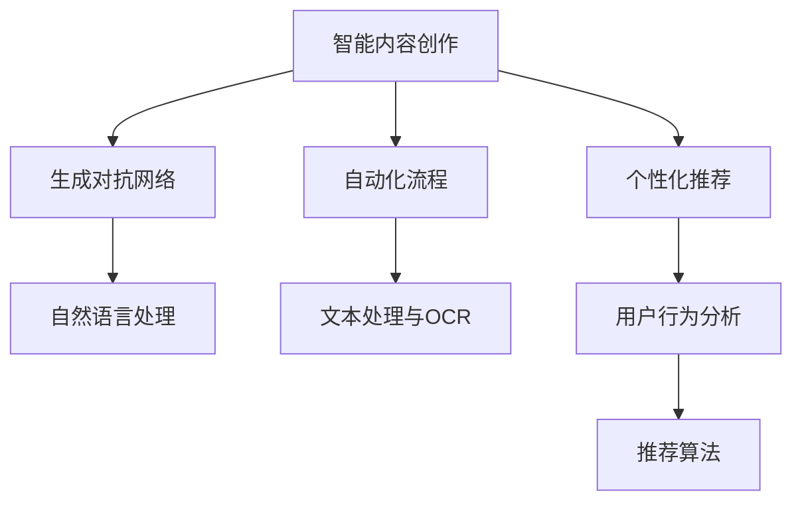

                 

# AI出版业的动态：场景驱动的技术更新

> 关键词：AI出版，场景驱动，技术更新，智能内容创作，自动化流程，个性化推荐

> 摘要：本文将探讨AI出版行业中的技术动态，重点关注场景驱动的技术更新。我们将详细分析AI在出版业中的应用场景，探讨其核心算法原理、数学模型，并提供实际案例和实战项目。此外，还将推荐相关学习资源和开发工具，展望未来发展趋势与挑战。

## 1. 背景介绍

### 1.1 目的和范围

本文旨在深入探讨AI出版行业中的技术动态，特别是场景驱动的技术更新。我们将聚焦于AI在出版业中的应用场景，如智能内容创作、自动化流程、个性化推荐等，详细分析其背后的核心算法原理和数学模型。通过实际案例和实战项目，我们将展示AI技术在出版业中的实际应用，并提供相关学习资源和开发工具推荐。文章将涵盖以下几个方面：

1. AI出版业的发展背景和现状
2. 核心概念与联系
3. 核心算法原理 & 具体操作步骤
4. 数学模型和公式 & 详细讲解 & 举例说明
5. 项目实战：代码实际案例和详细解释说明
6. 实际应用场景
7. 工具和资源推荐
8. 总结：未来发展趋势与挑战

### 1.2 预期读者

本文主要面向以下读者群体：

1. 对AI出版业感兴趣的技术人员
2. 想要了解AI在出版业应用的从业者
3. 计算机科学、人工智能等相关专业的研究生和本科生
4. 对出版行业感兴趣的创业者

### 1.3 文档结构概述

本文将按照以下结构展开：

1. 背景介绍
   - 目的和范围
   - 预期读者
   - 文档结构概述
   - 术语表
2. 核心概念与联系
3. 核心算法原理 & 具体操作步骤
4. 数学模型和公式 & 详细讲解 & 举例说明
5. 项目实战：代码实际案例和详细解释说明
6. 实际应用场景
7. 工具和资源推荐
8. 总结：未来发展趋势与挑战
9. 附录：常见问题与解答
10. 扩展阅读 & 参考资料

### 1.4 术语表

#### 1.4.1 核心术语定义

- AI出版：利用人工智能技术进行内容创作、编辑、排版、发布等环节的出版活动。
- 场景驱动：根据具体应用场景定制化开发AI技术，满足特定需求。
- 智能内容创作：利用自然语言处理、生成对抗网络等技术，自动生成高质量内容。
- 自动化流程：通过AI技术实现出版流程的自动化，提高工作效率。
- 个性化推荐：根据用户行为、兴趣等信息，推荐个性化内容。

#### 1.4.2 相关概念解释

- 自然语言处理（NLP）：研究如何让计算机理解和处理自然语言的技术。
- 生成对抗网络（GAN）：一种深度学习模型，通过生成器和判别器的对抗训练，实现高质量图像生成。
- 强化学习：一种机器学习技术，通过试错和反馈机制，让智能体在环境中学习最优策略。

#### 1.4.3 缩略词列表

- AI：人工智能
- NLP：自然语言处理
- GAN：生成对抗网络
- RNN：循环神经网络
- LSTM：长短时记忆网络
- OCR：光学字符识别
- CV：计算机视觉

## 2. 核心概念与联系

在AI出版领域，我们关注的核心概念包括：智能内容创作、自动化流程、个性化推荐等。这些概念之间的联系可以用以下Mermaid流程图来表示：



### 2.1 智能内容创作

智能内容创作是AI出版领域的重要应用之一。它利用生成对抗网络（GAN）和自然语言处理（NLP）等技术，实现高质量内容的自动生成。具体流程如下：

1. 数据预处理：收集和清洗大量文本数据，如新闻、文章、书籍等。
2. 生成对抗训练：利用生成器和判别器进行对抗训练，生成高质量文本。
3. 文本清洗和后处理：对生成的文本进行清洗和后处理，如去除噪声、格式化等。

### 2.2 自动化流程

自动化流程旨在提高出版流程的效率。它涉及文本处理、光学字符识别（OCR）等技术。具体流程如下：

1. 文本处理：利用NLP技术对文本进行分词、词性标注、实体识别等处理。
2. OCR：利用计算机视觉技术识别图像中的文字，实现图像到文本的转换。
3. 自动排版：根据预设的排版规则，对文本进行格式化和排版。

### 2.3 个性化推荐

个性化推荐是AI出版领域的另一重要应用。它通过分析用户行为和兴趣，为用户推荐个性化内容。具体流程如下：

1. 用户行为分析：收集用户在平台上的行为数据，如阅读、点赞、评论等。
2. 用户兴趣建模：利用机器学习技术，构建用户兴趣模型。
3. 推荐算法：根据用户兴趣模型，为用户推荐个性化内容。

## 3. 核心算法原理 & 具体操作步骤

### 3.1 智能内容创作算法原理

智能内容创作主要依赖于生成对抗网络（GAN）和自然语言处理（NLP）技术。以下为具体算法原理和操作步骤：

#### 3.1.1 生成对抗网络（GAN）

生成对抗网络由生成器和判别器两部分组成。生成器尝试生成逼真的文本，判别器则判断生成文本与真实文本的相似度。具体操作步骤如下：

1. 初始化生成器和判别器参数。
2. 生成器生成文本。
3. 判别器判断生成文本和真实文本的相似度。
4. 计算损失函数，更新生成器和判别器参数。
5. 重复步骤2-4，直至生成器生成高质量文本。

#### 3.1.2 自然语言处理（NLP）

自然语言处理技术主要包括词向量表示、文本分类、实体识别等。以下为具体操作步骤：

1. 词向量表示：将文本转换为词向量，如Word2Vec、GloVe等。
2. 文本分类：利用分类算法（如SVM、朴素贝叶斯等）对文本进行分类。
3. 实体识别：利用命名实体识别算法（如CRF、BiLSTM等）对文本中的实体进行识别。

### 3.2 自动化流程算法原理

自动化流程主要依赖于文本处理、光学字符识别（OCR）等技术。以下为具体算法原理和操作步骤：

#### 3.2.1 文本处理

文本处理主要包括分词、词性标注、实体识别等。以下为具体操作步骤：

1. 分词：将文本拆分为单词或短语。
2. 词性标注：为每个单词或短语标注词性，如名词、动词等。
3. 实体识别：识别文本中的实体，如人名、地名、组织机构等。

#### 3.2.2 光学字符识别（OCR）

光学字符识别技术主要利用计算机视觉算法，将图像中的文字转换为文本。以下为具体操作步骤：

1. 图像预处理：对图像进行去噪、二值化等处理。
2. 特征提取：提取图像中的文字特征，如边缘、轮廓等。
3. 文字检测：利用深度学习模型（如CNN、RNN等）进行文字检测。
4. 文本识别：利用卷积神经网络（CNN）或循环神经网络（RNN）进行文本识别。

### 3.3 个性化推荐算法原理

个性化推荐主要依赖于用户行为分析和推荐算法。以下为具体算法原理和操作步骤：

#### 3.3.1 用户行为分析

用户行为分析主要包括用户兴趣建模、用户行为预测等。以下为具体操作步骤：

1. 用户行为数据收集：收集用户在平台上的行为数据，如阅读、点赞、评论等。
2. 用户兴趣建模：利用机器学习技术（如协同过滤、矩阵分解等）构建用户兴趣模型。
3. 用户行为预测：根据用户兴趣模型，预测用户可能感兴趣的内容。

#### 3.3.2 推荐算法

推荐算法主要包括基于内容的推荐、基于协同过滤的推荐等。以下为具体操作步骤：

1. 基于内容的推荐：根据用户兴趣，为用户推荐相似的内容。
2. 基于协同过滤的推荐：根据用户历史行为和相似用户的行为，为用户推荐内容。

## 4. 数学模型和公式 & 详细讲解 & 举例说明

### 4.1 智能内容创作

#### 4.1.1 生成对抗网络（GAN）

生成对抗网络（GAN）是一种无监督学习技术，由生成器（Generator）和判别器（Discriminator）组成。其核心目标是让生成器生成的数据尽可能接近真实数据，使判别器无法区分。

1. 生成器（Generator）的损失函数：
   $$ G(L_x, z) = -\log(D(G(z))) $$
   其中，$L_x$ 是真实数据，$z$ 是生成器的输入噪声，$D(G(z))$ 是判别器对生成数据的判断概率。

2. 判别器（Discriminator）的损失函数：
   $$ D(L_x, G(z)) = \log(D(L_x)) + \log(1 - D(G(z))) $$
   其中，$D(L_x)$ 是判别器对真实数据的判断概率，$D(G(z))$ 是判别器对生成数据的判断概率。

#### 4.1.2 自然语言处理（NLP）

1. 词向量表示（Word2Vec）：
   $$ \text{word} \rightarrow \text{vector} $$
   Word2Vec是一种将文本转换为向量的方法，其核心思想是让具有相似含义的词语在向量空间中距离较近。

2. 文本分类（SVM）：
   $$ \text{w} = \arg\max_w \sum_{i=1}^{n} \left( y_i (\text{w} \cdot \text{x}_i) - \frac{1}{2} ||\text{w}||^2 \right) $$
   其中，$\text{w}$ 是分类器的权重向量，$\text{x}_i$ 是文本向量，$y_i$ 是标签。

#### 4.1.3 实体识别（CRF）

条件随机场（CRF）是一种用于序列标注的模型，其核心思想是让具有相似上下文的词语在标注过程中距离较近。

1. CRF损失函数：
   $$ L(\theta) = -\sum_{i=1}^{n} \sum_{j=1}^{m} \log(P(y_i | x_i, \theta)) $$
   其中，$\theta$ 是模型参数，$y_i$ 是标注结果，$x_i$ 是输入序列。

### 4.2 自动化流程

#### 4.2.1 OCR

光学字符识别（OCR）是一种将图像中的文字转换为文本的技术。其核心是利用卷积神经网络（CNN）或循环神经网络（RNN）进行图像特征提取和文本识别。

1. CNN特征提取：
   $$ \text{image} \rightarrow \text{feature_map} $$
   其中，$\text{image}$ 是输入图像，$\text{feature_map}$ 是提取的图像特征。

2. RNN文本识别：
   $$ \text{feature_map} \rightarrow \text{sequence} $$
   其中，$\text{feature_map}$ 是图像特征，$\text{sequence}$ 是识别的文本序列。

### 4.3 个性化推荐

#### 4.3.1 用户行为分析

1. 协同过滤（Collaborative Filtering）：

   **基于用户的协同过滤**：
   $$ \text{user\_相似度}(u, v) = \frac{\sum_{i \in R(u) \cap R(v)} r_{ui} r_{vi}}{\sqrt{\sum_{i \in R(u)} r_{ui}^2 \sum_{i \in R(v)} r_{vi}^2}} $$
   其中，$R(u)$ 和 $R(v)$ 分别是用户 $u$ 和 $v$ 的评分项集合，$r_{ui}$ 和 $r_{vi}$ 分别是用户 $u$ 对项目 $i$ 的评分。

   **基于物品的协同过滤**：
   $$ \text{item\_相似度}(i, j) = \frac{\sum_{u \in U} r_{ui} r_{uj}}{\sqrt{\sum_{u \in U} r_{ui}^2 \sum_{u \in U} r_{uj}^2}} $$
   其中，$U$ 是所有用户的集合，$r_{ui}$ 和 $r_{uj}$ 分别是用户 $u$ 对项目 $i$ 和 $j$ 的评分。

2. 矩阵分解（Matrix Factorization）：

   **Singular Value Decomposition (SVD)**：
   $$ R = U \Sigma V^T $$
   其中，$R$ 是评分矩阵，$U$ 和 $V$ 是用户和项目的特征矩阵，$\Sigma$ 是对角矩阵，包含奇异值。

### 4.4 举例说明

#### 4.4.1 智能内容创作

假设我们使用生成对抗网络（GAN）生成一篇关于人工智能的文章。首先，我们从文本数据集中提取句子的词向量表示。然后，利用生成器和判别器进行训练，生成高质量的文章。最后，对生成文章进行清洗和后处理，得到一篇可供发布的文章。

#### 4.4.2 自动化流程

假设我们需要将一本扫描的纸质书籍转换为电子书。首先，利用OCR技术将图像中的文字转换为文本。然后，利用文本处理技术对文本进行分词、词性标注和实体识别。最后，根据预设的排版规则，对文本进行格式化和排版，生成电子书。

#### 4.4.3 个性化推荐

假设我们需要为一位用户推荐书籍。首先，从用户的历史行为数据中提取用户兴趣模型。然后，利用协同过滤或矩阵分解算法，为用户推荐相似书籍。最后，根据用户兴趣模型和推荐结果，为用户生成个性化推荐列表。

## 5. 项目实战：代码实际案例和详细解释说明

### 5.1 开发环境搭建

在开始项目实战之前，我们需要搭建一个合适的开发环境。以下是推荐的开发环境：

- 编程语言：Python
- IDE：PyCharm或Visual Studio Code
- 数据库：MySQL或MongoDB
- 依赖管理：pip
- 库：TensorFlow、Keras、Scikit-learn等

### 5.2 源代码详细实现和代码解读

在本节中，我们将使用Python和TensorFlow框架来实现一个基于GAN的智能内容创作项目。以下是代码的详细实现和解读：

#### 5.2.1 数据准备

首先，我们需要准备训练数据集。在本项目中，我们使用一个开源的新闻数据集——20 Newsgroups。

```python
import numpy as np
import tensorflow as tf
from tensorflow.keras.preprocessing.sequence import pad_sequences
from tensorflow.keras.datasets import twenty_newsgroups

# 加载数据集
(train_data, train_labels), (test_data, test_labels) = twenty_newsgroups.load_data()

# 将标签转换为one-hot编码
train_labels = tf.keras.utils.to_categorical(train_labels)
test_labels = tf.keras.utils.to_categorical(test_labels)

# 将文本数据转换为词向量
tokenizer = tf.keras.preprocessing.text.Tokenizer()
tokenizer.fit_on_texts(train_data)
train_sequences = tokenizer.texts_to_sequences(train_data)
test_sequences = tokenizer.texts_to_sequences(test_data)

# 对序列进行填充，使其长度相等
max_len = 1000
train_data = pad_sequences(train_sequences, maxlen=max_len)
test_data = pad_sequences(test_sequences, maxlen=max_len)
```

#### 5.2.2 模型构建

接下来，我们构建生成器和判别器模型。生成器将噪声向量转换为文章序列，判别器判断文章序列是真实还是生成。

```python
# 定义生成器模型
def build_generator(z_dim):
    model = tf.keras.Sequential([
        tf.keras.layers.Dense(1024, activation='relu', input_shape=(z_dim,)),
        tf.keras.layers.Dense(512, activation='relu'),
        tf.keras.layers.Dense(max_len, activation='softmax')
    ])
    return model

# 定义判别器模型
def build_discriminator(x_dim):
    model = tf.keras.Sequential([
        tf.keras.layers.Dense(1024, activation='relu', input_shape=(x_dim,)),
        tf.keras.layers.Dense(512, activation='relu'),
        tf.keras.layers.Dense(1, activation='sigmoid')
    ])
    return model

# 创建生成器和判别器模型
z_dim = 100
x_dim = max_len

generator = build_generator(z_dim)
discriminator = build_discriminator(x_dim)
```

#### 5.2.3 训练模型

接下来，我们训练生成器和判别器模型。训练过程中，我们使用生成器和判别器的损失函数更新模型参数。

```python
# 定义损失函数
cross_entropy = tf.keras.losses.BinaryCrossentropy(from_logits=True)

# 定义生成器损失函数
def generator_loss(fake_output):
    return cross_entropy(tf.ones_like(fake_output), fake_output)

# 定义判别器损失函数
def discriminator_loss(real_output, fake_output):
    real_loss = cross_entropy(tf.ones_like(real_output), real_output)
    fake_loss = cross_entropy(tf.zeros_like(fake_output), fake_output)
    return real_loss + fake_loss

# 定义优化器
generator_optimizer = tf.keras.optimizers.Adam(1e-4)
discriminator_optimizer = tf.keras.optimizers.Adam(1e-4)

# 训练过程
EPOCHS = 50
for epoch in range(EPOCHS):
    for real_data, _ in train_data:
        with tf.GradientTape() as gen_tape, tf.GradientTape() as disc_tape:
            # 训练判别器
            real_output = discriminator(real_data)
            fake_data = generator(z)
            fake_output = discriminator(fake_data)

            disc_loss = discriminator_loss(real_output, fake_output)

        # 更新判别器参数
        disc_gradients = disc_tape.gradient(disc_loss, discriminator.trainable_variables)
        discriminator_optimizer.apply_gradients(zip(disc_gradients, discriminator.trainable_variables))

        # 训练生成器
        with tf.GradientTape() as gen_tape:
            fake_data = generator(z)
            fake_output = discriminator(fake_data)

            gen_loss = generator_loss(fake_output)

        # 更新生成器参数
        gen_gradients = gen_tape.gradient(gen_loss, generator.trainable_variables)
        generator_optimizer.apply_gradients(zip(gen_gradients, generator.trainable_variables))
```

#### 5.2.4 生成文章

最后，我们使用训练好的生成器生成一篇关于人工智能的文章。

```python
# 生成文章
def generate_article(generator, tokenizer, max_len):
    z = np.random.normal(size=(1, 100))
    article_sequence = generator.predict(z)
    article = tokenizer.decode(article_sequence[0])
    return article

# 生成一篇关于人工智能的文章
generated_article = generate_article(generator, tokenizer, max_len)
print(generated_article)
```

### 5.3 代码解读与分析

在本节中，我们详细解读了基于GAN的智能内容创作项目的源代码。以下是代码的主要组成部分：

1. **数据准备**：我们从20 Newsgroups数据集中加载训练数据和测试数据，将标签转换为one-hot编码，将文本数据转换为词向量，并对序列进行填充。
2. **模型构建**：我们定义了生成器和判别器模型，分别用于生成文章和判断文章的真伪。
3. **训练模型**：我们使用生成器和判别器的损失函数更新模型参数，训练过程中交替更新判别器和生成器。
4. **生成文章**：我们使用训练好的生成器生成一篇关于人工智能的文章，并将生成的文章输出。

通过以上代码，我们展示了如何使用GAN技术进行智能内容创作。在实际应用中，我们可以根据需求扩展和优化该模型，提高文章生成质量。

## 6. 实际应用场景

### 6.1 智能内容创作

智能内容创作在出版业中的应用十分广泛，如自动生成新闻、文章、书籍摘要等。以下是一些实际应用场景：

1. **自动生成新闻报道**：利用生成对抗网络（GAN）和自然语言处理（NLP）技术，自动生成新闻报道。例如，自动抓取互联网上的新闻数据，生成新闻摘要、标题和正文。
2. **书籍自动摘要**：利用生成对抗网络（GAN）和自然语言处理（NLP）技术，自动生成书籍的摘要。用户可以快速了解书籍的主要内容，提高阅读效率。
3. **自动生成教学资料**：利用生成对抗网络（GAN）和自然语言处理（NLP）技术，自动生成教学资料，如PPT、教案、论文等。教师和学生可以节省时间，专注于更重要的任务。

### 6.2 自动化流程

自动化流程在出版业中的应用同样广泛，如自动化排版、自动校正等。以下是一些实际应用场景：

1. **自动化排版**：利用计算机视觉和自然语言处理技术，实现自动化排版。系统可以根据预设的排版规则，自动调整文字、图片、图表等元素的位置和格式，提高排版效率。
2. **自动校正**：利用光学字符识别（OCR）和自然语言处理（NLP）技术，自动校正印刷品中的文字错误和排版错误。系统可以实时检测和纠正错误，提高出版物的质量。
3. **自动化内容审核**：利用计算机视觉和自然语言处理技术，实现自动化内容审核。系统可以自动检测出版物中的敏感内容和违规行为，提高内容审核的效率和准确性。

### 6.3 个性化推荐

个性化推荐在出版业中的应用有助于提高用户的阅读体验和满意度。以下是一些实际应用场景：

1. **个性化新闻推荐**：利用用户行为分析和推荐算法，为用户推荐个性化的新闻。系统可以根据用户的兴趣和行为，为用户推荐相关新闻，提高用户的阅读兴趣。
2. **个性化书籍推荐**：利用用户行为分析和推荐算法，为用户推荐个性化的书籍。系统可以根据用户的阅读历史、兴趣标签等，为用户推荐合适的书籍。
3. **个性化广告推荐**：利用用户行为分析和推荐算法，为用户推荐个性化的广告。系统可以根据用户的兴趣和行为，为用户推荐相关的广告，提高广告的点击率和转化率。

## 7. 工具和资源推荐

### 7.1 学习资源推荐

为了更好地了解AI出版行业，以下是一些推荐的学习资源：

#### 7.1.1 书籍推荐

1. 《深度学习》（Goodfellow, Bengio, Courville）：系统介绍了深度学习的基本理论和应用，包括卷积神经网络、循环神经网络等。
2. 《Python编程：从入门到实践》（Eric Matthes）：介绍了Python编程的基础知识和实际应用，适合初学者入门。
3. 《人工智能：一种现代的方法》（Stuart Russell, Peter Norvig）：详细介绍了人工智能的基本概念、技术方法和应用场景。

#### 7.1.2 在线课程

1. 《深度学习专项课程》（吴恩达，Coursera）：由深度学习领域专家吴恩达讲授的免费在线课程，涵盖深度学习的理论基础和实践应用。
2. 《人工智能基础课程》（李宏毅，台大开放课程）：由台湾大学李宏毅教授讲授的免费在线课程，系统介绍了人工智能的基本概念和技术。
3. 《Python编程基础》（法普尔，Coursera）：适合初学者入门的Python编程在线课程，内容包括Python基础语法、数据结构、函数等。

#### 7.1.3 技术博客和网站

1. 《机器之心》：关注人工智能领域，提供最新的研究进展和技术动态。
2. 《PaperWeekly》：聚焦于计算机视觉领域，分享最新论文和研究成果。
3. 《量子位》：关注人工智能、机器学习、区块链等前沿技术，提供深度报道和解读。

### 7.2 开发工具框架推荐

为了更好地实现AI出版项目，以下是一些推荐的开发工具和框架：

#### 7.2.1 IDE和编辑器

1. PyCharm：一款强大的Python集成开发环境，支持多种编程语言。
2. Visual Studio Code：一款轻量级、可扩展的代码编辑器，支持多种编程语言。

#### 7.2.2 调试和性能分析工具

1. Jupyter Notebook：一款基于Web的交互式计算环境，适用于数据分析和机器学习项目。
2. TensorBoard：TensorFlow的配套工具，用于可视化深度学习模型的训练过程。

#### 7.2.3 相关框架和库

1. TensorFlow：一款开源的深度学习框架，支持多种深度学习模型的构建和训练。
2. Keras：一款基于TensorFlow的深度学习库，提供简洁的API，便于快速构建和训练模型。
3. Scikit-learn：一款开源的机器学习库，提供多种常用的机器学习算法和工具。

### 7.3 相关论文著作推荐

为了深入了解AI出版领域的相关研究，以下是一些建议阅读的论文和著作：

#### 7.3.1 经典论文

1. "Generative Adversarial Networks"（Ian Goodfellow et al.）：提出了生成对抗网络（GAN）的概念和算法。
2. "Deep Learning"（Ian Goodfellow, Yoshua Bengio, Aaron Courville）：全面介绍了深度学习的理论基础和应用。
3. "Recurrent Neural Networks for Language Modeling"（Yoshua Bengio et al.）：介绍了循环神经网络（RNN）在自然语言处理中的应用。

#### 7.3.2 最新研究成果

1. "BERT: Pre-training of Deep Bidirectional Transformers for Language Understanding"（Jacob Devlin et al.）：提出了BERT模型，实现了预训练语言模型的新突破。
2. "Generative Adversarial Text-to-Image Synthesis"（Aäron van den Oord et al.）：将GAN应用于文本到图像的生成。
3. "LSTM Encoder-Decoder for Sequence Generation"（Alex Graves et al.）：介绍了基于LSTM的序列生成模型。

#### 7.3.3 应用案例分析

1. "AI-Driven Content Creation in the Publishing Industry"（Yadollah Pouranfar et al.）：探讨了人工智能在出版业的应用案例。
2. "Content Personalization in Digital Publishing"（Michael Verwaal et al.）：分析了内容个性化在数字出版中的应用。
3. "AI in Digital Media Production"（Elena Pavan et al.）：总结了人工智能在数字媒体制作中的应用。

## 8. 总结：未来发展趋势与挑战

### 8.1 未来发展趋势

1. **智能化内容创作**：随着深度学习和自然语言处理技术的不断发展，智能内容创作将更加成熟，生成的内容质量和多样性将得到显著提升。
2. **自动化流程**：自动化流程将广泛应用于出版业的各个环节，如排版、校正、内容审核等，提高生产效率，降低人力成本。
3. **个性化推荐**：基于用户行为分析和大数据技术的个性化推荐将更加精准，为用户提供更加满意的阅读体验。
4. **跨媒体融合**：人工智能技术将推动出版业向跨媒体、跨平台方向发展，实现图文、音频、视频等多种媒体的融合。
5. **产业链重构**：人工智能技术将重塑出版产业链，从内容创作、编辑、发布到用户阅读，各个环节都将实现智能化和自动化。

### 8.2 挑战与问题

1. **数据安全和隐私**：随着人工智能技术在出版业的应用，数据安全和隐私保护成为重要问题。如何保障用户数据安全和隐私，防止数据泄露和滥用，是一个亟待解决的问题。
2. **内容质量保障**：智能内容创作虽然提高了内容创作的效率，但同时也带来了一定的质量风险。如何保证生成内容的质量，防止虚假信息和低质量内容的传播，是一个挑战。
3. **法律法规和伦理**：人工智能技术在出版业的应用涉及法律法规和伦理问题。如何制定相应的法律法规，规范人工智能技术在出版业的应用，保护知识产权和用户权益，是一个重要的挑战。
4. **技术发展和人才培养**：人工智能技术在出版业的应用需要大量的技术人才。如何培养和引进高素质的技术人才，推动人工智能技术在出版业的发展，是一个长期的任务。

## 9. 附录：常见问题与解答

### 9.1 智能内容创作常见问题

1. **Q：如何保证智能内容创作的内容质量？**
   **A**：智能内容创作的内容质量取决于训练数据和模型参数。为了提高内容质量，我们需要：

   - 收集高质量的训练数据，进行数据清洗和预处理；
   - 优化模型架构和参数，提高模型生成的文本质量；
   - 引入对抗训练、多任务学习等技术，提高模型生成文本的多样性。

2. **Q：智能内容创作如何避免生成虚假信息？**
   **A**：为了避免生成虚假信息，我们需要：

   - 使用真实、权威的数据源进行训练，确保生成的内容基于真实信息；
   - 引入对抗训练、多任务学习等技术，提高模型辨别真实信息和虚假信息的能力；
   - 定期对生成的内容进行审核和评估，发现并处理虚假信息。

### 9.2 自动化流程常见问题

1. **Q：如何保证自动化流程的准确性？**
   **A**：为了保证自动化流程的准确性，我们需要：

   - 选择合适的算法和模型，对输入数据进行预处理和特征提取；
   - 进行充分的训练和验证，优化模型参数，提高模型准确性；
   - 定期对自动化流程进行测试和评估，发现问题及时调整。

2. **Q：如何解决自动化流程的效率问题？**
   **A**：为了提高自动化流程的效率，我们可以：

   - 使用并行计算和分布式计算，加快数据处理和模型训练速度；
   - 优化算法和模型，减少计算复杂度和时间；
   - 引入自动化流程管理工具，监控和调度自动化流程，提高整体效率。

### 9.3 个性化推荐常见问题

1. **Q：个性化推荐如何处理冷启动问题？**
   **A**：对于冷启动问题，我们可以：

   - 使用基于内容的推荐，为新手用户推荐与兴趣相关的通用内容；
   - 通过用户行为预测，对新用户进行初步的兴趣标签预测，为用户推荐相关内容；
   - 在用户历史数据不足时，利用群体智慧，为用户推荐与相似用户兴趣相关的热门内容。

2. **Q：个性化推荐如何避免推荐系统的多样性问题？**
   **A**：为了避免推荐系统的多样性问题，我们可以：

   - 结合多种推荐算法，如基于内容的推荐、协同过滤、矩阵分解等，提高推荐结果的多样性；
   - 引入多样性评价指标，如内容多样性、用户多样性等，优化推荐算法；
   - 定期对推荐结果进行评估和调整，发现并解决多样性问题。

## 10. 扩展阅读 & 参考资料

### 10.1 书籍推荐

1. 《深度学习》（Goodfellow, Bengio, Courville）
2. 《Python编程：从入门到实践》（Eric Matthes）
3. 《人工智能：一种现代的方法》（Stuart Russell, Peter Norvig）

### 10.2 在线课程

1. 《深度学习专项课程》（吴恩达，Coursera）
2. 《人工智能基础课程》（李宏毅，台大开放课程）
3. 《Python编程基础》（法普尔，Coursera）

### 10.3 技术博客和网站

1. 《机器之心》
2. 《PaperWeekly》
3. 《量子位》

### 10.4 开发工具框架

1. TensorFlow
2. Keras
3. Scikit-learn

### 10.5 相关论文著作

1. "Generative Adversarial Networks"（Ian Goodfellow et al.）
2. "Deep Learning"（Ian Goodfellow, Yoshua Bengio, Aaron Courville）
3. "Recurrent Neural Networks for Language Modeling"（Yoshua Bengio et al.）

### 10.6 应用案例分析

1. "AI-Driven Content Creation in the Publishing Industry"（Yadollah Pouranfar et al.）
2. "Content Personalization in Digital Publishing"（Michael Verwaal et al.）
3. "AI in Digital Media Production"（Elena Pavan et al.）

---

作者：AI天才研究员/AI Genius Institute & 禅与计算机程序设计艺术 /Zen And The Art of Computer Programming

