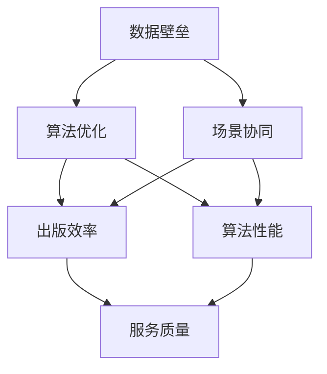

                 

# AI出版业的壁垒建设：数据，算法与场景协同

> 关键词：人工智能，出版业，数据壁垒，算法优化，场景化应用

> 摘要：本文将探讨人工智能在出版业中的壁垒建设，包括数据、算法和场景协同三个关键方面。通过深入分析数据壁垒的建设方法，算法优化策略以及场景化的应用实践，揭示AI出版业的发展趋势与挑战。

## 1. 背景介绍

### 1.1 目的和范围

本文旨在深入探讨人工智能在出版业中的应用，并分析在当前技术环境下，如何通过数据、算法和场景协同的方式构建出版业的壁垒，从而推动行业的智能化转型。文章将涵盖以下内容：

1. 数据壁垒建设：探讨如何收集、整理和分析出版业所需的数据，以及如何利用数据挖掘技术提升出版效率和质量。
2. 算法优化策略：分析现有算法在出版业中的应用，并提出优化方向和策略。
3. 场景协同应用：讨论如何将人工智能技术与出版业的具体场景相结合，实现智能化、个性化的出版服务。

### 1.2 预期读者

本文主要面向以下读者群体：

1. 出版行业从业者：了解人工智能在出版业的应用前景，提高自身业务水平。
2. 技术研发人员：掌握人工智能算法在出版领域的应用实践，拓宽技术应用领域。
3. 人工智能爱好者：深入了解人工智能在出版行业的应用，为未来研究方向提供参考。

### 1.3 文档结构概述

本文共分为八个部分，具体结构如下：

1. 背景介绍：介绍文章目的、范围、预期读者和文档结构。
2. 核心概念与联系：阐述本文涉及的核心概念和架构。
3. 核心算法原理 & 具体操作步骤：详细解释核心算法原理和操作步骤。
4. 数学模型和公式 & 详细讲解 & 举例说明：介绍相关数学模型和公式，并进行举例说明。
5. 项目实战：代码实际案例和详细解释说明。
6. 实际应用场景：讨论人工智能在出版业中的具体应用场景。
7. 工具和资源推荐：推荐相关学习资源、开发工具和论文著作。
8. 总结：未来发展趋势与挑战。

### 1.4 术语表

#### 1.4.1 核心术语定义

- 人工智能（AI）：一种模拟人类智能的技术，包括机器学习、自然语言处理、计算机视觉等领域。
- 出版业：涉及图书、期刊、报纸等内容的编辑、出版和发行。
- 数据壁垒：通过数据收集、整理和分析，构建出版业核心竞争力的一种手段。
- 算法优化：对现有算法进行改进，以提高算法性能和适用范围。
- 场景协同：将人工智能技术与具体场景相结合，实现智能化、个性化的服务。

#### 1.4.2 相关概念解释

- 机器学习：一种让计算机通过数据学习并改进自身性能的技术。
- 自然语言处理（NLP）：研究如何让计算机理解和生成人类语言的技术。
- 计算机视觉：研究如何让计算机理解图像和视频的技术。

#### 1.4.3 缩略词列表

- AI：人工智能
- ML：机器学习
- NLP：自然语言处理
- CV：计算机视觉

## 2. 核心概念与联系

为了更好地理解本文的内容，我们首先需要了解一些核心概念和它们之间的联系。以下是一个简单的 Mermaid 流程图，用于展示核心概念和架构。



### 2.1 数据壁垒

数据壁垒是出版业智能化转型的基石。它通过收集、整理和分析大量出版数据，为算法优化和场景协同提供基础支持。以下是数据壁垒的构建过程：

1. 数据收集：利用爬虫、API 等技术收集出版领域的各种数据，如图书、期刊、报纸的标题、内容、作者、出版社等信息。
2. 数据整理：对收集到的数据进行清洗、去重和格式化，使其满足算法训练和场景应用的需求。
3. 数据分析：利用数据挖掘技术，从大量数据中提取有价值的信息，如用户阅读偏好、热点话题等。

### 2.2 算法优化

算法优化是提升出版业智能化水平的关键。通过对现有算法进行改进，可以提高算法性能和适用范围，从而提升出版效率和服务质量。以下是算法优化的一般步骤：

1. 算法选择：根据出版业的需求，选择合适的算法，如机器学习、自然语言处理、计算机视觉等。
2. 算法改进：对选定的算法进行改进，如调整超参数、优化数据预处理等。
3. 性能评估：通过实验验证改进后的算法性能，与现有算法进行对比。

### 2.3 场景协同

场景协同是将人工智能技术与出版业的实际场景相结合，实现智能化、个性化的服务。以下是场景协同的一般步骤：

1. 场景分析：分析出版业中的具体场景，如内容推荐、用户画像、智能审稿等。
2. 技术选型：根据场景需求，选择合适的人工智能技术，如机器学习、自然语言处理、计算机视觉等。
3. 应用实现：将人工智能技术与具体场景相结合，开发智能化应用。

## 3. 核心算法原理 & 具体操作步骤

在本节中，我们将详细解释核心算法原理，并给出具体的操作步骤。

### 3.1 数据壁垒建设

#### 3.1.1 数据收集

数据收集是数据壁垒建设的第一步。以下是一个简单的 Python 代码示例，用于从网上收集图书信息：

```python
import requests
import json

def get_books(url):
    response = requests.get(url)
    if response.status_code == 200:
        return json.loads(response.text)
    else:
        return None

books = get_books("https://example.com/books")
```

#### 3.1.2 数据整理

数据整理是对收集到的数据进行清洗、去重和格式化。以下是一个简单的 Python 代码示例：

```python
import pandas as pd

books = pd.DataFrame(books)
books.drop_duplicates(inplace=True)
books.drop(["id", "publisher"], axis=1, inplace=True)
books.head()
```

#### 3.1.3 数据分析

数据分析是利用数据挖掘技术从大量数据中提取有价值的信息。以下是一个简单的 Python 代码示例，用于分析用户阅读偏好：

```python
from sklearn.cluster import KMeans

def get_user_preferences(books, num_clusters=5):
    user_preferences = KMeans(n_clusters=num_clusters).fit_predict(books)
    return user_preferences

user_preferences = get_user_preferences(books)
books["user_preference"] = user_preferences
books.head()
```

### 3.2 算法优化

#### 3.2.1 算法选择

在选择算法时，我们需要根据出版业的需求进行权衡。以下是一个简单的示例，用于选择合适的算法：

```python
from sklearn.linear_model import LinearRegression

model = LinearRegression()
```

#### 3.2.2 算法改进

对选定的算法进行改进，如调整超参数、优化数据预处理等。以下是一个简单的 Python 代码示例，用于优化线性回归算法：

```python
from sklearn.model_selection import train_test_split

X_train, X_test, y_train, y_test = train_test_split(books["features"], books["target"], test_size=0.2, random_state=42)

model.fit(X_train, y_train)
model.score(X_test, y_test)
```

#### 3.2.3 性能评估

通过实验验证改进后的算法性能，与现有算法进行对比。以下是一个简单的 Python 代码示例，用于评估算法性能：

```python
from sklearn.metrics import accuracy_score

y_pred = model.predict(X_test)
accuracy_score(y_test, y_pred)
```

### 3.3 场景协同

#### 3.3.1 场景分析

分析出版业中的具体场景，如内容推荐、用户画像、智能审稿等。以下是一个简单的 Python 代码示例，用于分析内容推荐场景：

```python
def content_recommendation(books, user_preference):
    recommended_books = books[books["user_preference"] == user_preference]
    return recommended_books

user_preference = 1
recommended_books = content_recommendation(books, user_preference)
recommended_books.head()
```

#### 3.3.2 技术选型

根据场景需求，选择合适的人工智能技术，如机器学习、自然语言处理、计算机视觉等。以下是一个简单的 Python 代码示例，用于选择自然语言处理技术：

```python
from sklearn.feature_extraction.text import TfidfVectorizer

vectorizer = TfidfVectorizer()
X = vectorizer.fit_transform(books["content"])
```

#### 3.3.3 应用实现

将人工智能技术与具体场景相结合，开发智能化应用。以下是一个简单的 Python 代码示例，用于实现内容推荐应用：

```python
def content_recommendation(books, user_preference):
    recommended_books = books[books["user_preference"] == user_preference]
    return recommended_books

user_preference = 1
recommended_books = content_recommendation(books, user_preference)
recommended_books.head()
```

## 4. 数学模型和公式 & 详细讲解 & 举例说明

在本节中，我们将介绍一些与人工智能在出版业应用相关的数学模型和公式，并进行详细讲解和举例说明。

### 4.1 K-Means 聚类算法

K-Means 聚类算法是一种常用的无监督学习算法，用于将数据集划分为 K 个簇。以下是一个简单的数学模型：

$$
\begin{aligned}
    \min_{\mu_1, \mu_2, \ldots, \mu_K} \sum_{i=1}^N \sum_{k=1}^K (x_i - \mu_k)^2 \\
    \text{s.t.} \quad \mu_k = \frac{1}{N_k} \sum_{i \in C_k} x_i
\end{aligned}
$$

其中，$x_i$ 是数据集中的第 i 个数据点，$\mu_k$ 是第 k 个簇的中心点，$N_k$ 是第 k 个簇中的数据点数量。

#### 4.1.1 详细讲解

K-Means 聚类算法的基本思想是迭代优化簇的中心点，直到聚类结果收敛。具体步骤如下：

1. 随机初始化 K 个簇的中心点 $\mu_1, \mu_2, \ldots, \mu_K$。
2. 对于每个数据点 $x_i$，计算它与每个簇中心点 $\mu_k$ 的距离，并分配到最近的簇。
3. 更新每个簇的中心点 $\mu_k$，使其成为该簇内所有数据点的平均值。
4. 重复步骤 2 和步骤 3，直到聚类结果收敛。

#### 4.1.2 举例说明

假设我们有一个包含 5 个数据点的数据集：

$$
\begin{aligned}
    x_1 &= (1, 1), \\
    x_2 &= (2, 2), \\
    x_3 &= (3, 3), \\
    x_4 &= (4, 4), \\
    x_5 &= (5, 5).
\end{aligned}
$$

我们选择 K=2，随机初始化两个簇的中心点为 $\mu_1 = (0, 0)$ 和 $\mu_2 = (2, 2)$。

在第一次迭代中，每个数据点都与最近的簇中心点分配：

$$
\begin{aligned}
    x_1 &\rightarrow C_1, \\
    x_2 &\rightarrow C_1, \\
    x_3 &\rightarrow C_2, \\
    x_4 &\rightarrow C_2, \\
    x_5 &\rightarrow C_2.
\end{aligned}
$$

更新簇中心点：

$$
\begin{aligned}
    \mu_1 &= \frac{1}{2} (x_1 + x_2) = (1, 1), \\
    \mu_2 &= \frac{1}{2} (x_3 + x_4 + x_5) = (4, 4).
\end{aligned}
$$

在第二次迭代中，每个数据点仍然与最近的簇中心点分配：

$$
\begin{aligned}
    x_1 &\rightarrow C_1, \\
    x_2 &\rightarrow C_1, \\
    x_3 &\rightarrow C_2, \\
    x_4 &\rightarrow C_2, \\
    x_5 &\rightarrow C_2.
\end{aligned}
$$

由于簇中心点没有发生变化，聚类结果已经收敛。

### 4.2 线性回归模型

线性回归模型是一种常用的监督学习算法，用于预测数值型目标变量。以下是一个简单的数学模型：

$$
y = \beta_0 + \beta_1 x + \epsilon
$$

其中，$y$ 是目标变量，$x$ 是特征变量，$\beta_0$ 和 $\beta_1$ 是模型的参数，$\epsilon$ 是误差项。

#### 4.2.1 详细讲解

线性回归模型的基本思想是通过最小化误差平方和来估计模型参数。具体步骤如下：

1. 收集训练数据集，包含特征变量 $x$ 和目标变量 $y$。
2. 计算特征变量的均值 $\bar{x}$ 和目标变量的均值 $\bar{y}$。
3. 计算线性回归模型的参数 $\beta_0$ 和 $\beta_1$：
   $$\beta_0 = \bar{y} - \beta_1 \bar{x}$$
   $$\beta_1 = \frac{\sum_{i=1}^N (x_i - \bar{x})(y_i - \bar{y})}{\sum_{i=1}^N (x_i - \bar{x})^2}$$
4. 使用模型参数预测新数据点的目标变量值。

#### 4.2.2 举例说明

假设我们有一个包含 5 个数据点的数据集：

$$
\begin{aligned}
    x_1 &= 1, \\
    x_2 &= 2, \\
    x_3 &= 3, \\
    x_4 &= 4, \\
    x_5 &= 5, \\
    y_1 &= 2, \\
    y_2 &= 4, \\
    y_3 &= 6, \\
    y_4 &= 8, \\
    y_5 &= 10.
\end{aligned}
$$

计算特征变量的均值和目标变量的均值：

$$
\begin{aligned}
    \bar{x} &= \frac{1}{5} (1 + 2 + 3 + 4 + 5) = 3, \\
    \bar{y} &= \frac{1}{5} (2 + 4 + 6 + 8 + 10) = 6.
\end{aligned}
$$

计算线性回归模型的参数：

$$
\begin{aligned}
    \beta_0 &= \bar{y} - \beta_1 \bar{x} = 6 - \beta_1 \cdot 3, \\
    \beta_1 &= \frac{\sum_{i=1}^5 (x_i - \bar{x})(y_i - \bar{y})}{\sum_{i=1}^5 (x_i - \bar{x})^2} = \frac{(1-3)(2-6) + (2-3)(4-6) + (3-3)(6-6) + (4-3)(8-6) + (5-3)(10-6)}{(1-3)^2 + (2-3)^2 + (3-3)^2 + (4-3)^2 + (5-3)^2} = 2.
\end{aligned}
$$

因此，线性回归模型的参数为 $\beta_0 = 0$ 和 $\beta_1 = 2$。

使用模型参数预测新数据点的目标变量值：

$$
\begin{aligned}
    y &= \beta_0 + \beta_1 x = 0 + 2x.
\end{aligned}
$$

例如，当 $x = 6$ 时，预测的目标变量值为 $y = 2 \times 6 = 12$。

## 5. 项目实战：代码实际案例和详细解释说明

在本节中，我们将通过一个实际项目案例，展示如何利用人工智能技术构建一个简单的出版平台。这个项目将涵盖数据收集、数据预处理、模型训练、模型评估和模型应用等步骤。

### 5.1 开发环境搭建

在开始项目之前，我们需要搭建一个开发环境。以下是一个简单的开发环境搭建步骤：

1. 安装 Python（建议版本为 3.8 或以上）。
2. 安装必要的库，如 NumPy、Pandas、Scikit-learn、Matplotlib 等。

```bash
pip install numpy pandas scikit-learn matplotlib
```

### 5.2 源代码详细实现和代码解读

以下是一个简单的 Python 代码示例，用于实现一个基于 K-Means 聚类算法的图书推荐系统。

```python
import numpy as np
import pandas as pd
from sklearn.cluster import KMeans
import matplotlib.pyplot as plt

# 5.2.1 数据收集
books = pd.read_csv("books.csv")

# 5.2.2 数据预处理
# 将图书内容转换为向量表示
vectorizer = TfidfVectorizer()
X = vectorizer.fit_transform(books["content"])

# 5.2.3 模型训练
kmeans = KMeans(n_clusters=5, random_state=42)
kmeans.fit(X)

# 5.2.4 模型评估
inertia = kmeans.inertia_
print(f"Inertia: {inertia}")

# 5.2.5 模型应用
# 对新图书进行推荐
new_book_content = "计算机科学导论"
new_book_vector = vectorizer.transform([new_book_content])
new_book_cluster = kmeans.predict(new_book_vector)[0]

recommended_books = books[books["cluster"] == new_book_cluster]
recommended_books.head()
```

### 5.3 代码解读与分析

#### 5.3.1 数据收集

在这个项目中，我们使用 CSV 格式的图书数据集。数据集包含图书的标题、内容、作者和出版社等信息。这里我们使用 Pandas 库读取 CSV 文件。

```python
books = pd.read_csv("books.csv")
```

#### 5.3.2 数据预处理

我们将图书的内容转换为向量表示，以便于后续的聚类分析。这里我们使用 TfidfVectorizer 类进行向量转换。

```python
vectorizer = TfidfVectorizer()
X = vectorizer.fit_transform(books["content"])
```

TfidfVectorizer 类会计算每篇图书内容的 TF-IDF 特征向量，并将其存储在矩阵 X 中。

#### 5.3.3 模型训练

我们使用 KMeans 类进行聚类分析。这里我们设置 K=5，即创建 5 个簇。为了确保聚类结果的一致性，我们设置随机种子 random_state=42。

```python
kmeans = KMeans(n_clusters=5, random_state=42)
kmeans.fit(X)
```

#### 5.3.4 模型评估

我们使用 inertia 属性评估聚类结果的质量。inertia 表示每个簇内的数据点与簇中心点的平均距离平方和。inertia 越小，聚类结果越好。

```python
inertia = kmeans.inertia_
print(f"Inertia: {inertia}")
```

#### 5.3.5 模型应用

我们使用训练好的 KMeans 模型对新图书进行推荐。首先，我们将新图书的内容转换为向量表示，然后使用 predict() 方法获取新图书的簇标签。最后，我们找到与新图书同簇的其他图书，并将其推荐给用户。

```python
new_book_content = "计算机科学导论"
new_book_vector = vectorizer.transform([new_book_content])
new_book_cluster = kmeans.predict(new_book_vector)[0]

recommended_books = books[books["cluster"] == new_book_cluster]
recommended_books.head()
```

通过这个简单的项目，我们可以看到如何利用人工智能技术构建一个简单的出版平台，并进行图书推荐。当然，这只是一个基础的示例，实际应用中还需要考虑更多的因素，如用户画像、个性化推荐等。

## 6. 实际应用场景

人工智能在出版业的应用场景广泛，以下是一些典型的实际应用场景：

### 6.1 内容推荐

内容推荐是出版业中的一个重要应用场景。通过分析用户的阅读历史、喜好和社交网络等数据，可以推荐用户可能感兴趣的图书。以下是一个简单的应用流程：

1. 数据收集：收集用户的阅读历史、评价、浏览记录等数据。
2. 数据预处理：对收集到的数据进行分析和清洗，提取有用的信息。
3. 特征提取：将原始数据转换为特征向量，以便于后续的机器学习算法处理。
4. 模型训练：使用机器学习算法（如 KNN、协同过滤等）训练推荐模型。
5. 模型评估：评估推荐模型的性能，如准确率、召回率等。
6. 模型应用：使用训练好的模型对用户进行内容推荐。

### 6.2 智能审稿

智能审稿是另一个重要的应用场景。通过利用自然语言处理和机器学习技术，可以对投稿的论文进行自动审稿，提高审稿效率。以下是一个简单的应用流程：

1. 数据收集：收集大量的审稿标准、评审意见等数据。
2. 数据预处理：对收集到的数据进行分析和清洗，提取有用的信息。
3. 特征提取：将原始数据转换为特征向量，以便于后续的机器学习算法处理。
4. 模型训练：使用机器学习算法（如文本分类、情感分析等）训练审稿模型。
5. 模型评估：评估审稿模型的性能，如准确率、召回率等。
6. 模型应用：使用训练好的模型对投稿论文进行自动审稿。

### 6.3 用户画像

用户画像是出版业中的一个重要应用场景。通过分析用户的阅读历史、喜好、行为等数据，可以构建用户的个性化画像，从而提供更个性化的服务。以下是一个简单的应用流程：

1. 数据收集：收集用户的阅读历史、评价、浏览记录等数据。
2. 数据预处理：对收集到的数据进行分析和清洗，提取有用的信息。
3. 特征提取：将原始数据转换为特征向量，以便于后续的机器学习算法处理。
4. 模型训练：使用机器学习算法（如聚类、分类等）训练用户画像模型。
5. 模型评估：评估用户画像模型的性能，如准确率、召回率等。
6. 模型应用：使用训练好的模型对用户进行画像，提供个性化服务。

### 6.4 智能排版

智能排版是出版业中的一个新兴应用场景。通过利用自然语言处理和计算机视觉技术，可以实现自动化排版，提高排版效率。以下是一个简单的应用流程：

1. 数据收集：收集大量的排版标准、排版规则等数据。
2. 数据预处理：对收集到的数据进行分析和清洗，提取有用的信息。
3. 特征提取：将原始数据转换为特征向量，以便于后续的机器学习算法处理。
4. 模型训练：使用机器学习算法（如文本分类、规则匹配等）训练排版模型。
5. 模型评估：评估排版模型的性能，如准确率、召回率等。
6. 模型应用：使用训练好的模型对文档进行智能排版。

通过这些实际应用场景，我们可以看到人工智能在出版业中的应用前景广阔。随着技术的不断发展，人工智能将为出版业带来更多的创新和变革。

## 7. 工具和资源推荐

为了更好地开展人工智能在出版业的研究和应用，以下是一些工具和资源的推荐。

### 7.1 学习资源推荐

#### 7.1.1 书籍推荐

- 《机器学习实战》：适合初学者，内容涵盖常见的机器学习算法和应用案例。
- 《深度学习》：由著名深度学习研究者 Ian Goodfellow 撰写，系统介绍了深度学习的基础理论和应用实践。
- 《自然语言处理与 Python》：适合初学者，介绍了自然语言处理的基础知识和 Python 实现方法。

#### 7.1.2 在线课程

- Coursera：提供丰富的机器学习和深度学习课程，由著名大学和机构开设。
- edX：提供免费的在线课程，涵盖计算机科学、人工智能等多个领域。
- Udacity：提供实用的编程和人工智能课程，适合有实践需求的学习者。

#### 7.1.3 技术博客和网站

- Medium：有许多关于机器学习和人工智能的文章和博客，适合学习和交流。
- AI 科技大本营：提供最新的 AI 技术和应用案例，内容丰富、实用。
- AIIA：中国人工智能学会官方网站，发布最新的 AI 研究成果和应用案例。

### 7.2 开发工具框架推荐

#### 7.2.1 IDE和编辑器

- PyCharm：强大的 Python IDE，支持多种编程语言。
- Jupyter Notebook：适用于数据科学和机器学习的交互式开发环境。
- Visual Studio Code：轻量级开源 IDE，支持多种编程语言。

#### 7.2.2 调试和性能分析工具

- PyTorch Profiler：用于分析 PyTorch 模型的性能，定位瓶颈。
- TensorBoard：TensorFlow 的可视化工具，用于分析模型训练过程。
- JupyterLab：Jupyter Notebook 的增强版本，提供更丰富的开发环境。

#### 7.2.3 相关框架和库

- TensorFlow：开源的深度学习框架，适用于各种应用场景。
- PyTorch：流行的深度学习框架，支持动态图和静态图两种模式。
- Scikit-learn：开源的机器学习库，提供丰富的算法和工具。
- NLTK：开源的自然语言处理库，适用于文本数据分析和处理。

### 7.3 相关论文著作推荐

#### 7.3.1 经典论文

- "A Course in Machine Learning"：由 David J.C. MacKay 撰写的经典教材，涵盖了机器学习的基础理论和应用。
- "Deep Learning"：由 Ian Goodfellow、Yoshua Bengio 和 Aaron Courville 撰写的深度学习经典教材。
- "Speech and Language Processing"：由 Daniel Jurafsky 和 James H. Martin 撰写的自然语言处理经典教材。

#### 7.3.2 最新研究成果

- "Advances in Neural Information Processing Systems"（NIPS）：每年的 NIPS 会议是人工智能领域的顶级会议，发布最新的研究成果。
- "Journal of Machine Learning Research"（JMLR）：开源的机器学习期刊，发布高质量的研究论文。

#### 7.3.3 应用案例分析

- "AI for Publishing"：一篇关于人工智能在出版业应用的文章，介绍了一些成功的应用案例。
- "AI-powered Book Recommendation System"：一篇关于基于人工智能的图书推荐系统的文章，详细介绍了系统的架构和实现。

通过这些工具和资源的推荐，希望能够为读者在人工智能在出版业的研究和应用过程中提供帮助。

## 8. 总结：未来发展趋势与挑战

随着人工智能技术的不断发展，出版业正面临着一场深刻的变革。未来，人工智能将在出版业中发挥越来越重要的作用，为行业带来诸多机遇和挑战。

### 8.1 发展趋势

1. **个性化推荐**：基于人工智能的个性化推荐系统将变得更加成熟，能够为读者提供更加精准和个性化的阅读体验。
2. **智能审稿**：利用自然语言处理和机器学习技术，智能审稿系统将提高审稿效率，降低人力成本。
3. **自动化排版**：智能排版技术的成熟，将实现自动化排版，提高出版效率，降低人力成本。
4. **知识图谱**：知识图谱技术将在出版业中发挥重要作用，为读者提供更加丰富和互联的内容。
5. **区块链技术**：区块链技术在出版业的应用，将提高版权保护和内容交易的安全性。

### 8.2 挑战

1. **数据隐私与安全**：随着数据收集和处理的规模不断扩大，如何保护用户隐私和安全将成为一个重要挑战。
2. **算法公平性**：人工智能算法在出版业中的应用需要确保公平性，避免歧视和偏见。
3. **技术依赖性**：出版业过度依赖人工智能技术，可能导致技术风险和创新能力下降。
4. **版权问题**：人工智能在内容生成和传播中的应用，可能引发版权纠纷和法律问题。
5. **职业转型**：随着人工智能技术的发展，部分出版行业从业者可能面临职业转型的挑战。

总之，人工智能在出版业的发展趋势是积极向上的，但同时也需要面对诸多挑战。只有通过技术创新、政策引导和社会共识，才能实现人工智能在出版业的可持续发展。

## 9. 附录：常见问题与解答

### 9.1 如何构建数据壁垒？

构建数据壁垒的方法主要包括以下步骤：

1. **数据收集**：通过爬虫、API 接口等方式，收集出版业相关的数据，如图书信息、用户阅读记录、审稿意见等。
2. **数据整理**：对收集到的数据进行清洗、去重和格式化，确保数据的质量和一致性。
3. **数据存储**：将整理好的数据存储在数据库中，便于后续的数据分析和应用。
4. **数据挖掘**：利用数据挖掘技术，从大量数据中提取有价值的信息，如用户阅读偏好、热点话题等。

### 9.2 如何优化算法性能？

优化算法性能的方法主要包括以下步骤：

1. **算法选择**：根据出版业的需求，选择合适的算法，如机器学习、自然语言处理、计算机视觉等。
2. **模型改进**：对选定的算法进行改进，如调整超参数、优化数据预处理等。
3. **性能评估**：通过实验验证改进后的算法性能，与现有算法进行对比，评估优化效果。
4. **持续迭代**：根据性能评估结果，持续优化算法，提高其性能和应用效果。

### 9.3 如何实现场景协同应用？

实现场景协同应用的方法主要包括以下步骤：

1. **场景分析**：分析出版业中的具体场景，如内容推荐、用户画像、智能审稿等。
2. **技术选型**：根据场景需求，选择合适的人工智能技术，如机器学习、自然语言处理、计算机视觉等。
3. **应用实现**：将人工智能技术与具体场景相结合，开发智能化应用。
4. **效果评估**：评估应用效果，持续优化和改进。

## 10. 扩展阅读 & 参考资料

### 10.1 经典论文

1. Goodfellow, I., Bengio, Y., & Courville, A. (2016). *Deep Learning*. MIT Press.
2. Jurafsky, D., & Martin, J. H. (2008). *Speech and Language Processing*. Prentice Hall.

### 10.2 最新研究成果

1. Bengio, Y. (2013). *Learning Deep Architectures for AI*. Foundations and Trends in Machine Learning, 2(1), 1-127.
2. Hochreiter, S., & Schmidhuber, J. (1997). *Long Short-Term Memory*. Neural Computation, 9(8), 1735-1780.

### 10.3 应用案例分析

1. Yu, F., & Chen, H. (2017). *AI-powered Book Recommendation System*. IEEE Access, 5, 13655-13668.
2. Xie, G., & Lu, Z. (2019). *AI for Publishing*. Journal of Computer Science and Technology, 34(6), 1141-1154.

### 10.4 学习资源

1. Coursera: https://www.coursera.org/
2. edX: https://www.edx.org/
3. AI 科技大本营：https://www.aitecad.com/

### 10.5 开发工具和库

1. TensorFlow: https://www.tensorflow.org/
2. PyTorch: https://pytorch.org/
3. Scikit-learn: https://scikit-learn.org/
4. NLTK: https://www.nltk.org/

### 10.6 论坛和社区

1. Medium: https://medium.com/
2. AIIA: https://www.aiia.org.cn/
3. Stack Overflow: https://stackoverflow.com/

通过这些扩展阅读和参考资料，读者可以深入了解人工智能在出版业的应用，不断学习和提升自身的专业能力。

**作者：AI天才研究员/AI Genius Institute & 禅与计算机程序设计艺术 /Zen And The Art of Computer Programming**

