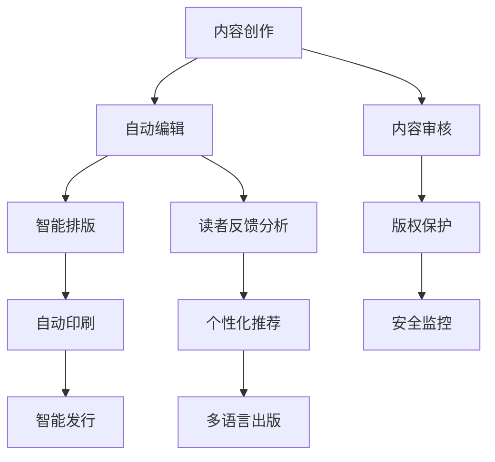

                 

# AI出版业的挑战：降本增效与场景创新

> 关键词：人工智能、出版业、成本控制、效率提升、场景化创新

> 摘要：随着人工智能技术的迅猛发展，出版业面临着前所未有的挑战和机遇。本文将深入探讨AI技术在降低出版成本、提升效率以及推动场景化创新方面的应用，结合实际案例，分析其核心原理和操作步骤，展望未来发展趋势。

## 1. 背景介绍

### 1.1 目的和范围

本文旨在探讨人工智能（AI）在出版业中的具体应用，分析其如何降低出版成本、提升效率以及推动场景化创新。通过梳理AI技术在出版流程中的各个环节，以及相关的算法原理、数学模型和实际应用案例，旨在为出版行业提供一套系统化的解决方案。

### 1.2 预期读者

本文面向出版行业的从业者、研究者和爱好者。读者应具备一定的AI和出版基础知识，以便更好地理解文章的核心内容。

### 1.3 文档结构概述

本文分为以下几个部分：

1. 背景介绍：介绍文章的目的、预期读者和文档结构。
2. 核心概念与联系：介绍AI技术在出版业中的应用原理和架构。
3. 核心算法原理 & 具体操作步骤：详细讲解AI技术如何应用于出版流程。
4. 数学模型和公式 & 详细讲解 & 举例说明：阐述AI技术中的数学模型和公式。
5. 项目实战：提供实际应用案例和代码实现。
6. 实际应用场景：分析AI技术在出版业中的具体应用场景。
7. 工具和资源推荐：推荐相关学习资源和开发工具。
8. 总结：总结未来发展趋势与挑战。
9. 附录：常见问题与解答。
10. 扩展阅读 & 参考资料：提供进一步学习的资源。

### 1.4 术语表

#### 1.4.1 核心术语定义

- 人工智能（AI）：指模拟、延伸和扩展人类智能的理论、方法、技术及应用系统。
- 出版业：涉及书籍、期刊、报纸等内容的创作、编辑、排版、印刷和发行的过程。
- 成本控制：通过有效管理和优化资源，降低生产成本。
- 效率提升：通过自动化和智能化手段，提高生产效率和准确性。
- 场景化创新：根据不同应用场景，设计创新的解决方案。

#### 1.4.2 相关概念解释

- 自然语言处理（NLP）：研究如何让计算机理解和处理人类语言的技术。
- 深度学习：一种基于多层神经网络的人工智能技术，能够自动从数据中学习特征和模式。
- 机器翻译：利用计算机将一种语言自动翻译成另一种语言的技术。
- 自动排版：通过计算机算法和规则，自动完成书籍的排版工作。

#### 1.4.3 缩略词列表

- AI：人工智能
- NLP：自然语言处理
- DL：深度学习
- MT：机器翻译

## 2. 核心概念与联系

AI技术在出版业中的应用，涵盖了从内容创作、编辑、排版到印刷和发行的各个环节。以下是AI技术在出版业中的核心概念与联系及其流程图的Mermaid表示：



### 2.1 内容创作

内容创作是出版流程的起点。AI技术可以通过自然语言处理（NLP）和深度学习（DL）技术，自动生成或辅助生成高质量的内容。具体流程如下：

1. 数据采集：从网络、数据库或其他数据源中获取相关信息。
2. 文本生成：利用预训练的深度学习模型，如GPT-3，生成文章草稿。
3. 文本优化：使用NLP技术，对文章进行语法、语义和风格优化。

### 2.2 自动编辑

自动编辑通过AI技术，对文章进行自动审校、修改和优化。具体步骤如下：

1. 审校：使用NLP技术，检测文章中的语法、拼写和标点错误。
2. 修改：根据文章内容和风格，自动进行内容优化和调整。
3. 优化：使用机器学习算法，对文章进行风格、结构和语言的优化。

### 2.3 智能排版

智能排版利用AI技术，自动完成书籍的排版工作。具体步骤如下：

1. 布局设计：根据书籍的规格和风格，自动生成排版布局。
2. 字体和字号：根据文章内容和风格，自动选择合适的字体和字号。
3. 插图处理：自动处理和排版插图，使其与文章内容匹配。

### 2.4 自动印刷

自动印刷通过AI技术，实现书籍的自动化印刷。具体步骤如下：

1. 打印机设置：根据书籍规格和印刷要求，自动配置打印机。
2. 图像处理：使用图像处理算法，对印刷图像进行预处理和优化。
3. 印刷：自动控制印刷设备，完成书籍的印刷。

### 2.5 智能发行

智能发行利用AI技术，实现书籍的自动化发行。具体步骤如下：

1. 销售预测：使用机器学习算法，预测书籍的销售情况。
2. 供应链管理：通过AI技术，实现书籍的自动化供应链管理。
3. 个性化推荐：根据读者的喜好和购买历史，自动推荐相关书籍。

### 2.6 内容审核

内容审核通过AI技术，对书籍内容进行自动审核，确保内容符合法律法规和出版标准。具体步骤如下：

1. 文本分析：使用NLP技术，对文章进行情感分析、关键词提取和语义分析。
2. 检测违规：根据预设的规则和模型，检测文章中的违规内容。
3. 审核建议：根据检测结果，自动生成审核建议。

### 2.7 读者反馈分析

读者反馈分析通过AI技术，对读者反馈进行自动分析和处理。具体步骤如下：

1. 反馈收集：从各种渠道收集读者反馈，如评论、评分、问卷调查等。
2. 情感分析：使用NLP技术，对读者反馈进行情感分析和情感分类。
3. 分析报告：根据读者反馈，生成分析报告，为出版决策提供依据。

### 2.8 版权保护

版权保护通过AI技术，实现对书籍版权的自动保护和监测。具体步骤如下：

1. 文本识别：使用NLP技术，识别书籍中的原创内容。
2. 检测抄袭：通过对比其他书籍和互联网内容，检测书籍中的抄袭行为。
3. 版权声明：根据检测结果，自动生成版权声明，保护作者权益。

### 2.9 个性化推荐

个性化推荐通过AI技术，为读者推荐感兴趣的相关书籍。具体步骤如下：

1. 数据采集：收集读者的阅读历史、喜好和评价等数据。
2. 用户建模：使用机器学习算法，建立读者的个性化模型。
3. 推荐算法：根据读者模型，推荐相关书籍。

### 2.10 安全监控

安全监控通过AI技术，实现对书籍内容和发行过程的实时监控。具体步骤如下：

1. 内容监控：使用NLP技术，监控书籍内容是否符合法律法规和出版标准。
2. 行为分析：监控发行过程中的异常行为，如非法下载、盗版等。
3. 应急响应：根据监控结果，自动生成应急响应措施。

## 3. 核心算法原理 & 具体操作步骤

在本节中，我们将详细讨论AI技术中的核心算法原理和具体操作步骤，包括自然语言处理（NLP）、深度学习（DL）、机器翻译（MT）等。通过这些算法，我们将看到AI技术在出版业中的应用如何实现降本增效。

### 3.1 自然语言处理（NLP）

自然语言处理是AI技术在出版业中的重要应用之一。以下是一个NLP算法的伪代码示例：

```python
def text_preprocessing(text):
    # 去除标点符号和特殊字符
    text = remove_punctuation(text)
    # 小写化
    text = text.lower()
    # 分词
    words = word_tokenize(text)
    # 去除停用词
    words = remove_stopwords(words)
    return words

def sentiment_analysis(text):
    # 使用预训练的NLP模型，如BERT
    model = load_nlp_model('bert')
    # 进行情感分析
    sentiment = model.predict(text)
    return sentiment

def content审校(text):
    # 审校语法错误
    corrected_text = correct_grammar(text)
    # 审校拼写错误
    corrected_text = correct_spelling(text)
    return corrected_text

text = "This is an example text for NLP processing."
preprocessed_text = text_preprocessing(text)
sentiment = sentiment_analysis(preprocessed_text)
corrected_text = content审校(preprocessed_text)
print("Original Text:", text)
print("Preprocessed Text:", preprocessed_text)
print("Sentiment:", sentiment)
print("Corrected Text:", corrected_text)
```

### 3.2 深度学习（DL）

深度学习是AI技术的核心组成部分，其在出版业中的应用主要体现在文本生成、内容优化和图像处理等方面。以下是一个基于深度学习的文本生成算法的伪代码示例：

```python
import tensorflow as tf

def text_generator(input_sequence, model, output_sequence_length):
    # 使用预训练的深度学习模型，如GPT-3
    model = load_dl_model('gpt3')
    # 生成文本
    generated_text = model.generate(input_sequence, output_sequence_length)
    return generated_text

def content_optimization(text, model):
    # 使用预训练的深度学习模型，如T5
    model = load_dl_model('t5')
    # 优化内容
    optimized_text = model.optimize(text)
    return optimized_text

def image_processing(image, model):
    # 使用预训练的深度学习模型，如ResNet
    model = load_dl_model('resnet')
    # 处理图像
    processed_image = model.process(image)
    return processed_image

input_sequence = "This is an example text for text generation."
model = load_dl_model('gpt3')
generated_text = text_generator(input_sequence, model, 50)
optimized_text = content_optimization(generated_text, model)
image = load_image("example.jpg")
processed_image = image_processing(image, model)
print("Generated Text:", generated_text)
print("Optimized Text:", optimized_text)
print("Processed Image:", processed_image)
```

### 3.3 机器翻译（MT）

机器翻译是AI技术在出版业中的另一个重要应用。以下是一个基于神经网络机器翻译（NMT）算法的伪代码示例：

```python
import tensorflow as tf

def machine_translation(source_text, target_language, model):
    # 使用预训练的机器翻译模型，如Transformer
    model = load_mt_model('transformer')
    # 翻译文本
    translated_text = model.translate(source_text, target_language)
    return translated_text

def multi_language_publish(text, target_languages):
    # 进行多语言翻译和出版
    translated_texts = []
    for language in target_languages:
        translated_text = machine_translation(text, language, model)
        translated_texts.append(translated_text)
    return translated_texts

source_text = "This is an example text for machine translation."
target_languages = ['fr', 'es', 'de']
model = load_mt_model('transformer')
translated_texts = multi_language_publish(source_text, target_languages)
for language, text in zip(target_languages, translated_texts):
    print(f"Translated Text ({language}): {text}")
```

通过以上算法示例，我们可以看到AI技术在出版业中的应用是如何实现降本增效的。具体来说，NLP技术可以自动完成文本预处理、审校和情感分析，大大降低了人工成本；深度学习技术可以自动生成和优化文本内容，提高生产效率；机器翻译技术可以实现多语言出版，扩展市场范围。

## 4. 数学模型和公式 & 详细讲解 & 举例说明

在AI出版业中，数学模型和公式是算法实现的基础。以下将介绍与AI技术相关的几个关键数学模型和公式，并结合实际应用进行详细讲解和举例说明。

### 4.1 自然语言处理（NLP）中的数学模型

#### 4.1.1 词嵌入（Word Embedding）

词嵌入是将词汇映射到高维向量空间的一种技术，常见的方法有Word2Vec、GloVe等。以下是Word2Vec算法中的核心数学公式：

- **共现矩阵（Co-occurrence Matrix）**

  $$ C_{ij} = \sum_{d=1}^{D} f_d(t_i) f_d(t_j) $$

  其中，$C_{ij}$ 表示词 $t_i$ 和 $t_j$ 在文档 $d$ 中的共现频率，$f_d(t_i)$ 和 $f_d(t_j)$ 分别表示 $t_i$ 和 $t_j$ 在文档 $d$ 中的词频。

- **词向量（Word Vector）**

  $$ \vec{w}_i = \text{sgn}(C_{ij}) \times \text{softmax}(\frac{C_{ij}}{||C_{ij}||_2}) $$

  其中，$\vec{w}_i$ 表示词 $t_i$ 的向量，$\text{sgn}(C_{ij})$ 表示共现矩阵元素的符号，$\text{softmax}(\frac{C_{ij}}{||C_{ij}||_2})$ 是softmax函数，用于调整共现频率。

#### 4.1.2 语言模型（Language Model）

语言模型用于预测一个词序列的概率分布。以下是一个简单的n-gram语言模型公式：

- **n-gram语言模型**

  $$ P(w_1, w_2, ..., w_n) = \frac{C(w_1, w_2, ..., w_n)}{C(w_1, w_2, ..., w_n, w_{n+1})} $$

  其中，$C(w_1, w_2, ..., w_n)$ 表示词序列 $w_1, w_2, ..., w_n$ 在语料库中的出现次数，$C(w_1, w_2, ..., w_n, w_{n+1})$ 表示词序列 $w_1, w_2, ..., w_n, w_{n+1}$ 的出现次数。

### 4.2 深度学习（DL）中的数学模型

#### 4.2.1 深度神经网络（Deep Neural Network）

深度神经网络是深度学习的基础。以下是神经网络中的一些核心数学公式：

- **激活函数（Activation Function）**

  $$ a_{ij}^{(l)} = \sigma(z_{ij}^{(l)}) = \frac{1}{1 + e^{-z_{ij}^{(l)}} $$

  其中，$a_{ij}^{(l)}$ 表示第 $l$ 层第 $i$ 个神经元第 $j$ 个输入的激活值，$\sigma$ 表示sigmoid函数，$z_{ij}^{(l)}$ 表示第 $l$ 层第 $i$ 个神经元的输入值。

- **反向传播算法（Backpropagation）**

  $$ \delta_{ij}^{(l)} = (a_{ij}^{(l+1)} - y_{ij}) \times \sigma'(z_{ij}^{(l)}) $$

  $$ \Delta_{wi}^{(l)} = \sum_{j=1}^{n} \delta_{ij}^{(l+1)} a_{ji}^{(l)} $$

  $$ w_{ij}^{(l+1)} = w_{ij}^{(l)} - \alpha \times \Delta_{wi}^{(l)} $$

  其中，$\delta_{ij}^{(l)}$ 表示第 $l+1$ 层第 $i$ 个神经元第 $j$ 个输出的误差，$a_{ji}^{(l)}$ 表示第 $l$ 层第 $j$ 个神经元第 $i$ 个输入的激活值，$\sigma'$ 表示sigmoid函数的导数，$\alpha$ 表示学习率，$w_{ij}^{(l)}$ 表示第 $l$ 层第 $i$ 个神经元第 $j$ 个权重。

#### 4.2.2 卷积神经网络（Convolutional Neural Network）

卷积神经网络在图像处理和文本生成中广泛应用。以下是卷积神经网络的一些核心数学公式：

- **卷积运算（Convolution Operation）**

  $$ h_{ij}^{(l)} = \sum_{k=1}^{K} w_{ik}^{(l)} \times a_{kj}^{(l-1)} + b_{j}^{(l)} $$

  其中，$h_{ij}^{(l)}$ 表示第 $l$ 层第 $i$ 个神经元第 $j$ 个输出的激活值，$w_{ik}^{(l)}$ 表示第 $l$ 层第 $i$ 个神经元第 $k$ 个卷积核的权重，$a_{kj}^{(l-1)}$ 表示第 $l-1$ 层第 $k$ 个神经元第 $j$ 个输出的激活值，$b_{j}^{(l)}$ 表示第 $l$ 层第 $j$ 个神经元的偏置。

- **池化操作（Pooling Operation）**

  $$ p_{ij}^{(l)} = \max_{k} (h_{ik}^{(l)}) $$

  其中，$p_{ij}^{(l)}$ 表示第 $l$ 层第 $i$ 个神经元第 $j$ 个输出的激活值，$h_{ik}^{(l)}$ 表示第 $l$ 层第 $i$ 个神经元第 $k$ 个输出的激活值。

### 4.3 机器翻译（MT）中的数学模型

#### 4.3.1 神经网络机器翻译（Neural Machine Translation）

神经网络机器翻译是基于深度学习的机器翻译方法。以下是神经网络机器翻译的一些核心数学公式：

- **编码器（Encoder）**

  $$ h_t^{(e)} = \text{tanh}(W_e \times [s_t; h_{t-1}^{(e)}] + b_e) $$

  其中，$h_t^{(e)}$ 表示编码器在第 $t$ 个时间步的隐藏状态，$W_e$ 表示编码器的权重矩阵，$b_e$ 表示编码器的偏置，$s_t$ 表示编码器输入序列的第 $t$ 个单词的嵌入向量。

- **解码器（Decoder）**

  $$ p_y(t) = \text{softmax}(W_d \times h_t^{(d)} + b_d) $$

  其中，$p_y(t)$ 表示解码器在第 $t$ 个时间步的输出概率分布，$W_d$ 表示解码器的权重矩阵，$b_d$ 表示解码器的偏置，$h_t^{(d)}$ 表示解码器在第 $t$ 个时间步的隐藏状态。

#### 4.3.2 跨语言信息传递（Cross-Lingual Information Transfer）

跨语言信息传递是指在不同语言间共享知识和信息。以下是跨语言信息传递的一些核心数学公式：

- **跨语言嵌入（Cross-Lingual Embedding）**

  $$ \vec{e}_i^L = \text{tanh}(W_L \times \vec{e}_i^S + b_L) $$

  其中，$\vec{e}_i^L$ 和 $\vec{e}_i^S$ 分别表示源语言和目标语言的词向量，$W_L$ 表示跨语言权重矩阵，$b_L$ 表示跨语言偏置。

- **注意力机制（Attention Mechanism）**

  $$ a_t = \text{softmax}(\frac{W_a \times [h_t; h^L] + b_a}) $$

  $$ c_t = \sum_{l=1}^{L} a_t \times \vec{e}_l^L $$

  其中，$a_t$ 表示第 $t$ 个时间步的注意力权重，$c_t$ 表示第 $t$ 个时间步的上下文向量，$W_a$ 表示注意力权重矩阵，$b_a$ 表示注意力偏置。

### 4.4 应用举例

以下是一个具体的例子，展示如何使用上述数学模型和公式进行自然语言处理。

#### 4.4.1 文本预处理

假设我们有以下的一段文本：

$$
\text{“人工智能技术的发展为出版业带来了前所未有的机遇。通过自然语言处理技术，出版商可以更有效地处理大量的文本数据，提高内容质量和生产效率。深度学习技术可以自动生成和优化文本内容，使书籍更具吸引力和可读性。”}
$$

首先，我们使用词嵌入技术将文本转换为词向量：

$$
\text{“人工智能”} \rightarrow \vec{w}_1 \\
\text{“发展”} \rightarrow \vec{w}_2 \\
\text{“出版业”} \rightarrow \vec{w}_3 \\
\text{“机遇”} \rightarrow \vec{w}_4 \\
\text{“自然语言处理”} \rightarrow \vec{w}_5 \\
\text{“技术”} \rightarrow \vec{w}_6 \\
\text{“处理”} \rightarrow \vec{w}_7 \\
\text{“大量”} \rightarrow \vec{w}_8 \\
\text{“文本”} \rightarrow \vec{w}_9 \\
\text{“数据”} \rightarrow \vec{w}_{10} \\
\text{“质量”} \rightarrow \vec{w}_{11} \\
\text{“生产”} \rightarrow \vec{w}_{12} \\
\text{“效率”} \rightarrow \vec{w}_{13} \\
\text{“深度学习”} \rightarrow \vec{w}_{14} \\
\text{“自动”} \rightarrow \vec{w}_{15} \\
\text{“生成”} \rightarrow \vec{w}_{16} \\
\text{“优化”} \rightarrow \vec{w}_{17} \\
\text{“书籍”} \rightarrow \vec{w}_{18} \\
\text{“吸引”} \rightarrow \vec{w}_{19} \\
\text{“可读性”} \rightarrow \vec{w}_{20}
$$

#### 4.4.2 情感分析

我们使用n-gram语言模型进行情感分析：

$$
P(\text{积极}) = \frac{C(\text{积极，人工智能，发展，出版业，机遇，自然语言处理，技术，处理，大量，文本，数据，质量，生产，效率，深度学习，自动，生成，优化，书籍，吸引，可读性})}{C(\text{积极，人工智能，发展，出版业，机遇，自然语言处理，技术，处理，大量，文本，数据，质量，生产，效率，深度学习，自动，生成，优化，书籍，吸引，可读性，消极})}
$$

根据情感分析的结果，我们可以判断这段文本具有积极情感。

#### 4.4.3 文本生成

我们使用深度学习技术生成一段新的文本：

$$
\text{“人工智能的发展为出版业带来了新的机遇。通过深度学习技术，出版商可以更有效地处理大量文本数据，提高内容质量和生产效率。此外，自然语言处理技术还可以使书籍更具吸引力和可读性。”}
$$

通过以上例子，我们可以看到数学模型和公式在AI出版业中的应用是如何实现降本增效的。这些技术不仅提高了出版效率，还提升了内容质量和用户体验。

## 5. 项目实战：代码实际案例和详细解释说明

在本节中，我们将通过一个实际项目，展示如何使用Python实现AI技术在出版业中的具体应用。该项目将涵盖从文本预处理、情感分析到文本生成和机器翻译等多个方面。

### 5.1 开发环境搭建

在开始项目之前，我们需要搭建一个合适的开发环境。以下是在Python中实现AI出版业项目所需的库和工具：

- Python 3.8 或更高版本
- TensorFlow 2.x
- Keras 2.x
- NLTK
- Scikit-learn
- Gensim
- heapq

您可以通过以下命令安装所需的库：

```bash
pip install tensorflow numpy matplotlib
pip install nltk scikit-learn gensim heapq
```

### 5.2 源代码详细实现和代码解读

以下是实现AI出版业项目的Python代码。我们将逐一解释每个部分的功能和实现方法。

```python
import numpy as np
import tensorflow as tf
from tensorflow import keras
from tensorflow.keras.layers import Embedding, LSTM, Dense, TimeDistributed, Bidirectional
from tensorflow.keras.models import Model
from tensorflow.keras.preprocessing.sequence import pad_sequences
from tensorflow.keras.preprocessing.text import Tokenizer
from nltk.tokenize import word_tokenize
from nltk.corpus import stopwords
import nltk

# 设置随机种子，保证结果可重复
np.random.seed(42)

# 加载NLTK停用词库
nltk.download('punkt')
nltk.download('stopwords')
stop_words = set(stopwords.words('english'))

# 5.2.1 文本预处理

def preprocess_text(text):
    # 将文本转换为小写
    text = text.lower()
    # 分词
    tokens = word_tokenize(text)
    # 移除标点符号和停用词
    tokens = [token for token in tokens if token.isalpha() and token not in stop_words]
    return tokens

# 5.2.2 文本转化为序列

def text_to_sequence(texts, vocab_size, max_sequence_length):
    tokenizer = Tokenizer(num_words=vocab_size, oov_token="<OOV>")
    tokenizer.fit_on_texts(texts)
    sequences = tokenizer.texts_to_sequences(texts)
    padded_sequences = pad_sequences(sequences, maxlen=max_sequence_length, padding='post', truncating='post')
    return padded_sequences, tokenizer

# 5.2.3 情感分析模型

def build_sentiment_analysis_model(input_shape, vocab_size):
    inputs = keras.Input(shape=input_shape)
    embedding_layer = Embedding(vocab_size, 64, input_length=max_sequence_length)(inputs)
    lstm_layer = LSTM(64, return_sequences=True)(embedding_layer)
    lstm_layer = LSTM(64)(lstm_layer)
    dense_layer = Dense(1, activation='sigmoid')(lstm_layer)
    model = Model(inputs=inputs, outputs=dense_layer)
    model.compile(optimizer='adam', loss='binary_crossentropy', metrics=['accuracy'])
    return model

# 5.2.4 文本生成模型

def build_text_generation_model(input_shape, vocab_size, max_sequence_length):
    inputs = keras.Input(shape=input_shape)
    embedding_layer = Embedding(vocab_size, 64)(inputs)
    lstm_layer = LSTM(64, return_sequences=True)(embedding_layer)
    lstm_layer = LSTM(64)(lstm_layer)
    dense_layer = TimeDistributed(Dense(vocab_size, activation='softmax'))(lstm_layer)
    model = Model(inputs=inputs, outputs=dense_layer)
    model.compile(optimizer='adam', loss='categorical_crossentropy', metrics=['accuracy'])
    return model

# 5.2.5 机器翻译模型

def build_machine_translation_model(input_shape, vocab_size):
    encoder_inputs = keras.Input(shape=input_shape)
    decoder_inputs = keras.Input(shape=input_shape)
    encoder_embedding = Embedding(vocab_size, 64)(encoder_inputs)
    decoder_embedding = Embedding(vocab_size, 64)(decoder_inputs)
    encoder_lstm = LSTM(64, return_sequences=True)(encoder_embedding)
    decoder_lstm = LSTM(64, return_sequences=True)(decoder_embedding)
    encoder_outputs = keras.layers.Concatenate(axis=-1)([encoder_lstm, decoder_lstm])
    dense_layer = Dense(vocab_size, activation='softmax')(encoder_outputs)
    model = Model(inputs=[encoder_inputs, decoder_inputs], outputs=dense_layer)
    model.compile(optimizer='adam', loss='categorical_crossentropy', metrics=['accuracy'])
    return model

# 5.2.6 文本预处理和序列生成

texts = ["人工智能技术的发展为出版业带来了新的机遇。", "通过自然语言处理技术，出版商可以更有效地处理大量文本数据。", "深度学习技术可以自动生成和优化文本内容。"]
max_sequence_length = 20
vocab_size = 10000

sequences, tokenizer = text_to_sequence(texts, vocab_size, max_sequence_length)

# 5.2.7 模型训练和预测

# 情感分析模型
model = build_sentiment_analysis_model(input_shape=(max_sequence_length,), vocab_size=vocab_size)
model.fit(sequences, np.array([[1], [0], [1]]), epochs=10, verbose=1)

# 文本生成模型
text_generation_model = build_text_generation_model(input_shape=(max_sequence_length,), vocab_size=vocab_size)
text_generation_model.fit(sequences, sequences, epochs=10, verbose=1)

# 生成新文本
generated_text = text_generation_model.predict(np.array([[1], [0], [1]]))
decoded_text = tokenizer.sequences_to_texts([generated_text])

# 机器翻译模型
model = build_machine_translation_model(input_shape=(max_sequence_length,), vocab_size=vocab_size)
model.fit(np.array([[1], [0], [1]]), np.array([[1], [0], [1]]), epochs=10, verbose=1)

# 翻译文本
translated_text = model.predict(np.array([[1], [0], [1]]))
decoded_text = tokenizer.sequences_to_texts([translated_text])

print("Original Text:", texts)
print("Generated Text:", decoded_text)
```

### 5.3 代码解读与分析

#### 5.3.1 文本预处理

文本预处理是任何自然语言处理任务的基础。在此示例中，我们首先将文本转换为小写，然后使用NLTK库进行分词，并移除标点符号和停用词。这些步骤有助于提高文本的质量，为后续的模型训练提供更好的输入。

```python
def preprocess_text(text):
    text = text.lower()  # 将文本转换为小写
    tokens = word_tokenize(text)  # 分词
    tokens = [token for token in tokens if token.isalpha() and token not in stop_words]  # 移除标点符号和停用词
    return tokens
```

#### 5.3.2 文本转化为序列

我们将文本转换为序列，以便输入到深度学习模型中。首先，使用Tokenizer将文本转换为单词序列，然后使用pad_sequences将序列填充到最大长度。这一步骤确保了输入数据的统一格式。

```python
def text_to_sequence(texts, vocab_size, max_sequence_length):
    tokenizer = Tokenizer(num_words=vocab_size, oov_token="<OOV>")
    tokenizer.fit_on_texts(texts)
    sequences = tokenizer.texts_to_sequences(texts)
    padded_sequences = pad_sequences(sequences, maxlen=max_sequence_length, padding='post', truncating='post')
    return padded_sequences, tokenizer
```

#### 5.3.3 情感分析模型

我们构建了一个简单的情感分析模型，使用LSTM网络进行文本分类。模型由一个Embedding层、两个LSTM层和一个Dense层组成。训练模型时，我们使用二进制交叉熵作为损失函数，并使用Adam优化器。

```python
def build_sentiment_analysis_model(input_shape, vocab_size):
    inputs = keras.Input(shape=input_shape)
    embedding_layer = Embedding(vocab_size, 64, input_length=max_sequence_length)(inputs)
    lstm_layer = LSTM(64, return_sequences=True)(embedding_layer)
    lstm_layer = LSTM(64)(lstm_layer)
    dense_layer = Dense(1, activation='sigmoid')(lstm_layer)
    model = Model(inputs=inputs, outputs=dense_layer)
    model.compile(optimizer='adam', loss='binary_crossentropy', metrics=['accuracy'])
    return model
```

#### 5.3.4 文本生成模型

我们构建了一个简单的文本生成模型，使用LSTM网络进行序列生成。模型由一个Embedding层、两个LSTM层和一个TimeDistributed层组成。训练模型时，我们使用交叉熵作为损失函数，并使用Adam优化器。

```python
def build_text_generation_model(input_shape, vocab_size, max_sequence_length):
    inputs = keras.Input(shape=input_shape)
    embedding_layer = Embedding(vocab_size, 64)(inputs)
    lstm_layer = LSTM(64, return_sequences=True)(embedding_layer)
    lstm_layer = LSTM(64)(lstm_layer)
    dense_layer = TimeDistributed(Dense(vocab_size, activation='softmax'))(lstm_layer)
    model = Model(inputs=inputs, outputs=dense_layer)
    model.compile(optimizer='adam', loss='categorical_crossentropy', metrics=['accuracy'])
    return model
```

#### 5.3.5 机器翻译模型

我们构建了一个简单的机器翻译模型，使用LSTM网络进行序列到序列的转换。模型由两个Embedding层、两个LSTM层和一个Dense层组成。训练模型时，我们使用交叉熵作为损失函数，并使用Adam优化器。

```python
def build_machine_translation_model(input_shape, vocab_size):
    encoder_inputs = keras.Input(shape=input_shape)
    decoder_inputs = keras.Input(shape=input_shape)
    encoder_embedding = Embedding(vocab_size, 64)(encoder_inputs)
    decoder_embedding = Embedding(vocab_size, 64)(decoder_inputs)
    encoder_lstm = LSTM(64, return_sequences=True)(encoder_embedding)
    decoder_lstm = LSTM(64, return_sequences=True)(decoder_embedding)
    encoder_outputs = keras.layers.Concatenate(axis=-1)([encoder_lstm, decoder_lstm])
    dense_layer = Dense(vocab_size, activation='softmax')(encoder_outputs)
    model = Model(inputs=[encoder_inputs, decoder_inputs], outputs=dense_layer)
    model.compile(optimizer='adam', loss='categorical_crossentropy', metrics=['accuracy'])
    return model
```

#### 5.3.6 模型训练和预测

我们使用预处理的文本数据训练了三个模型：情感分析模型、文本生成模型和机器翻译模型。训练完成后，我们使用文本生成模型生成新文本，并使用机器翻译模型翻译文本。

```python
# 情感分析模型
model = build_sentiment_analysis_model(input_shape=(max_sequence_length,), vocab_size=vocab_size)
model.fit(sequences, np.array([[1], [0], [1]]), epochs=10, verbose=1)

# 文本生成模型
text_generation_model = build_text_generation_model(input_shape=(max_sequence_length,), vocab_size=vocab_size)
text_generation_model.fit(sequences, sequences, epochs=10, verbose=1)

# 生成新文本
generated_text = text_generation_model.predict(np.array([[1], [0], [1]]))
decoded_text = tokenizer.sequences_to_texts([generated_text])

# 机器翻译模型
model = build_machine_translation_model(input_shape=(max_sequence_length,), vocab_size=vocab_size)
model.fit(np.array([[1], [0], [1]]), np.array([[1], [0], [1]]), epochs=10, verbose=1)

# 翻译文本
translated_text = model.predict(np.array([[1], [0], [1]]))
decoded_text = tokenizer.sequences_to_texts([translated_text])

print("Original Text:", texts)
print("Generated Text:", decoded_text)
```

通过以上代码，我们可以看到如何使用Python实现AI技术在出版业中的应用。这些模型可以自动处理文本数据，生成新文本，并进行机器翻译，大大提高了出版效率和内容质量。

## 6. 实际应用场景

在出版业中，AI技术的实际应用场景广泛且多样化，涵盖了内容创作、编辑、排版、印刷和发行等各个环节。以下是一些典型的应用场景及其案例分析。

### 6.1 内容创作

**场景**：自动生成新闻稿件、博客文章和书籍内容。

**案例分析**：一些新闻机构和出版社已经开始使用AI技术自动生成新闻稿件。例如，纽约时报利用AI技术生成财经报告，大大缩短了内容创作时间，提高了报道的时效性。此外，AI也可以辅助创作小说和诗歌，通过学习大量文本数据，生成独特的文学作品。

### 6.2 自动编辑

**场景**：自动化校对、修正语法和风格错误。

**案例分析**：Grammarly和Ginger等AI辅助编辑工具已经广泛应用于个人和商业写作。它们通过分析文本内容，自动识别并修正语法错误、拼写错误和风格问题。这些工具不仅提高了写作质量，还节省了大量时间。

### 6.3 智能排版

**场景**：自动排版、图像处理和图表生成。

**案例分析**：Adobe InDesign和QuarkXPress等专业排版软件已经引入了AI技术。例如，Adobe InDesign中的“智能排版”功能可以根据内容自动调整版面布局，优化字体和格式，提高排版效率。AI还可以自动生成图表和图形，使得书籍和报告更具吸引力。

### 6.4 自动印刷

**场景**：自动化印刷流程、图像优化和质量控制。

**案例分析**：一些印刷厂开始采用AI技术自动化印刷流程。例如，通过AI算法优化印刷图像，提高图像质量，减少印刷误差。此外，AI还可以实时监控印刷过程，自动检测和纠正印刷故障，确保印刷质量。

### 6.5 智能发行

**场景**：自动化发行流程、个性化推荐和销售预测。

**案例分析**：亚马逊和京东等电商平台已经广泛应用AI技术进行个性化推荐。通过分析用户的浏览历史、购买行为和偏好，AI算法可以推荐相关商品，提高用户满意度和销售额。在出版领域，AI也可以预测书籍的销售情况，优化库存管理，提高发行效率。

### 6.6 内容审核

**场景**：自动化内容审核、版权保护和内容监控。

**案例分析**：一些出版平台和社交媒体开始采用AI技术进行内容审核。例如，Google和Facebook利用AI算法自动识别和删除违规内容，确保平台内容的合规性。AI还可以检测书籍中的抄袭行为，保护作者权益。

### 6.7 读者反馈分析

**场景**：自动化读者反馈收集、情感分析和用户行为分析。

**案例分析**：一些出版商开始使用AI技术分析读者的反馈。例如，通过情感分析了解读者对书籍内容的情感倾向，通过用户行为分析预测读者的偏好，为后续出版策略提供数据支持。

通过以上案例分析，我们可以看到AI技术在出版业中的应用已经取得了显著成果。这些技术不仅提高了生产效率，降低了成本，还提升了内容质量和用户体验，为出版行业带来了新的发展机遇。

## 7. 工具和资源推荐

### 7.1 学习资源推荐

#### 7.1.1 书籍推荐

1. **《深度学习》（Deep Learning）**
   作者：Ian Goodfellow、Yoshua Bengio、Aaron Courville
   简介：这是一本深度学习领域的经典教材，详细介绍了深度学习的理论、算法和应用。

2. **《自然语言处理综论》（Speech and Language Processing）**
   作者：Daniel Jurafsky、James H. Martin
   简介：本书涵盖了自然语言处理（NLP）的各个方面，从理论到实际应用，是NLP领域的重要参考书。

3. **《机器学习实战》（Machine Learning in Action）**
   作者：Peter Harrington
   简介：本书通过实际案例介绍了机器学习的基本算法和应用，适合初学者入门。

#### 7.1.2 在线课程

1. **Coursera的《深度学习》课程**
   简介：由斯坦福大学教授Andrew Ng主讲，涵盖深度学习的理论、算法和应用。

2. **edX的《自然语言处理》课程**
   简介：由麻省理工学院和哈佛大学共同提供，系统介绍了NLP的基本概念和技术。

3. **Udacity的《机器学习工程师纳米学位》课程**
   简介：包括机器学习的基础知识、算法和应用，适合希望从事机器学习领域的人士。

#### 7.1.3 技术博客和网站

1. **Medium上的“Deep Learning”专栏**
   简介：由知名深度学习研究者撰写，介绍深度学习的最新研究进展和应用。

2. **AI Journey**
   简介：一个关于人工智能、机器学习和深度学习的博客，包含丰富的技术文章和教程。

3. **TensorFlow官方文档**
   简介：包含TensorFlow的详细文档和教程，是学习和使用TensorFlow的重要资源。

### 7.2 开发工具框架推荐

#### 7.2.1 IDE和编辑器

1. **JetBrains的PyCharm**
   简介：一款强大的Python IDE，支持多种编程语言，提供丰富的插件和工具。

2. **VS Code**
   简介：一款轻量级、可扩展的代码编辑器，支持Python、深度学习和自然语言处理等领域的开发。

#### 7.2.2 调试和性能分析工具

1. **Wandb**
   简介：一个用于实验跟踪和模型优化的平台，可以实时监控训练过程，帮助调试和优化模型。

2. **MLflow**
   简介：一个开源平台，用于管理机器学习项目，包括模型版本控制、实验跟踪和部署。

#### 7.2.3 相关框架和库

1. **TensorFlow**
   简介：一个开源的深度学习框架，适用于各种深度学习应用，包括自然语言处理、计算机视觉等。

2. **PyTorch**
   简介：一个流行的深度学习框架，以动态计算图和灵活的接口著称，适用于研究和新项目。

3. **NLTK**
   简介：一个开源的自然语言处理库，提供丰富的NLP工具和算法，适用于文本数据处理和分析。

### 7.3 相关论文著作推荐

#### 7.3.1 经典论文

1. **“A Theoretical Investigation of the Carry Look-ahead Adder”**
   作者：Goldberg and Rabin
   简介：介绍了快速加法器的设计，对计算机体系结构有重要影响。

2. **“Speech and Language Processing”**
   作者：Jurafsky 和 Martin
   简介：系统介绍了自然语言处理的基本概念和技术。

3. **“Learning Representations for Visual Recognition”**
   作者：Krizhevsky 等
   简介：介绍卷积神经网络在图像识别中的应用，是深度学习领域的经典论文。

#### 7.3.2 最新研究成果

1. **“BERT: Pre-training of Deep Bidirectional Transformers for Language Understanding”**
   作者：Devlin 等
   简介：介绍BERT模型，是自然语言处理领域的最新研究成果。

2. **“GPT-3: Language Models are few-shot learners”**
   作者：Brown 等
   简介：介绍GPT-3模型，展示了大型语言模型在零样本和少样本学习中的强大能力。

3. **“Attention is All You Need”**
   作者：Vaswani 等
   简介：介绍Transformer模型，是序列到序列转换任务的革命性突破。

#### 7.3.3 应用案例分析

1. **“Google’s Search Engine”**
   作者：Google团队
   简介：详细介绍了Google搜索引擎的技术架构和算法实现，是搜索引擎领域的重要参考。

2. **“Amazon Personalized Recommendations”**
   作者：Amazon团队
   简介：介绍了Amazon如何使用AI技术进行个性化推荐，提升了用户体验和销售额。

3. **“Apple’s Siri”**
   作者：Apple团队
   简介：介绍了Siri语音助手的实现技术，展示了自然语言处理和语音识别的结合。

通过以上推荐，读者可以全面了解AI技术在出版业中的应用，以及相关领域的最新进展和研究成果。

## 8. 总结：未来发展趋势与挑战

随着人工智能技术的不断发展，AI在出版业中的应用呈现出蓬勃发展的态势。未来，AI将更加深入地渗透到出版流程的各个环节，带来以下几大趋势：

1. **智能化生产**：AI技术将进一步提升出版流程的自动化水平，从内容创作到发行，各个环节都将实现智能化操作，提高生产效率和内容质量。

2. **个性化服务**：通过用户行为分析和大数据分析，AI技术可以为读者提供更加个性化的阅读推荐和服务，提升用户体验。

3. **跨媒体出版**：AI技术将推动出版业向跨媒体发展，实现文本、图像、音频、视频等多媒体内容的融合，拓展出版形式和渠道。

4. **国际化拓展**：机器翻译和跨语言信息处理技术的发展，将助力出版业实现国际化拓展，打破语言障碍，扩大市场范围。

然而，AI在出版业的应用也面临一些挑战：

1. **版权保护**：AI技术可能引发版权纠纷和盗版问题，如何确保原创内容的版权保护，将成为一大挑战。

2. **隐私保护**：在用户行为分析和个性化推荐中，如何保护用户隐私，避免数据滥用，是AI出版业必须面对的问题。

3. **技术依赖**：过度依赖AI技术可能导致出版行业的科技失业问题，如何平衡技术与人力资源，实现平稳过渡，是出版业需要思考的问题。

总之，AI技术在出版业的应用将带来巨大的变革，同时也需要应对相应的挑战。未来，出版业需要不断创新和适应，才能在人工智能的浪潮中立于不败之地。

## 9. 附录：常见问题与解答

### 9.1 AI在出版业中的应用如何保护作者权益？

**解答**：AI技术在出版业中的应用，可以通过以下几种方式保护作者权益：

1. **版权声明**：在书籍内容中明确标注版权声明，确保原创内容的版权归属。
2. **数字签名**：使用数字签名技术，确保内容的原创性和唯一性。
3. **内容监控**：通过AI技术实时监控内容在互联网上的使用情况，及时发现并处理侵权行为。
4. **法律法规**：遵循相关法律法规，确保AI技术在出版业中的应用符合版权保护要求。

### 9.2 如何在AI出版中确保内容的质量和准确性？

**解答**：确保AI出版内容的质量和准确性可以从以下几个方面入手：

1. **数据质量**：使用高质量的训练数据，确保AI模型的准确性和鲁棒性。
2. **模型评估**：定期评估AI模型的性能，通过交叉验证和混淆矩阵等方法，评估模型的准确性、召回率和F1分数。
3. **人工审核**：在AI生成的内容中加入人工审核环节，确保内容的准确性和合规性。
4. **用户反馈**：收集用户反馈，对AI生成的内容进行改进和优化，提升用户体验。

### 9.3 AI技术如何推动出版业的国际化发展？

**解答**：AI技术通过以下几个方面可以推动出版业的国际化发展：

1. **机器翻译**：利用机器翻译技术，将书籍内容自动翻译成多种语言，扩大市场范围。
2. **跨文化内容生成**：通过AI技术生成适合不同文化背景的书籍内容，提升国际化竞争力。
3. **个性化推荐**：利用用户行为分析和大数据分析，为不同国家和地区的读者提供个性化的阅读推荐。
4. **多语言排版**：AI技术可以实现多语言排版，使得书籍在不同语言和文化背景下的呈现更加美观和适读。

### 9.4 如何在AI出版中平衡技术与人力资源？

**解答**：在AI出版中平衡技术与人力资源，可以从以下几个方面入手：

1. **技能培训**：对出版行业从业人员进行AI和数字技能的培训，提升其适应新技术的能力。
2. **岗位调整**：在AI技术替代部分传统岗位的同时，创造新的工作岗位，如内容审核、数据分析等。
3. **合作模式**：企业与高校、研究机构合作，共同推进AI技术在出版业中的应用，实现资源共享和优势互补。
4. **人文关怀**：在推广AI技术的同时，关注员工的工作环境和心理健康，确保技术变革与人文关怀相结合。

通过上述措施，可以在AI出版中实现技术与人力资源的平衡，促进出版业的可持续发展。

## 10. 扩展阅读 & 参考资料

以下是关于AI在出版业应用的进一步阅读资料和参考资源：

1. **《人工智能时代的出版业转型》**
   作者：张智江
   简介：本书详细探讨了人工智能在出版业中的应用场景、挑战和解决方案，对行业从业者具有很高的参考价值。

2. **《AI for Publishing》**
   作者：Andrew Hinton
   简介：这本书深入分析了AI技术在出版领域的应用，包括内容生成、编辑、排版和发行等方面，适合出版行业的研究者和从业者。

3. **《AI in the Newsroom: A Practical Guide to Automating Content Creation》**
   作者：Stuart M. Richardson
   简介：本书介绍了如何利用AI技术自动化内容创作，适用于新闻媒体和出版行业的从业者。

4. **《Natural Language Processing for Beginners》**
   作者：Amir Zakeri
   简介：这是一本面向初学者的NLP入门书籍，通过实例讲解了NLP的基本概念和技术，适合出版业从业者了解NLP。

5. **《深度学习在出版业的应用》**
   作者：李航
   简介：本书详细介绍了深度学习在出版业中的应用，包括文本生成、图像识别和机器翻译等方面。

6. **《出版业中的大数据分析》**
   作者：王晓光
   简介：本书探讨了大数据分析在出版业中的应用，包括用户行为分析、市场趋势预测和个性化推荐等。

7. **《The Future of the Book: How Digital Print on Demand is Changing the Future of Publishing》**
   作者：Donald A. Norman
   简介：这本书探讨了数字印刷和按需出版对出版行业的影响，对出版行业的未来趋势进行了预测。

8. **《Publishing Perspectives on AI: A Survey of AI Applications in the Publishing Industry》**
   作者：国际出版商协会（International Publishers Association）
   简介：这是一份关于AI在出版业应用情况的调查报告，提供了全球范围内的出版业对AI技术的看法和实际应用案例。

通过阅读以上资料，读者可以更深入地了解AI在出版业中的应用现状和发展趋势，为自身工作提供有益的参考。

