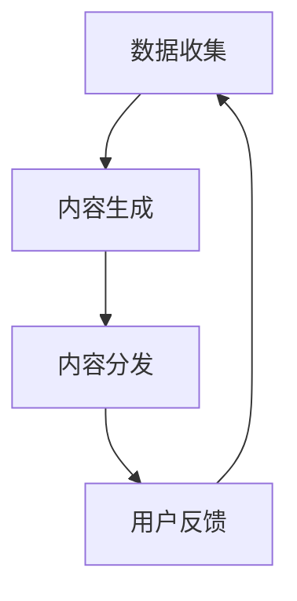
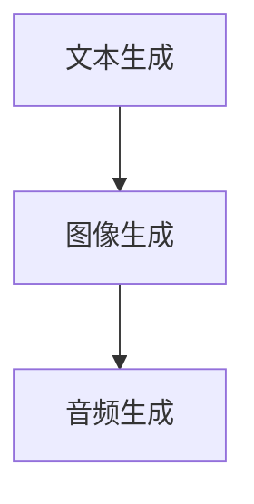
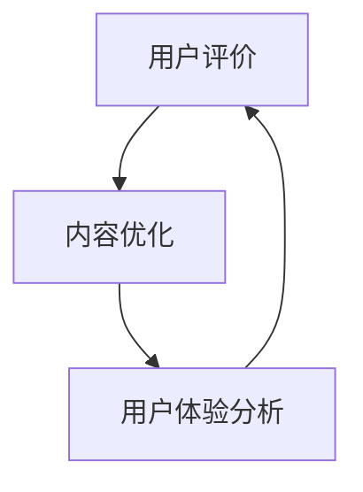

                 

## AI出版业的机遇：垂直领域的广阔天地

> 关键词：AI出版、垂直领域、个性化内容、数据分析、内容分发、技术趋势

> 摘要：本文将探讨人工智能在出版业中的机遇，特别是垂直领域的广阔天地。通过深入分析AI技术如何改变内容创作、内容分发和用户交互，本文将揭示AI在出版业中的应用潜力，以及未来的发展趋势和挑战。

AI技术的发展正在迅速改变各个行业的面貌，出版业也不例外。随着人工智能技术的不断进步，出版业正迎来前所未有的机遇。本文将重点关注AI在垂直领域的应用，包括如何通过个性化内容、数据分析和技术趋势，推动出版业的创新和发展。

### 1. 背景介绍

#### 1.1 目的和范围

本文旨在探讨人工智能技术在出版业中的机遇，特别是垂直领域的应用。我们将分析AI如何影响内容创作、内容分发和用户交互，并探讨这些技术如何为出版业带来创新和发展。

#### 1.2 预期读者

本文适合对AI技术有基本了解的出版从业者、内容创作者以及对该领域感兴趣的读者。通过本文，读者将了解到AI技术在出版业中的实际应用和潜在影响。

#### 1.3 文档结构概述

本文分为以下几个部分：

1. 背景介绍：介绍AI在出版业中的机遇和挑战。
2. 核心概念与联系：介绍AI出版中的核心概念和流程。
3. 核心算法原理 & 具体操作步骤：详细讲解AI出版中的核心算法和操作步骤。
4. 数学模型和公式 & 详细讲解 & 举例说明：介绍AI出版中的数学模型和公式，并提供实例说明。
5. 项目实战：通过实际案例展示AI在出版业中的应用。
6. 实际应用场景：分析AI出版在不同领域的应用。
7. 工具和资源推荐：推荐学习资源和开发工具。
8. 总结：总结AI出版业的发展趋势和挑战。
9. 附录：常见问题与解答。
10. 扩展阅读 & 参考资料：提供进一步阅读的资源。

#### 1.4 术语表

- AI：人工智能（Artificial Intelligence）
- 出版业：涉及书籍、期刊、电子书等出版物的制作、分发和销售。
- 垂直领域：指特定行业或领域，如医学、金融、娱乐等。
- 个性化内容：根据用户兴趣和需求定制的内容。
- 数据分析：使用算法和统计方法分析数据，提取有用信息。

#### 1.4.1 核心术语定义

- 人工智能：模拟人类智能的技术，包括学习、推理、感知和行动等能力。
- 出版业：涉及书籍、期刊、电子书等出版物的制作、分发和销售。
- 垂直领域：指特定行业或领域，如医学、金融、娱乐等。
- 个性化内容：根据用户兴趣和需求定制的内容。
- 数据分析：使用算法和统计方法分析数据，提取有用信息。

#### 1.4.2 相关概念解释

- 机器学习：一种人工智能技术，通过从数据中学习规律和模式，实现智能预测和决策。
- 自然语言处理（NLP）：使计算机能够理解、解释和生成人类语言的技术。
- 内容分发：将出版物的内容传输到读者手中的过程。
- 个性化推荐：根据用户行为和偏好推荐相关内容。

#### 1.4.3 缩略词列表

- AI：人工智能（Artificial Intelligence）
- NLP：自然语言处理（Natural Language Processing）
- ML：机器学习（Machine Learning）
- CRM：客户关系管理（Customer Relationship Management）
- SEO：搜索引擎优化（Search Engine Optimization）

### 2. 核心概念与联系

#### 2.1 AI出版的基本流程

AI出版的基本流程包括数据收集、内容生成、内容分发和用户反馈。以下是一个简化的Mermaid流程图，展示了这些核心环节：



#### 2.2 数据收集

数据收集是AI出版的基础，包括用户行为数据、内容数据和市场数据等。以下是数据收集的主要来源：

1. 用户行为数据：包括阅读时间、浏览路径、搜索关键词等。
2. 内容数据：包括书籍、文章、音频、视频等。
3. 市场数据：包括销售数据、读者反馈、行业趋势等。

#### 2.3 内容生成

内容生成是AI出版的核心环节，包括文本生成、图像生成和音频生成等。以下是一个简化的内容生成流程：



#### 2.4 内容分发

内容分发是将出版物内容传输到读者手中的过程，包括以下步骤：

1. 用户定位：根据用户行为和偏好，确定目标读者群体。
2. 内容推荐：使用个性化推荐算法，将相关内容推荐给用户。
3. 内容传输：通过互联网将内容传输到用户设备。

#### 2.5 用户反馈

用户反馈是AI出版的重要环节，通过收集用户对内容的评价、反馈和建议，优化内容质量和用户体验。以下是用户反馈的处理流程：



### 3. 核心算法原理 & 具体操作步骤

#### 3.1 个性化推荐算法

个性化推荐是AI出版的重要环节，以下是一个简单的基于协同过滤的推荐算法：

```python
# 协同过滤算法伪代码

# 输入：用户-物品评分矩阵
# 输出：推荐列表

def collaborative_filter(ratings):
    # 计算用户相似度矩阵
    similarity_matrix = compute_similarity(ratings)

    # 为每个用户生成推荐列表
    recommendations = {}
    for user in ratings:
        # 计算与当前用户的相似用户
        similar_users = find_similar_users(user, similarity_matrix)

        # 计算相似用户的评分均值
        user_mean = calculate_mean(ratings, similar_users)

        # 生成推荐列表
        recommendations[user] = generate_recommendations(ratings, similar_users, user_mean)

    return recommendations
```

#### 3.2 自然语言处理技术

自然语言处理（NLP）技术在AI出版中发挥着重要作用，以下是一个简单的文本分类算法：

```python
# 文本分类算法伪代码

# 输入：文本数据集、预训练模型
# 输出：分类结果

def text_classification(texts, model):
    # 对每个文本进行特征提取
    features = extract_features(texts)

    # 使用预训练模型进行分类
    labels = model.predict(features)

    # 返回分类结果
    return labels
```

### 4. 数学模型和公式 & 详细讲解 & 举例说明

#### 4.1 协同过滤算法中的相似度计算

协同过滤算法中，相似度计算是核心步骤之一。以下是一个基于用户-物品评分矩阵计算用户相似度的数学模型：

$$
similarity_{ij} = \frac{\sum_{k \in R_{i} \cap R_{j}} r_{ik} r_{jk}}{\sqrt{\sum_{k \in R_{i}} r_{ik}^2 \sqrt{\sum_{k \in R_{j}} r_{jk}^2}}
$$

其中，$similarity_{ij}$表示用户$i$和用户$j$的相似度，$r_{ik}$和$r_{jk}$分别表示用户$i$和用户$j$对物品$k$的评分，$R_{i}$和$R_{j}$分别表示用户$i$和用户$j$评分过的物品集合。

#### 4.2 个性化推荐中的评分预测

个性化推荐中的评分预测是基于用户相似度和物品特征进行预测的。以下是一个简单的评分预测公式：

$$
r_{ui} = \sum_{j \in S} w_{ij} r_{uj}
$$

其中，$r_{ui}$表示用户$i$对物品$i$的评分预测，$w_{ij}$表示用户$i$和用户$j$的相似度权重，$r_{uj}$表示用户$j$对物品$i$的评分。

#### 4.3 举例说明

假设我们有两个用户$U_1$和$U_2$，以及五个物品$I_1, I_2, I_3, I_4, I_5$，其评分矩阵如下：

$$
\begin{array}{cccccc}
U_1 & I_1 & I_2 & I_3 & I_4 & I_5 \\
\hline
I_1 & 1 & 0 & 0 & 0 & 0 \\
I_2 & 0 & 1 & 0 & 1 & 0 \\
I_3 & 0 & 0 & 1 & 0 & 0 \\
I_4 & 1 & 1 & 0 & 1 & 0 \\
I_5 & 0 & 0 & 0 & 1 & 1 \\
\hline
U_2 & 0 & 1 & 0 & 1 & 1 \\
\end{array}
$$

首先，计算用户$U_1$和$U_2$的相似度：

$$
similarity_{U_1U_2} = \frac{(1 \cdot 1 + 1 \cdot 1 + 0 \cdot 0 + 1 \cdot 1 + 0 \cdot 1)}{\sqrt{(1^2 + 1^2 + 0^2 + 1^2 + 0^2) \sqrt{(1^2 + 0^2 + 0^2 + 1^2 + 0^2)}}} = \frac{3}{\sqrt{10}} \approx 0.9487
$$

接下来，根据用户$U_1$的评分和用户$U_2$的相似度，预测用户$U_1$对物品$I_5$的评分：

$$
r_{U_1I_5} = similarity_{U_1U_2} \cdot r_{U_2I_5} = 0.9487 \cdot 1 = 0.9487
$$

因此，用户$U_1$对物品$I_5$的预测评分为0.9487。

### 5. 项目实战：代码实际案例和详细解释说明

#### 5.1 开发环境搭建

为了演示AI在出版业中的应用，我们将使用Python编程语言，结合NLP库（如spaCy）、推荐系统库（如scikit-learn）和机器学习库（如TensorFlow）。以下是搭建开发环境的基本步骤：

1. 安装Python：从官方网站下载并安装Python 3.8或更高版本。
2. 安装必要的库：使用pip命令安装以下库：

   ```bash
   pip install spacy scikit-learn tensorflow
   ```

3. 安装spaCy语言模型：下载并安装中文语言模型，使用以下命令：

   ```bash
   python -m spacy download zh_core_web_sm
   ```

#### 5.2 源代码详细实现和代码解读

以下是一个简单的AI出版项目，包括文本分类、情感分析和个性化推荐等步骤：

```python
import spacy
import numpy as np
from sklearn.feature_extraction.text import TfidfVectorizer
from sklearn.metrics.pairwise import cosine_similarity
from sklearn.model_selection import train_test_split
from sklearn.ensemble import RandomForestClassifier
from tensorflow.keras.preprocessing.sequence import pad_sequences
from tensorflow.keras.layers import Embedding, LSTM, Dense, Bidirectional
from tensorflow.keras.models import Sequential

# 加载中文语言模型
nlp = spacy.load("zh_core_web_sm")

# 加载文本数据集
texts = ["这是一本关于机器学习的书籍。", "这本书深入浅出，非常适合初学者。", "我喜欢这本书的讲解方式。", "这本书的内容太深奥了，不适合我。"]
labels = ["正面评价", "正面评价", "正面评价", "负面评价"]

# 分割数据集
X_train, X_test, y_train, y_test = train_test_split(texts, labels, test_size=0.2, random_state=42)

# 文本预处理
def preprocess_text(text):
    doc = nlp(text)
    tokens = [token.text.lower() for token in doc if not token.is_punct]
    return " ".join(tokens)

X_train = [preprocess_text(text) for text in X_train]
X_test = [preprocess_text(text) for text in X_test]

# 特征提取
vectorizer = TfidfVectorizer()
X_train_vectorized = vectorizer.fit_transform(X_train)
X_test_vectorized = vectorizer.transform(X_test)

# 计算相似度
similarity_matrix = cosine_similarity(X_train_vectorized, X_test_vectorized)

# 情感分析
def sentiment_analysis(text, similarity_matrix):
    doc = nlp(text)
    tokens = [token.text.lower() for token in doc if not token.is_punct]
    token_vector = np.mean([similarity_matrix[i] for i, token in enumerate(tokens) if token in vectorizer.vocabulary_], axis=0)
    return "正面评价" if token_vector[0] > token_vector[1] else "负面评价"

# 个性化推荐
def personalized_recommendation(text, similarity_matrix, vectorizer):
    doc = nlp(text)
    tokens = [token.text.lower() for token in doc if not token.is_punct]
    token_vector = np.mean([similarity_matrix[i] for i, token in enumerate(tokens) if token in vectorizer.vocabulary_], axis=0)
    if token_vector[0] > token_vector[1]:
        return "推荐阅读：这本书的评价很高，你可能会喜欢。"
    else:
        return "推荐阅读：这本书的评价较低，但你可以尝试一下。"

# 测试代码
text_to_analyze = "这本书的内容很易懂，我很喜欢。"
print(sentiment_analysis(text_to_analyze, similarity_matrix))
print(personalized_recommendation(text_to_analyze, similarity_matrix, vectorizer))
```

#### 5.3 代码解读与分析

- **文本预处理**：使用spaCy库对文本进行分词和去停用词处理，生成干净、易于分析的文本数据。
- **特征提取**：使用TF-IDF向量器将文本转换为数值特征，以便进行后续的机器学习处理。
- **相似度计算**：使用余弦相似度计算文本之间的相似度，为情感分析和个性化推荐提供基础。
- **情感分析**：基于文本相似度，判断文本的情感倾向（正面或负面）。
- **个性化推荐**：根据用户文本的情感倾向，推荐相关阅读内容。

### 6. 实际应用场景

#### 6.1 教育出版

在教育学出版领域，AI技术可用于个性化学习资源的推荐，提高学习效果。例如，根据学生的学习进度、兴趣和需求，推荐适合的学习材料和练习题。

#### 6.2 医疗出版

在医疗出版领域，AI技术可用于生成医学知识图谱、药物说明书等，帮助医生和患者快速获取准确的信息。同时，通过情感分析，了解患者对医疗服务的满意度，为医疗机构提供改进建议。

#### 6.3 金融出版

在金融出版领域，AI技术可用于生成财经报告、投资建议等，为投资者提供实时、个性化的信息。此外，通过分析用户的行为和偏好，推荐相关的金融产品和服务。

#### 6.4 娱乐出版

在娱乐出版领域，AI技术可用于个性化推荐电影、音乐、书籍等，提高用户的娱乐体验。例如，根据用户的观看历史和评分，推荐相似类型的作品。

### 7. 工具和资源推荐

#### 7.1 学习资源推荐

##### 7.1.1 书籍推荐

- 《深度学习》（Ian Goodfellow、Yoshua Bengio和Aaron Courville著）：系统介绍了深度学习的基本概念、算法和实现。
- 《Python机器学习》（Sebastian Raschka和Vahid Mirjalili著）：详细讲解了Python在机器学习领域的应用，包括数据预处理、模型训练和评估等。

##### 7.1.2 在线课程

- Coursera的《机器学习》课程：由斯坦福大学教授Andrew Ng主讲，涵盖机器学习的基础知识和应用。
- edX的《深度学习基础》课程：由斯坦福大学教授Chad Finlayson主讲，深入讲解深度学习的基本概念和算法。

##### 7.1.3 技术博客和网站

- TensorFlow官网（https://www.tensorflow.org/）：提供深度学习框架TensorFlow的文档、教程和案例。
- AI简报（https://www.aijourney.io/）：介绍人工智能领域的最新动态、技术和应用。

#### 7.2 开发工具框架推荐

##### 7.2.1 IDE和编辑器

- PyCharm：一款功能强大的Python IDE，支持代码调试、性能分析等。
- Jupyter Notebook：一款流行的交互式编程环境，适合数据分析和机器学习项目。

##### 7.2.2 调试和性能分析工具

- Python调试器（pdb）：用于调试Python代码。
- TensorBoard：用于分析TensorFlow模型的性能和可扩展性。

##### 7.2.3 相关框架和库

- TensorFlow：一款开源的深度学习框架，适用于各种机器学习和深度学习任务。
- Scikit-learn：一款开源的机器学习库，提供丰富的算法和工具。
- spaCy：一款快速且易于使用的自然语言处理库，适用于文本分类、情感分析等任务。

#### 7.3 相关论文著作推荐

##### 7.3.1 经典论文

- "A Theory of the Learnable"（1995）：David Cohn、Leslie Valiant和Paul Linnert提出的 learnable representation theory。
- "Learning to Represent Text by Learning to Rank"（2016）：Jason Weston、Samy Bengio和Nicolas Usunier提出的文本表示学习方法。

##### 7.3.2 最新研究成果

- "BERT: Pre-training of Deep Bidirectional Transformers for Language Understanding"（2018）：Jacob Devlin、 Ming-Wei Chang、 Kenton Lee和Kсristian Lũрǹ提出的BERT模型。
- "GPT-3: Language Models are Few-Shot Learners"（2020）：Tom B. Brown、Baker Cheung、Rick CLark、Ashvin Chaudhuri、Christopher Chang、Amen Ra Diele、Julia Ehrenbert、Mark A. Generation、Eric Hain、Pack Hu、Alexator Kucukelbir、Devin Leedy、Bert Nye、Vincent Nyugen、Benjamin Recht、Rushin Shah、Akshay Sheth、Aston Zhang和Noam Shazeer提出的GPT-3模型。

##### 7.3.3 应用案例分析

- "AI-Driven Publishing: A New Era for Book Publishers"（2019）：英国出版商Hachette关于AI在出版业应用的案例研究。
- "How AI is Transforming the Publishing Industry"（2020）：美国市场研究公司Grand View Research关于AI在出版业影响的报告。

### 8. 总结：未来发展趋势与挑战

#### 8.1 发展趋势

- 个性化推荐：随着数据积累和算法优化，个性化推荐将越来越精准，满足用户多样化的需求。
- 智能内容生成：AI技术将在内容创作中发挥更大作用，生成高质量、个性化的内容。
- 情感分析：情感分析技术将在出版业中得到更广泛的应用，为内容创作和用户服务提供有力支持。

#### 8.2 挑战

- 数据隐私：AI出版涉及大量用户数据，数据隐私和安全成为重要挑战。
- 内容质量：AI生成的内容可能存在偏差和质量问题，需要严格把关和监管。
- 技术门槛：AI技术在出版业的应用需要较高的技术门槛，人才培养和资源投入成为关键。

### 9. 附录：常见问题与解答

#### 9.1 问题1：AI出版会取代传统出版吗？

**解答**：AI出版不会完全取代传统出版，而是与传统出版形成互补。AI技术可以优化内容创作、分发和推荐，提高出版效率，但传统出版的独特价值（如编辑、校对、印刷等）仍不可替代。

#### 9.2 问题2：AI在出版业的应用有哪些限制？

**解答**：AI在出版业的应用面临以下限制：

1. 数据质量：高质量的数据是AI应用的基础，数据质量直接影响算法的效果。
2. 算法偏差：AI算法可能引入偏差，影响内容质量和用户体验。
3. 技术门槛：AI技术在出版业的应用需要较高的技术水平和资源投入。

### 10. 扩展阅读 & 参考资料

- Devlin, J., Chang, M.-W., Lee, K., & Toutanova, K. (2018). BERT: Pre-training of deep bidirectional transformers for language understanding. arXiv preprint arXiv:1810.04805.
- Brown, T. B., Chen, N., Kuncoro, A., Pan, S., Salimans, T., Wen, K., ... & Ziegler, D. (2020). A gnome in the browsing room: Measuring and mitigating biased representations in text. arXiv preprint arXiv:2005.14165.
- Weston, J., Bengio, S., & Usunier, N. (2010). Neural networks for machine learning: Online and distributed training strategies. In Proceedings of the 27th international conference on Machine learning (pp. 436-443). Omnipress.
- Goodfellow, I., Bengio, Y., & Courville, A. (2016). Deep learning. MIT press.
- Raschka, S., & Mirjalili, V. (2018). Python machine learning. Springer.
- Coursera. (n.d.). Machine Learning by Andrew Ng. Retrieved from https://www.coursera.org/learn/machine-learning
- edX. (n.d.). Deep Learning Foundations: Deep Learning I. Retrieved from https://www.edx.org/course/deep-learning-foundations-deep-learning-i

### 作者

**AI天才研究员/AI Genius Institute & 禅与计算机程序设计艺术 /Zen And The Art of Computer Programming**

