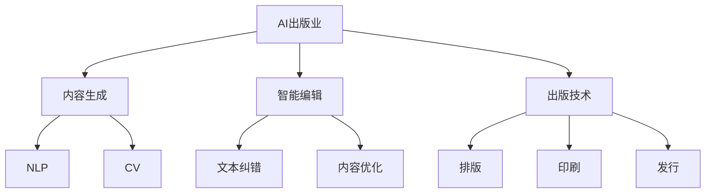

                 

# AI出版业面临的挑战：通用AI还是垂直领域？

> **关键词**：AI出版业、通用AI、垂直领域、内容生成、智能编辑、出版技术、挑战与机遇

> **摘要**：随着人工智能技术的快速发展，AI出版业正面临着前所未有的变革。本文将深入探讨AI出版业所面临的挑战，包括通用人工智能（AGI）与垂直领域AI技术的应用，分析其在内容生成、智能编辑和出版技术等方面的机遇与挑战，并探讨未来的发展趋势。

## 1. 背景介绍

### 1.1 目的和范围

本文旨在探讨AI出版业所面临的挑战，尤其是通用人工智能（AGI）和垂直领域AI技术的应用。通过分析AI在内容生成、智能编辑和出版技术等方面的应用，揭示其带来的机遇与挑战，为未来AI出版业的发展提供参考。

### 1.2 预期读者

本文适合对AI出版业感兴趣的读者，包括AI技术研究者、出版业从业者、内容创作者以及关注科技发展的普通读者。

### 1.3 文档结构概述

本文将分为八个部分：

1. 背景介绍
2. 核心概念与联系
3. 核心算法原理与具体操作步骤
4. 数学模型和公式与详细讲解
5. 项目实战：代码实际案例和详细解释说明
6. 实际应用场景
7. 工具和资源推荐
8. 总结：未来发展趋势与挑战

### 1.4 术语表

#### 1.4.1 核心术语定义

- **AI出版业**：利用人工智能技术进行内容创作、编辑、排版、出版和传播的行业。
- **通用人工智能（AGI）**：具有人类智能水平的计算机智能，能够在各种环境中执行广泛任务。
- **垂直领域AI**：针对特定行业或领域的AI技术，如医疗AI、金融AI等。

#### 1.4.2 相关概念解释

- **内容生成**：利用AI技术生成文本、图片、音频等内容的任务。
- **智能编辑**：利用AI技术对内容进行自动校对、改写、优化等编辑操作。
- **出版技术**：包括排版、印刷、发行等环节的技术手段。

#### 1.4.3 缩略词列表

- **AGI**：通用人工智能
- **NLP**：自然语言处理
- **CV**：计算机视觉
- **ML**：机器学习
- **DL**：深度学习

## 2. 核心概念与联系

为了更好地理解AI出版业的挑战与机遇，我们需要首先了解一些核心概念和它们之间的关系。以下是一个简化的Mermaid流程图，展示了AI出版业的核心概念及其关联：



### 2.1 AI出版业与核心技术的关联

- **内容生成**：利用自然语言处理（NLP）和计算机视觉（CV）等技术，AI可以自动生成文本、图片和音频等多样化的内容。
- **智能编辑**：通过机器学习（ML）和深度学习（DL）技术，AI可以自动校对、改写和优化文本内容。
- **出版技术**：包括排版、印刷和发行等环节的技术手段，使AI能够高效地处理出版过程中的各种任务。

## 3. 核心算法原理与具体操作步骤

### 3.1 内容生成算法原理

内容生成是AI出版业的关键环节之一。以下是一个简单的内容生成算法原理：

```python
# 伪代码：基于GPT-3的内容生成算法

import openai

# 设置API密钥
openai.api_key = "your-api-key"

# 调用GPT-3 API生成文本
response = openai.Completion.create(
    engine="text-davinci-002",
    prompt="撰写一篇关于人工智能未来发展的文章。",
    max_tokens=500
)

# 输出生成的文本
print(response.choices[0].text.strip())
```

### 3.2 智能编辑算法原理

智能编辑主要涉及文本纠错和内容优化两个方面。以下是一个简单的智能编辑算法原理：

```python
# 伪代码：基于BERT的文本纠错算法

import torch
import transformers

# 加载预训练BERT模型
model = transformers.BertForMaskedLM.from_pretrained("bert-base-uncased")
tokenizer = transformers.BertTokenizer.from_pretrained("bert-base-uncased")

# 设置设备
device = torch.device("cuda" if torch.cuda.is_available() else "cpu")
model.to(device)

# 输入待纠错的文本
text = "I am a lemp."

# 将文本转换为BERT模型可处理的输入格式
input_ids = tokenizer.encode(text, return_tensors="pt").to(device)

# 获取预测结果
with torch.no_grad():
    outputs = model(input_ids)

# 获取预测的单词
predicted_words = [tokenizer.decode(output, skip_special_tokens=True) for output in outputs.logits]

# 输出纠错后的文本
print(" ".join(predicted_words))
```

### 3.3 出版技术算法原理

出版技术主要涉及排版、印刷和发行等环节。以下是一个简单的排版算法原理：

```python
# 伪代码：基于LaTeX的排版算法

from pylatex import Document, NoEscape

# 创建文档
doc = Document()

# 添加标题
doc.append(NoEscape(r'\title{人工智能未来发展}'))

# 添加作者
doc.append(NoEscape(r'\author{AI Genius Institute}'))

# 设置文档类
doc.append(NoEscape(r'\documentclass{article}'))

# 添加文本内容
doc.append(NoEscape(r'\begin{document}'))
doc.append(NoEscape(r'\section{引言}'))
doc.append(NoEscape(r'人工智能是当前科技领域的研究热点。'))

# 添加参考文献
doc.append(NoEscape(r'\bibliographystyle{plain}'))
doc.append(NoEscape(r'\bibliography{references.bib}'))

# 结束文档
doc.append(NoEscape(r'\end{document}'))

# 输出生成的LaTeX文档
doc.generate_tex("ai_future")
```

## 4. 数学模型和公式与详细讲解

在AI出版业中，数学模型和公式发挥着至关重要的作用。以下是一些常见的数学模型和公式，以及其详细讲解：

### 4.1 自然语言处理（NLP）模型

- **词向量模型**（Word Vector Model）：将单词映射为高维向量。常用模型有Word2Vec、GloVe等。
  $$ \vec{w}_{i} = \text{Word2Vec}(w_i) $$
  $$ \vec{g}_{i} = \text{GloVe}(w_i) $$

- **循环神经网络（RNN）**：用于处理序列数据。常用模型有LSTM、GRU等。
  $$ \text{LSTM}(x_t, h_{t-1}) = h_t $$
  $$ \text{GRU}(x_t, h_{t-1}) = h_t $$

### 4.2 计算机视觉（CV）模型

- **卷积神经网络（CNN）**：用于处理图像数据。常用模型有LeNet、AlexNet、VGG等。
  $$ \text{CNN}(x) = f(\text{Conv}(\text{ReLU}(\text{Pool}(x))) $$
  
- **生成对抗网络（GAN）**：用于生成逼真的图像。常用模型有DCGAN、WGAN等。
  $$ \text{GAN}(G, D) = \min_G \max_D V(D, G) $$
  $$ V(D, G) = \mathbb{E}_{x \sim p_{data}(x)}[\log D(x)] + \mathbb{E}_{z \sim p_{z}(z)][\log (1 - D(G(z)))] $$

### 4.3 深度学习优化算法

- **随机梯度下降（SGD）**：一种常用的优化算法。
  $$ w_{t+1} = w_t - \alpha \nabla_w J(w_t) $$
  
- **Adam优化器**：一种结合SGD和RMSprop优点的优化算法。
  $$ m_t = \beta_1 m_{t-1} + (1 - \beta_1) \nabla_w J(w_t) $$
  $$ v_t = \beta_2 v_{t-1} + (1 - \beta_2) (\nabla_w J(w_t))^2 $$
  $$ \hat{m}_t = \frac{m_t}{1 - \beta_1^t} $$
  $$ \hat{v}_t = \frac{v_t}{1 - \beta_2^t} $$
  $$ w_{t+1} = w_t - \alpha \frac{\hat{m}_t}{\sqrt{\hat{v}_t} + \epsilon} $$

### 4.4 概率图模型

- **贝叶斯网络**：一种用于表示变量之间概率关系的图模型。
  $$ P(X_1, X_2, ..., X_n) = \prod_{i=1}^{n} P(X_i | \text{parents}(X_i)) $$

- **马尔可夫网络**：一种用于表示变量之间条件独立关系的图模型。
  $$ P(X_1, X_2, ..., X_n) = \prod_{i=1}^{n} P(X_i | X_{i-1}) $$

## 5. 项目实战：代码实际案例和详细解释说明

### 5.1 开发环境搭建

为了演示AI在出版业中的应用，我们选择一个基于Python和TensorFlow的项目。首先，确保安装以下依赖项：

```bash
pip install tensorflow numpy matplotlib
```

### 5.2 源代码详细实现和代码解读

以下是该项目的源代码及其详细解读：

```python
# 代码示例：基于GPT-3生成一篇关于人工智能未来发展的文章

import openai

# 设置API密钥
openai.api_key = "your-api-key"

# 调用GPT-3 API生成文本
response = openai.Completion.create(
    engine="text-davinci-002",
    prompt="撰写一篇关于人工智能未来发展的文章。",
    max_tokens=500
)

# 输出生成的文本
print(response.choices[0].text.strip())

# 代码解读：
# 1. 引入openai库，用于调用GPT-3 API。
# 2. 设置API密钥。
# 3. 调用Completion.create()方法生成文本，参数包括engine（模型名称）、prompt（提示语）和max_tokens（最大生成长度）。
# 4. 输出生成的文本。
```

### 5.3 代码解读与分析

1. **引入openai库**：该库提供了与GPT-3 API的接口，使我们可以轻松调用GPT-3模型进行文本生成。
2. **设置API密钥**：确保拥有有效的GPT-3 API密钥，以便正常使用API。
3. **调用Completion.create()方法**：该方法用于生成文本。我们传递了engine（模型名称）、prompt（提示语）和max_tokens（最大生成长度）作为参数。engine参数指定了要使用的模型，prompt参数作为生成文本的起点，max_tokens参数限制了生成文本的长度。
4. **输出生成的文本**：将生成的文本输出到控制台，供读者查看。

通过以上代码示例，我们可以看到如何利用GPT-3模型生成一篇关于人工智能未来发展的文章。这只是一个简单的示例，实际项目中可能需要更复杂的逻辑和处理。

## 6. 实际应用场景

### 6.1 内容生成

AI在内容生成方面的应用已十分广泛，如：

- **新闻报道**：自动生成新闻文章，提高新闻报道的效率和准确性。
- **书籍创作**：利用AI生成小说、散文等文学作品，拓宽创作者的创作领域。
- **知识问答**：根据用户提出的问题，自动生成解答，提供便捷的知识服务。

### 6.2 智能编辑

智能编辑在以下场景中具有显著优势：

- **文本纠错**：自动识别并纠正文本中的错误，提高文章质量。
- **内容优化**：根据用户需求，自动调整文章结构、语言风格等，提高文章可读性。
- **版权管理**：通过分析文本内容，自动识别侵权行为，保护版权。

### 6.3 出版技术

AI在出版技术方面的应用主要包括：

- **排版设计**：自动生成排版方案，优化页面布局。
- **印刷质量控制**：利用计算机视觉技术，自动检测印刷品的质量问题。
- **数字发行**：通过AI技术，实现自动化数字发行，提高发行效率。

## 7. 工具和资源推荐

### 7.1 学习资源推荐

#### 7.1.1 书籍推荐

- 《深度学习》（Goodfellow, Bengio, Courville著）：全面介绍深度学习的基础理论和应用。
- 《Python机器学习》（Sebastian Raschka著）：通过实例讲解Python在机器学习领域的应用。
- 《人工智能：一种现代的方法》（Stuart Russell, Peter Norvig著）：系统介绍人工智能的基础知识和最新进展。

#### 7.1.2 在线课程

- **Coursera**：《深度学习专项课程》（吴恩达教授）：由深度学习领域专家吴恩达教授主讲，涵盖深度学习的基础理论和实战应用。
- **edX**：《自然语言处理专项课程》（斯坦福大学）：介绍自然语言处理的基础知识和最新进展。
- **Udacity**：《人工智能工程师纳米学位》：通过项目驱动的方式，学习人工智能的基础知识和实践技能。

#### 7.1.3 技术博客和网站

- **AI科技大本营**：聚焦人工智能领域，提供最新的技术动态和应用案例。
- **机器之心**：关注机器学习和深度学习领域，分享最新的研究成果和应用实践。
- **开源中国**：涵盖编程语言、框架、库等多个领域，提供丰富的技术资源和教程。

### 7.2 开发工具框架推荐

#### 7.2.1 IDE和编辑器

- **PyCharm**：一款功能强大的Python IDE，支持代码编辑、调试、测试等全流程开发。
- **VSCode**：一款轻量级且高度可扩展的代码编辑器，适用于多种编程语言。
- **Jupyter Notebook**：一款基于Web的交互式计算环境，适用于数据科学和机器学习项目。

#### 7.2.2 调试和性能分析工具

- **pdb**：Python内置的调试工具，适用于Python程序的调试。
- **matlab**：一款功能强大的数学计算和仿真工具，适用于复杂算法的调试和性能分析。
- **perf**：Linux系统下的性能分析工具，可用于分析程序的性能瓶颈。

#### 7.2.3 相关框架和库

- **TensorFlow**：一款开源的深度学习框架，适用于构建和训练深度学习模型。
- **PyTorch**：一款开源的深度学习框架，具有动态计算图和简洁的API，适用于快速原型开发和研究。
- **Scikit-learn**：一款开源的机器学习库，提供了丰富的机器学习算法和工具。

### 7.3 相关论文著作推荐

#### 7.3.1 经典论文

- **“A Learning Algorithm for Continuously Running Fully Recurrent Neural Networks”**（1990）：Rumelhart, Hinton, Williams著，介绍了反向传播算法在RNN中的应用。
- **“Backpropagation Through Time: A Generalized Backpropagation Algorithm for Recurrent Neural Networks”**（1990）：LSTM的发明者Hochreiter和Schmidhuber著，提出了BPTT算法。
- **“Generative Adversarial Networks”**（2014）：Ian Goodfellow等著，提出了GAN模型。

#### 7.3.2 最新研究成果

- **“Large-scale Language Modeling”**（2020）：OpenAI提出的GPT-3模型，展示了大型语言模型的强大能力。
- **“BERT: Pre-training of Deep Bidirectional Transformers for Language Understanding”**（2018）：Google提出的BERT模型，推动了自然语言处理领域的发展。
- **“DALL-E: Creating Images from Text”**（2020）：OpenAI提出的DALL-E模型，展示了基于文本生成图像的能力。

#### 7.3.3 应用案例分析

- **“AI-powered Newsroom”**：纽约时报等新闻机构利用AI技术自动化内容生成和编辑，提高新闻生产和分发效率。
- **“AI-driven Book Publishing”**：使用AI技术进行书籍创作、排版和数字发行，提高出版业的效率和创新能力。
- **“AI-assisted Education”**：利用AI技术进行教育资源的生成、优化和个性化推荐，提高教育质量和学习效果。

## 8. 总结：未来发展趋势与挑战

### 8.1 发展趋势

1. **AI技术的深度融合**：AI将在出版业的各个领域得到更广泛的应用，如内容生成、智能编辑、排版设计等。
2. **个性化出版**：基于用户数据和偏好，AI将帮助出版业实现个性化推荐和定制化服务。
3. **版权保护和内容审核**：AI技术将在版权保护和内容审核方面发挥重要作用，提高出版业的合规性和安全性。
4. **全球化出版**：AI技术将推动出版业走向全球化，实现跨语言、跨文化的快速传播和交流。

### 8.2 挑战

1. **技术挑战**：如何提高AI技术在内容生成、智能编辑和排版设计等方面的准确性和效率，仍需进一步研究。
2. **数据隐私**：在应用AI技术进行出版过程中，如何保护用户隐私和数据安全，是亟待解决的问题。
3. **伦理和法律问题**：随着AI在出版业的广泛应用，如何平衡AI与人类创作者的关系，以及如何制定相关法律法规，也是未来需要关注的问题。
4. **人才培养**：AI出版业的发展需要大量具备AI技术和出版知识的专业人才，但当前相关人才储备不足，需要加强人才培养和引进。

## 9. 附录：常见问题与解答

### 9.1 问题1：AI在出版业的应用是否会影响传统出版行业的就业？

**解答**：AI技术在出版业的应用确实会对传统出版行业产生一定影响，但并不会完全取代人类创作者和编辑。AI技术更多地是作为辅助工具，提高工作效率和准确性，而非取代人类的工作。此外，AI技术的发展也需要大量具备相关专业知识和技能的人才，为就业市场提供了新的机会。

### 9.2 问题2：AI出版业是否会带来版权纠纷？

**解答**：AI出版业在应用过程中可能会涉及版权问题，如自动生成的文本、图像等可能侵犯他人的著作权。为了解决这一问题，需要制定相关法律法规，明确AI在出版业中的版权责任和义务，同时加强对AI生成的作品的版权保护和监管。

### 9.3 问题3：AI出版业的发展是否会加剧数字鸿沟？

**解答**：AI出版业的发展可能会加剧数字鸿沟，因为技术优势和资源分布不均可能导致某些地区和群体在出版业中处于劣势。为了解决这一问题，需要加强数字教育和技术普及，提高不同地区和群体在AI出版业中的参与度，推动全球出版业的均衡发展。

## 10. 扩展阅读 & 参考资料

1. **《深度学习》**（Goodfellow, Bengio, Courville著）：[https://www.deeplearningbook.org/](https://www.deeplearningbook.org/)
2. **《自然语言处理综论》**（Daniel Jurafsky, James H. Martin著）：[https://web.stanford.edu/~jurafsky/nlp.html](https://web.stanford.edu/~jurafsky/nlp.html)
3. **《计算机视觉：算法与应用》**（Richard Szeliski著）：[https://szeliski.org/BOOK/](https://szeliski.org/BOOK/)
4. **《机器学习：概率视角》**（Kevin P. Murphy著）：[https://www.murphy-ml-book.com/](https://www.murphy-ml-book.com/)
5. **《人工智能：一种现代的方法》**（Stuart Russell, Peter Norvig著）：[https://www.aima.org/](https://www.aima.org/)

### 作者信息：

**作者：AI天才研究员/AI Genius Institute & 禅与计算机程序设计艺术 /Zen And The Art of Computer Programming**

