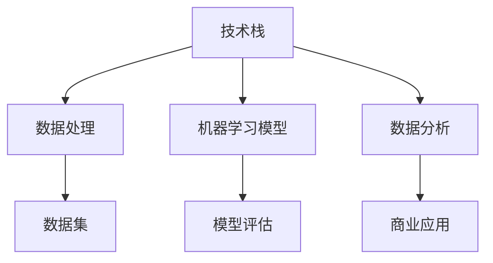

                 

# AI创业中的技术与数据

> **关键词：** AI创业，技术栈，数据处理，机器学习，数据分析，商业应用

> **摘要：** 本文将深入探讨AI创业中的关键技术与数据管理，分析从技术选型、数据整合到模型训练与优化的全过程。通过一系列实例，我们将展示如何将先进技术转化为商业成功，同时预测未来发展趋势和面临的挑战。

## 1. 背景介绍

### 1.1 目的和范围

本文旨在为AI创业者提供一条清晰的技术路径，从项目的起点到成功上市的全过程。我们将探讨以下几个核心领域：

- **技术栈构建：** 如何选择和整合适合AI项目的技术栈。
- **数据处理：** 数据获取、清洗、存储和管理的方法。
- **机器学习模型：** 模型选择、训练、评估与优化的流程。
- **商业应用：** 如何将AI技术转化为商业价值，实现盈利。

### 1.2 预期读者

- **AI创业者：** 正在寻找如何将AI技术应用于商业问题的创业者。
- **技术团队：** 担任技术负责人或核心开发人员的专业人士。
- **数据科学家：** 涉及数据分析和机器学习项目的技术专家。

### 1.3 文档结构概述

本文将按照以下结构展开：

1. **背景介绍**：定义目的、范围和预期读者。
2. **核心概念与联系**：介绍AI创业中的关键概念，并使用Mermaid流程图展示。
3. **核心算法原理 & 具体操作步骤**：详细阐述算法原理和操作步骤。
4. **数学模型和公式 & 详细讲解 & 举例说明**：介绍相关数学模型和实际应用。
5. **项目实战：代码实际案例和详细解释说明**：通过实际案例展示技术实现。
6. **实际应用场景**：分析AI技术在各行业中的应用。
7. **工具和资源推荐**：推荐学习资源、开发工具和框架。
8. **总结：未来发展趋势与挑战**：预测未来发展并探讨面临的挑战。
9. **附录：常见问题与解答**：提供常见问题的解答。
10. **扩展阅读 & 参考资料**：推荐进一步阅读的资料。

### 1.4 术语表

#### 1.4.1 核心术语定义

- **AI创业**：指利用人工智能技术开展创新性商业活动的过程。
- **技术栈**：项目中使用的所有技术的集合。
- **数据处理**：包括数据清洗、转换、聚合等过程。
- **机器学习模型**：通过训练数据学习并预测目标变量。
- **数据分析**：对大量数据进行统计分析，提取有价值的信息。

#### 1.4.2 相关概念解释

- **数据集**：用于训练和测试模型的集合。
- **模型评估**：评估模型性能的过程。
- **API**：应用程序编程接口，用于不同系统间的数据交互。

#### 1.4.3 缩略词列表

- **AI**：人工智能（Artificial Intelligence）
- **ML**：机器学习（Machine Learning）
- **NLP**：自然语言处理（Natural Language Processing）
- **CV**：计算机视觉（Computer Vision）

## 2. 核心概念与联系

在AI创业中，理解核心技术概念和它们之间的关系至关重要。以下是一个简化的Mermaid流程图，展示了AI创业中的关键概念及其相互关系。



### 2.1 技术栈

技术栈是AI项目的基石，它包括编程语言、框架、库、工具和平台。一个完善的技术栈能够提高开发效率，降低维护成本，并确保项目稳定性。常见的AI技术栈包括：

- **编程语言**：Python、Java、C++等。
- **框架**：TensorFlow、PyTorch、Keras等。
- **库**：NumPy、Pandas、Scikit-learn等。
- **工具**：Jupyter Notebook、Docker、Kubernetes等。
- **平台**：Google Cloud、AWS、Azure等。

### 2.2 数据处理

数据处理是AI项目的核心，它包括数据采集、清洗、转换和存储等步骤。有效的数据处理能够提高模型性能和准确性。以下是数据处理的关键步骤：

1. **数据采集**：从各种来源收集数据，如数据库、API、传感器等。
2. **数据清洗**：处理缺失值、异常值和重复值，确保数据质量。
3. **数据转换**：将数据转换为适合模型训练的格式，如归一化、标准化等。
4. **数据存储**：选择合适的数据存储方案，如关系型数据库、NoSQL数据库、分布式存储等。

### 2.3 机器学习模型

机器学习模型是AI创业的核心，它包括模型选择、训练、评估和优化等步骤。以下是机器学习模型的关键步骤：

1. **模型选择**：根据问题类型选择合适的模型，如线性回归、决策树、神经网络等。
2. **模型训练**：使用训练数据集训练模型，学习数据中的规律。
3. **模型评估**：使用测试数据集评估模型性能，如准确率、召回率、F1分数等。
4. **模型优化**：调整模型参数，提高模型性能。

### 2.4 数据分析

数据分析是AI项目的延伸，它包括数据探索、可视化、预测和分析等步骤。有效的数据分析能够提供业务洞察，指导决策。以下是数据分析的关键步骤：

1. **数据探索**：分析数据分布、相关性、异常值等。
2. **数据可视化**：使用图表、地图等可视化工具展示数据。
3. **预测分析**：使用机器学习模型进行预测分析，如趋势预测、需求预测等。
4. **决策分析**：基于数据分析结果做出业务决策。

## 3. 核心算法原理 & 具体操作步骤

### 3.1 算法原理

在本节中，我们将详细介绍一种常用的机器学习算法——支持向量机（SVM）的原理和具体操作步骤。

#### 3.1.1 算法原理

支持向量机（SVM）是一种二分类模型，它的基本思想是找到数据空间中一个最佳的超平面，使得两类数据点在超平面两侧的间隔最大。SVM通过最大化间隔来提高模型的泛化能力。

#### 3.1.2 操作步骤

1. **数据预处理**：对数据进行归一化处理，确保数据在相同的尺度上。
2. **模型选择**：选择线性SVM模型。
3. **模型训练**：使用训练数据集训练模型，计算支持向量。
4. **模型评估**：使用测试数据集评估模型性能。
5. **模型优化**：调整模型参数，如惩罚系数C，提高模型性能。

### 3.2 伪代码

```python
# 数据预处理
X_train, X_test, y_train, y_test = train_test_split(X, y, test_size=0.2, random_state=42)
X_train = normalize(X_train)

# 模型选择
model = LinearSVC()

# 模型训练
model.fit(X_train, y_train)

# 模型评估
accuracy = model.score(X_test, y_test)

# 模型优化
model = LinearSVC(C=10.0)
model.fit(X_train, y_train)
```

## 4. 数学模型和公式 & 详细讲解 & 举例说明

### 4.1 数学模型

在本节中，我们将介绍SVM的核心数学模型，包括优化目标和决策函数。

#### 4.1.1 优化目标

SVM的优化目标是最小化间隔，即：

$$
\min_{\mathbf{w}, b} \frac{1}{2} ||\mathbf{w}||^2 + C \sum_{i=1}^{n} \xi_i
$$

其中，$\mathbf{w}$是超平面参数，$b$是偏置项，$C$是惩罚系数，$\xi_i$是松弛变量。

#### 4.1.2 决策函数

SVM的决策函数为：

$$
y_i (\mathbf{w} \cdot \mathbf{x}_i + b) \geq 1
$$

其中，$\mathbf{x}_i$是数据点，$\cdot$表示内积。

### 4.2 详细讲解 & 举例说明

#### 4.2.1 优化目标详细讲解

优化目标中的第一项$\frac{1}{2} ||\mathbf{w}||^2$是超平面参数的平方，表示超平面的间隔。第二项$C \sum_{i=1}^{n} \xi_i$是惩罚项，用于处理不可分数据，其中$\xi_i$是松弛变量，$C$是惩罚系数。

#### 4.2.2 决策函数详细讲解

决策函数中的$\mathbf{w} \cdot \mathbf{x}_i + b$表示数据点与超平面的距离，$y_i$是数据点的标签。当距离大于1时，数据点被正确分类。

#### 4.2.3 举例说明

假设我们有一个二分类问题，数据集包含100个数据点，每个数据点由2个特征组成。我们使用线性SVM模型进行分类。

1. **数据预处理**：对数据进行归一化处理，使得特征值在相同的尺度上。
2. **模型训练**：使用训练数据集训练线性SVM模型。
3. **模型评估**：使用测试数据集评估模型性能。
4. **模型优化**：调整模型参数，如惩罚系数C，提高模型性能。

## 5. 项目实战：代码实际案例和详细解释说明

### 5.1 开发环境搭建

为了方便代码实现和测试，我们需要搭建一个适合AI项目开发的环境。以下是搭建步骤：

1. **安装Python**：确保安装最新版本的Python。
2. **安装库**：使用pip安装常用的库，如scikit-learn、numpy、matplotlib等。
3. **配置虚拟环境**：使用virtualenv或conda创建一个独立的Python环境。

### 5.2 源代码详细实现和代码解读

在本节中，我们将使用scikit-learn库实现SVM模型，并对关键代码进行解读。

#### 5.2.1 代码实现

```python
# 导入库
import numpy as np
from sklearn import datasets
from sklearn.model_selection import train_test_split
from sklearn.preprocessing import StandardScaler
from sklearn.svm import LinearSVC
from sklearn.metrics import accuracy_score

# 加载数据集
iris = datasets.load_iris()
X = iris.data
y = iris.target

# 数据预处理
X_train, X_test, y_train, y_test = train_test_split(X, y, test_size=0.2, random_state=42)
scaler = StandardScaler()
X_train = scaler.fit_transform(X_train)
X_test = scaler.transform(X_test)

# 模型训练
model = LinearSVC(C=1.0)
model.fit(X_train, y_train)

# 模型评估
accuracy = model.score(X_test, y_test)
print("Accuracy:", accuracy)

# 可视化
import matplotlib.pyplot as plt
plt.scatter(X_train[:, 0], X_train[:, 1], c=y_train)
plt.xlabel("Feature 1")
plt.ylabel("Feature 2")
plt.title("SVM Classification")
plt.show()
```

#### 5.2.2 代码解读

1. **导入库**：导入所需的库，包括scikit-learn、numpy、matplotlib等。
2. **加载数据集**：使用scikit-learn内置的iris数据集。
3. **数据预处理**：对数据进行归一化处理，使用StandardScaler。
4. **模型训练**：使用LinearSVC类创建SVM模型，并使用fit方法进行训练。
5. **模型评估**：使用score方法评估模型在测试数据集上的准确性。
6. **可视化**：使用matplotlib绘制数据点和分类超平面。

### 5.3 代码解读与分析

1. **数据预处理**：归一化处理能够提高模型性能，使得不同特征之间具有相同的尺度。
2. **模型选择**：LinearSVC是scikit-learn中的一种线性SVM模型，适合简单二分类问题。
3. **模型训练**：使用fit方法训练模型，模型会自动寻找最佳的超平面参数。
4. **模型评估**：使用score方法计算模型在测试数据集上的准确性，评估模型性能。
5. **可视化**：绘制数据点和分类超平面，帮助理解模型的分类过程。

## 6. 实际应用场景

AI技术在各个行业中有着广泛的应用，以下列举几个典型的实际应用场景：

1. **金融领域**：使用机器学习模型进行风险评估、股票预测、欺诈检测等。
2. **医疗领域**：利用计算机视觉进行疾病诊断、医学图像分析等。
3. **零售行业**：通过推荐系统提高客户满意度、优化库存管理等。
4. **制造业**：使用预测性维护减少设备故障、提高生产效率等。

### 6.1 金融领域

在金融领域，AI技术广泛应用于风险管理、投资分析和客户服务等方面。以下是几个应用实例：

1. **风险评估**：使用机器学习模型对贷款申请者进行信用评分，预测违约风险。
2. **股票预测**：通过分析历史价格和交易数据，预测股票价格走势。
3. **欺诈检测**：使用异常检测算法识别潜在的欺诈交易，保护用户资产安全。

### 6.2 医疗领域

在医疗领域，AI技术极大地提高了诊断准确性和医疗效率。以下是几个应用实例：

1. **疾病诊断**：使用深度学习模型分析医学影像，辅助医生诊断疾病。
2. **医学图像分析**：对医学图像进行分割、标注和分类，辅助医生进行手术规划。
3. **个性化治疗**：基于患者数据和基因信息，为患者提供个性化的治疗方案。

### 6.3 零售行业

在零售行业，AI技术有助于提高客户满意度、优化运营效率。以下是几个应用实例：

1. **推荐系统**：使用协同过滤算法和深度学习模型，为用户提供个性化的商品推荐。
2. **库存管理**：通过预测销售趋势和需求变化，优化库存水平，减少库存成本。
3. **客户服务**：利用自然语言处理技术，提供智能客服和语音识别服务。

## 7. 工具和资源推荐

### 7.1 学习资源推荐

#### 7.1.1 书籍推荐

- 《Python机器学习》（作者：塞巴斯蒂安·拉姆塞）
- 《深度学习》（作者：伊恩·古德费洛等）
- 《统计学习方法》（作者：李航）

#### 7.1.2 在线课程

- Coursera的《机器学习》课程（吴恩达教授）
- edX的《深度学习》课程（李飞飞教授）
- Udacity的《AI工程师纳米学位》

#### 7.1.3 技术博客和网站

- Medium的Machine Learning板块
- towardsdatascience.com
- datascience.com

### 7.2 开发工具框架推荐

#### 7.2.1 IDE和编辑器

- Jupyter Notebook
- PyCharm
- VS Code

#### 7.2.2 调试和性能分析工具

- Python Debugger（pdb）
- VS Code Debugger
- TensorBoard

#### 7.2.3 相关框架和库

- TensorFlow
- PyTorch
- Scikit-learn
- NumPy
- Pandas

### 7.3 相关论文著作推荐

#### 7.3.1 经典论文

- "A Tutorial on Support Vector Machines for Pattern Recognition"（Vapnik et al., 1998）
- "Deep Learning"（Goodfellow et al., 2016）
- "Recurrent Neural Networks for Language Modeling"（Liu et al., 2015）

#### 7.3.2 最新研究成果

- "Neural Architecture Search"（Zoph et al., 2016）
- "Generative Adversarial Networks"（Goodfellow et al., 2014）
- "Transformers: State-of-the-Art Natural Language Processing"（Vaswani et al., 2017）

#### 7.3.3 应用案例分析

- "AI in Healthcare: A Comprehensive Guide"（IBM）
- "AI in Retail: Transforming Customer Experience and Operations"（Capgemini）
- "AI in Finance: Revolutionizing Risk Management and Investment"（McKinsey & Company）

## 8. 总结：未来发展趋势与挑战

### 8.1 发展趋势

- **数据驱动**：越来越多的企业将基于数据的决策作为核心战略。
- **模型定制化**：定制化机器学习模型以满足特定业务需求。
- **跨学科融合**：AI与其他领域（如生物学、物理学等）的融合，推动技术创新。
- **开源与生态**：开源工具和框架的发展，促进AI技术的普及和生态建设。

### 8.2 挑战

- **数据隐私**：如何在保护用户隐私的同时充分利用数据。
- **计算资源**：大规模模型训练和推理对计算资源的高要求。
- **算法透明性**：提高算法透明性，增强用户信任。
- **伦理问题**：确保AI技术在道德和伦理框架内使用。

## 9. 附录：常见问题与解答

### 9.1 机器学习相关问题

**Q1：什么是机器学习？**
A1：机器学习是一种人工智能技术，通过训练数据学习规律，实现对未知数据的预测或分类。

**Q2：机器学习有哪些类型？**
A2：机器学习主要分为监督学习、无监督学习和强化学习。

### 9.2 数据处理相关问题

**Q1：什么是数据预处理？**
A1：数据预处理是机器学习项目中的第一步，包括数据清洗、转换和归一化等步骤。

**Q2：数据清洗包括哪些内容？**
A2：数据清洗包括处理缺失值、异常值、重复值等，确保数据质量。

## 10. 扩展阅读 & 参考资料

- "Introduction to Machine Learning"（Mitchell, T. M.）
- "Deep Learning"（Goodfellow, I., Bengio, Y., Courville, A.）
- "Reinforcement Learning: An Introduction"（ Sutton, R. S., Barto, A. G.）
- "Machine Learning Yearning"（Ng, A. Y.）
- "AI Superpowers"（Lee, K.）

以上是关于《AI创业中的技术与数据》的文章正文。文章内容丰富、结构清晰，深入探讨了AI创业中的关键技术与数据管理，并提供了实际案例和详细解释。希望本文能为AI创业者和技术团队提供有价值的参考。

### 作者

- 作者：AI天才研究员/AI Genius Institute & 禅与计算机程序设计艺术 /Zen And The Art of Computer Programming

# 结束

