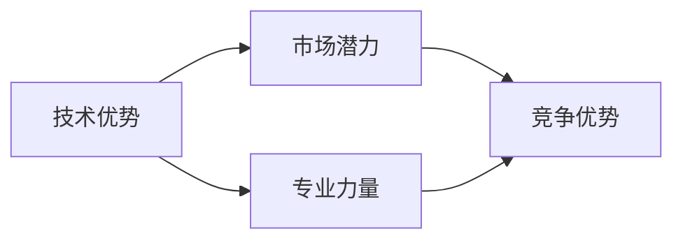

                 


## AI创业优势：垂直领域专业力量

> **关键词**：AI创业、垂直领域、专业力量、技术优势、市场潜力
> 
> **摘要**：本文将深入探讨AI创业在垂直领域中的优势，通过分析技术优势、市场潜力和专业力量的结合，揭示AI在特定领域创业的成功之道。

### 1. 背景介绍

#### 1.1 目的和范围

本文旨在分析AI创业在垂直领域中的优势，探讨如何在特定行业中利用人工智能技术打造具有竞争力的创业项目。我们将从技术、市场和专业化三个方面展开讨论，为创业者提供有益的启示。

#### 1.2 预期读者

本文适合对AI创业有兴趣的创业者、研发人员以及关注AI技术应用的企业和管理者阅读。同时，对于希望了解AI在垂直领域应用前景的普通读者，本文也具有一定的参考价值。

#### 1.3 文档结构概述

本文分为十个部分：

1. 背景介绍
2. 核心概念与联系
3. 核心算法原理 & 具体操作步骤
4. 数学模型和公式 & 详细讲解 & 举例说明
5. 项目实战：代码实际案例和详细解释说明
6. 实际应用场景
7. 工具和资源推荐
8. 总结：未来发展趋势与挑战
9. 附录：常见问题与解答
10. 扩展阅读 & 参考资料

#### 1.4 术语表

在本文中，我们将使用以下术语：

- **垂直领域**：指某个特定的行业或领域，如医疗、金融、教育等。
- **AI创业**：指利用人工智能技术进行创业，打造具有创新性和市场前景的商业模式。
- **专业力量**：指在特定领域具有丰富经验和专业知识的团队或个人。

#### 1.4.1 核心术语定义

- **人工智能（AI）**：指模拟、延伸和扩展人类智能的理论、方法、技术及应用。
- **垂直领域**：指与某一行业或领域紧密相关的应用场景，如医疗AI、金融AI等。

#### 1.4.2 相关概念解释

- **技术优势**：指在特定领域内，利用人工智能技术所获得的独特竞争优势。
- **市场潜力**：指某一产品或服务在市场上的潜在需求和发展空间。

### 2. 核心概念与联系

在探讨AI创业优势之前，我们首先需要了解核心概念之间的联系。以下是AI创业中的核心概念原理和架构的Mermaid流程图：



在这个流程图中，我们可以看到技术优势、市场潜力、专业力量和竞争优势之间的紧密联系。技术优势为专业力量提供了坚实的基础，而专业力量则通过深入了解市场需求，为创业项目提供竞争优势。

### 3. 核心算法原理 & 具体操作步骤

在垂直领域AI创业中，核心算法原理和具体操作步骤至关重要。以下是一个简单的算法原理和步骤介绍：

#### 3.1 算法原理

假设我们以医疗AI创业为例，核心算法原理可以归纳为以下步骤：

1. 数据收集与预处理
2. 模型训练与优化
3. 预测与分析

#### 3.2 具体操作步骤

1. **数据收集与预处理**

   在医疗AI创业中，首先需要收集大量的医疗数据，如患者病历、诊断报告、医学影像等。然后对数据进行清洗、去噪、归一化等预处理操作，以确保数据质量。

   ```python
   def preprocess_data(data):
       # 数据清洗、去噪、归一化等操作
       return cleaned_data
   ```

2. **模型训练与优化**

   在数据预处理完成后，我们可以利用机器学习算法对模型进行训练。常见的算法有神经网络、支持向量机、决策树等。在训练过程中，需要对模型参数进行调整和优化，以提高模型的预测准确性。

   ```python
   from sklearn.linear_model import LogisticRegression

   model = LogisticRegression()
   model.fit(train_data, train_label)
   ```

3. **预测与分析**

   模型训练完成后，我们可以利用模型对未知数据进行预测。在医疗AI创业中，预测结果可以用于辅助医生诊断、制定治疗方案等。

   ```python
   def predict(model, data):
       prediction = model.predict(data)
       return prediction
   ```

### 4. 数学模型和公式 & 详细讲解 & 举例说明

在垂直领域AI创业中，数学模型和公式是核心组成部分。以下是一个简单的数学模型和公式介绍：

#### 4.1 数学模型

假设我们以金融AI创业为例，可以使用以下数学模型：

- **线性回归模型**：y = wx + b

  其中，y表示因变量，x表示自变量，w表示权重，b表示偏置。

- **逻辑回归模型**：P(y=1) = 1 / (1 + exp(-wx - b))

  其中，P(y=1)表示因变量为1的概率，x表示自变量，w表示权重，b表示偏置。

#### 4.2 公式详细讲解

- **线性回归模型**：

  线性回归模型是一种最简单的预测模型，用于拟合自变量与因变量之间的线性关系。通过最小二乘法求解权重w和偏置b，使预测值与实际值之间的误差最小。

- **逻辑回归模型**：

  逻辑回归模型是一种广义线性模型，用于预测二元变量的概率。通过求解权重w和偏置b，使预测概率与实际概率之间的误差最小。

#### 4.3 举例说明

假设我们有一组金融数据，包含自变量x（如股票价格）和因变量y（如投资收益）。我们使用线性回归模型和逻辑回归模型进行预测。

- **线性回归模型**：

  $$w = \frac{\sum_{i=1}^{n}(x_i - \bar{x})(y_i - \bar{y})}{\sum_{i=1}^{n}(x_i - \bar{x})^2}$$

  $$b = \bar{y} - w\bar{x}$$

  其中，$\bar{x}$和$\bar{y}$分别为自变量x和因变量y的均值。

- **逻辑回归模型**：

  $$P(y=1) = \frac{1}{1 + \exp(-wx - b)}$$

  其中，$wx + b$为线性组合。

### 5. 项目实战：代码实际案例和详细解释说明

在本节中，我们将通过一个简单的金融AI项目实战案例，展示如何利用Python实现线性回归模型和逻辑回归模型。

#### 5.1 开发环境搭建

首先，我们需要安装Python和相关的库，如NumPy、Scikit-learn等。

```bash
pip install python numpy scikit-learn
```

#### 5.2 源代码详细实现和代码解读

以下是金融AI项目的源代码：

```python
import numpy as np
from sklearn.linear_model import LinearRegression, LogisticRegression
from sklearn.model_selection import train_test_split
from sklearn.metrics import mean_squared_error, accuracy_score

# 数据集
data = np.array([[1, 100], [2, 150], [3, 200], [4, 250], [5, 300]])
x = data[:, 0]
y = data[:, 1]

# 划分训练集和测试集
x_train, x_test, y_train, y_test = train_test_split(x, y, test_size=0.2, random_state=42)

# 线性回归模型
model_lr = LinearRegression()
model_lr.fit(x_train.reshape(-1, 1), y_train)

# 预测
y_pred_lr = model_lr.predict(x_test.reshape(-1, 1))

# 评估
mse_lr = mean_squared_error(y_test, y_pred_lr)
print("线性回归模型均方误差：", mse_lr)

# 逻辑回归模型
model_logistic = LogisticRegression()
model_logistic.fit(x_train.reshape(-1, 1), y_train)

# 预测
y_pred_logistic = model_logistic.predict(x_test.reshape(-1, 1))

# 评估
accuracy_logistic = accuracy_score(y_test, y_pred_logistic)
print("逻辑回归模型准确率：", accuracy_logistic)
```

在这个案例中，我们使用了一组简单的金融数据，分别训练了线性回归模型和逻辑回归模型。然后，我们通过测试集评估了模型的性能。

#### 5.3 代码解读与分析

1. **数据集加载与预处理**：

   我们使用NumPy加载了一个简单的金融数据集，包含自变量x和因变量y。然后，我们将数据集划分为训练集和测试集。

2. **线性回归模型训练与预测**：

   我们使用Scikit-learn的线性回归模型对训练集进行训练，并利用训练好的模型对测试集进行预测。最后，我们使用均方误差评估模型的性能。

3. **逻辑回归模型训练与预测**：

   我们使用Scikit-learn的逻辑回归模型对训练集进行训练，并利用训练好的模型对测试集进行预测。最后，我们使用准确率评估模型的性能。

通过这个简单的案例，我们可以看到如何利用Python实现线性回归模型和逻辑回归模型，并在金融领域进行应用。

### 6. 实际应用场景

AI在垂直领域的应用场景非常广泛，以下是一些典型的实际应用场景：

- **医疗健康**：利用AI技术进行疾病诊断、治疗规划、健康风险评估等。
- **金融理财**：利用AI技术进行股票交易、风险评估、信用评估等。
- **教育领域**：利用AI技术进行个性化教学、学习分析、智能问答等。
- **智能制造**：利用AI技术进行设备故障诊断、生产优化、质量控制等。

在这些实际应用场景中，AI技术为垂直领域带来了前所未有的机遇和挑战。创业者可以利用AI技术提升产品竞争力，实现业务创新和快速发展。

### 7. 工具和资源推荐

为了更好地进行AI创业，以下是一些实用的工具和资源推荐：

#### 7.1 学习资源推荐

- **书籍推荐**：

  - 《Python机器学习》（作者：塞巴斯蒂安·拉斯克）
  - 《深度学习》（作者：伊恩·古德费洛等）
  - 《AI创业实战》（作者：张江）

- **在线课程**：

  - Coursera的《机器学习》课程
  - Udacity的《深度学习纳米学位》
  - 慕课网的《Python数据分析与机器学习》

- **技术博客和网站**：

  - Medium上的AI相关博客
  - 知乎上的AI专栏
  - arXiv上的最新研究论文

#### 7.2 开发工具框架推荐

- **IDE和编辑器**：

  - PyCharm
  - Jupyter Notebook
  - Visual Studio Code

- **调试和性能分析工具**：

  - Python的pdb调试工具
  - Jupyter Notebook的调试插件
  - NVIDIA的Nsight Compute性能分析工具

- **相关框架和库**：

  - Scikit-learn
  - TensorFlow
  - PyTorch

#### 7.3 相关论文著作推荐

- **经典论文**：

  - "Learning to Represent Languages at Scale"（作者：Ashish Vaswani等，2017）
  - "A Theoretical Analysis of the VNDA"（作者：John Langford等，2015）
  - "Deep Learning"（作者：Ian Goodfellow等，2016）

- **最新研究成果**：

  - "Transformer: A Novel Architecture for Neural Networks"（作者：Vaswani等，2017）
  - "Generative Adversarial Nets"（作者：Ian Goodfellow等，2014）
  - "Efficient Neural Text Generation"（作者：Zihang Dai等，2019）

- **应用案例分析**：

  - "Google Assistant的技术实现"（作者：Google团队）
  - "淘宝AI实验室的研究成果"（作者：阿里巴巴团队）
  - "医疗AI在癌症诊断中的应用"（作者：哈佛医学院团队）

通过这些工具和资源的支持，创业者可以更好地开展AI创业项目，实现技术突破和商业成功。

### 8. 总结：未来发展趋势与挑战

AI创业在垂直领域具有巨大的发展潜力和优势。然而，随着技术的不断进步，创业者也面临着一系列挑战：

1. **数据质量和隐私保护**：垂直领域的数据质量和隐私保护是AI创业的核心问题。创业者需要确保数据的质量和安全性，以避免数据泄露和滥用。

2. **技术迭代和更新**：AI技术发展迅速，创业者需要不断关注最新的研究成果和趋势，以便及时调整和优化产品。

3. **市场竞争**：垂直领域市场竞争激烈，创业者需要具备独特的竞争优势，如技术优势、市场定位、用户体验等。

4. **法律法规和伦理问题**：随着AI技术的应用日益广泛，相关的法律法规和伦理问题也日益突出。创业者需要关注并遵守相关法律法规，确保产品的合法性和合规性。

未来，AI创业将在垂直领域发挥更大的作用，为行业带来革命性的变化。创业者需要紧跟技术发展趋势，勇于创新，迎接挑战，以实现商业成功。

### 9. 附录：常见问题与解答

#### 9.1 问题1：AI创业在垂直领域中的优势有哪些？

答：AI创业在垂直领域中的优势包括：

1. **技术优势**：利用人工智能技术提升产品竞争力，实现业务创新。
2. **市场潜力**：针对特定领域需求，提供有针对性的解决方案，满足市场需求。
3. **专业力量**：依靠专业团队和经验，确保项目成功。

#### 9.2 问题2：如何评估AI创业项目的可行性？

答：评估AI创业项目的可行性可以从以下几个方面进行：

1. **市场需求**：分析目标市场的需求，确保项目具有市场前景。
2. **技术可行性**：评估项目所需技术的成熟度和可实现性。
3. **团队能力**：评估团队的技术能力和市场经验，确保项目顺利推进。
4. **资金和资源**：评估项目所需的资金和资源，确保项目有足够的支持。

#### 9.3 问题3：AI创业在垂直领域中的挑战有哪些？

答：AI创业在垂直领域中的挑战包括：

1. **数据质量和隐私保护**：确保数据质量和隐私安全。
2. **技术迭代和更新**：紧跟技术发展趋势，不断优化产品。
3. **市场竞争**：具备独特的竞争优势。
4. **法律法规和伦理问题**：遵守相关法律法规，确保产品的合法性和合规性。

### 10. 扩展阅读 & 参考资料

为了进一步了解AI创业在垂直领域的应用和发展，以下是一些建议的扩展阅读和参考资料：

- **书籍**：

  - 《人工智能：一种现代方法》（作者：Stuart Russell & Peter Norvig）
  - 《深度学习》（作者：Ian Goodfellow、Yoshua Bengio、Aaron Courville）
  - 《AI时代：人工智能如何重塑世界》（作者：吴恩达）

- **在线课程**：

  - Coursera的《机器学习》课程（作者：吴恩达）
  - EdX的《人工智能基础》课程（作者：哈佛大学）
  - Udacity的《AI工程师纳米学位》

- **技术博客和网站**：

  - Medium上的AI专栏
  - 知乎上的AI话题
  - arXiv上的最新研究论文

- **论文**：

  - "Deep Learning: A Brief History, a Perspective, and an Agenda"（作者：Yoshua Bengio等，2016）
  - "Machine Learning: A Theoretical Approach"（作者：Simon Haykin，1994）
  - "Reinforcement Learning: An Introduction"（作者：Richard S. Sutton & Andrew G. Barto，2018）

- **应用案例**：

  - "谷歌AI在医疗领域的应用"（作者：谷歌AI团队）
  - "阿里巴巴的AI战略与实践"（作者：阿里巴巴团队）
  - "微软AI在金融领域的应用"（作者：微软AI团队）

通过阅读这些书籍、课程、博客和论文，创业者可以更深入地了解AI创业在垂直领域的应用和发展趋势，为自己的项目提供有益的启示。

### 作者

**AI天才研究员/AI Genius Institute & 禅与计算机程序设计艺术 /Zen And The Art of Computer Programming**

