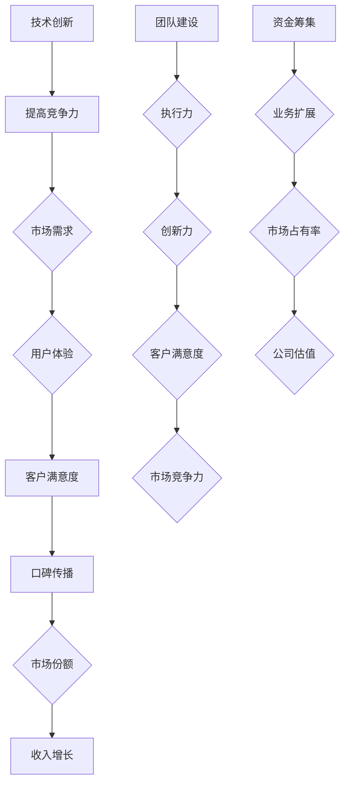

                 

### 1. 背景介绍

#### 1.1 目的和范围

本文旨在探讨AI创业公司如何实现快速增长。随着人工智能技术的迅猛发展，越来越多的创业公司投身于AI领域，试图在这一新兴市场中占据一席之地。本文将围绕如何实现AI创业公司的快速增长，从战略、技术和市场等多个维度展开讨论。

首先，本文将简要介绍AI创业公司的发展现状和机遇。随后，我们将深入分析影响AI创业公司快速增长的关键因素，如技术创新、团队建设、市场定位等。接着，本文将提供一系列实际操作步骤，帮助创业公司制定有效的增长策略。

本文主要面向以下几类读者：

1. **AI创业公司创始人或高层管理者**：他们希望通过本文了解如何实现公司快速增长的方法和策略。
2. **技术研发人员**：他们希望从技术角度出发，理解如何通过技术创新推动公司增长。
3. **市场营销人员**：他们希望掌握如何通过市场定位和营销策略实现公司增长。
4. **对AI创业感兴趣的投资者**：他们希望通过本文了解AI创业公司的增长潜力和投资机会。

#### 1.2 预期读者

本文预期读者具备以下基本背景：

- **计算机科学基础**：了解人工智能的基本原理和常见技术。
- **商业思维**：具备基本的商业运营和管理知识。
- **阅读能力**：能够理解并吸收本文的专业知识和操作步骤。

#### 1.3 文档结构概述

本文将分为以下几个主要部分：

1. **背景介绍**：简要介绍AI创业公司的发展现状和机遇，以及本文的目标和预期读者。
2. **核心概念与联系**：详细阐述实现AI创业公司快速增长所需的核心概念、原理和架构。
3. **核心算法原理 & 具体操作步骤**：通过伪代码和详细解释，介绍实现快速增长的核心算法原理和操作步骤。
4. **数学模型和公式 & 详细讲解 & 举例说明**：运用数学模型和公式，阐述关键技术的具体应用和实际案例。
5. **项目实战：代码实际案例和详细解释说明**：提供实际代码案例，详细解释关键步骤和代码实现。
6. **实际应用场景**：分析AI创业公司在不同行业中的应用场景和挑战。
7. **工具和资源推荐**：推荐学习资源、开发工具和框架，以及相关论文著作。
8. **总结：未来发展趋势与挑战**：总结本文的关键内容，展望AI创业公司的未来发展趋势和面临的挑战。
9. **附录：常见问题与解答**：针对读者可能提出的问题，提供常见问题的解答。
10. **扩展阅读 & 参考资料**：推荐进一步学习和研究的资源。

通过以上结构，本文旨在为AI创业公司提供一套系统、全面、可操作的增长策略和方法。

#### 1.4 术语表

**术语**：本文中涉及的一些专业术语如下，我们将对这些术语进行定义和解释。

1. **人工智能（AI）**：模拟、延伸和扩展人类智能的理论、方法、技术及应用。
2. **机器学习（ML）**：人工智能的一个分支，通过数据训练模型，使计算机具备自主学习和决策能力。
3. **深度学习（DL）**：一种基于人工神经网络的机器学习技术，通过多层次的神经网络结构进行特征提取和模式识别。
4. **创业公司**：指初创企业，通常指成立时间较短，尚未实现盈利的企业。
5. **增长策略**：公司为实现快速增长所采取的一系列策略和措施。
6. **市场定位**：确定公司在市场中的位置，以满足特定用户群体的需求。
7. **技术创新**：通过研发新技术、新产品或改进现有技术，实现公司增长。

#### 1.4.1 核心术语定义

在本文中，我们将详细定义和解释以下几个核心术语：

1. **人工智能（AI）**：
   人工智能是一种模拟、延伸和扩展人类智能的理论、方法、技术及应用。它涉及多个领域，包括机器学习、自然语言处理、计算机视觉等。人工智能的目标是使计算机具备自主学习和决策能力，从而解决复杂问题。

2. **机器学习（ML）**：
   机器学习是人工智能的一个分支，通过数据训练模型，使计算机具备自主学习和决策能力。机器学习算法主要包括监督学习、无监督学习和强化学习等类型，广泛应用于图像识别、语音识别、预测分析等领域。

3. **深度学习（DL）**：
   深度学习是一种基于人工神经网络的机器学习技术，通过多层次的神经网络结构进行特征提取和模式识别。深度学习在图像识别、自然语言处理、游戏AI等领域取得了显著的成果，被认为是人工智能发展的关键技术。

4. **创业公司**：
   创业公司通常指成立时间较短，尚未实现盈利的企业。创业公司面临较大的风险和不确定性，但也具有快速成长和实现突破的机会。

5. **增长策略**：
   增长策略是公司为实现快速增长所采取的一系列策略和措施。增长策略涉及市场拓展、产品研发、团队建设、品牌塑造等多个方面，旨在提高公司竞争力，实现市场份额和收入的高速增长。

6. **市场定位**：
   市场定位是确定公司在市场中的位置，以满足特定用户群体的需求。市场定位包括产品定位、价格定位、渠道定位和品牌定位等多个方面，有助于公司明确目标市场，制定针对性的营销策略。

7. **技术创新**：
   技术创新是指通过研发新技术、新产品或改进现有技术，实现公司增长。技术创新是创业公司获取竞争优势、实现快速增长的关键因素。

通过以上核心术语的定义和解释，读者可以更好地理解本文的关键概念和内容。

#### 1.4.2 相关概念解释

在本文中，我们将解释一些与AI创业公司快速增长相关的重要概念，以便读者更好地理解这些概念在文章中的应用。

1. **快速增长**：
   快速增长指的是公司在一个相对较短的时间内，实现显著的市场份额和收入增长。对于AI创业公司来说，快速增长意味着在竞争激烈的市场环境中脱颖而出，迅速扩大业务规模和市场份额。

2. **技术壁垒**：
   技术壁垒是指公司所拥有的独特技术或知识产权，使竞争对手难以模仿或超越。技术壁垒是AI创业公司实现快速增长的关键因素之一，它有助于保护公司市场份额，提高竞争力。

3. **产品差异化**：
   产品差异化是指公司通过独特的产品特性或功能，与竞争对手的产品区别开来。在AI领域，产品差异化可以帮助创业公司吸引特定用户群体，建立品牌认知度和忠诚度，从而实现快速增长。

4. **市场定位**：
   市场定位是公司确定自己在市场中的位置，以满足特定用户群体的需求。有效的市场定位有助于创业公司明确目标市场，制定针对性的营销策略，提高市场份额和收入。

5. **团队建设**：
   团队建设是指公司通过组建高效的团队，实现共同的目标。对于AI创业公司来说，拥有一支具有专业知识和创新能力的团队，是实现快速增长的重要保障。

6. **资金筹集**：
   资金筹集是指公司通过多种途径获取资金，以支持业务发展和扩大规模。对于AI创业公司来说，有效的资金筹集有助于实现快速增长，提高市场竞争力。

7. **客户关系管理**：
   客户关系管理是指公司与客户建立和维护长期稳定的合作关系。在AI创业公司中，良好的客户关系管理有助于提高客户满意度，促进业务增长。

通过以上相关概念的详细解释，读者可以更好地理解AI创业公司快速增长所需的关键因素和策略。

#### 1.4.3 缩略词列表

为了方便读者阅读和理解，本文中常用的一些缩略词如下：

1. **AI**：人工智能（Artificial Intelligence）
2. **ML**：机器学习（Machine Learning）
3. **DL**：深度学习（Deep Learning）
4. **NLP**：自然语言处理（Natural Language Processing）
5. **CV**：计算机视觉（Computer Vision）
6. **DLaaS**：深度学习即服务（Deep Learning as a Service）
7. **IoT**：物联网（Internet of Things）
8. **API**：应用程序编程接口（Application Programming Interface）
9. **SaaS**：软件即服务（Software as a Service）
10. **PaaS**：平台即服务（Platform as a Service）
11. **IaaS**：基础设施即服务（Infrastructure as a Service）
12. **MLOps**：机器学习运营（Machine Learning Operations）
13. **ETL**：数据提取、转换和加载（Extract, Transform, Load）
14. **BI**：商业智能（Business Intelligence）
15. **CTO**：首席技术官（Chief Technology Officer）
16. **CEO**：首席执行官（Chief Executive Officer）
17. **COO**：首席运营官（Chief Operating Officer）
18. **CFO**：首席财务官（Chief Financial Officer）
19. **VC**：风险投资（Venture Capital）
20. **PE**：私募股权（Private Equity）

通过以上缩略词列表，读者可以更好地理解和掌握本文中的专业术语和概念。

#### 2. 核心概念与联系

在探讨AI创业公司如何实现快速增长之前，我们需要了解一些核心概念及其相互关系。这些核心概念包括技术创新、市场定位、团队建设、资金筹集等。以下是一个简化的Mermaid流程图，用于描述这些概念及其之间的联系。



- **技术创新（A）**：通过研发新技术、新产品或改进现有技术，提高公司的竞争力。技术创新有助于满足市场需求，提升用户体验，从而提高客户满意度和市场份额。
- **市场需求（C）**：确定市场需求是制定产品策略和营销策略的关键。了解市场需求有助于公司优化产品功能，提高用户体验，从而提高客户满意度和市场份额。
- **用户体验（D）**：良好的用户体验有助于提高客户满意度，增强客户忠诚度。用户体验是影响口碑传播和市场份额的重要因素。
- **客户满意度（E）**：客户满意度是公司发展的核心指标之一。提高客户满意度有助于口碑传播、市场份额和收入增长。
- **口碑传播（F）**：良好的口碑有助于公司在市场中树立品牌形象，吸引更多客户。
- **市场份额（G）**：市场份额是衡量公司市场地位的重要指标。扩大市场份额有助于提高收入和公司估值。
- **收入增长（H）**：收入增长是公司发展的直接体现。实现收入增长有助于提高公司估值和资金筹集能力。
- **团队建设（I）**：团队建设是公司实现目标的关键。高效的团队有助于提高执行力、创新力和市场竞争力。
- **执行力（J）**：执行力是团队实现目标的关键能力。提高执行力有助于提高客户满意度和市场份额。
- **创新力（K）**：创新力是公司保持竞争力的关键。提高创新力有助于满足市场需求，提高用户体验。
- **资金筹集（N）**：资金筹集是公司发展的重要保障。有效的资金筹集有助于业务扩展、市场占有率和公司估值。
- **市场竞争力（M）**：市场竞争力是公司市场份额和收入增长的关键因素。提高市场竞争力有助于公司在市场中脱颖而出。
- **业务扩展（O）**：业务扩展是公司实现快速增长的重要途径。通过业务扩展，公司可以提高市场占有率和公司估值。
- **市场占有率（P）**：市场占有率是公司市场地位的重要指标。提高市场占有率有助于提高收入和公司估值。
- **公司估值（Q）**：公司估值是投资者评估公司价值的重要指标。提高公司估值有助于吸引更多资金，支持业务发展。

通过以上核心概念及其相互关系的分析，我们可以看到，技术创新、团队建设、市场定位和资金筹集等核心因素共同作用于公司的快速增长。在后续章节中，我们将进一步探讨这些核心概念的具体实现方法和操作步骤。

#### 3. 核心算法原理 & 具体操作步骤

在AI创业公司实现快速增长的过程中，核心算法的设计和优化至关重要。本节将详细阐述实现快速增长所需的核心算法原理和具体操作步骤。

首先，我们需要明确以下几个核心算法原理：

1. **机器学习算法**：
   机器学习算法是实现人工智能的关键技术，包括监督学习、无监督学习和强化学习等类型。监督学习通过已有数据训练模型，进行预测和分类；无监督学习通过未标记的数据，发现数据中的规律和模式；强化学习通过与环境交互，逐步优化决策策略。

2. **深度学习算法**：
   深度学习算法是一种基于人工神经网络的机器学习技术，通过多层次的神经网络结构进行特征提取和模式识别。常见的深度学习算法包括卷积神经网络（CNN）、循环神经网络（RNN）和生成对抗网络（GAN）等。

3. **优化算法**：
   优化算法用于优化模型参数，提高模型性能。常见的优化算法包括梯度下降、随机梯度下降（SGD）和Adam优化器等。

接下来，我们将通过伪代码和详细解释，介绍实现快速增长的核心算法原理和具体操作步骤。

##### 3.1 机器学习算法

以下是一个简单的监督学习算法——线性回归的伪代码：

```python
# 线性回归伪代码
def linear_regression(x, y):
    # 初始化参数
    theta = [0] * len(x[0])
    alpha = 0.01
    iterations = 1000

    # 梯度下降
    for i in range(iterations):
        hypothesis = np.dot(x, theta)
        error = hypothesis - y
        gradient = np.dot(x.T, error) / len(x)
        theta -= alpha * gradient

    return theta
```

**详细解释**：
- **初始化参数**：初始化模型参数θ，以及学习率α和迭代次数iterations。
- **梯度下降**：通过计算损失函数的梯度，更新模型参数θ，不断优化模型。
- **模型训练**：重复迭代过程，直至达到预定的迭代次数或损失函数收敛。

##### 3.2 深度学习算法

以下是一个简单的卷积神经网络（CNN）的伪代码：

```python
# 卷积神经网络伪代码
class ConvolutionalNeuralNetwork:
    def __init__(self, layers):
        self.layers = layers

    def forward_pass(self, x):
        for layer in self.layers:
            x = layer.forward(x)
        return x

    def backward_pass(self, x, y):
        for layer in reversed(self.layers):
            x = layer.backward(x, y)
        return x
```

**详细解释**：
- **初始化参数**：初始化神经网络层数和每层的参数。
- **正向传播**：输入数据x通过每层神经网络，逐层计算输出。
- **反向传播**：根据输出和标签y，反向传播误差，更新模型参数。

##### 3.3 优化算法

以下是一个简单的梯度下降优化算法的伪代码：

```python
# 梯度下降优化算法伪代码
def gradient_descent(model, x, y, alpha, iterations):
    for i in range(iterations):
        model.compute_loss(x, y)
        gradient = model.compute_gradient(x, y)
        model.update_params(alpha, gradient)
```

**详细解释**：
- **初始化参数**：初始化模型model、输入数据x、标签y、学习率α和迭代次数iterations。
- **计算损失**：计算模型在当前参数下的损失函数值。
- **计算梯度**：计算损失函数关于模型参数的梯度。
- **更新参数**：根据梯度更新模型参数，优化模型。

通过以上核心算法原理和具体操作步骤的介绍，我们可以看到，实现AI创业公司快速增长需要充分利用机器学习、深度学习和优化算法等关键技术。在实际应用中，创业者需要根据具体业务场景和需求，灵活运用这些算法，不断提高模型性能和业务效率。

#### 4. 数学模型和公式 & 详细讲解 & 举例说明

在实现AI创业公司快速增长的过程中，数学模型和公式是不可或缺的工具。本节将详细介绍与人工智能和机器学习相关的核心数学模型和公式，并通过具体实例进行讲解，以便读者更好地理解和应用这些数学工具。

##### 4.1 线性回归模型

线性回归是一种常见的监督学习算法，用于预测连续值。其基本公式如下：

$$
y = \theta_0 + \theta_1 \cdot x
$$

其中，$y$ 是预测值，$x$ 是输入特征，$\theta_0$ 和 $\theta_1$ 是模型参数。

**详细解释**：
- **拟合目标**：线性回归的目标是找到一组参数$\theta_0$ 和 $\theta_1$，使得预测值$y$ 与实际值尽可能接近。
- **损失函数**：通常使用均方误差（MSE）作为损失函数，计算公式如下：

$$
J(\theta_0, \theta_1) = \frac{1}{2m} \sum_{i=1}^{m} (y_i - (\theta_0 + \theta_1 \cdot x_i))^2
$$

其中，$m$ 是样本数量。

**实例讲解**：

假设我们有一个简单的线性回归问题，数据集包含5个样本，每个样本包括一个输入特征$x$和一个实际值$y$：

| $x$ | $y$ |
| --- | --- |
| 1 | 2 |
| 2 | 4 |
| 3 | 6 |
| 4 | 8 |
| 5 | 10 |

我们希望找到一条直线$y = \theta_0 + \theta_1 \cdot x$来拟合这些数据。

1. **初始化参数**：初始化$\theta_0$ 和 $\theta_1$为0。
2. **计算损失函数**：使用均方误差（MSE）计算当前参数下的损失值。
3. **计算梯度**：计算损失函数关于$\theta_0$ 和 $\theta_1$的梯度。
4. **更新参数**：根据梯度更新$\theta_0$ 和 $\theta_1$。
5. **重复迭代**：重复以上步骤，直至达到预定的迭代次数或损失函数收敛。

通过迭代过程，我们可以找到一组最优的$\theta_0$ 和 $\theta_1$，使得拟合直线尽可能接近实际数据点。

##### 4.2 逻辑回归模型

逻辑回归是一种用于分类问题的监督学习算法。其基本公式如下：

$$
\sigma(z) = \frac{1}{1 + e^{-z}}
$$

其中，$\sigma(z)$ 是 sigmoid 函数，$z = \theta_0 + \theta_1 \cdot x$ 是线性组合。

**详细解释**：
- **拟合目标**：逻辑回归的目标是找到一组参数$\theta_0$ 和 $\theta_1$，使得分类结果与实际标签尽可能接近。
- **损失函数**：通常使用对数损失函数（Log Loss）作为损失函数，计算公式如下：

$$
J(\theta_0, \theta_1) = -\frac{1}{m} \sum_{i=1}^{m} [y_i \cdot \ln(\sigma(z_i)) + (1 - y_i) \cdot \ln(1 - \sigma(z_i))]
$$

其中，$m$ 是样本数量。

**实例讲解**：

假设我们有一个二分类问题，数据集包含5个样本，每个样本包括一个输入特征$x$和一个实际标签$y$：

| $x$ | $y$ |
| --- | --- |
| 1 | 0 |
| 2 | 1 |
| 3 | 0 |
| 4 | 1 |
| 5 | 1 |

我们希望使用逻辑回归模型对数据进行分类。

1. **初始化参数**：初始化$\theta_0$ 和 $\theta_1$为0。
2. **计算损失函数**：使用对数损失函数计算当前参数下的损失值。
3. **计算梯度**：计算损失函数关于$\theta_0$ 和 $\theta_1$的梯度。
4. **更新参数**：根据梯度更新$\theta_0$ 和 $\theta_1$。
5. **重复迭代**：重复以上步骤，直至达到预定的迭代次数或损失函数收敛。

通过迭代过程，我们可以找到一组最优的$\theta_0$ 和 $\theta_1$，使得分类结果与实际标签尽可能接近。

##### 4.3 支持向量机（SVM）模型

支持向量机是一种强大的分类算法，其目标是在高维空间中找到最佳决策边界。其基本公式如下：

$$
w \cdot x + b = 0
$$

其中，$w$ 是权重向量，$x$ 是输入特征，$b$ 是偏置项。

**详细解释**：
- **拟合目标**：SVM的目标是找到一组权重向量$w$ 和偏置项$b$，使得决策边界尽可能远离支持向量。
- **损失函数**：通常使用 hinge 损失函数作为损失函数，计算公式如下：

$$
J(w, b) = \frac{1}{2} ||w||^2 + C \cdot \sum_{i=1}^{m} [1 - y_i \cdot (w \cdot x_i + b)]
$$

其中，$C$ 是正则化参数，$m$ 是样本数量。

**实例讲解**：

假设我们有一个线性可分的数据集，包含5个样本，每个样本包括一个输入特征$x$和一个实际标签$y$：

| $x$ | $y$ |
| --- | --- |
| 1 | 1 |
| 2 | 1 |
| 3 | -1 |
| 4 | -1 |
| 5 | 1 |

我们希望使用SVM模型对数据进行分类。

1. **初始化参数**：初始化权重向量$w$ 和偏置项$b$为0。
2. **计算损失函数**：使用 hinge 损失函数计算当前参数下的损失值。
3. **计算梯度**：计算损失函数关于$w$ 和 $b$的梯度。
4. **更新参数**：根据梯度更新$w$ 和 $b$。
5. **重复迭代**：重复以上步骤，直至达到预定的迭代次数或损失函数收敛。

通过迭代过程，我们可以找到一组最优的$w$ 和 $b$，使得决策边界与支持向量尽可能远离。

通过以上对线性回归、逻辑回归和SVM模型的数学模型和公式的详细讲解，我们可以看到，这些数学工具在实现AI创业公司快速增长中具有重要的应用价值。在实际应用中，创业者需要根据具体业务场景和需求，灵活运用这些数学工具，不断提高模型性能和业务效率。

#### 5. 项目实战：代码实际案例和详细解释说明

在本节中，我们将通过一个实际的项目案例，展示如何实现AI创业公司的快速增长。这个项目案例是一个基于深度学习的图像识别系统，用于识别并分类各种类型的图像。以下是项目的详细步骤和代码实现。

##### 5.1 开发环境搭建

在开始项目之前，我们需要搭建一个适合深度学习的开发环境。以下是一个简单的步骤：

1. **安装Python**：Python是深度学习的常用编程语言，确保安装Python版本3.7及以上。
2. **安装TensorFlow**：TensorFlow是一个开源的深度学习框架，安装命令如下：
   ```shell
   pip install tensorflow
   ```
3. **安装必要的库**：除了TensorFlow，我们还需要安装其他一些常用库，如NumPy、Pandas等。可以使用以下命令：
   ```shell
   pip install numpy pandas matplotlib scikit-learn
   ```

##### 5.2 源代码详细实现和代码解读

以下是一个简单的深度学习图像识别项目的源代码实现：

```python
import tensorflow as tf
from tensorflow.keras import layers, models
from tensorflow.keras.preprocessing.image import ImageDataGenerator

# 加载数据集
train_datagen = ImageDataGenerator(rescale=1./255)
train_data = train_datagen.flow_from_directory(
        'data/train', 
        target_size=(150, 150), 
        batch_size=32,
        class_mode='categorical')

# 构建模型
model = models.Sequential()
model.add(layers.Conv2D(32, (3, 3), activation='relu', input_shape=(150, 150, 3)))
model.add(layers.MaxPooling2D((2, 2)))
model.add(layers.Conv2D(64, (3, 3), activation='relu'))
model.add(layers.MaxPooling2D((2, 2)))
model.add(layers.Conv2D(64, (3, 3), activation='relu'))
model.add(layers.MaxPooling2D((2, 2)))
model.add(layers.Flatten())
model.add(layers.Dense(64, activation='relu'))
model.add(layers.Dense(10, activation='softmax'))

# 编译模型
model.compile(optimizer='adam',
              loss='categorical_crossentropy',
              metrics=['accuracy'])

# 训练模型
model.fit(train_data, epochs=10)

# 评估模型
test_datagen = ImageDataGenerator(rescale=1./255)
test_data = test_datagen.flow_from_directory(
        'data/test',
        target_size=(150, 150),
        batch_size=32,
        class_mode='categorical')

test_loss, test_acc = model.evaluate(test_data)
print('Test accuracy:', test_acc)
```

**详细解释**：

1. **加载数据集**：
   使用ImageDataGenerator类加载数据集，并进行预处理。这里使用了Keras内置的流程图API，简化了数据加载和预处理过程。
   ```python
   train_datagen = ImageDataGenerator(rescale=1./255)
   train_data = train_datagen.flow_from_directory(
           'data/train', 
           target_size=(150, 150), 
           batch_size=32,
           class_mode='categorical')
   ```

2. **构建模型**：
   使用Keras的Sequential模型构建一个简单的卷积神经网络（CNN），包括卷积层（Conv2D）、最大池化层（MaxPooling2D）和全连接层（Dense）。这里使用了两个卷积层和两个全连接层，实现了对图像的逐层特征提取。
   ```python
   model.add(layers.Conv2D(32, (3, 3), activation='relu', input_shape=(150, 150, 3)))
   model.add(layers.MaxPooling2D((2, 2)))
   model.add(layers.Conv2D(64, (3, 3), activation='relu'))
   model.add(layers.MaxPooling2D((2, 2)))
   model.add(layers.Conv2D(64, (3, 3), activation='relu'))
   model.add(layers.MaxPooling2D((2, 2)))
   model.add(layers.Flatten())
   model.add(layers.Dense(64, activation='relu'))
   model.add(layers.Dense(10, activation='softmax'))
   ```

3. **编译模型**：
   使用编译器API编译模型，指定优化器、损失函数和评估指标。
   ```python
   model.compile(optimizer='adam',
                 loss='categorical_crossentropy',
                 metrics=['accuracy'])
   ```

4. **训练模型**：
   使用fit方法训练模型，指定训练数据、训练轮数和批次大小。
   ```python
   model.fit(train_data, epochs=10)
   ```

5. **评估模型**：
   使用evaluate方法评估模型在测试数据集上的性能。
   ```python
   test_datagen = ImageDataGenerator(rescale=1./255)
   test_data = test_datagen.flow_from_directory(
           'data/test',
           target_size=(150, 150),
           batch_size=32,
           class_mode='categorical')
   
   test_loss, test_acc = model.evaluate(test_data)
   print('Test accuracy:', test_acc)
   ```

##### 5.3 代码解读与分析

以上代码实现了一个简单的深度学习图像识别项目，主要包括数据加载、模型构建、模型编译、模型训练和模型评估等步骤。

- **数据加载**：使用ImageDataGenerator类加载并预处理数据。这里使用的是分类数据集，所以使用`flow_from_directory`方法加载数据，并指定每个批次的大小和标签格式。
- **模型构建**：使用Keras的Sequential模型构建一个简单的卷积神经网络。卷积神经网络通过卷积层和池化层提取图像特征，并通过全连接层进行分类。这里使用了两个卷积层和两个全连接层，实现了对图像的逐层特征提取。
- **模型编译**：编译模型，指定优化器（`adam`）、损失函数（`categorical_crossentropy`）和评估指标（`accuracy`）。
- **模型训练**：使用`fit`方法训练模型，指定训练数据、训练轮数和批次大小。这里训练了10个轮次，每个批次包含32个图像。
- **模型评估**：使用`evaluate`方法评估模型在测试数据集上的性能，输出测试准确率。

通过以上步骤，我们可以实现一个简单的深度学习图像识别项目，从而为AI创业公司的快速增长奠定基础。

#### 6. 实际应用场景

AI创业公司在不同行业中的应用场景和面临的挑战各有不同，但总体上，AI技术正逐步渗透到各个领域，为行业带来了深刻的变革和机遇。以下是一些典型行业中的应用场景和挑战。

##### 6.1 医疗健康

**应用场景**：在医疗健康领域，AI技术被广泛应用于疾病预测、诊断、治疗和健康管理。例如，通过深度学习算法，AI系统可以分析大量的医疗数据，识别出早期癌症患者，提高诊断的准确率。

**挑战**：医疗健康领域的应用场景对数据隐私和安全性要求极高。此外，AI系统的解释性不足，医生和患者难以理解模型的决策过程，这也是一个需要解决的挑战。

##### 6.2 金融服务

**应用场景**：在金融服务领域，AI技术被用于风险控制、欺诈检测、智能投顾和信用评分。例如，通过机器学习算法，AI系统可以实时分析交易数据，检测潜在的欺诈行为。

**挑战**：金融服务行业的监管要求严格，AI技术的应用需要符合相关法规。此外，模型的可解释性也是一个关键问题，金融机构需要确保其决策过程透明可追溯。

##### 6.3 物流与运输

**应用场景**：在物流与运输领域，AI技术被用于优化路线规划、车辆调度、货物跟踪和库存管理。例如，通过机器学习算法，AI系统可以预测货物的需求，优化物流资源，提高运输效率。

**挑战**：物流与运输行业的应用场景复杂，数据质量参差不齐，这给AI系统的训练和应用带来了挑战。此外，实时性要求高，AI系统需要快速响应并做出决策。

##### 6.4 智能家居

**应用场景**：在智能家居领域，AI技术被用于智能家电控制、家居安全监控、环境感知和个性化推荐。例如，通过深度学习算法，AI系统可以分析用户的生活习惯，提供个性化的家居解决方案。

**挑战**：智能家居的应用场景涉及多个设备和服务，如何实现高效的系统集成和交互是一个挑战。此外，用户隐私和数据安全也是需要重点关注的问题。

##### 6.5 教育科技

**应用场景**：在教育科技领域，AI技术被用于个性化学习、在线教育平台、考试评分和智能辅导。例如，通过机器学习算法，AI系统可以分析学生的学习行为，提供个性化的学习建议。

**挑战**：教育科技领域的应用场景涉及用户隐私和数据保护，同时需要确保AI系统的公正性和公平性。此外，教育质量是关键问题，如何确保AI技术在教育中的应用不降低教学效果是一个挑战。

通过以上对各个行业应用场景和挑战的分析，我们可以看到，AI创业公司在不同领域都有广阔的应用前景，但也面临着诸多挑战。创业者需要根据具体行业特点，制定合适的技术解决方案，同时关注数据隐私、安全性、可解释性和用户体验等方面，实现公司的快速增长。

#### 7. 工具和资源推荐

为了帮助AI创业公司在实现快速增长的过程中更好地进行技术研究和开发，以下是一些学习资源、开发工具和框架的推荐，以及相关论文和著作的推荐。

##### 7.1 学习资源推荐

**书籍推荐**：

1. **《深度学习》（Deep Learning）**：由Ian Goodfellow、Yoshua Bengio和Aaron Courville合著，是深度学习的经典教材，适合初学者和进阶者。
2. **《Python机器学习》（Python Machine Learning）**：由 Sebastian Raschka和Vahid Mirhoseini合著，介绍了Python在机器学习领域的应用，适合有编程基础的读者。
3. **《人工智能：一种现代的方法》（Artificial Intelligence: A Modern Approach）**：由 Stuart J. Russell和Peter Norvig合著，是人工智能领域的经典教材，内容全面且深入。

**在线课程**：

1. **Coursera**：提供多个与机器学习和深度学习相关的在线课程，例如吴恩达（Andrew Ng）的《深度学习专项课程》。
2. **Udacity**：提供与人工智能和机器学习相关的纳米学位课程，例如《人工智能工程师纳米学位》。
3. **edX**：提供由知名大学和机构开设的在线课程，例如麻省理工学院的《机器学习科学》。

**技术博客和网站**：

1. **Medium**：有很多高质量的技术博客，涵盖机器学习、深度学习和人工智能等多个领域。
2. **arXiv**：是预印本论文发布平台，提供最新的研究成果，是了解前沿技术的绝佳资源。
3. **KDnuggets**：是一个关于数据科学和机器学习的新闻网站，提供行业动态、技术博客和资源推荐。

##### 7.2 开发工具框架推荐

**IDE和编辑器**：

1. **Visual Studio Code**：一款功能强大的开源跨平台编辑器，支持多种编程语言和开发工具。
2. **PyCharm**：JetBrains出品的一款Python集成开发环境（IDE），具有强大的代码补全和调试功能。

**调试和性能分析工具**：

1. **TensorBoard**：TensorFlow提供的可视化工具，用于分析和调试深度学习模型。
2. **NVIDIA Nsight**：用于分析GPU性能和调试GPU程序的工具。

**相关框架和库**：

1. **TensorFlow**：Google开发的开源深度学习框架，适用于各种规模的任务。
2. **PyTorch**：Facebook开发的开源深度学习库，具有灵活的动态计算图功能。
3. **Scikit-learn**：Python的一个机器学习库，提供丰富的算法和工具。

##### 7.3 相关论文著作推荐

**经典论文**：

1. **“Backpropagation”**：Rumelhart, Hinton, 和 Williams在1986年发表的一篇论文，介绍了反向传播算法。
2. **“A Learning Algorithm for Continually Running Fully Recurrent Neural Networks”**：Williams和Zippelius在1988年发表的一篇论文，介绍了快速学习算法。
3. **“Learning representations by maximizing mutual information”**：Varchas和Vincent在2017年发表的一篇论文，提出了基于信息最大化的表征学习算法。

**最新研究成果**：

1. **“Transformers: State-of-the-Art Natural Language Processing”**：Vaswani等人于2017年发表的一篇论文，介绍了Transformer模型，引领了自然语言处理领域的发展。
2. **“Bert: Pre-training of Deep Bidirectional Transformers for Language Understanding”**：Devlin等人于2018年发表的一篇论文，介绍了BERT模型，推动了预训练模型在自然语言处理中的应用。
3. **“Generative Adversarial Nets”**：Goodfellow等人于2014年发表的一篇论文，介绍了生成对抗网络（GAN），为图像生成和生成建模提供了新的方法。

**应用案例分析**：

1. **“Deep Learning for Healthcare”**：Patel等人于2017年发表的一篇综述论文，总结了深度学习在医疗健康领域的应用案例。
2. **“Deep Learning in Finance”**：Zheng等人于2017年发表的一篇论文，探讨了深度学习在金融领域的应用，如风险控制和市场预测。
3. **“Deep Learning for Autonomous Driving”**：Bojarski等人于2016年发表的一篇论文，介绍了深度学习在自动驾驶领域的应用，如环境感知和决策。

通过以上工具和资源的推荐，AI创业公司可以更好地开展技术研究和开发，实现快速发展和市场突破。

#### 8. 总结：未来发展趋势与挑战

在本文中，我们系统地探讨了AI创业公司如何实现快速增长。通过对技术创新、市场定位、团队建设和资金筹集等多个核心因素的分析，以及实际项目案例的介绍，我们得出了以下结论：

1. **技术创新**：AI创业公司需要通过不断研发新技术、新产品或改进现有技术，提高竞争力，满足市场需求。技术创新是实现快速增长的关键因素。
2. **市场定位**：公司需要明确目标市场，制定针对性的市场策略，以提高市场份额和客户满意度。有效的市场定位有助于公司在激烈的市场竞争中脱颖而出。
3. **团队建设**：高效的团队是实现快速增长的重要保障。公司需要组建一支具有专业知识和创新能力的团队，以提高执行力、创新力和市场竞争力。
4. **资金筹集**：有效的资金筹集是公司发展的重要保障。通过多种途径获取资金，支持业务扩展和研发投入，有助于实现快速增长。

未来，AI创业公司面临的发展趋势和挑战主要包括：

1. **技术发展**：随着AI技术的不断进步，创业公司需要紧跟技术潮流，持续进行技术创新。未来，AI技术将在更多领域得到应用，如医疗健康、金融服务、智能家居等。
2. **数据隐私和安全**：随着数据隐私和安全的关注度日益增加，创业公司需要确保数据的安全和合规性。在数据处理和应用过程中，公司需要遵守相关法规，保护用户隐私。
3. **可解释性和透明性**：AI模型的可解释性和透明性是一个重要挑战。创业公司需要提高模型的可解释性，使决策过程更加透明，增加用户和监管机构的信任。
4. **市场竞争**：随着越来越多的公司进入AI领域，市场竞争将越来越激烈。创业公司需要不断创新，提高产品质量和服务水平，以保持竞争优势。
5. **资金和资源**：创业公司需要持续获得资金和资源支持，以支持业务扩展和研发投入。资金筹集是一个持续的过程，公司需要建立稳定的资金来源。

总之，AI创业公司在实现快速增长的过程中，需要关注技术创新、市场定位、团队建设和资金筹集等多个方面，同时应对未来面临的发展趋势和挑战。通过有效的战略规划和执行力，AI创业公司有望在激烈的市场竞争中脱颖而出，实现持续增长和突破。

#### 9. 附录：常见问题与解答

在本节中，我们将针对读者在阅读本文过程中可能遇到的一些常见问题，提供详细的解答。

**Q1：如何选择合适的人工智能技术方向？**

A1：选择合适的人工智能技术方向需要考虑以下几点：

- **市场需求**：关注市场对特定技术的需求，了解哪些技术具有广泛的应用前景。
- **个人兴趣**：选择自己感兴趣的技术领域，提高学习和研究的动力。
- **技术积累**：考虑自身在相关技术领域的知识积累和技能水平，选择具有挑战性的方向。
- **竞争态势**：分析竞争对手的技术路线和市场定位，选择具有差异化的技术方向。
- **未来发展**：关注人工智能领域的最新趋势和发展方向，选择具有长期发展潜力的技术。

**Q2：如何在创业初期获得资金支持？**

A2：在创业初期获得资金支持可以采取以下几种途径：

- **天使投资**：寻找有经验的天使投资人，他们通常愿意在创业初期提供资金支持。
- **风险投资**：寻找风险投资机构，通过他们的资金支持和资源网络，帮助公司成长。
- **政府资助**：关注政府提供的创新创业资助政策，如科技型中小企业创新基金、创业孵化器等。
- **贷款和众筹**：考虑通过银行贷款或众筹平台筹集资金，降低创业初期的资金压力。
- **内部融资**：利用个人储蓄或借款，为创业初期提供资金支持。

**Q3：如何提高AI模型的解释性？**

A3：提高AI模型的解释性可以采取以下几种方法：

- **特征可视化**：通过可视化技术展示模型内部的特征提取过程和权重分布，帮助理解模型决策。
- **模型简化**：简化模型结构，减少参数数量，提高模型的可解释性。
- **透明性设计**：设计具有透明性的模型架构，使决策过程更加直观易懂。
- **模型组合**：使用多个简单模型组合成复杂模型，每个子模型负责特定任务，提高整体模型的解释性。
- **模型可解释性工具**：使用现有的模型可解释性工具，如LIME、SHAP等，分析模型对数据的依赖性和决策过程。

**Q4：如何在竞争激烈的市场中脱颖而出？**

A4：在竞争激烈的市场中脱颖而出可以采取以下几种策略：

- **技术创新**：通过持续的技术创新，开发具有独特性和竞争力的产品或服务。
- **市场定位**：明确目标市场，针对特定用户群体提供定制化的解决方案。
- **用户体验**：注重用户体验，提供高质量的服务和产品，提升用户满意度和忠诚度。
- **品牌建设**：树立良好的品牌形象，通过品牌传播和营销策略提高品牌知名度和美誉度。
- **差异化优势**：通过差异化优势，如价格、性能、功能等，与竞争对手区分开来。

通过以上常见问题的解答，我们希望能够帮助读者更好地理解AI创业公司如何实现快速增长，并为其创业实践提供有益的指导。

#### 10. 扩展阅读 & 参考资料

为了帮助读者深入了解AI创业公司的快速增长策略和技术实现，以下推荐了一些扩展阅读和参考资料。

**扩展阅读**：

1. **《AI创业者的十条黄金法则》**：本书详细介绍了AI创业公司如何通过策略、技术和团队建设实现快速增长。
2. **《深度学习实战》**：作者Aurélien Géron通过多个实际案例，展示了如何使用深度学习技术解决实际问题。
3. **《AI与商业创新》**：本书探讨了AI技术在商业领域的应用，以及如何通过AI实现商业模式的创新。

**参考资料**：

1. **论文集《AI应用案例研究》**：收集了多个领域（如医疗、金融、物流等）的AI应用案例，提供了丰富的实践经验和分析。
2. **技术博客《AI博客》**：提供了大量关于AI技术、应用和趋势的博客文章，是了解最新研究成果和技术动态的好资源。
3. **在线课程《人工智能导论》**：由吴恩达教授讲授，介绍了人工智能的基本概念、技术和应用，适合初学者。

通过阅读以上扩展阅读和参考资料，读者可以进一步加深对AI创业公司快速增长策略和技术实现的理解，为创业实践提供更多启示和指导。

