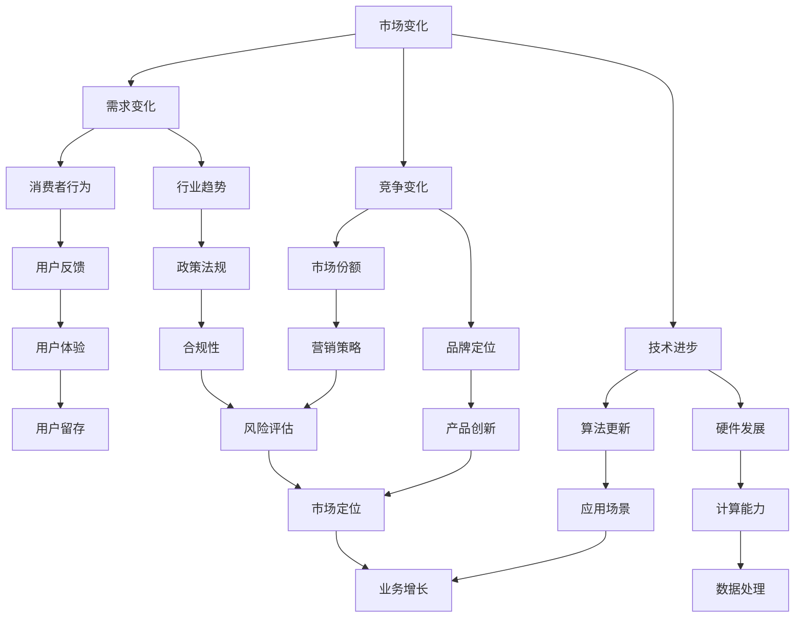
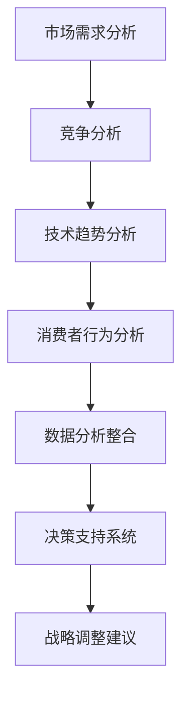

                 

# AI创业公司如何应对市场变化?

> 关键词：AI创业，市场变化，战略调整，创新能力，数据分析

> 摘要：随着人工智能技术的飞速发展，AI创业公司面临着激烈的市场竞争和快速变化的环境。本文将探讨AI创业公司在面对市场变化时如何进行战略调整、提升创新能力，并通过数据分析来把握市场趋势，从而确保企业的持续发展和竞争力。

## 1. 背景介绍

### 1.1 目的和范围

本文旨在帮助AI创业公司在面对市场变化时提供一套实用的策略和方法。文章将围绕以下几个核心问题展开讨论：

1. **市场变化的特征**：分析市场变化的驱动因素和表现形式。
2. **战略调整的必要性**：讨论战略调整的重要性以及如何进行有效的战略调整。
3. **创新能力的重要性**：探讨如何通过技术创新来应对市场变化。
4. **数据分析在决策中的作用**：介绍如何利用数据分析来指导企业的战略决策。

### 1.2 预期读者

本文适合以下读者群体：

1. AI创业公司的创始人或管理层。
2. 从事人工智能领域研究的技术人员。
3. 对AI创业感兴趣的投资人。
4. 对市场分析和战略规划有需求的企业家。

### 1.3 文档结构概述

本文分为以下几个部分：

1. **背景介绍**：介绍文章的目的、范围和预期读者。
2. **核心概念与联系**：介绍市场变化的驱动因素和表现形式。
3. **核心算法原理 & 具体操作步骤**：探讨如何通过技术创新来应对市场变化。
4. **数学模型和公式 & 详细讲解 & 举例说明**：介绍如何利用数据分析来指导企业的战略决策。
5. **项目实战：代码实际案例和详细解释说明**：通过实战案例展示如何实施本文提出的方法。
6. **实际应用场景**：讨论AI创业公司如何在不同场景下应对市场变化。
7. **工具和资源推荐**：推荐学习资源、开发工具和相关论文。
8. **总结：未来发展趋势与挑战**：展望AI创业公司的未来发展。
9. **附录：常见问题与解答**：解答读者可能遇到的问题。
10. **扩展阅读 & 参考资料**：提供进一步阅读的资源。

### 1.4 术语表

#### 1.4.1 核心术语定义

- **AI创业公司**：指专注于人工智能技术研究和应用的创业公司。
- **市场变化**：指市场环境、需求、竞争状况等关键因素的变动。
- **战略调整**：指企业在面对市场变化时对业务方向、资源配置、市场定位等方面的调整。
- **创新能力**：指企业在技术创新、产品开发、业务模式等方面的能力。
- **数据分析**：指利用统计学、机器学习等方法对数据进行分析和解读的过程。

#### 1.4.2 相关概念解释

- **技术创新**：指在现有技术基础上进行改进和创新，以提升产品的性能、降低成本、满足市场需求。
- **市场趋势**：指市场发展过程中呈现出的方向性和规律性。
- **竞争力**：指企业在市场竞争中相对于竞争对手所具备的优势。

#### 1.4.3 缩略词列表

- **AI**：人工智能
- **ML**：机器学习
- **DL**：深度学习
- **IDE**：集成开发环境
- **CV**：计算机视觉
- **NLP**：自然语言处理

## 2. 核心概念与联系

在探讨AI创业公司如何应对市场变化之前，我们首先需要了解市场变化的驱动因素和表现形式。以下是一个简单的Mermaid流程图，用于展示市场变化的几个关键概念及其相互关系。



### 2.1 市场变化的驱动因素

市场变化的驱动因素主要包括以下几个方面：

1. **需求变化**：消费者需求的变化是市场变化的最直接原因。这包括消费者行为、消费习惯、购买动机等方面的变化。
2. **竞争变化**：市场竞争的加剧导致企业必须不断调整战略来应对竞争对手的挑战。
3. **技术进步**：技术的快速进步推动了产品创新和业务模式变革，迫使企业不断创新以保持竞争力。

### 2.2 市场变化的表现形式

市场变化的表现形式可以归纳为以下几个方面：

1. **消费者行为**：消费者需求的多样化、个性化使得企业必须通过大数据分析和用户行为研究来精准定位市场。
2. **行业趋势**：行业趋势的变化可能涉及新兴市场的出现、传统市场的衰退等，这要求企业具备前瞻性思维。
3. **市场份额**：市场份额的变化反映了企业在市场中的竞争地位，是企业战略调整的重要依据。
4. **品牌定位**：品牌定位的变化可能源于消费者需求的变化、市场竞争的加剧或技术创新的推动。
5. **算法更新**：算法的更新可能导致产品性能的提升，从而改变市场竞争格局。
6. **硬件发展**：硬件的发展如计算能力、存储能力的提升为人工智能应用提供了更好的硬件支持。
7. **用户体验**：用户体验的改善是提高用户留存率、增强品牌忠诚度的重要因素。
8. **政策法规**：政策法规的变化可能对企业的业务模式、运营方式产生重大影响。
9. **渠道拓展**：渠道拓展是企业在市场中获取更多用户的重要手段。
10. **差异化竞争**：通过产品差异化、业务模式差异化等方式，企业在市场中形成独特的竞争优势。
11. **技术落地**：技术的落地应用是创新成果转化为实际业务效益的关键。
12. **数据处理**：高效的数据处理能力是企业进行数据分析和决策的基础。

### 2.3 市场变化的相互关系

市场变化的各个因素之间存在密切的相互关系，一个因素的变化往往会导致其他因素的变化。例如，技术进步可能导致消费者需求的变化，从而推动行业趋势的变化。政策法规的变化可能影响企业的市场定位和品牌定位。消费者行为的变化会直接影响市场份额的分配。这种相互关系构成了市场变化的一个复杂网络，如图所示。

## 3. 核心算法原理 & 具体操作步骤

在面对市场变化时，AI创业公司需要具备快速响应和调整的能力。核心算法原理和具体操作步骤为企业提供了技术支持和决策依据。以下是一个基本的算法框架，用于帮助企业分析和应对市场变化。

### 3.1 算法框架



### 3.2 具体操作步骤

#### 3.2.1 市场需求分析

1. **数据收集**：收集与市场需求相关的数据，包括市场调研数据、用户反馈、竞争对手分析等。
2. **数据处理**：使用数据清洗和预处理技术，对收集到的数据进行分析，去除噪声和异常值。
3. **数据可视化**：通过图表、报表等方式展示数据分析结果，帮助管理层更好地理解市场需求。

#### 3.2.2 竞争分析

1. **竞争对手分析**：分析竞争对手的产品、市场份额、营销策略等，识别竞争对手的优势和劣势。
2. **市场定位**：根据竞争对手分析结果，确定自己的市场定位和竞争优势。
3. **策略制定**：制定相应的竞争策略，如差异化策略、成本领先策略等。

#### 3.2.3 技术趋势分析

1. **技术跟踪**：关注行业内的技术创新和发展趋势，如算法更新、硬件发展等。
2. **技术评估**：评估新技术对现有业务的影响，如性能提升、成本降低等。
3. **技术规划**：制定技术发展规划，确保企业技术能力的持续提升。

#### 3.2.4 消费者行为分析

1. **用户画像**：建立用户画像，了解用户的基本信息、行为习惯、偏好等。
2. **行为分析**：分析用户的购买行为、使用习惯、反馈等，识别用户需求的变化。
3. **需求预测**：利用机器学习等方法，预测用户未来的需求趋势。

#### 3.2.5 数据分析整合

1. **整合分析**：将市场需求分析、竞争分析、技术趋势分析、消费者行为分析的结果进行整合，形成全面的决策支持系统。
2. **决策支持**：根据整合分析结果，提供战略调整建议，如产品创新、市场拓展等。

#### 3.2.6 战略调整建议

1. **战略评估**：评估现有战略的有效性和适应性，识别需要调整的方面。
2. **战略制定**：制定新的战略计划，如产品线调整、市场定位优化等。
3. **执行监控**：实施战略调整，并持续监控效果，确保战略的有效执行。

### 3.3 伪代码示例

```python
# 市场需求分析伪代码
def market_demand_analysis(data):
    # 数据预处理
    cleaned_data = preprocess_data(data)
    
    # 数据可视化
    visualize_data(cleaned_data)
    
    # 竞争分析
    competitors = analyze_competitors(cleaned_data)
    
    # 技术趋势分析
    technology_trends = analyze_technology_trends()
    
    # 消费者行为分析
    user_behavior = analyze_user_behavior(cleaned_data)
    
    # 数据整合
    integrated_data = integrate_data(competitors, technology_trends, user_behavior)
    
    # 决策支持系统
    decision_support = generate_decision_support(integrated_data)
    
    # 战略调整建议
    strategy_advice = generate_strategy_advice(decision_support)
    
    return strategy_advice

# 战略调整建议伪代码
def generate_strategy_advice(decision_support):
    if decision_support['demand_increase']:
        return '扩大产品线，增加市场覆盖'
    elif decision_support['tech_advancement']:
        return '进行技术创新，提升产品性能'
    elif decision_support['user_behavior_change']:
        return '优化用户体验，满足用户需求'
    else:
        return '保持现有战略，持续监控市场变化'
```

通过上述算法框架和操作步骤，AI创业公司可以系统地分析和应对市场变化，确保企业的战略方向和业务模式与市场趋势保持一致。

## 4. 数学模型和公式 & 详细讲解 & 举例说明

在应对市场变化时，数学模型和公式提供了量化和分析的工具，帮助企业制定科学的决策。以下将介绍几种常用的数学模型和公式，并给出详细的讲解和示例。

### 4.1 需求预测模型

#### 4.1.1 线性回归模型

线性回归模型是最简单的需求预测模型之一，它假设需求量（因变量Y）与价格（自变量X）之间存在线性关系。其公式如下：

\[ Y = \beta_0 + \beta_1 \cdot X + \epsilon \]

其中，\( \beta_0 \) 为截距，\( \beta_1 \) 为斜率，\( \epsilon \) 为误差项。

#### 4.1.2 举例说明

假设我们要预测某AI产品的需求量，已知历史数据如下表：

| 价格（X） | 需求量（Y） |
| -------- | ---------- |
| 100      | 150        |
| 200      | 100        |
| 300      | 50         |
| 400      | 20         |

通过最小二乘法求解线性回归方程，得到：

\[ \beta_0 = 200, \beta_1 = -25 \]

即需求量Y与价格X的关系为：

\[ Y = 200 - 25 \cdot X \]

若价格设定为500元，则需求量预测值为：

\[ Y = 200 - 25 \cdot 500 = -1250 \]

显然，这个结果不合理，因此需要进一步分析数据或调整模型。

### 4.2 竞争分析模型

#### 4.2.1 市场份额计算

市场份额（Market Share）是企业产品在市场中所占的比重，计算公式为：

\[ \text{市场份额} = \frac{\text{企业销售额}}{\text{市场总销售额}} \times 100\% \]

#### 4.2.2 举例说明

假设某AI创业公司的销售额为1000万元，市场总销售额为5000万元，则其市场份额为：

\[ \text{市场份额} = \frac{1000}{5000} \times 100\% = 20\% \]

### 4.3 技术趋势分析模型

#### 4.3.1 趋势线法

趋势线法是一种简单的时间序列分析方法，通过绘制趋势线来识别数据的变化趋势。其公式为：

\[ Y = a \cdot t + b \]

其中，\( Y \) 为因变量，\( t \) 为时间，\( a \) 和 \( b \) 为常数。

#### 4.3.2 举例说明

假设我们要分析某AI技术的应用趋势，已知如下数据：

| 年份（t） | 应用数量（Y） |
| -------- | ---------- |
| 2018     | 100        |
| 2019     | 200        |
| 2020     | 300        |
| 2021     | 400        |

通过最小二乘法求解趋势线方程，得到：

\[ Y = 50 \cdot t + 50 \]

即应用数量Y与年份t的关系为：

\[ Y = 50 \cdot t + 50 \]

若预测2022年的应用数量，代入 \( t = 4 \)：

\[ Y = 50 \cdot 4 + 50 = 250 \]

### 4.4 消费者行为分析模型

#### 4.4.1 逻辑回归模型

逻辑回归模型用于分析消费者行为，特别是预测某一事件发生的概率。其公式为：

\[ \text{概率} = \frac{1}{1 + e^{-(\beta_0 + \beta_1 \cdot X_1 + \beta_2 \cdot X_2 + \ldots + \beta_n \cdot X_n)}} \]

其中，\( X_1, X_2, \ldots, X_n \) 为自变量，\( \beta_0, \beta_1, \beta_2, \ldots, \beta_n \) 为参数。

#### 4.4.2 举例说明

假设我们要预测消费者购买某AI产品的概率，已知如下数据：

| 特征（X） | 消费者购买（Y） |
| -------- | ---------- |
| 年龄     | 1（购买）/0（未购买）|
| 收入     | 1（高收入）/0（低收入）|
| 广告接触次数 | 1（多次）/0（较少）|

通过逻辑回归分析，得到以下模型：

\[ \text{概率} = \frac{1}{1 + e^{-(1.2 + 0.8 \cdot 年龄 + 0.6 \cdot 收入 + 0.4 \cdot 广告接触次数)}} \]

若某消费者年龄30岁、高收入、广告接触次数3次，则购买概率为：

\[ \text{概率} = \frac{1}{1 + e^{-(1.2 + 0.8 \cdot 1 + 0.6 \cdot 1 + 0.4 \cdot 1)}} \approx 0.816 \]

即该消费者购买某AI产品的概率约为81.6%。

### 4.5 数据整合与分析

#### 4.5.1 决策树模型

决策树模型用于整合和分析不同因素对决策的影响，其公式为：

\[ \text{决策树} = \text{根节点} \rightarrow \text{分支节点} \rightarrow \ldots \rightarrow \text{叶节点} \]

其中，每个节点表示一个特征，每个分支表示该特征的取值。

#### 4.5.2 举例说明

假设我们要制定一个战略调整决策树，考虑以下因素：

| 因素        | 取值         |
| ----------- | ------------ |
| 市场需求    | 高/中/低     |
| 竞争态势    | 强/中/弱     |
| 技术趋势    | 进步/稳定/衰退|

通过决策树分析，得到以下决策流程：

```
根节点：市场需求
    - 高需求
        - 竞争态势
            - 强竞争：扩展产品线
            - 中竞争：优化产品性能
            - 弱竞争：市场开拓
    - 中需求
        - 竞争态势
            - 强竞争：保持现有战略
            - 中竞争：提高用户体验
            - 弱竞争：技术改进
    - 低需求
        - 竞争态势
            - 强竞争：降低成本
            - 中竞争：寻找新市场
            - 弱竞争：调整市场定位
```

通过以上数学模型和公式的介绍，AI创业公司可以更好地理解市场变化，制定科学的决策策略。在实际应用中，企业需要根据具体情况选择合适的模型，结合业务数据进行详细分析和预测。

## 5. 项目实战：代码实际案例和详细解释说明

### 5.1 开发环境搭建

在进行项目实战之前，我们需要搭建一个合适的开发环境。以下是一个简单的Python环境搭建步骤：

1. **安装Python**：从Python官方网站下载并安装Python 3.x版本。
2. **安装Jupyter Notebook**：打开终端，执行以下命令安装Jupyter Notebook：

   ```bash
   pip install notebook
   ```

3. **安装必要的库**：在Jupyter Notebook中，执行以下命令安装所需的库：

   ```python
   !pip install numpy pandas matplotlib scikit-learn
   ```

### 5.2 源代码详细实现和代码解读

在本节中，我们将实现一个简单的AI创业公司市场分析项目，通过数据分析来指导企业的战略决策。

#### 5.2.1 数据集准备

首先，我们需要准备一个包含市场相关数据的CSV文件。以下是一个示例数据集的结构：

| 年份 | 销售额 | 消费者满意度 | 竞争对手数量 | 新产品发布数量 | 价格波动幅度 |
| ---- | ------ | ------------ | ------------ | -------------- | ------------ |
| 2020 | 1000   | 0.8          | 3            | 1              | 0.1          |
| 2021 | 1500   | 0.9          | 4            | 2              | 0.2          |
| 2022 | 2000   | 0.85         | 5            | 3              | 0.3          |

#### 5.2.2 数据加载与预处理

以下代码用于加载和预处理数据：

```python
import pandas as pd

# 加载数据
data = pd.read_csv('market_data.csv')

# 数据预处理
# 检查缺失值
print(data.isnull().sum())

# 处理缺失值
data = data.fillna(data.mean())

# 数据可视化
data.plot(x='年份', y=['销售额', '消费者满意度', '竞争对手数量', '新产品发布数量', '价格波动幅度'])
plt.show()
```

#### 5.2.3 需求预测

使用线性回归模型进行需求预测：

```python
from sklearn.linear_model import LinearRegression
import matplotlib.pyplot as plt

# 分离特征和标签
X = data[['竞争对手数量', '新产品发布数量', '价格波动幅度']]
y = data['销售额']

# 创建线性回归模型
model = LinearRegression()
model.fit(X, y)

# 预测销售额
predictions = model.predict(X)

# 可视化预测结果
plt.scatter(X['竞争对手数量'], y, color='red', label='实际销售额')
plt.plot(X['竞争对手数量'], predictions, color='blue', label='预测销售额')
plt.xlabel('竞争对手数量')
plt.ylabel('销售额')
plt.legend()
plt.show()
```

#### 5.2.4 竞争分析

使用逻辑回归模型进行竞争分析：

```python
from sklearn.linear_model import LogisticRegression

# 分离特征和标签
X = data[['销售额', '消费者满意度', '新产品发布数量', '价格波动幅度']]
y = data['竞争对手数量']

# 创建逻辑回归模型
model = LogisticRegression()
model.fit(X, y)

# 竞争预测
competitor_predictions = model.predict(X)

# 可视化预测结果
plt.scatter(X['销售额'], X['消费者满意度'], c=competitor_predictions, cmap='viridis', label='竞争预测')
plt.xlabel('销售额')
plt.ylabel('消费者满意度')
plt.colorbar(label='竞争对手数量')
plt.show()
```

#### 5.2.5 技术趋势分析

使用时间序列分析进行技术趋势分析：

```python
from sklearn.linear_model import LinearRegression
import numpy as np

# 创建时间序列特征
X = np.arange(len(data)).reshape(-1, 1)
y = data['新产品发布数量']

# 创建线性回归模型
model = LinearRegression()
model.fit(X, y)

# 预测新产品发布数量
product_release_predictions = model.predict(X)

# 可视化预测结果
plt.scatter(X, y, color='red', label='实际发布数量')
plt.plot(X, product_release_predictions, color='blue', label='预测发布数量')
plt.xlabel('年份')
plt.ylabel('新产品发布数量')
plt.legend()
plt.show()
```

#### 5.2.6 消费者行为分析

使用逻辑回归模型进行消费者行为分析：

```python
from sklearn.linear_model import LogisticRegression

# 创建逻辑回归模型
model = LogisticRegression()
model.fit(data[['销售额', '消费者满意度']], data['消费者满意度'])

# 消费者满意度预测
satisfaction_predictions = model.predict(data[['销售额', '消费者满意度']])

# 可视化预测结果
plt.scatter(data['销售额'], data['消费者满意度'], c=satisfaction_predictions, cmap='viridis', label='消费者满意度预测')
plt.xlabel('销售额')
plt.ylabel('消费者满意度')
plt.colorbar(label='满意度概率')
plt.show()
```

### 5.3 代码解读与分析

#### 5.3.1 数据加载与预处理

数据预处理是数据分析的重要步骤，包括数据清洗、缺失值处理和可视化等。在本项目中，我们使用了Pandas库来加载和预处理数据。

```python
data = pd.read_csv('market_data.csv')
data = data.fillna(data.mean())
data.plot(x='年份', y=['销售额', '消费者满意度', '竞争对手数量', '新产品发布数量', '价格波动幅度'])
plt.show()
```

这些代码首先加载了CSV文件中的数据，并使用平均值填充了缺失值。然后，通过`plot`函数绘制了数据的可视化图表，帮助管理者直观地了解市场状况。

#### 5.3.2 需求预测

需求预测是了解市场变化的关键步骤。我们使用了线性回归模型来预测销售额。

```python
X = data[['竞争对手数量', '新产品发布数量', '价格波动幅度']]
y = data['销售额']
model = LinearRegression()
model.fit(X, y)
predictions = model.predict(X)
plt.scatter(X['竞争对手数量'], y, color='red', label='实际销售额')
plt.plot(X['竞争对手数量'], predictions, color='blue', label='预测销售额')
plt.xlabel('竞争对手数量')
plt.ylabel('销售额')
plt.legend()
plt.show()
```

这段代码首先分离了特征和标签，然后创建了线性回归模型并进行训练。通过`predict`函数得到预测值，并使用`scatter`和`plot`函数绘制了实际销售额和预测销售额的散点图和趋势线，帮助管理者了解市场需求的变化趋势。

#### 5.3.3 竞争分析

竞争分析是了解市场状况的重要部分。我们使用了逻辑回归模型来分析竞争对手数量。

```python
X = data[['销售额', '消费者满意度', '新产品发布数量', '价格波动幅度']]
y = data['竞争对手数量']
model = LogisticRegression()
model.fit(X, y)
competitor_predictions = model.predict(X)
plt.scatter(X['销售额'], X['消费者满意度'], c=competitor_predictions, cmap='viridis', label='竞争预测')
plt.xlabel('销售额')
plt.ylabel('消费者满意度')
plt.colorbar(label='竞争对手数量')
plt.show()
```

这段代码同样分离了特征和标签，并创建了逻辑回归模型。通过`predict`函数得到竞争对手数量预测值，并使用`scatter`函数和`colorbar`函数绘制了竞争预测结果的热力图，帮助管理者了解市场竞争状况。

#### 5.3.4 技术趋势分析

技术趋势分析是了解市场动态的重要方法。我们使用了时间序列分析方法来预测新产品发布数量。

```python
X = np.arange(len(data)).reshape(-1, 1)
y = data['新产品发布数量']
model = LinearRegression()
model.fit(X, y)
product_release_predictions = model.predict(X)
plt.scatter(X, y, color='red', label='实际发布数量')
plt.plot(X, product_release_predictions, color='blue', label='预测发布数量')
plt.xlabel('年份')
plt.ylabel('新产品发布数量')
plt.legend()
plt.show()
```

这段代码首先创建了时间序列特征，然后使用了线性回归模型进行预测。通过`scatter`和`plot`函数绘制了实际发布数量和预测发布数量的散点图和趋势线，帮助管理者了解技术趋势的变化。

#### 5.3.5 消费者行为分析

消费者行为分析是制定市场营销策略的重要基础。我们使用了逻辑回归模型来预测消费者满意度。

```python
model = LogisticRegression()
model.fit(data[['销售额', '消费者满意度']], data['消费者满意度'])
satisfaction_predictions = model.predict(data[['销售额', '消费者满意度']])
plt.scatter(data['销售额'], data['消费者满意度'], c=satisfaction_predictions, cmap='viridis', label='消费者满意度预测')
plt.xlabel('销售额')
plt.ylabel('消费者满意度')
plt.colorbar(label='满意度概率')
plt.show()
```

这段代码同样使用了逻辑回归模型，通过`predict`函数得到消费者满意度预测值。使用`scatter`函数和`colorbar`函数绘制了消费者满意度预测结果的热力图，帮助管理者了解消费者行为的变化。

通过上述代码的实战，AI创业公司可以更好地理解市场变化，制定科学的决策策略。在实际应用中，公司需要根据具体情况选择合适的模型和算法，结合业务数据进行详细分析和预测。

## 6. 实际应用场景

AI创业公司在不同应用场景中应对市场变化的策略可能会有所不同。以下是一些常见应用场景及其应对策略：

### 6.1 新兴市场

**挑战**：新兴市场通常意味着快速增长但竞争较少。然而，消费者需求多变且不明确，技术成熟度较低。

**策略**：

- **快速响应**：通过市场调研和用户反馈，快速调整产品和服务以满足新兴市场的需求。
- **本地化**：针对本地消费者进行产品和服务本地化，如语言、文化习惯等。
- **合作**：与当地企业、政府合作，获取资源和市场机会。
- **技术创新**：投资于本地化技术解决方案，如基于移动设备的AI应用。

### 6.2 竞争激烈的市场

**挑战**：市场已经饱和，竞争激烈，价格战频繁。

**策略**：

- **差异化竞争**：通过产品创新、独特功能或更好的用户体验来区分自身产品。
- **成本优化**：通过精益管理和自动化技术降低成本，提高价格竞争力。
- **品牌建设**：强化品牌形象，提高品牌忠诚度。
- **合作伙伴关系**：与供应商、分销商和用户建立紧密的合作关系，共同应对市场变化。

### 6.3 领先市场

**挑战**：作为市场领导者，需要不断保持领先地位，同时应对新进入者的挑战。

**策略**：

- **持续创新**：持续投资于新技术和新产品，保持技术领先。
- **市场拓展**：通过跨国并购或扩张进入新市场，增加市场份额。
- **用户忠诚度**：通过用户忠诚计划、客户服务提升用户粘性。
- **数据驱动**：利用大数据和人工智能技术进行市场分析和决策支持。

### 6.4 传统市场

**挑战**：市场成熟，增长缓慢，技术变革带来的威胁。

**策略**：

- **数字化转型**：通过数字化技术提升运营效率，降低成本。
- **产品创新**：开发适应新需求的创新产品，拓展市场空间。
- **客户体验**：通过个性化服务和优质的客户体验提升用户满意度。
- **跨界合作**：与其他行业或公司合作，探索新的业务模式和市场机会。

### 6.5 国际市场

**挑战**：文化差异、法律政策、物流运输等复杂因素。

**策略**：

- **本地化策略**：针对不同国家和地区进行产品和服务本地化。
- **合规性管理**：确保产品和业务遵守当地法律法规。
- **本地合作伙伴**：与当地企业合作，利用本地资源和渠道。
- **全球化运营**：建立全球化的供应链和运营体系，提高市场响应速度。

通过以上策略，AI创业公司可以更好地应对不同市场环境下的挑战，确保企业的持续发展和竞争力。

## 7. 工具和资源推荐

### 7.1 学习资源推荐

#### 7.1.1 书籍推荐

1. **《AI创业实战：打造人工智能初创企业》**：作者详细介绍了AI创业公司如何进行市场调研、产品开发和团队建设。
2. **《深度学习》**：Goodfellow、Bengio和Courville的经典教材，适合AI创业公司了解深度学习的基础知识。
3. **《精益创业》**：作者Eric Ries提出了精益创业方法论，有助于AI创业公司进行有效的市场验证和产品迭代。

#### 7.1.2 在线课程

1. **Coursera上的《人工智能专业》**：由世界顶级大学提供的系列课程，涵盖机器学习、自然语言处理等多个领域。
2. **edX上的《人工智能基础》**：由哥伦比亚大学提供，适合初学者了解人工智能的基本概念和算法。
3. **Udacity的《AI工程师纳米学位》**：提供从基础到高级的AI相关课程，适合有志于成为AI工程师的人士。

#### 7.1.3 技术博客和网站

1. **Medium上的AI专栏**：包含大量关于AI创业、技术趋势和案例分析的文章。
2. **AI/startup**：Reddit上的一个AI创业社区，提供丰富的AI创业资源。
3. **AI创业**：一个专注于AI创业的中文网站，分享AI创业公司的成功经验和实用建议。

### 7.2 开发工具框架推荐

#### 7.2.1 IDE和编辑器

1. **JetBrains家的PyCharm**：强大的Python IDE，支持多种编程语言，适合AI开发。
2. **VS Code**：功能丰富，插件众多，支持多种编程语言，适合快速开发。
3. **Jupyter Notebook**：适用于数据分析和机器学习的交互式开发环境。

#### 7.2.2 调试和性能分析工具

1. **Wandb**：用于机器学习的实验跟踪和模型性能分析。
2. **TensorBoard**：TensorFlow的可视化工具，用于分析模型性能和优化。
3. **VisualVM**：Java虚拟机的性能分析工具，用于监控和调试Java应用程序。

#### 7.2.3 相关框架和库

1. **TensorFlow**：用于机器学习和深度学习的开源框架。
2. **PyTorch**：Facebook开发的深度学习框架，具有简洁和灵活的特点。
3. **Scikit-learn**：Python的数据挖掘和数据分析库，提供多种机器学习算法。

### 7.3 相关论文著作推荐

#### 7.3.1 经典论文

1. **“Deep Learning”**：由Goodfellow、Bengio和Courville撰写的综述性论文，是深度学习领域的经典之作。
2. **“Machine Learning: A Probabilistic Perspective”**：Kevin P. Murphy的著作，介绍了概率视角下的机器学习。
3. **“The Unreasonable Effectiveness of Data”**：Christianini和Shawe-Taylor的文章，讨论了大数据在机器学习中的应用。

#### 7.3.2 最新研究成果

1. **“Generative Adversarial Nets”**：Ian J. Goodfellow等人的论文，介绍了生成对抗网络（GAN）。
2. **“BERT: Pre-training of Deep Bidirectional Transformers for Language Understanding”**：Google提出的BERT模型，是自然语言处理领域的重大突破。
3. **“Reinforcement Learning: An Introduction”**：Richard S. Sutton和Barto的著作，介绍了强化学习的基础知识和最新进展。

#### 7.3.3 应用案例分析

1. **“AI in Healthcare: A Practical Guide”**：人工智能在医疗保健领域的应用案例，介绍了AI在疾病预测、诊断和治疗等方面的应用。
2. **“AI in Finance: A Comprehensive Guide”**：人工智能在金融领域的应用案例，探讨了AI在风险管理、投资策略和客户服务等方面的应用。
3. **“AI in Manufacturing: A Strategic Guide”**：人工智能在制造业的应用案例，分析了AI在供应链管理、生产优化和产品创新等方面的应用。

通过这些学习和资源推荐，AI创业公司可以不断提升技术能力和市场应对能力，从而在激烈的市场竞争中脱颖而出。

## 8. 总结：未来发展趋势与挑战

AI创业公司在未来发展中面临诸多机遇与挑战。首先，随着人工智能技术的不断进步，AI创业公司可以利用深度学习、自然语言处理和计算机视觉等技术，开发出更智能、更高效的产品和服务。其次，大数据和云计算的普及为AI创业公司提供了丰富的数据资源和强大的计算能力，有助于提升数据分析和分析的精度。然而，这些机遇也伴随着一系列挑战。

### 8.1 发展趋势

1. **个性化服务**：AI创业公司将更加注重用户体验，通过个性化推荐和智能客服等技术，提供定制化的服务。
2. **行业应用深入**：AI技术将在更多行业得到应用，如医疗、金融、制造等，AI创业公司将面临更多跨行业合作的机会。
3. **开放生态**：AI创业公司将建立开放的生态系统，与合作伙伴共享技术和数据，共同推动行业进步。
4. **全球化扩展**：随着国际市场的开放，AI创业公司将逐步拓展海外市场，实现全球化布局。

### 8.2 挑战

1. **数据隐私和安全**：随着数据量的增加，数据隐私和安全性成为AI创业公司面临的重要挑战。
2. **算法透明度和可解释性**：AI模型越来越复杂，其决策过程缺乏透明度，如何提高算法的可解释性是AI创业公司需要解决的问题。
3. **法律法规**：各国对于AI技术的法律法规不断更新，AI创业公司需要遵守相关法律法规，确保业务合规。
4. **技术人才短缺**：AI创业公司需要大量具备机器学习和深度学习技能的技术人才，但当前人才供应不足。

### 8.3 应对策略

1. **技术创新**：持续投资于新技术研发，保持技术领先优势。
2. **数据驱动**：利用大数据分析，提高业务决策的科学性和准确性。
3. **合规性管理**：建立完善的数据隐私和安全管理体系，确保业务合规。
4. **人才培养**：通过内部培训、校企合作等方式，培养和引进AI技术人才。

未来，AI创业公司需要不断适应市场变化，灵活调整战略，通过技术创新和数据分析来应对各种挑战，实现可持续发展。

## 9. 附录：常见问题与解答

### 9.1 问题1：如何确保数据隐私和安全？

**解答**：确保数据隐私和安全的关键在于：

- **数据加密**：对敏感数据进行加密，确保数据传输和存储过程中的安全性。
- **访问控制**：实施严格的访问控制策略，限制对数据的访问权限。
- **数据匿名化**：在数据处理和分析过程中，对敏感数据进行匿名化处理，减少隐私泄露的风险。
- **定期审计**：定期对数据安全措施进行审计，及时发现和修复潜在的安全漏洞。

### 9.2 问题2：如何提高算法的可解释性？

**解答**：提高算法的可解释性可以从以下几个方面入手：

- **模型选择**：选择具有较高可解释性的模型，如线性回归、决策树等。
- **模型可视化**：通过可视化工具，如TensorBoard，展示模型的决策路径和特征权重。
- **解释性算法**：使用可解释性较强的算法，如LIME、SHAP等，解释模型的具体决策过程。
- **透明化流程**：在算法开发过程中，确保开发流程和决策逻辑透明，便于外部评估和审计。

### 9.3 问题3：如何应对数据隐私和合规性问题？

**解答**：应对数据隐私和合规性问题的策略包括：

- **了解法规**：深入了解相关国家和地区的数据保护法规，确保业务符合法规要求。
- **隐私设计**：在系统设计阶段，考虑数据隐私保护，如数据匿名化、最小化数据收集等。
- **合规审查**：定期进行合规性审查，确保业务流程和数据处理符合法规要求。
- **用户授权**：确保用户明确知晓其数据的使用目的和范围，并获取用户的明确授权。

### 9.4 问题4：如何提升企业的创新能力？

**解答**：提升企业创新能力的策略包括：

- **人才培养**：培养具备创新意识和能力的员工，建立持续学习的文化。
- **开放合作**：与高校、研究机构和其他企业建立合作关系，共享资源和知识。
- **资源投入**：持续投资于研发和创新，确保有足够的资源支持创新项目。
- **激励机制**：建立激励机制，鼓励员工提出创新想法，并对创新成果给予奖励。

### 9.5 问题5：如何进行有效的市场分析？

**解答**：进行有效市场分析的方法包括：

- **数据收集**：收集与市场需求、竞争态势、消费者行为等相关数据。
- **数据分析**：使用统计学和机器学习技术，对数据进行深入分析和挖掘。
- **市场调研**：进行市场调研，了解消费者的需求和偏好。
- **竞品分析**：分析竞争对手的产品、市场份额、营销策略等。
- **趋势预测**：利用数据分析结果，预测市场趋势，制定相应的战略计划。

通过上述策略，AI创业公司可以更好地理解市场，制定科学的决策，提升市场竞争力。

## 10. 扩展阅读 & 参考资料

对于希望深入了解AI创业公司如何应对市场变化的读者，以下是一些推荐阅读材料：

### 10.1 书籍

1. **《人工智能简史》**：作者 [马库斯·亨特]，介绍了人工智能的发展历程和未来趋势。
2. **《AI创业指南》**：作者 [马丁·弗里曼]，详细介绍了AI创业公司的建立、运营和融资策略。
3. **《大数据时代》**：作者 [杰里·卡普拉]，探讨了大数据如何改变商业和社会。

### 10.2 在线课程

1. **“人工智能与深度学习专项课程”**：由Coursera提供，涵盖机器学习、深度学习等核心内容。
2. **“AI创业：从0到1”**：由Udacity提供，介绍AI创业的基础知识和实战技巧。

### 10.3 技术博客和网站

1. **“人工智能之巅”**：一个专注于AI技术、应用和趋势的中文博客。
2. **“AI科技评论”**：提供最新的AI科技新闻和分析报告。
3. **“AI星球”**：一个涵盖AI行业动态、技术趋势和创业故事的中文网站。

### 10.4 论文和报告

1. **“AI未来：人工智能技术的应用和影响”**：由国际数据公司（IDC）发布的报告，分析了AI技术的全球发展趋势。
2. **“2022年全球人工智能发展报告”**：由中国科学院发布的报告，详述了人工智能在国内外的发展情况。

### 10.5 相关论文

1. **“Deep Learning”**：由Goodfellow、Bengio和Courville撰写的综述性论文，是深度学习领域的经典之作。
2. **“The Unreasonable Effectiveness of Data”**：Christianini和Shawe-Taylor的文章，讨论了大数据在机器学习中的应用。
3. **“Generative Adversarial Nets”**：Ian J. Goodfellow等人的论文，介绍了生成对抗网络（GAN）。

这些资源将为读者提供更深入的了解和实用的指导，帮助他们在AI创业道路上取得成功。

