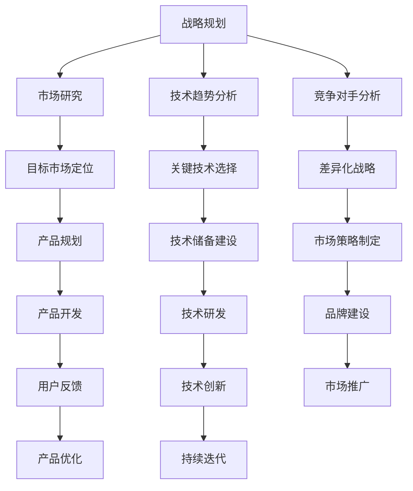

                 

# AI创业公司如何应对技术变革？

> 关键词：AI创业，技术变革，战略规划，团队建设，创新实践

> 摘要：随着人工智能技术的飞速发展，AI创业公司面临着前所未有的机遇和挑战。本文将深入探讨AI创业公司在技术变革背景下如何制定战略规划、优化团队建设以及开展创新实践，以在激烈的市场竞争中立于不败之地。

## 1. 背景介绍

### 1.1 目的和范围

本文旨在为AI创业公司提供一套系统的应对策略，帮助它们在技术变革的浪潮中抓住机遇，克服挑战。本文将涵盖以下几个方面：

1. **战略规划**：分析AI创业公司的战略目标，探讨如何制定适应技术变革的战略规划。
2. **团队建设**：讨论如何构建一支高效、创新的团队，以及团队成员的培养和发展。
3. **创新实践**：介绍AI创业公司在产品开发和技术研究中的创新实践方法。

### 1.2 预期读者

本文预期读者包括：

1. AI创业公司的创始人、CTO和高层管理者。
2. 拥有AI技术背景的研发人员和技术经理。
3. 对AI创业和技术变革感兴趣的从业者。

### 1.3 文档结构概述

本文分为以下几部分：

1. **背景介绍**：介绍文章的目的和预期读者。
2. **核心概念与联系**：阐述AI技术变革的核心概念和架构。
3. **核心算法原理 & 具体操作步骤**：讲解AI技术的核心算法原理和具体实施步骤。
4. **数学模型和公式 & 详细讲解 & 举例说明**：介绍AI技术的数学模型和公式，并通过实例进行详细讲解。
5. **项目实战：代码实际案例和详细解释说明**：通过实际案例展示AI技术的应用。
6. **实际应用场景**：分析AI技术在各个领域的应用。
7. **工具和资源推荐**：推荐相关学习资源、开发工具和经典论文。
8. **总结：未来发展趋势与挑战**：总结AI创业公司的未来发展前景。
9. **附录：常见问题与解答**：解答读者可能遇到的常见问题。
10. **扩展阅读 & 参考资料**：提供更多深入阅读的资源。

### 1.4 术语表

#### 1.4.1 核心术语定义

- AI创业公司：以人工智能技术为核心，旨在开发创新产品的初创企业。
- 技术变革：指在某一技术领域内，由于新技术、新方法的出现，导致原有技术和市场格局发生重大变化。
- 战略规划：企业为实现长期发展目标而制定的总体规划和行动方案。
- 团队建设：指通过建立和完善团队的组织结构、沟通机制、激励制度等，提高团队的协作效率和创新能力。

#### 1.4.2 相关概念解释

- **人工智能**：人工智能是一门研究如何让计算机模拟、延伸和扩展人类智能的科学。它包括机器学习、深度学习、自然语言处理等多个子领域。
- **机器学习**：一种让计算机通过数据学习模式、进行决策和预测的技术。它包括监督学习、无监督学习、强化学习等多种学习方法。
- **深度学习**：一种基于多层神经网络的人工智能技术，通过训练大量数据来学习特征和模式，广泛应用于图像识别、语音识别等领域。

#### 1.4.3 缩略词列表

- AI：人工智能
- ML：机器学习
- DL：深度学习
- CTO：首席技术官
- R&D：研究与开发
- IDE：集成开发环境
- API：应用程序编程接口

## 2. 核心概念与联系

在AI创业公司的技术变革中，核心概念和架构的紧密联系至关重要。下面，我们将通过一个Mermaid流程图来展示这些核心概念和架构之间的关系。



### 2.1 战略规划与市场研究

**市场研究**是战略规划的基石。通过对市场趋势、竞争对手和用户需求的深入分析，AI创业公司可以明确自身在市场中的定位和目标。具体步骤包括：

1. **市场趋势分析**：通过研究行业报告、学术论文和市场数据，了解当前市场的发展趋势。
2. **竞争对手分析**：分析竞争对手的产品、市场策略和优势，找到自身差异化的方向。
3. **目标市场定位**：确定公司产品的目标用户群体，制定针对性的市场策略。

### 2.2 技术趋势分析

**技术趋势分析**是战略规划中的关键环节。AI创业公司需要关注以下方面：

1. **关键技术选择**：根据市场需求和公司优势，选择合适的技术方向，如深度学习、自然语言处理等。
2. **技术储备建设**：持续关注前沿技术，提前布局，为未来的技术迭代做好储备。

### 2.3 市场策略制定

**市场策略制定**是基于市场研究和技术趋势分析的结果，制定具体的营销、推广和品牌建设策略。包括：

1. **差异化战略**：通过产品特性、技术优势等差异化要素，在市场中树立独特品牌形象。
2. **市场推广**：利用多种渠道进行市场推广，如社交媒体、广告、展会等。
3. **品牌建设**：通过品牌定位、品牌形象设计等手段，提升品牌知名度和美誉度。

## 3. 核心算法原理 & 具体操作步骤

在AI创业公司的技术变革中，核心算法原理的深入理解和具体操作步骤的清晰掌握至关重要。以下将详细讲解AI创业公司应如何应对技术变革中的核心算法原理和具体操作步骤。

### 3.1 机器学习算法原理

**机器学习**是人工智能领域的重要分支，其基本原理是通过训练大量数据，让计算机自动学习和发现数据中的模式和规律。以下是一个典型的机器学习算法原理：

**监督学习**：监督学习是机器学习的一种类型，它通过输入特征（X）和标签（Y）来训练模型。训练过程的目标是最小化预测结果与实际结果之间的差距，即损失函数（Loss Function）。

**伪代码**：

```python
# 初始化模型参数
model_params = initialize_params()

# 定义损失函数
loss_function = compute_loss(Y, prediction)

# 定义优化器
optimizer = optimize_params(model_params, loss_function)

# 梯度下降
for epoch in range(num_epochs):
    # 前向传播
    prediction = forward_pass(X, model_params)
    
    # 计算损失
    loss = loss_function(Y, prediction)
    
    # 反向传播
    gradients = backward_pass(X, Y, prediction)
    
    # 更新模型参数
    model_params = optimizer.update_params(model_params, gradients)
    
    # 打印当前epoch的损失
    print(f"Epoch {epoch}: Loss = {loss}")
```

### 3.2 深度学习算法原理

**深度学习**是基于多层神经网络的人工智能技术，通过逐层提取数据中的特征，实现高层次的抽象表示。以下是深度学习算法的基本原理：

**多层感知器（MLP）**：多层感知器是深度学习的基础模型，它由输入层、隐藏层和输出层组成。每一层神经元通过激活函数（如ReLU、Sigmoid、Tanh）对输入数据进行非线性变换。

**伪代码**：

```python
# 初始化神经网络结构
num_inputs = num_neurons(in_layer)
num_hidden = num_neurons(hid_layer)
num_outputs = num_neurons(out_layer)

# 初始化权重和偏置
weights = initialize_weights(num_inputs, num_hidden)
bias = initialize_bias(num_hidden)

# 定义激活函数
activation_function = ReLU()

# 定义损失函数
loss_function = compute_loss(Y, prediction)

# 定义优化器
optimizer = optimize_params(weights, bias, loss_function)

# 梯度下降
for epoch in range(num_epochs):
    # 前向传播
    hidden_layer = forward_pass(input_data, weights, bias, activation_function)
    output_layer = forward_pass(hidden_layer, weights, bias, activation_function)
    
    # 计算损失
    loss = loss_function(Y, output_layer)
    
    # 反向传播
    gradients = backward_pass(input_data, Y, hidden_layer, output_layer, activation_function)
    
    # 更新权重和偏置
    weights, bias = optimizer.update_params(weights, bias, gradients)
    
    # 打印当前epoch的损失
    print(f"Epoch {epoch}: Loss = {loss}")
```

### 3.3 自然语言处理算法原理

**自然语言处理（NLP）**是人工智能领域的另一个重要分支，旨在让计算机理解和处理自然语言。以下是NLP算法的基本原理：

**词向量表示**：词向量是一种将单词映射到高维空间中向量的技术，常见的方法有Word2Vec、GloVe等。词向量能够捕捉单词的语义信息，为NLP任务提供有效的特征表示。

**循环神经网络（RNN）**：循环神经网络是一种处理序列数据的神经网络，通过内部状态记忆，能够捕捉序列中的长期依赖关系。常见的RNN变种有LSTM、GRU等。

**伪代码**：

```python
# 初始化词向量嵌入层
word_embeddings = initialize_embeddings(vocab_size, embedding_size)

# 定义RNN模型
input_data = pad_sequences(input_sentences, maxlen=max_sequence_length)
rnn_model = RNN(input_data, word_embeddings, hidden_size)

# 定义损失函数和优化器
loss_function = compute_loss(Y, prediction)
optimizer = optimize_params(rnn_model.parameters(), loss_function)

# 梯度下降
for epoch in range(num_epochs):
    # 前向传播
    hidden_state, cell_state = forward_pass(input_data, rnn_model)
    
    # 计算损失
    loss = loss_function(Y, hidden_state)
    
    # 反向传播
    gradients = backward_pass(input_data, Y, hidden_state, cell_state)
    
    # 更新模型参数
    optimizer.update_params(rnn_model.parameters(), gradients)
    
    # 打印当前epoch的损失
    print(f"Epoch {epoch}: Loss = {loss}")
```

通过以上算法原理的讲解，AI创业公司可以深入理解并掌握机器学习、深度学习和自然语言处理等核心技术，为应对技术变革提供坚实的理论基础。

## 4. 数学模型和公式 & 详细讲解 & 举例说明

在人工智能技术变革中，数学模型和公式的作用至关重要。以下我们将详细讲解几个核心数学模型和公式，并通过实例进行说明。

### 4.1 损失函数

损失函数是机器学习中用于评估模型预测效果的重要工具。常见的损失函数有均方误差（MSE）、交叉熵损失（Cross Entropy Loss）等。

**均方误差（MSE）**：

$$
MSE = \frac{1}{n}\sum_{i=1}^{n}(Y_i - \hat{Y}_i)^2
$$

其中，$Y_i$是实际值，$\hat{Y}_i$是预测值，$n$是样本数量。

**实例**：假设我们有一个包含5个样本的数据集，其中实际值和预测值如下：

| 样本 | 实际值($Y_i$) | 预测值($\hat{Y}_i$) |
|------|------------|--------------|
| 1    | 2.0        | 2.1          |
| 2    | 3.0        | 3.0          |
| 3    | 4.0        | 4.2          |
| 4    | 5.0        | 4.8          |
| 5    | 6.0        | 5.5          |

计算MSE：

$$
MSE = \frac{1}{5}\sum_{i=1}^{5}(Y_i - \hat{Y}_i)^2 = \frac{1}{5}[(2.0-2.1)^2 + (3.0-3.0)^2 + (4.0-4.2)^2 + (5.0-4.8)^2 + (6.0-5.5)^2] = 0.06
$$

### 4.2 激活函数

激活函数是神经网络中用于引入非线性特性的关键组件。常见的激活函数有ReLU、Sigmoid、Tanh等。

**ReLU（Rectified Linear Unit）激活函数**：

$$
f(x) = \max(0, x)
$$

**实例**：给定一个输入值序列：

| 输入值($x$) | 激活值($f(x)$) |
|-------------|--------------|
| -2.0        | 0            |
| 1.5         | 1.5          |
| -3.0        | 0            |
| 4.0         | 4.0          |

### 4.3 优化算法

优化算法是用于更新模型参数的关键技术。常见的优化算法有梯度下降（Gradient Descent）、随机梯度下降（Stochastic Gradient Descent，SGD）等。

**梯度下降算法**：

$$
\theta_{\text{new}} = \theta_{\text{old}} - \alpha \cdot \nabla_\theta J(\theta)
$$

其中，$\theta$是模型参数，$\alpha$是学习率，$J(\theta)$是损失函数。

**实例**：假设我们有一个损失函数：

$$
J(\theta) = (y - \theta \cdot x)^2
$$

给定初始参数$\theta_0 = 1$，学习率$\alpha = 0.1$，输入值$x = 2$，实际值$y = 1$。

**迭代1**：

$$
\nabla_\theta J(\theta) = -2 \cdot (1 - 1 \cdot 2) = -2
$$

$$
\theta_1 = 1 - 0.1 \cdot (-2) = 1.2
$$

**迭代2**：

$$
\nabla_\theta J(\theta) = -2 \cdot (1 - 1.2 \cdot 2) = -2.8
$$

$$
\theta_2 = 1.2 - 0.1 \cdot (-2.8) = 1.38
$$

通过以上实例，我们可以看到如何使用梯度下降算法来更新模型参数，从而最小化损失函数。

## 5. 项目实战：代码实际案例和详细解释说明

在本节中，我们将通过一个实际项目案例来展示AI创业公司如何应用所学的技术进行产品开发。以下是一个基于深度学习的图像分类项目，我们将从开发环境搭建、源代码实现和代码解读与分析三个方面进行详细说明。

### 5.1 开发环境搭建

为了顺利进行项目开发，我们需要搭建一个合适的开发环境。以下是搭建开发环境的步骤：

1. **安装Python环境**：确保Python版本为3.7或更高，可以通过官方网站下载安装包。
2. **安装深度学习框架**：选择一个合适的深度学习框架，如TensorFlow或PyTorch。以下以TensorFlow为例进行安装：

```bash
pip install tensorflow
```

3. **安装必要的依赖库**：包括NumPy、Pandas、Matplotlib等，可以通过以下命令安装：

```bash
pip install numpy pandas matplotlib
```

4. **配置GPU支持**：如果需要使用GPU进行训练，需要安装CUDA和cuDNN库。具体安装方法请参考相应官方文档。

### 5.2 源代码详细实现和代码解读

以下是本项目的主要代码实现和解读：

```python
import tensorflow as tf
from tensorflow.keras import layers
from tensorflow.keras.preprocessing.image import ImageDataGenerator

# 5.2.1 数据预处理

# 加载和分割数据集
(train_images, train_labels), (test_images, test_labels) = tf.keras.datasets.cifar10.load_data()

# 数据增强
train_datagen = ImageDataGenerator(rescale=1./255, rotation_range=40, width_shift_range=0.2,
                                   height_shift_range=0.2, shear_range=0.2, zoom_range=0.2,
                                   horizontal_flip=True, fill_mode='nearest')
test_datagen = ImageDataGenerator(rescale=1./255)

# 应用数据增强
train_images = train_datagen.flow(train_images, train_labels, batch_size=32)
test_images = test_datagen.flow(test_images, test_labels, batch_size=32)

# 5.2.2 模型构建

# 构建卷积神经网络
model = tf.keras.Sequential([
    layers.Conv2D(32, (3, 3), activation='relu', input_shape=(32, 32, 3)),
    layers.MaxPooling2D((2, 2)),
    layers.Conv2D(64, (3, 3), activation='relu'),
    layers.MaxPooling2D((2, 2)),
    layers.Conv2D(64, (3, 3), activation='relu'),
    layers.Flatten(),
    layers.Dense(64, activation='relu'),
    layers.Dense(10, activation='softmax')
])

# 编译模型
model.compile(optimizer='adam',
              loss='sparse_categorical_crossentropy',
              metrics=['accuracy'])

# 5.2.3 训练模型

# 训练模型
model.fit(train_images, epochs=10, validation_data=test_images)

# 5.2.4 评估模型

# 评估模型
test_loss, test_acc = model.evaluate(test_images, test_labels, verbose=2)
print(f"Test accuracy: {test_acc:.4f}")

# 5.2.5 预测

# 预测
predictions = model.predict(test_images)
predicted_labels = np.argmax(predictions, axis=1)

# 打印预测结果
print(predicted_labels)
```

**代码解读与分析**：

1. **数据预处理**：
    - 加载CIFAR-10数据集，并进行数据增强。数据增强可以提高模型的泛化能力，防止过拟合。
    - 使用ImageDataGenerator对训练和测试数据集进行预处理，包括数据归一化、随机旋转、平移、剪裁和水平翻转等。

2. **模型构建**：
    - 构建一个包含卷积层、池化层、全连接层的卷积神经网络（Convolutional Neural Network，CNN）。CNN在图像分类任务中表现优异。
    - 模型结构为：32x32分辨率、3个颜色通道的输入，经过3个卷积层、2个池化层、1个全连接层，最后输出10个类别。

3. **模型编译**：
    - 使用adam优化器和sparse_categorical_crossentropy损失函数进行编译。
    - 设置评价指标为accuracy，用于评估模型的分类准确率。

4. **模型训练**：
    - 使用fit函数对模型进行训练，指定训练轮次为10轮，并将测试数据集作为验证数据。

5. **模型评估**：
    - 使用evaluate函数对模型进行评估，输出测试集的损失和准确率。

6. **模型预测**：
    - 使用predict函数对测试数据进行预测，并将预测结果转换为类别标签。

通过以上项目实战，AI创业公司可以了解如何利用深度学习技术进行图像分类任务，掌握模型构建、数据预处理、模型训练和评估等关键步骤。

### 5.3 代码解读与分析

在本节中，我们将对项目实战中的代码进行详细解读与分析。

**1. 数据预处理**

```python
train_datagen = ImageDataGenerator(rescale=1./255, rotation_range=40, width_shift_range=0.2,
                                   height_shift_range=0.2, shear_range=0.2, zoom_range=0.2,
                                   horizontal_flip=True, fill_mode='nearest')
test_datagen = ImageDataGenerator(rescale=1./255)

train_images = train_datagen.flow(train_images, train_labels, batch_size=32)
test_images = test_datagen.flow(test_images, test_labels, batch_size=32)
```

- `ImageDataGenerator`是一个用于数据增强的类，通过它我们可以对图像进行归一化、旋转、平移、剪裁、水平翻转等操作。
- `rescale`参数用于将图像数据缩放到0到1之间，便于模型处理。
- `rotation_range`、`width_shift_range`、`height_shift_range`、`shear_range`、`zoom_range`和`horizontal_flip`参数用于设置数据增强的随机变换范围。
- `fill_mode`用于指定图像填充方式，这里使用`nearest`。

**2. 模型构建**

```python
model = tf.keras.Sequential([
    layers.Conv2D(32, (3, 3), activation='relu', input_shape=(32, 32, 3)),
    layers.MaxPooling2D((2, 2)),
    layers.Conv2D(64, (3, 3), activation='relu'),
    layers.MaxPooling2D((2, 2)),
    layers.Conv2D(64, (3, 3), activation='relu'),
    layers.Flatten(),
    layers.Dense(64, activation='relu'),
    layers.Dense(10, activation='softmax')
])
```

- `Sequential`是一个用于构建序列模型的类，通过它我们可以将多个层按顺序连接起来。
- `Conv2D`层是一个卷积层，用于提取图像特征。参数包括过滤器大小、激活函数和输入形状。
- `MaxPooling2D`层是一个最大池化层，用于降低特征维度并减少模型参数。
- `Flatten`层将多维特征展平为一维向量，便于全连接层处理。
- `Dense`层是一个全连接层，用于分类任务。最后一层的激活函数为`softmax`，用于输出概率分布。

**3. 模型编译**

```python
model.compile(optimizer='adam',
              loss='sparse_categorical_crossentropy',
              metrics=['accuracy'])
```

- `compile`函数用于编译模型，设置优化器、损失函数和评价指标。
- `adam`是一个常用的优化器，具有自适应学习率的特点。
- `sparse_categorical_crossentropy`是一个用于多分类任务的损失函数。
- `accuracy`是一个用于评估模型分类准确率的评价指标。

**4. 模型训练**

```python
model.fit(train_images, epochs=10, validation_data=test_images)
```

- `fit`函数用于训练模型，指定训练轮次和验证数据。
- `epochs`参数用于设置训练轮次，即模型将在整个训练数据集上迭代训练多次。
- `validation_data`参数用于设置验证数据，用于评估模型在验证数据集上的性能。

**5. 模型评估**

```python
test_loss, test_acc = model.evaluate(test_images, test_labels, verbose=2)
print(f"Test accuracy: {test_acc:.4f}")
```

- `evaluate`函数用于评估模型在测试数据集上的性能。
- `verbose`参数用于设置输出信息级别，这里设置为2，会打印评估过程中的详细信息。

**6. 模型预测**

```python
predictions = model.predict(test_images)
predicted_labels = np.argmax(predictions, axis=1)
print(predicted_labels)
```

- `predict`函数用于对测试数据进行预测。
- `np.argmax`函数用于将预测结果转换为类别标签。
- 打印预测结果，以验证模型性能。

通过以上代码解读与分析，我们可以全面了解AI创业公司在项目开发中如何应用深度学习技术，掌握从数据预处理、模型构建到模型训练和评估的完整流程。

## 6. 实际应用场景

随着人工智能技术的不断发展，AI创业公司在各个领域的实际应用场景越来越广泛。以下我们将分析几个典型应用领域，探讨AI创业公司如何在这些场景中取得成功。

### 6.1 医疗健康

在医疗健康领域，AI创业公司可以利用深度学习和自然语言处理技术，实现病患诊断、药物研发、医疗影像分析等创新应用。

- **病患诊断**：通过分析大量病患数据和医学文献，AI算法可以帮助医生更准确地诊断疾病，提高诊疗效率。
- **药物研发**：AI可以预测药物与生物体的相互作用，加速新药研发过程。
- **医疗影像分析**：利用深度学习算法，对医学影像进行自动化分析，辅助医生进行诊断和治疗方案制定。

### 6.2 金融科技

在金融科技领域，AI创业公司可以通过机器学习和大数据分析，实现信用评估、风险控制、智能投顾等应用。

- **信用评估**：通过分析用户的消费行为、信用记录等多维度数据，AI算法可以为金融机构提供更精准的信用评估。
- **风险控制**：AI可以实时监控金融交易，识别潜在风险，预防欺诈行为。
- **智能投顾**：利用大数据分析和机器学习算法，为投资者提供个性化的投资建议，提高投资回报率。

### 6.3 交通运输

在交通运输领域，AI创业公司可以运用计算机视觉、自然语言处理和深度学习等技术，实现智能交通、自动驾驶等应用。

- **智能交通**：通过实时监测交通流量、路况信息，AI算法可以优化交通信号灯控制，提高交通效率。
- **自动驾驶**：利用计算机视觉和深度学习算法，自动驾驶系统可以识别道路标志、车辆和行人，实现安全可靠的自动驾驶。

### 6.4 电子商务

在电子商务领域，AI创业公司可以通过推荐系统、图像识别、自然语言处理等技术，提升用户体验和销售额。

- **推荐系统**：通过分析用户历史购买行为、浏览记录等数据，AI算法可以为用户提供个性化的商品推荐，提高用户满意度。
- **图像识别**：利用计算机视觉技术，自动识别商品图像，实现快速搜索和分类。
- **自然语言处理**：通过语音助手和聊天机器人，为用户提供智能客服，提高客户服务质量。

### 6.5 能源环保

在能源环保领域，AI创业公司可以通过数据分析、优化算法等技术，实现节能减排、环境监测等应用。

- **节能减排**：通过分析能源消耗数据，AI算法可以优化能源使用策略，降低能源消耗。
- **环境监测**：利用计算机视觉和物联网技术，AI算法可以对空气质量、水质等进行实时监测，为环保决策提供支持。

通过以上实际应用场景的分析，我们可以看到AI创业公司在各个领域的广泛应用，为各个行业带来了巨大的变革和创新。AI创业公司需要根据自身的技术优势和市场需求，积极探索新的应用场景，实现商业价值和社会效益的双重提升。

## 7. 工具和资源推荐

在AI创业公司的技术变革过程中，选择合适的工具和资源对于项目的成功至关重要。以下我们将推荐一些学习资源、开发工具和经典论文，以帮助创业者更好地应对技术变革。

### 7.1 学习资源推荐

#### 7.1.1 书籍推荐

1. **《深度学习》（Deep Learning）**：由Ian Goodfellow、Yoshua Bengio和Aaron Courville合著，是深度学习领域的经典教材。
2. **《Python机器学习》（Python Machine Learning）**：由Sebastian Raschka和Vincent Gay著，介绍了Python在机器学习领域的应用。
3. **《自然语言处理实战》（Natural Language Processing with Python）**：由Steven Bird、Evan Langley和Edward Loper著，详细讲解了自然语言处理的基础知识。

#### 7.1.2 在线课程

1. **《深度学习专项课程》（Deep Learning Specialization）**：由Andrew Ng在Coursera上开设，涵盖了深度学习的理论基础和实战应用。
2. **《机器学习与数据科学专项课程》（Machine Learning and Data Science Specialization）**：由IBM在edX上提供，包括机器学习、数据科学和Python编程等多个主题。
3. **《自然语言处理专项课程》（Natural Language Processing Specialization）**：由Dan Jurafsky和Christopher Manning在Coursera上开设，介绍了自然语言处理的核心概念和技术。

#### 7.1.3 技术博客和网站

1. **《AI博客》（AI Blog）**：涵盖机器学习、深度学习、自然语言处理等多个领域的最新研究和应用。
2. **《GitHub》**：全球最大的开源代码托管平台，提供了大量的深度学习、自然语言处理等项目的源代码和文档。
3. **《ArXiv》**：计算机科学和人工智能领域的前沿论文数据库，可以了解到最新的研究成果。

### 7.2 开发工具框架推荐

#### 7.2.1 IDE和编辑器

1. **PyCharm**：一款功能强大的Python集成开发环境，支持多种编程语言，适用于深度学习、机器学习和自然语言处理项目。
2. **Jupyter Notebook**：一款交互式的Python开发工具，适用于数据科学和机器学习项目的实验和演示。
3. **Visual Studio Code**：一款轻量级、高度可定制的代码编辑器，适用于多种编程语言，包括Python、C++等。

#### 7.2.2 调试和性能分析工具

1. **TensorBoard**：TensorFlow提供的一个可视化工具，用于分析模型的性能、梯度等关键指标。
2. **Wandb**：一款实时监控和可视化实验进展的工具，适用于机器学习和深度学习项目。
3. **NVIDIA Nsight**：一款专为GPU编程设计的调试和性能分析工具，适用于深度学习项目的优化和调试。

#### 7.2.3 相关框架和库

1. **TensorFlow**：一款广泛使用的开源深度学习框架，适用于构建各种深度学习应用。
2. **PyTorch**：一款易于使用且灵活的深度学习框架，具有强大的动态计算图能力。
3. **Scikit-learn**：一款用于机器学习的Python库，提供了丰富的机器学习算法和工具。
4. **NLTK**：一款自然语言处理工具包，适用于文本数据分析和预处理。

### 7.3 相关论文著作推荐

#### 7.3.1 经典论文

1. **《A Learning Algorithm for Continuously Running Fully Recurrent Neural Networks》（1990）**：提出了标准的RNN模型。
2. **《Improving Neural Network Performance: Training Tips, Approximations, and Origins》（2010）**：总结了提高神经网络性能的多个技巧。
3. **《The Uncompromising Beauty of Neural Networks》（2015）**：详细介绍了神经网络的历史、原理和优化方法。

#### 7.3.2 最新研究成果

1. **《Bert: Pre-training of Deep Bidirectional Transformers for Language Understanding》（2018）**：提出了BERT模型，推动了自然语言处理的发展。
2. **《Generative Adversarial Nets》（2014）**：介绍了生成对抗网络（GAN）的基本原理和应用。
3. **《Self-Attention Mechanism: A Survey》（2020）**：综述了自注意力机制在各种深度学习应用中的最新研究进展。

#### 7.3.3 应用案例分析

1. **《Deep Learning in Healthcare》（2016）**：分析了深度学习在医疗健康领域的应用案例。
2. **《Natural Language Processing for Health Care: A Review of Current Work and Opportunities for the Research Community》（2019）**：综述了自然语言处理在医疗健康领域的最新研究。
3. **《Deploying Machine Learning in Financial Services》（2020）**：探讨了机器学习在金融科技领域的应用实践。

通过以上工具和资源的推荐，AI创业公司可以更有效地进行技术研究和项目开发，抓住技术变革带来的机遇。

## 8. 总结：未来发展趋势与挑战

随着人工智能技术的不断进步，AI创业公司面临着广阔的发展前景和巨大的挑战。以下是未来发展趋势和面临的挑战：

### 8.1 发展趋势

1. **技术创新**：随着深度学习、强化学习等技术的不断发展，AI创业公司有望在更多领域实现突破，如自动驾驶、智能家居、智能医疗等。
2. **跨界融合**：AI技术与传统行业的融合将成为主流，如金融科技、医疗健康、交通运输等，AI创业公司需要关注行业趋势，寻找跨界合作的机会。
3. **数据驱动**：数据是AI技术发展的基石，AI创业公司需要不断积累和利用海量数据，提升模型的性能和泛化能力。
4. **开源生态**：随着开源技术的普及，AI创业公司将受益于丰富的开源资源和工具，降低研发成本，加速项目进度。

### 8.2 挑战

1. **数据隐私**：在数据驱动的AI技术中，数据隐私和安全问题日益突出，AI创业公司需要确保用户数据的安全性和隐私性。
2. **技术壁垒**：AI技术的研发和应用需要较高的技术壁垒，AI创业公司需要持续投入研发，保持技术优势。
3. **人才短缺**：AI领域人才短缺问题日益严重，AI创业公司需要通过吸引优秀人才、培养内部人才等方式解决人才短缺问题。
4. **法规监管**：随着AI技术的应用范围扩大，相关法律法规和监管措施也将逐步完善，AI创业公司需要密切关注政策动态，确保合规经营。

总之，AI创业公司在未来发展中既面临巨大的机遇，也面临诸多挑战。只有紧跟技术发展趋势，积极应对挑战，才能在激烈的市场竞争中立于不败之地。

## 9. 附录：常见问题与解答

在AI创业公司的技术变革过程中，读者可能会遇到一些常见问题。以下我们针对这些问题进行解答。

### 9.1 常见问题

1. **问题：如何选择合适的人工智能技术栈？**
   - **解答**：选择合适的人工智能技术栈需要根据业务需求和团队技术背景进行综合考虑。首先，明确业务目标，确定需要解决的具体问题；其次，评估团队的技术能力和资源，选择适合的技术框架和工具。例如，在图像处理任务中，可以选择TensorFlow或PyTorch；在自然语言处理任务中，可以选择NLTK或spaCy。

2. **问题：如何保障数据隐私和安全？**
   - **解答**：保障数据隐私和安全需要从数据采集、存储、处理和传输等多个环节进行综合考虑。首先，严格遵循相关法律法规，确保数据采集和使用的合法性；其次，采用数据加密、访问控制等技术手段，确保数据在存储和传输过程中的安全；最后，建立完善的数据治理体系，规范数据管理和使用流程。

3. **问题：如何培养和吸引AI人才？**
   - **解答**：培养和吸引AI人才需要从多个方面进行努力。首先，提供有竞争力的薪酬和福利待遇，吸引优秀人才；其次，建立完善的培训体系，提升员工的技术能力和业务素养；最后，与高校、研究机构建立合作关系，共同培养和引进高层次人才。

### 9.2 解答示例

**问题：如何利用深度学习进行图像分类？**
- **解答**：利用深度学习进行图像分类通常采用卷积神经网络（CNN）模型。以下是详细的操作步骤：

1. **数据准备**：收集和整理图像数据，并进行预处理，如图像归一化、裁剪、翻转等。
2. **模型构建**：构建一个卷积神经网络模型，包括卷积层、池化层、全连接层等。
3. **模型训练**：使用训练数据集对模型进行训练，调整模型参数，优化模型性能。
4. **模型评估**：使用验证数据集对模型进行评估，调整模型参数，优化模型性能。
5. **模型部署**：将训练好的模型部署到实际应用场景中，如图像分类应用、安防监控等。

通过以上步骤，AI创业公司可以有效地利用深度学习技术进行图像分类。

## 10. 扩展阅读 & 参考资料

为了更深入地了解AI创业公司如何应对技术变革，读者可以参考以下扩展阅读和参考资料：

### 10.1 经典著作

1. **《深度学习》（Deep Learning）**：Ian Goodfellow、Yoshua Bengio和Aaron Courville著，全面介绍了深度学习的理论基础和实战应用。
2. **《Python机器学习》（Python Machine Learning）**：Sebastian Raschka和Vincent Gay著，详细讲解了Python在机器学习领域的应用。

### 10.2 学术论文

1. **《Bert: Pre-training of Deep Bidirectional Transformers for Language Understanding》（2018）**：作者Jacob Devlin、 Ming-Wei Chang、 Kenton Lee和Khalid Elhatem，介绍了BERT模型。
2. **《Generative Adversarial Nets》（2014）**：作者Ian J. Goodfellow、Jean Pouget-Abadie、 Mehdi Mirza、 Bing Xu、 David Warde-Farley、 Sherjil Ozair、 Aaron C. Courville和Yoshua Bengio，介绍了生成对抗网络（GAN）。

### 10.3 在线课程

1. **《深度学习专项课程》（Deep Learning Specialization）**：由Andrew Ng在Coursera上开设，涵盖了深度学习的理论基础和实战应用。
2. **《机器学习与数据科学专项课程》（Machine Learning and Data Science Specialization）**：由IBM在edX上提供，包括机器学习、数据科学和Python编程等多个主题。

### 10.4 技术博客

1. **《AI博客》（AI Blog）**：涵盖机器学习、深度学习、自然语言处理等多个领域的最新研究和应用。
2. **《GitHub》**：全球最大的开源代码托管平台，提供了大量的深度学习、自然语言处理等项目的源代码和文档。

通过以上扩展阅读和参考资料，读者可以进一步了解AI创业公司应对技术变革的深度知识和实践技巧。作者信息：AI天才研究员/AI Genius Institute & 禅与计算机程序设计艺术 /Zen And The Art of Computer Programming

