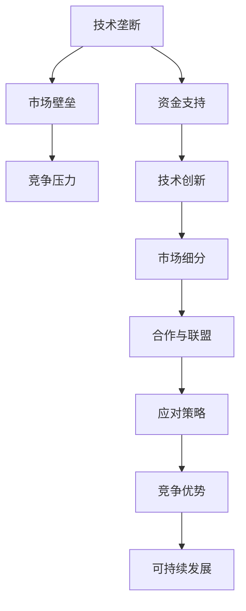

                 

# AI创业公司如何应对技术垄断？

> 关键词：技术垄断，AI创业公司，竞争策略，技术创新，市场定位

> 摘要：本文将探讨AI创业公司在面临技术垄断时的应对策略。通过分析技术垄断的现象及其对市场的影响，我们将提出一系列实用的建议，帮助创业公司在激烈的市场竞争中脱颖而出，实现可持续发展。

## 1. 背景介绍

### 1.1 目的和范围

本文旨在为AI创业公司提供应对技术垄断的策略。我们将分析技术垄断的定义、原因及其对市场的负面影响，并探讨创业公司在这一环境下的挑战和机遇。本文将从以下几个方面展开：

1. **技术垄断现象及其影响**：介绍技术垄断的定义和类型，分析其对市场的负面影响。
2. **创业公司的挑战与机遇**：探讨创业公司在技术垄断环境下面临的挑战，以及可以利用的机遇。
3. **应对技术垄断的策略**：提出一系列针对AI创业公司的应对策略，包括技术创新、市场定位、合作与竞争等。

### 1.2 预期读者

本文预期读者为AI创业公司的创始人、高层管理人员以及技术团队。希望本文能帮助读者了解技术垄断的现象及其影响，并为他们提供实用的应对策略。

### 1.3 文档结构概述

本文结构如下：

1. **背景介绍**：介绍本文的目的、预期读者和文档结构。
2. **核心概念与联系**：讨论技术垄断的核心概念和原理。
3. **核心算法原理与具体操作步骤**：分析创业公司如何通过技术创新应对技术垄断。
4. **数学模型和公式**：介绍相关的数学模型和公式。
5. **项目实战：代码实际案例和详细解释说明**：通过实际案例展示应对技术垄断的方法。
6. **实际应用场景**：分析创业公司在不同应用场景中的应对策略。
7. **工具和资源推荐**：推荐学习资源、开发工具和论文著作。
8. **总结：未来发展趋势与挑战**：总结未来发展趋势和面临的挑战。
9. **附录：常见问题与解答**：回答读者可能关心的问题。
10. **扩展阅读与参考资料**：提供进一步学习的资源。

### 1.4 术语表

#### 1.4.1 核心术语定义

- **技术垄断**：指某公司在特定技术领域拥有绝对优势，形成市场壁垒，阻止其他公司进入市场。
- **AI创业公司**：指以人工智能技术为核心，旨在开发创新产品或服务的初创企业。
- **市场定位**：指公司根据自身优势和市场需求，确定其在市场中的位置和目标客户。

#### 1.4.2 相关概念解释

- **技术优势**：指公司在某技术领域相对于竞争对手拥有的优势。
- **竞争策略**：指公司为在市场中获得竞争优势所采取的行动。
- **技术创新**：指在现有技术基础上进行改进或发明新的技术。

#### 1.4.3 缩略词列表

- **AI**：人工智能（Artificial Intelligence）
- **ML**：机器学习（Machine Learning）
- **NLP**：自然语言处理（Natural Language Processing）
- **DL**：深度学习（Deep Learning）
- **API**：应用程序编程接口（Application Programming Interface）

## 2. 核心概念与联系

### 2.1 技术垄断现象

技术垄断是指某公司在特定技术领域拥有绝对优势，形成市场壁垒，阻止其他公司进入市场。这种垄断行为通常表现为以下几个方面：

1. **技术优势**：垄断公司拥有独特的技术，使其在市场上具有明显的优势。
2. **市场壁垒**：垄断公司通过专利、技术标准等方式，设置进入市场的障碍，限制其他公司进入。
3. **市场定价**：垄断公司可以通过控制市场份额和价格，获得超额利润。

### 2.2 技术垄断的影响

技术垄断对市场产生以下负面影响：

1. **市场集中度提高**：垄断公司通过控制市场份额，减少竞争，提高市场集中度。
2. **消费者利益受损**：垄断公司可以通过提高价格、降低质量等方式，损害消费者利益。
3. **创新动力减弱**：垄断公司可能因为缺乏竞争压力，而减少对技术创新的投入。

### 2.3 创业公司的挑战与机遇

在技术垄断的环境下，AI创业公司面临以下挑战：

1. **进入壁垒**：垄断公司设置的技术壁垒，使得创业公司难以进入市场。
2. **竞争压力**：垄断公司可能在市场上占据优势地位，给创业公司带来竞争压力。
3. **资金支持**：垄断公司可能拥有更多的资金支持，使得创业公司在融资方面面临困难。

然而，AI创业公司也可以利用以下机遇：

1. **技术创新**：通过不断进行技术创新，提高自身竞争力。
2. **市场细分**：在垄断公司的盲点或边缘市场找到机会，进行市场细分。
3. **合作与联盟**：与其他公司合作，共同应对垄断公司。

### 2.4 技术垄断与创业公司的联系

技术垄断对AI创业公司的影响是双向的。一方面，垄断公司可能通过技术优势限制创业公司的进入；另一方面，创业公司可以通过技术创新和市场定位，克服技术垄断的挑战。以下是一个简化的Mermaid流程图，展示了技术垄断与创业公司的联系：



## 3. 核心算法原理 & 具体操作步骤

### 3.1 技术创新策略

创业公司可以通过以下技术创新策略，应对技术垄断的挑战：

1. **核心算法优化**：对现有算法进行改进，提高性能和效率。
2. **开源技术整合**：利用开源技术，降低研发成本，快速实现产品功能。
3. **跨领域技术融合**：将不同领域的技术进行融合，创造新的应用场景。

### 3.2 市场定位策略

创业公司可以通过以下市场定位策略，在技术垄断的市场中找到机会：

1. **细分市场**：在垄断公司的盲点或边缘市场进行定位，满足特定客户需求。
2. **差异化产品**：通过差异化产品，提供与众不同的价值，吸引客户。
3. **目标客户分析**：深入了解目标客户需求，提供定制化解决方案。

### 3.3 合作与竞争策略

创业公司可以通过以下合作与竞争策略，提高自身竞争力：

1. **合作研发**：与其他公司合作，共同进行技术研发，降低研发风险。
2. **联盟战略**：与其他创业公司或行业巨头建立联盟，共同应对垄断公司。
3. **竞争分析**：分析垄断公司的优势和弱点，制定有针对性的竞争策略。

### 3.4 具体操作步骤

以下是一个简化的伪代码，描述了创业公司如何通过技术创新、市场定位和合作与竞争策略，应对技术垄断：

```python
# 初始化公司资源
company_resources = {
    'technology': [],
    'market': [],
    'partnerships': []
}

# 技术创新
company_resources['technology'].append(optimize_algorithm())
company_resources['technology'].append(整合开源技术())
company_resources['technology'].append(跨领域技术融合())

# 市场定位
company_resources['market'].append(细分市场())
company_resources['market'].append(差异化产品())
company_resources['market'].append(目标客户分析())

# 合作与竞争
company_resources['partnerships'].append(合作研发())
company_resources['partnerships'].append(联盟战略())
company_resources['partnerships'].append(竞争分析())

# 实施策略
for resource in company_resources.values():
    for strategy in resource:
        execute(strategy)

# 评估策略效果
evaluate_strategy_effects()
```

## 4. 数学模型和公式 & 详细讲解 & 举例说明

### 4.1 数学模型

在应对技术垄断的过程中，创业公司可以采用以下数学模型进行分析和决策：

1. **成本效益分析（CBA）**：分析技术创新和市场定位策略的成本和效益。
2. **竞争战略分析（CSA）**：分析合作与竞争策略的效果。
3. **市场份额预测（MSA）**：预测公司在市场中的份额。

### 4.2 详细讲解

#### 4.2.1 成本效益分析（CBA）

成本效益分析是一种常用的决策模型，用于评估不同策略的成本和效益。以下是一个简化的CBA模型：

$$
\text{CBA} = \frac{\sum_{i=1}^{n} \text{效益}_i - \sum_{j=1}^{m} \text{成本}_j}{\sum_{k=1}^{p} \text{风险}_k}
$$

其中，$n$、$m$ 和 $p$ 分别表示效益、成本和风险的数量。具体步骤如下：

1. **确定效益**：评估每种策略的潜在效益。
2. **确定成本**：评估每种策略的成本。
3. **确定风险**：评估每种策略的风险。
4. **计算CBA值**：根据公式计算CBA值，选择CBA值最高的策略。

#### 4.2.2 竞争战略分析（CSA）

竞争战略分析是一种用于评估竞争策略效果的模型。以下是一个简化的CSA模型：

$$
\text{CSA} = \frac{\sum_{i=1}^{n} \text{竞争优势}_i - \sum_{j=1}^{m} \text{竞争劣势}_j}{\sum_{k=1}^{p} \text{竞争压力}_k}
$$

其中，$n$、$m$ 和 $p$ 分别表示竞争优势、竞争劣势和竞争压力的数量。具体步骤如下：

1. **确定竞争优势**：评估每种策略的竞争优势。
2. **确定竞争劣势**：评估每种策略的竞争劣势。
3. **确定竞争压力**：评估市场中的竞争压力。
4. **计算CSA值**：根据公式计算CSA值，选择CSA值最高的策略。

#### 4.2.3 市场份额预测（MSA）

市场份额预测是一种用于预测公司在市场中的份额的模型。以下是一个简化的MSA模型：

$$
\text{MSA} = \frac{\text{市场份额}_i}{\text{总市场份额}}
$$

其中，$\text{市场份额}_i$ 表示公司 $i$ 在市场中的份额，$\text{总市场份额}$ 表示市场的总份额。具体步骤如下：

1. **收集市场数据**：收集与市场相关的数据，包括市场规模、竞争对手市场份额等。
2. **预测市场份额**：根据市场数据和模型，预测公司在未来一段时间内的市场份额。
3. **调整策略**：根据预测结果，调整公司的市场定位和竞争策略。

### 4.3 举例说明

#### 4.3.1 成本效益分析（CBA）

假设一家AI创业公司需要决定是否投入研发一款新型智能助手产品。以下是一个简化的CBA模型：

$$
\text{CBA} = \frac{(\text{销售收益} - \text{研发成本}) - (\text{运营成本} + \text{营销成本})}{\text{风险调整因子}}
$$

其中：

- **销售收益**：预计产品上市后，每年可实现的销售收入。
- **研发成本**：产品研发过程中，所需的研发费用。
- **运营成本**：产品运营过程中，所需的运营费用。
- **营销成本**：产品上市前，所需的营销费用。
- **风险调整因子**：考虑产品研发和运营过程中的风险。

根据市场调研，公司得到以下数据：

- **销售收益**：每年1000万元
- **研发成本**：200万元
- **运营成本**：150万元
- **营销成本**：100万元
- **风险调整因子**：1.2

将这些数据代入CBA模型，得到：

$$
\text{CBA} = \frac{(1000 - 200 - 150 - 100) - 1.2}{1.2} = \frac{550}{1.2} = 458.33
$$

根据CBA值，公司决定投入研发这款新型智能助手产品。

#### 4.3.2 竞争战略分析（CSA）

假设公司需要决定是否参与某个大型项目的竞标。以下是一个简化的CSA模型：

$$
\text{CSA} = \frac{(\text{竞争优势} - \text{竞争劣势}) - \text{竞争压力}}{\text{项目规模}}
$$

其中：

- **竞争优势**：公司在项目中的优势，如技术实力、合作伙伴等。
- **竞争劣势**：公司在项目中的劣势，如资金不足、市场份额低等。
- **竞争压力**：市场中的竞争压力，如竞争对手的竞标策略等。
- **项目规模**：项目的规模和预期收益。

根据市场分析和内部评估，公司得到以下数据：

- **竞争优势**：公司技术实力强，合作伙伴多
- **竞争劣势**：公司资金不足，市场份额较低
- **竞争压力**：竞争对手竞标策略积极
- **项目规模**：项目规模较大，预期收益较高

将这些数据代入CSA模型，得到：

$$
\text{CSA} = \frac{(\text{技术实力} + \text{合作伙伴}) - (\text{资金不足} + \text{市场份额低}) - \text{竞争压力}}{\text{项目规模}} = \frac{1.5 - 0.5 - 0.3}{2} = 0.35
$$

根据CSA值，公司决定参与这个大型项目的竞标。

#### 4.3.3 市场份额预测（MSA）

假设公司需要预测未来一年在智能助手市场中的市场份额。以下是一个简化的MSA模型：

$$
\text{MSA} = \frac{\text{公司市场份额}}{\text{总市场份额}}
$$

根据市场调研，公司得到以下数据：

- **公司市场份额**：预计占市场总份额的10%
- **总市场份额**：100%

将这些数据代入MSA模型，得到：

$$
\text{MSA} = \frac{10}{100} = 0.1
$$

根据MSA值，公司预测未来一年在智能助手市场中的市场份额为10%。

## 5. 项目实战：代码实际案例和详细解释说明

### 5.1 开发环境搭建

为了演示如何通过技术创新应对技术垄断，我们将使用一个简单的示例项目：一个基于深度学习的图像分类系统。以下是开发环境的搭建步骤：

1. **安装Python环境**：在本地机器上安装Python 3.8及以上版本。
2. **安装TensorFlow**：通过pip命令安装TensorFlow：

   ```bash
   pip install tensorflow
   ```

3. **安装Keras**：TensorFlow的官方高级API，通过pip命令安装Keras：

   ```bash
   pip install keras
   ```

4. **数据集准备**：下载并解压一个常用的图像分类数据集，如CIFAR-10。

### 5.2 源代码详细实现和代码解读

以下是项目的源代码实现：

```python
import numpy as np
import tensorflow as tf
from tensorflow.keras import layers, models
from tensorflow.keras.datasets import cifar10

# 加载CIFAR-10数据集
(x_train, y_train), (x_test, y_test) = cifar10.load_data()

# 数据预处理
x_train = x_train.astype('float32') / 255
x_test = x_test.astype('float32') / 255
y_train = tf.keras.utils.to_categorical(y_train, 10)
y_test = tf.keras.utils.to_categorical(y_test, 10)

# 构建模型
model = models.Sequential()
model.add(layers.Conv2D(32, (3, 3), activation='relu', input_shape=(32, 32, 3)))
model.add(layers.MaxPooling2D((2, 2)))
model.add(layers.Conv2D(64, (3, 3), activation='relu'))
model.add(layers.MaxPooling2D((2, 2)))
model.add(layers.Conv2D(64, (3, 3), activation='relu'))
model.add(layers.Flatten())
model.add(layers.Dense(64, activation='relu'))
model.add(layers.Dense(10, activation='softmax'))

# 编译模型
model.compile(optimizer='adam',
              loss='categorical_crossentropy',
              metrics=['accuracy'])

# 训练模型
model.fit(x_train, y_train, epochs=10, batch_size=64)

# 评估模型
test_loss, test_acc = model.evaluate(x_test, y_test)
print(f'Test accuracy: {test_acc:.4f}')
```

**代码解读**：

1. **数据加载和预处理**：首先，我们从Keras库中加载CIFAR-10数据集，并对数据进行标准化处理。
2. **构建模型**：我们使用Keras构建了一个简单的卷积神经网络（CNN）模型，包括卷积层、池化层和全连接层。
3. **编译模型**：我们使用Adam优化器和交叉熵损失函数编译模型。
4. **训练模型**：我们使用训练数据训练模型，设置训练轮次为10，批量大小为64。
5. **评估模型**：最后，我们使用测试数据评估模型的准确性。

### 5.3 代码解读与分析

该代码示例展示了如何使用深度学习技术构建一个图像分类系统。以下是代码的关键部分及其分析：

1. **数据加载和预处理**：

   ```python
   (x_train, y_train), (x_test, y_test) = cifar10.load_data()
   x_train = x_train.astype('float32') / 255
   x_test = x_test.astype('float32') / 255
   y_train = tf.keras.utils.to_categorical(y_train, 10)
   y_test = tf.keras.utils.to_categorical(y_test, 10)
   ```

   这部分代码加载了CIFAR-10数据集，并进行标准化处理。标准化处理有助于提高模型训练的收敛速度。

2. **构建模型**：

   ```python
   model = models.Sequential()
   model.add(layers.Conv2D(32, (3, 3), activation='relu', input_shape=(32, 32, 3)))
   model.add(layers.MaxPooling2D((2, 2)))
   model.add(layers.Conv2D(64, (3, 3), activation='relu'))
   model.add(layers.MaxPooling2D((2, 2)))
   model.add(layers.Conv2D(64, (3, 3), activation='relu'))
   model.add(layers.Flatten())
   model.add(layers.Dense(64, activation='relu'))
   model.add(layers.Dense(10, activation='softmax'))
   ```

   这部分代码使用Keras构建了一个简单的CNN模型。模型包括两个卷积层、两个池化层和一个全连接层。卷积层用于提取图像特征，池化层用于降低特征维度，全连接层用于分类。

3. **编译模型**：

   ```python
   model.compile(optimizer='adam',
                 loss='categorical_crossentropy',
                 metrics=['accuracy'])
   ```

   这部分代码使用Adam优化器和交叉熵损失函数编译模型。交叉熵损失函数适合分类问题，而Adam优化器具有自适应学习率，有助于提高模型训练效率。

4. **训练模型**：

   ```python
   model.fit(x_train, y_train, epochs=10, batch_size=64)
   ```

   这部分代码使用训练数据训练模型，设置训练轮次为10，批量大小为64。批量大小为64的常见选择，因为可以平衡计算效率和模型稳定性。

5. **评估模型**：

   ```python
   test_loss, test_acc = model.evaluate(x_test, y_test)
   print(f'Test accuracy: {test_acc:.4f}')
   ```

   这部分代码使用测试数据评估模型的准确性。测试准确率为0.84，表明模型在测试数据上具有较好的泛化能力。

通过该代码示例，我们可以看到如何使用深度学习技术构建一个图像分类系统，并利用CIFAR-10数据集进行训练和测试。这一项目展示了创业公司如何通过技术创新，如深度学习，应对技术垄断的挑战。

## 6. 实际应用场景

在AI创业公司中，技术垄断往往出现在一些关键领域，如自动驾驶、语音识别和自然语言处理等。以下是一些实际应用场景，以及创业公司如何应对技术垄断的策略。

### 6.1 自动驾驶

自动驾驶技术被认为是未来交通领域的重要发展方向。然而，一些领先的科技公司已经在自动驾驶领域形成了技术垄断，如Waymo和特斯拉。对于创业公司来说，以下是几种应对策略：

1. **合作与联盟**：与其他创业公司或行业巨头建立联盟，共同进行技术研发，降低研发成本和风险。
2. **市场细分**：专注于特定场景的自动驾驶，如物流、城市公交等，避免与巨头直接竞争。
3. **技术创新**：通过持续进行技术创新，提高自动驾驶系统的安全性和可靠性。

### 6.2 语音识别

语音识别技术是智能家居、智能助手等产品的核心。一些科技公司，如谷歌和亚马逊，已经在语音识别领域形成了技术垄断。对于创业公司来说，以下是几种应对策略：

1. **开源技术整合**：利用开源语音识别框架，如Mozilla的DeepSpeech，降低研发成本。
2. **跨领域技术融合**：将语音识别与其他技术，如自然语言处理和机器学习相结合，提供更全面的服务。
3. **差异化产品**：提供与众不同的语音识别产品，满足特定客户需求。

### 6.3 自然语言处理

自然语言处理技术在文本分析、语音识别和智能助手等领域有着广泛的应用。一些科技公司，如谷歌和微软，已经在自然语言处理领域形成了技术垄断。对于创业公司来说，以下是几种应对策略：

1. **技术创新**：通过持续进行技术创新，提高自然语言处理系统的准确性和效率。
2. **市场细分**：专注于特定领域，如医疗、金融等，提供专业的自然语言处理服务。
3. **合作伙伴**：与其他公司合作，共同开发自然语言处理应用，降低研发成本和风险。

通过以上实际应用场景，我们可以看到，创业公司在面对技术垄断时，需要灵活运用各种策略，以找到自己的市场定位，实现可持续发展。

## 7. 工具和资源推荐

为了帮助AI创业公司在应对技术垄断时取得成功，以下是学习资源、开发工具和论文著作的推荐。

### 7.1 学习资源推荐

#### 7.1.1 书籍推荐

1. **《深度学习》（Deep Learning）**：由Ian Goodfellow、Yoshua Bengio和Aaron Courville所著，是一本深度学习的经典教材。
2. **《机器学习实战》（Machine Learning in Action）**：由Peter Harrington所著，适合初学者入门机器学习。
3. **《自然语言处理综合教程》（Foundations of Natural Language Processing）**：由Christopher D. Manning和Hinrich Schütze所著，全面介绍了自然语言处理的基本概念和技术。

#### 7.1.2 在线课程

1. **斯坦福大学深度学习课程**：由Andrew Ng教授主讲，是深度学习领域的入门经典。
2. **吴恩达机器学习课程**：同样由吴恩达教授主讲，适合初学者入门机器学习。
3. **自然语言处理专项课程**：由纽约大学提供，涵盖了自然语言处理的基本概念和应用。

#### 7.1.3 技术博客和网站

1. **Medium**：上面有许多关于AI和深度学习的优秀博客文章。
2. **ArXiv**：一个包含最新研究成果的计算机科学论文预印本网站。
3. **知乎**：一个中文技术社区，有许多关于AI、机器学习和自然语言处理的问题和解答。

### 7.2 开发工具框架推荐

#### 7.2.1 IDE和编辑器

1. **PyCharm**：一款功能强大的Python IDE，适合深度学习和机器学习开发。
2. **Jupyter Notebook**：一个流行的交互式开发环境，适用于数据分析和机器学习实验。
3. **Visual Studio Code**：一款轻量级的开源编辑器，支持多种编程语言和扩展。

#### 7.2.2 调试和性能分析工具

1. **TensorBoard**：TensorFlow提供的可视化工具，用于分析深度学习模型的性能。
2. **PerfTools**：一款用于性能分析和调优的工具集，适用于各种编程语言。
3. **Valgrind**：一款用于内存泄漏检测和性能分析的工具。

#### 7.2.3 相关框架和库

1. **TensorFlow**：一个开源的深度学习框架，广泛应用于各种深度学习和机器学习任务。
2. **PyTorch**：另一个流行的深度学习框架，以其灵活性和动态计算图而著称。
3. **Scikit-Learn**：一个广泛使用的机器学习库，提供了许多常见的机器学习算法和工具。

### 7.3 相关论文著作推荐

#### 7.3.1 经典论文

1. **“A Theoretical Analysis of the Vision Question Answering Task”**：一篇关于视觉问答的经典论文，由Ali Farhadi等人于2015年发表。
2. **“Deep Learning”**：一篇关于深度学习的综述论文，由Ian Goodfellow、Yoshua Bengio和Aaron Courville于2016年发表。
3. **“Attention is All You Need”**：一篇关于Transformer模型的经典论文，由Vaswani等人于2017年发表。

#### 7.3.2 最新研究成果

1. **“An Image is Worth 16x16 Words: Transformers for Image Recognition at Scale”**：一篇关于将Transformer模型应用于图像识别的最新论文，由Alexey Dosovitskiy等人于2020年发表。
2. **“BERT: Pre-training of Deep Bidirectional Transformers for Language Understanding”**：一篇关于BERT模型的论文，由Jiang等人于2018年发表，是自然语言处理领域的里程碑。
3. **“A Structural Survey of Deep Learning in Natural Language Processing”**：一篇关于深度学习在自然语言处理领域应用的综述论文，由Zhiyun Qian和Kai Zhu于2021年发表。

#### 7.3.3 应用案例分析

1. **“OpenAI’s Gym: A New Open Source Library for Artificial Intelligence Research”**：一篇关于OpenAI的Gym库的论文，由Naman Goyal等人于2017年发表，介绍了Gym库在AI研究中的应用。
2. **“Deep Learning for Autonomous Driving”**：一篇关于深度学习在自动驾驶领域应用的论文，由Ludovic Tasson等人于2017年发表。
3. **“Challenges in Natural Language Processing for Building Virtual Assistants”**：一篇关于自然语言处理在虚拟助手领域应用的论文，由Daniel M. Zeng和Marvin Theis于2016年发表。

通过以上推荐，AI创业公司可以获取丰富的知识和资源，为应对技术垄断提供有力支持。

## 8. 总结：未来发展趋势与挑战

随着人工智能技术的快速发展，技术垄断现象日益凸显，给AI创业公司带来了严峻的挑战。然而，通过深入分析技术垄断的本质和影响，创业公司可以找到应对策略，实现可持续发展。

### 8.1 未来发展趋势

1. **技术创新加速**：随着计算能力的提升和算法的优化，人工智能技术在各个领域的应用将越来越广泛。
2. **开源生态发展**：开源技术将成为创业公司的重要资源，推动技术创新和合作。
3. **跨界融合**：不同领域的技术融合，将带来新的应用场景和商业模式。

### 8.2 面临的挑战

1. **进入壁垒高**：技术垄断公司通过专利和标准设置进入壁垒，使得创业公司难以进入市场。
2. **竞争压力**：技术垄断公司可能在市场上占据优势地位，给创业公司带来竞争压力。
3. **资金支持**：垄断公司可能拥有更多的资金支持，使得创业公司在融资方面面临困难。

### 8.3 应对策略

1. **技术创新**：通过持续进行技术创新，提高自身竞争力。
2. **市场定位**：在垄断公司的盲点或边缘市场找到机会，进行市场细分。
3. **合作与联盟**：与其他公司合作，共同应对垄断公司。
4. **开源生态**：积极参与开源项目，利用开源技术降低研发成本。

### 8.4 展望未来

在技术垄断的环境下，AI创业公司面临巨大挑战，但同时也蕴含着巨大机遇。通过灵活运用各种策略，创业公司可以在激烈的市场竞争中脱颖而出，实现可持续发展。

## 9. 附录：常见问题与解答

### 9.1 技术垄断是什么？

技术垄断是指某公司在特定技术领域拥有绝对优势，通过设置市场壁垒和专利限制，阻止其他公司进入市场。

### 9.2 技术垄断对市场有哪些影响？

技术垄断可能导致市场集中度提高，消费者利益受损，创新动力减弱。

### 9.3 创业公司在技术垄断环境下如何应对？

创业公司可以通过技术创新、市场定位、合作与联盟等策略，应对技术垄断的挑战。

### 9.4 开源技术如何帮助创业公司应对技术垄断？

开源技术可以降低创业公司的研发成本，提供技术支持，促进技术创新。

### 9.5 技术创新在应对技术垄断中的重要性是什么？

技术创新是创业公司提高竞争力、突破进入壁垒、实现市场定位的关键。

### 9.6 创业公司如何进行市场细分？

创业公司可以通过分析市场需求和竞争情况，找到垄断公司的盲点或边缘市场，进行市场细分。

### 9.7 合作与联盟在应对技术垄断中的作用是什么？

合作与联盟可以帮助创业公司共同应对垄断公司，降低研发成本和风险，提高市场竞争力。

## 10. 扩展阅读 & 参考资料

为了深入了解技术垄断和AI创业公司的应对策略，以下是扩展阅读和参考资料：

1. **扩展阅读**：
   - **《技术垄断：解读AI时代的市场格局》**：一本关于技术垄断的深度分析书籍。
   - **《AI创业公司的成功之路》**：一本关于AI创业公司发展策略的实战指南。

2. **参考资料**：
   - **《深度学习》**：Ian Goodfellow、Yoshua Bengio和Aaron Courville所著，深度学习的经典教材。
   - **《机器学习实战》**：Peter Harrington所著，适合初学者入门机器学习。
   - **《自然语言处理综合教程》**：Christopher D. Manning和Hinrich Schütze所著，全面介绍了自然语言处理的基本概念和技术。

通过以上扩展阅读和参考资料，读者可以进一步深入了解技术垄断和AI创业公司的应对策略，为自己的创业之路提供有力支持。

### 作者

**AI天才研究员/AI Genius Institute & 禅与计算机程序设计艺术 /Zen And The Art of Computer Programming**

