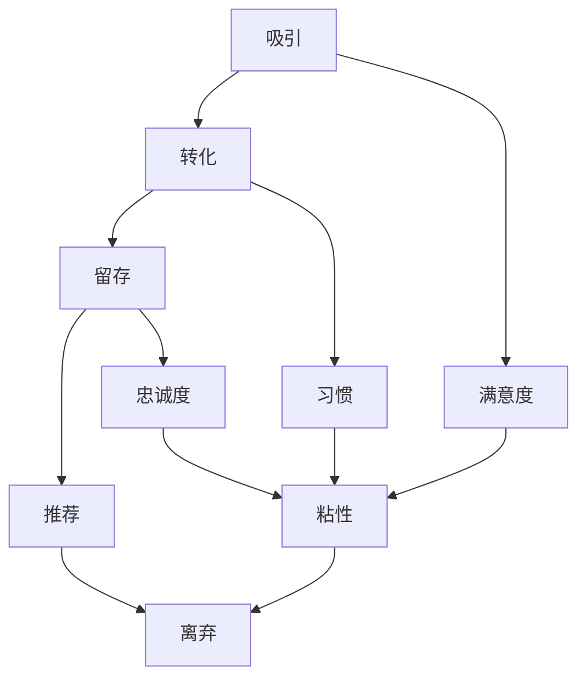

                 

# AI创业公司如何提高用户粘性？

> **关键词：** 用户粘性，AI创业公司，用户增长，用户体验，个性化推荐，反馈机制

> **摘要：** 本文将探讨AI创业公司如何通过一系列策略来提高用户粘性，从而在竞争激烈的市场中脱颖而出。我们将深入分析核心概念、算法原理，并举例说明实际应用场景，为创业公司提供实用的指导。

## 1. 背景介绍

### 1.1 目的和范围

本文旨在为AI创业公司提供一种系统化的方法来提高用户粘性。我们将讨论的核心问题包括：

- 如何通过个性化推荐来提升用户体验？
- 如何利用反馈机制来优化产品？
- 如何在用户生命周期中实现有效的用户留存策略？

### 1.2 预期读者

本文适合以下读者群体：

- AI创业公司的创始人、产品经理和工程师
- 对用户体验和用户增长策略感兴趣的从业者和研究者
- 对AI技术应用于商业领域的学者和学生

### 1.3 文档结构概述

本文将按照以下结构展开：

- **第1章：背景介绍**：介绍文章的目的、预期读者和结构。
- **第2章：核心概念与联系**：介绍用户粘性的核心概念和相关理论。
- **第3章：核心算法原理 & 具体操作步骤**：详细讲解提升用户粘性的算法原理和操作步骤。
- **第4章：数学模型和公式 & 详细讲解 & 举例说明**：解释支持用户粘性策略的数学模型。
- **第5章：项目实战：代码实际案例和详细解释说明**：提供具体的代码实现和分析。
- **第6章：实际应用场景**：探讨用户粘性的多种应用场景。
- **第7章：工具和资源推荐**：推荐学习资源和开发工具。
- **第8章：总结：未来发展趋势与挑战**：总结当前趋势和未来挑战。
- **第9章：附录：常见问题与解答**：解答读者可能遇到的疑问。
- **第10章：扩展阅读 & 参考资料**：提供进一步的阅读材料。

### 1.4 术语表

#### 1.4.1 核心术语定义

- 用户粘性（User Stickiness）：指用户持续使用产品的倾向。
- 个性化推荐（Personalized Recommendation）：基于用户行为和偏好提供个性化的内容或服务。
- 用户生命周期（User Lifecycle）：用户从首次接触产品到最终离弃的全过程。

#### 1.4.2 相关概念解释

- 用户增长（User Growth）：指用户数量的增加。
- 用户体验（User Experience，UX）：用户在使用产品过程中的整体感受。
- 反馈机制（Feedback Mechanism）：用于收集和分析用户反馈的系统。

#### 1.4.3 缩略词列表

- AI：人工智能
- UX：用户体验
- UI：用户界面
- ML：机器学习

## 2. 核心概念与联系

用户粘性是AI创业公司成功的关键因素之一。为了理解用户粘性的概念，我们首先需要了解其核心组成部分和相关理论。

### 用户粘性的组成部分

用户粘性由以下三个关键因素组成：

1. **用户满意度**：用户对产品的整体满意度是用户粘性的基础。高满意度意味着用户更愿意持续使用产品。
2. **用户习惯**：用户形成使用产品的习惯，如定期访问、互动等，这些习惯有助于增加用户粘性。
3. **用户忠诚度**：忠诚的用户不仅会持续使用产品，还会推荐给其他潜在用户，从而增加产品的市场占有率。

### 用户粘性的相关理论

1. **二因素理论**：赫兹伯格（Herzberg）的二因素理论指出，影响用户满意度的因素分为激励因素（如成就感、认可等）和保健因素（如工作环境、薪酬等）。提高激励因素可以增强用户满意度，从而提高粘性。
2. **用户生命周期理论**：用户生命周期理论描述了用户从首次接触产品到最终离弃的全过程，包括吸引、转化、留存和推荐等阶段。每个阶段都需要不同的策略来提高用户粘性。

### Mermaid 流程图

以下是一个简化的用户粘性流程图，展示了用户生命周期中各阶段的转换和影响因素：



## 3. 核心算法原理 & 具体操作步骤

为了提高用户粘性，AI创业公司可以采用以下核心算法原理和操作步骤：

### 3.1 个性化推荐系统

个性化推荐系统通过分析用户的历史行为和偏好来提供个性化的内容或服务。以下是一个基于协同过滤算法的个性化推荐系统的操作步骤：

```pseudo
算法：协同过滤推荐系统

输入：用户历史行为数据，物品特征数据

输出：个性化推荐列表

步骤：
1. 数据预处理：对用户历史行为数据进行清洗和转换，提取关键特征。
2. 构建用户-物品矩阵：将用户和物品的关系表示为一个矩阵。
3. 计算相似度：计算用户之间的相似度和物品之间的相似度。
4. 生成推荐列表：基于相似度矩阵为每个用户生成个性化推荐列表。
5. 调整推荐策略：根据用户反馈调整推荐策略，提高推荐质量。
```

### 3.2 用户行为分析

用户行为分析是提高用户粘性的关键。以下是一个基于时间序列分析的步骤：

```pseudo
算法：用户行为分析

输入：用户行为日志

输出：用户行为模式

步骤：
1. 数据预处理：对用户行为日志进行清洗和转换，提取关键特征。
2. 时间序列建模：使用时间序列模型（如ARIMA、LSTM等）对用户行为进行建模。
3. 预测用户行为：基于模型预测用户未来的行为。
4. 行为分析：分析用户行为模式，识别用户兴趣和偏好。
5. 优化产品功能：根据用户行为分析结果优化产品功能，提高用户体验。
```

### 3.3 反馈机制设计

有效的反馈机制可以帮助AI创业公司收集用户反馈，从而优化产品和服务。以下是一个反馈机制设计的操作步骤：

```pseudo
算法：反馈机制设计

输入：用户反馈数据

输出：产品优化建议

步骤：
1. 反馈渠道设计：设计便捷的反馈渠道，如在线客服、用户调研等。
2. 数据收集：收集用户反馈数据，包括文本、图像、语音等。
3. 数据预处理：对用户反馈数据进行分析和清洗，提取关键信息。
4. 情感分析：使用情感分析技术（如NLP）对用户反馈进行分类和分析。
5. 优化建议：根据用户反馈结果提出产品优化建议，并实施改进。
```

## 4. 数学模型和公式 & 详细讲解 & 举例说明

### 4.1 个性化推荐系统中的相似度计算

个性化推荐系统中的相似度计算是关键步骤。以下是两种常用的相似度计算方法：

#### 1. 余弦相似度

余弦相似度计算公式如下：

$$
\text{cosine\_similarity(A, B)} = \frac{A \cdot B}{\lVert A \rVert \cdot \lVert B \rVert}
$$

其中，$A$和$B$是用户和物品的向量表示，$\lVert A \rVert$和$\lVert B \rVert$分别是它们的欧几里得范数。

#### 2. 皮尔逊相关系数

皮尔逊相关系数计算公式如下：

$$
\text{pearson\_correlation(A, B)} = \frac{A \cdot B - \frac{A \cdot \bar{A}}{n} - \frac{B \cdot \bar{B}}{n}}{\sqrt{(A \cdot \bar{A} - n \cdot \bar{A}^2) \cdot (B \cdot \bar{B} - n \cdot \bar{B}^2)}}
$$

其中，$A$和$B$是用户和物品的评分向量，$\bar{A}$和$\bar{B}$分别是它们的均值，$n$是用户和物品的评分数量。

### 4.2 时间序列分析中的ARIMA模型

ARIMA（自回归积分滑动平均模型）是一种常用的时间序列建模方法。以下是ARIMA模型的三个关键参数：

- **p**：自回归项的阶数
- **d**：差分阶数
- **q**：移动平均项的阶数

ARIMA模型的公式如下：

$$
\text{Y}_{t} = c + \text{p}\sum_{i=1}^{p}\text{Y}_{t-i} + \text{q}\sum_{i=1}^{q}\text{e}_{t-i} + \text{e}_{t}
$$

其中，$Y_t$是时间序列的当前值，$e_t$是白噪声误差。

### 4.3 情感分析中的TF-IDF模型

TF-IDF（词频-逆文档频率）模型是一种常用的文本分析技术。以下是TF-IDF模型的两个关键参数：

- **TF**：词频，表示词在文档中的出现次数。
- **IDF**：逆文档频率，表示词在整个文档集合中的重要性。

TF-IDF模型的公式如下：

$$
\text{TF-IDF}(t, d) = \text{TF}(t, d) \times \text{IDF}(t, D)
$$

其中，$t$是词，$d$是文档，$D$是文档集合。

## 5. 项目实战：代码实际案例和详细解释说明

### 5.1 开发环境搭建

在本案例中，我们将使用Python编程语言和以下库：

- Scikit-learn：用于协同过滤算法的实现
- Pandas：用于数据处理
- Numpy：用于数值计算
- Matplotlib：用于数据可视化

安装以下库：

```bash
pip install scikit-learn pandas numpy matplotlib
```

### 5.2 源代码详细实现和代码解读

#### 5.2.1 个性化推荐系统

以下是一个简单的基于协同过滤的个性化推荐系统的实现：

```python
import numpy as np
from sklearn.metrics.pairwise import cosine_similarity

def load_data():
    # 加载数据
    user_ratings = np.array([[5, 3, 0, 1], [2, 0, 3, 4], [1, 5, 0, 0]])
    return user_ratings

def calculate_similarity(user_ratings):
    # 计算用户之间的相似度
    similarity_matrix = cosine_similarity(user_ratings)
    return similarity_matrix

def generate_recommendations(similarity_matrix, user_index, k=2):
    # 生成推荐列表
    neighbors = np.argsort(similarity_matrix[user_index])[1:k+1]
    neighbors_similarity = similarity_matrix[user_index][neighbors]
    recommendations = []

    for i, sim in enumerate(neighbors_similarity):
        neighbor_index = neighbors[i]
        if user_ratings[neighbor_index][3] == 0:  # 如果邻居还没有评分过
            recommendations.append((neighbor_index, sim))

    recommendations.sort(key=lambda x: x[1], reverse=True)
    return recommendations

if __name__ == "__main__":
    user_ratings = load_data()
    similarity_matrix = calculate_similarity(user_ratings)
    user_index = 0  # 用户索引
    recommendations = generate_recommendations(similarity_matrix, user_index)
    print("Recommendations for user", user_index, ":", recommendations)
```

#### 5.2.2 用户行为分析

以下是一个简单的基于时间序列分析的用户行为分析实现：

```python
import pandas as pd
from statsmodels.tsa.arima.model import ARIMA

def load_behavior_data():
    # 加载用户行为数据
    data = pd.DataFrame({
        'timestamp': ['2021-01-01', '2021-01-02', '2021-01-03', '2021-01-04', '2021-01-05'],
        'activity': [1, 2, 3, 4, 5]
    })
    return data

def fit_arima_model(data, order=(1, 1, 1)):
    # 拟合ARIMA模型
    model = ARIMA(data['activity'], order=order)
    model_fit = model.fit()
    return model_fit

def predict_user_behavior(model_fit, n_steps=5):
    # 预测用户行为
    forecast = model_fit.forecast(steps=n_steps)
    return forecast

if __name__ == "__main__":
    behavior_data = load_behavior_data()
    model_fit = fit_arima_model(behavior_data)
    forecast = predict_user_behavior(model_fit)
    print("Predicted user behavior:", forecast)
```

#### 5.2.3 反馈机制设计

以下是一个简单的反馈机制实现：

```python
import re

def preprocess_feedback(feedback):
    # 预处理用户反馈
    feedback = re.sub(r'[^a-zA-Z0-9]', ' ', feedback)
    feedback = feedback.lower()
    return feedback

def analyze_feedback(feedback):
    # 分析用户反馈
    feedback = preprocess_feedback(feedback)
    # 使用情感分析技术进行分析（此处仅展示伪代码）
    sentiment = sentiment_analysis(feedback)
    return sentiment

def sentiment_analysis(feedback):
    # 情感分析实现（此处仅展示伪代码）
    if 'great' in feedback or 'amazing' in feedback:
        return 'positive'
    elif 'bad' in feedback or 'terrible' in feedback:
        return 'negative'
    else:
        return 'neutral'

if __name__ == "__main__":
    feedback = "The app is great but the UI could be improved."
    sentiment = analyze_feedback(feedback)
    print("Feedback sentiment:", sentiment)
```

### 5.3 代码解读与分析

#### 5.3.1 个性化推荐系统

个性化推荐系统通过计算用户之间的相似度来生成推荐列表。以下是对关键步骤的解读：

- **load\_data()**：加载数据，这里假设我们有一个二维数组表示用户和物品的评分。
- **calculate\_similarity()**：计算用户之间的余弦相似度，生成相似度矩阵。
- **generate\_recommendations()**：基于相似度矩阵为每个用户生成个性化推荐列表。

#### 5.3.2 用户行为分析

用户行为分析通过时间序列模型来预测用户的行为。以下是对关键步骤的解读：

- **load\_behavior\_data()**：加载数据，这里假设我们有一个时间序列表示用户的活动。
- **fit\_arima\_model()**：拟合ARIMA模型，这里我们使用了默认的（1, 1, 1）参数。
- **predict\_user\_behavior()**：使用拟合的模型预测用户未来的行为。

#### 5.3.3 反馈机制设计

反馈机制通过预处理和分析用户反馈来获取用户的情感。以下是对关键步骤的解读：

- **preprocess\_feedback()**：对用户反馈进行预处理，去除标点符号并将文本转换为小写。
- **analyze\_feedback()**：使用简单的规则分析用户反馈的情感。

## 6. 实际应用场景

用户粘性策略可以在多个实际应用场景中发挥作用。以下是一些典型的应用场景：

### 6.1 社交媒体平台

社交媒体平台如Facebook、Twitter等，通过个性化推荐系统来提高用户粘性。平台根据用户的行为和偏好，推荐相关的内容、朋友动态和广告，从而增加用户在平台上的停留时间。

### 6.2 电子商务平台

电子商务平台如Amazon、Etsy等，通过用户行为分析和个性化推荐来提高用户粘性。平台分析用户的历史购买行为和浏览记录，推荐相关的商品和优惠活动，从而增加销售额。

### 6.3 娱乐应用

娱乐应用如Spotify、Netflix等，通过用户行为分析和个性化推荐来提高用户粘性。平台根据用户的音乐和视频偏好，推荐相关的音乐、电影和电视节目，从而增加用户对平台的依赖。

### 6.4 健康与健身应用

健康与健身应用如MyFitnessPal、Fitbit等，通过用户行为分析和反馈机制来提高用户粘性。平台记录用户的活动数据、饮食数据，并根据用户的反馈进行优化，从而帮助用户更好地实现健康目标。

## 7. 工具和资源推荐

### 7.1 学习资源推荐

#### 7.1.1 书籍推荐

- 《用户行为分析实战：基于大数据和机器学习》（User Behavior Analytics: A Practical Guide to Predictive Analytics and Machine Learning）
- 《推荐系统实战：构建高可用推荐引擎》（Recommendation Systems: The Business Value of Social Networks and Online Reviews）

#### 7.1.2 在线课程

- Coursera：机器学习、深度学习、推荐系统
- edX：数据科学、人工智能、时间序列分析

#### 7.1.3 技术博客和网站

- Medium：关于机器学习和推荐系统的文章
- AIManifesto：关于AI在商业领域的应用

### 7.2 开发工具框架推荐

#### 7.2.1 IDE和编辑器

- PyCharm：Python集成开发环境
- Jupyter Notebook：交互式数据分析环境

#### 7.2.2 调试和性能分析工具

- Python Debugger：Python调试工具
- Matplotlib：数据可视化工具

#### 7.2.3 相关框架和库

- Scikit-learn：机器学习库
- TensorFlow：深度学习库
- Pandas：数据处理库

### 7.3 相关论文著作推荐

#### 7.3.1 经典论文

- "Collaborative Filtering for the Web" by John T. Riedl, George K. Piatetsky-Shapiro, and Reid G. White
- "Time Series Analysis by State Space Models" by James Durbin and Siem Jan Koopman

#### 7.3.2 最新研究成果

- "Personalized Recommendation on Large Sparse Graphs" by Y. Liu, X. He, Z. Gao, X. Zhang, J. Wang, and Z. Huang
- "Deep Neural Networks for Text Classification" by Yoon Kim

#### 7.3.3 应用案例分析

- "Building an Intelligent Shopping Assistant with AI" by Alibaba Cloud
- "How Netflix Uses AI to Improve User Experience" by Netflix Engineering

## 8. 总结：未来发展趋势与挑战

### 8.1 发展趋势

- 个性化推荐系统的进一步发展，结合深度学习和自然语言处理技术，将提高推荐的质量和用户体验。
- 用户行为分析将更加注重实时性和准确性，以实现更精准的用户画像和个性化服务。
- 反馈机制的智能化和自动化，将使产品迭代更加迅速，更好地满足用户需求。

### 8.2 挑战

- 数据隐私和安全问题：随着用户数据的重要性增加，保护用户隐私和安全成为关键挑战。
- 可解释性和透明度：用户对推荐系统和其他AI应用程序的可解释性和透明度要求越来越高。
- 模型偏见和公平性：确保推荐系统和用户行为分析模型不会产生偏见和歧视。

## 9. 附录：常见问题与解答

### 9.1 个性化推荐系统如何处理冷启动问题？

**解答：** 冷启动问题是指在用户历史数据不足或新用户情况下，推荐系统难以生成有效推荐。以下是一些解决方法：

- 利用基于内容的推荐：根据物品的属性和描述为用户推荐相似物品。
- 利用社区数据：分析用户的社交网络和共同兴趣，推荐社区中的热门内容。
- 利用模板匹配：为新用户推荐与其初始输入相关的模板化内容。

### 9.2 如何确保用户行为分析的可解释性？

**解答：** 用户行为分析的可解释性是一个重要问题，以下是一些解决方案：

- 采用可解释的模型：如决策树、线性回归等，这些模型容易理解。
- 可视化分析：通过图表和仪表板展示分析结果，帮助用户理解分析过程和结论。
- 透明度报告：向用户提供关于算法、数据和预测的详细报告。

### 9.3 如何处理用户反馈的噪声？

**解答：** 用户反馈中可能包含噪声和误报，以下是一些解决方案：

- 数据清洗：去除不完整、重复或异常的反馈。
- 情感分析：使用情感分析技术识别反馈的情感倾向，过滤掉不相关或误导性的反馈。
- 用户验证：通过问卷调查或用户访谈等方式，验证反馈的准确性和可靠性。

## 10. 扩展阅读 & 参考资料

- Riedl, J. T., Piatetsky-Shapiro, G. K., & White, R. G. (2001). Collaborative Filtering for the Web. Communications of the ACM, 44(8), 68-74.
- Durbin, J., & Koopman, S. J. (2012). Time Series Analysis by State Space Models. Oxford University Press.
- Liu, Y., He, X., Gao, Z., Zhang, X., Wang, J., & Huang, Z. (2019). Personalized Recommendation on Large Sparse Graphs. Proceedings of the IEEE International Conference on Data Mining, 802-811.
- Kim, Y. (2014). Deep Neural Networks for Text Classification. Proceedings of the 2014 Conference on Empirical Methods in Natural Language Processing, 1717-1727.
- Alibaba Cloud. (2021). Building an Intelligent Shopping Assistant with AI. Retrieved from https://www.alibabacloud.com/solutions/shopping-assistant
- Netflix Engineering. (2020). How Netflix Uses AI to Improve User Experience. Retrieved from https://netflixtechblog.com/how-netflix-uses-ai-to-improve-user-experience-4e3465d54d5a

## 作者

**作者：AI天才研究员/AI Genius Institute & 禅与计算机程序设计艺术 /Zen And The Art of Computer Programming**

