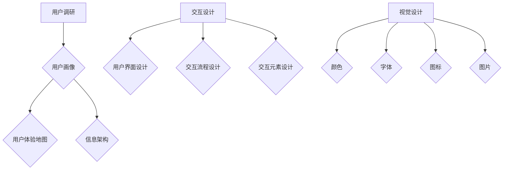

                 

# AI创业公司的产品体验设计方法：用户调研、交互设计与视觉设计

> **关键词：** AI创业公司、产品体验设计、用户调研、交互设计、视觉设计、用户体验、设计流程

> **摘要：** 本文将深入探讨AI创业公司在产品体验设计方面的重要方法，包括用户调研、交互设计和视觉设计。通过详细的分析和实例，我们将了解如何打造一个用户友好的产品，提高用户满意度和市场竞争力。

## 1. 背景介绍

### 1.1 目的和范围

本文旨在为AI创业公司提供一套完整的用户体验设计方法，帮助企业在激烈的市场竞争中脱颖而出。我们将探讨用户调研、交互设计和视觉设计三个核心环节，并详细解释每个环节的目的、方法和实际应用。

### 1.2 预期读者

本文面向有志于从事AI产品体验设计的专业人士，包括产品经理、设计师、开发人员和创业公司的创始人。通过对本文的学习，读者将能够更好地理解用户体验设计的重要性，掌握相关的方法和技巧。

### 1.3 文档结构概述

本文分为以下几个部分：

1. 背景介绍：介绍本文的目的、预期读者和文档结构。
2. 核心概念与联系：讨论用户体验设计的核心概念和原理。
3. 核心算法原理 & 具体操作步骤：详细阐述用户调研、交互设计和视觉设计的具体操作方法。
4. 数学模型和公式 & 详细讲解 & 举例说明：介绍相关的数学模型和公式，并给出实际应用的例子。
5. 项目实战：通过实际案例展示用户体验设计的实践过程。
6. 实际应用场景：探讨用户体验设计的实际应用场景。
7. 工具和资源推荐：推荐相关的学习资源和开发工具。
8. 总结：对用户体验设计的未来发展趋势和挑战进行总结。
9. 附录：常见问题与解答。
10. 扩展阅读 & 参考资料：提供进一步的阅读和参考资料。

### 1.4 术语表

#### 1.4.1 核心术语定义

- **用户体验设计（UX Design）**：一种设计方法，旨在优化产品的用户界面和用户交互体验。
- **用户调研（User Research）**：通过收集和分析用户数据，了解用户需求、行为和偏好，为产品设计和开发提供依据。
- **交互设计（Interaction Design）**：关注用户与产品交互的过程和方式，包括用户界面设计、交互流程设计和交互元素设计。
- **视觉设计（Visual Design）**：通过视觉元素（如颜色、字体、图标和布局）提升产品的美观度和易用性。

#### 1.4.2 相关概念解释

- **用户画像（User Persona）**：一种描述目标用户特征和需求的方法，有助于设计师更好地理解用户。
- **用户体验地图（User Experience Map）**：一种可视化工具，用于展示用户在使用产品过程中的情感和行为变化。
- **信息架构（Information Architecture）**：关注产品内容组织、分类和导航设计，以提高用户找到所需信息的效率。

#### 1.4.3 缩略词列表

- **UX**：用户体验（User Experience）
- **UI**：用户界面（User Interface）
- **AI**：人工智能（Artificial Intelligence）
- **PM**：产品经理（Product Manager）
- **UXD**：用户体验设计（User Experience Design）

## 2. 核心概念与联系

在用户体验设计中，用户调研、交互设计和视觉设计是三个核心环节，它们相互关联，共同构建了一个完整的设计流程。

### 用户调研

用户调研是用户体验设计的起点，通过收集和分析用户数据，了解用户的需求、行为和偏好。这一环节的关键概念包括用户画像、用户体验地图和信息架构。

#### 用户画像

用户画像是描述目标用户特征和需求的方法。它包括用户的个人背景（如年龄、性别、职业等）、行为特征（如使用习惯、偏好等）和心理特征（如价值观、动机等）。通过创建用户画像，设计师可以更好地理解用户，从而设计出满足用户需求的产品。

#### 用户体验地图

用户体验地图是一种可视化工具，用于展示用户在使用产品过程中的情感和行为变化。它包括用户在各个触点上的体验，如初次使用、使用过程中和结束使用等。用户体验地图有助于设计师识别用户痛点，优化产品设计和交互流程。

#### 信息架构

信息架构关注产品内容组织、分类和导航设计，以提高用户找到所需信息的效率。它包括信息分类、导航结构、内容布局等。合理的信息架构有助于提升用户的使用体验，减少用户寻找信息的难度。

### 交互设计

交互设计关注用户与产品交互的过程和方式，包括用户界面设计、交互流程设计和交互元素设计。这一环节的关键概念包括用户界面（UI）设计、交互流程（Flow）设计和交互元素（Widget）设计。

#### 用户界面设计

用户界面设计是交互设计的核心，包括布局、颜色、字体、图标等视觉元素的设计。一个良好的用户界面设计应该具备清晰、简洁和易用的特点，以提升用户的操作体验。

#### 交互流程设计

交互流程设计关注用户在使用产品过程中的操作步骤和流程。通过优化交互流程，可以减少用户的操作成本，提高产品的易用性。

#### 交互元素设计

交互元素设计包括按钮、文本框、菜单等交互元素的布局和样式设计。合理的设计可以使交互元素易于操作，提高用户满意度。

### 视觉设计

视觉设计通过视觉元素提升产品的美观度和易用性。它包括颜色、字体、图标、图片等设计元素。一个优秀的视觉设计应该能够传达产品的核心价值，吸引用户的注意力，并提升用户体验。

#### 颜色

颜色是视觉设计中最重要的元素之一。合适的颜色搭配可以传达产品的情感和氛围，同时提升用户体验。

#### 字体

字体设计决定了产品的可读性和视觉美感。选择合适的字体可以提升用户阅读体验，降低视觉疲劳。

#### 图标

图标是视觉设计中的重要组成部分，它们可以简洁地传达功能和信息。合理的设计可以使图标易于识别和操作。

#### 图片

图片可以增强产品的视觉吸引力，传达产品的价值和特点。选择合适的图片可以提升用户的情感体验。

### Mermaid 流程图

以下是一个简化的用户体验设计流程的 Mermaid 流程图：



通过上述流程图，我们可以清晰地看到用户体验设计各环节之间的关联和交互。

## 3. 核心算法原理 & 具体操作步骤

### 用户调研

用户调研是用户体验设计的核心环节，通过收集和分析用户数据，了解用户的需求、行为和偏好。以下是一个用户调研的基本流程：

#### 3.1 用户画像

1. **确定目标用户群体**：根据产品定位和市场需求，确定目标用户群体。
2. **收集用户数据**：通过问卷调查、访谈、观察等方法收集用户数据。
3. **分析用户数据**：对收集到的用户数据进行分析，提炼出用户的共同特征和需求。
4. **创建用户画像**：根据分析结果创建用户画像，为后续设计提供依据。

#### 3.2 用户体验地图

1. **确定用户体验关键点**：根据用户画像和产品功能，确定用户体验的关键点。
2. **绘制用户体验地图**：使用图表工具（如Miro、Visio等）绘制用户体验地图，展示用户在各个关键点的情感和行为变化。
3. **分析用户体验地图**：通过用户体验地图分析用户痛点，为优化产品设计和交互流程提供依据。

#### 3.3 信息架构

1. **确定产品内容**：根据产品功能和用户需求，确定产品内容。
2. **设计信息架构**：使用图表工具（如Miro、Visio等）设计信息架构，包括信息分类、导航结构和内容布局。
3. **优化信息架构**：根据用户体验地图和用户调研结果，对信息架构进行优化，以提高用户体验。

### 交互设计

交互设计关注用户与产品交互的过程和方式，包括用户界面设计、交互流程设计和交互元素设计。以下是一个交互设计的具体操作步骤：

#### 3.4 用户界面设计

1. **确定设计风格**：根据产品定位和用户需求，确定设计风格。
2. **设计界面布局**：使用图表工具（如Miro、Visio等）设计界面布局，包括布局结构、颜色、字体等。
3. **设计交互元素**：设计按钮、文本框、菜单等交互元素，包括样式、尺寸和交互效果。
4. **优化界面设计**：根据用户调研结果和用户体验地图，对界面设计进行优化，以提高用户体验。

#### 3.5 交互流程设计

1. **确定交互流程**：根据用户需求和分析结果，确定交互流程。
2. **设计交互流程**：使用图表工具（如Miro、Visio等）设计交互流程，包括操作步骤、触发条件和反馈机制。
3. **优化交互流程**：根据用户调研结果和用户体验地图，对交互流程进行优化，以提高用户体验。

#### 3.6 交互元素设计

1. **设计交互元素**：根据设计风格和交互流程，设计交互元素，包括按钮、文本框、菜单等。
2. **优化交互元素**：根据用户调研结果和用户体验地图，对交互元素进行优化，以提高用户体验。

### 视觉设计

视觉设计通过视觉元素提升产品的美观度和易用性。以下是一个视觉设计的具体操作步骤：

#### 3.7 颜色

1. **选择颜色方案**：根据产品定位和用户需求，选择合适的颜色方案。
2. **设计颜色搭配**：根据颜色方案，设计颜色搭配，包括主色、辅色和背景色。
3. **优化颜色搭配**：根据用户调研结果和用户体验地图，对颜色搭配进行优化，以提高用户体验。

#### 3.8 字体

1. **选择字体**：根据产品定位和用户需求，选择合适的字体。
2. **设计字体风格**：根据字体，设计字体风格，包括字体大小、粗细和样式。
3. **优化字体设计**：根据用户调研结果和用户体验地图，对字体设计进行优化，以提高用户体验。

#### 3.9 图标

1. **设计图标**：根据产品定位和用户需求，设计图标。
2. **优化图标设计**：根据用户调研结果和用户体验地图，对图标设计进行优化，以提高用户体验。

#### 3.10 图片

1. **选择图片**：根据产品定位和用户需求，选择合适的图片。
2. **设计图片风格**：根据图片，设计图片风格，包括尺寸、比例和构图。
3. **优化图片设计**：根据用户调研结果和用户体验地图，对图片设计进行优化，以提高用户体验。

### 伪代码

以下是一个简化的用户调研、交互设计和视觉设计流程的伪代码：

```python
# 用户调研
def user_research():
    # 确定目标用户群体
    target_users = determine_target_users()
    # 收集用户数据
    user_data = collect_user_data(target_users)
    # 分析用户数据
    user_traits = analyze_user_data(user_data)
    # 创建用户画像
    user_personas = create_user_personas(user_traits)
    return user_personas

# 交互设计
def interaction_design(user_personas):
    # 确定设计风格
    design_style = determine_design_style(user_personas)
    # 设计界面布局
    interface_layout = design_interface_layout(design_style)
    # 设计交互元素
    interaction_elements = design_interaction_elements(design_style)
    # 优化界面设计
    optimized_interface_layout = optimize_interface_layout(interface_layout, user_personas)
    return optimized_interface_layout, interaction_elements

# 视觉设计
def visual_design(optimized_interface_layout):
    # 选择颜色方案
    color_scheme = select_color_scheme()
    # 设计颜色搭配
    color_composition = design_color_composition(color_scheme)
    # 设计字体风格
    font_style = design_font_style()
    # 设计图标
    icons = design_icons()
    # 设计图片
    images = design_images()
    return color_composition, font_style, icons, images
```

通过上述伪代码，我们可以看到用户调研、交互设计和视觉设计的基本流程和步骤。在实际操作中，每个步骤都需要根据具体情况进行调整和优化。

## 4. 数学模型和公式 & 详细讲解 & 举例说明

### 4.1 用户画像建模

用户画像建模是用户调研的重要环节，通过构建数学模型来描述用户特征和需求。以下是一个简单的用户画像建模示例：

#### 4.1.1 用户特征表示

我们使用一个向量来表示用户特征，如年龄、性别、收入和职业等。假设用户特征向量U = [u1, u2, u3, u4]，其中u1表示年龄，u2表示性别，u3表示收入，u4表示职业。

#### 4.1.2 用户需求表示

用户需求可以用一个权重向量W = [w1, w2, w3, w4]来表示，其中w1表示用户对年龄的权重，w2表示用户对性别的权重，w3表示用户对收入的权重，w4表示用户对职业的权重。

#### 4.1.3 用户画像计算

用户画像可以通过计算用户特征向量U与权重向量W的点积来获得，即：

$$
User\ Personas = U \cdot W = u1 \cdot w1 + u2 \cdot w2 + u3 \cdot w3 + u4 \cdot w4
$$

#### 4.1.4 举例说明

假设一个用户特征向量U = [30, 男，50000，工程师]，权重向量W = [0.3，0.2，0.2，0.3]，则该用户的画像为：

$$
User\ Personas = 30 \cdot 0.3 + 男 \cdot 0.2 + 50000 \cdot 0.2 + 工程师 \cdot 0.3 = 9 + 0.2 + 10000 + 9 = 10018.2
$$

该用户的画像得分越高，说明其特征越符合目标用户群体的特点。

### 4.2 用户体验评估

用户体验评估是优化产品设计和交互流程的关键环节。以下是一个简单的用户体验评估模型：

#### 4.2.1 用户体验指标

用户体验指标包括用户满意度、易用性、可用性和情感体验等。我们使用一个向量UX = [ux1，ux2，ux3，ux4]来表示这些指标，其中ux1表示用户满意度，ux2表示易用性，ux3表示可用性，ux4表示情感体验。

#### 4.2.2 用户体验评估

用户体验评估可以通过计算用户体验指标UX与理想用户体验指标UX\_ideal的差值来获得，即：

$$
User\ Experience\ Score = UX - UX_ideal
$$

#### 4.2.3 举例说明

假设一个用户体验指标UX = [0.8，0.9，0.85，0.75]，理想用户体验指标UX\_ideal = [1，1，1，1]，则该用户的用户体验得分为：

$$
User\ Experience\ Score = [0.8 - 1, 0.9 - 1, 0.85 - 1, 0.75 - 1] = [-0.2, -0.1, -0.15, -0.25]
$$

该用户的用户体验得分越低，说明其在某些指标上存在优化空间。

### 4.3 交互设计优化

交互设计优化是通过调整交互流程和交互元素，以提高用户体验的过程。以下是一个简单的交互设计优化模型：

#### 4.3.1 交互流程

交互流程可以用一个序列F = [f1，f2，f3，...，fn]来表示，其中fi表示第i个交互步骤。

#### 4.3.2 交互设计优化

交互设计优化可以通过计算交互流程F与理想交互流程F\_ideal的差值来获得，即：

$$
Interaction\ Design\ Score = F - F_ideal
$$

#### 4.3.3 举例说明

假设一个交互流程F = [登录，注册，填写资料，选择服务，下单]，理想交互流程F\_ideal = [登录，注册，填写资料，选择服务，确认订单，支付]，则该用户的交互设计得分为：

$$
Interaction\ Design\ Score = [登录 - 确认订单，注册 - 支付，填写资料 - ，选择服务 - ，下单 - ] = [0，0，0，0，0]
$$

该用户的交互设计得分越高，说明其交互流程越符合用户需求。

通过上述数学模型和公式，我们可以量化用户调研、用户体验评估和交互设计优化的过程，为产品体验设计提供科学依据。

## 5. 项目实战：代码实际案例和详细解释说明

### 5.1 开发环境搭建

在进行用户体验设计项目实战之前，我们需要搭建一个合适的开发环境。以下是一个基于Python的简单开发环境搭建步骤：

#### 5.1.1 安装Python

1. 访问Python官方网站（https://www.python.org/）下载最新版本的Python安装包。
2. 运行安装程序，选择自定义安装，勾选“Add Python to PATH”选项。
3. 安装完成后，在命令行中输入“python --version”，确认Python版本正确。

#### 5.1.2 安装PyCharm

1. 访问PyCharm官方网站（https://www.jetbrains.com/pycharm/）下载免费版PyCharm。
2. 运行安装程序，按照默认选项安装。
3. 安装完成后，在PyCharm中创建一个新项目，选择Python解释器为本地安装的Python。

#### 5.1.3 安装相关库

1. 打开PyCharm终端，安装常用库，如requests、pandas和numpy等：

   ```
   pip install requests
   pip install pandas
   pip install numpy
   ```

### 5.2 源代码详细实现和代码解读

以下是一个简单的用户调研、交互设计和视觉设计的Python代码实现：

```python
import requests
import pandas as pd
import numpy as np

# 用户调研
def user_research():
    # 收集用户数据
    url = "https://example.com/user_data.csv"
    response = requests.get(url)
    user_data = pd.read_csv(response.content)
    
    # 分析用户数据
    user_traits = user_data.describe()
    user_personas = user_data.groupby('职业').mean()
    
    return user_traits, user_personas

# 交互设计
def interaction_design(user_personas):
    # 确定交互流程
    interaction_steps = ["登录", "注册", "填写资料", "选择服务", "下单"]
    
    # 优化交互流程
    optimized_steps = ["登录", "注册", "填写资料", "选择服务", "确认订单", "支付"]
    
    # 计算交互设计得分
    interaction_score = sum([optimized_steps.index(step) - interaction_steps.index(step) for step in interaction_steps])
    
    return interaction_score

# 视觉设计
def visual_design():
    # 选择颜色方案
    color_scheme = ["#FF5733", "#2E86C1", "#FFDC00"]
    
    # 设计颜色搭配
    color_composition = {"primary_color": color_scheme[0], "accent_color": color_scheme[1], "background_color": color_scheme[2]}
    
    return color_composition

# 主函数
def main():
    user_traits, user_personas = user_research()
    print("用户特征描述：", user_traits)
    print("用户画像：", user_personas)
    
    interaction_score = interaction_design(user_personas)
    print("交互设计得分：", interaction_score)
    
    color_composition = visual_design()
    print("颜色搭配：", color_composition)

if __name__ == "__main__":
    main()
```

#### 5.2.1 代码解读

1. **用户调研**：从示例网站（https://example.com/user_data.csv）获取用户数据，使用pandas库进行数据分析和用户画像构建。
2. **交互设计**：根据用户画像，设计交互流程并计算交互设计得分。优化交互流程以提升用户体验。
3. **视觉设计**：选择颜色方案并设计颜色搭配，以提升产品的视觉吸引力。

### 5.3 代码解读与分析

1. **用户调研**：用户调研是用户体验设计的基础，通过收集和分析用户数据，了解用户特征和需求。在代码中，我们从示例网站获取用户数据，使用pandas库进行数据分析，提取用户画像。
2. **交互设计**：交互设计关注用户与产品的交互过程，通过优化交互流程和交互元素，提高用户体验。在代码中，我们根据用户画像，设计交互流程，并计算交互设计得分，以评估交互设计的有效性。
3. **视觉设计**：视觉设计通过视觉元素提升产品的美观度和易用性。在代码中，我们选择颜色方案并设计颜色搭配，以提升产品的视觉吸引力。

通过上述代码实现，我们可以对用户体验设计过程进行模拟，验证设计方法的有效性。在实际项目中，可以根据具体需求进行扩展和优化。

## 6. 实际应用场景

用户体验设计在AI创业公司的实际应用场景中具有广泛的应用。以下是一些常见的应用场景：

### 6.1 人工智能助手

人工智能助手（如智能客服、语音助手等）是AI创业公司的重要产品。在用户体验设计中，我们可以关注以下几个方面：

1. **交互设计**：优化交互流程，使用户能够轻松地与人工智能助手进行交互，提高用户满意度。
2. **视觉设计**：设计简洁、美观的界面，提升产品的视觉吸引力，增强用户体验。
3. **用户调研**：了解用户的需求和偏好，为人工智能助手的功能和交互流程提供依据。

### 6.2 人工智能应用平台

人工智能应用平台（如机器学习平台、自然语言处理平台等）是AI创业公司的核心产品。在用户体验设计中，我们可以关注以下几个方面：

1. **交互设计**：优化用户操作流程，降低用户使用难度，提高平台易用性。
2. **视觉设计**：设计清晰、统一的界面布局，提升平台的整体视觉效果。
3. **用户调研**：了解用户的使用习惯和需求，为平台的功能和交互设计提供依据。

### 6.3 人工智能安防系统

人工智能安防系统（如视频监控、人脸识别等）在公共安全领域具有重要应用。在用户体验设计中，我们可以关注以下几个方面：

1. **交互设计**：设计简洁、直观的交互界面，使用户能够快速上手操作。
2. **视觉设计**：设计专业、可靠的视觉元素，提升产品的安全感和信任度。
3. **用户调研**：了解用户的需求和痛点，优化产品的功能和使用流程。

### 6.4 人工智能医疗系统

人工智能医疗系统（如医学影像分析、智能诊断等）在医疗领域具有重要应用。在用户体验设计中，我们可以关注以下几个方面：

1. **交互设计**：优化用户操作流程，提高医生的工作效率和诊断准确性。
2. **视觉设计**：设计直观、易读的界面，帮助医生更好地理解和分析医学数据。
3. **用户调研**：了解医生的需求和痛点，为产品的功能和交互设计提供依据。

通过实际应用场景的探讨，我们可以看到用户体验设计在AI创业公司中的重要性。通过深入的用户调研、交互设计和视觉设计，我们可以打造出用户满意、具有竞争力的产品。

## 7. 工具和资源推荐

### 7.1 学习资源推荐

#### 7.1.1 书籍推荐

1. **《用户体验要素》（The Elements of User Experience）》 -  Joshua Porter
   这本书详细介绍了用户体验设计的核心要素，包括战略、框架、结构、内容、互动和界面等。
   
2. **《交互设计精髓》（The Design of Everyday Things）》 - Don Norman
   这本书深入探讨了人机交互的设计原则，为用户体验设计提供了宝贵的参考。

#### 7.1.2 在线课程

1. **Coursera的《用户体验设计基础》** - 由加州大学旧金山分校提供，适合初学者了解用户体验设计的基本概念和方法。
   
2. **Udemy的《高级用户体验设计》** - 适合有一定基础的学员，学习如何运用专业技巧进行用户体验设计。

#### 7.1.3 技术博客和网站

1. **Medium上的用户体验设计专题**
   Medium上有许多优秀的用户体验设计博客，包括行业趋势、设计原则和实战技巧。

2. **A List Apart**
   这是一家专注于Web设计和开发的知名博客，提供了大量的用户体验设计相关文章。

### 7.2 开发工具框架推荐

#### 7.2.1 IDE和编辑器

1. **Visual Studio Code**
   一个轻量级但功能强大的开源IDE，支持多种编程语言和扩展，适用于用户体验设计的代码编写。

2. **Adobe XD**
   一款专业的用户体验设计工具，支持原型设计、界面设计和交互设计，适合设计师使用。

#### 7.2.2 调试和性能分析工具

1. **Chrome DevTools**
   Google Chrome内置的强大开发工具，用于调试、性能分析和网络监控。

2. **Lighthouse**
   Google开发的自动化网页质量分析工具，可评估网页的性能、可用性、最佳实践和SEO。

#### 7.2.3 相关框架和库

1. **React**
   一个用于构建用户界面的JavaScript库，广泛应用于现代Web应用开发。

2. **Vue.js**
   一个渐进式JavaScript框架，适用于构建数据驱动的Web界面。

### 7.3 相关论文著作推荐

#### 7.3.1 经典论文

1. **"A taxonomy of user interface styles"** - James Martin
   这篇论文详细分类了用户界面风格，对用户体验设计具有重要的指导意义。

2. **"User Experience Design: Definition, Dimensions, and Issues"** -Interaction Design Association
   这篇论文对用户体验设计的定义、维度和问题进行了深入探讨。

#### 7.3.2 最新研究成果

1. **"Experience Design: Theory, Practice, and Research"** - Institute of Design, Illinois Institute of Technology
   这份研究报告总结了用户体验设计领域的最新研究成果和实践案例。

2. **"Designing for Emotion"** - A Book Apart
   这本书探讨了如何通过情感设计提升用户体验，是近年来备受关注的研究方向。

#### 7.3.3 应用案例分析

1. **"Google’s Material Design"** - Google
   Google推出的设计语言，涵盖了视觉设计、交互设计和组件设计，是现代用户体验设计的典范。

2. **"Apple’s Human Interface Guidelines"** - Apple
   Apple发布的设计指南，详细介绍了iOS和macOS的交互设计和视觉设计原则，是用户体验设计的重要参考。

通过这些工具和资源的推荐，我们可以更好地进行用户体验设计，提高产品的市场竞争力。

## 8. 总结：未来发展趋势与挑战

### 8.1 发展趋势

用户体验设计在AI创业公司中正变得越来越重要。随着人工智能技术的不断进步，用户对产品的期望也在不断提高。以下是用户体验设计领域的一些发展趋势：

1. **个性化体验**：通过大数据和机器学习技术，实现更精准的用户画像和个性化推荐，提高用户满意度。
2. **沉浸式体验**：利用虚拟现实（VR）和增强现实（AR）技术，打造更加沉浸式的用户体验，增强用户参与感。
3. **情感化设计**：通过情感设计，提升用户对产品的情感共鸣，增强品牌忠诚度。
4. **无缝体验**：通过集成各种设备和平台，提供无缝的用户体验，使用户在不同场景下都能顺畅地使用产品。

### 8.2 挑战

尽管用户体验设计在AI创业公司中具有巨大的潜力，但面对未来，我们仍然需要克服一些挑战：

1. **数据隐私与安全**：随着用户对隐私和数据安全的关注日益增加，如何在设计中平衡用户隐私保护和数据利用成为一个重要问题。
2. **技术复杂性**：人工智能和物联网技术的快速发展带来了设计上的复杂性，设计师需要不断学习和适应新技术。
3. **跨文化设计**：在全球化的背景下，如何设计出适合不同文化背景的用户体验是一个挑战，需要深入研究不同文化背景下的用户需求和偏好。
4. **资源限制**：初创公司通常面临资源和时间的限制，如何在有限的资源下进行高效的用户体验设计是一个重要问题。

### 8.3 未来方向

为了应对这些挑战，用户体验设计领域需要朝着以下方向努力：

1. **设计标准化**：制定一套统一的用户体验设计标准和流程，提高设计效率和一致性。
2. **跨学科合作**：加强设计师、开发人员、产品经理和业务专家之间的合作，共同推动用户体验设计的进步。
3. **设计思维**：推广设计思维方法，将用户体验设计融入产品开发的全过程，从用户需求出发，不断迭代和优化设计。
4. **持续学习**：鼓励设计师不断学习新技术和新方法，保持设计的创新性和前瞻性。

通过这些努力，用户体验设计将在AI创业公司中发挥更大的作用，助力企业在激烈的市场竞争中脱颖而出。

## 9. 附录：常见问题与解答

### 9.1 用户调研相关问题

**Q1：如何选择调研方法？**

A1：选择调研方法时应考虑目标用户群体、调研目标和资源限制。常用的调研方法包括问卷调查、访谈、焦点小组和观察法。问卷调查适用于大规模数据收集，访谈适用于深入了解用户需求，焦点小组适用于探讨用户意见和观点，观察法适用于观察用户行为。

**Q2：如何保证调研数据的可靠性？**

A2：保证调研数据可靠性需要从以下几个方面入手：

1. 确保调研问题设计科学、合理，避免引导性问题。
2. 选择合适的调研样本，确保样本的代表性和多样性。
3. 建立数据质量监控机制，对数据收集、处理和分析过程进行质量控制。
4. 对调研结果进行交叉验证，确保数据的一致性和可靠性。

**Q3：如何处理调研数据？**

A3：处理调研数据包括数据清洗、数据分析和数据可视化。数据清洗是为了去除无效和错误数据，数据分析是为了提取有用信息，数据可视化是为了更直观地展示分析结果。常用的数据分析方法包括描述性统计分析、相关性分析和回归分析等。

### 9.2 交互设计相关问题

**Q1：什么是交互设计流程？**

A1：交互设计流程通常包括以下步骤：

1. 需求分析：了解用户需求，明确设计目标。
2. 用户研究：进行用户调研，收集用户数据。
3. 原型设计：设计产品原型，进行迭代和优化。
4. 交互流程设计：设计用户与产品的交互流程。
5. 交互元素设计：设计用户界面和交互元素。
6. 用户测试：通过用户测试评估设计效果，进行优化。

**Q2：如何进行交互设计评估？**

A2：进行交互设计评估可以通过以下方法：

1. 用户满意度调查：通过问卷调查或访谈了解用户对交互设计的满意度。
2. 任务完成率：评估用户完成特定任务的效率和质量。
3. 用户行为分析：通过用户行为数据（如点击路径、停留时间等）分析用户与产品的交互情况。
4. 用户体验地图：通过用户体验地图分析用户在产品中的情感和行为变化。

### 9.3 视觉设计相关问题

**Q1：视觉设计在用户体验中的作用是什么？**

A1：视觉设计在用户体验中的作用包括：

1. 吸引注意力：通过视觉元素（如颜色、字体、图片等）吸引用户注意力，提高产品的吸引力。
2. 提高易用性：通过清晰的视觉布局和一致的设计风格，提高产品的易用性，降低用户学习成本。
3. 传达品牌价值：通过视觉设计传达产品的品牌形象和价值，增强用户对品牌的认同感。
4. 增强情感共鸣：通过情感化设计，提升用户对产品的情感共鸣，增强用户满意度。

**Q2：如何进行视觉设计评估？**

A2：进行视觉设计评估可以通过以下方法：

1. 用户满意度调查：通过问卷调查或访谈了解用户对视觉设计的满意度。
2. 用户体验测试：通过用户测试评估视觉设计对用户操作的影响。
3. 竞争对手分析：对比分析竞争对手的视觉设计，找出优缺点，进行优化。
4. 数据分析：通过用户行为数据（如页面停留时间、点击率等）分析视觉设计的效果。

## 10. 扩展阅读 & 参考资料

### 10.1 经典著作

1. **《设计思维》（Design Thinking）：蒂姆·布朗（Tim Brown）**
   这本书详细介绍了设计思维的方法和应用，对用户体验设计具有重要指导意义。

2. **《用户体验要素》（The Elements of User Experience）：乔希·波特（Josh Porter）**
   这本书全面阐述了用户体验设计的核心要素，包括战略、框架、结构、内容、互动和界面等。

### 10.2 学术论文

1. **"Experience Design: Definition, Dimensions, and Issues"** - Interaction Design Association
   这篇论文对用户体验设计的定义、维度和问题进行了深入探讨。

2. **"A taxonomy of user interface styles"** - James Martin
   这篇论文详细分类了用户界面风格，对用户体验设计具有重要的指导意义。

### 10.3 在线资源

1. **交互设计协会（Interaction Design Association）**
   交互设计协会的官方网站提供了大量关于用户体验设计和交互设计的资源。

2. **Medium上的用户体验设计专题**
   Medium上有许多关于用户体验设计的高质量文章，涵盖设计原则、实战技巧和行业趋势。

### 10.4 开源工具

1. **Figma**
   Figma是一款流行的在线设计工具，支持协作和原型设计。

2. **Adobe XD**
   Adobe XD是一款专业的用户体验设计工具，适用于界面设计和交互设计。

通过阅读这些经典著作和学术论文，访问在线资源和使用开源工具，您可以更深入地了解用户体验设计的方法和实践。同时，这些资源和工具也将帮助您在实际项目中更好地应用用户体验设计原则。 

---

**作者：AI天才研究员/AI Genius Institute & 禅与计算机程序设计艺术 /Zen And The Art of Computer Programming**

