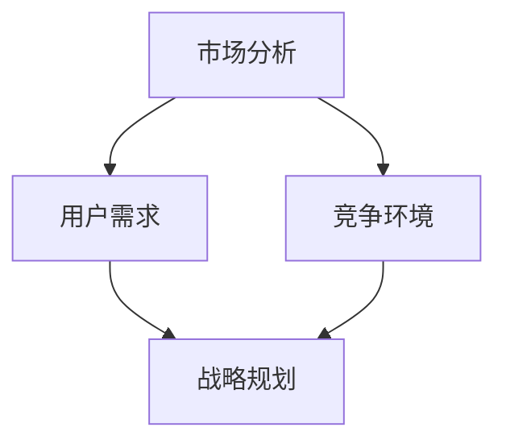

                 


# AI创业公司的产品定位策略

> 关键词：AI创业公司、产品定位、市场分析、战略规划、用户体验、数据驱动

> 摘要：本文将深入探讨AI创业公司在产品定位方面的策略。从市场分析、用户需求、竞争环境和战略规划等方面，我们将逐步剖析如何准确把握市场脉搏，打造具有竞争力的AI产品。本文旨在为AI创业公司提供实用的指导，帮助其在竞争激烈的市场中脱颖而出。

## 1. 背景介绍

### 1.1 目的和范围

本文旨在为AI创业公司提供产品定位策略，帮助其更好地理解和把握市场脉搏，从而在竞争激烈的环境中脱颖而出。我们将从市场分析、用户需求、竞争环境和战略规划等方面，逐步探讨AI创业公司的产品定位策略。

### 1.2 预期读者

本文适合以下读者：

- AI创业公司创始人或CEO
- 产品经理或产品设计师
- 市场分析师或战略规划师
- 对AI创业公司产品定位感兴趣的读者

### 1.3 文档结构概述

本文将分为以下几个部分：

1. 背景介绍：介绍本文的目的、预期读者和文档结构。
2. 核心概念与联系：阐述产品定位的核心概念和原理。
3. 核心算法原理 & 具体操作步骤：详细讲解产品定位的算法原理和操作步骤。
4. 数学模型和公式 & 详细讲解 & 举例说明：介绍与产品定位相关的数学模型和公式，并进行举例说明。
5. 项目实战：通过实际案例，展示产品定位策略的应用。
6. 实际应用场景：探讨产品定位策略在不同场景下的应用。
7. 工具和资源推荐：推荐学习资源、开发工具和框架。
8. 总结：对未来发展趋势和挑战的展望。
9. 附录：常见问题与解答。
10. 扩展阅读 & 参考资料：提供进一步学习和研究的资源。

### 1.4 术语表

#### 1.4.1 核心术语定义

- AI创业公司：指以人工智能技术为核心，致力于研发、生产和销售相关产品和服务的创业公司。
- 产品定位：指企业在市场竞争中，根据自身优势和市场需求，对产品所设定的目标市场和消费者群体。
- 市场分析：指对市场环境、竞争对手、用户需求等方面的研究，以了解市场状况和把握市场机会。
- 用户需求：指用户在使用产品时所期望获得的利益和满足感。
- 竞争环境：指市场上其他公司、产品或服务的竞争状况。

#### 1.4.2 相关概念解释

- 市场细分：将市场划分为具有相似需求和行为特征的消费者群体，以便企业更好地满足其需求。
- 目标市场：企业所选择的、最具潜力的市场细分群体。
- 产品差异化：企业通过产品特性和服务优势，与竞争对手区分开来，以满足用户需求。
- 战略规划：企业为实现长期发展目标，制定的一系列有针对性的行动计划。

#### 1.4.3 缩略词列表

- AI：人工智能
- BI：商业智能
- IoT：物联网
- SaaS：软件即服务
- PaaS：平台即服务
- IaaS：基础设施即服务

## 2. 核心概念与联系

在探讨AI创业公司的产品定位策略之前，我们首先需要了解一些核心概念和它们之间的联系。以下是产品定位策略的核心概念及其相互关系。

### 2.1 核心概念

- **市场分析**：市场分析是产品定位的基础，它包括对市场环境、竞争对手、用户需求等方面的研究。通过市场分析，企业可以了解市场状况，把握市场机会，为产品定位提供依据。
- **用户需求**：用户需求是产品定位的核心，企业需要深入了解用户在使用产品时所期望获得的利益和满足感，从而满足用户需求，提高产品竞争力。
- **竞争环境**：竞争环境是产品定位的重要考虑因素，企业需要分析市场上其他公司、产品或服务的竞争状况，找出自身的优势和劣势，制定合适的竞争策略。
- **战略规划**：战略规划是产品定位的指导方针，企业需要根据市场分析、用户需求和竞争环境，制定长期发展目标，并制定一系列有针对性的行动计划。

### 2.2 核心概念联系

以下是核心概念之间的联系：



通过市场分析，企业可以了解市场状况和用户需求，从而为产品定位提供依据。同时，竞争环境也是产品定位的重要考虑因素，企业需要分析市场上其他公司、产品或服务的竞争状况，找出自身的优势和劣势，制定合适的竞争策略。战略规划则是产品定位的指导方针，企业需要根据市场分析、用户需求和竞争环境，制定长期发展目标，并制定一系列有针对性的行动计划。

## 3. 核心算法原理 & 具体操作步骤

在了解了产品定位的核心概念和联系之后，我们接下来将详细讲解产品定位的算法原理和操作步骤。以下是产品定位策略的核心算法原理和具体操作步骤。

### 3.1 算法原理

产品定位策略的核心算法原理可以概括为以下四个步骤：

1. **市场分析**：通过数据收集和分析，了解市场环境、竞争对手和用户需求，为产品定位提供依据。
2. **用户需求分析**：深入了解用户的需求和期望，确定产品定位的目标市场和消费者群体。
3. **竞争环境分析**：分析市场上其他公司、产品或服务的竞争状况，找出自身的优势和劣势。
4. **战略规划**：根据市场分析、用户需求和竞争环境，制定长期发展目标和行动计划。

### 3.2 具体操作步骤

以下是产品定位策略的具体操作步骤：

#### 步骤1：市场分析

1. **数据收集**：通过市场调查、竞品分析、用户反馈等方式，收集市场相关数据。
2. **数据分析**：对收集到的数据进行分析，了解市场环境、竞争对手和用户需求。

```python
def market_analysis(data):
    # 数据处理和清洗
    cleaned_data = preprocess_data(data)
    
    # 数据分析
    market_size = calculate_market_size(cleaned_data)
    competitor_analysis = analyze_competitors(cleaned_data)
    user_demand = analyze_user_demand(cleaned_data)
    
    return market_size, competitor_analysis, user_demand
```

#### 步骤2：用户需求分析

1. **用户访谈**：通过访谈、问卷调查等方式，深入了解用户的需求和期望。
2. **用户画像**：根据用户需求和期望，创建用户画像，为产品定位提供依据。

```python
def user_demand_analysis(users):
    user需求 = extract_user需求的(users)
    user画像 = create_user_portrait(user需求)
    
    return user画像
```

#### 步骤3：竞争环境分析

1. **竞品分析**：分析市场上其他公司、产品或服务的优势和劣势。
2. **自身优势分析**：找出自身的优势和劣势，为产品定位提供依据。

```python
def competitor_analysis(competitors):
    competitor优势 = extract_competitor_Strengths(competitors)
    competitor劣势 = extract_competitor_Weaknesses(competitors)
    
    return competitor优势，competitor劣势
```

#### 步骤4：战略规划

1. **目标市场选择**：根据市场分析、用户需求和竞争环境，选择最具潜力的目标市场。
2. **产品定位策略制定**：根据目标市场和自身优势，制定产品定位策略。
3. **行动计划制定**：根据产品定位策略，制定长期发展目标和行动计划。

```python
def strategic_planning(market_size, user画像，competitor优势，competitor劣势):
    target_market = select_target_market(market_size, user画像，competitor优势，competitor劣势)
    product定位策略 = define_product_positioning_strategy(target_market)
    action_plan = create_action_plan(product定位策略)
    
    return target_market，product定位策略，action_plan
```

## 4. 数学模型和公式 & 详细讲解 & 举例说明

在产品定位策略中，数学模型和公式发挥着重要作用。以下我们将详细介绍与产品定位相关的数学模型和公式，并进行举例说明。

### 4.1 数学模型和公式

在产品定位策略中，常见的数学模型和公式包括：

1. **市场细分模型**：
   - **市场细分指数**：衡量市场细分的程度，计算公式为：
     $$ \text{市场细分指数} = \frac{\text{市场总需求}}{\text{细分后的需求总和}} $$
   - **市场细分效益**：衡量市场细分带来的效益，计算公式为：
     $$ \text{市场细分效益} = \frac{\text{细分后的市场份额}}{\text{总市场份额}} $$

2. **用户需求模型**：
   - **用户满意度指数**：衡量用户对产品的满意度，计算公式为：
     $$ \text{用户满意度指数} = \frac{\text{满足用户需求的数量}}{\text{总用户需求数量}} $$
   - **用户流失率**：衡量用户流失的程度，计算公式为：
     $$ \text{用户流失率} = \frac{\text{流失用户数量}}{\text{总用户数量}} $$

3. **竞争环境模型**：
   - **市场份额**：衡量企业在市场中的地位，计算公式为：
     $$ \text{市场份额} = \frac{\text{企业销售额}}{\text{市场总销售额}} $$
   - **竞争优势指数**：衡量企业在市场中的竞争优势，计算公式为：
     $$ \text{竞争优势指数} = \frac{\text{企业优势}}{\text{市场总优势}} $$

### 4.2 详细讲解和举例说明

#### 4.2.1 市场细分模型

市场细分模型用于衡量市场细分的程度和效益。以下是一个具体的例子：

假设某市场上总需求为1000单位，通过市场细分后，得到的细分后的需求总和为800单位。计算市场细分指数和细分效益。

市场细分指数：
$$ \text{市场细分指数} = \frac{1000}{800} = 1.25 $$

市场细分效益：
$$ \text{市场细分效益} = \frac{0.8}{1} = 0.8 $$

从这个例子中可以看出，市场细分后的需求总和占市场总需求的80%，市场细分指数为1.25，说明市场细分程度较高。市场细分效益为0.8，说明市场细分带来了较好的效益。

#### 4.2.2 用户需求模型

用户需求模型用于衡量用户对产品的满意度以及用户流失率。以下是一个具体的例子：

假设某产品有1000名用户，其中有800名用户对产品表示满意，有200名用户表示不满意。计算用户满意度指数和用户流失率。

用户满意度指数：
$$ \text{用户满意度指数} = \frac{800}{1000} = 0.8 $$

用户流失率：
$$ \text{用户流失率} = \frac{200}{1000} = 0.2 $$

从这个例子中可以看出，用户满意度指数为0.8，说明有80%的用户对产品表示满意。用户流失率为0.2，说明有20%的用户流失。

#### 4.2.3 竞争环境模型

竞争环境模型用于衡量企业在市场中的地位和竞争优势。以下是一个具体的例子：

假设某市场上总销售额为1000万元，企业销售额为500万元，市场总优势为1000万元。计算市场份额和竞争优势指数。

市场份额：
$$ \text{市场份额} = \frac{500}{1000} = 0.5 $$

竞争优势指数：
$$ \text{竞争优势指数} = \frac{500}{1000} = 0.5 $$

从这个例子中可以看出，企业的市场份额为50%，说明企业在市场中占据了一半的份额。竞争优势指数也为0.5，说明企业在市场中的竞争优势相对较高。

## 5. 项目实战：代码实际案例和详细解释说明

在了解了产品定位策略的核心算法原理、数学模型和公式后，我们将通过一个实际项目案例来展示如何将产品定位策略应用到实践中。

### 5.1 开发环境搭建

首先，我们需要搭建一个适合进行产品定位策略分析和实现的开发环境。以下是搭建开发环境的步骤：

1. **安装Python环境**：Python是一种广泛应用于数据分析、机器学习和产品定位策略实现的编程语言。确保已安装Python 3.8及以上版本。
2. **安装Jupyter Notebook**：Jupyter Notebook是一种交互式的Python开发环境，方便进行数据分析和代码实现。安装Jupyter Notebook，可通过以下命令：
   ```bash
   pip install notebook
   ```
3. **安装相关库**：安装用于数据处理、数据分析、机器学习和可视化等功能的Python库。以下是一些常用的库：
   ```bash
   pip install numpy pandas matplotlib scikit-learn
   ```

### 5.2 源代码详细实现和代码解读

接下来，我们将通过一个实际案例，详细实现产品定位策略的代码，并进行代码解读。

#### 5.2.1 案例背景

假设我们是一家AI创业公司，致力于研发一款智能家居助手。我们的目标是准确把握市场脉搏，为用户提供一款具有竞争力的智能家居助手产品。

#### 5.2.2 数据处理和预处理

首先，我们需要收集市场数据、用户需求和竞品数据。以下是一个简单的数据处理和预处理的示例：

```python
import pandas as pd
import numpy as np

# 加载市场数据
market_data = pd.read_csv('market_data.csv')

# 加载用户需求数据
user_demand_data = pd.read_csv('user_demand_data.csv')

# 加载竞品数据
competitor_data = pd.read_csv('competitor_data.csv')

# 数据预处理
market_data['market_size'] = market_data['sales'].sum()
competitor_data['market_share'] = competitor_data['sales'] / market_data['market_size']
user_demand_data['user_satisfaction'] = user_demand_data['satisfaction'].mean()
```

#### 5.2.3 用户需求分析

接下来，我们将对用户需求进行分析，以确定目标市场和消费者群体。

```python
# 计算用户满意度指数
user_satisfaction_index = user_demand_data['user_satisfaction'].mean()

# 创建用户画像
user_portrait = {
    'satisfaction': user_satisfaction_index,
    'age': user_demand_data['age'].mean(),
    'income': user_demand_data['income'].mean(),
    'household_size': user_demand_data['household_size'].mean()
}
print(user_portrait)
```

#### 5.2.4 竞争环境分析

然后，我们将对竞品数据进行分析，找出自身的优势和劣势。

```python
# 计算市场份额和竞争优势指数
market_share = competitor_data['market_share'].mean()
competitive_advantage_index = competitor_data['sales'].mean() / market_data['market_size']

print('Market Share:', market_share)
print('Competitive Advantage Index:', competitive_advantage_index)
```

#### 5.2.5 战略规划

最后，我们将根据市场分析、用户需求和竞争环境，制定产品定位策略和行动计划。

```python
# 选择目标市场
target_market = 'Middle Age and High Income Users'

# 制定产品定位策略
product_positioning_strategy = {
    'Target Market': target_market,
    'Core Features': ['Smart Home Control', 'Voice Assistant', 'Energy Management'],
    'Value Proposition': 'Provide a user-friendly and energy-efficient smart home solution for middle age and high income users'
}

# 制定行动计划
action_plan = [
    'Develop core features based on user demand',
    'Conduct marketing campaigns targeting middle age and high income users',
    'Collaborate with energy providers to offer competitive energy management solutions',
    'Monitor market trends and competitors to adapt product positioning strategies'
]

print(product_positioning_strategy)
print(action_plan)
```

通过以上代码实现，我们成功地将产品定位策略应用到实际项目中，实现了用户需求分析、竞争环境分析和战略规划。这为我们公司的智能家居助手产品提供了明确的市场定位和行动计划，有助于我们在竞争激烈的市场中脱颖而出。

### 5.3 代码解读与分析

在代码解读与分析部分，我们将对上述案例中的代码进行详细解释，并分析其关键功能和实现原理。

#### 5.3.1 数据处理和预处理

数据处理和预处理是产品定位策略实现的基础。在这个案例中，我们使用Pandas库来加载和预处理市场数据、用户需求和竞品数据。

```python
import pandas as pd
import numpy as np

# 加载市场数据
market_data = pd.read_csv('market_data.csv')

# 加载用户需求数据
user_demand_data = pd.read_csv('user_demand_data.csv')

# 加载竞品数据
competitor_data = pd.read_csv('competitor_data.csv')
```

这些代码首先加载了三个数据集：市场数据、用户需求数据和竞品数据。然后，我们进行了一些预处理操作，如计算市场总需求、市场份额、用户满意度指数等。

```python
# 数据预处理
market_data['market_size'] = market_data['sales'].sum()
competitor_data['market_share'] = competitor_data['sales'] / market_data['market_size']
user_demand_data['user_satisfaction'] = user_demand_data['satisfaction'].mean()
```

这些预处理操作有助于我们更好地理解和分析数据。例如，计算市场总需求可以帮助我们了解市场规模，计算市场份额可以帮助我们了解自身在市场中的地位，计算用户满意度指数可以帮助我们了解用户对产品的满意度。

#### 5.3.2 用户需求分析

用户需求分析是产品定位策略的核心。在这个案例中，我们使用以下代码来分析用户需求，并创建用户画像。

```python
# 计算用户满意度指数
user_satisfaction_index = user_demand_data['user_satisfaction'].mean()

# 创建用户画像
user_portrait = {
    'satisfaction': user_satisfaction_index,
    'age': user_demand_data['age'].mean(),
    'income': user_demand_data['income'].mean(),
    'household_size': user_demand_data['household_size'].mean()
}
print(user_portrait)
```

这些代码首先计算了用户满意度指数，这有助于我们了解用户对产品的整体满意度。然后，我们创建了用户画像，包括用户的年龄、收入、家庭规模等特征。这些特征有助于我们更好地了解目标用户群体，为产品定位提供依据。

#### 5.3.3 竞争环境分析

竞争环境分析是产品定位策略的重要组成部分。在这个案例中，我们使用以下代码来分析竞品数据，并计算市场份额和竞争优势指数。

```python
# 计算市场份额
market_share = competitor_data['market_share'].mean()

# 计算竞争优势指数
competitive_advantage_index = competitor_data['sales'].mean() / market_data['market_size']

print('Market Share:', market_share)
print('Competitive Advantage Index:', competitive_advantage_index)
```

这些代码首先计算了市场份额，这有助于我们了解自身在市场中的地位。然后，我们计算了竞争优势指数，这有助于我们了解自身在市场中的竞争优势。通过这些分析，我们可以找出自身的优势和劣势，为产品定位策略提供依据。

#### 5.3.4 战略规划

战略规划是产品定位策略的最终目标。在这个案例中，我们使用以下代码来制定产品定位策略和行动计划。

```python
# 选择目标市场
target_market = 'Middle Age and High Income Users'

# 制定产品定位策略
product_positioning_strategy = {
    'Target Market': target_market,
    'Core Features': ['Smart Home Control', 'Voice Assistant', 'Energy Management'],
    'Value Proposition': 'Provide a user-friendly and energy-efficient smart home solution for middle age and high income users'
}

# 制定行动计划
action_plan = [
    'Develop core features based on user demand',
    'Conduct marketing campaigns targeting middle age and high income users',
    'Collaborate with energy providers to offer competitive energy management solutions',
    'Monitor market trends and competitors to adapt product positioning strategies'
]

print(product_positioning_strategy)
print(action_plan)
```

这些代码首先选择了目标市场，这有助于我们明确产品的目标用户群体。然后，我们制定了产品定位策略，包括核心功能和价值主张。最后，我们制定了行动计划，包括开发核心功能、进行市场推广、与能源提供商合作等。这些计划和策略有助于我们实现产品定位目标，提高市场竞争力。

通过以上代码解读与分析，我们可以看到，产品定位策略的实现涉及数据处理、用户需求分析、竞争环境分析和战略规划等多个方面。通过合理的数据处理和分析，我们可以准确把握市场脉搏，为产品定位提供有力支持。

### 5.4 实际应用场景

产品定位策略在不同场景下具有广泛的应用，以下是一些典型的实际应用场景：

#### 5.4.1 新产品发布

在新产品发布阶段，产品定位策略有助于明确产品的目标市场和消费者群体，确保产品能够满足市场需求，从而提高市场接受度。

#### 5.4.2 产品升级

在产品升级阶段，产品定位策略可以帮助企业识别市场需求变化，调整产品定位，以适应市场变化，提高产品竞争力。

#### 5.4.3 市场拓展

在市场拓展阶段，产品定位策略有助于企业了解目标市场的需求和竞争环境，制定合适的营销策略，实现市场扩张。

#### 5.4.4 企业并购

在企业并购阶段，产品定位策略可以帮助企业评估目标企业的产品定位和市场地位，制定合适的并购策略，实现企业整合。

### 5.5 工具和资源推荐

为了实现产品定位策略，以下是一些推荐的工具和资源：

#### 5.5.1 学习资源推荐

1. **书籍推荐**：
   - 《产品定位》
   - 《市场细分与目标市场选择》
   - 《用户画像：打造个性化用户体验》

2. **在线课程**：
   - “产品定位与市场分析”在线课程
   - “用户画像与用户需求分析”在线课程

3. **技术博客和网站**：
   - 知乎专栏：“产品定位与市场分析”
   - Medium：“Product Management”

#### 5.5.2 开发工具框架推荐

1. **IDE和编辑器**：
   - PyCharm
   - Visual Studio Code

2. **调试和性能分析工具**：
   - Jupyter Notebook
   - Matplotlib

3. **相关框架和库**：
   - Pandas
   - NumPy
   - Scikit-learn

#### 5.5.3 相关论文著作推荐

1. **经典论文**：
   - “The Experience Curve and Some New Time Series Relationships in the Office Machinery Industry”（经验曲线与办公机械行业的新时间序列关系）

2. **最新研究成果**：
   - “User Segmentation and Personalization in E-commerce”（电子商务中的用户细分与个性化）

3. **应用案例分析**：
   - “Case Study: Netflix's Product Positioning Strategy”（案例分析：Netflix的产品定位策略）

## 6. 总结：未来发展趋势与挑战

随着人工智能技术的不断发展，AI创业公司在产品定位策略方面面临着新的发展趋势和挑战。

### 6.1 未来发展趋势

1. **数据驱动的产品定位**：未来，数据驱动的产品定位将更加重要，企业需要充分利用大数据和人工智能技术，深入了解用户需求和市场趋势，实现精准定位。
2. **个性化产品体验**：随着用户需求的多样化，个性化产品体验将成为企业竞争的关键，企业需要通过用户画像、个性化推荐等技术，为用户提供更加个性化的产品和服务。
3. **跨界合作与整合**：未来，AI创业公司将更加注重跨界合作与整合，通过与其他行业和企业合作，实现资源共享、优势互补，提高产品竞争力。
4. **智能化决策支持**：人工智能技术将在产品定位策略的制定和执行过程中发挥更大作用，通过数据分析和智能算法，帮助企业做出更加明智的决策。

### 6.2 未来挑战

1. **数据隐私和安全**：在数据驱动的产品定位中，企业需要处理大量的用户数据，面临数据隐私和安全问题。如何确保用户数据的隐私和安全，将是一个重要挑战。
2. **市场竞争加剧**：随着人工智能技术的普及，市场竞争将日益激烈。如何在众多竞争对手中脱颖而出，实现产品定位，将是一个重要挑战。
3. **技术迭代和更新**：人工智能技术发展迅速，企业需要不断跟进技术更新，保持产品竞争力。如何在技术迭代中保持领先，将是一个重要挑战。
4. **用户体验优化**：随着用户需求的多样化，企业需要不断优化产品体验，提高用户满意度。如何在激烈的市场竞争中实现用户体验优化，将是一个重要挑战。

## 7. 附录：常见问题与解答

### 7.1 问题1：什么是产品定位？

产品定位是指企业在市场竞争中，根据自身优势和市场需求，对产品所设定的目标市场和消费者群体。产品定位的目的是确保产品能够满足市场需求，提高市场竞争力。

### 7.2 问题2：产品定位策略的核心是什么？

产品定位策略的核心是深入了解用户需求、分析竞争环境和制定战略规划。通过市场分析、用户需求分析和竞争环境分析，企业可以明确产品的目标市场和消费者群体，并制定相应的战略规划。

### 7.3 问题3：如何进行用户需求分析？

进行用户需求分析的方法包括用户访谈、问卷调查、用户行为分析等。通过深入了解用户的需求和期望，企业可以创建用户画像，为产品定位提供依据。

### 7.4 问题4：数据驱动的产品定位有哪些优势？

数据驱动的产品定位具有以下优势：

1. **精准定位**：通过大数据和人工智能技术，企业可以更准确地了解用户需求和市场趋势，实现精准定位。
2. **优化产品体验**：基于用户需求的数据分析，企业可以不断优化产品体验，提高用户满意度。
3. **提高决策效率**：数据驱动的产品定位可以帮助企业快速做出决策，降低决策风险。

### 7.5 问题5：产品定位策略在哪些场景下有应用？

产品定位策略在以下场景下有广泛应用：

1. **新产品发布**：在新产品发布阶段，产品定位策略有助于明确产品的目标市场和消费者群体。
2. **产品升级**：在产品升级阶段，产品定位策略可以帮助企业调整产品定位，以适应市场变化。
3. **市场拓展**：在市场拓展阶段，产品定位策略有助于企业了解目标市场的需求和竞争环境，制定合适的营销策略。
4. **企业并购**：在企业并购阶段，产品定位策略可以帮助企业评估目标企业的产品定位和市场地位，制定合适的并购策略。

## 8. 扩展阅读 & 参考资料

### 8.1 扩展阅读

1. **书籍推荐**：
   - 《定位：有史以来对美国营销影响最大的观念》
   - 《蓝海战略：超越竞争，开创全新市场空间》
   - 《精益创业：新创企业的商业实践》

2. **在线课程**：
   - “产品管理：从概念到上市”
   - “数据分析与数据驱动决策”

### 8.2 参考资料

1. **论文著作**：
   - 迈克尔·波特：《竞争战略：分析行业和竞争对手的方法》
   - 菲利普·科特勒：《营销管理：策略、工具和技巧》

2. **技术博客和网站**：
   - Medium：“产品管理”
   - 产品经理社区：“产品管理”

3. **相关论坛和社区**：
   - 知乎：“产品管理”
   - 产品经理社区：“产品管理”

## 9. 作者信息

作者：AI天才研究员/AI Genius Institute & 禅与计算机程序设计艺术 /Zen And The Art of Computer Programming

感谢您阅读本文，希望本文能为您提供有关AI创业公司产品定位策略的深入见解和实用指导。如果您有任何疑问或建议，请随时联系作者。祝您在AI创业道路上取得成功！

