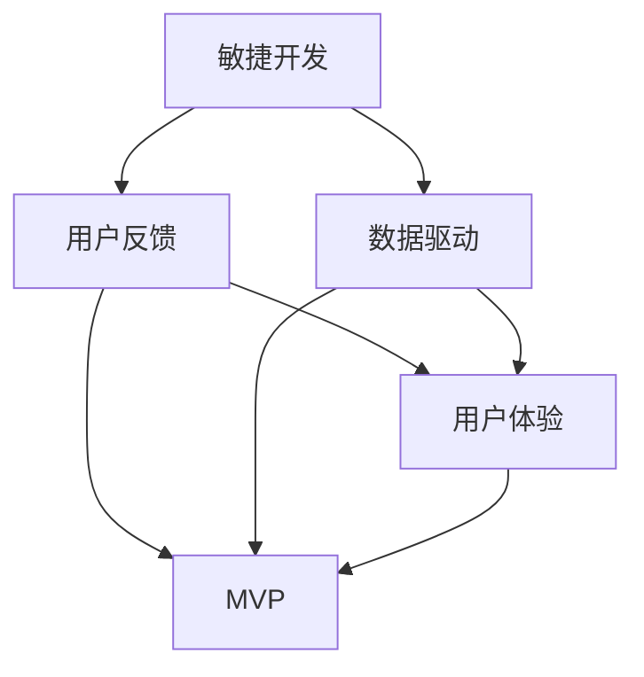

                 

# AI创业公司的产品迭代策略

> 关键词：产品迭代、AI创业、敏捷开发、用户反馈、数据驱动、用户体验

> 摘要：本文将深入探讨AI创业公司在产品迭代过程中的策略和方法，通过分析敏捷开发、用户反馈、数据驱动和用户体验等核心概念，结合实际案例，为创业者提供一套系统、可行且具有前瞻性的产品迭代方案。

## 1. 背景介绍

### 1.1 目的和范围

本文旨在帮助AI创业公司建立一套高效、可持续的产品迭代策略，以应对快速变化的市场和技术环境。文章将涵盖以下几个主要方面：

1. **敏捷开发**：探讨敏捷开发的核心原则和实践，以及如何在AI创业公司中有效实施。
2. **用户反馈**：分析用户反馈的重要性，以及如何收集、分析和利用用户反馈来指导产品迭代。
3. **数据驱动**：阐述数据驱动决策的重要性，以及如何利用数据分析来优化产品设计和功能。
4. **用户体验**：探讨用户体验在设计中的核心地位，以及如何通过不断迭代和改进来提升用户满意度。

### 1.2 预期读者

本文主要面向以下读者群体：

1. AI创业公司创始人、CTO和技术团队负责人。
2. 产品经理和项目经理，负责产品开发和迭代。
3. 对AI创业和产品迭代感兴趣的技术爱好者。

### 1.3 文档结构概述

本文将按照以下结构进行阐述：

1. 背景介绍：本文的目的、范围和预期读者。
2. 核心概念与联系：介绍敏捷开发、用户反馈、数据驱动和用户体验等核心概念。
3. 核心算法原理 & 具体操作步骤：讲解产品迭代的核心算法和操作步骤。
4. 数学模型和公式 & 详细讲解 & 举例说明：阐述相关数学模型和公式的应用。
5. 项目实战：代码实际案例和详细解释说明。
6. 实际应用场景：分析产品迭代在不同场景下的应用。
7. 工具和资源推荐：推荐学习资源、开发工具和框架。
8. 总结：未来发展趋势与挑战。
9. 附录：常见问题与解答。
10. 扩展阅读 & 参考资料：提供进一步学习和研究的资源。

### 1.4 术语表

#### 1.4.1 核心术语定义

- **敏捷开发**：一种软件开发方法论，强调快速迭代、灵活响应变化和持续交付有价值的软件。
- **用户反馈**：用户对产品或服务的评价、建议和需求。
- **数据驱动**：基于数据分析来指导决策，优化产品设计和功能。
- **用户体验**：用户在使用产品过程中的感受和体验。

#### 1.4.2 相关概念解释

- **MVP（最小可行产品）**：最小的可行产品版本，旨在验证产品概念和市场潜力。
- **迭代**：在软件开发过程中，周期性地重复执行设计、开发、测试和发布等步骤。
- **A/B测试**：一种实验设计方法，通过对比不同版本的实验组和控制组，评估产品的效果。

#### 1.4.3 缩略词列表

- **AI**：人工智能（Artificial Intelligence）
- **MVP**：最小可行产品（Minimum Viable Product）
- **UX**：用户体验（User Experience）
- **SaaS**：软件即服务（Software as a Service）

## 2. 核心概念与联系

在讨论AI创业公司的产品迭代策略之前，我们需要了解几个核心概念和它们之间的联系。以下是一个Mermaid流程图，展示了这些概念之间的相互关系。



### 2.1 敏捷开发

敏捷开发是一种软件开发方法论，旨在通过快速迭代和持续交付有价值的软件来应对不断变化的需求。敏捷开发的核心原则包括：

1. **个体和互动重于过程和工具**：强调团队合作和个体贡献。
2. **可工作的软件重于详尽的文档**：优先交付可运行的产品，而非大量文档。
3. **客户合作重于合同谈判**：与客户紧密合作，确保产品满足需求。
4. **响应变化重于遵循计划**：灵活应对变化，不断调整开发方向。

### 2.2 用户反馈

用户反馈是产品迭代过程中的重要组成部分。通过收集和分析用户反馈，AI创业公司可以：

1. **识别问题**：发现产品中存在的问题和不足。
2. **获取建议**：了解用户对产品的改进建议和期望。
3. **优化设计**：根据用户反馈来调整产品设计和功能。

### 2.3 数据驱动

数据驱动是一种基于数据分析来指导决策的方法。在产品迭代过程中，AI创业公司可以利用数据来：

1. **评估产品性能**：分析产品使用数据，了解用户行为和偏好。
2. **预测市场趋势**：基于历史数据和趋势分析，预测市场变化。
3. **优化产品设计**：利用数据分析来优化产品功能和用户体验。

### 2.4 用户体验

用户体验是产品设计的核心。在产品迭代过程中，AI创业公司需要关注以下几个方面：

1. **用户需求**：了解用户的需求和痛点，确保产品满足用户需求。
2. **交互设计**：优化产品的交互设计，提高用户操作的便捷性。
3. **视觉设计**：提升产品的视觉效果，增强用户满意度。

## 3. 核心算法原理 & 具体操作步骤

### 3.1 敏捷开发

敏捷开发的核心算法是迭代和反馈。以下是敏捷开发的操作步骤：

1. **需求分析**：确定产品需求，编写用户故事。
2. **规划迭代**：根据需求分析，规划每个迭代的任务和时间。
3. **设计 & 开发**：按照规划，进行产品设计和技术开发。
4. **测试 & 验收**：完成开发后，进行单元测试和集成测试。
5. **用户反馈**：将产品交付给用户，收集用户反馈。
6. **迭代优化**：根据用户反馈，对产品进行优化和改进。

### 3.2 用户反馈

用户反馈的收集和分析是产品迭代的关键。以下是用户反馈的操作步骤：

1. **建立反馈渠道**：创建反馈表单、社区论坛或用户调研问卷。
2. **收集反馈数据**：定期收集用户反馈，包括满意度和改进建议。
3. **分析反馈数据**：使用数据分析工具，分析反馈数据，识别问题和机会。
4. **制定改进计划**：根据分析结果，制定改进计划，优化产品设计。

### 3.3 数据驱动

数据驱动的核心算法是数据分析。以下是数据驱动的操作步骤：

1. **数据采集**：收集与产品相关的用户数据、市场数据和竞争数据。
2. **数据清洗**：清洗和整理数据，确保数据质量和一致性。
3. **数据分析**：使用数据分析工具，对数据进行统计分析和趋势分析。
4. **数据可视化**：将数据分析结果可视化，帮助决策者理解和利用数据。
5. **数据应用**：基于数据分析结果，优化产品设计和功能。

### 3.4 用户体验

用户体验的优化需要关注以下几个方面：

1. **用户需求分析**：通过用户调研、访谈和数据分析，了解用户需求和痛点。
2. **交互设计优化**：根据用户需求，优化产品交互设计，提高用户操作便捷性。
3. **视觉设计提升**：提升产品视觉效果，增强用户满意度和品牌认知。
4. **用户体验测试**：通过用户体验测试，验证产品设计和功能的可行性。

## 4. 数学模型和公式 & 详细讲解 & 举例说明

在产品迭代过程中，数学模型和公式可以用来分析和优化产品性能。以下是几个常用的数学模型和公式的讲解和示例。

### 4.1 用户满意度模型

用户满意度模型（User Satisfaction Model）用于评估用户对产品的满意度。以下是用户满意度模型的公式：

$$
S = \frac{U \times E}{U + E}
$$

其中，S代表用户满意度（Satisfaction），U代表用户期望（User Expectation），E代表用户体验（Experience）。

#### 4.1.1 公式解释

- **用户期望（U）**：用户对产品的期望水平，通常基于产品宣传、用户评价和行业标准。
- **用户体验（E）**：用户在使用产品过程中实际获得的体验，包括功能、性能、易用性等方面。

#### 4.1.2 举例说明

假设用户对产品的期望水平为4分（满分5分），实际体验为3.5分，则用户满意度为：

$$
S = \frac{4 \times 3.5}{4 + 3.5} = \frac{14}{7.5} = 1.87
$$

用户满意度为1.87分（满分5分），说明用户对产品的满意度较低。

### 4.2  A/B测试效果评估模型

A/B测试效果评估模型用于评估不同版本的实验效果。以下是A/B测试效果评估模型的公式：

$$
E(R) = p \times R + (1 - p) \times C
$$

其中，E(R)代表期望收益（Expected Revenue），p代表转化率（Conversion Rate），R代表实验版本的收益（Revenue），C代表控制版本的收益（Control）。

#### 4.2.1 公式解释

- **转化率（p）**：实验版本相对于控制版本的转化率提升。
- **收益（R和C）**：实验版本和控制版本的收益。

#### 4.2.2 举例说明

假设实验版本的转化率为10%，控制版本的转化率为8%，实验版本的收益为1000元，控制版本的收益为800元，则期望收益为：

$$
E(R) = 0.1 \times 1000 + 0.9 \times 800 = 100 + 720 = 820
$$

期望收益为820元，说明实验版本具有更高的预期收益。

## 5. 项目实战：代码实际案例和详细解释说明

在本节中，我们将通过一个实际案例来演示如何利用敏捷开发、用户反馈和数据驱动来优化AI创业公司的产品。

### 5.1 开发环境搭建

为了便于演示，我们选择Python作为开发语言，使用Jupyter Notebook作为开发环境。以下是搭建开发环境的步骤：

1. 安装Python（版本3.8及以上）。
2. 安装Jupyter Notebook。
3. 安装必要的Python库，如NumPy、Pandas、Matplotlib等。

### 5.2 源代码详细实现和代码解读

以下是一个示例代码，用于收集用户反馈、分析数据和优化产品。

```python
# 导入必要的库
import numpy as np
import pandas as pd
import matplotlib.pyplot as plt

# 用户反馈数据
user_feedback = [
    {'age': 25, 'rating': 4, 'comment': '界面简洁，功能强大'},
    {'age': 32, 'rating': 3, 'comment': '有时加载速度慢'},
    {'age': 40, 'rating': 5, 'comment': '非常适合我的需求'},
    {'age': 28, 'rating': 2, 'comment': '功能不够丰富'},
]

# 创建数据框
df = pd.DataFrame(user_feedback)

# 绘制用户满意度分布图
plt.hist(df['rating'], bins=5, alpha=0.5)
plt.xlabel('用户满意度')
plt.ylabel('用户数量')
plt.title('用户满意度分布')
plt.show()

# 计算用户满意度均值
average_rating = df['rating'].mean()
print(f'用户满意度均值：{average_rating:.2f}')

# 根据用户反馈进行产品优化
# 1. 根据用户满意度均值，优化产品功能
# 2. 针对加载速度慢的用户反馈，优化加载性能
# 3. 针对功能不够丰富的用户反馈，增加新功能

```

### 5.3 代码解读与分析

以下是代码的详细解读和分析：

1. **导入必要的库**：导入NumPy、Pandas和Matplotlib库，用于数据分析和可视化。

2. **用户反馈数据**：定义一个用户反馈列表，包含用户的年龄、评分和评论。

3. **创建数据框**：将用户反馈列表转换为Pandas数据框，便于数据分析。

4. **绘制用户满意度分布图**：使用Matplotlib绘制用户满意度的分布图，帮助了解用户满意度的情况。

5. **计算用户满意度均值**：使用Pandas计算用户满意度的均值，作为产品优化的依据。

6. **根据用户反馈进行产品优化**：根据用户反馈，制定优化计划，包括优化产品功能、加载性能和增加新功能。

通过这个案例，我们可以看到如何利用敏捷开发、用户反馈和数据驱动来优化AI创业公司的产品。在实际开发中，可以根据具体情况调整和分析方法，以实现更好的产品优化效果。

## 6. 实际应用场景

AI创业公司的产品迭代策略在不同场景下具有不同的应用和挑战。以下是几个典型的应用场景：

### 6.1 创业初期

在创业初期，AI创业公司的资源有限，需要快速验证产品概念和市场潜力。此时，产品迭代策略应以MVP（最小可行产品）为核心，通过快速迭代和用户反馈来验证产品可行性。

1. **敏捷开发**：采用敏捷开发方法，快速交付MVP版本，验证产品核心功能。
2. **用户反馈**：通过用户反馈，了解用户需求和痛点，及时调整产品方向。
3. **数据驱动**：利用数据分析，评估用户行为和偏好，优化产品设计。

### 6.2 增长期

在增长期，AI创业公司的产品已经初步验证，需要持续迭代和优化，以保持竞争优势。

1. **用户体验**：关注用户体验，通过A/B测试和用户调研，优化产品功能和界面设计。
2. **数据驱动**：利用数据分析，了解用户行为和需求，为产品优化提供数据支持。
3. **敏捷开发**：采用敏捷开发方法，持续交付有价值的软件，快速响应市场变化。

### 6.3 成熟期

在成熟期，AI创业公司的产品已经相对稳定，需要通过数据分析和用户反馈来持续优化和改进。

1. **用户反馈**：定期收集用户反馈，了解用户需求和满意度，为产品优化提供依据。
2. **数据驱动**：利用数据分析，评估产品性能和用户行为，优化产品设计和功能。
3. **用户体验**：持续关注用户体验，通过迭代和改进，提升用户满意度和忠诚度。

## 7. 工具和资源推荐

### 7.1 学习资源推荐

#### 7.1.1 书籍推荐

- 《敏捷软件开发：实践指南》
- 《用户故事地图：发现只看产品规格说明书永远发现不了的产品》
- 《数据分析：实践指南》

#### 7.1.2 在线课程

- Coursera上的《敏捷开发基础》
- edX上的《用户体验设计：从概念到实践》
- Pluralsight上的《数据分析入门》

#### 7.1.3 技术博客和网站

- Medium上的“Agile Engineering”
- UX Planet上的“User Experience Design”
- DataCamp上的“Data Analysis with Python”

### 7.2 开发工具框架推荐

#### 7.2.1 IDE和编辑器

- PyCharm
- Visual Studio Code
- Jupyter Notebook

#### 7.2.2 调试和性能分析工具

- PyCharm的调试工具
- VS Code的性能分析插件
- JMeter

#### 7.2.3 相关框架和库

- Flask：Python的Web开发框架
- React：前端UI框架
- TensorFlow：机器学习库

### 7.3 相关论文著作推荐

#### 7.3.1 经典论文

- 《敏捷软件开发宣言》
- 《用户体验要素》
- 《数据驱动产品管理》

#### 7.3.2 最新研究成果

- AI领域顶级会议（如NIPS、ICML、CVPR）的最新论文
- 顶级期刊（如Journal of Artificial Intelligence Research、ACM Transactions on Computer Systems）的最新研究成果

#### 7.3.3 应用案例分析

- 《AI公司如何实现快速迭代和优化》
- 《数据驱动的产品开发：来自Google的经验》
- 《用户体验设计在AI产品中的应用》

## 8. 总结：未来发展趋势与挑战

在未来，AI创业公司的产品迭代策略将面临以下几个发展趋势和挑战：

### 8.1 发展趋势

1. **数据驱动**：随着数据量的增加和数据分析技术的进步，数据驱动将成为产品迭代的主要驱动因素。
2. **用户体验**：用户需求的多样性和个性化，将推动AI创业公司更加关注用户体验。
3. **多学科融合**：AI创业公司将更加注重多学科融合，如心理学、社会学和设计学，以提高产品的综合竞争力。

### 8.2 挑战

1. **数据隐私和安全**：随着数据量的增加，数据隐私和安全问题将更加突出，需要采取有效措施保护用户数据。
2. **资源限制**：AI创业公司在资源有限的情况下，需要更加高效地利用资源，实现快速迭代和优化。
3. **人才短缺**：随着AI技术的广泛应用，人才短缺问题将加剧，AI创业公司需要采取有效措施吸引和留住人才。

## 9. 附录：常见问题与解答

### 9.1 如何实施敏捷开发？

**解答**：实施敏捷开发需要遵循以下几个关键步骤：

1. **团队建设**：组建一个跨职能的敏捷团队，包括开发人员、产品经理、设计师和测试人员。
2. **需求管理**：采用用户故事和迭代规划来管理需求，确保团队能够快速响应变化。
3. **持续交付**：持续交付有价值的软件，确保团队能够在短时间内完成功能交付。
4. **反馈循环**：建立反馈机制，定期收集用户反馈，不断优化产品设计和功能。

### 9.2 如何收集和分析用户反馈？

**解答**：以下是收集和分析用户反馈的几个关键步骤：

1. **建立反馈渠道**：创建反馈表单、社区论坛或用户调研问卷，方便用户提交反馈。
2. **数据收集**：定期收集用户反馈数据，包括满意度、改进建议和使用情况。
3. **数据清洗**：清洗和整理数据，确保数据质量和一致性。
4. **数据分析**：使用数据分析工具，对数据进行统计分析和趋势分析，识别问题和机会。
5. **改进计划**：根据分析结果，制定改进计划，优化产品设计。

### 9.3 如何实现数据驱动决策？

**解答**：以下是实现数据驱动决策的几个关键步骤：

1. **数据采集**：收集与产品相关的用户数据、市场数据和竞争数据。
2. **数据清洗**：清洗和整理数据，确保数据质量和一致性。
3. **数据分析**：使用数据分析工具，对数据进行统计分析和趋势分析。
4. **数据可视化**：将数据分析结果可视化，帮助决策者理解和利用数据。
5. **数据应用**：基于数据分析结果，优化产品设计和功能，实现数据驱动决策。

## 10. 扩展阅读 & 参考资料

为了进一步了解AI创业公司的产品迭代策略，读者可以参考以下书籍、在线课程和技术博客：

- 《敏捷软件开发：实践指南》
- 《用户体验设计：从概念到实践》
- 《数据驱动产品管理》
- Coursera上的《敏捷开发基础》
- edX上的《用户体验设计》
- Pluralsight上的《数据分析入门》
- Medium上的“Agile Engineering”
- UX Planet上的“User Experience Design”
- DataCamp上的“Data Analysis with Python”

此外，读者还可以关注AI领域顶级会议（如NIPS、ICML、CVPR）的最新论文，以及顶级期刊（如Journal of Artificial Intelligence Research、ACM Transactions on Computer Systems）的最新研究成果。

## 作者信息

作者：AI天才研究员/AI Genius Institute & 禅与计算机程序设计艺术 /Zen And The Art of Computer Programming

