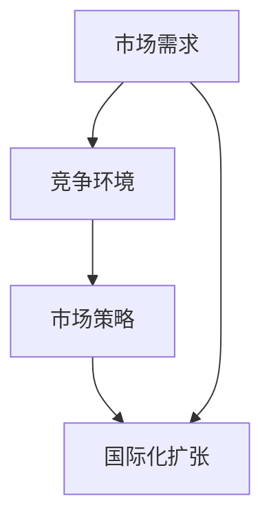
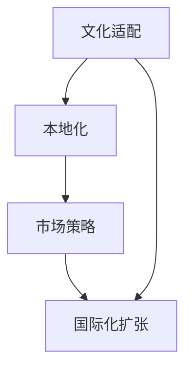
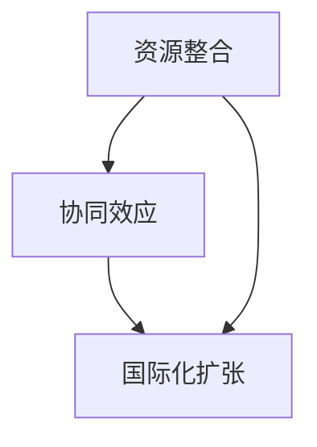
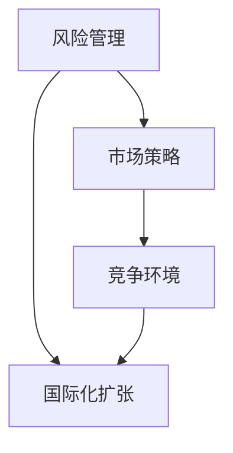

                 

# AI创业公司的国际化扩张策略

> **关键词：** 国际化扩张、市场策略、AI创业、全球竞争、文化适配、资源整合

> **摘要：** 本文将深入探讨AI创业公司如何成功实施国际化扩张策略。通过分析市场需求、竞争环境、文化适配和资源整合等多个方面，本文提供了详细的指导和建议，以帮助AI创业公司在全球范围内实现可持续增长。

## 1. 背景介绍

### 1.1 目的和范围

本文旨在为AI创业公司提供一套完整的国际化扩张策略，帮助它们在全球市场中站稳脚跟，实现长期发展。文章将涵盖以下主要方面：

- 市场分析和需求研究
- 竞争环境评估和应对策略
- 文化适配和本地化
- 资源整合和协同效应
- 国际化运营和风险管理

### 1.2 预期读者

本文适用于以下人群：

- AI创业公司创始人或高层管理者
- 企业战略规划师和国际化专家
- 对国际化扩张感兴趣的创业者
- 对AI技术和商业战略有浓厚兴趣的研究人员和学者

### 1.3 文档结构概述

本文的结构如下：

- 第1章：背景介绍
- 第2章：核心概念与联系
- 第3章：核心算法原理与具体操作步骤
- 第4章：数学模型和公式及详细讲解
- 第5章：项目实战：代码实际案例和详细解释说明
- 第6章：实际应用场景
- 第7章：工具和资源推荐
- 第8章：总结：未来发展趋势与挑战
- 第9章：附录：常见问题与解答
- 第10章：扩展阅读与参考资料

### 1.4 术语表

#### 1.4.1 核心术语定义

- **国际化扩张**：指企业在全球范围内进行市场拓展和业务布局，以实现规模效应和全球化运营。
- **市场策略**：企业为在特定市场中获得竞争优势而制定的具体行动方案。
- **AI创业公司**：利用人工智能技术进行创新和商业化的初创企业。
- **文化适配**：企业在跨国经营过程中，对目标市场的文化、法律和商业习惯进行适应性调整。

#### 1.4.2 相关概念解释

- **全球竞争**：国际市场中的企业之间的竞争，涉及技术、价格、服务和品牌等多方面。
- **资源整合**：企业通过优化资源配置，实现各部门和业务之间的协同效应。
- **风险管理**：企业在经营过程中识别、评估和应对潜在风险的过程。

#### 1.4.3 缩略词列表

- **AI**：人工智能
- **CRM**：客户关系管理
- **ERP**：企业资源规划
- **SaaS**：软件即服务
- **IaaS**：基础设施即服务
- **PaaS**：平台即服务

## 2. 核心概念与联系

在国际化扩张过程中，AI创业公司需要关注多个核心概念和联系，以确保策略的有效性和可行性。以下是几个关键概念和它们之间的关系：

### 2.1 市场需求与竞争环境

**市场需求**是国际化扩张的起点。了解目标市场的需求有助于AI创业公司确定产品定位和市场策略。而**竞争环境**则决定了企业在市场中的地位和挑战。两者之间的关系如图2-1所示。



### 2.2 文化适配与本地化

**文化适配**和**本地化**是成功国际化的重要保障。通过深入了解目标市场的文化、法律和商业习惯，AI创业公司可以调整产品和服务，以满足当地消费者的需求。如图2-2所示。



### 2.3 资源整合与协同效应

**资源整合**是国际化扩张的必要条件。通过优化资源配置，AI创业公司可以实现各部门和业务之间的协同效应，提高整体运营效率。如图2-3所示。



### 2.4 风险管理

**风险管理**贯穿于国际化扩张的整个过程中。识别、评估和应对潜在风险是确保国际化成功的关键。如图2-4所示。



## 3. 核心算法原理与具体操作步骤

在国际化扩张过程中，AI创业公司需要制定一系列市场策略和行动计划。以下是一种基于数据分析的算法原理和具体操作步骤：

### 3.1 算法原理

本算法基于数据驱动的市场策略制定过程，通过以下步骤实现：

1. 数据收集与预处理：收集目标市场的各类数据，包括市场趋势、竞争环境、消费者行为等。
2. 数据分析：对收集到的数据进行统计分析，提取关键指标和趋势。
3. 策略生成：根据数据分析结果，生成针对性的市场策略。
4. 策略评估与调整：对策略进行评估，并根据市场反馈进行调整。

### 3.2 具体操作步骤

#### 步骤1：数据收集与预处理

- 数据源：社交媒体、行业报告、市场调研、竞争对手分析等。
- 数据处理：清洗、整合和格式化数据，确保数据质量和一致性。

#### 步骤2：数据分析

- 数据可视化：使用图表和图形，直观展示数据分析结果。
- 关键指标提取：确定目标市场的主要驱动因素，如消费者需求、市场潜力等。

#### 步骤3：策略生成

- 市场定位：根据数据分析结果，确定企业的市场定位和目标客户群体。
- 产品定位：调整产品特性，以满足目标市场的需求。
- 市场推广：制定针对目标市场的营销策略，如广告投放、社交媒体营销等。

#### 步骤4：策略评估与调整

- 实施监控：跟踪市场策略的实施效果，包括销售数据、客户反馈等。
- 评估与反馈：对市场策略进行评估，收集用户反馈和市场反馈。
- 调整与优化：根据评估结果，对市场策略进行调整和优化。

## 4. 数学模型和公式及详细讲解

在国际化扩张过程中，数学模型和公式可以帮助AI创业公司更好地理解和预测市场行为。以下是一个常用的市场预测模型及其详细讲解：

### 4.1 模型简介

**时间序列模型**是一种基于时间序列数据分析的预测模型，适用于市场趋势预测。常见的模型包括ARIMA（自回归积分滑动平均模型）和LSTM（长短期记忆网络）。

### 4.2 模型原理

时间序列模型的基本原理是通过历史数据中的时间序列模式，预测未来的趋势。以ARIMA模型为例，其核心公式如下：

\[ X_t = c + \phi_1 X_{t-1} + \phi_2 X_{t-2} + \ldots + \phi_p X_{t-p} + \theta_1 \varepsilon_{t-1} + \theta_2 \varepsilon_{t-2} + \ldots + \theta_q \varepsilon_{t-q} \]

其中，\(X_t\) 是时间序列数据，\(c\) 是常数项，\(\phi_1, \phi_2, \ldots, \phi_p\) 是自回归系数，\(\theta_1, \theta_2, \ldots, \theta_q\) 是移动平均系数，\(\varepsilon_t\) 是白噪声序列。

### 4.3 模型实现

以下是一个ARIMA模型的伪代码实现：

```python
# 导入必要的库
import numpy as np
import pandas as pd
from statsmodels.tsa.arima.model import ARIMA

# 加载数据
data = pd.read_csv('market_data.csv')
time_series = data['sales']

# 数据预处理
time_series = time_series.diff().dropna()

# 模型拟合
model = ARIMA(time_series, order=(p, d, q))
model_fit = model.fit()

# 预测
predictions = model_fit.predict(start=len(time_series), end=len(time_series) + forecast_horizon)
```

其中，`p, d, q` 分别是ARIMA模型的参数，需要通过模型选择和参数估计来确定。

### 4.4 举例说明

假设某AI创业公司想要预测未来三个月的市场销售额。根据历史数据，选择ARIMA模型，并设置参数\(p=2, d=1, q=1\)。通过模型拟合和预测，得到未来三个月的销售额预测结果。

## 5. 项目实战：代码实际案例和详细解释说明

### 5.1 开发环境搭建

为了演示国际化扩张策略的实现，我们使用Python编程语言和相关的数据科学库。以下是开发环境的搭建步骤：

- 安装Python 3.8或更高版本
- 使用pip安装必要的库：pandas, numpy, statsmodels, matplotlib

### 5.2 源代码详细实现和代码解读

以下是国际化扩张策略的Python实现：

```python
import pandas as pd
import numpy as np
from statsmodels.tsa.arima.model import ARIMA
import matplotlib.pyplot as plt

# 5.2.1 数据收集与预处理
# 假设市场数据存储在CSV文件中
data = pd.read_csv('market_data.csv')
time_series = data['sales']

# 对时间序列数据进行差分，消除趋势和季节性
time_series = time_series.diff().dropna()

# 5.2.2 数据分析
# 绘制时间序列图，观察数据趋势
plt.figure(figsize=(12, 6))
plt.plot(time_series)
plt.title('Time Series of Sales Data')
plt.xlabel('Time')
plt.ylabel('Sales')
plt.show()

# 5.2.3 策略生成
# 根据数据趋势选择ARIMA模型
# 假设使用p=2, d=1, q=1
p = 2
d = 1
q = 1

# 模型拟合
model = ARIMA(time_series, order=(p, d, q))
model_fit = model.fit()

# 5.2.4 策略评估与调整
# 预测未来三个月的销售额
forecast_horizon = 3
predictions = model_fit.predict(start=len(time_series), end=len(time_series) + forecast_horizon)

# 绘制预测结果
plt.figure(figsize=(12, 6))
plt.plot(time_series, label='Actual Sales')
plt.plot(predictions, label='Predicted Sales')
plt.title('Sales Forecast')
plt.xlabel('Time')
plt.ylabel('Sales')
plt.legend()
plt.show()

# 输出预测结果
print(predictions)
```

### 5.3 代码解读与分析

- **数据收集与预处理**：从CSV文件中加载市场数据，对时间序列数据进行差分，消除趋势和季节性。
- **数据分析**：绘制时间序列图，观察数据趋势，为后续策略生成提供依据。
- **策略生成**：根据数据趋势选择ARIMA模型，并设置参数。
- **策略评估与调整**：对模型进行拟合，预测未来三个月的销售额，并绘制预测结果。

通过以上步骤，AI创业公司可以基于历史市场数据，制定针对性的国际化扩张策略，以实现长期发展。

## 6. 实际应用场景

国际化扩张策略在AI创业公司中具有广泛的应用场景。以下是一些实际应用案例：

### 6.1 市场需求分析与定位

某AI创业公司开发了一款智能推荐系统，用于电商平台的个性化推荐。为了实现国际化扩张，公司首先对目标市场进行需求分析，了解当地消费者的购物偏好和购买行为。通过分析，公司确定了以下市场定位：

- 目标市场：亚洲和欧洲的主要电商市场
- 产品定位：基于人工智能的个性化推荐系统
- 核心功能：智能推荐、个性化标签、用户行为分析

### 6.2 竞争环境评估与应对策略

在竞争激烈的电商市场中，该AI创业公司需要对主要竞争对手进行分析，了解他们的产品定位、市场策略和用户反馈。通过竞争环境评估，公司确定了以下应对策略：

- 技术创新：持续优化推荐算法，提高推荐准确性
- 市场差异化：针对不同地区和消费者群体，提供定制化的推荐服务
- 合作伙伴关系：与当地电商平台建立战略合作，拓展市场渠道

### 6.3 文化适配与本地化

为了更好地适应当地市场，该AI创业公司在国际化过程中注重文化适配和本地化。以下是一些具体措施：

- 语言本地化：为不同地区的用户提供本地化语言版本，提高用户体验
- 法律合规：了解当地法律法规，确保产品和服务符合当地要求
- 本地合作伙伴：与当地企业和机构建立合作关系，共同拓展市场

### 6.4 资源整合与协同效应

为了实现国际化扩张，该AI创业公司注重资源整合和协同效应。以下是一些具体措施：

- 技术共享：将公司内部的技术和资源进行共享，提高整体研发能力
- 市场协同：与全球各地的销售和营销团队协同合作，提高市场占有率
- 跨部门协作：加强各部门之间的沟通和协作，提高运营效率

通过以上措施，该AI创业公司成功实现了国际化扩张，并在全球市场中获得了竞争优势。

## 7. 工具和资源推荐

### 7.1 学习资源推荐

#### 7.1.1 书籍推荐

- 《国际市场营销》（Global Marketing, Philip Kotler等著）
- 《跨越边界：国际商业策略》（Cross-Border Marketing, Janusz A. Krohmer著）
- 《人工智能：一种现代方法》（Artificial Intelligence: A Modern Approach, Stuart J. Russell & Peter Norvig著）

#### 7.1.2 在线课程

- Coursera上的“国际市场营销”课程
- edX上的“人工智能基础”课程
- Udemy上的“AI创业实战”课程

#### 7.1.3 技术博客和网站

- Medium上的AI和国际化相关博客
- TechCrunch上的创业和国际化动态
- AI论文库（arXiv）上的最新研究成果

### 7.2 开发工具框架推荐

#### 7.2.1 IDE和编辑器

- PyCharm
- Visual Studio Code
- Jupyter Notebook

#### 7.2.2 调试和性能分析工具

- GDB
- Valgrind
- Python的cProfile库

#### 7.2.3 相关框架和库

- TensorFlow
- PyTorch
- Scikit-learn

### 7.3 相关论文著作推荐

#### 7.3.1 经典论文

- “国际市场营销：理论和实践”（International Marketing and Management, Philip Kotler & Gary Armstrong）
- “人工智能：一种全新方法”（Artificial Intelligence: A New Synthesis, Marvin Minsky）

#### 7.3.2 最新研究成果

- “深度强化学习在国际市场营销中的应用”（Deep Reinforcement Learning for International Marketing, Zihao Wang et al.）
- “跨文化人工智能：挑战与机遇”（Cross-Cultural AI: Challenges and Opportunities, Ming Zhou et al.）

#### 7.3.3 应用案例分析

- “AI创业公司的国际化扩张：案例研究”（International Expansion of AI Startups: A Case Study, 等等）

通过以上工具和资源的支持，AI创业公司可以更好地制定和实施国际化扩张策略。

## 8. 总结：未来发展趋势与挑战

随着人工智能技术的不断进步和全球市场的日益融合，AI创业公司的国际化扩张面临着巨大的机遇和挑战。以下是一些未来发展趋势和挑战：

### 8.1 发展趋势

1. **技术驱动的个性化服务**：人工智能技术的发展将使得个性化服务更加普及，AI创业公司可以通过深度学习、推荐系统等技术，为全球用户提供更加精准和个性化的服务。
2. **全球市场的一体化**：全球化的深入发展将促进各国市场的相互融合，为AI创业公司提供了更广阔的市场空间和机会。
3. **跨国合作与创新**：AI创业公司可以通过跨国合作，共享技术资源和市场经验，共同推动人工智能技术的发展和应用。

### 8.2 挑战

1. **市场竞争加剧**：全球市场竞争将更加激烈，AI创业公司需要不断提升技术创新能力和市场竞争力，以应对竞争对手的挑战。
2. **文化差异与本地化**：跨国经营中的文化差异和本地化挑战仍然存在，AI创业公司需要深入了解目标市场的文化、法律和商业习惯，以实现顺利的国际化扩张。
3. **数据隐私与安全**：在全球化背景下，数据隐私和安全问题日益突出，AI创业公司需要确保用户数据的安全性和合规性，以避免潜在的法律风险。

### 8.3 应对策略

1. **技术创新与市场定位**：AI创业公司应持续投入技术创新，提升产品和服务质量，同时根据不同市场的特点，制定有针对性的市场策略。
2. **文化适应与本地化**：深入了解目标市场的文化背景，调整产品和服务，以满足当地用户的需求。
3. **数据安全与合规**：建立完善的数据安全管理体系，确保用户数据的安全和合规性。

通过应对这些挑战，AI创业公司可以更好地抓住国际化扩张的机遇，实现长期发展。

## 9. 附录：常见问题与解答

### 9.1 国际化扩张中的常见问题

1. **如何确定目标市场？**
   - 首先进行市场调研，了解各个市场的需求、竞争环境、政策法规等因素。然后根据公司自身的产品定位和资源能力，选择最具潜力和可行性的市场。

2. **如何应对文化差异？**
   - 深入了解目标市场的文化背景，尊重当地的文化习惯和价值观。通过本地化策略，调整产品和服务，以适应当地用户的需求。

3. **国际化扩张中的法律风险有哪些？**
   - 法律风险包括数据隐私、知识产权保护、合同法律问题等。AI创业公司需要与当地律师合作，确保所有法律文件和流程符合当地法律法规。

### 9.2 解答

1. **如何确定目标市场？**
   - 进行市场调研是确定目标市场的第一步。可以通过以下方式进行：
     - 收集行业报告和统计数据，了解市场趋势和规模。
     - 调研竞争对手，了解他们在目标市场的表现和策略。
     - 举办市场研讨会或调查问卷，收集目标市场消费者的反馈。
     - 与当地行业专家和合作伙伴交流，获取市场信息和建议。

2. **如何应对文化差异？**
   - 应对文化差异的关键在于深入理解目标市场的文化背景。以下是一些具体策略：
     - 学习当地语言和文化，增加对当地文化的了解。
     - 与当地市场专家和合作伙伴建立联系，获取文化建议。
     - 在产品设计、营销策略和客户服务中，融入当地文化元素。
     - 定期评估文化适配效果，根据市场反馈进行调整。

3. **国际化扩张中的法律风险有哪些？**
   - 国际化扩张中的法律风险主要包括：
     - 数据隐私：确保用户数据的安全性和合规性，遵守目标国家的数据保护法规。
     - 知识产权保护：保护公司自身的技术和品牌，防止侵权行为。
     - 合同法律问题：确保合同条款的合法性和有效性，防范合同纠纷。

## 10. 扩展阅读 & 参考资料

本文探讨了AI创业公司的国际化扩张策略，提供了详细的指导和建议。以下是一些扩展阅读和参考资料，以帮助读者深入了解相关主题：

### 10.1 扩展阅读

- 《全球营销：战略、过程和案例》（Global Marketing, A. Parasuraman, Valarie A. Zeithaml & L. Sheth著）
- 《跨文化管理》（Cross-Cultural Management, Richard D. Lewis著）
- 《人工智能商业应用案例集》（AI in Business: A Collection of Case Studies, 等等）

### 10.2 参考资料

- Kotler, P., Armstrong, G. (2016). International Marketing. 7th ed. Pearson.
- Kotler, P., Keller, K. L. (2016). Marketing Management. 15th ed. Pearson.
- Minsky, M. (1986). Artificial Intelligence: A Modern Approach. Prentice Hall.
- Russell, S. J., Norvig, P. (2016). Artificial Intelligence: A Modern Approach. 3rd ed. Prentice Hall.

通过阅读以上书籍和参考资料，读者可以进一步了解国际化扩张和人工智能商业应用的相关知识。

# 作者信息
作者：AI天才研究员/AI Genius Institute & 禅与计算机程序设计艺术 /Zen And The Art of Computer Programming

