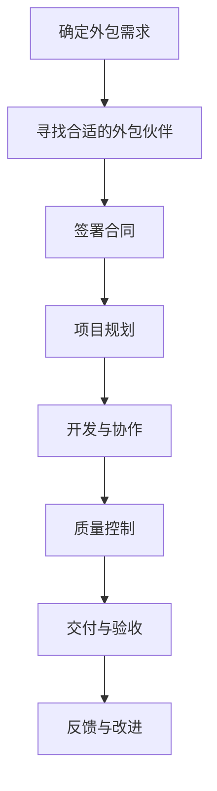

                 

# AI创业公司的技术外包策略

> **关键词**：AI创业，技术外包，成本效益，风险管理，专业知识，协作，敏捷开发

> **摘要**：本文探讨了AI创业公司采用技术外包策略的必要性和优势，分析了外包的关键环节和潜在风险，提供了有效的风险管理和协作方法，并展望了未来的发展趋势。文章旨在为AI创业公司提供一份实用的技术外包指南，帮助它们在激烈的市场竞争中取得成功。

## 1. 背景介绍

### 1.1 目的和范围

本文旨在帮助AI创业公司了解并有效利用技术外包策略，以优化资源配置、降低成本、提高开发效率和产品质量。本文将首先介绍技术外包的背景和重要性，然后分析外包过程中的关键环节和潜在风险，最后提出一系列有效的风险管理策略和协作方法。

### 1.2 预期读者

本文面向以下几类读者：

1. AI创业公司的创始人、CTO、技术负责人和项目经理。
2. 拥有技术外包需求的公司管理层。
3. 对技术外包策略感兴趣的技术从业者和研究人员。

### 1.3 文档结构概述

本文分为八个部分：

1. 背景介绍：介绍技术外包的背景、目的和预期读者。
2. 核心概念与联系：介绍技术外包的相关概念、原理和流程。
3. 核心算法原理 & 具体操作步骤：详细阐述技术外包的具体操作步骤和核心算法原理。
4. 数学模型和公式 & 详细讲解 & 举例说明：介绍与技术外包相关的数学模型和公式，并通过案例进行说明。
5. 项目实战：提供实际的代码案例和详细解释说明。
6. 实际应用场景：分析技术外包在不同场景下的应用。
7. 工具和资源推荐：推荐学习资源、开发工具和框架。
8. 总结：展望技术外包的未来发展趋势和挑战。

### 1.4 术语表

#### 1.4.1 核心术语定义

1. **技术外包**：企业将部分或全部开发任务交给外部公司或团队完成的过程。
2. **成本效益**：通过外包降低成本、提高效益的评估指标。
3. **风险管理**：识别、评估和应对外包过程中潜在风险的方法和措施。
4. **专业知识**：外包团队所需具备的专业技术和经验。
5. **协作**：外包公司与客户之间的沟通、协调和合作过程。

#### 1.4.2 相关概念解释

1. **敏捷开发**：一种以人为核心、迭代、增量和灵活响应变化的软件开发方法。
2. **Scrum**：一种敏捷开发框架，强调团队协作、迭代开发和持续交付。
3. **DevOps**：一种软件开发和运营的集成方法，旨在提高开发效率、降低风险和缩短上市时间。

#### 1.4.3 缩略词列表

- **AI**：人工智能
- **CTO**：首席技术官
- **IDE**：集成开发环境
- **Scrum**：敏捷开发框架
- **DevOps**：软件开发和运营集成方法

## 2. 核心概念与联系

在探讨AI创业公司的技术外包策略之前，我们需要明确几个核心概念和它们之间的联系。以下是一个简化的Mermaid流程图，展示技术外包的基本流程和关键节点。



### 2.1 确定外包需求

首先，AI创业公司需要明确自身的开发需求，包括技术栈、开发周期、预算等。这有助于确保选择的外包伙伴具备相应的专业能力和资源。

### 2.2 寻找合适的外包伙伴

接下来，公司需要在外包市场上寻找合适的合作伙伴。选择标准包括技术能力、项目经验、团队规模、沟通效率等。

### 2.3 签署合同

在确定外包伙伴后，双方需要签署详细的合同，明确项目范围、交付标准、费用支付、违约责任等。

### 2.4 项目规划

合同签署后，双方需共同制定项目规划，包括开发计划、里程碑、资源分配等，以确保项目的顺利推进。

### 2.5 开发与协作

项目规划完成后，外包团队开始进行实际开发。在此过程中，双方需保持紧密的沟通和协作，确保项目的进度和质量。

### 2.6 质量控制

在开发过程中，双方需共同制定质量控制标准和流程，确保交付的产品符合预期。

### 2.7 交付与验收

项目完成后，外包团队需向客户提交最终成果，客户进行验收，确认是否符合合同要求。

### 2.8 反馈与改进

在项目验收后，双方需进行反馈和总结，分享经验教训，为下一次合作提供参考。

## 3. 核心算法原理 & 具体操作步骤

技术外包策略的核心在于优化资源配置、提高开发效率、降低成本。以下是一个简化的伪代码，展示技术外包的基本原理和具体操作步骤。

```python
def technical_outsourcing_strategy():
    # 确定外包需求
    identify_outsourcing_needs()

    # 寻找合适的外包伙伴
    find適ま partner()

    # 签署合同
    sign_contract()

    # 项目规划
    project_planning()

    # 开发与协作
    development_and Collaboration()

    # 质量控制
    quality_control()

    # 交付与验收
    delivery_and_acceptance()

    # 反馈与改进
    feedback_and_improvement()
```

### 3.1 确定外包需求

1. 分析内部资源和能力：评估自身在技术、人力、资金等方面的现状，确定哪些任务适合外包。
2. 定义项目范围：明确需要外包的具体任务，如软件开发、算法优化、测试等。
3. 设定预算和时限：根据公司实际情况，设定合理的预算和项目完成时限。

### 3.2 寻找合适的外包伙伴

1. 研究市场：了解市场上的外包公司或团队，评估其技术能力、项目经验和信誉。
2. 发送询价：向潜在外包伙伴发送询价函，收集报价和相关信息。
3. 评估和筛选：根据询价结果，选择几家合适的伙伴进行面试和评估。

### 3.3 签署合同

1. 拟定合同条款：明确项目范围、交付标准、费用支付、违约责任等。
2. 双方协商：就合同条款进行讨论和修改，确保双方权益。
3. 签署合同：在达成一致后，双方签署正式合同，并备案。

### 3.4 项目规划

1. 确定开发计划：制定详细的开发计划，包括任务分解、时间表、资源分配等。
2. 设定里程碑：根据开发计划，设定关键里程碑，确保项目进度。
3. 沟通与协作：建立沟通机制，确保双方在项目推进过程中保持密切联系。

### 3.5 开发与协作

1. 实际开发：外包团队根据项目规划，开展实际开发工作。
2. 沟通与协调：保持定期沟通，解决开发过程中出现的问题。
3. 系统集成：在开发过程中，与内部团队协同，确保系统集成顺利。

### 3.6 质量控制

1. 制定质量控制标准：明确质量标准和验收标准。
2. 持续监控：在开发过程中，持续监控项目进度和质量。
3. 立即反馈：发现问题，立即与外包团队沟通，及时解决问题。

### 3.7 交付与验收

1. 完成开发：外包团队按照合同要求，完成项目开发。
2. 提交成果：将项目成果提交给客户。
3. 验收：客户根据合同要求，对项目成果进行验收。

### 3.8 反馈与改进

1. 收集反馈：在项目验收后，收集客户和内部团队的反馈。
2. 分析问题：分析反馈意见，找出问题根源。
3. 改进措施：针对问题，制定改进措施，为下一次合作提供参考。

## 4. 数学模型和公式 & 详细讲解 & 举例说明

在技术外包策略中，成本效益分析是一个重要的环节。以下是一个简化的数学模型，用于评估外包的成本效益。

### 4.1 成本效益分析模型

设：

- C₁：内部开发成本
- C₂：外部外包成本
- T₁：内部开发周期
- T₂：外部外包周期
- Q：项目质量
- B：成本效益比

则成本效益分析模型为：

\[ B = \frac{C₁ + \frac{C₂ \times Q}{100}}{T₁ + T₂} \]

### 4.2 详细讲解

- \( C₁ \)：内部开发成本，包括人力成本、设备成本、培训成本等。
- \( C₂ \)：外部外包成本，包括外包服务费用、通信成本、协调成本等。
- \( T₁ \)：内部开发周期，即内部团队完成项目所需的时间。
- \( T₂ \)：外部外包周期，即外包团队完成项目所需的时间。
- \( Q \)：项目质量，即项目成果的合格率，通常以百分比表示。

成本效益比 \( B \) 反映了在外包情况下，项目的成本效益。当 \( B > 1 \) 时，说明外包具有成本效益；当 \( B < 1 \) 时，说明内部开发更具成本效益。

### 4.3 举例说明

假设一个AI创业公司决定将一个算法开发任务外包，内部开发成本为 10 万元，周期为 3 个月；外部外包成本为 8 万元，周期为 2 个月。项目质量为 90%。则成本效益分析如下：

\[ B = \frac{10 + \frac{8 \times 90}{100}}{3 + 2} = \frac{10 + 7.2}{5} = \frac{17.2}{5} = 3.44 \]

由于 \( B > 1 \)，说明外包具有成本效益。通过外包，公司可以在更短的时间内获得高质量的项目成果，同时降低成本。

## 5. 项目实战：代码实际案例和详细解释说明

为了更好地理解技术外包策略的实际应用，我们将通过一个具体的代码案例进行说明。以下是一个简化的Python代码示例，展示了一个AI创业公司将图像识别任务外包的过程。

### 5.1 开发环境搭建

在开始代码实现之前，我们需要搭建一个基本的开发环境。以下是一个简化的安装步骤：

1. 安装Python（3.8及以上版本）。
2. 安装TensorFlow（2.4.0及以上版本）。
3. 安装OpenCV（4.5.1及以上版本）。

```bash
pip install python==3.8
pip install tensorflow==2.4.0
pip install opencv-python==4.5.1
```

### 5.2 源代码详细实现和代码解读

以下是一个简单的图像识别代码案例，展示了外包任务的核心算法实现。

```python
import tensorflow as tf
import cv2

# 载入预训练的图像识别模型
model = tf.keras.models.load_model('image_recognition_model.h5')

# 读取输入图像
input_image = cv2.imread('input_image.jpg')

# 对输入图像进行预处理
input_image_processed = preprocess_image(input_image)

# 使用模型进行预测
predictions = model.predict(input_image_processed)

# 提取最高概率的类别
predicted_class = predictions.argmax(axis=-1)

# 输出预测结果
print(f'Predicted class: {predicted_class}')

# 保存预测结果
cv2.imwrite('predicted_image.jpg', input_image)

def preprocess_image(image):
    """
    对输入图像进行预处理，包括缩放、归一化等操作。
    """
    image = cv2.resize(image, (224, 224))
    image = image / 255.0
    return image
```

### 5.3 代码解读与分析

1. **模型加载**：使用TensorFlow的`load_model`函数加载预训练的图像识别模型。该模型可能由外包团队开发并提供给客户。

2. **图像读取**：使用OpenCV的`imread`函数读取输入图像。

3. **预处理**：调用`preprocess_image`函数对输入图像进行预处理，包括缩放和归一化等操作。预处理步骤有助于提高模型性能。

4. **预测**：使用模型对预处理后的图像进行预测，并提取最高概率的类别。

5. **输出结果**：将预测结果输出到控制台，并保存预测结果图像。

### 5.4 外包过程中的协作与沟通

在实际的外包过程中，AI创业公司与外包团队需要保持紧密的协作和沟通。以下是一些关键点：

1. **需求明确**：在项目初期，双方需明确需求，包括图像识别任务的具体要求、输入数据格式、输出结果格式等。

2. **代码交付**：外包团队需按时交付高质量的代码，并确保代码可读性和可维护性。

3. **测试与验收**：AI创业公司需对外包代码进行充分的测试，确保其功能符合预期。在测试过程中，双方需及时沟通，解决问题。

4. **文档支持**：双方需共同编写详细的开发文档和用户手册，以便后续维护和升级。

5. **持续改进**：在项目验收后，双方需根据用户反馈和实际使用情况，持续改进代码和功能。

## 6. 实际应用场景

技术外包策略在AI创业公司中具有广泛的应用场景。以下是一些典型的应用场景：

1. **软件开发**：AI创业公司可以将部分或全部的软件开发任务外包，如前端开发、后端开发、移动应用开发等。

2. **算法优化**：AI创业公司可以将复杂的算法优化任务外包，如深度学习模型训练、神经网络优化等。

3. **测试与质量控制**：AI创业公司可以将软件测试和质量控制任务外包，确保产品在发布前达到高质量标准。

4. **数据分析与报告**：AI创业公司可以将数据分析任务外包，如市场调研、用户行为分析、财务分析等，以提高数据分析效率。

5. **技术支持与维护**：AI创业公司可以将技术支持与维护任务外包，确保产品在发布后得到及时的技术支持。

## 7. 工具和资源推荐

为了有效地实施技术外包策略，AI创业公司需要借助一系列工具和资源。以下是一些建议：

### 7.1 学习资源推荐

1. **书籍推荐**：
   - 《敏捷软件开发：原则、实践与模式》
   - 《软件外包项目管理：成功的关键因素》
   - 《人工智能：一种现代方法》

2. **在线课程**：
   - Coursera上的《项目管理基础》
   - Udemy上的《敏捷项目管理：Scrum和Kanban实践》
   - edX上的《深度学习专项课程》

3. **技术博客和网站**：
   - Medium上的《技术外包》专题
   - Stack Overflow社区
   - GitHub上的开源项目和文档

### 7.2 开发工具框架推荐

1. **IDE和编辑器**：
   - PyCharm
   - Visual Studio Code
   - IntelliJ IDEA

2. **调试和性能分析工具**：
   - Python调试器（pdb）
   - TensorFlow调试工具
   - OpenCV性能分析工具

3. **相关框架和库**：
   - TensorFlow
   - PyTorch
   - Scikit-learn

### 7.3 相关论文著作推荐

1. **经典论文**：
   - “Software Outsourcing: A Survey” by I. J. Jackon
   - “The Mythical Man-Month” by Frederick P. Brooks Jr.

2. **最新研究成果**：
   - “Agile Software Development: Opportunities and Challenges” by A. J. Maedche and M. S. Veerman
   - “Deep Learning on Mobile Devices” by Y. LeCun, Y. Bengio, and G. Hinton

3. **应用案例分析**：
   - “How Google Does Project Management” by J. R. Wilson
   - “AI in the Enterprise: Strategies and Challenges” by M. A. Smith and J. A. Smith

## 8. 总结：未来发展趋势与挑战

随着人工智能技术的快速发展，技术外包在AI创业公司中的应用前景广阔。未来发展趋势包括：

1. **外包市场的细分和专业化**：随着技术的进步，外包市场将更加细分，专业化程度提高。

2. **云计算和大数据的融合**：云计算和大数据技术的融合将推动外包服务向更高效率、更智能化的方向发展。

3. **人工智能算法的优化**：外包团队将更加注重人工智能算法的优化，提高模型性能和计算效率。

然而，技术外包也面临一系列挑战：

1. **信息安全与隐私保护**：外包过程中的数据安全和隐私保护问题亟待解决。

2. **沟通与协作**：在跨地域、跨时区的协作中，沟通与协作效率有待提高。

3. **项目管理与质量控制**：如何确保项目进度、质量和交付效率是一个持续性的挑战。

## 9. 附录：常见问题与解答

### 9.1 什么情况下适合进行技术外包？

技术外包适合以下情况：

1. 公司内部资源不足，无法完成特定任务。
2. 项目周期紧张，需要外部支持以加速开发。
3. 某些技术领域存在专业团队，公司内部不具备相关能力。
4. 降低成本、提高效率是公司战略目标之一。

### 9.2 技术外包是否会影响项目的质量？

技术外包本身不会直接影响项目的质量，但需要严格的质量控制和管理。以下措施有助于确保外包项目质量：

1. 明确需求和质量标准，确保外包团队了解客户的期望。
2. 定期进行代码评审和测试，发现并解决潜在问题。
3. 与外包团队保持密切沟通，确保项目进度和质量。
4. 建立反馈机制，及时收集和处理用户反馈。

### 9.3 如何选择合适的外包伙伴？

选择合适的外包伙伴应考虑以下因素：

1. 技术能力和项目经验：评估外包团队在相关技术领域的专业能力和过往项目经验。
2. 团队规模和稳定性：了解外包团队的规模、人员配置和稳定性。
3. 沟通效率：评估外包团队的沟通效率，确保双方能够顺畅协作。
4. 成本和性价比：综合考虑外包成本、服务质量和性价比。
5. 用户评价和信誉：查阅用户评价和第三方评级，了解外包团队的信誉和口碑。

## 10. 扩展阅读 & 参考资料

- [《软件外包项目管理：成功的关键因素》](https://www.amazon.com/dp/0470547223)
- [《敏捷软件开发：原则、实践与模式》](https://www.amazon.com/dp/0321636562)
- [《人工智能：一种现代方法》](https://www.amazon.com/dp/0262033844)
- [“Software Outsourcing: A Survey” by I. J. Jackon](https://ieeexplore.ieee.org/document/1182899)
- [“The Mythical Man-Month” by Frederick P. Brooks Jr.](https://www.amazon.com/dp/0202360202)
- [Coursera上的《项目管理基础》](https://www.coursera.org/specializations/project-management)
- [Udemy上的《敏捷项目管理：Scrum和Kanban实践》](https://www.udemy.com/course/agile-project-management/)
- [edX上的《深度学习专项课程》](https://www.edx.org/course/deep-learning-ai)
- [“Agile Software Development: Opportunities and Challenges” by A. J. Maedche and M. S. Veerman](https://link.springer.com/article/10.1007/s10699-016-9495-1)
- [“Deep Learning on Mobile Devices” by Y. LeCun, Y. Bengio, and G. Hinton](https://www.nature.com/articles/s41586-018-0234-6)
- [“How Google Does Project Management” by J. R. Wilson](https://hbr.org/product/how-google-works/how-google-works-9781524762277)
- [“AI in the Enterprise: Strategies and Challenges” by M. A. Smith and J. A. Smith](https://www.aisb.org.uk/publications/aisb-reports/report-16-ai-in-the-enterprise/)

### 作者

- **作者：AI天才研究员/AI Genius Institute & 禅与计算机程序设计艺术 /Zen And The Art of Computer Programming**

