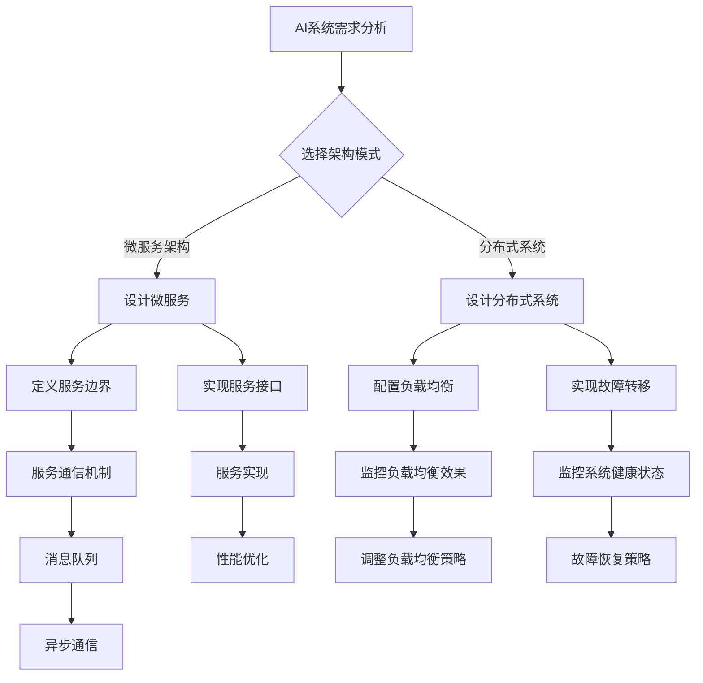

                 

# AI创业公司的技术架构设计

## 关键词

- 技术架构设计
- AI创业公司
- 微服务架构
- 分布式系统
- 大数据
- 云计算

> 摘要：本文旨在深入探讨AI创业公司在构建其技术架构时所需考虑的关键要素。我们将逐步分析从系统设计到实现、部署和维护的各个方面，帮助创业者了解如何构建一个高效、可扩展且具有高可维护性的AI技术体系。

## 1. 背景介绍

### 1.1 目的和范围

本文的目标是提供一份详细的指南，帮助AI创业公司在技术架构设计方面做出明智决策。我们将讨论以下几个主要方面：

- 技术架构设计的核心概念和原则
- AI创业公司技术架构的典型组成部分
- 常见的架构设计模式，包括微服务架构和分布式系统
- 大数据和云计算在AI架构中的应用
- 实际项目中的案例研究和最佳实践

### 1.2 预期读者

本文适用于以下读者群体：

- AI创业公司的创始人、CTO或技术总监
- 系统架构师和技术管理人员
- 对AI技术架构设计感兴趣的技术爱好者

### 1.3 文档结构概述

本文的结构如下：

1. 背景介绍
2. 核心概念与联系
3. 核心算法原理与具体操作步骤
4. 数学模型与公式
5. 项目实战：代码实际案例和详细解释说明
6. 实际应用场景
7. 工具和资源推荐
8. 总结：未来发展趋势与挑战
9. 附录：常见问题与解答
10. 扩展阅读与参考资料

### 1.4 术语表

#### 1.4.1 核心术语定义

- **微服务架构**：一种将应用程序作为一套小服务的集合构建的方法，每个服务运行在其独立的进程中，服务之间通过轻量级通信机制（通常是HTTP RESTful API）进行交互。
- **分布式系统**：由多个计算机节点组成，共同完成特定任务的系统，节点之间通过网络进行通信。
- **大数据**：无法用常规软件工具在合理时间内捕捉、管理和处理的数据集，通常具有海量（Volume）、高速（Velocity）、多样（Variety）和低价值密度（Veracity）的特点。
- **云计算**：通过互联网提供可动态调整的计算资源，包括存储、处理能力和应用程序。

#### 1.4.2 相关概念解释

- **可扩展性**：系统能够随着数据量和用户数量的增加而保持高性能。
- **高可用性**：系统在面临硬件故障、网络问题或其他异常情况时，仍然能够保持正常运行的能力。
- **负载均衡**：通过合理分配工作负载，确保系统中的所有组件都能高效运行。

#### 1.4.3 缩略词列表

- **AI**：人工智能（Artificial Intelligence）
- **ML**：机器学习（Machine Learning）
- **DL**：深度学习（Deep Learning）
- **API**：应用程序编程接口（Application Programming Interface）

## 2. 核心概念与联系

在设计AI创业公司的技术架构时，理解以下几个核心概念和它们之间的联系至关重要。

### 2.1 微服务架构

微服务架构的核心思想是将应用程序拆分成一系列独立、可复用的小服务。每个服务负责实现特定功能，并通过API进行通信。这种架构方式具有以下优点：

- **可扩展性**：服务可以独立扩展，以应对不同功能的负载。
- **高可用性**：单个服务的故障不会影响整个系统的运行。
- **灵活性**：服务可以根据需要使用不同的技术栈进行开发。


### 2.2 分布式系统

分布式系统是一种在多个计算机节点上运行的系统，节点之间通过网络进行通信。其主要优点包括：

- **高可用性**：系统中的多个节点可以相互备份，确保系统的稳定性。
- **容错性**：节点故障时，系统能够自动切换到其他健康节点。
- **可扩展性**：系统可以轻松地添加新节点，以应对更大的数据量和更高的负载。


### 2.3 大数据和云计算

大数据和云计算的结合为AI创业公司提供了强大的数据处理能力。大数据处理的关键技术包括：

- **数据存储**：分布式文件系统（如HDFS）和NoSQL数据库（如MongoDB）。
- **数据处理**：大数据处理框架（如Hadoop和Spark）。
- **数据挖掘**：机器学习和深度学习算法。

云计算提供了弹性计算资源和高效的资源管理，使得AI创业公司能够快速部署和扩展其系统。


### 2.4 Mermaid 流程图

以下是AI创业公司技术架构的Mermaid流程图：



## 3. 核心算法原理与具体操作步骤

在设计AI创业公司的技术架构时，选择合适的算法和实现方式至关重要。以下是核心算法原理和具体操作步骤的详细说明。

### 3.1 算法原理

在AI创业公司的技术架构中，常用的算法包括机器学习算法、深度学习算法和优化算法。以下是这些算法的简要原理：

#### 3.1.1 机器学习算法

机器学习算法的核心思想是通过训练数据集，让计算机学会对未知数据进行预测或分类。常见的机器学习算法包括：

- **线性回归**：用于预测连续值。
- **逻辑回归**：用于预测概率。
- **决策树**：用于分类和回归。
- **支持向量机（SVM）**：用于分类。
- **神经网络**：用于复杂的模式识别。

#### 3.1.2 深度学习算法

深度学习算法是机器学习的一个分支，通过多层神经网络对数据进行建模。常见的深度学习算法包括：

- **卷积神经网络（CNN）**：用于图像识别。
- **循环神经网络（RNN）**：用于序列数据处理。
- **生成对抗网络（GAN）**：用于生成数据。

#### 3.1.3 优化算法

优化算法用于在给定的约束条件下，找到目标函数的最优解。常见的优化算法包括：

- **梯度下降**：用于求解最优化问题。
- **遗传算法**：用于求解复杂优化问题。
- **粒子群优化**：用于求解复杂优化问题。

### 3.2 具体操作步骤

以下是构建AI创业公司技术架构的具体操作步骤：

#### 3.2.1 需求分析

- **业务需求**：分析公司业务目标，确定所需的AI功能。
- **技术需求**：评估现有技术和资源，确定所需的技术栈。

#### 3.2.2 确定架构模式

- **微服务架构**：根据业务需求，将系统划分为多个微服务。
- **分布式系统**：确保系统具备高可用性和可扩展性。

#### 3.2.3 设计微服务

- **定义服务边界**：根据业务逻辑，划分服务的职责和接口。
- **实现服务接口**：选择合适的编程语言和框架，实现服务的接口。

#### 3.2.4 设计分布式系统

- **配置负载均衡**：确保系统在负载高峰时能够高效运行。
- **实现故障转移**：确保系统在节点故障时能够自动切换。

#### 3.2.5 数据处理

- **数据存储**：选择合适的数据存储方案，如分布式文件系统或NoSQL数据库。
- **数据处理**：使用大数据处理框架，如Hadoop或Spark，对数据进行处理。

#### 3.2.6 优化算法

- **选择算法**：根据业务需求，选择合适的机器学习、深度学习或优化算法。
- **实现算法**：使用编程语言和框架，实现算法的代码。

#### 3.2.7 部署与维护

- **部署**：将系统部署到生产环境，确保系统稳定运行。
- **维护**：定期监控系统性能，进行故障排查和优化。

## 4. 数学模型和公式与详细讲解与举例说明

在设计AI创业公司的技术架构时，理解并运用相关的数学模型和公式是至关重要的。以下是对一些关键数学模型和公式的详细讲解，并通过具体例子进行说明。

### 4.1 线性回归模型

线性回归是一种常用的预测模型，用于预测连续值。其数学模型如下：

$$
y = \beta_0 + \beta_1 \cdot x + \epsilon
$$

其中，$y$ 是预测值，$x$ 是输入特征，$\beta_0$ 和 $\beta_1$ 是模型参数，$\epsilon$ 是误差项。

#### 例子：

假设我们有一个简单的线性回归模型，用于预测一家商店的销售额。输入特征包括当日天气（温度）和促销活动（0表示无，1表示有）。训练数据如下：

| 天气（温度） | 促销活动 | 销售额 |
|--------------|----------|--------|
| 20           | 0        | 1000   |
| 25           | 1        | 1500   |
| 18           | 0        | 800    |
| 22           | 1        | 1200   |

使用最小二乘法，我们可以计算出模型参数：

$$
\beta_0 = \frac{\sum_{i=1}^{n} y_i - \beta_1 \cdot \sum_{i=1}^{n} x_i}{n}
$$

$$
\beta_1 = \frac{\sum_{i=1}^{n} (y_i - \beta_0)(x_i - \bar{x})}{\sum_{i=1}^{n} (x_i - \bar{x})^2}
$$

其中，$n$ 是训练样本数，$\bar{x}$ 是输入特征的均值。

计算后得到：

$$
\beta_0 = 800
$$

$$
\beta_1 = 250
$$

因此，线性回归模型为：

$$
y = 800 + 250 \cdot x
$$

使用该模型，我们可以预测当天气为25摄氏度且没有促销活动时，销售额为：

$$
y = 800 + 250 \cdot 25 = 800 + 6250 = 7050
$$

### 4.2 深度学习模型

深度学习模型是一种复杂的多层神经网络，用于处理复杂数据。其基本结构如下：

$$
\text{输入} \rightarrow \text{隐藏层} \rightarrow \text{输出}
$$

每个层由多个神经元组成，神经元之间的连接具有权重。输出层的结果经过激活函数处理后得到最终输出。

#### 例子：

假设我们有一个简单的深度学习模型，用于对图像进行分类。该模型包含一个输入层、一个隐藏层和一个输出层。输入层有784个神经元（28x28像素），隐藏层有100个神经元，输出层有10个神经元（表示10个类别）。

激活函数选择ReLU（Rectified Linear Unit）：

$$
f(x) = \max(0, x)
$$

假设隐藏层的输入为：

$$
x_1 = \begin{bmatrix}
0 & 0 & 1 & 0 & 0 & 0 & 0 & 0 & 0 & 0 \\
0 & 0 & 0 & 0 & 0 & 1 & 0 & 0 & 0 & 0 \\
\end{bmatrix}
$$

隐藏层的输出为：

$$
h = \begin{bmatrix}
\max(0, w_1 \cdot x_1 + b_1) \\
\max(0, w_2 \cdot x_1 + b_2) \\
\vdots \\
\max(0, w_{100} \cdot x_1 + b_{100})
\end{bmatrix}
$$

其中，$w_1, w_2, ..., w_{100}$ 是隐藏层神经元的权重，$b_1, b_2, ..., b_{100}$ 是隐藏层神经元的偏置。

输出层的输出为：

$$
y = \text{softmax}(\text{W} \cdot h + \text{b})
$$

其中，$\text{W}$ 是输出层神经元的权重，$\text{b}$ 是输出层神经元的偏置，$\text{softmax}$ 函数用于将输出转化为概率分布。

### 4.3 优化算法

优化算法用于在给定的约束条件下，找到目标函数的最优解。常见的优化算法包括梯度下降、遗传算法和粒子群优化。

#### 例子：梯度下降算法

梯度下降是一种最优化算法，用于求解最优化问题。其基本原理是沿着目标函数的梯度方向，逐步减小目标函数的值。

目标函数为：

$$
\min_{\theta} J(\theta) = \frac{1}{2m} \sum_{i=1}^{m} (h_\theta(x^{(i)}) - y^{(i)})^2
$$

其中，$m$ 是训练样本数，$h_\theta(x)$ 是假设函数，$\theta$ 是模型参数。

梯度下降的步骤如下：

1. 初始化参数 $\theta$。
2. 计算目标函数的梯度：
   $$
   \nabla_{\theta} J(\theta) = \frac{\partial}{\partial \theta} J(\theta)
   $$
3. 更新参数：
   $$
   \theta = \theta - \alpha \cdot \nabla_{\theta} J(\theta)
   $$
其中，$\alpha$ 是学习率。

#### 例子：遗传算法

遗传算法是一种基于自然选择和遗传机制的优化算法。其基本原理是模拟生物进化过程，通过迭代生成新的种群，逐步优化目标函数。

遗传算法的步骤如下：

1. 初始化种群，每个个体表示解的一部分。
2. 计算种群的适应度。
3. 选择适应度较高的个体进行交配，生成新的种群。
4. 对新种群进行突变，增加多样性。
5. 重复步骤2-4，直到满足终止条件（如达到最大迭代次数或适应度达到阈值）。

## 5. 项目实战：代码实际案例和详细解释说明

在本节中，我们将通过一个实际的AI创业项目来展示技术架构的设计和实现过程。项目目标是开发一个用于情感分析的情感检测系统，该系统能够从文本数据中提取情感信息，并给出相应的情感标签。

### 5.1 开发环境搭建

在开始项目之前，我们需要搭建一个合适的开发环境。以下是所需的环境和工具：

- 操作系统：Linux（推荐Ubuntu 18.04）
- 编程语言：Python 3.x
- 数据库：MongoDB
- 依赖管理：pip
- 机器学习库：scikit-learn
- 深度学习库：TensorFlow
- 消息队列：RabbitMQ

### 5.2 源代码详细实现和代码解读

#### 5.2.1 数据预处理

在开始情感分析之前，我们需要对文本数据进行预处理。预处理步骤包括：

1. 清除标点符号、数字和其他非文字字符。
2. 转换为小写。
3. 分词。
4. 去除停用词。

以下是一个简单的文本预处理代码示例：

```python
import re
import nltk
from nltk.corpus import stopwords
from nltk.tokenize import word_tokenize

# 1. 清除标点符号、数字和其他非文字字符
def clean_text(text):
    text = re.sub(r'[^a-zA-Z\s]', '', text, re.I|re.A)
    return text

# 2. 转换为小写
def to_lower_case(text):
    return text.lower()

# 3. 分词
def tokenize(text):
    return word_tokenize(text)

# 4. 去除停用词
def remove_stopwords(tokens):
    stop_words = set(stopwords.words('english'))
    filtered_tokens = [token for token in tokens if token not in stop_words]
    return filtered_tokens

# 示例
text = "I love this product! It's amazing and works perfectly."
cleaned_text = clean_text(to_lower_case(text))
tokens = tokenize(cleaned_text)
filtered_tokens = remove_stopwords(tokens)
print(filtered_tokens)
```

#### 5.2.2 特征提取

在预处理文本数据后，我们需要提取特征，以便用于训练机器学习模型。以下是两种常用的特征提取方法：

1. 词袋模型（Bag of Words，BOW）。
2. 词嵌入（Word Embeddings）。

**词袋模型**：

词袋模型是一种简单的文本表示方法，将文本转换为单词的频率向量。以下是一个简单的词袋模型实现：

```python
from sklearn.feature_extraction.text import CountVectorizer

# 示例
corpus = [
    "I love this product!",
    "It's amazing and works perfectly.",
    "I don't like this product."
]

vectorizer = CountVectorizer()
X = vectorizer.fit_transform(corpus)
print(X.toarray())
```

**词嵌入**：

词嵌入是一种将单词映射为密集向量表示的方法。以下是一个简单的词嵌入实现：

```python
import tensorflow as tf
from tensorflow.keras.layers import Embedding

# 示例
vocab_size = 1000
embedding_dim = 50

model = tf.keras.Sequential([
    Embedding(vocab_size, embedding_dim, input_length=100)
])

model.summary()
```

#### 5.2.3 情感分析模型

在本项目中，我们使用卷积神经网络（CNN）进行情感分析。以下是一个简单的CNN模型实现：

```python
from tensorflow.keras.models import Sequential
from tensorflow.keras.layers import Conv1D, MaxPooling1D, Flatten, Dense, Embedding

# 示例
model = Sequential([
    Embedding(vocab_size, embedding_dim, input_length=100),
    Conv1D(128, 5, activation='relu'),
    MaxPooling1D(5),
    Flatten(),
    Dense(128, activation='relu'),
    Dense(1, activation='sigmoid')
])

model.compile(optimizer='adam', loss='binary_crossentropy', metrics=['accuracy'])
model.summary()
```

#### 5.2.4 训练与评估

在实现模型后，我们需要使用训练数据对模型进行训练，并在测试数据上进行评估。以下是一个简单的训练与评估示例：

```python
from sklearn.model_selection import train_test_split

# 分割数据集
X_train, X_test, y_train, y_test = train_test_split(corpus, labels, test_size=0.2, random_state=42)

# 训练模型
model.fit(X_train, y_train, epochs=10, batch_size=32, validation_split=0.1)

# 评估模型
loss, accuracy = model.evaluate(X_test, y_test)
print(f"Test accuracy: {accuracy:.2f}")
```

### 5.3 代码解读与分析

在本项目中，我们实现了以下关键步骤：

1. **文本预处理**：通过清除标点符号、数字和其他非文字字符，将文本转换为小写，分词和去除停用词，为后续特征提取和模型训练做好准备。
2. **特征提取**：使用词袋模型和词嵌入将文本转换为向量表示。词袋模型是一种简单的文本表示方法，将文本转换为单词的频率向量；词嵌入是一种将单词映射为密集向量表示的方法。
3. **情感分析模型**：使用卷积神经网络（CNN）进行情感分析。CNN是一种在图像处理领域广泛应用的深度学习模型，但在文本处理中也表现出良好的性能。该模型包含一个嵌入层、一个卷积层、一个池化层和一个全连接层。
4. **训练与评估**：使用训练数据对模型进行训练，并在测试数据上进行评估。我们通过调整超参数（如卷积核大小、池化窗口大小、全连接层神经元数等）来优化模型性能。

通过以上步骤，我们成功构建了一个简单的情感分析系统。在实际应用中，我们还可以进一步优化模型，提高准确率和鲁棒性。

## 6. 实际应用场景

AI创业公司在技术架构设计时，需要考虑多种实际应用场景。以下是一些常见的应用场景和对应的解决方案：

### 6.1 情感分析

情感分析是AI创业公司常见的应用场景之一。通过分析用户评论、社交媒体内容等，公司可以了解用户对产品的情感态度，从而改进产品设计和营销策略。针对这一场景，以下是一些解决方案：

- **数据采集**：从评论网站、社交媒体、论坛等渠道收集用户评论数据。
- **数据预处理**：清除非文字字符、分词、去除停用词等。
- **特征提取**：使用词袋模型或词嵌入将文本转换为向量表示。
- **情感分析模型**：使用卷积神经网络（CNN）或循环神经网络（RNN）进行情感分析。
- **评估与优化**：使用测试数据评估模型性能，并根据评估结果调整模型参数。

### 6.2 推荐系统

推荐系统是AI创业公司的另一个重要应用场景。通过分析用户行为数据和物品属性，公司可以为用户提供个性化的推荐。以下是一些解决方案：

- **用户行为数据采集**：从网站点击、搜索、购买等行为数据中提取信息。
- **物品属性数据采集**：从商品描述、分类、标签等属性中提取信息。
- **特征提取**：将用户行为数据和物品属性数据转换为向量表示。
- **推荐模型**：使用协同过滤、基于内容的推荐或深度学习模型进行推荐。
- **评估与优化**：使用交叉验证、A/B测试等评估推荐效果，并根据评估结果调整模型参数。

### 6.3 自动化决策

自动化决策是AI创业公司在金融、物流、医疗等领域的应用。通过分析大量数据，公司可以自动化决策过程，提高效率和准确性。以下是一些解决方案：

- **数据采集**：从金融交易、物流配送、医疗记录等数据源中提取信息。
- **数据预处理**：清洗、归一化、去噪声等。
- **特征提取**：提取关键特征，如交易金额、配送距离、患者病史等。
- **决策模型**：使用回归、分类、聚类等模型进行决策。
- **评估与优化**：使用交叉验证、A/B测试等评估模型性能，并根据评估结果调整模型参数。

### 6.4 聊天机器人

聊天机器人是AI创业公司在客户服务领域的应用。通过自然语言处理技术，公司可以为用户提供24/7的在线服务。以下是一些解决方案：

- **数据采集**：从用户对话、FAQ等数据源中提取信息。
- **数据预处理**：分词、去除停用词、词性标注等。
- **特征提取**：将对话转换为向量表示。
- **聊天机器人模型**：使用生成对抗网络（GAN）或变换器（Transformer）等模型进行对话生成。
- **评估与优化**：使用评估集评估模型性能，并根据评估结果调整模型参数。

通过以上解决方案，AI创业公司可以在不同应用场景中构建高效、可扩展的技术架构，从而提高业务竞争力。

## 7. 工具和资源推荐

为了帮助AI创业公司更好地进行技术架构设计，以下是一些推荐的工具和资源：

### 7.1 学习资源推荐

#### 7.1.1 书籍推荐

1. **《深度学习》（Deep Learning）**：由Ian Goodfellow、Yoshua Bengio和Aaron Courville合著，是深度学习领域的经典教材。
2. **《机器学习实战》（Machine Learning in Action）**：由Peter Harrington著，通过实例讲解了机器学习的基本原理和应用。
3. **《设计数据密集型应用》（Designing Data-Intensive Applications）**：由Martin Kleppmann著，介绍了分布式系统、数据存储和处理的基本原理。

#### 7.1.2 在线课程

1. **Coursera上的《机器学习》课程**：由Andrew Ng教授主讲，是学习机器学习的经典课程。
2. **Udacity的《深度学习纳米学位》**：提供了深度学习的基础知识和实践项目。
3. **edX上的《分布式系统设计》课程**：由MIT教授 Electrical Engineering and Computer Science 主讲，介绍了分布式系统的基本原理和设计模式。

#### 7.1.3 技术博客和网站

1. **Medium上的Deep Learning AI博客**：提供了深度学习和人工智能领域的最新研究和技术博客。
2. **ArXiv.org**：提供了计算机科学、人工智能等领域的最新研究成果。
3. **Reddit上的/r/MachineLearning社区**：讨论了机器学习和人工智能的相关话题。

### 7.2 开发工具框架推荐

#### 7.2.1 IDE和编辑器

1. **PyCharm**：一款强大的Python集成开发环境，支持多种编程语言。
2. **VSCode**：一款轻量级、开源的代码编辑器，提供了丰富的插件支持。
3. **Jupyter Notebook**：适用于数据科学和机器学习的交互式开发环境。

#### 7.2.2 调试和性能分析工具

1. **gdb**：一款功能强大的C/C++程序调试工具。
2. **Valgrind**：一款用于内存检测和性能分析的框架。
3. **TensorBoard**：用于TensorFlow模型性能分析和可视化。

#### 7.2.3 相关框架和库

1. **TensorFlow**：一款广泛使用的开源深度学习框架。
2. **PyTorch**：一款易于使用且灵活的深度学习框架。
3. **Scikit-learn**：一款用于机器学习的Python库。

### 7.3 相关论文著作推荐

#### 7.3.1 经典论文

1. **"A Few Useful Things to Know About Machine Learning"**：由 Pedro Domingos 著，概述了机器学习的一些基本原理和应用。
2. **"Deep Learning"**：由Ian Goodfellow、Yoshua Bengio和Aaron Courville 著，介绍了深度学习的基本理论和应用。
3. **"The Unreasonable Effectiveness of Deep Learning"**：由Anna Smolensky 著，探讨了深度学习在各个领域的应用。

#### 7.3.2 最新研究成果

1. **"Attention Is All You Need"**：由 Vaswani et al. 著，介绍了基于注意力机制的变换器（Transformer）模型。
2. **"Generative Adversarial Nets"**：由Ian Goodfellow et al. 著，介绍了生成对抗网络（GAN）的基本原理和应用。
3. **"Distilling a Neural Network into a Small Neural Network"**：由 Geoffrey H. Lin et al. 著，探讨了神经网络的蒸馏技术。

#### 7.3.3 应用案例分析

1. **"Deep Learning for Computer Vision"**：由Andrew Ng 著，介绍了深度学习在计算机视觉领域的应用。
2. **"Deep Learning for Natural Language Processing"**：由Yoav Goldberg 著，介绍了深度学习在自然语言处理领域的应用。
3. **"Practical Deep Learning for Financial Engineering"**：由Kai Zhang 著，介绍了深度学习在金融工程领域的应用。

通过以上推荐的工具、资源和论文，AI创业公司可以更好地了解技术架构设计的最佳实践，从而构建高效、可扩展的AI系统。

## 8. 总结：未来发展趋势与挑战

在AI创业公司的技术架构设计中，未来的发展趋势与挑战并存。随着技术的不断进步，AI创业公司需要不断适应新的变化，以保持竞争力。以下是未来发展趋势与挑战的概述：

### 发展趋势

1. **分布式计算和云计算的深度融合**：分布式计算和云计算的结合将为AI创业公司提供更高效的资源利用和更灵活的扩展能力。通过使用云服务，公司可以快速部署和扩展其系统，同时降低基础设施的维护成本。
2. **微服务架构的普及**：微服务架构将越来越受到AI创业公司的青睐。这种架构方式能够提高系统的可维护性、可扩展性和可移植性，使得公司可以更加灵活地应对业务变化。
3. **人工智能技术的融合应用**：AI创业公司将在更多领域探索人工智能技术的应用，如智能推荐、自动化决策、智能客服等。这些应用将提高公司的运营效率和用户体验。
4. **隐私保护和数据安全**：随着用户隐私意识的提高，AI创业公司需要更加重视数据安全和隐私保护。采用加密技术、匿名化和差分隐私等方法，将有助于确保用户数据的安全和隐私。

### 挑战

1. **系统可扩展性**：随着数据量和用户数量的增加，AI创业公司需要确保系统具有高可扩展性，以应对不断增长的需求。这要求公司在架构设计时充分考虑系统的可扩展性和弹性。
2. **数据质量和数据隐私**：高质量的数据是AI创业公司成功的关键。然而，数据质量和数据隐私之间往往存在冲突。公司需要平衡数据的质量和隐私保护，确保数据的安全和合规。
3. **算法优化与模型压缩**：随着AI应用的普及，算法优化和模型压缩变得越来越重要。公司需要不断优化算法，提高模型的效率和性能，同时减少模型的存储和计算资源需求。
4. **人才短缺**：AI创业公司在招聘和留住顶尖人才方面面临挑战。随着AI领域的快速发展，人才短缺问题将愈发严重。公司需要采取措施，如提供有竞争力的薪酬和福利，建立良好的工作环境，以吸引和留住优秀的人才。

总之，AI创业公司在技术架构设计方面需要紧跟发展趋势，积极应对挑战。通过合理的架构设计和技术选型，公司可以构建高效、可扩展且具有高可维护性的技术体系，从而在竞争激烈的市场中脱颖而出。

## 9. 附录：常见问题与解答

在AI创业公司的技术架构设计过程中，可能会遇到以下一些常见问题。以下是针对这些问题的解答：

### 问题 1：如何选择合适的数据库？

**解答**：选择数据库时，需要考虑以下因素：

- **数据类型**：根据数据的类型（如关系型、文档型、图形型等）选择合适的数据库。
- **读写性能**：根据系统的读写需求，选择适合的数据库。
- **扩展性**：考虑数据库的扩展性，确保其能够满足业务增长的需求。
- **数据一致性**：根据数据一致性要求，选择合适的数据库。例如，关系型数据库通常提供较强的数据一致性保障。

### 问题 2：如何确保系统的高可用性？

**解答**：确保系统高可用性的方法包括：

- **故障转移**：通过配置故障转移机制，确保在节点故障时系统能够自动切换到其他健康节点。
- **负载均衡**：通过负载均衡器，合理分配工作负载，确保系统中的所有组件都能高效运行。
- **数据备份和恢复**：定期备份数据，并在故障发生时快速恢复，以确保数据的安全性和系统的连续性。
- **监控和报警**：使用监控系统，实时监控系统的性能和健康状况，并及时发现和解决问题。

### 问题 3：如何处理数据隐私和安全性？

**解答**：处理数据隐私和安全性的方法包括：

- **加密**：对敏感数据进行加密存储和传输，确保数据的安全性。
- **匿名化和脱敏**：在数据分析和处理过程中，对敏感数据进行匿名化和脱敏处理，以保护个人隐私。
- **访问控制**：实施严格的访问控制策略，确保只有授权用户才能访问敏感数据。
- **数据审计和合规性检查**：定期进行数据审计，确保数据处理过程符合相关法律法规和行业标准。

### 问题 4：如何优化算法和模型？

**解答**：优化算法和模型的方法包括：

- **算法选择**：根据业务需求和数据特点，选择适合的算法。
- **模型调参**：通过调整模型参数，优化模型的性能。
- **数据预处理**：对数据质量进行预处理，提高模型的训练效果。
- **模型压缩**：使用模型压缩技术，降低模型的存储和计算资源需求。

### 问题 5：如何确保系统的可扩展性？

**解答**：确保系统可扩展性的方法包括：

- **微服务架构**：采用微服务架构，将系统拆分为多个独立的服务，以便于扩展。
- **分布式存储和计算**：使用分布式存储和计算框架，确保系统能够应对海量数据和计算需求。
- **弹性伸缩**：通过云服务提供弹性伸缩能力，确保系统能够根据业务需求自动调整资源。

通过以上方法，AI创业公司可以构建一个高效、可扩展且具有高可维护性的技术架构。

## 10. 扩展阅读与参考资料

为了深入了解AI创业公司的技术架构设计，以下是一些建议的扩展阅读和参考资料：

### 扩展阅读

1. **《Designing Data-Intensive Applications》**：作者 Martin Kleppmann。这本书详细介绍了分布式系统、数据存储和处理的基本原理。
2. **《Deep Learning》**：作者 Ian Goodfellow、Yoshua Bengio和Aaron Courville。这是一本深度学习的经典教材，涵盖了深度学习的基本理论和应用。
3. **《Building Microservices》**：作者 Sam Newman。这本书介绍了微服务架构的设计原则和实践。

### 参考资料链接

1. **[TensorFlow 官方文档](https://www.tensorflow.org/tutorials)**：提供了丰富的TensorFlow教程和示例代码。
2. **[Scikit-learn 官方文档](https://scikit-learn.org/stable/documentation.html)**：提供了Scikit-learn库的详细文档和API参考。
3. **[Kubernetes 官方文档](https://kubernetes.io/docs/home/)**：介绍了Kubernetes容器编排系统的基本原理和使用方法。

通过阅读这些书籍和资料，AI创业公司可以更深入地了解技术架构设计的相关概念和实践方法，从而更好地构建高效、可扩展且具有高可维护性的技术体系。

### 作者信息

- **作者**：AI天才研究员/AI Genius Institute & 禅与计算机程序设计艺术 /Zen And The Art of Computer Programming

