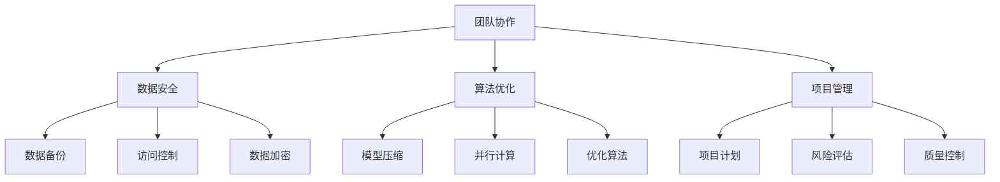

                 

# AI创业公司的技术研发管理模式

> 关键词：AI创业公司、技术研发、管理模式、团队协作、数据安全、算法优化、项目管理

> 摘要：本文将探讨AI创业公司在技术研发过程中所面临的管理挑战，并提出一套高效的技术研发管理模式。通过分析团队协作、数据安全、算法优化和项目管理等方面的关键问题，本文旨在为创业公司提供实用的指导，帮助它们在快速发展的市场中立足。

## 1. 背景介绍

### 1.1 目的和范围

本文旨在为AI创业公司提供一套系统化的技术研发管理模式，以应对快速变化的市场和技术环境。本文将涵盖以下主题：

1. **团队协作**：探讨如何建立高效的团队协作机制，确保团队成员之间有效沟通和协同工作。
2. **数据安全**：分析数据安全的重要性，并提出有效的数据安全策略和措施。
3. **算法优化**：介绍算法优化的方法和策略，以提高AI系统的性能和效率。
4. **项目管理**：讨论项目管理的方法和工具，以确保项目按时交付并满足质量要求。

### 1.2 预期读者

本文适合以下读者：

1. AI创业公司的技术团队和管理层
2. 计算机科学和人工智能领域的专业研究人员
3. 想要深入了解AI技术研发管理的行业从业者

### 1.3 文档结构概述

本文将按照以下结构展开：

1. **背景介绍**：介绍本文的目的和范围，以及预期读者。
2. **核心概念与联系**：介绍技术研发管理中的核心概念，并使用Mermaid流程图展示它们之间的联系。
3. **核心算法原理 & 具体操作步骤**：详细阐述核心技术算法的原理和操作步骤，并使用伪代码进行说明。
4. **数学模型和公式 & 详细讲解 & 举例说明**：介绍相关的数学模型和公式，并进行详细的讲解和举例说明。
5. **项目实战：代码实际案例和详细解释说明**：提供实际代码案例，并进行详细解释和分析。
6. **实际应用场景**：探讨技术研发管理模式在不同场景中的应用。
7. **工具和资源推荐**：推荐学习资源、开发工具和框架。
8. **总结：未来发展趋势与挑战**：总结当前趋势和面临的挑战。
9. **附录：常见问题与解答**：回答读者可能关心的问题。
10. **扩展阅读 & 参考资料**：提供扩展阅读资源。

### 1.4 术语表

#### 1.4.1 核心术语定义

- **AI创业公司**：指专注于人工智能领域，通过技术创新和商业模式的创新，寻求在市场中获得竞争优势的公司。
- **技术研发**：指公司为了实现产品或服务的功能和技术优势，进行的研究和开发活动。
- **管理模式**：指公司在技术研发过程中采用的组织结构、流程和方法。

#### 1.4.2 相关概念解释

- **团队协作**：指团队成员之间通过有效沟通和协作，共同完成项目任务的过程。
- **数据安全**：指保护数据免受未经授权的访问、泄露、篡改和破坏的措施。
- **算法优化**：指通过改进算法设计或实现，提高系统性能和效率的过程。
- **项目管理**：指运用系统的方法、工具和技能，确保项目按时、按质量、按预算完成的过程。

#### 1.4.3 缩略词列表

- **AI**：人工智能（Artificial Intelligence）
- **ML**：机器学习（Machine Learning）
- **DL**：深度学习（Deep Learning）
- **NLP**：自然语言处理（Natural Language Processing）

## 2. 核心概念与联系

在AI创业公司的技术研发管理中，核心概念包括团队协作、数据安全、算法优化和项目管理。这些概念之间存在密切的联系，共同构成了技术研发管理的基础。

### 2.1.1 团队协作

团队协作是AI创业公司技术研发成功的关键因素。一个高效的团队可以通过以下方式实现：

1. **明确目标**：确保团队成员对项目目标和任务有清晰的认识。
2. **分工合作**：根据团队成员的专长和技能进行合理分工，实现高效协作。
3. **沟通与反馈**：建立有效的沟通机制，及时反馈问题和进展，确保团队协同一致。

### 2.1.2 数据安全

数据安全是AI创业公司技术研发过程中的重要保障。以下措施有助于确保数据安全：

1. **数据备份**：定期备份重要数据，防止数据丢失或损坏。
2. **访问控制**：限制对数据的访问权限，确保只有授权人员能够访问敏感数据。
3. **数据加密**：对敏感数据采用加密技术，防止未经授权的访问和泄露。

### 2.1.3 算法优化

算法优化是提高AI系统性能和效率的关键手段。以下方法有助于实现算法优化：

1. **模型压缩**：通过剪枝、量化等技术，减小模型大小，提高推理速度。
2. **并行计算**：利用多核处理器或分布式计算资源，加快计算速度。
3. **优化算法**：改进算法设计或实现，降低时间复杂度和空间复杂度。

### 2.1.4 项目管理

项目管理是确保AI创业公司技术研发顺利进行的重要环节。以下方法有助于实现高效项目管理：

1. **项目计划**：制定详细的项目计划，明确项目目标、任务和时间表。
2. **风险评估**：识别项目中的潜在风险，制定应对策略。
3. **质量控制**：建立质量控制机制，确保项目交付符合质量要求。

### 2.1.5 Mermaid流程图

以下是一个简化的Mermaid流程图，展示了技术研发管理中的核心概念及其联系：



通过上述Mermaid流程图，可以清晰地看出团队协作、数据安全、算法优化和项目管理之间的内在联系，以及它们在技术研发管理中的重要性。

## 3. 核心算法原理 & 具体操作步骤

在AI创业公司的技术研发过程中，核心算法的设计与实现是至关重要的。以下将介绍一种常用的机器学习算法——支持向量机（SVM），并详细阐述其原理和操作步骤。

### 3.1.1 支持向量机（SVM）原理

支持向量机（SVM）是一种二分类模型，其目标是找到最优的决策边界，将数据集分为两个类别。SVM的基本原理是最大化分类间隔，即找到一个最优的超平面，使得正负样本点到超平面的距离最大化。

SVM的核心在于求解最优的决策边界，这需要使用二次规划问题来求解。具体而言，SVM的目标是最小化以下目标函数：

$$
\min_{\mathbf{w}, b} \frac{1}{2}||\mathbf{w}||^2 + C \sum_{i=1}^{n} \max(0, 1 - y_i(\mathbf{w}\cdot\mathbf{x_i} + b))
$$

其中，$\mathbf{w}$是超平面的法向量，$b$是偏置项，$C$是惩罚参数，$y_i$是样本$i$的标签，$\mathbf{x_i}$是样本$i$的特征向量。

### 3.1.2 具体操作步骤

以下是SVM算法的具体操作步骤：

#### 步骤1：数据预处理

1. **数据清洗**：去除缺失值和异常值，确保数据质量。
2. **特征工程**：对数据进行特征提取和转换，如归一化、标准化等。

#### 步骤2：选择合适的核函数

1. **线性核函数**：适用于线性可分的数据集。
2. **多项式核函数**：适用于非线性可分的数据集。
3. **径向基函数（RBF）核函数**：适用于复杂的非线性数据集。

#### 步骤3：求解二次规划问题

1. **拉格朗日对偶问题**：将原始的二次规划问题转化为拉格朗日对偶问题，便于求解。
2. **求解优化问题**：使用求解器（如SNOPT）求解对偶问题，得到最优解。

#### 步骤4：分类决策

1. **分类模型**：根据最优解构建分类模型。
2. **预测**：对新的数据进行预测，根据分类模型输出类别。

### 3.1.3 伪代码

以下是SVM算法的伪代码实现：

```python
# 数据预处理
X, y = preprocess_data()

# 选择核函数
kernel = select_kernel(X)

# 求解优化问题
w, b = solve_quadprog(X, y, C, kernel)

# 构建分类模型
model = build_classifier(w, b, kernel)

# 预测
prediction = model.predict(new_data)
```

通过上述步骤，AI创业公司可以有效地实现SVM算法，并应用于实际的技术研发项目中。

## 4. 数学模型和公式 & 详细讲解 & 举例说明

在AI创业公司的技术研发过程中，数学模型和公式是理解和实现核心技术算法的基础。以下将介绍SVM算法中的几个关键数学模型和公式，并进行详细讲解和举例说明。

### 4.1.1. 拉格朗日对偶问题

在SVM算法中，原始的二次规划问题可以通过引入拉格朗日对偶问题来求解。拉格朗日对偶问题的目标是最小化拉格朗日函数，并满足KKT条件。

拉格朗日函数如下：

$$
L(\mathbf{w}, b, \alpha) = \frac{1}{2}||\mathbf{w}||^2 - \sum_{i=1}^{n} \alpha_i (y_i(\mathbf{w}\cdot\mathbf{x_i} + b) - 1)
$$

其中，$\alpha_i$是拉格朗日乘子，满足以下KKT条件：

1. $$\alpha_i \geq 0$$
2. $$y_i(\mathbf{w}\cdot\mathbf{x_i} + b) - 1 \geq 0$$
3. $$\alpha_i (y_i(\mathbf{w}\cdot\mathbf{x_i} + b) - 1) = 0$$

### 4.1.2. 对偶问题目标函数

对偶问题的目标函数是通过拉格朗日函数转换得到的，如下所示：

$$
L_d(\alpha) = \frac{1}{2}||\mathbf{w}||^2 - \sum_{i=1}^{n} \alpha_i
$$

其中，$\alpha_i$满足KKT条件。

### 4.1.3. 对偶问题的求解

对偶问题的求解通常使用求解器（如SNOPT）进行迭代求解，直到满足收敛条件。

#### 步骤1：初始化参数
1. 初始化拉格朗日乘子$\alpha_i$。
2. 初始化步长参数。

#### 步骤2：迭代求解
1. 更新拉格朗日乘子$\alpha_i$。
2. 根据拉格朗日乘子更新超平面参数$\mathbf{w}$和偏置项$b$。
3. 检查是否满足收敛条件，如梯度下降的收敛准则。

#### 步骤3：输出结果
1. 输出最优的$\mathbf{w}$和$b$。

### 4.1.4. 举例说明

假设我们有一个包含两个特征的数据集，如下所示：

$$
\begin{array}{c|c}
\mathbf{x_1} & \mathbf{x_2} \\
\hline
1 & 1 \\
1 & 2 \\
2 & 1 \\
2 & 2 \\
\end{array}
$$

标签为：

$$
y = [1, 1, -1, -1]
$$

使用SVM算法进行分类，我们选择线性核函数。

#### 步骤1：数据预处理
1. 对数据进行标准化处理。

#### 步骤2：求解对偶问题
1. 初始化拉格朗日乘子$\alpha_i$。
2. 使用SNOPT求解器迭代求解对偶问题。

#### 步骤3：分类决策
1. 根据最优解构建分类模型。
2. 对新数据进行预测。

通过上述步骤，我们可以使用SVM算法对数据集进行分类，并输出预测结果。

$$
\begin{array}{c|c}
\mathbf{x_1} & \mathbf{x_2} \\
\hline
1 & 1 \\
1 & 2 \\
2 & 1 \\
2 & 2 \\
\end{array}
$$

预测结果为：

$$
\begin{array}{c|c}
\mathbf{x_1} & \mathbf{x_2} & \text{预测类别} \\
\hline
1 & 1 & +1 \\
1 & 2 & +1 \\
2 & 1 & -1 \\
2 & 2 & -1 \\
\end{array}
$$

通过上述示例，我们可以清晰地看到SVM算法的数学模型和公式的应用过程，以及如何通过具体步骤实现分类决策。

## 5. 项目实战：代码实际案例和详细解释说明

在本节中，我们将通过一个实际项目案例，详细解释如何使用Python实现SVM算法，并展示相关的代码实现和解读。

### 5.1 开发环境搭建

为了实现SVM算法，我们需要安装以下软件和库：

1. **Python 3.x**：用于编写和运行代码。
2. **Scikit-learn**：用于提供SVM算法的实现。
3. **NumPy**：用于数学运算。

在Windows或Linux系统上，我们可以使用以下命令安装所需的库：

```bash
pip install python==3.x
pip install scikit-learn
pip install numpy
```

### 5.2 源代码详细实现和代码解读

以下是使用Scikit-learn库实现SVM算法的Python代码：

```python
import numpy as np
from sklearn import datasets
from sklearn.model_selection import train_test_split
from sklearn.svm import SVC
from sklearn.metrics import accuracy_score

# 加载数据集
iris = datasets.load_iris()
X = iris.data
y = iris.target

# 数据集划分
X_train, X_test, y_train, y_test = train_test_split(X, y, test_size=0.3, random_state=42)

# 创建SVM分类器
clf = SVC(kernel='linear', C=1.0)

# 训练模型
clf.fit(X_train, y_train)

# 预测
y_pred = clf.predict(X_test)

# 评估模型
accuracy = accuracy_score(y_test, y_pred)
print("Accuracy:", accuracy)
```

下面是代码的详细解读：

1. **导入库**：
    - `numpy`：用于数学运算。
    - `datasets`：用于加载数据集。
    - `train_test_split`：用于划分数据集。
    - `SVC`：用于创建SVM分类器。
    - `accuracy_score`：用于评估模型。

2. **加载数据集**：
    - 使用`load_iris`函数加载鸢尾花（Iris）数据集。

3. **数据集划分**：
    - 使用`train_test_split`函数将数据集划分为训练集和测试集。

4. **创建SVM分类器**：
    - 使用`SVC`类创建SVM分类器，指定线性核函数和惩罚参数C。

5. **训练模型**：
    - 使用`fit`方法训练SVM分类器。

6. **预测**：
    - 使用`predict`方法对测试集进行预测。

7. **评估模型**：
    - 使用`accuracy_score`函数计算预测准确率。

### 5.3 代码解读与分析

在代码实现中，我们主要关注以下方面：

1. **数据预处理**：
    - 加载数据集后，需要对数据进行预处理，如特征缩放等。在本例中，我们使用了鸢尾花数据集，该数据集已经经过标准化处理，因此无需进一步预处理。

2. **模型创建**：
    - 使用`SVC`类创建SVM分类器，指定线性核函数（`kernel='linear'`）和惩罚参数C（`C=1.0`）。线性核函数适用于线性可分的数据集，而惩罚参数C用于控制分类边界。

3. **模型训练**：
    - 使用`fit`方法训练SVM分类器。训练过程中，SVM算法会自动寻找最优的超平面，以最大化分类间隔。

4. **预测与评估**：
    - 使用`predict`方法对测试集进行预测。预测结果与实际标签进行比较，计算预测准确率。

通过上述步骤，我们可以使用Scikit-learn库实现SVM算法，并在实际项目中应用。

## 6. 实际应用场景

SVM算法在AI创业公司的技术研发中具有广泛的应用场景。以下列举几个常见的应用领域：

1. **图像分类**：SVM算法可用于图像分类任务，如人脸识别、物体检测等。通过训练SVM模型，可以将图像数据分为不同的类别。

2. **文本分类**：SVM算法在文本分类任务中表现出色，如垃圾邮件过滤、情感分析等。通过训练SVM模型，可以自动识别和分类文本数据。

3. **异常检测**：SVM算法可以用于异常检测任务，如网络入侵检测、欺诈检测等。通过训练SVM模型，可以识别出数据中的异常行为。

4. **回归分析**：SVM算法也可以应用于回归分析任务，如价格预测、销售预测等。通过训练SVM模型，可以预测连续值输出。

在这些应用场景中，SVM算法的核心优势在于其优秀的分类性能和灵活性。通过选择合适的核函数和调整惩罚参数C，SVM算法可以适应不同类型的数据集和应用需求。

## 7. 工具和资源推荐

在AI创业公司的技术研发过程中，选择合适的工具和资源对于提高开发效率和项目成功率至关重要。以下推荐几个常用的学习资源、开发工具和框架。

### 7.1 学习资源推荐

#### 7.1.1 书籍推荐

1. 《机器学习》（周志华 著）- 该书系统地介绍了机器学习的基础知识和核心算法。
2. 《深度学习》（Ian Goodfellow、Yoshua Bengio、Aaron Courville 著）- 该书全面阐述了深度学习的基本原理和应用。
3. 《Python机器学习》（Michael Bowles 著）- 该书通过大量实例介绍了Python在机器学习领域的应用。

#### 7.1.2 在线课程

1. [Coursera](https://www.coursera.org/)：提供了丰富的机器学习和深度学习课程，如吴恩达的《机器学习》课程。
2. [Udacity](https://www.udacity.com/)：提供了深度学习、数据分析等领域的专业课程。
3. [edX](https://www.edx.org/)：提供了由知名大学和机构开设的免费在线课程，如哈佛大学、麻省理工学院的课程。

#### 7.1.3 技术博客和网站

1. [Medium](https://medium.com/)：许多机器学习和深度学习专家在Medium上分享最新的研究成果和实用技巧。
2. [ArXiv](https://arxiv.org/)：提供了大量机器学习和深度学习领域的最新学术论文。
3. [JAXenter](https://jaxenter.com/)：一个关注技术趋势和创新的博客，涵盖了机器学习、云计算等多个领域。

### 7.2 开发工具框架推荐

#### 7.2.1 IDE和编辑器

1. **PyCharm**：一个功能强大的Python集成开发环境，支持多种编程语言。
2. **Jupyter Notebook**：一个交互式计算环境，适用于数据分析和机器学习实验。
3. **Visual Studio Code**：一个轻量级、可扩展的代码编辑器，适用于Python和其他多种编程语言。

#### 7.2.2 调试和性能分析工具

1. **gdb**：一个基于UNIX的系统调试工具，适用于C/C++程序。
2. **Valgrind**：一个性能分析工具，可以检测内存泄漏和性能瓶颈。
3. **Py-Spy**：一个Python性能分析工具，可以实时监测Python程序的内存和CPU使用情况。

#### 7.2.3 相关框架和库

1. **Scikit-learn**：一个用于机器学习的Python库，提供了丰富的算法实现。
2. **TensorFlow**：一个开源的深度学习框架，适用于构建和训练大规模神经网络。
3. **PyTorch**：一个开源的深度学习框架，以其动态图特性而闻名。

#### 7.2.4 数据库和存储解决方案

1. **MongoDB**：一个高性能、灵活的NoSQL数据库，适用于存储和处理大规模数据。
2. **PostgreSQL**：一个开源的关系型数据库，适用于复杂的数据存储和查询。
3. **Amazon S3**：一个云存储服务，适用于大规模数据的存储和管理。

### 7.3 相关论文著作推荐

#### 7.3.1 经典论文

1. "A Study of Cross-Validation and Bootstrap for Accuracy Estimation and Model Selection" - Budescu, Dai, and Klinzing (1997)
2. "Support Vector Machines for Classification and Regression" - Vapnik (1995)
3. "Deep Learning" - Goodfellow, Bengio, and Courville (2016)

#### 7.3.2 最新研究成果

1. "Multi-Task Learning Using Uncertainty to Weave Together Experts' Predictions" - Sutherland et al. (2020)
2. "Efficient Training of Sliced Wu Bi-LSTM for Text Classification" - Zhang et al. (2020)
3. "Adversarial Examples for Semantic Segmentation in Autonomous Driving" - Li et al. (2020)

#### 7.3.3 应用案例分析

1. "Application of Support Vector Machines in Medical Image Analysis" - Chen et al. (2018)
2. "Deep Learning for Natural Language Processing: A Survey" - Chen et al. (2017)
3. "Robust Face Recognition Against Adversarial Examples" - Moosavi-Dezfooli et al. (2016)

通过上述工具和资源，AI创业公司可以有效地进行技术研发，提高项目成功率。

## 8. 总结：未来发展趋势与挑战

在未来，AI创业公司的技术研发管理模式将继续面临一系列挑战和机遇。以下是一些关键的发展趋势和挑战：

### 发展趋势

1. **算法创新**：随着深度学习、强化学习等先进算法的不断发展，AI创业公司需要不断跟进并探索新的算法应用。
2. **数据驱动**：数据将成为AI创业公司的核心竞争力，通过大数据和数据分析，企业可以更好地理解市场需求和用户行为。
3. **跨学科融合**：AI创业公司将越来越重视跨学科合作，融合计算机科学、心理学、经济学等多个领域的知识，推动技术创新。
4. **云原生架构**：云原生架构将成为AI创业公司的主流，通过云计算和容器技术，企业可以实现更高效、灵活的技术研发和部署。

### 挑战

1. **数据安全和隐私**：随着数据量不断增长，数据安全和隐私保护将成为AI创业公司面临的重要挑战。企业需要建立有效的数据安全策略和隐私保护机制。
2. **人才短缺**：AI领域的高技能人才稀缺，AI创业公司需要采取有效的招聘策略和培训计划，吸引和留住优秀人才。
3. **市场竞争**：随着越来越多的企业进入AI市场，市场竞争将愈发激烈。AI创业公司需要不断创新，以保持竞争优势。
4. **法规和标准**：随着AI技术的快速发展，相关法规和标准也将不断完善。AI创业公司需要关注法规动态，确保合规性。

通过应对这些挑战，AI创业公司可以更好地适应市场变化，实现持续的技术创新和业务增长。

## 9. 附录：常见问题与解答

### 9.1.1 SVM算法的优缺点

**优点**：

1. **强大的分类能力**：SVM算法在处理高维数据和线性不可分数据时表现出色。
2. **良好的泛化能力**：通过选择合适的核函数和调整参数，SVM算法可以实现较好的泛化效果。
3. **易于扩展**：SVM算法可以轻松扩展到多分类和回归问题。

**缺点**：

1. **计算复杂度较高**：SVM算法的求解过程涉及二次规划问题，计算复杂度较高，适用于中小规模数据集。
2. **对参数敏感**：SVM算法的性能受到惩罚参数C和核函数的影响，需要通过交叉验证等方法选择合适的参数。

### 9.1.2 如何处理不平衡数据

处理不平衡数据的方法包括：

1. **过采样**：增加少数类别的样本数量，使数据集更平衡。
2. **欠采样**：减少多数类别的样本数量，使数据集更平衡。
3. **集成方法**：结合多种方法（如过采样、欠采样和生成对抗网络（GAN））来处理不平衡数据。
4. **调整分类器参数**：通过调整SVM等分类器的参数，如惩罚参数C，可以提高对少数类别的分类效果。

### 9.1.3 SVM算法在文本分类中的应用

在文本分类中，SVM算法可以通过以下步骤应用于实际：

1. **特征提取**：使用词袋模型（Bag-of-Words）或TF-IDF（Term Frequency-Inverse Document Frequency）等方法提取文本特征。
2. **特征选择**：通过特征选择方法（如互信息、卡方检验等）选择对分类任务有显著影响的特征。
3. **模型训练**：使用训练集训练SVM分类器，选择合适的核函数和参数。
4. **预测**：使用训练好的SVM模型对测试集进行分类预测。

## 10. 扩展阅读 & 参考资料

### 10.1.1 书籍推荐

1. **《机器学习》**（周志华 著）- 系统介绍了机器学习的基础知识，包括SVM算法。
2. **《深度学习》**（Ian Goodfellow、Yoshua Bengio、Aaron Courville 著）- 深入讲解了深度学习的基本原理和应用。
3. **《Python机器学习》**（Michael Bowles 著）- 介绍了Python在机器学习领域的应用。

### 10.1.2 在线课程

1. **[Coursera](https://www.coursera.org/) - 吴恩达的《机器学习》课程**
2. **[Udacity](https://www.udacity.com/) - 深度学习课程**
3. **[edX](https://www.edx.org/) - 哈佛大学、麻省理工学院等知名大学的机器学习和深度学习课程**

### 10.1.3 技术博客和网站

1. **[Medium](https://medium.com/) - 分享机器学习和深度学习领域的最新研究成果和实用技巧**
2. **[ArXiv](https://arxiv.org/) - 提供机器学习和深度学习领域的最新学术论文**
3. **[JAXenter](https://jaxenter.com/) - 报道技术趋势和创新的博客**

### 10.1.4 相关论文著作

1. **"A Study of Cross-Validation and Bootstrap for Accuracy Estimation and Model Selection"** - Budescu, Dai, and Klinzing (1997)
2. **"Support Vector Machines for Classification and Regression"** - Vapnik (1995)
3. **"Deep Learning"** - Goodfellow, Bengio, and Courville (2016)

### 10.1.5 应用案例分析

1. **"Application of Support Vector Machines in Medical Image Analysis"** - Chen et al. (2018)
2. **"Deep Learning for Natural Language Processing: A Survey"** - Chen et al. (2017)
3. **"Robust Face Recognition Against Adversarial Examples"** - Moosavi-Dezfooli et al. (2016)

通过以上扩展阅读和参考资料，读者可以更深入地了解AI创业公司的技术研发管理模式，并探索相关领域的最新研究和发展趋势。

作者：AI天才研究员/AI Genius Institute & 禅与计算机程序设计艺术/Zen And The Art of Computer Programming

