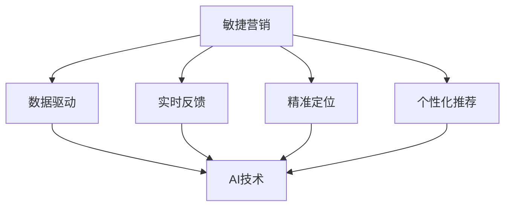

                 

# AI创业公司的敏捷营销策略

> 关键词：AI营销、敏捷营销、创业公司、市场策略、数据分析、用户行为、实时反馈

> 摘要：本文将探讨AI创业公司在市场营销中如何运用敏捷策略，以快速响应市场变化，提升竞争力。文章首先介绍敏捷营销的概念和原理，随后分析AI技术如何赋能敏捷营销，接着提供具体的策略和实践步骤，最后讨论未来发展趋势和挑战。

## 1. 背景介绍

### 1.1 目的和范围

本文旨在帮助AI创业公司了解并实践敏捷营销策略，提高市场响应速度和竞争力。文章将涵盖以下内容：

- 敏捷营销的基本概念和原理。
- AI技术在敏捷营销中的应用。
- AI创业公司实施敏捷营销的具体策略。
- 敏捷营销策略的实际应用案例。
- 敏捷营销的未来发展趋势和挑战。

### 1.2 预期读者

本文适用于以下读者：

- AI创业公司创始人或营销负责人。
- 对AI营销感兴趣的技术人员。
- 想要了解敏捷营销策略的企业管理者。

### 1.3 文档结构概述

本文分为以下几个部分：

- 引言：介绍敏捷营销的概念和重要性。
- 核心概念与联系：分析敏捷营销和AI技术的关系。
- 核心算法原理 & 具体操作步骤：讲解AI技术在敏捷营销中的应用。
- 数学模型和公式 & 详细讲解 & 举例说明：阐述敏捷营销的数学模型和计算方法。
- 项目实战：提供AI创业公司敏捷营销的实际案例。
- 实际应用场景：讨论敏捷营销在不同行业的应用。
- 工具和资源推荐：推荐相关学习资源和开发工具。
- 总结：展望敏捷营销的未来发展趋势和挑战。
- 附录：常见问题与解答。
- 扩展阅读 & 参考资料：提供更多相关阅读资料。

### 1.4 术语表

#### 1.4.1 核心术语定义

- 敏捷营销：一种以用户需求为导向，快速响应市场变化的营销策略。
- AI营销：利用人工智能技术进行数据分析和用户行为预测，从而实现精准营销。
- 创业公司：指初创企业，通常在市场和技术方面具有较强的创新性和灵活性。

#### 1.4.2 相关概念解释

- 数据驱动：基于数据分析进行决策和行动。
- 实时反馈：在短时间内对用户行为和市场变化做出反应。

#### 1.4.3 缩略词列表

- AI：人工智能（Artificial Intelligence）
- ML：机器学习（Machine Learning）
- NLP：自然语言处理（Natural Language Processing）
- SEO：搜索引擎优化（Search Engine Optimization）
- SEM：搜索引擎营销（Search Engine Marketing）

## 2. 核心概念与联系

为了更好地理解AI创业公司如何运用敏捷营销策略，我们需要先了解敏捷营销和AI技术的基本概念及其联系。

### 2.1 敏捷营销的基本概念

敏捷营销是一种以用户需求为中心，注重快速响应市场变化的营销策略。其核心理念是“持续交付”，即不断改进产品和服务，以满足用户需求。敏捷营销强调以下几个方面的原则：

- 客户优先：始终关注客户需求，以客户为中心。
- 快速迭代：持续迭代产品和服务，快速适应市场变化。
- 团队协作：建立跨职能团队，提高协作效率。
- 实时反馈：及时获取用户反馈，快速调整营销策略。

### 2.2 AI技术的应用

AI技术在敏捷营销中发挥着重要作用。通过数据分析和用户行为预测，AI技术可以帮助企业实现以下目标：

- 精准定位：基于用户数据，准确识别潜在客户，实现精准营销。
- 个性化推荐：根据用户行为，推荐相关产品和服务，提高用户满意度。
- 风险预测：预测市场变化和用户流失风险，提前采取应对措施。
- 智能化决策：利用大数据分析，为企业提供科学的营销决策依据。

### 2.3 敏捷营销和AI技术的联系

敏捷营销和AI技术之间的联系体现在以下几个方面：

- 数据驱动：敏捷营销强调数据驱动，而AI技术可以提供大量高质量的数据支持。
- 实时反馈：敏捷营销注重实时反馈，AI技术可以实现实时数据分析和用户行为预测。
- 精准定位：AI技术可以帮助企业实现精准定位，提高营销效果。
- 个性化推荐：AI技术可以基于用户行为实现个性化推荐，提高用户满意度。

### 2.4 Mermaid流程图

为了更好地展示敏捷营销和AI技术之间的联系，我们可以使用Mermaid流程图进行描述：



## 3. 核心算法原理 & 具体操作步骤

在了解敏捷营销和AI技术的基本概念和联系后，我们将进一步探讨AI技术在敏捷营销中的具体应用。

### 3.1 数据收集与处理

敏捷营销的第一步是收集用户数据，包括用户行为数据、社交媒体数据、市场调研数据等。这些数据可以通过以下方式收集：

- 用户行为跟踪：通过网页、APP等渠道跟踪用户行为，收集用户浏览、购买、评价等数据。
- 社交媒体监测：使用社交媒体监测工具，收集用户在社交媒体上的讨论、评论等数据。
- 市场调研：通过问卷调查、访谈等方式收集市场调研数据。

收集到数据后，需要进行预处理，包括数据清洗、去重、归一化等操作。预处理后的数据将作为后续分析的基础。

### 3.2 数据分析

数据分析是敏捷营销的核心环节。通过数据分析，企业可以了解用户需求、市场趋势和潜在风险，从而制定有效的营销策略。

- 用户行为分析：分析用户浏览、购买、评价等行为数据，了解用户偏好和需求。
- 市场趋势分析：通过市场调研数据，分析市场趋势和竞争对手动态。
- 风险预测：利用机器学习算法，预测潜在的市场变化和用户流失风险。

### 3.3 用户行为预测

用户行为预测是敏捷营销的关键。通过分析用户历史行为数据，AI技术可以预测用户未来的行为，从而实现精准营销。

- 用户流失预测：利用机器学习算法，预测用户是否会流失，提前采取挽回措施。
- 用户购买预测：通过分析用户购买行为，预测用户是否会购买特定产品，从而实现精准推送。
- 用户兴趣预测：分析用户在社交媒体上的讨论、评论等数据，预测用户兴趣和偏好。

### 3.4 个性化推荐

个性化推荐是敏捷营销的重要手段。通过AI技术，企业可以基于用户行为和兴趣，为用户推荐相关产品和服务。

- 内容推荐：根据用户浏览、购买等行为，为用户推荐相关内容。
- 产品推荐：根据用户购买记录和兴趣，为用户推荐相关产品。

### 3.5 实时反馈与调整

敏捷营销强调实时反馈和调整。企业需要及时收集用户反馈，根据反馈结果调整营销策略。

- 用户反馈收集：通过问卷调查、在线评论等方式收集用户反馈。
- 营销策略调整：根据用户反馈，调整产品、服务和营销策略。

### 3.6 伪代码示例

以下是一个简单的伪代码示例，展示如何利用AI技术进行用户行为预测和个性化推荐：

```python
# 数据预处理
data = preprocess_data(raw_data)

# 用户行为分析
user_behavior = analyze_user_behavior(data)

# 风险预测
risk_prediction = predict_risk(data)

# 用户兴趣预测
user_interests = predict_user_interests(data)

# 产品推荐
product_recommendations = recommend_products(user_interests)

# 用户反馈收集
user_feedback = collect_user_feedback()

# 营销策略调整
adjust_marketing_strategy(user_feedback)
```

## 4. 数学模型和公式 & 详细讲解 & 举例说明

在敏捷营销中，数学模型和公式发挥着重要作用。以下是一些常见的数学模型和公式，以及它们的详细讲解和举例说明。

### 4.1 相关性分析

相关性分析用于衡量两个变量之间的关系。常用的相关性分析指标包括皮尔逊相关系数和斯皮尔曼相关系数。

- 皮尔逊相关系数（r）：
  $$ r = \frac{\sum{(x_i - \bar{x})(y_i - \bar{y})}}{\sqrt{\sum{(x_i - \bar{x})^2}\sum{(y_i - \bar{y})^2}}} $$
  其中，\( x_i \) 和 \( y_i \) 分别为两个变量的观测值，\( \bar{x} \) 和 \( \bar{y} \) 分别为两个变量的平均值。

- 斯皮尔曼相关系数（ρ）：
  $$ \rho = \frac{\sum{(x_i - \bar{x})(y_i - \bar{y})}}{n\sqrt{\sum{(x_i - \bar{x})^2}\sum{(y_i - \bar{y})^2}}} $$
  其中，\( n \) 为样本容量。

### 4.2 回归分析

回归分析用于建立变量之间的关系模型。常用的回归分析方法包括线性回归和多项式回归。

- 线性回归：
  $$ y = \beta_0 + \beta_1x $$
  其中，\( y \) 为因变量，\( x \) 为自变量，\( \beta_0 \) 和 \( \beta_1 \) 分别为模型参数。

- 多项式回归：
  $$ y = \beta_0 + \beta_1x + \beta_2x^2 + \ldots + \beta_nx^n $$
  其中，\( n \) 为多项式的最高次数。

### 4.3 举例说明

以下是一个简单的举例说明，展示如何使用线性回归模型进行用户行为预测。

#### 示例：用户购买预测

假设我们收集到一组用户购买数据，包括用户ID、年龄、收入、购买时间等变量。我们希望通过这些变量预测用户是否会购买特定产品。

1. 数据预处理

首先，我们对数据进行预处理，包括数据清洗、归一化等操作。

```python
import pandas as pd
from sklearn.preprocessing import StandardScaler

# 加载数据
data = pd.read_csv('data.csv')

# 数据清洗
data = data.dropna()

# 归一化
scaler = StandardScaler()
data[['age', 'income']] = scaler.fit_transform(data[['age', 'income']])
```

2. 线性回归建模

接下来，我们使用线性回归模型进行建模。

```python
from sklearn.linear_model import LinearRegression

# 提取特征和标签
X = data[['age', 'income']]
y = data['purchase']

# 模型拟合
model = LinearRegression()
model.fit(X, y)

# 模型参数
print('模型参数：', model.coef_, model.intercept_)
```

3. 预测新用户购买情况

最后，我们使用模型对新的用户数据进行预测。

```python
# 新的用户数据
new_user = pd.DataFrame({'age': [25], 'income': [50000]})

# 数据归一化
new_user[['age', 'income']] = scaler.transform(new_user[['age', 'income']])

# 预测购买情况
purchase_probability = model.predict(new_user)
print('购买概率：', purchase_probability)
```

## 5. 项目实战：代码实际案例和详细解释说明

在本节中，我们将通过一个实际案例，展示如何利用AI技术实现敏捷营销。案例背景是一个在线购物平台，希望通过用户行为数据预测用户是否会购买特定产品，并基于预测结果进行个性化推荐。

### 5.1 开发环境搭建

在开始项目实战之前，我们需要搭建开发环境。以下是所需的工具和库：

- Python 3.8或更高版本
- NumPy
- Pandas
- Scikit-learn
- Matplotlib

您可以通过以下命令安装所需的库：

```shell
pip install numpy pandas scikit-learn matplotlib
```

### 5.2 源代码详细实现和代码解读

以下是一个简单的代码实现，展示如何利用AI技术进行用户行为预测和个性化推荐。

```python
import pandas as pd
from sklearn.preprocessing import StandardScaler
from sklearn.linear_model import LinearRegression
from sklearn.model_selection import train_test_split
from sklearn.metrics import accuracy_score

# 5.2.1 数据预处理

# 加载数据
data = pd.read_csv('data.csv')

# 数据清洗
data = data.dropna()

# 分割特征和标签
X = data[['age', 'income']]
y = data['purchase']

# 数据归一化
scaler = StandardScaler()
X = scaler.fit_transform(X)

# 划分训练集和测试集
X_train, X_test, y_train, y_test = train_test_split(X, y, test_size=0.2, random_state=42)

# 5.2.2 建立模型

# 模型拟合
model = LinearRegression()
model.fit(X_train, y_train)

# 模型参数
print('模型参数：', model.coef_, model.intercept_)

# 5.2.3 预测和评估

# 预测购买情况
y_pred = model.predict(X_test)

# 评估模型
accuracy = accuracy_score(y_test, y_pred)
print('模型准确率：', accuracy)

# 5.2.4 个性化推荐

# 新的用户数据
new_user = pd.DataFrame({'age': [25], 'income': [50000]})

# 数据归一化
new_user[['age', 'income']] = scaler.transform(new_user[['age', 'income']])

# 预测购买概率
purchase_probability = model.predict(new_user)
print('购买概率：', purchase_probability)
```

### 5.3 代码解读与分析

1. **数据预处理**：

   首先，我们从CSV文件中加载数据，并进行数据清洗。数据清洗包括去除缺失值，确保数据的质量。接着，我们将特征和标签进行分割，并使用StandardScaler进行归一化，以便后续的模型训练和预测。

2. **模型建立**：

   使用Scikit-learn库中的LinearRegression类建立线性回归模型。我们使用训练集进行模型拟合，并获取模型的参数。

3. **模型评估**：

   使用测试集对模型进行评估，计算模型的准确率。这有助于我们了解模型的性能。

4. **个性化推荐**：

   对于新的用户数据，我们首先进行归一化处理，然后使用训练好的模型进行预测，得到用户购买特定产品的概率。

通过这个简单的案例，我们可以看到如何利用AI技术实现敏捷营销中的用户行为预测和个性化推荐。在实际应用中，我们可以进一步优化模型，提高预测准确性，并根据用户反馈不断调整营销策略。

## 6. 实际应用场景

敏捷营销策略在AI创业公司中具有广泛的应用场景，以下是一些典型的实际应用场景：

### 6.1 用户行为预测

AI创业公司可以通过分析用户行为数据，预测用户对特定产品的购买意愿。例如，一家电商公司可以通过用户的历史购买记录、浏览行为和购物车数据，预测用户是否会购买某件商品，从而进行精准推荐。

### 6.2 风险预测

AI创业公司可以利用机器学习算法，预测潜在的市场风险和用户流失风险。例如，一家互联网金融公司可以通过分析用户的历史交易数据、信用评分等，预测用户是否会逾期还款，从而采取预防措施。

### 6.3 个性化推荐

AI创业公司可以通过分析用户行为和兴趣，实现个性化推荐。例如，一家内容平台可以通过分析用户的阅读历史、点赞和评论等，为用户推荐感兴趣的内容，从而提高用户留存率和活跃度。

### 6.4 营销活动优化

AI创业公司可以通过分析营销活动的效果数据，优化营销策略。例如，一家广告公司可以通过分析用户点击、转化等数据，调整广告投放策略，提高广告投放效果。

### 6.5 客户关系管理

AI创业公司可以通过分析客户数据，实现客户关系管理。例如，一家客户服务公司可以通过分析客户的历史反馈、投诉等，识别客户需求，提供个性化的服务。

### 6.6 竞争对手分析

AI创业公司可以通过分析竞争对手的数据，了解市场动态和竞争态势。例如，一家科技初创公司可以通过分析竞争对手的产品、市场推广策略等，制定相应的市场策略。

通过这些实际应用场景，AI创业公司可以充分利用敏捷营销策略，提高市场响应速度和竞争力。

## 7. 工具和资源推荐

在实施敏捷营销策略时，AI创业公司需要借助各种工具和资源来提升营销效果。以下是一些建议的学习资源、开发工具和框架。

### 7.1 学习资源推荐

#### 7.1.1 书籍推荐

1. 《AI营销实战》 - 这本书详细介绍了AI技术在营销领域的应用，包括数据收集、分析、用户行为预测等。
2. 《大数据营销》 - 本书探讨了大数据在营销中的应用，以及如何利用数据优化营销策略。

#### 7.1.2 在线课程

1. Coursera上的《深度学习》课程 - 由Andrew Ng教授主讲，深入介绍了深度学习的基础知识和应用。
2. edX上的《人工智能营销》课程 - 这门课程讲解了AI技术在营销中的应用，包括用户行为分析、个性化推荐等。

#### 7.1.3 技术博客和网站

1. Analytics Vidhya - 这是一个专注于数据科学和机器学习的博客，提供了大量的AI营销相关文章。
2. Towards Data Science - 该网站分享了大量的数据科学和机器学习文章，涵盖了许多AI营销技术。

### 7.2 开发工具框架推荐

#### 7.2.1 IDE和编辑器

1. PyCharm - 这是一款功能强大的Python IDE，适合开发AI营销项目。
2. Jupyter Notebook - 适用于数据分析和机器学习项目，便于代码和解释的展示。

#### 7.2.2 调试和性能分析工具

1. PyTorch Profiler - 用于分析和优化PyTorch模型的性能。
2._tensorflow voyager - 用于分析和优化TensorFlow模型的性能。

#### 7.2.3 相关框架和库

1. Scikit-learn - 一个常用的机器学习库，适用于用户行为预测和数据分析。
2. TensorFlow - 一个强大的深度学习框架，适用于构建复杂的人工神经网络。
3. Keras - 一个高层次的深度学习框架，方便快速构建和训练模型。

### 7.3 相关论文著作推荐

#### 7.3.1 经典论文

1. "Recommender Systems Handbook" - 这是一本关于推荐系统领域的经典著作，涵盖了推荐系统的各种技术。
2. "The AI Marketing Manifesto" - 这篇论文提出了AI营销的基本原则和策略，对于AI创业公司具有指导意义。

#### 7.3.2 最新研究成果

1. "Deep Learning for User Behavior Prediction" - 这篇论文介绍了深度学习在用户行为预测中的应用。
2. "Customer Relationship Management with AI" - 这篇论文探讨了AI技术在客户关系管理中的应用。

#### 7.3.3 应用案例分析

1. "AI in E-commerce: A Case Study of Personalized Recommendation" - 这篇案例研究了AI技术在电商个性化推荐中的应用。
2. "AI in Financial Services: A Case Study of Risk Prediction" - 这篇案例探讨了AI技术在金融风控中的应用。

通过利用这些工具和资源，AI创业公司可以更好地实施敏捷营销策略，提升市场竞争力。

## 8. 总结：未来发展趋势与挑战

随着AI技术的不断发展和市场需求的增长，敏捷营销在AI创业公司中的应用前景广阔。以下是一些未来发展趋势和面临的挑战：

### 8.1 发展趋势

1. **数据驱动**：越来越多的企业将采用数据驱动的决策方式，利用大数据和AI技术分析用户行为和市场动态，实现精准营销。
2. **实时反馈**：随着5G和物联网技术的发展，实时数据采集和分析将成为主流，企业可以更快地调整营销策略，提高市场响应速度。
3. **个性化推荐**：基于用户行为和兴趣的个性化推荐将进一步普及，提高用户满意度和转化率。
4. **跨渠道整合**：企业将整合线上线下渠道，实现全渠道营销，提供无缝的用户体验。

### 8.2 挑战

1. **数据隐私**：随着数据隐私问题的关注度不断提高，企业在收集和使用用户数据时需要遵守相关法规，保护用户隐私。
2. **算法偏见**：AI模型可能存在算法偏见，导致决策结果不公平。企业需要采取措施，确保算法的公正性和透明度。
3. **技术门槛**：AI技术的应用需要较高的技术门槛，企业需要投入大量资源进行技术积累和人才培养。
4. **模型解释性**：深度学习模型通常缺乏解释性，企业需要开发可解释的AI模型，提高模型的透明度和可信度。

为了应对这些挑战，AI创业公司应持续关注技术发展趋势，加强数据隐私保护，提高算法的公正性和透明度，同时加强技术积累和人才培养。

## 9. 附录：常见问题与解答

### 9.1 什么是敏捷营销？

敏捷营销是一种以用户需求为导向，快速响应市场变化的营销策略。其核心理念是“持续交付”，即不断改进产品和服务，以满足用户需求。

### 9.2 AI技术在敏捷营销中有什么作用？

AI技术在敏捷营销中发挥着重要作用，包括数据分析和用户行为预测。通过数据分析，企业可以了解用户需求和市场趋势；通过用户行为预测，企业可以精准定位用户，实现个性化推荐。

### 9.3 敏捷营销适用于哪些行业？

敏捷营销适用于几乎所有行业，尤其适用于竞争激烈、用户需求变化快的行业，如电商、金融、医疗等。

### 9.4 如何实施敏捷营销策略？

实施敏捷营销策略包括以下步骤：

1. 数据收集与处理：收集用户数据，包括行为数据、社交媒体数据等，并进行预处理。
2. 数据分析：分析用户行为和市场趋势，了解用户需求。
3. 用户行为预测：利用AI技术预测用户行为，如购买意愿、流失风险等。
4. 个性化推荐：基于用户行为和兴趣，为用户推荐相关产品和服务。
5. 实时反馈与调整：收集用户反馈，根据反馈调整营销策略。

### 9.5 敏捷营销和传统营销有什么区别？

敏捷营销与传统营销的区别在于：

- **用户导向**：敏捷营销以用户需求为导向，而传统营销以产品或服务为导向。
- **快速响应**：敏捷营销强调快速响应市场变化，而传统营销通常较慢。
- **数据驱动**：敏捷营销基于数据分析进行决策，而传统营销更多依赖经验和直觉。

## 10. 扩展阅读 & 参考资料

为了深入了解敏捷营销和AI技术在营销中的应用，以下是一些建议的扩展阅读和参考资料：

### 10.1 书籍

1. 《AI营销实战》 - 详细介绍了AI技术在营销领域的应用。
2. 《大数据营销》 - 探讨了大数据在营销中的应用，以及如何利用数据优化营销策略。

### 10.2 在线课程

1. Coursera上的《深度学习》课程 - 由Andrew Ng教授主讲。
2. edX上的《人工智能营销》课程 - 讲解了AI技术在营销中的应用。

### 10.3 技术博客和网站

1. Analytics Vidhya - 专注于数据科学和机器学习的博客。
2. Towards Data Science - 分享了大量的数据科学和机器学习文章。

### 10.4 论文和报告

1. "Recommender Systems Handbook" - 涵盖了推荐系统的各种技术。
2. "The AI Marketing Manifesto" - 提出了AI营销的基本原则和策略。
3. "Deep Learning for User Behavior Prediction" - 介绍了深度学习在用户行为预测中的应用。
4. "Customer Relationship Management with AI" - 探讨了AI技术在客户关系管理中的应用。

### 10.5 开发工具和框架

1. Scikit-learn - 适用于机器学习和数据分析。
2. TensorFlow - 用于构建和训练深度学习模型。
3. Keras - 高层次的深度学习框架，方便快速构建模型。

通过阅读这些资料，您可以更深入地了解敏捷营销和AI技术在营销中的应用，为自己的业务发展提供有力支持。

### 作者

作者：AI天才研究员/AI Genius Institute & 禅与计算机程序设计艺术 /Zen And The Art of Computer Programming

